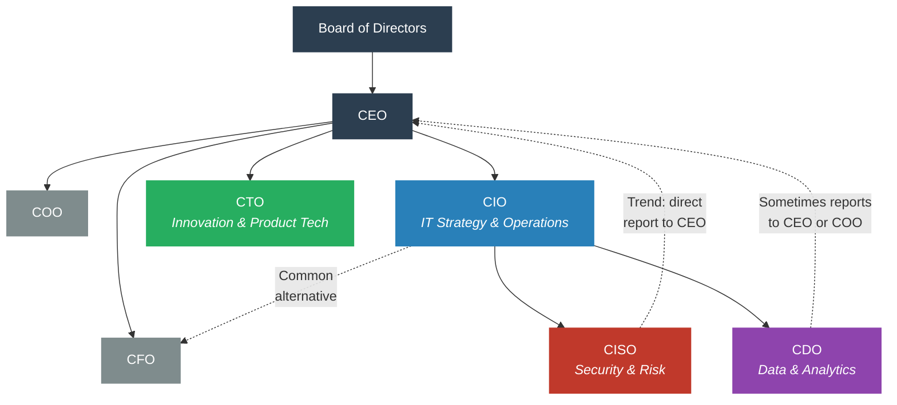
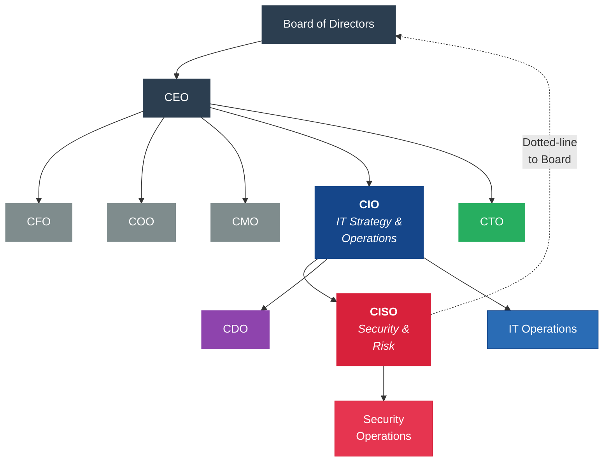
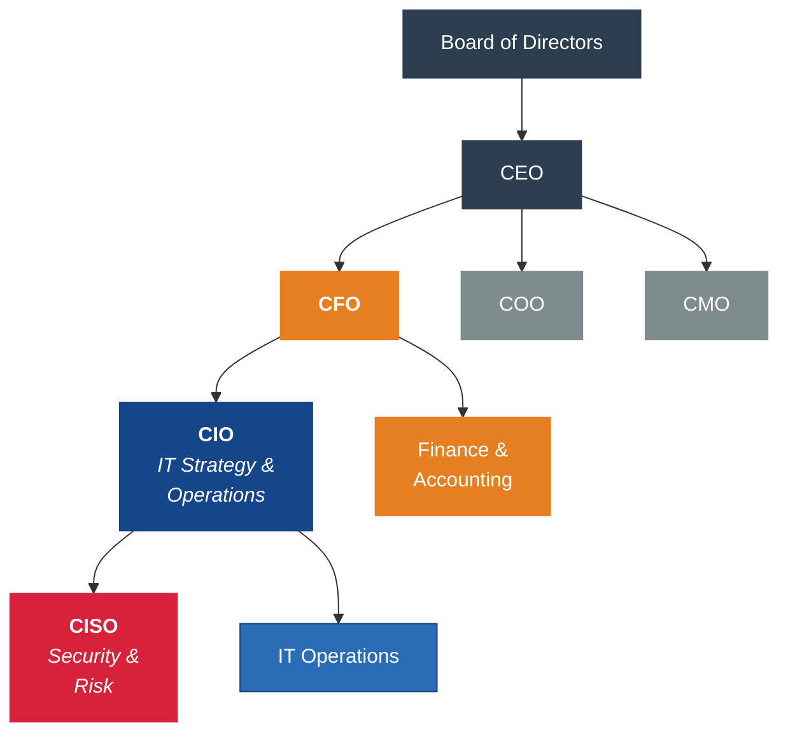
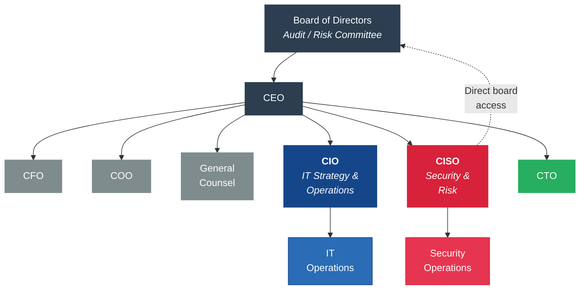
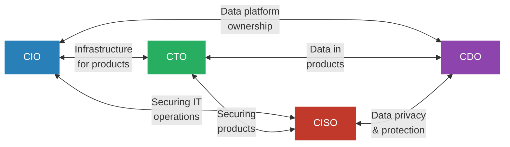

---
tags:
  - governance
  - leadership
  - CIO
  - CISO
reading_time: 25
difficulty: Foundational
---

# C-Suite IT Leadership Roles

## Overview

Every major organization today depends on technology to operate, compete, and grow. But technology does not manage itself — it requires dedicated executive leadership. Over the past three decades, a set of specialized C-suite roles has emerged to provide that leadership: the CIO, CISO, CTO, and CDO. Each role carries distinct responsibilities, reports through different channels, and focuses on different dimensions of the organization's technology landscape.

For MBA students, understanding these roles is critical regardless of your career path. If you lead one of these functions, you need to know how to work effectively with the CEO, CFO, and board. If you lead a line of business, you need to know whom to engage when you need technology support, when you face a security incident, or when you want to launch a data-driven initiative. And if you aspire to the CEO role itself, you will be the one deciding how these positions are structured, who fills them, and how they are held accountable.

This page examines each of the four major IT leadership roles in depth — their origins, responsibilities, reporting relationships, and the tensions that arise when their mandates overlap. We also explore how these roles are evolving as organizations face new challenges from AI, cybersecurity threats, and the growing strategic importance of data.

!!! info "Why This Matters for MBA Students"

    As a business leader, you will interact with CIOs, CISOs, CTOs, and CDOs throughout your career — whether you report to them, they report to you, or you collaborate with them across functions. Understanding what each role owns, what metrics they care about, and what pressures they face will make you a more effective partner and decision-maker. In board settings, you may be asked to evaluate whether the organization has the right IT leadership structure. In strategy discussions, you will need to know which executive to engage for digital transformation versus cybersecurity risk versus product innovation. Getting this wrong wastes time, creates conflict, and can leave critical gaps in organizational capability.

---

## Key Concepts

### CIO — Chief Information Officer

The CIO is the senior executive responsible for the overall management of IT within an organization. The role emerged in the 1980s as companies began to recognize that information systems were too important — and too expensive — to be managed as a back-office function.

#### Evolution of the CIO Role

The CIO role has undergone a dramatic transformation over the past four decades:

| Era | CIO Focus | Strategic Posture |
|-----|-----------|-------------------|
| **1980s-1990s** | Data center management, mainframe operations | "Keep the lights on" — ensure systems are running |
| **2000s** | ERP implementations, Y2K, cost optimization | Operational efficiency — do more with less |
| **2010s** | Cloud migration, digital transformation | Strategic partner — drive business innovation |
| **2020s-present** | AI strategy, cybersecurity governance, data monetization | Business leader — sit at the strategy table as a peer |

In the early years, the CIO was essentially a senior IT manager. Today, the best CIOs are business strategists who happen to lead the technology function. They spend as much time with customers, business unit leaders, and the board as they do with their own IT teams.

#### Core Responsibilities

- **IT strategy and roadmap** — Defining the multi-year technology direction aligned with business goals
- **IT budget management** — Overseeing what is typically one of the largest cost centers in the organization (often 3-7% of revenue)
- **Digital transformation** — Leading organization-wide initiatives to modernize operations and customer experiences
- **Vendor and partner management** — Managing relationships with technology providers, outsourcing partners, and system integrators
- **IT talent** — Recruiting, retaining, and developing technical staff in a competitive labor market
- **Business alignment** — Ensuring that IT investments deliver measurable value to the business units they serve
- **IT governance** — Establishing policies, standards, and decision-making processes for technology

#### Reporting Structure

The CIO most commonly reports to the CEO, though in some organizations the role reports to the CFO (a legacy of the era when IT was viewed primarily as a cost center). Research consistently shows that CIOs who report to the CEO have greater strategic influence and drive better business outcomes. When the CIO reports to the CFO, the role tends to be more operationally focused and less involved in strategic planning.

!!! question "Quick Check"
    - A company's CIO reports to the CFO and spends 80% of their time on cost reduction and vendor negotiations. Using the CIO evolution table, what era does this behavior reflect, and what organizational signals would tell you the company is ready to elevate the role?
    - If you were a CEO hiring a new CIO, how would you evaluate whether a candidate is a "business strategist who happens to lead technology" versus a "senior IT manager"? What interview questions or evidence would distinguish the two?

---

### CISO — Chief Information Security Officer

The CISO is responsible for protecting the organization's information assets, managing cybersecurity risk, and ensuring compliance with security-related regulations. The role gained prominence after a series of high-profile data breaches in the 2000s and 2010s made it clear that cybersecurity required dedicated executive leadership.

#### Why the CISO Role Exists

Cybersecurity is fundamentally different from other IT disciplines. It requires an adversarial mindset — the CISO must think like an attacker. It also requires independence — the CISO sometimes needs to slow down or block initiatives that other executives are pushing if those initiatives create unacceptable risk. This tension is why the CISO's reporting structure is one of the most debated topics in IT governance.

#### Core Responsibilities

- **Cybersecurity strategy** — Defining the organization's approach to preventing, detecting, and responding to cyber threats
- **Risk management** — Identifying and quantifying information security risks, and presenting them to the board in business terms
- **Regulatory compliance** — Ensuring the organization meets requirements under SOX, HIPAA, GDPR, PCI-DSS, and industry-specific regulations
- **Incident response** — Leading the organization's response when breaches or attacks occur, including communication with regulators, customers, and the media
- **Security architecture** — Establishing technical standards for how systems are built and secured
- **Security awareness** — Training employees to recognize phishing, social engineering, and other threats
- **Third-party risk** — Assessing the security posture of vendors, partners, and suppliers

#### The Reporting Structure Debate

Where the CISO reports is one of the most consequential governance decisions an organization can make:

!!! warning "The CISO Reporting Dilemma"

    **Reporting to the CIO** is the traditional model. It makes operational sense because security is deeply intertwined with IT infrastructure. However, it creates a conflict of interest: the CIO is measured on delivering projects quickly and cost-effectively, while the CISO's job is to ensure those projects are secure — which often means slower and more expensive. A CISO who reports to the CIO may face pressure to approve shortcuts.

    **Reporting to the CEO or board** gives the CISO independence and elevates security as a business priority. This model has gained traction after regulatory bodies (including the SEC) began requiring boards to disclose their cybersecurity governance. The downside is that a CISO without a strong operational link to the IT organization may lack visibility into day-to-day technology decisions.

    There is no single correct answer. The right structure depends on the organization's risk profile, regulatory environment, and culture. But the trend is clearly toward greater CISO independence.

---

### CTO — Chief Technology Officer

The CTO is the executive responsible for technology innovation, product development, and technical architecture. While the CIO focuses inward on the technology that runs the business, the CTO focuses outward on the technology that the business sells or that creates competitive differentiation.

#### CTO vs. CIO — The Critical Distinction

This distinction is one of the most important concepts for MBA students to grasp:

| Dimension | CIO (Inward-Facing) | CTO (Outward-Facing) |
|-----------|---------------------|----------------------|
| **Primary focus** | IT operations and infrastructure | Product technology and innovation |
| **Key question** | "How do we run the business efficiently?" | "How do we build better products?" |
| **Stakeholders** | Internal business units, employees | Customers, product teams, R&D |
| **Budget type** | Mostly OpEx (operations) | Mostly R&D investment |
| **Success measured by** | Uptime, cost efficiency, user satisfaction | Product launches, patents, technical differentiation |
| **Risk posture** | Stability and reliability | Experimentation and calculated risk |

Not every organization has both roles. In many traditional enterprises (banks, retailers, manufacturers), the CIO handles all technology leadership and there is no CTO. In technology companies, the CTO is often the more senior role. Some organizations have both, with clearly defined lanes.

#### Core Responsibilities

- **Technology vision and roadmap** — Setting the long-term direction for the organization's technology capabilities
- **Product development** — Leading the engineering teams that build customer-facing products and platforms
- **R&D and innovation** — Evaluating emerging technologies (AI, ML, IoT, blockchain) and determining which to invest in
- **Technical architecture** — Making decisions about technology platforms, programming languages, and system design
- **Build vs. buy decisions** — Determining whether to develop technology in-house or acquire it from vendors
- **Technical talent** — Recruiting and leading engineers, architects, and data scientists
- **Technology partnerships** — Building relationships with technology partners, startups, and academic institutions

#### When Organizations Need a CTO

The CTO role is most valuable when technology is central to the company's product or service offering. A fintech company, a SaaS provider, or an autonomous vehicle manufacturer absolutely needs a CTO. A regional hospital system or a law firm may not — the CIO can typically cover both operational and strategic technology needs.

---

### CDO — Chief Data Officer

The CDO is the newest of the four roles, emerging in the 2010s as organizations recognized that data had become a strategic asset requiring dedicated executive leadership. The CDO is responsible for data governance, data strategy, analytics capabilities, and fostering a data-driven culture across the organization.

#### Why the CDO Role Emerged

For decades, data was treated as a byproduct of business operations — generated by ERP systems, CRM platforms, and transactional databases, but rarely managed as a strategic resource. Several forces converged to change this:

- **Big data** — The explosion of data from digital channels, IoT devices, and social media created both opportunities and governance challenges
- **Analytics and AI** — Advanced analytics and ML capabilities made it possible to extract competitive insights from data, but only if the data was clean, accessible, and well-governed
- **Regulation** — GDPR, CCPA, and other data privacy regulations created significant compliance obligations that required executive ownership
- **Data monetization** — Organizations began recognizing that their data could be a revenue source, not just a cost of doing business

#### Core Responsibilities

- **Data governance** — Establishing policies for data quality, data lineage, data access, and data lifecycle management
- **Data strategy** — Defining how the organization will collect, manage, and leverage data as a strategic asset
- **Analytics and BI** — Overseeing the tools, teams, and processes that turn raw data into business insights
- **AI and ML enablement** — Ensuring the organization has the data infrastructure and quality needed to support AI initiatives
- **Data privacy and ethics** — Managing compliance with data protection regulations and establishing ethical guidelines for data use
- **Data literacy** — Building a data-driven culture by training business users to interpret and use data effectively
- **Master data management** — Ensuring that critical data entities (customers, products, suppliers) are consistent and accurate across systems

#### The CDO's Organizational Challenge

The CDO role has the highest turnover rate of any C-suite technology position. Research from NewVantage Partners consistently shows that many CDOs struggle because:

1. **Unclear mandate** — The boundaries between the CDO, CIO, and CTO on data-related matters are often fuzzy
2. **Cultural resistance** — Building a data-driven culture requires changing how people make decisions, which creates friction
3. **Measurement difficulty** — The value of better data governance is real but hard to quantify in financial terms
4. **Organizational politics** — Business units often resist centralized data governance, viewing it as bureaucratic overhead

!!! question "Quick Check"
    - Given the CDO's high turnover rate, would you recommend that a mid-size insurance company create a standalone CDO role, or assign data governance responsibilities to the CIO? What factors would tip your recommendation one way or the other?
    - A CTO proposes building an AI-powered product feature using customer data that the CDO has flagged as insufficiently governed. How should this conflict be resolved, and whose authority should prevail?

---

## Frameworks & Models

### Typical Reporting Structure

The following diagram illustrates the most common reporting relationships for IT leadership roles. Note that actual structures vary significantly by organization — the reporting lines shown here represent prevalent patterns, not universal rules.

**Solid lines** represent the most common reporting relationships. **Dashed lines** represent alternative structures that are increasingly common. The key takeaway is that reporting relationships are not fixed — they reflect the organization's strategic priorities and governance philosophy.

### IT Governance Structures: Common Variants

The organizational placement of the CIO and CISO is one of the most consequential governance decisions an organization can make. Research from Deloitte, Gartner, and ISACA consistently shows that reporting structure directly affects IT investment effectiveness, security posture, and the speed of digital transformation. Below are the three most common structural variants, each with distinct historical origins, strengths, and trade-offs.

#### Variant 1: CIO Reports to CEO, CISO Reports to CIO

This is the **most common structure** in large enterprises, found in approximately 40-50% of organizations. The CIO has a seat at the executive table and the CISO reports directly to the CIO.

**Historical context**: This structure emerged in the 1990s-2000s as the CISO role was first created — typically carved out of the CIO's IT organization. It made sense operationally because security was viewed primarily as a technical discipline closely tied to IT infrastructure management.

**Strengths:**

- Tight coordination between security and IT operations — the CISO has direct visibility into infrastructure decisions, development pipelines, and system configurations
- Clear single executive (CIO) accountable for all technology, including security
- Efficient resource sharing between IT and security teams

**Trade-offs:**

- **Conflict of interest** — The CIO is measured on project delivery speed and cost efficiency; the CISO's job is to slow things down when security is at risk. A CISO who reports to the CIO may face pressure to approve shortcuts or deprioritize security in favor of business deadlines.
- **Budget competition** — Security investment competes directly with other IT priorities within the CIO's budget. In budget-constrained years, security investments may be deferred.
- **Suppressed escalation** — Security concerns may not reach the board or CEO if the CIO filters or contextualizes them. This was a contributing factor in the Equifax breach.

**Mitigation**: Best practice in this model is to establish a **dotted-line reporting relationship** between the CISO and the Board's Audit or Risk Committee, ensuring that the CISO can escalate critical concerns independently.

#### Variant 2: CIO Reports to CFO, CISO Reports to CIO

This structure was the **dominant model in the 1990s and early 2000s**, when IT was viewed primarily as a cost center. It persists in approximately 15-25% of organizations, particularly in industries where technology is not the primary product (e.g., some manufacturing, healthcare, and government organizations).

**Historical context**: This model dates to the era when IT was primarily about back-office automation — accounting systems, payroll, billing. IT was a cost to be managed, and the CFO was the natural executive to oversee cost centers. The structure persists in organizations that have not fully embraced technology as a strategic differentiator.

**Strengths:**

- Strong financial discipline over IT spending — the CFO ensures ROI rigor and cost accountability
- Natural alignment between IT investments and financial planning cycles
- May be appropriate for organizations where IT is primarily a support function with predictable, operational technology needs

**Trade-offs:**

- **Strategic marginalization** — The CIO is two levels removed from the CEO, making it difficult to influence business strategy. Technology decisions get filtered through a financial lens, which can bias toward cost-cutting over innovation.
- **Innovation stifling** — CFOs are trained to minimize risk and optimize costs. When the CIO reports to the CFO, proposed technology investments face a higher burden of financial justification, which can delay or block strategic initiatives (cloud migration, digital transformation, AI adoption) that have long payback periods.
- **Security further buried** — With the CISO reporting to a CIO who reports to a CFO, security is three levels from the CEO and has minimal board visibility.

**Research insight**: A 2023 Deloitte CIO Survey found that CIOs who report to the CEO are **twice as likely** to rate their organization's digital transformation as "advanced" compared to CIOs who report to the CFO. The reporting structure correlates strongly with the organization's strategic ambition for technology.

#### Variant 3: CISO as a Peer to the CIO (Independent CISO)

This is the **fastest-growing structural variant**, now found in approximately 20-30% of large enterprises and increasingly recommended by regulators, auditors, and governance frameworks. The CISO reports directly to the CEO, COO, General Counsel, or Chief Risk Officer — independently of the CIO.

**Historical context**: This variant gained momentum after high-profile breaches (Target 2013, Equifax 2017) where subordinated CISOs lacked the organizational authority to force remediation of known vulnerabilities. The SEC's 2023 cybersecurity disclosure rules — which require public companies to describe board oversight of cybersecurity — further accelerated the trend. ISACA and NACD governance guidance now recommends CISO independence from the CIO.

**Strengths:**

- **Independence** — The CISO can raise security concerns without CIO filtering or conflicts of interest. Security decisions are not subordinated to project delivery timelines.
- **Board visibility** — A CISO who is a direct report to the CEO or who has direct board access can provide unfiltered risk assessments that the board needs for effective oversight.
- **Regulatory alignment** — This structure aligns with SEC expectations for cybersecurity governance and with NIST CSF 2.0's Govern function emphasis.
- **Balanced authority** — The CISO and CIO can negotiate as peers, creating healthy tension between innovation/agility and security.

**Trade-offs:**

- **Coordination overhead** — When security and IT are separate organizations, coordination requires more deliberate processes. The CISO may not have real-time visibility into IT architecture decisions.
- **Potential friction** — Without clear RACI (Responsible, Accountable, Consulted, Informed) matrices, the CIO and CISO may conflict over technology decisions where security implications are debatable.
- **Cost** — A peer-level CISO requires a dedicated security organization with its own budget, staff, and infrastructure — increasing organizational overhead.

**Mitigation**: Organizations adopting this model should establish formal coordination mechanisms between the CIO and CISO — joint governance committees, shared incident response processes, and integrated architecture review boards.

#### Choosing the Right Structure

There is no universally correct answer. The right structure depends on several factors:

| Factor | Favors CISO Under CIO | Favors Independent CISO |
|--------|----------------------|-------------------------|
| **Organization size** | Smaller organizations with limited executive capacity | Large enterprises with dedicated security needs |
| **Industry regulation** | Lightly regulated industries | Heavily regulated (financial services, healthcare, defense, critical infrastructure) |
| **Threat profile** | Low cyber risk exposure | High-value targets (large customer data, IP, critical infrastructure) |
| **Board expectations** | Boards with limited cyber governance focus | Boards with active audit/risk committees and cyber expertise |
| **Organizational maturity** | Early-stage security programs needing IT integration | Mature security programs requiring independent authority |
| **Breach history** | No significant incidents | Post-breach restructuring or industry peer incidents |

!!! question "Quick Check"
    - A fintech startup (150 employees, pre-IPO) currently has its CISO reporting to the CIO. An investor on the board insists on moving to Variant 3 (independent CISO) before the IPO. Evaluate whether this timing makes sense, considering both the benefits and the organizational overhead.
    - Looking at the three structural variants, which one would you recommend for a large hospital system that processes millions of patient records and is subject to HIPAA? What specific factors in the healthcare context drive your choice?

### Role Comparison Matrix

| Dimension | CIO | CISO | CTO | CDO |
|-----------|-----|------|-----|-----|
| **Primary mandate** | Run IT, align with business | Protect information assets | Drive technology innovation | Govern and leverage data |
| **Orientation** | Inward (operations) | Inward (defense) | Outward (products/markets) | Cross-functional (data flows) |
| **Most common report** | CEO (or CFO) | CIO (or CEO) | CEO | CIO (or CEO) |
| **Budget focus** | IT operations + transformation | Security tools + compliance | R&D + product engineering | Data platforms + analytics |
| **Key metrics** | IT spend as % of revenue, uptime, project delivery rate | Incidents detected/resolved, time to patch, compliance audit results | Time to market, product adoption, patents filed | Data quality scores, analytics adoption, regulatory compliance |
| **Typical background** | IT management, consulting | Security engineering, risk management | Software engineering, R&D | Data science, analytics, consulting |
| **Board interaction** | Regular (IT strategy updates) | Increasing (cyber risk briefings) | Periodic (product/innovation updates) | Growing (data strategy, AI governance) |
| **Biggest tension** | Balancing cost control with innovation | Slowing things down to keep them secure | "Shiny object" risk vs. practical delivery | Centralizing data vs. business unit autonomy |

### How These Roles Interact

The four IT leadership roles do not operate in isolation. Their work intersects constantly, and managing those intersections well is a hallmark of mature IT governance.

**Common interaction patterns and friction points:**

- **CIO and CTO** — The CIO manages the infrastructure that the CTO's products run on. Friction arises when the CTO wants cutting-edge technology that the CIO views as operationally risky, or when the CIO wants to standardize platforms that the CTO sees as constraining innovation.
- **CIO and CISO** — The CIO needs to deliver projects on time and budget; the CISO needs to ensure they are secure. This is a healthy tension when managed well, but it becomes dysfunctional when the CISO is overruled on security concerns to meet a deadline.
- **CIO and CDO** — Both have a claim on data infrastructure. The CIO owns the platforms (databases, data warehouses, cloud services), while the CDO owns the governance and strategy. Unclear boundaries lead to turf battles.
- **CTO and CISO** — Product teams want to move fast; security wants to ensure products do not introduce vulnerabilities. DevSecOps practices help integrate security into the product development lifecycle, but cultural tension remains.
- **CTO and CDO** — The CTO builds data-intensive products; the CDO governs the data those products use. Conflicts arise around data access policies, privacy requirements, and data sharing with third parties.
- **CISO and CDO** — Both care deeply about data, but from different angles. The CISO focuses on protecting data from unauthorized access; the CDO focuses on making data accessible for analytics. These goals are in tension, and resolving them requires thoughtful data classification and access control policies.

---

## Real-World Applications

### Example 1: The Target Data Breach (2013)

In 2013, Target suffered a massive data breach that exposed the credit card information of 40 million customers. At the time, Target's CISO function reported deep within the IT organization, without direct access to the CEO or board. Security warnings from monitoring tools were not escalated effectively. In the aftermath, Target elevated cybersecurity to a board-level concern, restructured its IT leadership, and hired a new CIO with a mandate to rebuild the technology organization. The breach cost Target over $200 million and led to the resignation of both the CIO and CEO. **Lesson:** Reporting structure matters. When the CISO lacks organizational independence, critical security warnings can be suppressed or deprioritized.

### Example 2: Capital One's CDO-Led Transformation

Capital One was one of the first major financial institutions to create a CDO role and invest heavily in data and analytics capabilities. Under the leadership of its data-focused executives, Capital One rebuilt its technology stack around cloud computing and ML, using data to personalize customer offers, detect fraud in real time, and make faster lending decisions. The company became a case study in how a data-driven culture can create competitive advantage in a traditional industry. **Lesson:** The CDO role can be transformative when it has genuine executive support, a clear mandate, and investment in both technology and talent.

### Example 3: Amazon's CTO as Innovation Driver

Amazon's CTO, Werner Vogels, has been instrumental in shaping the company's technology strategy since 2005. Vogels championed the service-oriented architecture that became the foundation for AWS, now the world's largest cloud computing platform. His outward-facing role — speaking at conferences, engaging with customers, and publishing technical thought leadership — exemplifies the CTO as the organization's technology evangelist. **Lesson:** The CTO role is most impactful when it is genuinely outward-facing, focused on where technology can create new markets and revenue streams rather than just optimizing internal operations.

### Example 4: CIO-CISO Tension at Equifax (2017)

The Equifax breach exposed the personal information of 147 million consumers. Post-breach investigations revealed that the CISO reported to the CIO, who was also the Chief Legal Officer — a reporting structure that diffused accountability. A known vulnerability went unpatched for months because the security team lacked the organizational authority to force remediation. The breach ultimately cost Equifax over $1.4 billion and resulted in congressional hearings. **Lesson:** When security does not have an independent voice in the organization, vulnerabilities that should be urgent get deprioritized in favor of other business objectives.

---

## Common Pitfalls

!!! warning "Pitfall 1: Treating the CIO as a Cost Center Manager"

    Organizations that view the CIO as primarily responsible for "keeping costs down" miss the strategic potential of the role. The CIO should be a peer in the executive team, contributing to business strategy — not just responding to it. When the CIO reports to the CFO and is measured primarily on IT cost reduction, the organization typically underinvests in innovation and accumulates technical debt.

!!! warning "Pitfall 2: Creating Roles Without Clear Mandates"

    Adding a CDO or CTO to the org chart without clearly defining the boundaries between that role and the CIO creates confusion, turf battles, and organizational paralysis. Before creating a new C-suite technology role, the CEO and board should explicitly define: What does this person own? What decisions can they make unilaterally? How will conflicts with other technology leaders be resolved?

!!! warning "Pitfall 3: Subordinating Security to Speed"

    When the CISO reports to a CIO who is under pressure to deliver projects quickly, security becomes a bottleneck to be minimized rather than a risk to be managed. This almost always ends badly. Organizations should ensure the CISO has a direct communication channel to the board, even if the day-to-day reporting line runs through the CIO.

!!! warning "Pitfall 4: Assuming One Structure Fits All"

    A technology company, a hospital system, and a manufacturing firm have fundamentally different needs for IT leadership. Copying another company's org chart without understanding the underlying strategic rationale leads to misaligned roles and wasted executive talent. The right structure depends on the organization's industry, size, risk profile, and strategic priorities.

---

## Discussion Questions

1. **Reporting structure trade-offs:** Your company's CISO currently reports to the CIO. After a near-miss security incident, the board is debating whether to move the CISO to report directly to the CEO. What are the arguments for and against this change? What factors specific to your industry and organization would influence your recommendation?

2. **Role justification:** You are the CEO of a mid-sized retail company ($2 billion in revenue) that currently has a CIO but no CTO or CDO. Your board has asked you to evaluate whether the company needs one or both of these additional roles. How would you assess the need? What criteria would you use to decide, and how would you structure the roles to minimize overlap and conflict?

3. **Cross-role collaboration:** Your organization is launching a major AI initiative that requires new data infrastructure, has significant security implications, involves building customer-facing products, and demands changes to internal operations. All four IT leadership roles — CIO, CISO, CTO, and CDO — have a legitimate stake. How would you structure the governance of this initiative to ensure effective collaboration while maintaining clear accountability?

---

## Key Takeaways

- **The CIO** is the strategic leader of IT, responsible for IT operations, digital transformation, budget management, and business alignment. The role has evolved from a technical manager to a business leader.
- **The CISO** is responsible for cybersecurity and information risk management. The CISO's reporting structure — to the CIO versus directly to the CEO or board — is a critical governance decision with real consequences for organizational security posture.
- **The CTO** focuses outward on technology innovation, product development, and R&D. The CTO is most important in organizations where technology is central to the product or service offering. The key distinction from the CIO is external (product/market) vs. internal (operations) orientation.
- **The CDO** is the newest role, responsible for data governance, analytics, and building a data-driven culture. It is also the most fragile — CDOs have the highest turnover rate because their mandates are often unclear and cultural change is difficult.
- **Reporting relationships matter.** Where these roles sit in the org chart signals what the organization values and directly affects how effectively each executive can do their job.
- **These roles interact constantly**, and the friction between them (speed vs. security, innovation vs. stability, data access vs. data protection) is natural and even healthy — as long as governance structures exist to resolve conflicts.
- **There is no universal org chart.** The right IT leadership structure depends on the organization's industry, size, strategy, and risk profile. MBA students should learn to evaluate structure in context rather than applying a one-size-fits-all template.

---

## Related Topics

- [IT Governance Frameworks](frameworks.md) — COBIT, ITIL, and ISO/IEC 38500 define the governance structures these roles operate within
- [IT-Business Alignment](it-business-alignment.md) — How CIOs negotiate with lines of business and build strategic partnerships
- [Cybersecurity for Managers](../risk-security/cybersecurity.md) — The CISO's domain: threat landscape, risk management, and board-level governance
- [Data Governance & Analytics](../risk-security/data-governance.md) — The CDO's domain: data strategy, quality, and building a data-driven organization

---

## Further Reading

- Austin, R. D., Nolan, R. L., & O'Donnell, S. (2015). *The Adventures of an IT Leader* (Updated Edition). Harvard Business Review Press. — Chapters 1-4 cover the CIO role in depth through a narrative case study.
- Weill, P., & Ross, J. W. (2004). *IT Governance: How Top Performers Manage IT Decision Rights for Superior Results*. Harvard Business School Press. — Foundational text on IT governance structures and decision-making frameworks.
- Kark, K., & Briggs, B. (2023). "The New CIO Agenda." *Deloitte Insights*. — Annual survey on CIO priorities, reporting structures, and evolving strategic role.
- Westerman, G., Bonnet, D., & McAfee, A. (2014). *Leading Digital: Turning Technology into Business Transformation*. Harvard Business Review Press. — Covers how executive technology leaders drive digital transformation.
- Bean, R. (2022). "Why Chief Data Officers Need to Rethink Their Role." *Harvard Business Review*. — Analysis of CDO role challenges and success factors.
- National Association of Corporate Directors (NACD). (2023). *Director's Handbook on Cyber-Risk Oversight*. — Board-level perspective on CISO governance and cybersecurity oversight.
- Fitzgerald, M. et al. (2014). "Embracing Digital Technology: A New Strategic Imperative." *MIT Sloan Management Review*. — Research on how CIOs and CTOs drive technology strategy in large enterprises.
