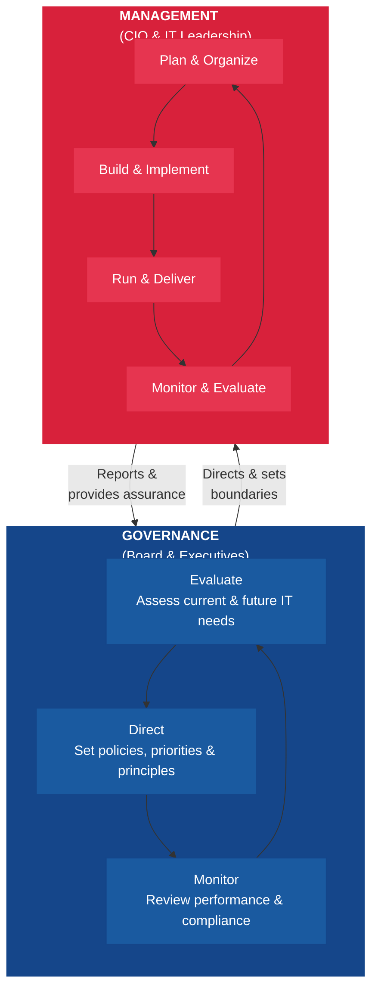
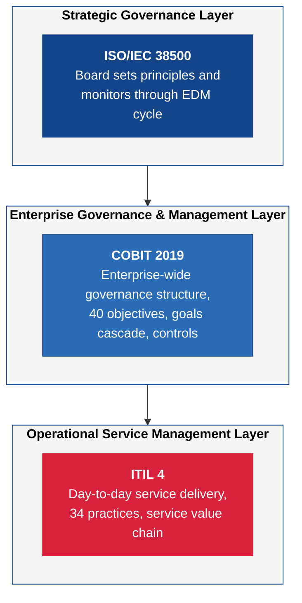

---
tags:
  - governance
  - frameworks
  - COBIT
  - ITIL
reading_time: 20
difficulty: Foundational
---

# IT Governance Frameworks

## Overview

IT governance frameworks provide structured approaches for organizations to make decisions about technology, manage IT-related risks, and ensure that IT investments deliver business value. Think of them as rulebooks and playbooks — they define **who** makes decisions, **what** decisions need to be made, and **how** the organization monitors whether those decisions are working. Without a governance framework, IT decisions tend to be ad hoc, reactive, and disconnected from business strategy.

Three frameworks dominate the enterprise IT governance landscape: **COBIT**, **ITIL**, and **ISO/IEC 38500**. Each serves a different purpose and operates at a different level of the organization. COBIT provides a comprehensive governance and management framework for enterprise IT. ITIL focuses specifically on IT service management — how IT delivers and supports services to the business. ISO/IEC 38500 is an international standard that defines high-level principles for the governing body (typically the board of directors) to direct, evaluate, and monitor IT.

For MBA students, the critical insight is that these frameworks are not mutually exclusive — they are complementary. Many large organizations use all three simultaneously: ISO/IEC 38500 to set board-level governance principles, COBIT to operationalize governance across the enterprise, and ITIL to manage day-to-day IT service delivery. Understanding which framework applies in which context — and how they fit together — is essential knowledge for any business leader who interacts with the IT function.

!!! info "Why This Matters for MBA Students"
    As a business leader, you will never need to implement these frameworks yourself — that is the job of IT professionals. But you **will** need to understand them for several important reasons. First, when your organization selects or evaluates a governance framework, you may sit on the steering committee or approval board. Second, these frameworks define the language and structure of IT reporting — understanding them helps you interpret the dashboards, scorecards, and metrics your CIO presents to the executive team. Third, auditors and regulators increasingly expect organizations to demonstrate formal IT governance. If your company is publicly traded, SOX compliance requires evidence of IT controls — and these frameworks provide the roadmap. Finally, in consulting, strategy, and general management roles, you will encounter these frameworks at virtually every large organization you work with.

## Key Concepts

### Governance vs. Management

Before diving into the individual frameworks, it is essential to understand a distinction that all three share: the difference between **governance** and **management**.

- **Governance** is about setting direction, making policy decisions, and monitoring outcomes. It answers the questions: *Are we doing the right things? Are we getting value? Are risks being managed?* Governance is the responsibility of the **board of directors** and **senior executives**.

- **Management** is about planning, building, running, and monitoring IT activities to execute the direction set by governance. It answers the question: *Are we doing things right?* Management is the responsibility of the **CIO and IT leadership team**.



This governance-management distinction is not unique to IT — it mirrors the same separation you see in corporate governance between the board of directors (governance) and the executive management team (management). The IT governance frameworks simply apply this principle to the technology domain.

!!! question "Quick Check"
    - A CEO personally reviews every IT infrastructure purchase over $10,000. Is this governance or management? What risks does blurring this boundary create for the organization?
    - If a board member asks the CIO "Why did last Tuesday's server outage take four hours to resolve?", are they operating in a governance or management capacity? What would be a more appropriate governance-level question?

### The Three Pillars of IT Governance

Regardless of which framework you choose, IT governance always addresses three fundamental questions:

1. **Value Delivery** — Is IT delivering the expected benefits to the business?
2. **Risk Management** — Are IT-related risks understood and appropriately managed?
3. **Resource Optimization** — Are IT resources (people, technology, budget) being used efficiently?

Every framework structures its guidance around these pillars, though each uses different terminology and levels of detail.

## Frameworks & Models

### COBIT (Control Objectives for Information and Related Technologies)

=== "COBIT"

    **Developed by**: ISACA (Information Systems Audit and Control Association)

    **Current version**: COBIT 2019

    **Scope**: Comprehensive enterprise IT governance and management

    **Audience**: Boards, executives, IT management, auditors, compliance professionals

    #### What is COBIT?

    COBIT is the most comprehensive IT governance framework available. Originally developed in 1996 as an audit tool, it has evolved into a full governance and management framework that covers the entire enterprise IT landscape. COBIT 2019 is the current version and represents a significant update that makes the framework more flexible and customizable.

    #### The 5 Principles of COBIT 2019

    COBIT 2019 is built on five core principles that guide how organizations should approach IT governance:

    | # | Principle | What It Means |
    |---|----------|---------------|
    | 1 | **Meeting Stakeholder Needs** | IT governance starts with understanding what stakeholders (shareholders, customers, employees, regulators) need from IT |
    | 2 | **Covering the Enterprise End-to-End** | IT governance applies to the whole organization, not just the IT department |
    | 3 | **Applying a Single Integrated Framework** | COBIT can integrate with other frameworks (ITIL, ISO, TOGAF) rather than replacing them |
    | 4 | **Enabling a Holistic Approach** | Governance requires multiple interacting components — processes, structures, culture, skills, and information |
    | 5 | **Separating Governance from Management** | Governance (setting direction) and management (executing) are distinct activities requiring different structures |

    #### The Goals Cascade

    One of COBIT's most powerful concepts is the **goals cascade** — a structured way to connect stakeholder needs all the way down to specific IT processes. The cascade works like this:

    ```mermaid
    graph TD
        A["<b>Stakeholder Needs</b><br/>What do shareholders, customers,<br/>and regulators require?"] --> B
        B["<b>Enterprise Goals</b><br/>What strategic outcomes must<br/>the business achieve?"] --> C
        C["<b>Alignment Goals</b><br/>What must IT deliver to<br/>support enterprise goals?"] --> D
        D["<b>Governance & Management<br/>Objectives</b><br/>What IT processes must perform<br/>well to achieve alignment goals?"]

        style A fill:#15468A,stroke:#15468A,color:#ffffff
        style B fill:#2a6cb5,stroke:#15468A,color:#ffffff
        style C fill:#D8213B,stroke:#D8213B,color:#ffffff
        style D fill:#e63550,stroke:#D8213B,color:#ffffff
    ```

    For example, if shareholders need *reliable financial reporting* (stakeholder need), the enterprise goal might be *compliance with external laws and regulations*, the alignment goal might be *IT compliance and support for business compliance with external regulations*, and the management objective might be *managed IT controls and audit processes*.

    #### 40 Governance and Management Objectives

    COBIT organizes IT activities into **40 governance and management objectives** across five domains:

    | Domain | Code | Focus | Example Objectives |
    |--------|------|-------|-------------------|
    | **Evaluate, Direct & Monitor** | EDM | Governance | Set governance framework; ensure benefits delivery; manage risk; manage resources |
    | **Align, Plan & Organize** | APO | Management | Manage strategy; manage enterprise architecture; manage innovation; manage portfolio |
    | **Build, Acquire & Implement** | BAI | Management | Manage programs; manage requirements; manage solutions; manage change |
    | **Deliver, Service & Support** | DSS | Management | Manage operations; manage service requests; manage problems; manage security |
    | **Monitor, Evaluate & Assess** | MEA | Management | Monitor performance; evaluate internal controls; evaluate compliance |

    The first domain (EDM) contains the **governance** objectives owned by the board and executives. The remaining four domains contain **management** objectives owned by IT leadership. This clean separation makes it easy to identify who is responsible for what.

    #### Capability Levels

    COBIT 2019 uses a capability maturity model that assesses each process on a scale from 0 to 5:

    - **Level 0**: Incomplete — The process is not implemented or fails to achieve its purpose
    - **Level 1**: Performed — The process achieves its purpose but is not well managed
    - **Level 2**: Managed — The process is planned, monitored, and adjusted
    - **Level 3**: Defined — A standardized process is defined across the organization
    - **Level 4**: Quantitative — The process is measured with quantitative performance targets
    - **Level 5**: Optimizing — The process is continuously improved based on performance data

    Most organizations target Level 3 for the majority of their processes and Level 4-5 for critical processes such as security and compliance.

    !!! question "Quick Check"
        - Your organization scores at Capability Level 2 on change management but Level 4 on security. What does this gap suggest about the organization's governance priorities, and when might this imbalance become a problem?
        - A consulting firm recommends that your company adopt all 40 COBIT management objectives simultaneously. Using the goals cascade concept, how would you argue for a more targeted approach?

=== "ITIL"

    **Developed by**: Axelos (originally UK Government)

    **Current version**: ITIL 4 (released 2019)

    **Scope**: IT service management

    **Audience**: IT service managers, service desk teams, IT operations, CIOs

    #### What is ITIL?

    ITIL is the world's most widely adopted framework for ITSM. While COBIT addresses the full governance question ("Are we doing the right things?"), ITIL focuses on service management ("How do we deliver excellent IT services?"). ITIL provides detailed best practices for designing, delivering, and continuously improving the IT services that the business depends on — from email and network access to ERP systems and customer-facing applications.

    #### ITIL 4: The Service Value System

    ITIL 4, released in 2019, replaced the older service lifecycle model with the **Service Value System (SVS)** — a more flexible, modern approach that acknowledges how organizations actually work in practice.

    ```mermaid
    graph LR
        OPP["<b>Opportunity<br/>& Demand</b>"] --> SVS
        subgraph SVS["<b>Service Value System</b>"]
            direction TB
            GP["Guiding Principles"]
            GOV2["Governance"]
            SVC["Service Value Chain"]
            PRAC["Practices (34)"]
            CI["Continual Improvement"]
        end
        SVS --> VAL["<b>Value</b>"]

        style OPP fill:#15468A,stroke:#15468A,color:#ffffff
        style SVS fill:#f5f5f5,stroke:#15468A,color:#000000
        style VAL fill:#D8213B,stroke:#D8213B,color:#ffffff
        style GP fill:#ffffff,stroke:#15468A,color:#15468A
        style GOV2 fill:#ffffff,stroke:#15468A,color:#15468A
        style SVC fill:#ffffff,stroke:#15468A,color:#15468A
        style PRAC fill:#ffffff,stroke:#15468A,color:#15468A
        style CI fill:#ffffff,stroke:#15468A,color:#15468A
    ```

    The SVS takes **opportunity and demand** as inputs and produces **value** as output. It consists of five components:

    1. **Guiding Principles** — Seven recommendations that guide decision-making: focus on value, start where you are, progress iteratively, collaborate, think holistically, keep it simple, and optimize and automate.

    2. **Governance** — How the organization directs and controls its service management activities.

    3. **Service Value Chain** — Six activities that work together to create value: Plan, Improve, Engage, Design & Transition, Obtain/Build, and Deliver & Support.

    4. **Practices** — 34 sets of organizational resources designed for performing work. These replace the older "processes" concept and include familiar activities such as incident management, change enablement, and service level management.

    5. **Continual Improvement** — A recurring activity at all levels of the organization that ensures services and practices remain aligned with changing business needs.

    #### The Classic Service Lifecycle (ITIL v3)

    While ITIL 4 is current, many organizations still reference the ITIL v3 **service lifecycle** because it provides an intuitive way to think about how IT services are conceived, built, and operated:

    | Phase | Purpose | Key Question |
    |-------|---------|-------------|
    | **Service Strategy** | Define which services to offer and why | *What does the business need?* |
    | **Service Design** | Design new or changed services | *How should the service work?* |
    | **Service Transition** | Build, test, and deploy services | *How do we go live safely?* |
    | **Service Operation** | Deliver and support services day-to-day | *How do we keep services running?* |
    | **Continual Service Improvement** | Identify and implement improvements | *How do we get better?* |

    #### Key ITIL 4 Practices

    Of the 34 practices in ITIL 4, several are particularly important for business leaders to understand:

    - **Incident Management** — Restoring normal service operation as quickly as possible when something breaks (e.g., email goes down, an application crashes)
    - **Problem Management** — Identifying and addressing the root causes of recurring incidents
    - **Change Enablement** — Managing changes to IT systems in a controlled way to minimize disruptions
    - **Service Level Management** — Defining and measuring the quality of service through SLAs between IT and the business
    - **Service Desk** — The single point of contact between IT and its users

=== "ISO 38500"

    **Developed by**: ISO (International Organization for Standardization) and IEC (International Electrotechnical Commission)

    **Current version**: ISO/IEC 38500:2015

    **Scope**: High-level IT governance principles for governing bodies

    **Audience**: Board of directors, senior executives, governance committees

    #### What is ISO/IEC 38500?

    ISO/IEC 38500 is an international standard that provides guiding principles for the effective, efficient, and acceptable use of IT within organizations. Unlike COBIT and ITIL, which provide detailed processes and practices, ISO/IEC 38500 operates at a very high level — it defines **what** the governing body should do regarding IT, not **how** to do it. Think of it as a constitution, whereas COBIT and ITIL provide the legislation and operating procedures.

    #### The Six Principles

    ISO/IEC 38500 establishes six principles that the governing body should follow when directing, evaluating, and monitoring IT:

    | # | Principle | What the Board Should Ensure |
    |---|----------|------------------------------|
    | 1 | **Responsibility** | Individuals and groups understand and accept their IT-related responsibilities. Those who are assigned responsibility also have the authority and competence to act. |
    | 2 | **Strategy** | IT strategy aligns with and supports the overall business strategy. Current and future IT capabilities are planned to meet business needs. |
    | 3 | **Acquisition** | IT acquisitions (hardware, software, services) are made for valid reasons, based on sound analysis, with clear decision-making and ongoing accountability. |
    | 4 | **Performance** | IT supports the organization by delivering services at the quality levels required by the business. IT performance is monitored and measured. |
    | 5 | **Conformance** | IT complies with all relevant legislation, regulations, contractual obligations, and internal policies. |
    | 6 | **Human Behavior** | IT policies, practices, and decisions consider and respect human behavior, including the current and evolving needs of all the people involved. |

    #### The Evaluate-Direct-Monitor (EDM) Cycle

    The standard specifies that governing bodies should carry out three key activities for each of the six principles:

    ```mermaid
    graph LR
        E2["<b>Evaluate</b><br/>Assess current and future<br/>use of IT"] --> D2["<b>Direct</b><br/>Set policies and plans<br/>for IT use"]
        D2 --> M2["<b>Monitor</b><br/>Review performance<br/>against plans"]
        M2 --> E2

        BP["Business<br/>Processes"] --> |"Proposals<br/>& Plans"| E2
        D2 --> |"Policies &<br/>Direction"| BP
        BP --> |"Performance<br/>Reports"| M2

        style E2 fill:#15468A,stroke:#15468A,color:#ffffff
        style D2 fill:#D8213B,stroke:#D8213B,color:#ffffff
        style M2 fill:#15468A,stroke:#15468A,color:#ffffff
        style BP fill:#f5f5f5,stroke:#333333,color:#000000
    ```

    - **Evaluate** — Examine and judge the current and future use of IT. Consider external factors (market trends, regulation, competitors) and internal factors (business needs, capabilities, risks). The board should evaluate proposals from management before making decisions.
    - **Direct** — Set direction by preparing and implementing plans and policies. Direct management to prepare proposals. Ensure that IT investment decisions reflect the organization's objectives. Assign responsibility and direct the preparation of IT strategies.
    - **Monitor** — Monitor IT performance through appropriate measurement systems. Ensure that performance conforms to plans, that IT complies with policies and regulations, and that risks are being managed. The board should receive regular reports and ask probing questions.

    #### Why ISO/IEC 38500 is Important

    Despite its brevity compared to COBIT, ISO/IEC 38500 carries significant weight because:

    - It is an **international standard** recognized globally, giving it credibility with regulators, auditors, and global organizations
    - It defines the **board's responsibilities** for IT in clear, non-technical language that directors can understand
    - It provides a **common reference point** that transcends vendor-specific or industry-specific approaches
    - Many national governance codes and regulations reference or align with ISO/IEC 38500

### Comparing the Three Frameworks

The following table summarizes how the three frameworks differ and complement each other:

| Dimension | COBIT 2019 | ITIL 4 | ISO/IEC 38500 |
|-----------|-----------|--------|---------------|
| **Primary Focus** | Enterprise IT governance and management | IT service management | Board-level IT governance principles |
| **Level of Detail** | Very detailed — 40 objectives with specific practices | Detailed — 34 practices with operational guidance | High-level — 6 principles with general guidance |
| **Primary Audience** | Executives, IT management, auditors | IT service managers, operations teams | Board of directors, senior executives |
| **Governance vs. Management** | Covers both, with clear separation | Primarily management, with governance component | Governance only |
| **Approach** | Prescriptive — tells you what to do and how to measure it | Descriptive — provides best practices you can adapt | Principled — sets expectations without prescribing methods |
| **Certification** | COBIT Foundation and Design certifications (for individuals) | ITIL Foundation through Master certifications (for individuals) | Organizational conformance (not individual certification) |
| **Origin** | ISACA (professional association) | Axelos / UK Government | ISO (international standards body) |
| **Best Used For** | Structuring enterprise-wide IT governance, audit & compliance | Improving day-to-day IT service delivery | Setting board-level governance expectations |
| **Typical Adopters** | Large enterprises, regulated industries, audit firms | IT organizations of all sizes | Public companies, government entities |

### How They Work Together

In practice, mature organizations do not choose one framework over another — they layer them together:



The board uses ISO/IEC 38500 principles to set expectations. COBIT provides the detailed structure that connects those expectations to specific governance and management processes. ITIL provides the operational best practices for executing the service management processes that COBIT identifies. This layered approach ensures that governance direction flows from the board all the way down to the service desk, and that performance information flows back up.

!!! question "Quick Check"
    - A startup with 200 employees and a 5-person IT team is considering adopting all three frameworks. Evaluate whether this layered approach makes sense at their scale, and if not, which single framework would you recommend they start with and why.
    - Your board receives a quarterly IT performance report, but the data comes from ITIL-level operational metrics (incident counts, ticket resolution times). How would you restructure this reporting using the three-layer model to give the board governance-appropriate information?
    - Compare how a hospital and a social media company might weight the three pillars of IT governance (value delivery, risk management, resource optimization) differently. What drives the difference?

## Real-World Applications

### Example 1: A Bank Implements IT Governance After a Regulatory Finding

A mid-size regional bank received a regulatory finding that its IT controls were insufficient to support reliable financial reporting. The bank's response illustrates how the three frameworks work in practice:

- The **board** adopted ISO/IEC 38500 principles as the foundation for a new IT governance charter. The charter established that the board would evaluate IT risks quarterly, direct IT investment priorities annually, and monitor IT performance through a dedicated IT governance committee.
- **Senior management** implemented COBIT as the governance and management framework. They used the goals cascade to link SOX compliance requirements to specific COBIT management objectives — particularly MEA02 (Evaluate the System of Internal Controls) and MEA03 (Evaluate Compliance with External Requirements). Each objective was assessed using the capability maturity model, with a target of Level 3 for all compliance-related processes.
- The **IT operations team** adopted ITIL practices for change enablement, incident management, and problem management to ensure that system changes followed controlled processes and that service disruptions were documented and resolved systematically.

Within 18 months, the bank cleared the regulatory finding and established a sustainable governance structure.

### Example 2: A Retail Company Improves IT Service Quality

A national retailer was experiencing frequent point-of-sale (POS) system outages during peak shopping periods, costing millions in lost revenue. Store managers were frustrated and losing confidence in IT.

- The CIO used ITIL incident management and problem management practices to identify the root cause — a combination of outdated infrastructure and poorly managed software changes being deployed during business hours.
- Change enablement practices were implemented to establish maintenance windows and proper testing procedures before deploying changes to production systems.
- COBIT's goals cascade was used to connect the business impact (lost revenue from outages) to specific KPIs that the board could monitor: system availability targets, mean time to recovery, and change success rate.
- The IT governance committee, guided by ISO/IEC 38500's performance principle, began reviewing IT service performance quarterly alongside financial performance.

POS system availability improved from 96% to 99.9%, and the retailer recovered an estimated $12 million in previously lost sales over the following year.

### Example 3: A Global Manufacturer Standardizes Governance Across Regions

A multinational manufacturing company had IT operations in 40 countries, each with its own approach to managing technology. This created inconsistency, duplication, and difficulty producing consolidated IT risk reports for the board.

- ISO/IEC 38500 provided the common language that the global board of directors could use to set universal expectations regardless of local IT maturity.
- COBIT's 40 management objectives became the standard checklist used to assess every regional IT operation. The company found that its European operations were at capability Level 3-4, while some operations in emerging markets were at Level 1. This gap analysis drove a targeted improvement program.
- ITIL practices were standardized for core services (email, ERP, help desk) globally, while allowing regional flexibility for locally managed applications.

## Common Pitfalls

!!! warning "Framework Overload"
    Organizations sometimes try to implement all three frameworks simultaneously in their full detail. This leads to initiative fatigue, competing priorities, and employees spending more time on framework documentation than on actual governance. Start with one framework at the level of detail you need, and layer in others over time. Many organizations begin with ITIL because it delivers visible operational improvements quickly, then add COBIT for governance structure as they mature.

!!! warning "Treating Frameworks as Checklists"
    A common mistake is treating these frameworks as compliance checklists — mechanically documenting that you "have" each process without ensuring the processes actually work. COBIT explicitly warns against this through its capability maturity model: having a defined process (Level 3) is meaningless if it is not actually being followed. The goal is effective governance, not framework documentation.

!!! warning "Ignoring Organizational Culture"
    Frameworks provide structure, but they cannot override organizational culture. If the board does not actually read IT performance reports, adopting ISO/IEC 38500 will not improve governance. If IT management resists process discipline, ITIL practices will exist on paper but not in practice. Successful framework adoption requires change management, executive sponsorship, and visible accountability — not just new policies and procedures.

!!! warning "Confusing Governance with Management"
    Some organizations blur the line between governance and management, leading the board to micromanage IT operations or, conversely, allowing management to make strategic IT decisions without board oversight. COBIT's clear separation of EDM (governance) and APO/BAI/DSS/MEA (management) domains is specifically designed to prevent this confusion. The board should direct and monitor — not execute.

## Discussion Questions

1. **Framework Selection**: Your company is a mid-size healthcare provider that has just received a HIPAA audit finding related to inadequate IT controls. The CIO proposes adopting COBIT as the governance framework. The CFO argues that ITIL would be more practical because it directly improves operations. The board chair wants to know what ISO/IEC 38500 offers. How would you advise the leadership team — and is this really an either/or decision?

2. **Governance vs. Management Boundaries**: The CEO of a fast-growing technology startup sits on the IT steering committee and personally approves every IT purchase over $5,000. The CIO argues this is micromanagement that slows down the organization. The CEO argues it is responsible governance of a critical resource. Using the governance-management distinction from COBIT and ISO/IEC 38500, how would you frame this conflict and propose a resolution?

3. **Global Governance Challenges**: You are the CIO of a company that just acquired three firms in different countries, each using a different combination of IT governance frameworks (or no framework at all). How would you approach creating a unified IT governance structure? What role would each of the three frameworks play in your plan, and how would you sequence the implementation to avoid framework overload?

## Key Takeaways

- **IT governance** is about setting direction, making strategic decisions, and monitoring results. **IT management** is about executing those decisions. These are complementary but distinct activities.
- **COBIT 2019** is the most comprehensive framework, covering both governance and management through 40 objectives organized in five domains, with a goals cascade that links stakeholder needs to specific IT processes.
- **ITIL 4** is the leading framework for IT service management, providing 34 practices organized within a Service Value System that transforms opportunity and demand into value.
- **ISO/IEC 38500** is an international standard that defines six governance principles and the Evaluate-Direct-Monitor cycle for boards and senior executives.
- The three frameworks are **complementary, not competing** — ISO/IEC 38500 sets board-level principles, COBIT structures enterprise governance, and ITIL operationalizes service delivery.
- **Framework adoption requires change management** — selecting a framework is the easy part; making it work requires executive commitment, cultural alignment, and sustained effort.
- Organizations should **start pragmatically** — adopt what you need, at the level of detail that fits your maturity, and build from there rather than attempting a comprehensive implementation from day one.
- The **goals cascade** (COBIT) and **EDM cycle** (ISO/IEC 38500) are powerful tools for connecting IT activities to business outcomes — learn to speak this language when engaging with IT leaders.

## Related Topics

- [C-Suite IT Leadership Roles](c-suite-roles.md) — How CIOs, CISOs, and other IT executives operate within governance structures
- [IT-Business Alignment](it-business-alignment.md) — Frameworks for ensuring IT governance supports business strategy
- [IT Budgeting & Financial Management](it-budgeting.md) — How governance frameworks guide IT investment and spending decisions

---

## Further Reading

- **ISACA.** *COBIT 2019 Framework: Introduction and Methodology.* ISACA, 2018. The authoritative source for COBIT 2019, available from [isaca.org](https://www.isaca.org/resources/cobit).
- **Axelos.** *ITIL Foundation: ITIL 4 Edition.* TSO (The Stationery Office), 2019. The official introduction to ITIL 4 and the Service Value System.
- **ISO/IEC.** *ISO/IEC 38500:2015 — Information Technology — Governance of IT for the Organization.* International Organization for Standardization, 2015.
- **Weill, Peter, and Jeanne W. Ross.** *IT Governance: How Top Performers Manage IT Decision Rights for Superior Results.* Harvard Business School Press, 2004. A foundational text on IT governance that complements the framework-specific materials.
- **De Haes, Steven, and Wim Van Grembergen.** *Enterprise Governance of Information Technology: Achieving Alignment and Value.* 2nd ed., Springer, 2015. Provides an academic perspective on COBIT-based governance and its relationship to board-level decision-making.
- **ITEC-617 Course Textbook**: See the assigned readings on IT governance for additional context on how these frameworks apply in practice.
