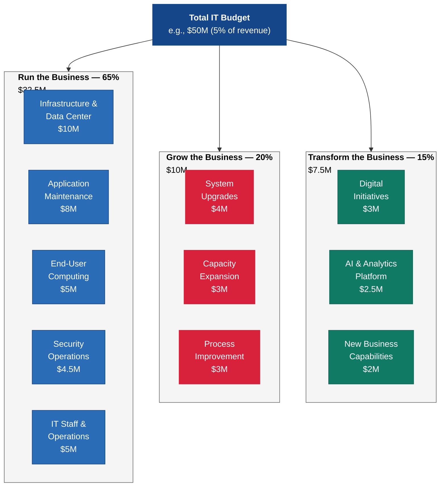

---
tags:
  - governance
  - finance
  - budgeting
reading_time: 35
difficulty: Intermediate
---

# IT Budgeting & Financial Management

## Overview

IT budgeting and financial management is the discipline of planning, allocating, tracking, and optimizing an organization's spending on technology. In most large enterprises, IT represents between 3% and 8% of total revenue — and in technology-intensive industries like financial services and media, it can exceed 10%. These are not trivial sums. A company with $5 billion in revenue and a 5% IT spend is allocating $250 million annually to technology. How that quarter-billion dollars is divided between keeping existing systems running, growing current capabilities, and investing in transformative new technologies is one of the most consequential resource allocation decisions the leadership team makes each year.

What makes IT budgeting distinctive — and often frustrating for business leaders — is the combination of high fixed costs, rapid obsolescence, and the difficulty of quantifying returns. When a company builds a new factory, the asset has a predictable useful life and the revenue it generates is directly measurable. When a company implements a new ERP system, the costs are front-loaded, the benefits are diffuse and often realized over years, and the total expenditure almost always exceeds the initial estimate. These characteristics make IT financial management a domain where MBA-trained analytical skills are not just useful — they are essential.

For MBA students, mastering IT financial management means understanding how technology costs behave, how to evaluate IT investment proposals with the same rigor applied to any capital allocation decision, and how the shift from on-premises infrastructure to cloud computing is fundamentally restructuring the financial profile of IT. Whether you become a CFO scrutinizing IT spending, a CEO evaluating digital transformation investments, a consultant advising on technology strategy, or a LOB leader building a business case for a new system, the concepts in this section will equip you to engage with IT financial decisions as an informed participant rather than a passive observer.

!!! info "Why This Matters for MBA Students"
    Technology spending is no longer confined to the IT department's budget. Every major business initiative — from launching a new product to entering a new market to improving customer experience — has a significant technology component. As a business leader, you will be asked to approve IT investments, justify technology spending to the board, evaluate whether a cloud migration makes financial sense, or determine whether to build a custom solution or buy a commercial product. You will encounter CIOs presenting TCO analyses, CFOs debating CapEx vs. OpEx treatment, and consultants recommending TBM frameworks. Without a working knowledge of IT financial management, you risk making decisions based on incomplete cost data, approving projects without understanding their true long-term financial commitments, or rejecting sound technology investments because the business case was not presented in language you could evaluate. This section gives you the analytical foundation to avoid those traps.

---

## Key Concepts

### IT Budget Structure: Run, Grow, Transform

CIOs typically organize their budgets into three categories that reflect the strategic purpose of each dollar spent:

- **Run the Business (Keep the Lights On)** — Spending required to maintain existing systems and operations at their current level. This includes hardware maintenance, software license renewals, help desk staffing, data center operations, network costs, and security operations. Run spending is largely non-discretionary — if you stop spending, systems stop working. In most organizations, Run consumes 60-75% of the total IT budget.

- **Grow the Business** — Spending that enhances or extends existing capabilities. This includes upgrades to current systems, adding features to existing applications, expanding capacity to support business growth, and incremental improvements to IT services. Grow spending typically represents 15-25% of the IT budget.

- **Transform the Business** — Spending on new capabilities that fundamentally change how the organization competes or operates. This includes digital transformation initiatives, new technology platforms, AI and analytics investments, and innovative business models enabled by technology. Transform spending is the most discretionary and the most strategically important, yet it typically receives only 10-20% of the IT budget.

The central tension of IT budgeting is that Run spending tends to grow relentlessly — as the organization acquires more systems, each one adds to the maintenance burden — while Transform spending, which drives competitive advantage, gets squeezed. CIOs who cannot control Run costs find themselves trapped in a "keeping the lights on" cycle with no resources for innovation.

**Typical IT Spend as Percentage of Revenue by Industry:**

| Industry | IT Spend (% of Revenue) | Primary Drivers |
|----------|------------------------|----------------|
| Banking & Financial Services | 7-10% | Regulatory compliance, trading platforms, cybersecurity, digital banking |
| Insurance | 5-8% | Claims processing, actuarial systems, regulatory reporting |
| Healthcare | 4-7% | EHR systems, medical devices integration, HIPAA compliance |
| Retail | 2-4% | E-commerce platforms, POS systems, supply chain, omnichannel |
| Manufacturing | 2-3% | ERP systems, IoT and automation, supply chain management |
| Energy & Utilities | 2-4% | SCADA systems, grid management, regulatory compliance |
| Technology & Software | 10-15%+ | Product development (IT *is* the product) |
| Government | 5-8% | Legacy system maintenance, citizen services, cybersecurity |

!!! tip "Reading the Table"
    These ranges are approximations drawn from industry benchmarking studies (Gartner, Deloitte, IDC). Your company's position within its industry range depends on factors like digital maturity, competitive strategy, regulatory burden, and whether technology is a product differentiator or an operational necessity. A bank pursuing a digital-first strategy will spend toward the high end; a bank competing on relationship-based private wealth management may spend toward the low end.

!!! question "Quick Check"
    - A company's Run spending has grown from 60% to 78% of the IT budget over five years while Transform spending dropped to 5%. What strategic consequences would you predict, and how would you make the case to the CFO that this trend is unsustainable?
    - Two retailers both spend 3% of revenue on IT, but Retailer A allocates 70/20/10 (Run/Grow/Transform) while Retailer B allocates 50/20/30. What different strategic bets are these companies making, and which is better positioned for a market disrupted by e-commerce?

### Total Cost of Ownership (TCO)

TCO is a financial analysis methodology that looks beyond the initial purchase price of a technology asset to capture the full lifecycle cost of owning and operating it. TCO is critical because the purchase price of enterprise technology is typically only 20-30% of the total cost over the asset's useful life. The remaining 70-80% accumulates in implementation, training, maintenance, support, integration, and eventual retirement.

#### The Five Phases of IT Cost

| Phase | Cost Components | Typical % of TCO |
|-------|----------------|-----------------|
| **Acquisition** | Hardware/software purchase or licensing, vendor selection (RFP process), legal review of contracts | 15-25% |
| **Implementation** | System configuration, customization, data migration, integration with existing systems, project management, consulting fees | 20-30% |
| **Training & Change Management** | End-user training, administrator training, documentation, change management programs, temporary productivity loss during transition | 5-10% |
| **Operations & Maintenance** | Annual maintenance fees, support contracts, hosting/infrastructure costs, patches and upgrades, IT staff time for ongoing administration, security monitoring | 35-45% |
| **Retirement & Replacement** | Data migration to replacement system, decommissioning, license termination fees, disposal of hardware, parallel running costs during transition | 5-10% |

#### Hidden Costs That TCO Reveals

The most valuable aspect of TCO analysis is surfacing costs that are easy to overlook:

- **Integration costs** — Enterprise systems rarely operate in isolation. Connecting a new CRM system to the existing ERP, data warehouse, and email marketing platform can cost as much as the CRM itself.
- **Customization trap** — Vendors quote prices for their standard product, but most enterprises require customizations that increase both initial cost and ongoing maintenance burden. Every customization must be re-applied when the vendor releases a new version.
- **Opportunity cost of IT staff time** — When internal IT staff spend six months implementing a new system, they are unavailable for other projects. This opportunity cost rarely appears in project budgets.
- **Productivity dip** — When users transition to a new system, productivity typically drops 10-20% for three to six months as they learn the new interface and workflows.
- **Vendor lock-in costs** — Switching costs increase over time as more data, customizations, and integrations accumulate. The cost to exit a platform after five years is dramatically higher than after one year.
- **Technical debt** — Deferred upgrades, workarounds, and accumulated customizations create a "debt" that must eventually be paid through costly remediation or system replacement.

!!! question "Quick Check"
    - A project sponsor presents a $500K software purchase to the steering committee and calls it a "$500K investment." Using the five phases of IT cost, estimate what the actual 5-year commitment might be and explain why the distinction matters for financial planning.
    - Your company customized its ERP system heavily during implementation. Five years later, the vendor releases a major upgrade. How does this customization history affect your TCO, and what would you advise differently for the next system implementation?

### CapEx vs. OpEx

The distinction between CapEx and OpEx is one of the most important financial concepts in IT management, and it has been dramatically reshaped by cloud computing.

#### Traditional Definitions

- **CapEx** — Capital expenditure is spending on long-lived assets that provide value over multiple years. In IT, this traditionally includes servers, networking equipment, data center construction, and purchased software licenses. CapEx is recorded on the balance sheet as an asset and depreciated over its useful life (typically 3-7 years for IT assets). CapEx requires upfront capital allocation and often involves a formal capital budgeting approval process.

- **OpEx** — Operating expenditure is spending on day-to-day operational costs that are consumed in the current period. In IT, this includes cloud service subscriptions, SaaS license fees, internet connectivity, outsourced services, and IT staff salaries. OpEx is expensed on the income statement in the period incurred. OpEx is typically funded from the operating budget and may have more flexible approval processes.

#### How Cloud Computing Shifts the Model

The move from on-premises infrastructure to cloud computing fundamentally shifts IT spending from CapEx to OpEx:

| Dimension | Traditional On-Premises (CapEx) | Cloud-Based (OpEx) |
|-----------|-------------------------------|-------------------|
| **Payment model** | Large upfront purchase | Monthly/annual subscription |
| **Financial treatment** | Asset on balance sheet, depreciated over 3-7 years | Expense on income statement in current period |
| **Capacity planning** | Must purchase for peak capacity in advance | Scale up/down based on actual demand |
| **Cash flow impact** | Large cash outflows at purchase; lower ongoing costs | Smaller, predictable, recurring cash outflows |
| **Tax treatment** | Depreciation deductions spread over asset life | Full deduction in the year incurred |
| **Budget flexibility** | Committed once purchased; difficult to scale down | Can reduce spend by canceling or downsizing subscriptions |
| **Risk profile** | Risk of over-provisioning or technological obsolescence | Risk of cost creep from unmonitored usage |
| **Balance sheet impact** | Increases total assets (and may increase debt if financed) | No balance sheet impact (off-balance-sheet) |

#### Financial Statement Implications

The CapEx-to-OpEx shift affects multiple financial metrics that analysts and investors monitor:

- **EBITDA** — Cloud subscriptions are operating expenses that reduce EBITDA, while on-premises depreciation is excluded from EBITDA. A company migrating to the cloud may see EBITDA decline even if total IT spending is unchanged — a purely accounting effect that does not reflect operational deterioration.
- **Free Cash Flow** — CapEx reduces free cash flow in the purchase year. OpEx reduces it evenly over time. Companies that have already made large capital investments show higher current free cash flow than companies paying equivalent amounts as subscriptions.
- **Return on Assets (ROA)** — Moving IT off the balance sheet (from owned assets to cloud subscriptions) reduces total assets, which can improve ROA — again, a purely accounting effect.
- **Debt Covenants** — Some debt covenants reference asset levels or CapEx ratios. A significant shift to OpEx could affect covenant compliance.

!!! example "CapEx vs. OpEx Decision in Practice"
    **Scenario:** A mid-size company needs a new email and collaboration platform for 5,000 employees. Two options are on the table:

    **Option A (CapEx):** Purchase on-premises Microsoft Exchange servers. Upfront cost: $400K for hardware + $250K for licenses + $150K for implementation = $800K CapEx. Annual maintenance and support: $120K OpEx. 5-year TCO: $800K + ($120K x 5) = **$1.4M**.

    **Option B (OpEx):** Subscribe to Microsoft 365 cloud. Monthly cost: $20 per user x 5,000 users = $100K/month = $1.2M/year OpEx. 5-year TCO: $1.2M x 5 = **$6.0M**.

    **Analysis:** On raw TCO, Option A appears dramatically cheaper. But the TCO comparison is incomplete without considering: (1) Option A requires a server refresh in year 4 at ~$300K, bringing its true 5-year TCO closer to $1.7M. (2) Option A requires 2 FTE system administrators at ~$180K/year total, adding $900K over 5 years (total: $2.6M). (3) Option B includes automatic upgrades, disaster recovery, and global accessibility that Option A does not. (4) Option A locks the company into a capacity that may be too large or too small in 3 years. (5) Option B's costs are predictable and scale linearly with headcount.

    The "right" answer depends on the company's financial strategy, growth trajectory, and risk tolerance — not just the headline numbers.

### Chargeback and Showback Models

As IT budgets grow, organizations face a fundamental question: should IT costs be treated as a corporate overhead or allocated to the business units that consume IT services? Chargeback and showback models address this question in different ways.

#### Chargeback

In a **chargeback** model, IT operates like an internal service provider. Each business unit is billed for the IT services it consumes — compute resources, storage, application support, help desk tickets, and so forth. The charges appear as expenses on the business unit's P&L, reducing that unit's reported profitability.

**How it works:** IT establishes a service catalog with unit prices (e.g., $500/month per virtual server, $50/month per supported user, $200/hour for application development). Business units "purchase" services from the catalog. At month-end, IT generates invoices and the costs transfer from the IT cost center to the consuming business units.

#### Showback

In a **showback** model, IT calculates and reports what each business unit would be charged for its IT consumption, but does not actually transfer the cost. IT remains a corporate cost center. The reports are informational — they create transparency and awareness without altering financial reporting.

#### Direct Allocation

In a **direct allocation** model, IT costs are allocated to business units using simple allocation keys — typically headcount, revenue, or a combination. A business unit with 30% of the company's headcount absorbs 30% of IT costs. This is simpler than chargeback but less precise — it does not reflect actual consumption.

#### Comparison of Cost Allocation Models

| Dimension | Chargeback | Showback | Direct Allocation |
|-----------|-----------|----------|-------------------|
| **Cost visibility** | High — business units see actual consumption | High — same data as chargeback | Low — allocation is averaged |
| **Behavioral impact** | Strong — units reduce waste to lower their bill | Moderate — awareness without financial consequence | Weak — no connection between behavior and cost |
| **Implementation complexity** | High — requires metering, pricing, billing systems | Moderate — requires metering and reporting | Low — simple formula applied to total IT cost |
| **LOB acceptance** | Often resisted — "Why am I paying for IT?" | Generally accepted — informational, not punitive | Generally accepted — familiar overhead allocation |
| **Accuracy** | High — reflects actual consumption | High — same measurement as chargeback | Low — averages mask actual consumption patterns |
| **IT accountability** | High — IT must justify prices and demonstrate value | Moderate — pressure to explain costs | Low — IT costs are "just overhead" |
| **Risk of gaming** | High — units may defer critical IT work to avoid charges | Low — no financial incentive to game | None — allocation is formulaic |

!!! tip "Which Model to Choose?"
    Most organizations evolve through these models. They start with direct allocation (simple but imprecise), move to showback (transparent without disruption), and eventually implement chargeback when the organization has the metering infrastructure and cultural readiness to support it. Jumping directly to chargeback without building transparency first often creates friction and resistance.

!!! question "Quick Check"
    - Under a chargeback model, a business unit leader decides to defer a critical security patch to avoid the IT charge hitting their P&L this quarter. What governance failure does this reveal, and how would you redesign the chargeback model to prevent this behavior?
    - A small business unit consumes 2% of IT resources but employs 15% of total headcount. Compare how their IT cost allocation would differ under a chargeback model versus a direct allocation model, and explain which is fairer and why.

### Making the Business Case for Technology Investments

Every significant IT investment should be supported by a business case that quantifies expected costs and benefits and applies the same financial analysis methods used for any capital allocation decision. The four most common financial metrics for IT investment evaluation are:

#### ROI (Return on Investment)

$$
\text{ROI} = \frac{\text{Net Benefits} - \text{Total Costs}}{\text{Total Costs}} \times 100\%
$$

ROI expresses the total return as a percentage of the investment. It is intuitive and widely used, but it does not account for the time value of money or the timing of cash flows. An IT project with 150% ROI over five years is not necessarily better than one with 80% ROI over two years.

#### NPV (Net Present Value)

$$
\text{NPV} = \sum_{t=0}^{n} \frac{C_t}{(1+r)^t}
$$

Where $C_t$ is the net cash flow in period $t$, $r$ is the discount rate (typically the company's weighted average cost of capital, or WACC), and $n$ is the number of periods. NPV accounts for the time value of money and provides a dollar-denominated measure of value creation. A positive NPV means the project creates value above the required rate of return. NPV is the gold standard for investment analysis — it is the method most MBA finance professors would recommend.

#### IRR (Internal Rate of Return)

IRR is the discount rate at which the NPV of the project equals zero. It represents the project's effective rate of return. If the IRR exceeds the company's hurdle rate (cost of capital), the project is financially viable. IRR is useful for comparing projects of different sizes, but it can produce misleading results when cash flows alternate between positive and negative.

#### Payback Period

The payback period is the time required for cumulative benefits to equal the initial investment. It is the simplest metric — easy to understand and communicate — but it ignores cash flows after the payback point and does not account for the time value of money. A two-year payback period tells you when you break even, but not how much value the project creates over its full life.

| Metric | Strengths | Limitations | Best Used For |
|--------|-----------|-------------|---------------|
| **ROI** | Simple, intuitive, percentage-based | Ignores time value of money; no standard timeframe | Quick comparisons, executive communication |
| **NPV** | Accounts for time value of money; dollar-denominated | Requires accurate discount rate; sensitive to assumptions | Rigorous investment analysis; the preferred method |
| **IRR** | Easy to compare across projects of different sizes | Can produce multiple solutions; misleading with non-standard cash flows | Comparing projects with different investment scales |
| **Payback Period** | Simplest to calculate and communicate | Ignores post-payback cash flows; no time value of money | Risk assessment (shorter payback = lower risk) |

!!! warning "The Soft Benefits Trap"
    Many IT business cases rely heavily on "soft" benefits — improved employee satisfaction, better decision-making, increased agility — that are difficult to quantify. While these benefits are real, a business case built primarily on soft benefits is difficult to defend in a rigorous review. Best practice is to quantify hard benefits (cost reduction, revenue increase, risk mitigation with quantified exposure) first, and then present soft benefits as additional upside rather than the primary justification.

### IT Financial Management (ITFM)

ITFM is the discipline of managing IT costs, budgets, and investments with the same rigor and transparency that finance applies to other corporate functions. ITFM treats IT as a business within a business — one that has customers (business units), products (IT services), costs (infrastructure, people, licenses), and revenues (chargebacks or internal funding allocations).

The core activities of ITFM include:

- **Planning and Budgeting** — Developing the annual IT budget in alignment with business strategy, including demand forecasting, capacity planning, and investment prioritization.
- **Cost Accounting** — Tracking and categorizing IT costs by service, project, business unit, and cost type. This requires a cost model that maps expenses from the general ledger to the IT services they support.
- **Cost Optimization** — Continuously identifying opportunities to reduce IT costs without degrading service quality. Common levers include license rationalization, cloud resource right-sizing, vendor contract renegotiation, and automation of manual processes.
- **Benchmarking** — Comparing IT spending to industry peers to identify areas of over- or under-investment. Benchmarking data is available from firms like Gartner, Forrester, and APQC.
- **Value Reporting** — Communicating IT's value contribution to the business in terms that executives and board members understand — business outcomes, risk reduction, and strategic enablement rather than technical metrics.

### Technology Business Management (TBM)

TBM is a framework and discipline for translating IT spending into business value using a standardized taxonomy and a layered cost model. Developed by the TBM Council (an industry consortium), TBM provides a common language for CIOs, CFOs, and business leaders to discuss IT costs and value.

#### The TBM Taxonomy

TBM organizes IT costs into four layers, each providing a different view of the same spending:

1. **Cost Pools** — The raw inputs: what IT spends money on. This includes hardware, software, labor (internal and external), facilities, and telecom. These map directly to the general ledger.

2. **IT Towers** — Functional groupings of IT cost pools that represent how resources are organized. Examples include compute, storage, network, end-user services, application development, and IT management. Towers answer the question: *Where does the money go in IT terms?*

3. **IT Services** — The products that IT delivers to the business. Examples include email, ERP, CRM, business intelligence, and help desk support. Services answer the question: *What does the business receive?*

4. **Business Units / Applications** — The consumers of IT services. This layer allocates service costs to the LOBs or business applications that consume them, answering the question: *Who consumes IT and at what cost?*

#### Why TBM Matters

Without TBM or a similar cost transparency framework, IT costs remain opaque. The CFO sees a large IT line item on the income statement but cannot answer basic questions: *Why did IT spending increase 8% this year? How much does it cost to run our ERP system? Which business unit consumes the most IT resources? Are we spending more or less on cybersecurity than our peers?* TBM provides the data model to answer these questions.

---

## Frameworks & Models

### IT Budget Allocation Model

The following diagram illustrates how a typical enterprise IT budget flows from total allocation through the Run/Grow/Transform framework to specific spending categories:

### TBM Cost Transparency Layers

The TBM framework translates raw IT spending through four layers to connect costs with business value:

```mermaid
graph LR
    subgraph L1 ["<b>Cost Pools</b><br/>(What we spend on)"]
        CP1["Hardware"]
        CP2["Software"]
        CP3["Labor"]
        CP4["Facilities"]
        CP5["Cloud Services"]
    end

    subgraph L2 ["<b>IT Towers</b><br/>(How IT is organized)"]
        T1b["Compute"]
        T2b["Storage"]
        T3b["Network"]
        T4b["App Dev"]
        T5b["End-User"]
    end

    subgraph L3 ["<b>IT Services</b><br/>(What business receives)"]
        S1["Email &<br/>Collaboration"]
        S2["ERP"]
        S3["CRM"]
        S4["BI &<br/>Analytics"]
    end

    subgraph L4 ["<b>Business Consumers</b><br/>(Who consumes it)"]
        B1["Sales"]
        B2["Finance"]
        B3["Operations"]
        B4["Marketing"]
    end

    L1 --> L2 --> L3 --> L4

    style L1 fill:#f5f5f5,stroke:#15468A,color:#000000
    style L2 fill:#f5f5f5,stroke:#15468A,color:#000000
    style L3 fill:#f5f5f5,stroke:#15468A,color:#000000
    style L4 fill:#f5f5f5,stroke:#15468A,color:#000000
    style CP1 fill:#15468A,stroke:#15468A,color:#ffffff
    style CP2 fill:#15468A,stroke:#15468A,color:#ffffff
    style CP3 fill:#15468A,stroke:#15468A,color:#ffffff
    style CP4 fill:#15468A,stroke:#15468A,color:#ffffff
    style CP5 fill:#15468A,stroke:#15468A,color:#ffffff
    style T1b fill:#2a6cb5,stroke:#15468A,color:#ffffff
    style T2b fill:#2a6cb5,stroke:#15468A,color:#ffffff
    style T3b fill:#2a6cb5,stroke:#15468A,color:#ffffff
    style T4b fill:#2a6cb5,stroke:#15468A,color:#ffffff
    style T5b fill:#2a6cb5,stroke:#15468A,color:#ffffff
    style S1 fill:#D8213B,stroke:#D8213B,color:#ffffff
    style S2 fill:#D8213B,stroke:#D8213B,color:#ffffff
    style S3 fill:#D8213B,stroke:#D8213B,color:#ffffff
    style S4 fill:#D8213B,stroke:#D8213B,color:#ffffff
    style B1 fill:#117a65,stroke:#0e6655,color:#ffffff
    style B2 fill:#117a65,stroke:#0e6655,color:#ffffff
    style B3 fill:#117a65,stroke:#0e6655,color:#ffffff
    style B4 fill:#117a65,stroke:#0e6655,color:#ffffff
```

### Example TCO Calculation: CRM Platform

The following table illustrates a 5-year TCO analysis for a CRM platform implementation, demonstrating how costs extend far beyond the initial purchase:

| Cost Category | Year 0 | Year 1 | Year 2 | Year 3 | Year 4 | Year 5 | **Total** |
|--------------|--------|--------|--------|--------|--------|--------|-----------|
| **Software licensing** | $300K | $180K | $180K | $180K | $180K | $180K | **$1,200K** |
| **Implementation & consulting** | $450K | $50K | — | — | — | — | **$500K** |
| **Data migration & integration** | $200K | $75K | $25K | — | — | — | **$300K** |
| **Customization** | $150K | $60K | $60K | $60K | $60K | $60K | **$450K** |
| **Training & change management** | $100K | $40K | $20K | $20K | $20K | $20K | **$220K** |
| **Internal IT staff (2 FTE)** | — | $200K | $200K | $200K | $200K | $200K | **$1,000K** |
| **Infrastructure (hosting)** | $80K | $80K | $80K | $80K | $80K | $80K | **$480K** |
| **Upgrades & patches** | — | $30K | $30K | $75K | $30K | $30K | **$195K** |
| **Retirement of legacy system** | — | $100K | — | — | — | — | **$100K** |
| **TOTAL** | **$1,280K** | **$815K** | **$595K** | **$615K** | **$570K** | **$570K** | **$4,445K** |

!!! note "Reading This Table"
    The initial software licensing cost of $300K represents only **6.7%** of the 5-year TCO of $4.445M. If the project sponsor had budgeted only for the software purchase, the project would have been underfunded by a factor of nearly 15x. This is why TCO analysis is not optional — it is essential for honest financial planning. Note also that Year 3 includes a higher upgrade cost ($75K) for a major version release, illustrating how costs fluctuate unpredictably over the lifecycle.

---

## Real-World Applications

### Example 1: A Retailer's Cloud Migration Financial Analysis

A national retail chain with 800 stores is running its e-commerce platform, inventory management, and POS systems on aging on-premises infrastructure in two corporate data centers. The 5-year cost to maintain the current environment is estimated at $45M (data center leases, hardware refreshes, cooling, staffing). The CIO proposes migrating to a major cloud provider with a projected 5-year cost of $38M.

The CFO initially resists, noting that the cloud migration itself will cost $8M in Year 1 (data migration, re-architecture, consulting), making the first-year spend significantly higher than the status quo. She also flags the EBITDA impact — shifting $9M annually from depreciation (excluded from EBITDA) to cloud subscription OpEx (included in EBITDA) would reduce reported EBITDA by $9M, potentially affecting the company's valuation multiple.

The CIO presents a comprehensive financial analysis. The cloud model eliminates the $12M hardware refresh planned for Year 3. It provides elastic scaling for Black Friday and holiday traffic spikes — the retailer currently over-provisions by 40% to handle peak load, paying for unused capacity 11 months per year. The cloud model also reduces data center staff from 35 to 12 FTE, with affected employees offered retraining for cloud operations roles.

The IT steering committee approves the migration with a condition: the CFO and CIO will jointly present to the board's audit committee on how to communicate the EBITDA impact to analysts. They develop investor messaging that highlights the TCO reduction and the capital freed from the avoided hardware refresh.

**Key Lesson:** IT financial decisions do not exist in isolation. The cloud migration was sound on TCO, but its accounting treatment had implications for financial reporting, investor relations, and debt covenant compliance. This is why IT budgeting requires partnership between the CIO and CFO.

### Example 2: A Healthcare System Implements TBM to Control Costs

A large healthcare system with 12 hospitals and $8B in annual revenue was spending $480M on IT (6% of revenue) — well above the healthcare industry median of 4.5%. The CFO demanded a 15% reduction, but the CIO could not explain where the money was going in terms the CFO could act on. The general ledger showed $480M in IT expense, categorized by accounting codes (salaries, software, hardware, consulting) that revealed nothing about which clinical or business functions were driving the spend.

The CIO implemented a TBM framework over six months. The cost transparency exercise revealed several surprises:

- **40% of total IT spend** was supporting just three applications: the EHR system, the revenue cycle management system, and the clinical imaging platform. These were essential and non-negotiable.
- **$35M annually** was being spent on 340 "long-tail" applications, many of which were redundant, underutilized, or serving a single department. Rationalizing 120 of these applications over two years could save $18M annually.
- **The radiology department** was consuming 22% of storage costs due to medical imaging data growth, but this was invisible until TBM mapped storage costs to clinical services.
- **Cloud spend** had grown 45% year-over-year with no governance — individual departments were provisioning cloud resources without IT oversight.

Armed with TBM data, the CIO and CFO jointly presented a cost optimization roadmap to the board. They achieved $52M in savings over two years (an 11% reduction) while protecting investments in cybersecurity and the EHR platform. The key was transparency — once leaders could see what IT money was buying, optimization decisions became straightforward rather than political.

**Key Lesson:** You cannot optimize what you cannot see. TBM converts the opaque IT cost structure into a transparent model that enables data-driven decisions. Without it, cost reduction efforts tend to be across-the-board cuts that damage critical services and spare wasteful ones equally.

### Example 3: A Manufacturing Company's Business Case for IoT

A global manufacturer is evaluating a $12M investment in IoT sensors and predictive analytics for its 15 largest production facilities. The VP of Operations champions the project, claiming it will reduce unplanned downtime by 40% and extend equipment life by 15%. The CFO asks for a rigorous business case.

The project team develops a five-year financial model:

- **Total investment:** $12M over 2 years ($8M in Year 1 for sensors, platform, and integration; $4M in Year 2 for remaining facilities and optimization).
- **Annual benefits (starting Year 2):** $6M in avoided downtime costs (quantified from historical production loss data), $2.5M in reduced maintenance costs (predictive vs. reactive), $1.2M in extended equipment life (deferred capital replacement).
- **Discount rate:** 10% (company's WACC).
- **NPV:** $14.8M over 5 years — strongly positive.
- **IRR:** 38% — well above the 15% hurdle rate.
- **Payback period:** 2.1 years.

The CFO challenges the assumptions: "The 40% downtime reduction is based on vendor marketing claims. What if we only achieve 25%?" The team runs a sensitivity analysis showing that even at 25% downtime reduction (and proportional reductions in other benefits), the NPV remains positive at $6.2M and the IRR is 22%. The project clears the hurdle rate even in the pessimistic scenario.

The IT steering committee approves the project with a phased approach: implement in 3 pilot facilities in Year 1, validate results against the business case projections, and then roll out to the remaining 12 facilities only if the pilot confirms at least 25% downtime reduction.

**Key Lesson:** A strong business case anticipates skepticism and addresses it proactively through sensitivity analysis. The phased approach reduces risk by validating assumptions before committing full funding — a best practice for any large IT investment.

---

## Common Pitfalls

!!! warning "Underestimating TCO"
    The most common financial mistake in IT is budgeting only for the acquisition cost of a technology asset. When project sponsors present a $500K software purchase to the steering committee, the true 5-year commitment is likely $2-3M when implementation, training, maintenance, support staff, and integration costs are included. Organizations that do not enforce TCO analysis in their business case templates systematically underestimate IT spending and are perpetually surprised by cost overruns. **Mitigation:** Require TCO analysis as a mandatory component of every IT business case exceeding a defined threshold (e.g., $100K). Include a TCO template that itemizes all five cost phases.

!!! warning "The Run Spending Trap"
    Run spending (keeping the lights on) grows organically as the organization acquires more systems, each of which adds to the maintenance and licensing burden. Without active management, Run spending can consume 80%+ of the IT budget, leaving almost nothing for Grow and Transform. This creates a vicious cycle: the organization cannot invest in modern platforms that would reduce Run costs because all the budget is consumed by maintaining legacy systems. **Mitigation:** Set explicit targets for the Run/Grow/Transform split (e.g., 60/20/20) and treat legacy system retirement as a strategic initiative that frees budget for transformation. Track the ratio quarterly and report it to the steering committee.

!!! warning "Cloud Cost Sprawl"
    The ease of provisioning cloud resources — any developer can spin up a server in minutes — creates a new financial risk: uncontrolled cloud spending. Organizations that migrate to the cloud without implementing FinOps practices (cloud financial management) routinely overspend by 20-35%. Common sources of waste include oversized virtual machines, forgotten development environments left running, storage that is never cleaned up, and reserved capacity purchases that do not match actual usage patterns. **Mitigation:** Implement a FinOps practice that includes automated cost monitoring, tagging policies to attribute spend to business units, right-sizing recommendations, and a monthly cloud cost review with accountability for overspend.

!!! warning "Ignoring Opportunity Cost in IT Prioritization"
    When the steering committee approves a project, it implicitly rejects other projects that could have used the same resources. Yet most organizations do not formally evaluate the opportunity cost of their IT portfolio decisions. They approve projects based on individual merit without asking: "Is this the highest-value use of our limited IT capacity?" **Mitigation:** Maintain a ranked portfolio backlog that shows all proposed and approved projects alongside their expected value and resource consumption. When approving a new project, explicitly identify which existing projects will be delayed or displaced and whether that tradeoff is acceptable.

---

## Discussion Questions

1. **CapEx vs. OpEx Strategy:** Your company's CFO is resistant to migrating from on-premises data centers to the cloud because the shift from CapEx to OpEx will reduce reported EBITDA by approximately $15M annually, potentially depressing the company's stock price and affecting two debt covenants. The CIO argues that the cloud migration will reduce 5-year TCO by 22% and dramatically improve scalability. As a member of the executive committee, how would you frame this decision? What additional analysis would you request, and how would you weigh financial reporting impact against operational efficiency?

2. **Chargeback Implementation:** Your organization is transitioning from a direct allocation model to a full chargeback model for IT services. The VP of Sales is furious because her department, which runs a data-intensive CRM and analytics platform, will now be charged $3.2M annually — far more than the $1.8M allocated under the previous headcount-based formula. She argues this penalizes her team for being data-driven and threatens to move her analytics to an unapproved SaaS platform that would cost "only $800K." How would you navigate this conflict? What principles should guide the design of a fair chargeback model?

3. **Making the Business Case:** You are the VP of Operations at a logistics company. You want to invest $8M in a warehouse automation system that you believe will reduce labor costs by $4M annually and improve order accuracy from 97% to 99.8%. The CFO has rejected two previous IT proposals from other departments this quarter due to "insufficient financial rigor." Building on the financial analysis methods discussed in this section, outline the structure of a business case that would survive the CFO's scrutiny. What metrics would you emphasize, and how would you address uncertainty in your benefit projections?

---

## Key Takeaways

- **IT typically represents 3-8% of revenue** in most industries, making it one of the largest discretionary spending categories. Understanding how this money is allocated — across Run, Grow, and Transform — reveals an organization's true strategic priorities.
- **TCO is the only honest way to evaluate IT costs.** The purchase price of a technology asset is typically only 20-30% of the total lifecycle cost. Implementation, training, maintenance, integration, and retirement costs make up the rest. Every IT business case should include a full TCO analysis.
- **The shift from CapEx to OpEx** driven by cloud computing has profound implications for financial statements, tax treatment, and capital planning. Business leaders must understand how this shift affects EBITDA, free cash flow, and balance sheet metrics — not just IT operations.
- **Chargeback models drive accountability** but require metering infrastructure, cultural readiness, and carefully designed pricing. Showback is often a pragmatic intermediate step that provides transparency without disruption.
- **IT investment decisions should be evaluated with the same financial rigor as any capital allocation** — using NPV, IRR, ROI, and payback period analysis. NPV is the most reliable method because it accounts for the time value of money.
- **ITFM and TBM provide the discipline and framework** for managing IT as a business. Without cost transparency, IT spending is opaque and optimization is impossible. TBM's four-layer taxonomy — cost pools, IT towers, IT services, and business consumers — connects every IT dollar to the business value it supports.
- **Run spending is the silent budget killer.** Without active management, maintenance costs grow organically and consume budget that should fund innovation. Tracking the Run/Grow/Transform ratio is one of the most important metrics in IT financial management.
- **Cloud cost management (FinOps) is the new frontier** of IT financial management. The ease of provisioning cloud resources creates a risk of uncontrolled spending that can erase the savings cloud was supposed to deliver.

---

## Further Reading

- **Apptio.** *Technology Business Management: The Four Value Conversations CIOs Must Have with Their Businesses.* TBM Council, 2016. The definitive introduction to the TBM framework and taxonomy, written by the founder of the TBM Council.
- **Gartner.** *IT Key Metrics Data: IT Spending and Staffing Report.* Gartner, published annually. The industry standard for IT spending benchmarks by industry, company size, and geographic region. Available through institutional access.
- **Maizlish, Bryan, and Robert Handler.** *IT Portfolio Management Step-by-Step: Unlocking the Business Value of Technology.* Wiley, 2005. Practical guidance on evaluating and managing the IT investment portfolio, including business case development and financial analysis.
- **FinOps Foundation.** *FinOps: Collaborative, Real-Time Cloud Financial Management.* Available at [finops.org](https://www.finops.org). The open-source framework for cloud financial management, with community-contributed best practices for controlling cloud costs.
- **Benson, Robert J., Tom Bugnitz, and Bill Walton.** *From Business Strategy to IT Action: Right Decisions for a Better Bottom Line.* Wiley, 2004. Connects IT financial management to business strategy, with practical frameworks for aligning IT spending with corporate objectives.
- **Ross, Jeanne W., Cynthia M. Beath, and Martin Mocker.** *Designed for Digital: How to Architect Your Business for Sustained Success.* MIT Press, 2019. Explores how organizations must restructure IT spending and governance to compete in a digital economy.
- **Weill, Peter, and Jeanne W. Ross.** *IT Governance: How Top Performers Manage IT Decision Rights for Superior Results.* Harvard Business School Press, 2004. Foundational text on IT governance structures that includes extensive treatment of IT funding models and investment decision rights.

### Cross-References Within This Primer

- [IT Governance Frameworks](frameworks.md) — COBIT, ITIL, and ISO/IEC 38500 provide governance structures that guide IT investment decisions.
- [IT-Business Alignment](it-business-alignment.md) — Alignment frameworks explain how IT spending priorities should connect to business strategy.
- [C-Suite IT Roles](c-suite-roles.md) — The CIO and CFO roles are central to IT financial management. Understanding their perspectives and tensions is essential context for this topic.
- [The Economics of Enterprise IT Spending](it-spending-economics.md) — Industry benchmarks, spending trends, the AI investment wave, and how IT spending correlates with business performance.
- [Cloud Computing Strategy](../technology/cloud-computing.md) — Deep dive into cloud service models, migration strategies, and the financial implications of moving to the cloud.
- [Make vs. Buy](../technology/make-vs-buy.md) — The build-or-buy decision is a core IT investment question with significant financial and strategic implications.
