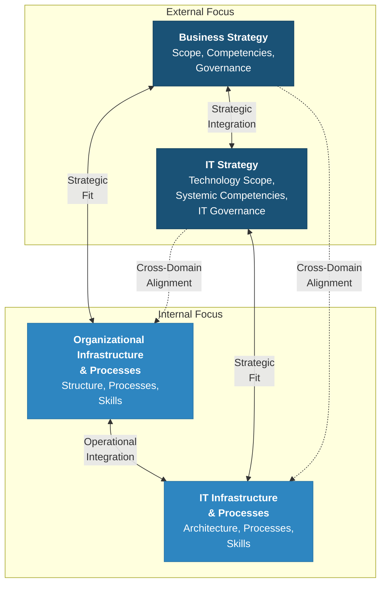
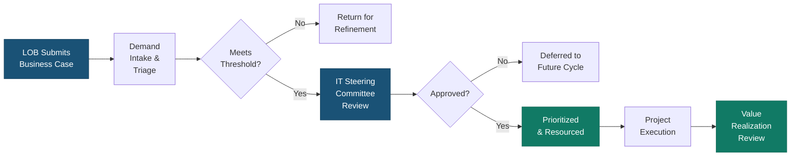
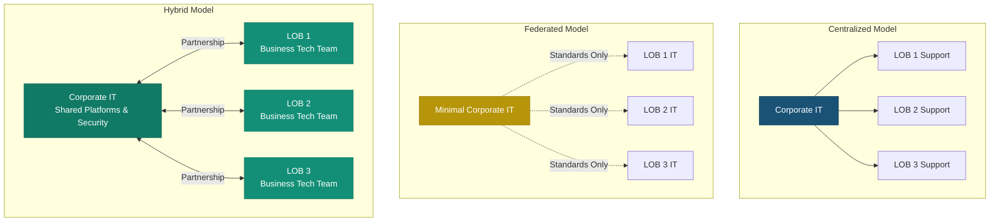

---
tags:
  - governance
  - alignment
  - strategy
reading_time: 25
difficulty: Intermediate
---

# IT-Business Alignment & CIO-LOB Negotiation

## Overview

IT-business alignment is the degree to which an organization's IT strategy and investments support — and are supported by — its business strategy. When alignment is strong, technology spending delivers measurable business value, LOB leaders trust that IT understands their needs, and the CIO has a credible seat at the leadership table. When alignment is weak, organizations experience duplicated systems, wasted budgets, frustrated business users, and the emergence of shadow IT as departments work around a central IT function they view as unresponsive.

Achieving alignment is not a one-time project but an ongoing negotiation. The CIO must balance competing demands from multiple LOB leaders, each of whom believes their projects deserve priority. Meanwhile, the CEO and CFO want assurance that every IT dollar contributes to strategic goals. This tension is healthy — it forces rigor — but it requires governance structures, shared language, and deliberate relationship management to resolve productively.

For MBA students, alignment is where strategy meets execution. You may never run an IT department, but you will certainly be a LOB leader requesting technology resources, a board member overseeing IT investments, or a consultant diagnosing why a digital transformation stalled. Understanding the frameworks, politics, and measurement models of IT-business alignment is foundational to all of those roles.

!!! info "Why This Matters for MBA Students"
    As a business leader, you will be on one side or both sides of the IT-business alignment conversation. You may be the LOB executive lobbying the CIO for a new CRM system, the CFO questioning why IT spending grew 12% year-over-year, or the CEO wondering why your competitor launched a digital product faster than your firm could. Alignment is not an IT problem — it is a leadership problem. The frameworks in this section give you vocabulary and analytical tools to diagnose misalignment, negotiate effectively with technology leaders, and ensure that IT governance supports your strategic goals rather than obstructing them.

---

## Key Concepts

### What Is IT-Business Alignment?

At its simplest, IT-business alignment means that the IT function and the rest of the business are working toward the same objectives, with shared priorities and mutual understanding. In practice, alignment operates at multiple levels:

- **Strategic alignment** — IT investments map directly to business strategy (e.g., if the strategy is geographic expansion, IT is investing in scalable global infrastructure).
- **Structural alignment** — IT governance structures (reporting lines, steering committees, funding models) facilitate collaboration rather than creating bureaucratic barriers.
- **Social alignment** — IT and business leaders have strong working relationships, speak a shared language, and trust each other's competence.
- **Cultural alignment** — The organization values technology as a strategic enabler, not merely as a cost of doing business.

### The CIO's Role in Alignment

The CIO occupies a uniquely challenging position. Unlike most C-suite executives who represent a single function (the CFO represents finance, the CMO represents marketing), the CIO must serve every function simultaneously. Every LOB is a "customer" of IT, and each believes its needs are the most urgent. The CIO must:

1. **Translate** between technical and business language — explaining to LOB leaders what is feasible and at what cost, while explaining to IT staff why business priorities must drive technical decisions.
2. **Prioritize** ruthlessly — with finite budgets and finite staff, the CIO must say "not now" to some projects so that the most strategically important ones receive adequate resources.
3. **Build credibility** — a CIO who is seen as a technology order-taker will never achieve strategic alignment. The CIO must earn a seat at the strategy table by demonstrating business acumen, not just technical expertise.
4. **Manage demand** — without formal demand management processes, IT becomes reactive, lurching from one urgent request to the next with no coherent investment strategy.

---

## Frameworks & Models

### Henderson & Venkatraman's Strategic Alignment Model (SAM)

The Strategic Alignment Model, introduced by John Henderson and N. Venkatraman in 1993, is the foundational framework for understanding IT-business alignment. It identifies four domains that must be coordinated and four dominant alignment perspectives that describe how alignment typically flows through the organization.

#### The Four Domains

| Domain | Focus | Key Questions |
|--------|-------|---------------|
| **Business Strategy** | External positioning | What markets do we compete in? What are our distinctive competencies? |
| **IT Strategy** | Technology positioning | What technologies could reshape our industry? What IT capabilities differentiate us? |
| **Organizational Infrastructure & Processes** | Internal business operations | How are we structured? What processes drive execution? |
| **IT Infrastructure & Processes** | Internal IT operations | What systems do we run? How is IT organized and delivered? |

The model's central insight is that alignment is not simply about linking business strategy to IT strategy (the top row). True alignment requires **strategic fit** (linking external strategy to internal execution in both business and IT) and **functional integration** (linking business and IT at both the strategic and operational levels).

#### The Four Alignment Perspectives

Henderson and Venkatraman identified four dominant pathways through which alignment occurs:

1. **Strategy Execution** — Business strategy drives organizational infrastructure, which in turn drives IT infrastructure. This is the most traditional perspective: the business decides what to do, and IT executes. *Example: A retailer decides to expand internationally, so IT builds out global supply chain systems.*

2. **Technology Transformation** — Business strategy drives IT strategy, which then drives IT infrastructure. Here, the business articulates a strategic vision and IT leadership determines the best technology strategy to support it. *Example: A bank decides to become "digital-first," so the CIO develops a cloud migration and API strategy.*

3. **Competitive Potential** — IT strategy drives business strategy, which then drives organizational infrastructure. In this perspective, emerging technologies create new business opportunities that reshape the firm's competitive position. *Example: A logistics company recognizes that IoT and ML capabilities enable a new predictive maintenance service offering.*

4. **Service Level** — IT strategy drives IT infrastructure, which then drives organizational infrastructure. This perspective focuses on building a world-class IT organization that enables business agility. *Example: An IT organization adopts DevOps practices that dramatically reduce deployment cycles, enabling the business to experiment faster.*

!!! tip "Key Insight"
    Most organizations default to the Strategy Execution perspective — business decides, IT implements. The most strategically mature organizations also operate in the Competitive Potential and Technology Transformation perspectives, where IT is a driver of strategy, not merely a recipient of it.

!!! question "Quick Check"
    - A retail bank's CIO proposes using the bank's transaction data and AI capabilities to launch a personal financial advisory product for customers. Which of Henderson and Venkatraman's four alignment perspectives does this represent, and how does it differ from the bank's traditional approach of having business strategy drive IT decisions?
    - Consider a company where business leaders set strategy and IT simply implements what is requested. What competitive risks does this create compared to a company that also leverages the Competitive Potential perspective?

### Luftman's Strategic Alignment Maturity Model

Jerry Luftman extended the SAM concept by developing a model to **measure** the maturity of IT-business alignment. His model evaluates six criteria, each scored across five maturity levels (from Level 1: Initial/Ad Hoc to Level 5: Optimized):

| Criterion | What It Measures | Low Maturity Looks Like | High Maturity Looks Like |
|-----------|-----------------|------------------------|-------------------------|
| **Communications** | Quality of knowledge sharing between IT and business | IT and business speak different languages; minimal informal interaction | Shared vocabulary; IT staff rotate through business units; frequent informal dialogue |
| **Competency / Value Measurement** | Ability to demonstrate IT's value | IT metrics focus on uptime and cost; no link to business outcomes | IT value measured in business terms (revenue impact, customer satisfaction); balanced scorecard approach |
| **Governance** | Effectiveness of IT decision-making structures | CIO reports to CFO; no steering committee; IT budgets set without business input | CIO reports to CEO; active steering committee with LOB representation; federated decision-making |
| **Partnership** | Relationship quality between IT and business leaders | IT seen as cost center and order-taker; excluded from strategic planning | IT viewed as strategic partner; CIO participates in business strategy development; shared risk/reward |
| **Scope & Architecture** | Sophistication of IT infrastructure and its role | Technology supports back-office only; fragmented systems; no architecture standards | Technology enables business agility; integrated enterprise architecture; IT is a competitive differentiator |
| **Skills** | Human resource capabilities and talent management | IT staff are purely technical; no cross-training; high turnover | IT staff understand business context; active career development; IT attracts top talent |

Organizations typically assess themselves across these six dimensions and develop targeted improvement plans for the lowest-scoring areas. The model is particularly useful because it converts the abstract concept of "alignment" into something measurable and actionable.

!!! question "Quick Check"
    - An organization scores Level 4 on Governance but Level 1 on Partnership. What does this disconnect suggest about the organization's approach to alignment, and why might strong governance structures fail to produce alignment without strong partnerships?
    - Your company's IT staff have deep technical skills but cannot explain to business leaders how a proposed system upgrade will affect quarterly revenue targets. Which of Luftman's six criteria does this gap most directly reflect, and what practical intervention would you recommend?

---

## How the CIO Negotiates with Lines of Business

### The Political Dynamics of IT Priority-Setting

IT priority-setting is inherently political. Every LOB leader genuinely believes that their technology needs are critical — and they are usually right, from their own perspective. The VP of Sales needs a new CRM before the next selling season. The VP of Operations needs a warehouse management system upgrade before the holiday peak. The General Counsel needs a compliance platform before the regulatory deadline. All are legitimate. All compete for the same pool of IT resources.

The CIO must navigate several recurring tensions:

- **Urgency vs. importance** — LOB leaders frame every request as urgent. The CIO must distinguish between genuine time-sensitivity and advocacy.
- **Local optimization vs. enterprise value** — A project that is perfect for one LOB may create integration problems, redundant data, or technical debt for the broader organization.
- **Visible vs. invisible work** — LOB leaders want new features and capabilities. IT also needs to invest in security patches, infrastructure upgrades, and technical debt remediation — work that is invisible to the business but essential.
- **Short-term vs. long-term** — Business leaders operate on quarterly and annual cycles. Some IT investments (enterprise architecture modernization, data platform consolidation) have multi-year payback periods.

### Demand Management

Mature IT organizations use formal **demand management** processes to create transparency and discipline around how requests flow into the IT portfolio:

Key elements of effective demand management include:

- **Standardized business case template** — Every request must articulate the business problem, expected benefits (quantified where possible), estimated cost, timeline, and alignment with strategic priorities.
- **Intake process** — A single front door for all IT requests, preventing LOB leaders from going directly to IT staff to get work done "off the books."
- **Scoring criteria** — Transparent criteria that the steering committee uses to compare projects (e.g., strategic alignment, ROI, risk, regulatory mandate, cross-functional benefit).
- **Portfolio view** — A dashboard showing all in-flight and proposed projects, their status, and resource consumption — making tradeoffs visible.

### IT Steering Committees

The IT steering committee is the primary governance body for IT investment decisions in most large organizations. It serves as the forum where IT and business leaders collectively prioritize projects, resolve conflicts, and ensure that IT spending aligns with corporate strategy.

#### Composition

A well-structured IT steering committee typically includes:

| Member | Role on Committee |
|--------|-------------------|
| **CIO** (Chair or Co-Chair) | Presents IT portfolio, resource constraints, and technical feasibility |
| **CFO** or Finance representative | Ensures financial discipline and alignment with budget cycles |
| **LOB leaders** (SVP/VP level) | Advocate for their business unit's priorities; commit to providing business resources for approved projects |
| **COO** or Operations leader | Represents cross-functional operational needs |
| **CISO** (as needed) | Advises on security and compliance implications |
| **PMO director** | Reports on project execution status and resource utilization |

#### Charter and Cadence

Effective steering committees operate with a formal charter that defines:

- **Decision authority** — What dollar thresholds and project types require committee approval vs. CIO discretion?
- **Meeting cadence** — Typically monthly or quarterly, with ad hoc sessions for urgent matters.
- **Escalation path** — How do disputes get resolved when the committee cannot reach consensus?
- **Accountability** — Post-implementation reviews to verify that approved projects delivered promised value.

!!! example "Scenario: Steering Committee in Action"
    **Situation:** A mid-size insurance company has three major IT proposals competing for a limited Q3 budget:

    - **Claims Processing Automation** (VP of Claims) — $2.4M, projected 18-month payback, automates 60% of routine claims
    - **Agent Portal Redesign** (VP of Sales) — $1.8M, addresses agent satisfaction scores that dropped 15 points
    - **Regulatory Reporting Platform** (General Counsel) — $1.1M, mandatory compliance deadline in 9 months

    **Committee Discussion:** The CIO presents the portfolio view showing that IT can absorb roughly $3.5M in new projects this quarter without delaying existing commitments. The General Counsel argues the regulatory platform is non-negotiable — miss the deadline and the company faces fines. The VP of Sales argues that agent attrition is accelerating and the portal is the top retention lever. The VP of Claims presents the strongest ROI case but acknowledges no hard deadline.

    **Resolution:** The committee approves the Regulatory Reporting Platform (mandatory) and the Agent Portal Redesign (strategic urgency). Claims Processing Automation is approved in principle but deferred to Q4 with a directive to the CIO to begin vendor evaluation immediately so it can launch without delay when funds are available.

    **Key Takeaway:** The committee balanced regulatory mandate, strategic urgency, and ROI — rather than simply funding the project with the highest ROI.

---

## The IT Operating Model

How an organization structures its IT function has profound implications for alignment. There are three primary models, each with distinct tradeoffs:

### Centralized Model

All IT staff, budgets, and decision-making authority reside in a single corporate IT organization under the CIO.

| Advantages | Disadvantages |
|-----------|---------------|
| Economies of scale in purchasing and staffing | Can be slow to respond to LOB-specific needs |
| Consistent technology standards and architecture | LOB leaders feel they lack control over "their" IT |
| Stronger security and compliance posture | One-size-fits-all solutions may not fit specialized LOB requirements |
| Easier to manage enterprise-wide initiatives | Risk of becoming bureaucratic and disconnected from business realities |

### Federated (Decentralized) Model

Each LOB has its own IT staff and budget, with a small corporate IT function providing shared infrastructure and standards.

| Advantages | Disadvantages |
|-----------|---------------|
| Faster response to LOB-specific needs | Duplication of effort, systems, and cost |
| IT staff deeply understand their LOB's business | Integration between LOB systems is difficult |
| LOB leaders have direct control over IT priorities | Inconsistent security practices and compliance risk |
| Encourages innovation at the business unit level | No single enterprise view of technology investments |

### Hybrid Model

Corporate IT manages shared platforms, infrastructure, security, and enterprise architecture, while LOBs have embedded IT teams (sometimes called "business technology" teams) for LOB-specific applications and analytics.

| Advantages | Disadvantages |
|-----------|---------------|
| Balances standardization with responsiveness | Governance complexity — who decides what? |
| Shared platforms reduce duplication | Requires strong relationship management between corporate and LOB IT |
| LOB-specific needs get dedicated attention | Potential for turf wars between corporate and LOB IT |
| Most common model in large enterprises today | Harder to manage talent across two reporting lines |

!!! tip "Choosing the Right Model"
    There is no universally "best" operating model. The right choice depends on the organization's size, industry, regulatory environment, and strategic priorities. Many organizations evolve through these models over time — often centralizing after a period of federated sprawl, or federating after a period of centralized bottlenecks. The key is to make the choice deliberately and revisit it as conditions change.

!!! question "Quick Check"
    - A multinational pharmaceutical company uses a federated IT model and discovers that three different business units purchased separate CRM systems that cannot share customer data. What specific alignment failures does this illustrate, and would switching to a centralized model fully solve the problem?
    - Under what circumstances might a hybrid IT model actually create more alignment problems than it solves? Identify the governance conditions that must be in place for a hybrid model to succeed.

---

## Measuring Alignment

### Applying Luftman's Model in Practice

Assessing alignment maturity is not an academic exercise — it is a diagnostic tool. Organizations typically conduct alignment assessments through a combination of surveys, interviews, and workshop-based scoring. Here is a simplified approach:

**Step 1: Score each of the six criteria** on a 1-5 scale using behavioral anchors:

| Level | Description |
|-------|-------------|
| **1 — Initial** | No structured process; IT and business operate independently |
| **2 — Committed** | Beginning to establish processes; limited but growing awareness |
| **3 — Established** | Governance structures in place; IT-business dialogue is regular and productive |
| **4 — Improved/Managed** | Alignment is measured, managed, and continuously improved; IT is a recognized partner |
| **5 — Optimized** | IT and business co-create strategy; alignment is embedded in culture and governance |

**Step 2: Identify the weakest dimensions.** Most organizations find that Communications and Partnership lag behind Governance and Scope/Architecture. This is typical — structural governance is easier to mandate than cultural partnership.

**Step 3: Develop targeted interventions.** For example:

- Low Communications score? Institute IT-business liaison roles, joint planning sessions, and shared KPI dashboards.
- Low Partnership score? Invite the CIO to business strategy offsites; rotate business analysts into IT project teams.
- Low Competency/Value Measurement score? Develop a benefits realization framework that tracks IT project outcomes in business terms (revenue, cost avoidance, customer NPS) — not just on-time/on-budget delivery.

### Leading Indicators of Alignment

Beyond Luftman's model, organizations can monitor practical signals of alignment health:

- **IT project portfolio mix** — What percentage of IT spending is on strategic/transformative initiatives vs. maintenance? Highly aligned organizations target 30-40% on transformation.
- **Shadow IT prevalence** — High shadow IT adoption is a leading indicator of misalignment.
- **CIO reporting line** — Does the CIO report to the CEO (strategic positioning) or the CFO (cost management positioning)?
- **Business case approval rates** — Are proposals being rejected for lack of strategic fit, or is IT simply rubber-stamping everything?
- **Post-implementation review scores** — Are completed projects delivering the business outcomes promised in their original business cases?

---

## Real-World Applications

### Scenario 1: The Frustrated VP of Marketing

**Context:** A consumer goods company is losing market share to digitally native competitors. The VP of Marketing wants to implement a customer data platform (CDP) to unify customer data across channels and enable personalized marketing. She estimates the tool will cost $800K and generate $5M in incremental revenue within two years.

**The Conflict:** The CIO supports the initiative in principle but raises concerns. The company's data architecture is fragmented — customer data lives in six different systems with no common identifier. Implementing a CDP on top of this fragmented foundation will produce unreliable results. The CIO recommends a $2M data integration project first, followed by the CDP implementation — a total investment of $2.8M spread over 18 months.

**The VP's Response:** "We don't have 18 months. Our competitors are doing this now. I can buy a SaaS CDP and have it running in 90 days."

**Resolution Path:** The IT steering committee brokers a compromise. Phase 1 (90 days): Implement the SaaS CDP using the two largest customer data sources, which cover 70% of customer interactions. Simultaneously, the CIO begins the data integration project for the remaining sources. Phase 2 (12 months): Integrate the remaining data sources into the CDP, reaching full coverage. The VP gets speed to market; the CIO gets architectural soundness; the company avoids accumulating more technical debt.

**Alignment Lesson:** Neither party was wrong. The VP was right that speed matters. The CIO was right that data quality matters. The steering committee's role was to find the path that honored both imperatives.

### Scenario 2: The Acquisition Integration Challenge

**Context:** A regional bank acquires a smaller community bank. The CEO expects "full integration within 12 months" to realize projected cost synergies. The CIO of the acquiring bank identifies 47 overlapping systems that need to be consolidated or retired.

**The Conflict:** LOB leaders from both banks have competing visions. The acquiring bank's retail banking VP wants to migrate acquired customers to the existing core banking platform immediately. The acquired bank's commercial lending VP argues that their specialized lending system is superior and should be adopted enterprise-wide. The CFO wants to decommission redundant systems as fast as possible to hit synergy targets.

**Resolution Path:** The CIO proposes a tiered integration approach governed by a dedicated Integration Steering Committee with representatives from both banks:

- **Tier 1 (Months 1-3):** Consolidate email, network, and HR systems — low-risk, immediate cost savings.
- **Tier 2 (Months 3-9):** Migrate the acquired bank's customers to the acquiring bank's core banking platform, with a data conversion effort.
- **Tier 3 (Months 9-18):** Evaluate the commercial lending system — the acquired bank's system may indeed be superior, and adopting it could benefit the combined entity. This buys time for a proper evaluation rather than a politically driven decision.

**Alignment Lesson:** The CIO used a structured governance process to prevent the loudest voice from dictating technology decisions. By creating a tiered approach with a dedicated steering committee, the integration became a managed program rather than a political free-for-all.

### Scenario 3: Shadow IT as an Alignment Signal

**Context:** The IT organization of a large manufacturer discovers that the sales division has been running its own analytics environment on a SaaS platform, purchased on a corporate credit card without IT's knowledge. The sales VP set it up because "IT couldn't deliver a sales dashboard in less than six months."

**The Conflict:** The CIO views this as a security and compliance risk — customer data is being processed on an unapproved platform with no data governance controls. The sales VP views IT's six-month timeline as evidence that IT does not understand business urgency.

**Resolution Path:** Rather than simply shutting down the shadow system, the CIO uses this as a catalyst for an alignment conversation. The outcome:

1. The shadow platform is reviewed and brought under IT governance (data security controls, SSO integration, backup procedures).
2. IT creates a "fast lane" for self-service analytics requests with pre-approved, governed tools that LOB teams can configure themselves.
3. The CIO and sales VP establish a quarterly alignment session to identify upcoming analytics needs before they become urgent.

**Alignment Lesson:** Shadow IT is a **symptom**, not the disease. The disease is misalignment — in this case, a mismatch between IT's delivery pace and the business's urgency. Treating the symptom (shutting down the shadow system) without treating the disease (slow IT response) guarantees recurrence.

---

## Common Pitfalls

!!! warning "The Language Gap"
    The most pervasive alignment failure is linguistic. IT leaders speak in terms of platforms, architectures, uptime percentages, and sprint velocity. Business leaders speak in terms of revenue, market share, customer satisfaction, and time-to-market. When neither side translates, conversations become frustrating and unproductive. **Mitigation:** Insist that all IT proposals be written in business language, with technical details in appendices. Train IT leaders in financial literacy and business case development. Train business leaders in basic technology literacy — which is exactly what this course aims to do.

!!! warning "IT as Cost Center"
    When the organization views IT purely as a cost to be minimized — rather than an investment to be optimized — alignment becomes impossible. A cost-center mentality leads to underinvestment in innovation, deferred maintenance that creates technical debt, and an IT staff that is demoralized and defensive. **Mitigation:** Shift the conversation from "how much does IT cost?" to "what value does IT deliver?" Use a balanced scorecard approach that measures IT on business outcomes, not just operational efficiency.

!!! warning "The Annual Planning Trap"
    Many organizations only align IT and business priorities once a year during the budgeting cycle. In a fast-moving competitive environment, annual alignment is far too slow. By the time a strategic initiative is funded and staffed, the business need may have changed. **Mitigation:** Implement quarterly portfolio reviews and maintain a reserve budget (typically 10-15% of the IT budget) for mid-year strategic opportunities.

!!! warning "Governance Theater"
    Some organizations have steering committees, business cases, and scorecards — but these are rituals without substance. The steering committee rubber-stamps the CIO's recommendations. Business cases use fabricated ROI numbers. Scorecards measure activity rather than outcomes. **Mitigation:** Ensure that steering committee members have genuine decision authority, that business cases are challenged rigorously, and that post-implementation reviews compare actual outcomes to original projections.

!!! warning "Ignoring the Human Element"
    Alignment frameworks and governance structures are necessary but not sufficient. Alignment ultimately depends on relationships — trust between the CIO and LOB leaders, willingness to compromise, and shared accountability for outcomes. No framework can substitute for a CIO who picks up the phone when a VP has a problem. **Mitigation:** Invest in informal relationship-building: joint offsites, cross-functional teams, and IT business relationship managers who serve as embedded liaisons to each LOB.

---

## Discussion Questions

1. **Operating Model Tradeoffs:** Your company has operated a fully centralized IT model for a decade. LOB leaders are increasingly frustrated with long lead times and "one-size-fits-all" solutions. The CEO asks you to recommend a new operating model. How would you evaluate whether to move to a federated or hybrid model? What criteria would you use, and what risks would you flag?

2. **Alignment Maturity Diagnosis:** Using Luftman's six criteria, assess a company you have worked for (or a company from a case study). Which dimensions were strongest? Which were weakest? If you were the CIO, which dimension would you prioritize improving first, and why?

3. **CIO-LOB Negotiation:** You are the CIO of a mid-size healthcare company. The VP of Clinical Operations wants to implement an AI-powered diagnostic tool that she believes will reduce diagnostic errors by 30%. The CISO has flagged serious patient data privacy concerns. The CFO says the $4M price tag has no clear ROI. The VP insists competitors are already deploying similar tools. How do you navigate this situation? What governance mechanisms do you use, and how do you build consensus?

---

## Key Takeaways

- **IT-business alignment is a continuous process, not a destination.** It requires ongoing governance, communication, and relationship management — not a one-time strategic plan.
- **Henderson & Venkatraman's SAM identifies four domains** (business strategy, IT strategy, organizational infrastructure, IT infrastructure) and four alignment perspectives. The most mature organizations leverage all four perspectives, not just "business decides, IT executes."
- **The CIO's job is fundamentally a negotiation role** — balancing competing LOB demands, translating between technical and business languages, and ensuring that IT investments create enterprise-wide value rather than local optimization.
- **IT steering committees are the primary governance mechanism** for IT investment decisions. Effective committees have formal charters, genuine decision authority, diverse membership, and accountability for outcomes.
- **The IT operating model (centralized, federated, hybrid) shapes alignment.** There is no single best model — the right choice depends on organizational context and should be revisited periodically.
- **Luftman's model makes alignment measurable** across six dimensions: communications, competency/value measurement, governance, partnership, scope/architecture, and skills. Use it as a diagnostic, not just an academic framework.
- **Shadow IT is a symptom of misalignment, not a cause.** When business users work around IT, the root issue is usually pace, responsiveness, or a lack of shared priorities — not user disobedience.
- **The language gap between IT and business is the single most common alignment failure.** Business leaders must develop technology literacy, and IT leaders must develop business literacy. This course serves both purposes.

---

## Related Topics

- [IT Governance Frameworks](frameworks.md) — COBIT and ISO/IEC 38500 provide the governance structures that enable alignment
- [C-Suite IT Leadership Roles](c-suite-roles.md) — Understanding the CIO, CISO, CTO, and CDO roles central to alignment
- [Digital Transformation](../transformation/digital-transformation.md) — How alignment evolves when technology becomes the business strategy

---

## Further Reading

### Foundational Academic Works

- Henderson, J. C., & Venkatraman, N. (1993). "Strategic alignment: Leveraging information technology for transforming organizations." *IBM Systems Journal*, 32(1), 4-16. — The original SAM paper and essential reading.
- Luftman, J. (2000). "Assessing business-IT alignment maturity." *Communications of the Association for Information Systems*, 4(14). — Introduces the Strategic Alignment Maturity Model and its six criteria.
- Luftman, J., & Brier, T. (1999). "Achieving and sustaining business-IT alignment." *California Management Review*, 42(1), 109-122. — Practical guidance on enablers and inhibitors of alignment.

### Textbook References

- Pearlson, K. E., Saunders, C. S., & Galletta, D. F. *Managing and Using Information Systems: A Strategic Approach* (7th ed.). Wiley. — Chapter 2 covers strategic alignment frameworks in depth; Chapter 3 addresses organizational models for IT.
- Austin, R. D., Nolan, R. L., & O'Donnell, S. *Adventures of an IT Leader* (Revised ed.). Harvard Business Review Press. — A narrative-based textbook that dramatizes many of the CIO-LOB negotiation dynamics discussed in this section. Chapters 6-9 are particularly relevant.
- Ross, J. W., Weill, P., & Robertson, D. C. *Enterprise Architecture as Strategy*. Harvard Business Review Press. — Introduces the concept of operating models and their relationship to IT alignment and architecture.

### Practitioner Resources

- Luftman, J., & Kempaiah, R. (2007). "An update on business-IT alignment: 'A line' has been drawn." *MIS Quarterly Executive*, 6(3). — An updated perspective on alignment maturity trends across industries.
- Weill, P., & Ross, J. W. *IT Governance: How Top Performers Manage IT Decision Rights for Superior Results*. Harvard Business Review Press. — Practical framework for IT governance including steering committee design and decision rights.
