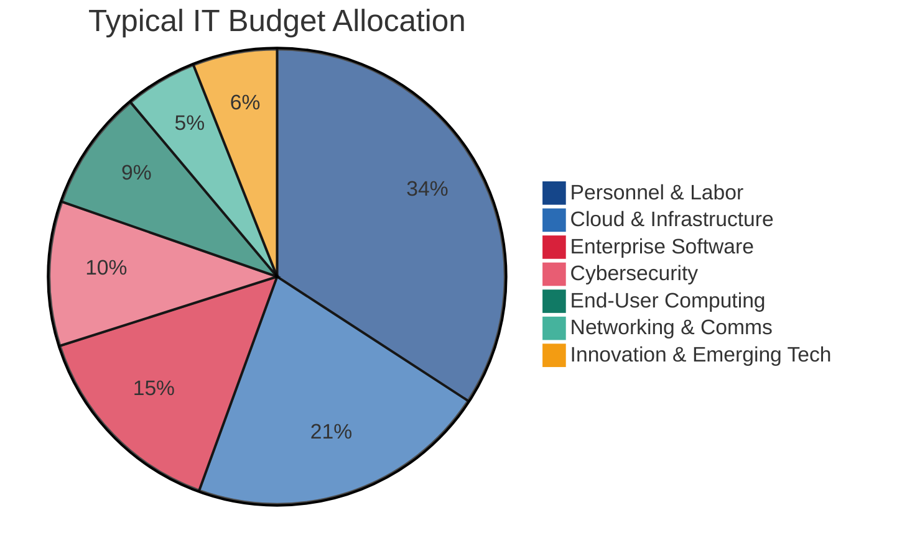
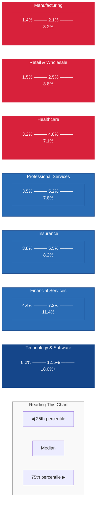
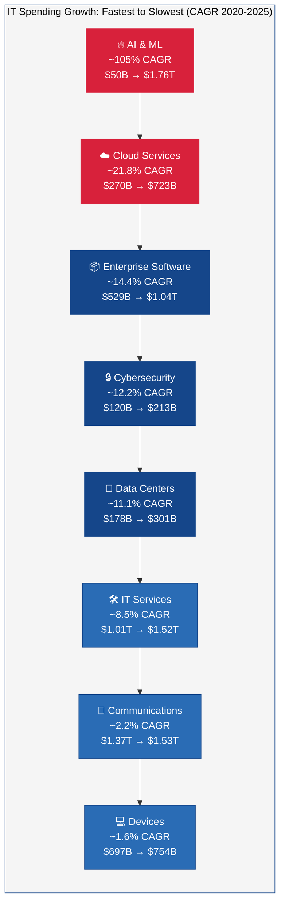

---
tags:
  - governance
  - finance
  - benchmarking
  - strategy
reading_time: 30
difficulty: Advanced
---

# The Economics of Enterprise IT Spending

!!! abstract "Disclaimer"
    This material was developed with AI assistance and is provided for **educational purposes only**. Data points reference published industry sources but may reflect rounding, revised forecasts, or AI-generated synthesis. Case studies are illustrative composites. Consult primary sources before using any data for business decisions. See the [full disclaimer](../disclaimer.md) for details on methodology and validation.

## Overview

Global IT spending hit $5.56 trillion in 2025 and is on track for $6.15 trillion in 2026 — growth rates of 10.3% and 10.8% respectively (Gartner, February 2026). To put that in perspective, worldwide IT spending now exceeds the GDP of every country on earth except the United States and China. Technology is not merely a corporate line item; it is one of the largest sectors of the global economy.

Yet most business leaders have only a vague sense of what "normal" IT spending looks like. Is 4% of revenue too much or too little? If your company spends $15,000 per employee on technology while a competitor spends $8,000, should you be worried — or proud? When a CIO requests a 12% budget increase for AI initiatives, how do you evaluate whether that tracks with market reality or reflects internal empire-building?

This page provides the benchmarking data, trend analysis, and analytical frameworks you need to answer those questions. It is deliberately complementary to the [IT Budgeting & Financial Management](it-budgeting.md) page, which covers *internal* budget mechanics — TCO analysis, CapEx vs. OpEx, business case methods, and the TBM framework. Here, the focus is *external*: how IT spending compares across industries, how it breaks down by category, where the growth is concentrated, and what the relationship is between IT investment and business performance.

!!! info "Why This Matters for MBA Students"
    Every board presentation, every IT business case, and every vendor negotiation involves implicit assumptions about what "normal" IT spending looks like. A CFO who challenges the CIO's budget request needs to know what peer companies are spending. A consultant recommending a digital transformation investment needs industry benchmarks to calibrate expectations. A general manager evaluating a make-vs-buy decision needs to understand the market rates for technology services. Benchmarking literacy — the ability to contextualize your organization's IT spending relative to industry, company size, and strategic intent — is a core competency for any business leader who touches technology decisions. And in 2026, that means every business leader.

---

## Key Concepts

### Global IT Spending: The Big Picture

The global IT spending trajectory over the past six years tells a story of disruption, recovery, and acceleration:

| Year | Global IT Spending | YoY Growth | Key Context |
|------|-------------------|-----------|-------------|
| 2020 | $3.75T | -2.2% | COVID-19 pandemic — initial contraction as organizations froze budgets |
| 2021 | $4.24T | +13.0% | Post-COVID rebound driven by remote work, cloud acceleration |
| 2022 | $4.49T | +5.9% | Supply chain normalization, continued cloud migration |
| 2023 | $4.73T | +5.3% | Enterprise software and cloud growth; early GenAI investments |
| 2024 | $5.04T | +6.6% | AI infrastructure buildout begins at scale |
| 2025 | $5.56T | +10.3% | AI spending surge: $1.76T on AI-related technology |
| 2026 (proj.) | $6.15T | +10.8% | AI spending reaches $2.52T; cloud crosses $870B |

*Source: Gartner Worldwide IT Spending Forecast, February 2026*

Several patterns stand out. First, the COVID dip in 2020 was shallow and short — unlike previous recessions where IT budgets were slashed 5-10%, most organizations maintained or accelerated their technology investments because digital capabilities were suddenly essential for survival. Second, growth has been *accelerating* since 2023, not decelerating — an unusual pattern driven almost entirely by AI investment. Third, IT spending as a percentage of global GDP has risen from approximately 4.3% in 2020 to an estimated 5.8% in 2026, reflecting technology's increasing share of total economic activity.

### IT Spending as Percentage of Revenue — Industry Deep Dive

The most common IT spending benchmark is the ratio of IT spending to total revenue. But a single industry "average" obscures enormous variation. The table below shows 25th percentile, median, and 75th percentile figures to reveal the full range:

| Industry | 25th Percentile | Median | 75th Percentile | Primary Spending Drivers |
|----------|----------------|--------|-----------------|------------------------|
| Technology & Software | 8.2% | 12.5% | 18.0%+ | IT *is* the product; R&D-intensive |
| Financial Services (Banking) | 4.4% | 7.2% | 11.4% | Trading platforms, regulatory compliance, digital banking, cybersecurity |
| Insurance | 3.8% | 5.5% | 8.2% | Claims processing, actuarial systems, regulatory reporting, digital channels |
| Healthcare | 3.2% | 4.8% | 7.1% | EHR systems, medical device integration, HIPAA compliance, telemedicine |
| Professional Services | 3.5% | 5.2% | 7.8% | Collaboration tools, knowledge management, client delivery platforms |
| Education | 3.0% | 4.5% | 6.8% | Learning management, research computing, campus infrastructure |
| Telecom & Media | 2.8% | 4.2% | 6.5% | Network infrastructure, content delivery, customer platforms |
| Retail & Wholesale | 1.5% | 2.5% | 3.8% | E-commerce, POS systems, supply chain, omnichannel |
| Manufacturing | 1.4% | 2.1% | 3.2% | ERP, IoT/automation, supply chain, quality systems |
| Construction | 1.0% | 1.8% | 2.8% | Project management, BIM software, field mobility |
| Energy & Utilities | 1.2% | 2.0% | 3.5% | SCADA systems, grid management, regulatory compliance, OT security |

*Sources: Gartner IT Key Metrics Data 2025; Avasant/Computer Economics IT Spending & Staffing Benchmarks 2025*

!!! tip "Reading the Table"
    The spread between 25th and 75th percentile within a single industry is often larger than the difference between industry medians. Financial services ranges from 4.4% to 11.4% — a 7-point spread. A bank at the 25th percentile (4.4% of revenue) still spends more on IT as a percentage of revenue than a manufacturer at the 75th percentile (3.2%). This means industry matters enormously, but where you sit *within* your industry matters nearly as much.

!!! question "Quick Check"
    - A board member from a manufacturing background (accustomed to 2% IT spend) joins the board of a financial services firm spending 8% of revenue on IT. She proposes cutting IT to 5% to "bring discipline." Using the industry benchmarking data, how would you frame a response that educates without dismissing her concern?
    - Two banks both spend 7% of revenue on IT. Bank A spends 75% on Run and 5% on Transform; Bank B spends 55% on Run and 25% on Transform. Which bank is likely getting more strategic value from its IT investment, and what questions would you ask to confirm your assessment?

**Why the variation across industries?** The fundamental driver is **information intensity** — the degree to which information processing is central to the business. Financial services firms are essentially information-processing companies: a bank's "product" is a set of ledger entries, risk calculations, and regulatory reports. Manufacturers, by contrast, create physical goods — information technology supports the process but does not constitute the product itself. The cross-industry average of 3.1-3.6% of revenue masks this structural difference.

### IT Spending per Employee

Percentage-of-revenue is the most common benchmark, but it can be misleading for companies with very high or very low revenue per employee. Per-employee IT spending provides a complementary view:

| Industry | IT Spend per Employee | Why the Level |
|----------|----------------------|---------------|
| Financial Services | $15,000 – $25,000+ | Knowledge-intensive; every employee needs sophisticated tools, data access, and security |
| Technology & Software | $18,000 – $30,000+ | Developers and engineers require high-end workstations, cloud resources, and specialized tools |
| Professional Services | $10,000 – $18,000 | Consultants and analysts are heavy users of collaboration, analytics, and client delivery platforms |
| Healthcare | $8,000 – $15,000 | Wide range: physicians and researchers are high consumers; support staff less so |
| Retail | $3,000 – $6,000 | Large frontline workforce with modest per-person IT needs; corporate staff higher |
| Manufacturing | $4,000 – $8,000 | Factory floor workers need less per-person IT than office workers; OT costs often separate |
| Construction | $3,000 – $5,000 | Field workers use mobile devices and project tools; office-based staff use more |

*Source: Avasant/Computer Economics IT Spending & Staffing Benchmarks 2025*

**When to use which metric:** Per-revenue benchmarks are most useful when comparing companies within the same industry with similar revenue models. Per-employee benchmarks are more useful when workforce composition varies — for example, comparing a highly automated manufacturer (high revenue per employee, low per-revenue IT spend) with a consulting firm (low revenue per employee, high per-revenue IT spend). Used together, they provide a richer picture than either metric alone.

### Where the IT Dollar Goes: Budget Allocation by Category

When organizations spend their IT budgets, where does the money actually go? The following breakdown represents a typical large enterprise:

| Category | Typical Allocation | What It Includes |
|----------|--------------------|------------------|
| **Personnel & Labor** | 35 – 45% | Internal IT staff salaries and benefits, contractors, outsourced services |
| **Cloud & Infrastructure** | 20 – 30% | Cloud services (IaaS, PaaS), data center operations, servers, storage |
| **Enterprise Software** | 15 – 20% | SaaS subscriptions, on-premises licenses, ERP/CRM maintenance fees |
| **Cybersecurity** | 10 – 15% | Security tools, SOC operations, compliance, identity management |
| **End-User Computing** | 8 – 12% | Laptops, monitors, mobile devices, help desk, collaboration tools |
| **Networking & Communications** | 5 – 8% | WAN/LAN infrastructure, SD-WAN, unified communications, internet access |
| **Innovation & Emerging Tech** | 5 – 10% | AI/ML platforms, R&D, proofs of concept, innovation lab operations |

**How allocation shifts by industry:** These averages mask significant industry-level variation. Banks allocate disproportionately to cybersecurity (often 15-20% of IT budget) because of regulatory requirements and the high value of financial data. Manufacturers spend more on OT infrastructure and IoT platforms that do not appear in a traditional IT budget. Retailers invest heavily in e-commerce and omnichannel platforms. Technology companies allocate far more to innovation and R&D because technology development is their core business, not a support function.

### Spending Trends: Where the Growth Is (2020–2026)

Not all categories of IT spending are growing equally. The table below highlights the major segments and their growth trajectories:

| Category | 2020 Spend | 2025 Spend | 2026 (Proj.) | CAGR (2020–2025) | Primary Growth Driver |
|----------|-----------|-----------|-------------|-------------------|----------------------|
| **AI & Machine Learning** | ~$50B | $1.76T | $2.52T | ~105% | GenAI infrastructure, enterprise AI adoption, GPU buildout |
| **Cloud Services** | $270B | $723B | ~$870B | ~21.8% | IaaS (24.8% growth), SaaS (19.2%), PaaS adoption |
| **Cybersecurity** | $120B | $213B | $240B | ~12.2% | Threat landscape expansion, regulatory compliance, zero trust |
| **Data Center Systems** | $178B | $301B | ~$330B | ~11.1% | AI-optimized servers, GPU clusters (+48.9% in 2025) |
| **IT Services** | $1.01T | $1.52T | $1.66T | ~8.5% | Cloud migration consulting, managed services, AI implementation |
| **Enterprise Software** | $529B | $1.04T | $1.15T | ~14.4% | SaaS growth, AI-embedded applications, platform consolidation |
| **Communications** | $1.37T | $1.53T | $1.57T | ~2.2% | Mature market; growth from 5G and SD-WAN |
| **Devices** | $697B | $754B | $794B | ~1.6% | Mature market; AI PC refresh cycle beginning |

*Source: Gartner Worldwide IT Spending Forecast, January–February 2026*

Several trends stand out:

**AI is the dominant growth story.** AI-related spending — which spans infrastructure (GPUs, data centers), software (AI platforms, GenAI tools), and services (AI consulting, implementation) — reached $1.76 trillion in 2025 and is projected to hit $2.52 trillion in 2026, a 44% YoY increase. GenAI spending alone is growing at 80%+ annually. AI infrastructure investment of $1.37 trillion in 2025 dwarfs the total cybersecurity market. This is the fastest reallocation of enterprise technology spending since the cloud transition began in the early 2010s.

**Cloud continues its structural shift.** Cloud services reached $723 billion in 2025 with 21.5% growth — a remarkable growth rate for a market already measured in hundreds of billions. IaaS grew 24.8% and SaaS 19.2%. The shift from on-premises to cloud is approximately 50-60% complete across the enterprise market, meaning years of migration-driven growth remain.

**Cybersecurity is a protected budget.** Cybersecurity spending reached $213 billion in 2025 and is growing at 12-15% annually — consistently outpacing overall IT spending growth. The average CISO budget now represents 13.2% of total IT spending, up from 8.6% in 2020 (IANS Research/Artico Search, 2024 Security Budget Benchmark Report). With the average cost of a data breach at $4.88 million in 2024 (IBM/Ponemon, Cost of a Data Breach Report 2024) and regulatory penalties increasing, security spending is viewed as non-discretionary by most boards.

**Digital transformation spending** is on track to reach $4 trillion by 2027, growing at a 16.2% CAGR (IDC). This broader category encompasses AI, cloud, IoT, and other modernization investments that collectively represent the reengineering of business operations around digital capabilities.

### The Margin–IT Spending Relationship

A natural question emerges from the industry data: do high-margin businesses spend more on IT? The answer is yes — but the relationship is more nuanced than simple causation.

| Industry | IT Spend (% Revenue) | Typical Operating Margin | Information Intensity |
|----------|---------------------|------------------------|----------------------|
| Technology & Software | 8 – 18% | 20 – 30% | Very High — IT is the product |
| Financial Services | 7 – 11% | 15 – 25% | Very High — products are information |
| Professional Services | 4 – 8% | 10 – 20% | High — knowledge-intensive delivery |
| Healthcare | 3 – 7% | 5 – 15% | Moderate-High — clinical data-intensive |
| Retail | 2 – 4% | 2 – 5% | Moderate — logistics and transaction-intensive |
| Manufacturing | 1 – 3% | 3 – 8% | Moderate — physical production is core |
| Construction | 1 – 3% | 3 – 7% | Lower — field and project-based |

The correlation between margins and IT spending is real, but the causal direction is not straightforward. It is not that high margins *cause* high IT spending, nor that high IT spending *causes* high margins. Rather, **information-intensive businesses tend to have both higher margins and higher IT spending** because information processing is the product itself. A bank's "factory" is its technology platform; a software company's inventory is its codebase. When information *is* the product, technology investment is product development — not overhead.

**The virtuous cycle:** For organizations that invest effectively, a reinforcing loop emerges: IT investment drives operational efficiency and new digital capabilities → efficiency and capabilities improve margins → higher margins create capacity for further IT investment → cycle repeats. McKinsey research has found that banks with greater digitization see nearly 2x the profit margins of digitization laggards within the same industry (McKinsey, "How Winning Banks Refocus Their IT Budgets for Digital").

!!! example "The Amazon Paradox"
    Amazon operates its retail business on razor-thin margins (2-4% operating margin) yet is one of the world's largest technology spenders. This apparent contradiction dissolves when you recognize that Amazon treats technology as a *strategic weapon* rather than a cost center. Its massive IT investment in logistics automation, recommendation engines, and cloud infrastructure (AWS) has created competitive advantages that generate returns through market dominance rather than margin expansion. Amazon's technology spending as a percentage of revenue (~12-15%) resembles a technology company, not a retailer — because, fundamentally, Amazon *is* a technology company that happens to sell physical goods. This is a cautionary tale for benchmarking: industry classification can obscure strategic reality.

!!! question "Quick Check"
    - The margin-IT spending relationship shows a correlation but not straightforward causation. A struggling retailer's CEO argues: "If high IT spending leads to high margins, we should double our IT budget." What is wrong with this reasoning, and how would you explain the actual relationship between IT investment and margins?
    - Consider the "virtuous cycle" of IT investment described above. Under what conditions could this cycle become a *vicious* cycle instead, where increased IT spending fails to produce efficiency gains or better margins?

### Within-Industry Variation: Top Spenders vs. Laggards

The range data in the industry benchmarking table reveals a critical insight: **the spread within an industry is often larger than the spread between industries.** Consider:

- **Financial services:** 25th percentile = 4.4%, 75th percentile = 11.4% — a **7.0-point spread**
- **Healthcare:** 25th percentile = 3.2%, 75th percentile = 7.1% — a **3.9-point spread**
- **Manufacturing:** 25th percentile = 1.4%, 75th percentile = 3.2% — a **1.8-point spread**

What drives within-industry variation?

- **Digital strategy** — Companies pursuing digital-first strategies spend more than those treating technology as a support function
- **Competitive positioning** — Market leaders often outspend followers; they are investing to extend their advantage or defending it against digital disruptors
- **Technical debt burden** — Organizations with large legacy estates spend more on Run, inflating totals without generating proportional value
- **Regulatory requirements** — Heavily regulated sub-sectors (e.g., investment banking vs. community banking) have higher compliance-driven IT costs
- **M&A history** — Companies that have grown through acquisition often have duplicative systems that inflate IT spending until they are rationalized
- **Company size** — Larger companies tend to spend slightly more as a percentage of revenue; economies of scale in IT are offset by the complexity of managing larger, more diverse technology estates

!!! warning "Averages Are Misleading"
    IT spending distributions within industries are typically right-skewed — a few very high spenders pull the average above the median. When benchmarking, always use **medians** (or percentile ranges) rather than means. An industry "average" of 5% may correspond to a median of 4.2% with a few outliers at 12-15% pulling the average up. Citing the average without understanding the distribution can lead to systematically over-targeting your IT budget.

### How Organizations Justify IT Investments

Understanding how much others spend is only half the equation. The harder question is whether your organization's IT spending is *creating value*. CIOs use several approaches to justify IT investment to boards and executive committees:

1. **Cost reduction and avoidance** — The most concrete justification: automation replacing $X in labor costs, cloud migration avoiding $Y in data center capital, or license rationalization saving $Z annually. CFOs respond well to cost reduction because it flows directly to the bottom line.

2. **Revenue enablement** — IT investments that directly enable revenue generation: e-commerce platforms, digital products, customer analytics that improve conversion rates. Harder to quantify than cost reduction but potentially higher value.

3. **Risk mitigation** — Cybersecurity investments justified by the cost of breaches (average: $4.88M per incident per IBM/Ponemon 2024), compliance systems justified by the cost of regulatory penalties, disaster recovery justified by the cost of downtime. The logic is insurance-like: spend $X to avoid an expected loss of $Y.

4. **Competitive necessity** — "Table stakes" investments that do not create competitive advantage but whose absence would create disadvantage. Examples: basic cybersecurity, current-generation ERP, mobile-friendly digital presence. The business case is existential rather than financial.

5. **Strategic option value** — Investments that create future flexibility without immediate measurable returns. Examples: building an AI/ML platform before having specific use cases, adopting a cloud-native architecture that enables future scalability, investing in data infrastructure that supports analytics capabilities not yet developed. This is the hardest to justify financially but often the most strategically important.

The CIO's challenge is translating these investment categories into language the board understands. Industry surveys consistently show that cost optimization ranks as a top CIO priority — Gartner's annual CIO Agenda research reports the vast majority of CIOs now identify it as their leading concern, reflecting board-level pressure to demonstrate value discipline even as total IT spending grows.

!!! tip "Cross-Reference"
    For detailed guidance on building IT business cases — including NPV, IRR, ROI, and payback period calculations — see [IT Budgeting & Financial Management](it-budgeting.md). This page provides the *context* (what others are spending); that page provides the *methods* (how to evaluate whether your spending is justified).

!!! question "Quick Check"
    - A CIO justifies a $20M AI platform investment using "strategic option value" -- the platform will enable future use cases not yet defined. The CFO counters that this is "spending money without knowing what we are buying." Which executive has the stronger argument, and how would you structure the investment to satisfy both perspectives?
    - Of the five IT investment justification approaches (cost reduction, revenue enablement, risk mitigation, competitive necessity, strategic option value), which is hardest to defend before a board? Why might that category still represent the most strategically important investments?

---

## Frameworks & Models

### IT Spending by Industry: The Benchmarking Landscape

The following diagram visualizes the range of IT spending (as % of revenue) across industries, illustrating both the inter-industry differences and the within-industry variation:

### IT Spending Growth by Category (2020–2026)

### Industry Benchmark Matrix

The following summary matrix provides a multi-dimensional view of IT spending by industry:

| Industry | IT % of Revenue (Median) | IT per Employee (Median) | Typical Run/Grow/Transform | Information Intensity |
|----------|-------------------------|-------------------------|---------------------------|----------------------|
| Technology & Software | 12.5% | $22,000 | 45 / 25 / 30 | Very High |
| Financial Services | 7.2% | $20,000 | 60 / 20 / 20 | Very High |
| Insurance | 5.5% | $14,000 | 65 / 20 / 15 | High |
| Professional Services | 5.2% | $13,000 | 55 / 25 / 20 | High |
| Healthcare | 4.8% | $11,000 | 70 / 18 / 12 | Moderate-High |
| Education | 4.5% | $9,000 | 70 / 18 / 12 | Moderate |
| Telecom & Media | 4.2% | $12,000 | 60 / 22 / 18 | High |
| Retail & Wholesale | 2.5% | $4,500 | 65 / 22 / 13 | Moderate |
| Manufacturing | 2.1% | $6,000 | 70 / 18 / 12 | Moderate |
| Energy & Utilities | 2.0% | $7,500 | 72 / 17 / 11 | Moderate |
| Construction | 1.8% | $4,000 | 75 / 15 / 10 | Lower |

*Note: Run/Grow/Transform ratios are approximations representing industry tendencies, not prescriptive targets.*

---

## Real-World Applications

*The following scenarios are illustrative composites — constructed from common industry patterns documented in Gartner, Avasant/Computer Economics, and Deloitte benchmarking studies — not accounts of specific named organizations. Benchmark figures within each scenario are consistent with published industry data cited elsewhere on this page.*

### Example 1: A Mid-Size Manufacturer Discovers It Is Under-Investing

A mid-size industrial manufacturer ($800M revenue) had prided itself on lean operations, including an IT budget of just $11.2M — 1.4% of revenue, placing it at the 25th percentile for manufacturing. The CIO, hired from a larger company, immediately recognized the gap. She commissioned an industry benchmark study that revealed:

- Peer companies averaging 2.1-2.5% of revenue on IT had invested heavily in shop floor automation, predictive maintenance analytics, and integrated supply chain visibility — areas where her company relied on manual processes and spreadsheets.
- The company's per-employee IT spend of $4,200 was below the 25th percentile, reflecting minimal investment in employee productivity tools.
- The Run/Grow/Transform ratio was 82/13/5 — the company was spending almost everything on keeping legacy systems alive and almost nothing on innovation.

The CIO presented a three-year investment plan to the board, requesting a phased increase to 2.5% of revenue ($20M). She framed the request not as "IT wants more money" but as "our competitors are investing in capabilities we lack." The analytics investment alone was projected to reduce unplanned downtime by 30% (worth $4.8M annually) and improve demand forecasting accuracy from 72% to 89%. The board approved a phased increase, starting with the highest-ROI investments in Year 1.

**Key Lesson:** Benchmarking revealed that "lean IT" was actually "under-invested IT." The company's cost discipline had created a competitive disadvantage masked by legacy systems that still technically worked — but worked worse than what competitors had deployed.

### Example 2: A Regional Bank's Board Questions "Excessive" IT Spending

A regional bank ($3.2B in assets) was spending 8.1% of revenue on IT — above the financial services median of 7.2%. Several board members, whose backgrounds were in manufacturing and real estate, repeatedly questioned why the bank needed to spend "so much" on technology. The CFO, sympathetic to their concerns, proposed a 20% IT budget reduction.

The CIO built a defense using multiple benchmarking dimensions:

- **Industry context:** 8.1% placed the bank at roughly the 55th percentile for financial services — squarely in the middle, not the high end. Banks at the 25th percentile (4.4%) were typically small community banks with limited digital offerings, not the competitive set for a regional bank pursuing digital banking growth.
- **Regulatory baseline:** The CIO estimated that 35% of IT spending ($9.1M) was directly attributable to regulatory compliance — anti-money laundering systems, fraud detection, SOX compliance, cybersecurity mandated by banking regulators. This spending was non-discretionary.
- **Competitive benchmark:** The three banks most frequently identified as competitors in the annual strategic plan spent 7.8%, 8.5%, and 9.2% of revenue on IT respectively. Cutting to 6.5% would place the bank below *all* of its competitive peers.
- **Category analysis:** The CIO showed that the bank's cybersecurity spending was actually *below* the financial services median, suggesting under-investment in a critical area, not over-investment overall.

The board withdrew the proposed cut and instead asked the CIO to present a quarterly IT spending dashboard showing category-level benchmarks against peer institutions. The conversation shifted from "How do we spend less?" to "Are we spending in the right areas?"

**Key Lesson:** Board members bring their industry context with them. A manufacturing executive accustomed to 1.5-3% IT spending will instinctively view 8% as excessive unless the CIO provides the benchmarking context that normalizes financial services spending levels. CIOs must proactively educate their boards on industry norms.

### Example 3: A Healthcare System Uses Benchmarking to Reallocate, Not Just Cut

A large healthcare system ($6B revenue, 12 hospitals) was spending 5.8% of revenue on IT — above the healthcare median of 4.8%. The CFO mandated a 15% IT cost reduction ($52M from the $348M budget). The CIO, rather than accepting an across-the-board cut, used category-level benchmarks to propose a strategic reallocation:

- **Legacy infrastructure:** The system was spending 28% of its IT budget on legacy data center operations — well above the 75th percentile for healthcare organizations of similar size, most of which had already migrated substantially to the cloud. A two-year cloud migration could reduce infrastructure costs by $38M while improving reliability.
- **Cybersecurity:** Spending was at the 25th percentile (8.5% of IT budget vs. a healthcare median of 11.2%). Given that healthcare is the most-breached industry and that HIPAA penalties had increased, this was a dangerous gap. The CIO proposed *increasing* cybersecurity spending by $12M.
- **Application rationalization:** A TBM analysis revealed 285 applications, of which 87 were redundant or underutilized. Retiring these could save $14M in licensing and support costs.
- **Net result:** Infrastructure savings ($38M) plus application rationalization ($14M) minus cybersecurity increase ($12M) yielded a net reduction of $40M (11.5%) while *improving* the organization's security posture and technology foundation.

The CFO accepted the plan because it delivered most of the requested savings while addressing a risk the board had flagged (cybersecurity under-investment). The CIO succeeded by reframing the conversation from "cut costs" to "reallocate to higher-value spending."

**Key Lesson:** Category-level benchmarking is far more actionable than total-spend benchmarking. Knowing you spend "too much" overall tells you nothing about *where* to cut. Knowing you are above the 75th percentile in infrastructure but below the 25th percentile in cybersecurity tells you exactly what to do.

---

## Common Pitfalls

!!! warning "Benchmarking as a Blunt Instrument"
    Industry averages hide enormous variation — the spread between 25th and 75th percentiles within a single industry often spans 3-7 percentage points. Using an industry median to *set* your IT budget is like using the average household income to determine your salary. Benchmarks are diagnostic tools, not targets. They should prompt questions ("Why are we above/below the median?") rather than dictate answers ("We must cut to the median"). Always understand your position relative to the full distribution, not just the average.

!!! warning "Confusing Spending with Value"
    Spending more on IT does not automatically create more value. An organization spending 10% of revenue on IT may be running a bloated legacy estate with high maintenance costs and minimal innovation, while a company spending 4% may have a modern, cloud-native architecture that delivers superior capabilities at lower cost. What matters is not just *how much* you spend but *how* you allocate it — the Run/Grow/Transform ratio, the alignment of spending with strategic priorities, and the efficiency with which technology investments are executed. A dollar spent on maintaining a 20-year-old system creates far less value than a dollar spent on automation that reduces operating costs.

!!! warning "Ignoring the 'Run Tax'"
    In most organizations, legacy system maintenance — the "Run" component of the budget — consumes 65-75% of total IT spending. This "Run tax" is the largest single drag on IT's ability to invest in growth and transformation. Organizations that do not actively manage this ratio — through legacy modernization, application rationalization, and cloud migration — find themselves in a vicious cycle: legacy costs grow, crowding out innovation spending, which means new systems are never built to replace the old ones, which means legacy costs continue to grow. Breaking this cycle requires treating legacy retirement as a strategic initiative, not an afterthought.

!!! warning "Treating IT as a Cost Center, Not an Investment"
    Organizations that view IT purely as overhead to be minimized systematically under-invest relative to peers and lose competitive ground over time. The cost-center mindset leads to across-the-board budget cuts that damage critical capabilities, resistance to growth and transformation spending, and a focus on short-term cost reduction at the expense of long-term value creation. The most successful organizations treat IT spending as a portfolio of investments — with Run as the "bond" component (stable, necessary, low-return), Grow as "growth equities" (moderate risk, moderate return), and Transform as "venture capital" (high risk, potentially high return). Managing the portfolio is more important than minimizing the total.

---

## Discussion Questions

1. **The Under-Investment Debate:** Your company (a mid-size insurer) spends 4.8% of revenue on IT. Industry benchmarks show the median is 6.2% and top-quartile performers spend 8%+. The CFO views this as efficient cost management; the CIO argues it represents chronic under-investment that is eroding competitive position. Using the frameworks and data in this section, how would you analyze this debate? What additional information would you need, and what metrics beyond percentage-of-revenue would you examine?

2. **Evaluating the AI Spending Wave:** AI spending is growing at 44% annually, and your board is asking whether the company should increase its AI budget in line with market growth. As a board member, how would you evaluate whether this growth rate reflects genuine strategic necessity for your organization, or whether market growth rates are inflated by hype and competitive fear-of-missing-out? What questions would you ask the CIO, and what evidence would help you distinguish productive AI investment from speculative spending?

3. **The Run/Grow/Transform Tradeoff:** Two companies in the same industry spend identical percentages of revenue on IT. Company A allocates 20/20/60 to Run/Grow/Transform while Company B allocates 75/15/10. What are the likely competitive implications over a 3-5 year horizon? Under what circumstances might Company B's allocation actually be the right strategy? What risks does each allocation create?

---

## Key Takeaways

- **Global IT spending reached $5.56 trillion in 2025** and is projected to hit $6.15 trillion in 2026 — exceeding the GDP of every country except the US and China. IT is not a corporate line item; it is a major sector of the global economy.
- **IT spending as a percentage of revenue varies enormously by industry** — from 1-3% in manufacturing and construction to 7-18% in financial services and technology. The primary driver is **information intensity**: businesses where information *is* the product spend far more than those where information supports a physical product.
- **Within-industry variation is often larger than between-industry differences.** Financial services IT spending ranges from 4.4% (25th percentile) to 11.4% (75th percentile). Using industry averages without understanding the distribution is misleading and potentially dangerous.
- **AI is the dominant growth story in enterprise IT** — reaching $1.76 trillion in 2025 with 44% YoY growth. Cloud ($723B, 21.5% growth) and cybersecurity ($213B, 12-15% growth) are the other high-growth categories.
- **The average CISO budget has grown from 8.6% to 13.2% of total IT spending** since 2020 (IANS Research), reflecting the escalating threat landscape and regulatory pressure. Cybersecurity is increasingly treated as non-discretionary spending.
- **Higher-margin industries tend to spend more on IT** — but the relationship is driven by information intensity, not margins per se. The virtuous cycle of IT investment → efficiency → higher margins → more investment capacity applies to organizations that invest *effectively*, not just those that spend more.
- **Category-level benchmarking is far more actionable than total-spend benchmarking.** Knowing your overall IT spend tells you little; understanding where you sit relative to peers in infrastructure, cybersecurity, applications, and innovation reveals where to reallocate.
- **Run spending (legacy maintenance) consumes 65-75% of typical IT budgets** and grows organically if unmanaged. Organizations that do not actively control the Run/Grow/Transform ratio find themselves trapped in a cycle of maintaining legacy systems with no resources for innovation.
- **IT investment should be evaluated as a portfolio** — with Run as the "bond" component, Grow as "growth equities," and Transform as "venture capital." The goal is not to minimize total spending but to optimize the allocation across risk and return profiles.
- **Benchmarks are diagnostic tools, not targets.** They should prompt questions — "Why are we above the median in infrastructure but below in cybersecurity?" — rather than dictate answers. Context, strategy, and execution matter more than matching an industry average.

---

## Related Topics

- [IT Budgeting & Financial Management](it-budgeting.md) — Internal budget mechanics: TCO analysis, CapEx vs. OpEx, business case methods (NPV, IRR, ROI), the TBM framework, chargeback models
- [Cloud Computing](../technology/cloud-computing.md) — Cloud economics, the CapEx-to-OpEx shift, service models, and FinOps
- [Cybersecurity](../risk-security/cybersecurity.md) — Security spending trends, the CISO budget, risk quantification, and the economics of breach prevention
- [AI & Emerging Tech](../transformation/ai-emerging-tech.md) — AI investment economics, build vs. buy for AI, deployment models, and cost structures
- [Digital Transformation](../transformation/digital-transformation.md) — Transformation spending, digital maturity models, and measuring transformation ROI
- [Enterprise Architecture](../technology/enterprise-architecture.md) — How architecture decisions drive long-term IT cost structures
- [Platform Economics](platform-economics.md) — Network effects, platform business models, and the economics of digital marketplaces

---

## Further Reading

- **Gartner.** *IT Key Metrics Data: IT Spending and Staffing Report.* Published annually. The industry standard for IT spending benchmarks by industry, company size, and region. Available through institutional access.
- **Deloitte.** *Global Technology Leadership Study.* Published annually. Survey of CIOs and CTOs covering budget trends, priorities, and organizational structures.
- **Avasant / Computer Economics.** *IT Spending and Staffing Benchmarks.* Published annually. Detailed spending data by industry and company size, including per-employee metrics and cost allocation breakdowns.
- **IDC.** *Worldwide IT Spending Guide.* Published quarterly. Granular forecasts by technology segment, industry, and geography.
- **Flexera.** *State of Tech Spend Report.* Published annually. Practitioner-focused survey covering IT budget priorities, cloud spending, and optimization strategies.
- **McKinsey & Company.** *Digital McKinsey: IT Spending and Performance Reports.* Research linking IT spending patterns to business performance, including the digitization-margin relationship.
- **FinOps Foundation.** *State of FinOps Report.* Published annually at [finops.org](https://www.finops.org). Cloud cost management trends, maturity benchmarks, and best practices.
- **IBM / Ponemon Institute.** *Cost of a Data Breach Report.* Published annually. The definitive source for data breach cost data, including industry and geographic breakdowns.
- **IANS Research / Artico Search.** *Security Budget Benchmark Report.* Published annually. CISO budget trends including security spending as a percentage of total IT budget.

---

!!! abstract "Disclaimer"
    This material was developed with AI assistance and is provided for **educational purposes only**. Data points reference published industry sources but may reflect rounding, revised forecasts, or AI-generated synthesis. Consult primary sources before using any data for business decisions. See the [full disclaimer](../disclaimer.md) for details.
