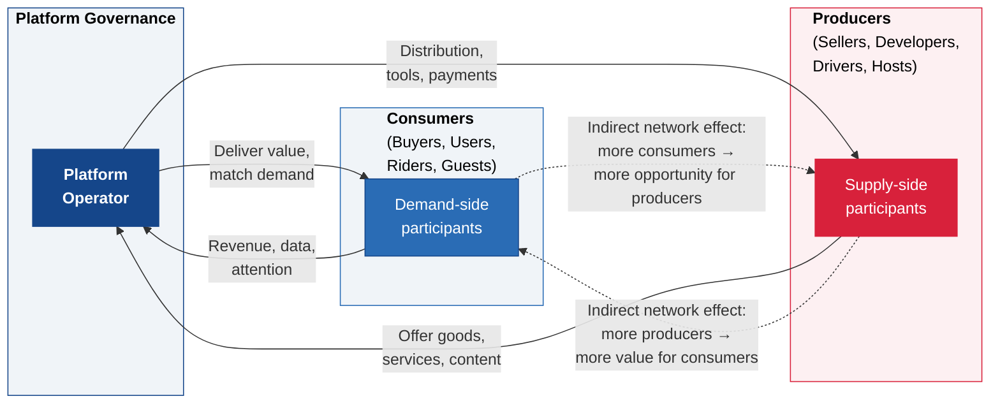
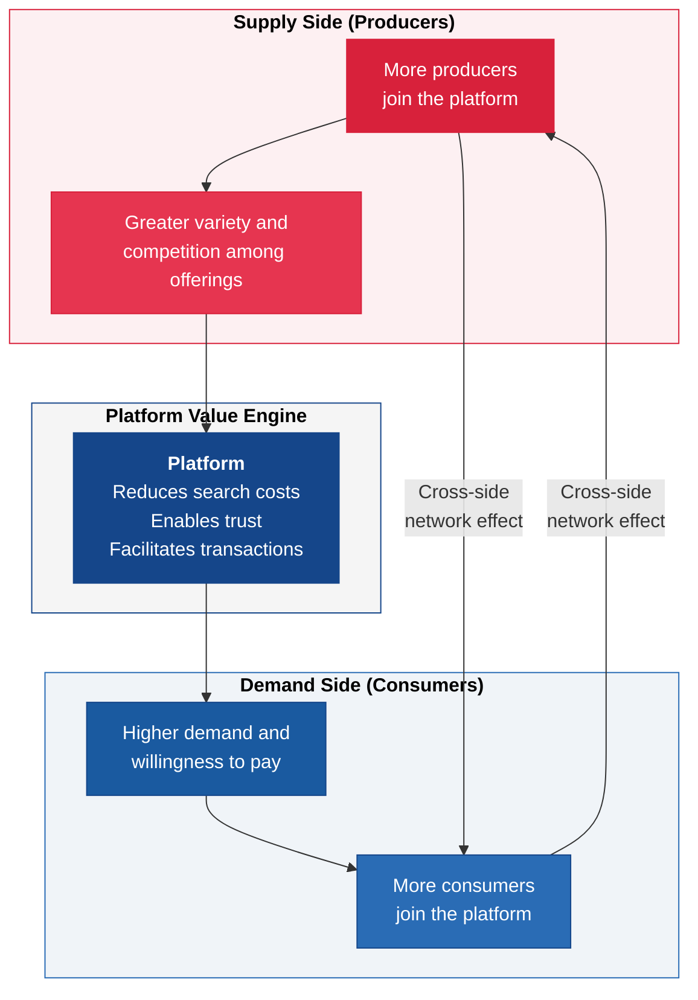

---
tags:
  - governance
  - strategy
  - economics
reading_time: 40
difficulty: Advanced
---

# Platform Economics & Network Effects

## Overview

Platform businesses -- Apple, Amazon, Uber, Airbnb, Google, Meta -- have become the most valuable companies in the world not by making physical products, but by creating ecosystems that connect producers and consumers. As of 2025, seven of the ten most valuable companies globally operate platform business models. This is not a coincidence. Platforms exploit a set of economic principles -- near-zero marginal costs, network effects, two-sided markets, and winner-take-all dynamics -- that give them structural advantages over traditional pipeline businesses. Understanding these principles is essential for any manager because platforms are reshaping industry after industry, from transportation and hospitality to healthcare and financial services.

The economics of platforms differ fundamentally from the economics taught in most introductory MBA courses. Traditional microeconomics assumes diminishing returns to scale: the hundredth factory is less efficient than the tenth. Platform economics often exhibits *increasing* returns to scale: the millionth user makes the platform more valuable, not less. Traditional competitive strategy assumes that firms compete to capture value within a defined industry. Platforms blur industry boundaries and compete to orchestrate entire ecosystems. Traditional pricing theory assumes that you charge customers what the product is worth. Platform pricing often requires giving the product away to one side of the market in order to attract the other side.

For MBA students, platform economics sits at the intersection of strategy, technology, and governance. You may never build a platform, but you will compete with platforms, partner with platforms, regulate platforms, invest in platforms, or lead a business unit that operates within a platform ecosystem. The frameworks in this section give you the analytical vocabulary to understand why platforms behave the way they do, why some succeed while others fail, and what the strategic implications are for businesses that must coexist with them.

!!! info "Why This Matters for MBA Students"
    Platform economics now appears in core strategy and technology management curricula at four of the six top MBA programs surveyed, and for good reason: platforms are the dominant business model of the digital economy. Whether you enter management consulting, corporate strategy, venture capital, product management, or general management, you will encounter platform dynamics in virtually every industry. Understanding network effects, two-sided markets, and platform governance is no longer a niche specialization -- it is foundational business literacy. The concepts on this page will equip you to analyze platform opportunities, evaluate competitive threats from platform entrants, and make informed decisions about when and how to participate in platform ecosystems.

---

## Key Concepts

### The Economics of Information Goods

Before understanding platforms, you need to understand the economics of the goods that platforms trade in. Most platform businesses deal in **information goods** -- software, data, digital content, matchmaking services -- and information goods have a cost structure that is radically different from physical goods.

The key characteristic of information goods is a **high fixed cost of creation combined with a near-zero marginal cost of reproduction**. Writing the first copy of a software application might cost $10 million. Producing the second copy costs essentially nothing -- it is a file that can be copied and distributed at negligible expense. This cost structure has profound implications:

| Characteristic | Physical Goods | Information Goods |
|----------------|----------------|-------------------|
| **Fixed cost** | Moderate to high (factory, equipment) | Very high (R&D, content creation, platform development) |
| **Marginal cost** | Significant (materials, labor, shipping) | Near zero (copying, distribution) |
| **Pricing** | Cost-plus (cover marginal cost + markup) | Disconnected from cost; driven by value, competition, and strategy |
| **Economies of scale** | Diminishing returns eventually | Increasing returns; the more you sell, the lower your average cost |
| **Competition** | Multiple competitors can coexist at similar scale | Tendency toward market concentration; first-mover or best-mover advantages are amplified |
| **Inventory risk** | Unsold inventory is a real cost | No physical inventory; digital goods do not spoil or occupy warehouse space |

This cost structure means that traditional cost-based pricing breaks down for information goods. If your marginal cost is zero, pricing at "marginal cost plus markup" produces a price near zero -- which cannot recover the enormous fixed cost of creating the product in the first place. Instead, platform and information goods businesses use strategic pricing models like freemium, versioning, bundling, and advertising-supported models (covered later in this section).

The near-zero marginal cost also creates a powerful incentive toward scale. Every additional unit sold reduces average cost, so larger firms have a structural cost advantage over smaller competitors. This is one reason why digital markets tend toward concentration -- a dynamic that platform business models amplify further through network effects.

### Network Effects

Network effects are the most important concept in platform economics. A **network effect** exists when the value of a product or service to each user increases as more users adopt it. Network effects are the engine that drives platform growth, creates competitive moats, and produces the winner-take-all dynamics that characterize many digital markets.

#### Types of Network Effects

**Direct (same-side) network effects** occur when users on the same side of a market benefit from each other's participation. The classic example is the telephone: the first telephone was useless because there was no one to call. The second telephone made the first one valuable. The millionth telephone made every other telephone more valuable. Modern examples include social networks (Facebook is more useful when more of your friends are on it), messaging platforms (WhatsApp is valuable because your contacts use it), and communication standards (email is universal precisely because everyone uses it).

**Indirect (cross-side) network effects** occur when users on one side of a market benefit from having more users on the other side. A gaming console is more valuable to gamers when more game developers create titles for it, and more developers want to create titles for a console that has more gamers. A ride-sharing platform is more valuable to riders when more drivers are available (shorter wait times), and more drivers join a platform that has more riders (higher earnings). Indirect network effects are the defining characteristic of platform businesses.

**Cross-side network effects** are a specific form of indirect network effects that operate across the two (or more) sides of a multi-sided platform. In a marketplace like Amazon, more sellers attract more buyers (who benefit from selection and price competition), and more buyers attract more sellers (who benefit from a larger customer base). In an advertising platform like Google Search, more users generate more data, which makes advertising more effective, which attracts more advertisers, which funds better search results, which attracts more users.

**Local vs. global network effects** distinguish between networks whose value depends on nearby users versus total users worldwide. Uber exhibits strong *local* network effects -- having more drivers in San Francisco benefits riders in San Francisco but does nothing for riders in Tokyo. Facebook exhibits *global* network effects -- your friends could be anywhere in the world, and every new user anywhere potentially adds value. This distinction has strategic implications: platforms with local network effects must win market by market (which makes them more vulnerable to regional competitors), while platforms with global network effects tend toward a single global winner.

#### Metcalfe's Law: The Mathematical Intuition

Robert Metcalfe, the co-inventor of Ethernet, observed that the potential value of a network grows much faster than its size. Specifically, **Metcalfe's Law** states that the value of a network is proportional to the square of the number of connected users (n^2^). The intuition is straightforward: in a network with *n* users, each user can potentially connect with (*n* - 1) other users, creating roughly n^2^ / 2 potential connections.

| Network Size (users) | Potential Connections | Relative Value |
|---------------------|---------------------|----------------|
| 10 | 45 | 1x |
| 100 | 4,950 | 110x |
| 1,000 | 499,500 | 11,100x |
| 10,000 | 49,995,000 | 1,111,000x |

In practice, Metcalfe's Law overstates network value because not all connections are equally valuable (you do not actually want to communicate with every person on Facebook). More refined models, such as those by Andrew Odlyzko, suggest that network value grows at closer to n * log(n) rather than n^2^. Nevertheless, the fundamental insight holds: **network value grows disproportionately faster than network size**, and this super-linear growth is what makes network effects so powerful as a competitive moat.

#### Negative Network Effects

Not all network effects are positive. **Negative network effects** occur when adding more users *decreases* the value of the platform for existing users. Congestion is the most common form: a social media platform overwhelmed by spam, a marketplace flooded with low-quality sellers, or a ride-sharing platform where too many drivers compete for too few rides (reducing driver earnings and causing driver churn). Managing negative network effects is a core governance challenge -- it requires moderation, quality control, and sometimes restricting growth to maintain platform value.

!!! tip "Key Insight for Strategists"
    Network effects create a positive feedback loop: more users make the platform more valuable, which attracts more users, which makes it more valuable still. This virtuous cycle is what investors call a "flywheel." Once a platform achieves sufficient scale, the flywheel becomes self-reinforcing and extremely difficult for competitors to disrupt -- which is why platform markets so often tip toward a dominant player. However, platforms must also manage the negative network effects that accompany scale -- spam, congestion, declining quality, and governance complexity -- or the flywheel can reverse.

!!! question "Quick Check"
    - LinkedIn has both direct network effects (professionals connecting with each other) and indirect network effects (recruiters attracted by job seekers, and vice versa). If LinkedIn's quality degrades due to spam and low-quality content, which type of network effect is most at risk of reversing first, and what would the consequences be?
    - A city-based food delivery startup has strong local network effects in its home market. A well-funded national competitor enters with massive subsidies. Using the concepts of local vs. global network effects and multi-homing costs, evaluate whether the local startup can survive.

### Two-Sided Markets and Platform Dynamics

A **two-sided market** (also called a multi-sided market) is a market in which a platform serves two or more distinct user groups who benefit from each other's participation. The platform's role is to reduce search costs and transaction costs between these groups, making it easier for them to find each other and do business.

Two-sided markets are not new -- newspapers (connecting readers and advertisers), shopping malls (connecting retailers and shoppers), and credit card networks (connecting merchants and cardholders) have operated as two-sided markets for decades. What is new is the ability of digital platforms to operate two-sided markets at enormous scale, with near-zero marginal costs, rich data about participants on both sides, and algorithmic matching that dramatically reduces search and transaction friction.

#### The Chicken-and-Egg Problem

The central strategic challenge for any new platform is the **chicken-and-egg problem**: you need producers to attract consumers, but you need consumers to attract producers. No riders will download a ride-sharing app with no drivers, and no drivers will sign up for a platform with no riders. Every successful platform must solve this bootstrapping problem, and the strategy for doing so is often the difference between success and failure.

Common strategies for solving the chicken-and-egg problem include:

- **Subsidize one side** -- Offer one side of the market free or deeply discounted access to attract them first, then use their presence to attract the other side. Uber subsidized early riders with below-cost fares and guaranteed drivers minimum hourly earnings regardless of trip volume.
- **Single-player utility** -- Make the platform useful to one side even without the other side present. OpenTable gave restaurants a reservation management tool (useful standalone) before any diners had adopted the platform.
- **Seed the supply side** -- Manually recruit or create the supply side. Amazon started by selling books itself before opening the marketplace to third-party sellers. Airbnb founders personally photographed early listings to make them appealing.
- **Marquee users** -- Recruit high-profile participants whose presence signals quality and attracts others. Video game consoles sign exclusive deals with marquee game studios before launch.
- **Piggyback on an existing network** -- Build initial supply by importing content or users from an established platform. PayPal grew by embedding itself into eBay's auction marketplace. YouTube grew partly because users embedded videos on MySpace pages.

#### Tipping Points and Winner-Take-All Dynamics

In markets with strong network effects, there is often a **tipping point** -- a critical mass of adoption beyond which the platform's growth becomes self-sustaining and accelerating. Before the tipping point, growth is slow and uncertain. After the tipping point, the flywheel spins faster and the platform pulls away from competitors.

This dynamic can produce **winner-take-all** (or winner-take-most) outcomes, where a single platform dominates the market and competitors are marginalized or eliminated. Classic examples include:

- **Desktop operating systems** -- Windows dominated for decades, not because it was technically superior, but because more users attracted more software developers, which attracted more users.
- **Social networking** -- Facebook achieved such scale that competitors like Google+ could not build a viable alternative network, even with Google's enormous resources.
- **Ride-sharing** -- In most markets, one or two platforms dominate because drivers and riders concentrate on the platform with the most participants.

However, winner-take-all outcomes are not inevitable. Markets tip toward a single dominant platform only when three conditions are met simultaneously:

1. **Strong network effects** -- each additional user significantly increases platform value
2. **High multi-homing costs** -- users find it burdensome or costly to use multiple platforms
3. **Limited differentiation** -- platforms offer similar value propositions to similar user segments

When these conditions are not met -- when network effects are local, multi-homing is easy, or segments have different needs -- multiple platforms can coexist. The food delivery market (DoorDash, Uber Eats, Grubhub) is an example: network effects are local, restaurants and consumers multi-home freely across platforms, and platforms compete primarily on delivery speed and restaurant selection rather than network scale alone.

!!! question "Quick Check"
    - Apply the three conditions for winner-take-all outcomes (strong network effects, high multi-homing costs, limited differentiation) to the enterprise cloud market (AWS, Azure, Google Cloud). Does this market meet all three conditions? What does your analysis predict about long-term market structure?
    - A venture capitalist asks you to evaluate a startup that plans to displace Uber in the US ride-sharing market. Using the tipping point and chicken-and-egg concepts, identify the two or three biggest barriers this startup would face and assess whether the market structure leaves room for a third major competitor.

### Platform Business Models

Platforms are not monolithic. They take several distinct forms, each with different value creation mechanisms, revenue models, and governance challenges.

| Platform Type | Description | Revenue Model | Examples |
|---------------|-------------|---------------|----------|
| **Marketplace** | Connects buyers and sellers of goods or services | Transaction fees, commissions, listing fees | Amazon Marketplace, eBay, Etsy |
| **App Store / Ecosystem** | Provides a distribution channel for third-party developers | Revenue share (typically 15-30%), developer fees | Apple App Store, Google Play |
| **Social / Content** | Connects users who create and consume content | Advertising, premium subscriptions | Facebook, LinkedIn, YouTube |
| **Infrastructure / Cloud** | Provides computing resources as a platform for developers and businesses | Usage-based pricing (compute, storage, bandwidth) | AWS, Microsoft Azure, Google Cloud |
| **Operating System** | Provides the foundational layer on which applications run | Licensing, device bundling, ecosystem revenue | Windows, Android, iOS |
| **Hybrid** | Combines marketplace, content, and infrastructure elements | Multiple revenue streams | Amazon (marketplace + AWS + Prime content + advertising) |

An important distinction in platform strategy is between **pipeline businesses** and **platform businesses**. A pipeline business creates value by controlling a linear sequence of activities -- design, manufacture, market, sell. A platform business creates value by facilitating interactions between external producers and consumers. The same company can operate both models simultaneously: Apple is a pipeline business when it designs and sells iPhones, and a platform business when it operates the App Store. Understanding which parts of your business are pipeline and which are platform is critical because the strategic logic, competitive dynamics, and management practices differ fundamentally between the two.

!!! example "Amazon: The Platform of Platforms"
    Amazon is perhaps the most complex platform in the world because it operates multiple overlapping platform models simultaneously. Amazon Marketplace is a two-sided marketplace connecting third-party sellers with buyers. AWS is an infrastructure platform serving developers and enterprises. Prime Video is a content platform competing with Netflix and Disney+. Amazon Advertising is an advertising platform embedded within the marketplace. Alexa is a voice-computing platform with its own app ecosystem. Each platform reinforces the others -- Prime membership drives marketplace purchases, marketplace data informs advertising targeting, and AWS infrastructure powers the entire operation. This layered platform strategy is exceptionally difficult for competitors to replicate.

### Platform Governance

Platform governance refers to the rules, standards, and mechanisms by which a platform operator manages the behavior of participants. Governance is the often-invisible infrastructure that determines whether a platform is trustworthy, fair, and sustainable. Poor governance can destroy a platform as surely as poor technology.

#### Key Governance Dimensions

**Access and participation rules** determine who can join the platform and under what conditions. Apple's App Store requires developers to meet strict guidelines for functionality, security, and content. Airbnb requires hosts to meet minimum quality and safety standards. Amazon Marketplace has policies on product authenticity and seller behavior. Open platforms (like the web itself) have minimal access rules, while curated platforms (like the App Store) exercise significant gatekeeping authority.

**Quality control and trust mechanisms** ensure that interactions on the platform meet minimum quality standards. These include:

- **Rating and review systems** -- eBay's seller ratings, Uber's driver ratings, Airbnb's host and guest reviews
- **Verification and identity** -- LinkedIn's employment verification, Airbnb's identity verification
- **Dispute resolution** -- Amazon's A-to-Z guarantee, PayPal's buyer protection
- **Content moderation** -- YouTube's content policies, Facebook's community standards
- **Algorithmic curation** -- Google's search ranking, Amazon's product recommendations

**Pricing and revenue sharing** determine how the platform captures value and how that value is distributed among participants. Platform operators must balance the need to generate revenue against the risk of extracting so much value that participants leave. Apple's 30% commission on App Store transactions has been the subject of antitrust scrutiny precisely because developers argue it is excessive relative to the value Apple provides.

**Openness vs. control** is the fundamental governance tension. Open platforms (Android, the open web) attract more developers and innovation but sacrifice quality control and consistency. Closed platforms (iOS, gaming consoles) maintain quality and security but limit participation and risk stifling innovation. Most successful platforms find a middle ground -- open enough to attract a vibrant ecosystem, closed enough to maintain trust and quality.

### Pricing Digital Goods

Because information goods have near-zero marginal cost, traditional cost-plus pricing does not apply. Instead, platform and digital businesses use a range of strategic pricing models:

**Versioning** offers the same underlying product at different quality or feature levels to extract different willingness-to-pay from different customer segments. Microsoft offers Windows Home, Pro, and Enterprise editions; LinkedIn offers Free, Premium Career, and Sales Navigator tiers. The marginal cost difference between versions is negligible -- the differentiation is strategic, not cost-driven.

**Bundling** packages multiple products together at a price lower than the sum of individual prices. Microsoft 365 bundles Word, Excel, PowerPoint, Outlook, Teams, and cloud storage. Adobe Creative Cloud bundles dozens of creative applications. Bundling works because it reduces the variance in willingness-to-pay across customers, capturing more total revenue than selling individual products.

**Freemium** gives the basic product away for free and charges for premium features, capacity, or service levels. Spotify, Dropbox, Slack, LinkedIn, and Zoom all use freemium models. The free tier acquires users at scale (reducing customer acquisition cost to near zero), and a small percentage -- typically 2-5% -- convert to paid plans that generate all of the revenue. The free users are not freeloaders; they generate network effects, word-of-mouth marketing, and data that improves the product.

**Razor-and-blade** (also called loss-leader) pricing sells the platform or hardware at cost or below cost, and profits from ongoing consumables or services. Gaming consoles (sell the console at a loss, profit from game sales and subscriptions), printers (cheap printers, expensive ink cartridges), and Amazon's Kindle (subsidized hardware, profitable e-book sales) all follow this model.

**Advertising-supported** models offer the product for free to end users and monetize attention by selling advertising. Google Search, Facebook, Instagram, YouTube, and most news websites use this model. The platform's real customers are the advertisers; the users are the product (or more precisely, user attention and data are the product).

| Pricing Model | How It Works | When It Works Best | Risk |
|---------------|-------------|-------------------|------|
| **Versioning** | Good-better-best tiers at different price points | When customer segments have clearly different willingness-to-pay | Cannibalization if tiers are not differentiated enough |
| **Bundling** | Multiple products sold as a package | When customers value different products, reducing variance in total willingness-to-pay | Customers forced to pay for features they do not want |
| **Freemium** | Free basic tier; paid premium tier | When free users generate network effects or word-of-mouth that justify the cost of serving them | Conversion rates too low to sustain the business |
| **Razor-and-blade** | Subsidize the platform; profit from usage | When ongoing consumption is predictable and recurring | Customers buy the razor and use third-party blades |
| **Advertising** | Free to users; monetize attention | When user base is large enough to attract advertisers | Ad-heavy experience degrades user satisfaction and drives churn |

### Lock-In, Switching Costs, and Standards Wars

**Lock-in** occurs when the cost of switching from one product, platform, or standard to another is so high that customers remain with their current choice even if alternatives are objectively better. Lock-in is not inherently negative -- it often reflects genuine value that has been created (your data in a system, your skills with a tool, your network on a platform) -- but it gives incumbent platforms enormous pricing power and competitive resilience.

Sources of lock-in include:

- **Data lock-in** -- Your company's ten years of ERP data cannot be easily migrated to a competitor's system
- **Learning curve lock-in** -- Employees trained on Microsoft Excel resist switching to Google Sheets
- **Network lock-in** -- Your professional contacts are on LinkedIn; switching to an alternative network means starting from scratch
- **Contractual lock-in** -- Multi-year enterprise agreements with volume discounts and exit penalties
- **Complementary asset lock-in** -- Your organization has built custom integrations and workflows around a specific platform

**Switching costs** are the tangible and intangible costs a customer incurs when moving from one platform to another. These include data migration, retraining, lost integrations, lost network connections, and the risk of disruption during the transition.

**Standards wars** occur when competing platforms or technologies vie to become the dominant standard in a market. Historical examples include VHS vs. Betamax, Blu-ray vs. HD DVD, and iOS vs. Android. Standards wars are especially fierce in markets with strong network effects because the winner captures a disproportionate share of market value, while the loser may be driven to extinction.

Shapiro and Varian identify several tactics that firms use to win standards wars:

- **Build an installed base early** -- Subsidize adoption to establish a critical mass of users before competitors do
- **Attract complements** -- Ensure that third-party developers, content creators, or accessory manufacturers support your standard
- **Make preemptive commitments** -- Announce future products and features to discourage customers from adopting a rival standard (a tactic sometimes called "vaporware" when taken to an extreme)
- **Leverage backward compatibility** -- Ensure that your new standard is compatible with existing products, reducing switching costs for current users
- **Form alliances** -- Build coalitions of firms that collectively commit to your standard, as the Blu-ray Disc Association did to defeat HD DVD

The strategic choice between **proprietary and open standards** is central to platform strategy. Proprietary standards (Apple's iOS, Microsoft's Office formats historically) allow the platform owner to capture more value per user but limit the ecosystem's size. Open standards (Android, HTML/CSS/JavaScript, USB) attract broader adoption but make it harder for any single firm to capture outsized value. Many successful platform strategies combine elements of both: Android is open-source, but Google controls the Play Store and key services that run on top of Android.

**Path dependence** refers to the phenomenon where early choices -- even somewhat arbitrary ones -- become locked in over time as an ecosystem builds around them. The QWERTY keyboard layout, the dominance of the x86 processor architecture, and the persistence of Microsoft Office file formats are all examples of path dependence. For managers, path dependence means that the timing of platform adoption decisions matters enormously: waiting too long can mean that the market has already tipped and switching costs have become prohibitive.

!!! question "Quick Check"
    - Your company has been using a proprietary enterprise platform for eight years and has accumulated extensive data, custom integrations, and trained staff. A competitor offers a superior alternative at lower cost. Using the sources of lock-in, identify which switching costs are highest and evaluate whether migration is worth the disruption.
    - A SaaS company is debating whether to adopt an open API standard or keep its proprietary format. Apply the proprietary vs. open standards tradeoff to advise them: what do they gain and lose with each approach, and how should their market position (leader vs. challenger) influence the decision?

### Platform Regulation

As platforms have grown to dominate major sectors of the economy, regulators worldwide have begun to scrutinize their market power, data practices, and competitive behavior.

**Antitrust concerns** center on several recurring issues: platforms leveraging dominance in one market to foreclose competition in adjacent markets (Google using Search dominance to advantage Google Shopping), platforms engaging in self-preferencing (Amazon allegedly favoring its own products over third-party sellers), and platforms imposing excessive fees on captive participants (Apple's 30% App Store commission).

**The EU Digital Markets Act (DMA)**, which took effect in 2023, is the most significant regulatory framework specifically targeting large platforms (designated as "gatekeepers"). The DMA imposes obligations including interoperability requirements (messaging platforms must allow cross-platform communication), prohibitions on self-preferencing (platforms cannot rank their own services ahead of competitors), data portability requirements (users must be able to export their data), and restrictions on combining personal data across services without consent.

**Interoperability mandates** require platforms to allow third-party access to their systems. This can take the form of API access requirements, data portability rights, or technical standards that prevent lock-in. Proponents argue that interoperability promotes competition and user choice. Opponents argue that forced interoperability can compromise security, quality, and the incentive to innovate.

**Data regulation** intersects heavily with platform economics. Platforms accumulate enormous quantities of user data, which simultaneously creates value (better recommendations, more targeted advertising) and raises concerns about privacy, surveillance, and data exploitation. GDPR in Europe, various state-level privacy laws in the United States, and similar regulations globally impose constraints on how platforms collect, use, and share data.

**Platform labor regulation** addresses the status of workers who participate in platform ecosystems. Uber, Lyft, DoorDash, and similar platforms classify workers as independent contractors rather than employees, which reduces costs but also eliminates benefits like health insurance, minimum wage guarantees, and unemployment protection. Regulatory battles over worker classification -- including California's Proposition 22 and EU directives on platform work -- illustrate how platform business models can create governance challenges that extend well beyond technology.

!!! note "The Regulatory Landscape Is Evolving Rapidly"
    Platform regulation is one of the most dynamic areas of technology policy. The EU DMA, US antitrust cases against Google, Apple, Amazon, and Meta, and emerging regulations in countries like India, Japan, and South Korea are all actively reshaping the competitive landscape. MBA students should expect the regulatory environment around platforms to continue evolving significantly over the course of their careers. Staying current on these developments is essential for anyone involved in platform strategy, technology policy, or corporate governance.

---

## Frameworks & Models

### Two-Sided Platform Value Creation Model

The following diagram illustrates the fundamental dynamics of a two-sided platform, showing how indirect network effects create a reinforcing cycle of value creation across both sides of the market.

### Platforms vs. Pipelines: A Comparative Framework

Understanding the structural differences between platform and pipeline businesses is essential for strategic analysis:

| Dimension | Pipeline Business | Platform Business |
|-----------|-------------------|-------------------|
| **Value creation** | Produces goods or services internally | Facilitates interactions between external participants |
| **Assets** | Owns physical or intellectual assets | Orchestrates ecosystem; key asset is the network |
| **Scaling** | Linear: more output requires proportionally more input | Non-linear: network effects enable super-linear growth |
| **Competitive moat** | Brands, patents, economies of scale, supply chain efficiency | Network effects, data, switching costs, ecosystem lock-in |
| **Marginal cost** | Significant per-unit cost | Near-zero for each additional transaction facilitated |
| **Risk profile** | Inventory, production, and demand forecasting risk | Chicken-and-egg, governance, trust, and regulatory risk |
| **Examples** | Toyota, Procter & Gamble, Boeing | Uber, Airbnb, Apple App Store, Google Search |

This framework helps managers recognize when a platform entrant is fundamentally reshaping an industry (as Airbnb did to hospitality) versus when a traditional pipeline model remains the appropriate competitive approach.

### Platform Strategy Decision Framework

When evaluating whether a platform opportunity exists or how to compete in a platform market, the following strategic questions provide a structured approach:

| Strategic Question | What It Assesses | Implications |
|--------------------|------------------|-------------|
| **Are network effects present?** | Whether more users create value for other users | If no, a traditional pipeline model may be more appropriate |
| **Which type of network effects?** | Direct, indirect, local, or global | Determines growth strategy and geographic expansion approach |
| **How strong are multi-homing costs?** | Whether users will use multiple competing platforms | Low multi-homing costs reduce winner-take-all dynamics |
| **What is the chicken-and-egg strategy?** | How to solve the bootstrapping problem | Determines initial go-to-market and subsidy strategy |
| **Where is the tipping point?** | The critical mass needed for self-sustaining growth | Determines how much investment is needed before profitability |
| **What governance model is needed?** | How to balance openness, quality, and control | Determines platform rules, moderation, and trust infrastructure |
| **What are the regulatory constraints?** | How antitrust and data regulation affect the strategy | Determines the legal and political limits of platform power |

---

## Real-World Applications

### Apple App Store Ecosystem

Apple's App Store, launched in 2008, is one of the most successful platform businesses in history. It demonstrates virtually every principle of platform economics.

**Network effects**: The App Store exhibits powerful indirect network effects. More app developers create more apps, which makes the iPhone more valuable to consumers, which increases iPhone sales, which attracts more developers. As of 2024, the App Store hosts over 1.8 million apps and generated an estimated $1.1 trillion in developer billings and sales globally.

**Governance**: Apple exercises tight governance over its platform. Every app undergoes a review process for functionality, security, and content. Apple sets strict design guidelines (Human Interface Guidelines) that maintain a consistent user experience. This "walled garden" approach has been praised for quality and security but criticized for stifling competition and innovation.

**Pricing controversy**: Apple charges a 30% commission on most App Store transactions (reduced to 15% for small developers). This pricing has been challenged by Epic Games (the maker of Fortnite) in a landmark antitrust lawsuit and by regulators in the EU under the DMA. The case illustrates the tension between a platform's right to monetize its ecosystem and the risk of extracting excessive rents from captive participants.

**Lock-in**: Once a consumer has invested in Apple's ecosystem -- purchased apps, stored data in iCloud, become proficient with iOS, and acquired Apple-compatible accessories -- switching to Android involves substantial switching costs. This ecosystem lock-in is a deliberate strategic asset. Apple reinforces lock-in through exclusive features (iMessage, AirDrop, FaceTime) that work only between Apple devices, creating social pressure to remain within the ecosystem. The EU DMA is now challenging some of these practices by requiring interoperability for messaging services.

**Chicken-and-egg solution**: When the App Store launched, Apple solved the bootstrapping problem by leveraging the existing iPhone installed base. The iPhone had already sold millions of units as a premium smartphone before the App Store existed. Developers were attracted to this large, affluent, and engaged user base. Apple also seeded early supply by providing development tools (the iOS SDK) for free and featuring high-quality apps prominently, reducing developers' customer acquisition costs to near zero.

### Amazon Marketplace

Amazon's transition from online retailer to marketplace platform is a textbook case of platform economics at scale.

**Two-sided market**: Amazon Marketplace connects over 2 million active third-party sellers with hundreds of millions of active customer accounts. Third-party sellers now account for approximately 60% of all units sold on Amazon, meaning that Amazon is more platform than retailer.

**Chicken-and-egg solution**: Amazon solved the bootstrapping problem by being its own first seller. By building a massive customer base through its own retail operations, Amazon created a demand side that was already in place when it opened the marketplace to third-party sellers. Sellers were attracted by an existing audience of millions of shoppers.

**Governance and self-preferencing**: Amazon's platform governance has been the subject of intense scrutiny. Critics allege that Amazon uses data from third-party seller transactions to identify successful products and then launches competing private-label alternatives -- effectively using its position as platform operator to compete against its own participants. This self-preferencing concern is a central allegation in the FTC's antitrust case against Amazon.

**Fulfillment as platform infrastructure**: Fulfillment by Amazon (FBA) extends the platform model into logistics. Sellers ship inventory to Amazon's warehouses, and Amazon handles storage, picking, packing, shipping, and returns. FBA creates additional lock-in: sellers become dependent on Amazon's logistics infrastructure, and products fulfilled by Amazon receive the "Prime" badge that significantly boosts sales.

### Uber and the Two-Sided Market

Uber is a canonical example of a two-sided platform with strong local network effects operating in a market with relatively low barriers to multi-homing.

**Local network effects**: Uber's value proposition depends on having enough drivers nearby to provide short wait times. Network effects are geographically bounded -- having more drivers in Chicago does not help riders in Miami. This local characteristic forced Uber to launch city by city, subsidize both sides of the market in each new city, and compete for dominance market by market.

**Subsidy-driven growth**: In its early years, Uber spent billions subsidizing both sides of the market. Riders received promotional fares well below the actual cost of a trip. Drivers received guaranteed minimum hourly earnings regardless of trip volume. The strategic logic was to invest heavily in reaching the tipping point of network density in each market, after which the flywheel would become self-sustaining and subsidies could be reduced.

**Multi-homing challenge**: Both riders and drivers can easily use competing platforms (Lyft, local alternatives) simultaneously. Drivers often run both Uber and Lyft apps at the same time, accepting whichever ride request comes first. This low multi-homing cost limits Uber's ability to achieve a true winner-take-all position and constrains its pricing power, which is why the ride-sharing market has generally evolved toward a duopoly (Uber and Lyft in the US) rather than a monopoly.

**Dynamic pricing as governance**: Uber's surge pricing algorithm is a platform governance mechanism, not just a pricing tool. When demand exceeds supply in a geographic area, prices rise automatically. This serves two functions: it rations demand (some riders decide to wait or take an alternative) and it incentivizes supply (drivers move toward the high-demand area to earn more). Surge pricing is economically efficient but politically controversial -- consumers perceive it as price gouging, especially during emergencies or bad weather. Uber's ongoing challenge is balancing the economic logic of dynamic pricing against the reputational risk of appearing to exploit customers.

### Airbnb and Trust Mechanisms

Airbnb illustrates how platform governance -- specifically trust and safety mechanisms -- can unlock a market that traditional businesses could not serve.

**Creating a market that did not exist**: Before Airbnb, the idea of staying in a stranger's home while traveling was culturally unusual in most Western markets. Airbnb did not just connect existing supply and demand -- it created both sides of a market by making the transaction trustworthy and convenient.

**Trust infrastructure**: Airbnb invested heavily in trust mechanisms: verified identity (government ID checks), mutual reviews (hosts review guests and guests review hosts), professional photography of listings, a messaging system that keeps communication on-platform, secure payment processing with funds held in escrow, and a Host Guarantee that provides property damage protection. Each of these mechanisms reduces the perceived risk of the transaction and makes participants willing to engage with strangers.

**Governance evolution**: As Airbnb scaled, its governance evolved to address emergent challenges: party houses, discriminatory hosts, regulatory conflicts with local housing laws, and the impact of short-term rentals on affordable housing. Airbnb implemented anti-discrimination policies, occupancy limits, noise detection devices, and compliance tools that help hosts follow local regulations. This illustrates a general principle: platform governance is not static. As platforms grow, new governance challenges emerge that require new rules and mechanisms.

**Regulatory conflict as a platform risk**: Airbnb has faced regulatory pushback in virtually every major city it operates in. Cities like New York, Barcelona, and Amsterdam have imposed restrictions on short-term rentals, arguing that they reduce affordable housing stock, displace long-term residents, and disrupt neighborhoods. Airbnb has responded with a mix of compliance tools (automatic enforcement of local registration requirements), lobbying, and legal challenges. For MBA students, Airbnb's regulatory battles illustrate a critical lesson: platform governance extends beyond the platform itself. Platforms that disrupt established industries inevitably face regulatory and political resistance, and managing that external governance challenge is as important as managing the internal platform ecosystem.

---

## Common Pitfalls

!!! warning "Underestimating the Chicken-and-Egg Problem"
    New platform ventures routinely underestimate how difficult it is to solve the bootstrapping problem. Building a technically excellent platform is insufficient -- if there are no sellers, buyers will not come, and vice versa. Many failed platforms had superior technology but could not achieve the critical mass needed to trigger network effects. The graveyard of failed social networks, marketplaces, and app platforms is filled with products that were technically sound but could not solve the chicken-and-egg problem. **Mitigation:** Before investing in platform technology, develop a detailed plan for how you will attract the first participants on each side. Consider whether the platform can provide standalone value to one side before the other arrives.

!!! warning "Assuming All Markets Will Tip to One Platform"
    It is tempting to assume that every platform market will produce a single dominant winner. In reality, winner-take-all outcomes require a specific set of conditions: strong network effects, high multi-homing costs, and limited differentiation. When network effects are local (ride-sharing), multi-homing is easy (food delivery), or customer segments have different needs (enterprise SaaS), multiple platforms can coexist indefinitely. Managers who assume inevitable tipping may overinvest in subsidy-driven growth when a more sustainable differentiation strategy would be more appropriate. **Mitigation:** Analyze the specific structural conditions of your market -- network effect type, multi-homing costs, segment heterogeneity -- before assuming a winner-take-all dynamic.

!!! warning "Ignoring Governance and Trust"
    Platform entrepreneurs and investors often focus on growth metrics (users, transactions, GMV) while neglecting governance and trust infrastructure. This is a dangerous oversight. Platforms that grow rapidly without adequate quality control, dispute resolution, and safety mechanisms eventually face a trust crisis -- fraudulent sellers, unsafe interactions, low-quality content, or data breaches -- that can destroy the platform's value proposition. Craigslist's decline relative to more curated alternatives like Airbnb and Facebook Marketplace illustrates how inadequate governance creates an opportunity for competitors. **Mitigation:** Invest in trust and governance infrastructure from day one. Rating systems, verification, dispute resolution, and content moderation are not overhead -- they are core platform capabilities.

!!! warning "Treating Platforms as Just Technology"
    Perhaps the most fundamental pitfall is viewing a platform as a technology product rather than a business model and governance system. Building a website or mobile app that connects buyers and sellers is the easy part. The hard part is designing the right incentives, setting appropriate rules, building trust, managing the economics of subsidization and pricing, navigating regulatory constraints, and evolving governance as the platform scales. Many technically excellent platforms fail because they are managed as software products rather than as economic ecosystems. **Mitigation:** Staff platform ventures with people who understand economics, strategy, and governance -- not just engineering. The CTO builds the platform; the CEO governs the ecosystem.

---

## Discussion Questions

1. **Platform Strategy and Competitive Response**: You are the CEO of a mid-size hotel chain. Airbnb has captured approximately 20% of the leisure travel market in your key cities, and its share is growing. Using the platform economics concepts from this section, analyze Airbnb's competitive advantages (network effects, trust infrastructure, pricing model). What strategic options do you have? Should you try to build your own platform, partner with an existing one, or differentiate your offering in ways that a platform cannot easily replicate? What are the risks and tradeoffs of each approach?

2. **Platform Governance Dilemma**: Apple charges a 30% commission on App Store transactions. Developers argue this is excessive and anti-competitive. Apple argues the fee reflects the value of its curated ecosystem, security review, payment processing, and distribution to over a billion devices. Using the concepts of platform governance, lock-in, and switching costs, evaluate both sides of this argument. How should regulators think about the appropriate level of platform fees? What would happen if regulators mandated that Apple allow alternative app stores on the iPhone?

3. **Network Effects in Your Industry**: Identify a platform business that operates in an industry you are interested in (healthcare, financial services, education, real estate, etc.). Analyze the type of network effects present, the chicken-and-egg strategy the platform used, the governance mechanisms it employs, and the regulatory challenges it faces. Is this market likely to tip toward a single dominant platform, or will multiple platforms coexist? What factors drive your assessment?

---

## Key Takeaways

- **Platform businesses create value by connecting producers and consumers**, not by producing goods or services themselves. Their economic power comes from orchestrating ecosystems, not from owning assets.
- **Information goods have near-zero marginal cost**, which breaks traditional cost-plus pricing and creates powerful economies of scale that favor large platforms.
- **Network effects are the defining feature of platform economics.** Direct network effects (same-side) and indirect network effects (cross-side) create positive feedback loops that drive platform growth and build competitive moats.
- **Metcalfe's Law provides the mathematical intuition**: the value of a network grows faster than the number of users, which is why platforms that achieve scale are so difficult to displace.
- **The chicken-and-egg problem is the central strategic challenge** for any new platform. How you solve the bootstrapping problem -- through subsidies, single-player utility, supply seeding, or piggybacking -- often determines success or failure.
- **Winner-take-all outcomes are not inevitable.** They require strong network effects, high multi-homing costs, and limited differentiation. Many platform markets sustain multiple competitors.
- **Platform governance -- rules for participation, quality control, pricing, and dispute resolution** -- is as important as platform technology. Platforms that neglect governance face trust crises that competitors can exploit.
- **Lock-in and switching costs give incumbent platforms enormous competitive resilience**, but also attract regulatory scrutiny. Understanding the sources and magnitude of lock-in is essential for both platform operators and participants.
- **Platform regulation is accelerating globally**, with the EU Digital Markets Act as the most comprehensive framework. Interoperability mandates, self-preferencing prohibitions, and data portability requirements are reshaping platform strategy.
- **Platforms are business models and governance systems, not just technology products.** Managing a platform requires expertise in economics, strategy, regulation, and trust-building -- not just software engineering.

---

## Related Topics

- [IT-Business Alignment](it-business-alignment.md) -- How platform businesses align technology strategy with ecosystem governance and value creation
- [Digital Transformation](../transformation/digital-transformation.md) -- How platforms drive and accelerate industry-level digital transformation
- [Make vs. Buy Decision Frameworks](../technology/make-vs-buy.md) -- Build vs. buy decisions in the context of platform participation and API-based composition
- [Enterprise Applications](../technology/enterprise-applications.md) -- How enterprise applications like ERP and CRM increasingly operate as platforms with third-party ecosystems

---

## Further Reading

### Foundational Academic Works

- Parker, Geoffrey G., Marshall W. Van Alstyne, and Sangeet Paul Choudary. *Platform Revolution: How Networked Markets Are Transforming the Economy and How to Make Them Work for You.* W. W. Norton, 2016. -- The essential textbook on platform economics, covering network effects, platform design, governance, and strategy with rigorous frameworks and extensive case examples.
- Shapiro, Carl, and Hal R. Varian. *Information Rules: A Strategic Guide to the Network Economy.* Harvard Business Review Press, 1998. -- The foundational text on the economics of information goods, network effects, lock-in, switching costs, and standards wars. Despite its age, the core economic principles remain remarkably relevant.
- Eisenmann, Thomas, Geoffrey Parker, and Marshall W. Van Alstyne. "Strategies for Two-Sided Markets." *Harvard Business Review*, October 2006. -- Introduces the key strategic concepts of two-sided markets to a practitioner audience, including pricing, subsidization, and the chicken-and-egg problem.

### Textbook and Course References

- Pearlson, K. E., Saunders, C. S., and Galletta, D. F. *Managing and Using Information Systems: A Strategic Approach* (7th ed.). Wiley. -- Covers platform economics and digital business models in the context of IT strategy; relevant chapters on network effects and competitive dynamics.
- McAfee, Andrew, and Erik Brynjolfsson. *Machine, Platform, Crowd: Harnessing Our Digital Future.* W. W. Norton, 2017. -- Explores how platforms, AI, and crowd-based models are reshaping business strategy and organizational design.

### Practitioner and Policy Resources

- Evans, David S., and Richard Schmalensee. *Matchmakers: The New Economics of Multisided Platforms.* Harvard Business Review Press, 2016. -- An accessible introduction to platform economics from two economists who have studied multi-sided markets extensively.
- Cusumano, Michael A., Annabelle Gawer, and David B. Yoffie. *The Business of Platforms: Strategy in the Age of Digital Competition, Innovation, and Power.* Harper Business, 2019. -- Examines platform strategy through detailed case studies of Apple, Google, Amazon, Facebook, and others.
- European Commission. "The Digital Markets Act." -- The primary regulatory framework governing large platforms in the EU; essential reading for understanding how regulation is reshaping platform strategy.

### Primer Cross-References

- See [IT-Business Alignment](it-business-alignment.md) for governance structures that support platform strategy within enterprises
- See [Digital Transformation](../transformation/digital-transformation.md) for how platform models relate to broader organizational transformation
- See [Enterprise Applications](../technology/enterprise-applications.md) for how traditional enterprise software is evolving toward platform models
- See [Make vs. Buy Decision Frameworks](../technology/make-vs-buy.md) for strategic decisions about building, buying, or participating in platform ecosystems
