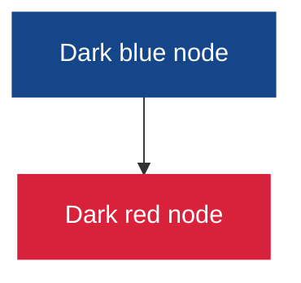
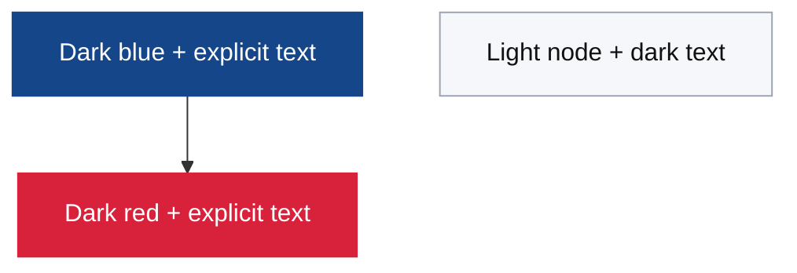
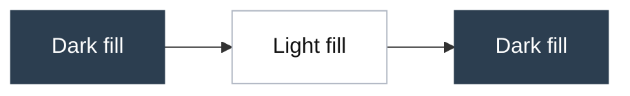
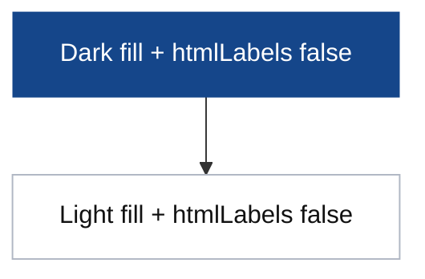
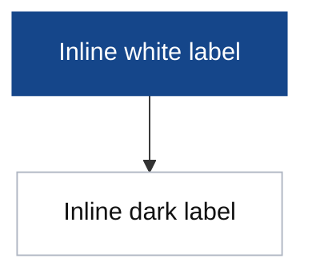

# Mermaid Contrast Sandbox

This page is intentionally isolated for fast Mermaid contrast experiments.
It is not linked in the main navigation.

## Test A: Control (current baseline behavior)

## Test B: Explicit text color with classDef

## Test C: Mixed fills (dark and light in one diagram)

## Test D: `htmlLabels: false` experiment

## Test E: Inline HTML color in label text

## Test F: Force a single label color (white) via Mermaid CSS variables

## Expected Outcome

- Dark-filled nodes should be readable with white text.
- Light-filled nodes should remain readable with dark text.
- This page can be used as the first iterative validation target before touching production content.
- If Test D works, `htmlLabels: false` is a viable path.
- If Test E works, inline label markup could be a tactical fallback for specific nodes.
- If Test F works, it confirms this setup can enforce one label color per diagram scope, but not per-node adaptive contrast.
