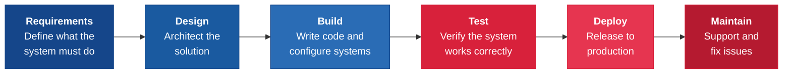
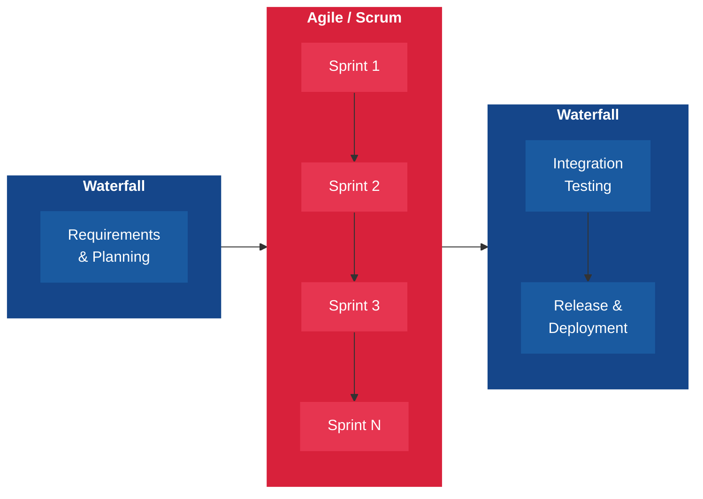
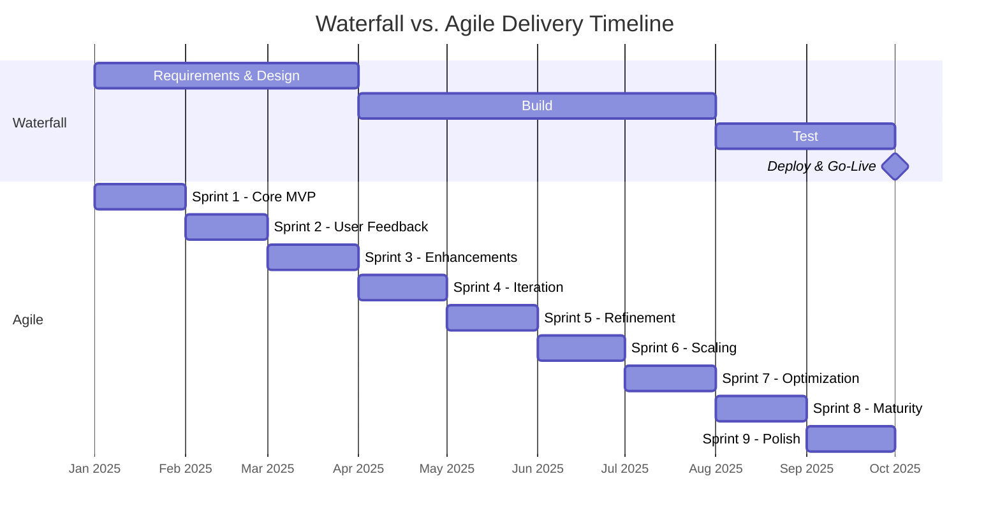
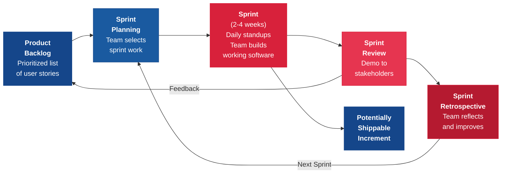

---
tags:
  - management
  - project
  - agile
reading_time: 30
difficulty: Intermediate
---

# IT Project & Portfolio Management

## Overview

IT projects are the vehicles through which organizations deliver technology-enabled change -- from deploying a new ERP system to building a customer-facing mobile application to migrating data centers to the cloud. Yet the track record of IT projects is sobering. For decades, industry research has consistently shown that a large percentage of IT projects come in over budget, behind schedule, or fail to deliver the business value they promised. Understanding why projects fail and how modern methodologies address those failure modes is essential knowledge for any business leader who sponsors, funds, or depends on IT initiatives.

Project management in the IT context has undergone a profound evolution over the past two decades. The traditional Waterfall methodology -- a sequential, plan-driven approach inherited from construction and manufacturing -- dominated IT project delivery for most of the industry's history. Starting in the early 2000s, Agile methodologies introduced an iterative, feedback-driven alternative that has fundamentally changed how software is built and delivered. Today, most organizations use a blend of both approaches, selecting the right methodology based on the nature of the project, the degree of uncertainty involved, and regulatory constraints. Beyond individual projects, mature organizations practice portfolio management -- treating their collection of IT investments as a strategic portfolio that must be balanced, prioritized, and governed to maximize overall value.

This section covers the full spectrum of IT project and portfolio management: why projects fail, the major methodologies (Waterfall, Agile, and hybrid approaches), the role of the PMO, portfolio governance, and how modern DevOps practices are reshaping project delivery. The goal is not to make you a project manager -- it is to give you the vocabulary, frameworks, and critical thinking skills you need to be an effective executive sponsor, steering committee member, or business partner on IT initiatives.

!!! info "Why This Matters for MBA Students"
    As an MBA graduate, you are far more likely to **sponsor, fund, or govern** IT projects than to manage them day-to-day. This means you need to understand project management at a strategic level. You will sit on steering committees that decide whether to continue, pivot, or cancel troubled projects. You will approve budgets and timelines -- and you need to know what questions to ask when a project manager tells you the project is "on track." You will evaluate whether your organization's PMO is providing real value or just generating status reports. You will need to understand the trade-offs between Agile and Waterfall when a CIO recommends one approach over another. And increasingly, you will need to grasp how DevOps and CI/CD practices change the economics and speed of software delivery. In consulting, strategy, and general management roles, the ability to speak intelligently about project and portfolio management is a baseline expectation -- not a specialized skill.

## Key Concepts

### Why IT Projects Fail

The Standish Group's CHAOS Reports, published annually since 1994, provide the most widely cited data on IT project success and failure rates (Standish Group, CHAOS Report, 2020). While the exact numbers vary by year and methodology, the consistent findings paint a clear picture:

| Outcome | Approximate Rate | Definition |
|---------|-----------------|------------|
| **Successful** | ~30% | Delivered on time, on budget, with satisfactory results |
| **Challenged** | ~50% | Completed but over budget, over time, or with fewer features than planned |
| **Failed** | ~20% | Cancelled before completion or delivered but never used |

These numbers have improved modestly over the decades -- largely due to the adoption of Agile practices and smaller project scoping -- but they remain striking. A business leader who assumes IT projects will go according to plan is ignoring decades of evidence to the contrary.

#### Common Causes of IT Project Failure

Research and post-mortem analyses consistently identify the same root causes:

**Scope Creep**
:   The gradual, uncontrolled expansion of project requirements after the project has started. A project begins with a well-defined scope, but stakeholders continuously add "just one more feature" until the project becomes undeliverable within the original budget and timeline. Scope creep is the single most common cause of project overruns.

**Poor Requirements Gathering**
:   The business fails to articulate what it actually needs, or IT fails to capture and validate those needs before building begins. The result is a system that technically works but does not solve the business problem. This is particularly common when business users describe solutions ("I need a dashboard") rather than problems ("I need to understand why customer churn is increasing").

**Inadequate Executive Sponsorship**
:   Successful IT projects require an engaged executive sponsor -- a senior business leader who champions the project, removes organizational obstacles, makes timely decisions, and holds people accountable. When the sponsor is absent, disengaged, or lacks sufficient authority, projects drift without direction.

**Unrealistic Timelines and Budgets**
:   Projects are approved based on optimistic estimates -- often driven by political pressure to show a favorable business case. When reality diverges from the plan (as it always does), the project team is forced to cut corners, skip testing, or request additional funding, all of which create downstream problems.

**Organizational Change Resistance**
:   Technology projects are rarely just technology projects. They almost always require people to change how they work -- new processes, new tools, new roles. When organizations underinvest in change management, training, and communication, technically successful projects fail at adoption.

**Insufficient Risk Management**
:   Projects fail to identify and plan for foreseeable risks -- vendor delays, technical complexity, resource constraints, regulatory changes. When these risks materialize (and they will), the project has no contingency plan and enters crisis mode.

### Waterfall Methodology

The Waterfall methodology is a **sequential, plan-driven approach** in which each phase of the project must be completed before the next phase begins. It is the oldest formal software development methodology and takes its name from the way work flows downward through a series of phases, like water over a series of cascades.

#### The Waterfall Phases

1. **Requirements** -- Business analysts and stakeholders document exactly what the system must do. This produces a detailed requirements specification that becomes the contract for the rest of the project.
2. **Design** -- Architects and technical leads design the solution architecture, database structures, user interfaces, and integration points based on the approved requirements.
3. **Build** -- Developers write code, configure software packages, and construct the system according to the design specifications.
4. **Test** -- Quality assurance teams verify that the system meets requirements through unit testing, integration testing, system testing, and user acceptance testing.
5. **Deploy** -- The completed, tested system is released into the production environment and made available to end users.
6. **Maintain** -- The team provides ongoing support, fixes defects, and implements minor enhancements.

#### When Waterfall Works

Waterfall remains the appropriate choice in certain contexts:

- **Regulatory and compliance projects** where requirements are dictated by external regulations (e.g., HIPAA, SOX, GDPR) and are unlikely to change during the project
- **Fixed-scope, well-understood projects** such as hardware deployments, infrastructure upgrades, or data center migrations where the end state is clearly defined
- **Contract-driven projects** where a fixed-price contract requires detailed upfront requirements and a signed-off scope before work begins
- **Safety-critical systems** in industries like aerospace, medical devices, or nuclear energy where rigorous, sequential validation is required by regulation

#### Limitations of Waterfall

- **Late feedback** -- Users do not see working software until the testing phase, by which point the cost of changes is very high
- **Assumes stable requirements** -- In practice, business needs evolve during the months or years it takes to complete a Waterfall project
- **Big-bang risk** -- Everything is delivered at once at the end, creating a single high-risk moment of truth
- **Documentation-heavy** -- Extensive documentation is produced at each phase, which can become an end in itself rather than a means to communication

!!! question "Quick Check"
    - A project stakeholder says, "We should use Waterfall because it gives us more certainty about the final cost." Evaluate this claim: under what conditions is it accurate, and when might a Waterfall approach actually *increase* cost risk?
    - Consider a scenario where a Waterfall project is 70% through the Build phase and a major regulatory change alters several core requirements. What structural features of Waterfall make this situation especially costly compared to an iterative approach?

### Agile Methodology

Agile is a **family of iterative, incremental methodologies** that emerged in the early 2000s as a direct response to the limitations of Waterfall. The term "Agile" encompasses a variety of specific frameworks -- Scrum, Kanban, Extreme Programming (XP), and others -- all of which share a common set of values and principles.

#### The Agile Manifesto

In 2001, seventeen software practitioners published the **Agile Manifesto**, which articulated four foundational values:

!!! quote "The Agile Manifesto (2001)"
    We are uncovering better ways of developing software by doing it and helping others do it. Through this work we have come to value:

    - **Individuals and interactions** over processes and tools
    - **Working software** over comprehensive documentation
    - **Customer collaboration** over contract negotiation
    - **Responding to change** over following a plan

    That is, while there is value in the items on the right, we value the items on the left more.

The Manifesto does not reject processes, documentation, contracts, or plans. It argues that when forced to choose, the items on the left should take precedence. This is a critical distinction that is often lost in casual discussions of Agile.

#### Scrum

Scrum is the most widely adopted Agile framework, used by an estimated 60-70% of Agile teams (State of Agile Report, Digital.ai, 2024). It organizes work into fixed-length iterations called **sprints** (typically two weeks) and defines three key roles, five events, and three artifacts.

**Key Scrum Roles:**

| Role | Responsibility | Business Equivalent |
|------|---------------|-------------------|
| **Product Owner** | Defines what to build and in what order; owns the product backlog; represents the voice of the business | Business sponsor or product manager |
| **Scrum Master** | Facilitates the Scrum process; removes impediments; coaches the team on Agile practices | Project manager (but with a coaching rather than directing role) |
| **Development Team** | Self-organizing group (typically 5-9 people) that does the actual work of building the product | Technical team |

**Key Scrum Events:**

- **Sprint Planning** -- The team selects items from the product backlog to deliver in the upcoming sprint
- **Daily Standup (Daily Scrum)** -- A 15-minute daily meeting where each team member shares what they did yesterday, what they will do today, and what is blocking them
- **Sprint Review** -- At the end of the sprint, the team demonstrates working software to stakeholders and gathers feedback
- **Sprint Retrospective** -- The team reflects on the sprint process and identifies improvements for the next sprint

**The Product Backlog and User Stories:**

In Scrum, requirements are captured as **user stories** -- short, plain-language descriptions of a feature from the end user's perspective:

> *"As a [type of user], I want [some goal] so that [some reason]."*

For example: *"As a sales manager, I want to see a dashboard of my team's quarterly pipeline so that I can forecast revenue more accurately."*

User stories are prioritized in the **product backlog** -- an ordered list of everything that might be needed in the product. The Product Owner continually refines and re-prioritizes the backlog based on business value, stakeholder feedback, and what the team has learned from previous sprints.

#### Kanban

Kanban is a **flow-based Agile approach** that focuses on visualizing work, limiting work-in-progress, and optimizing throughput. Unlike Scrum, Kanban does not use fixed-length sprints. Instead, work items flow continuously through a series of stages (e.g., To Do, In Progress, Review, Done), and the team limits how many items can be in any given stage at one time.

Kanban is particularly well-suited for:

- **Operations and support teams** that handle a continuous stream of requests rather than defined projects
- **Teams transitioning to Agile** that want to start with minimal process change
- **Environments with highly variable work** where sprint planning is impractical

#### Agile at Scale

While Scrum and Kanban work well for individual teams, large organizations often need to coordinate dozens or hundreds of Agile teams working on interconnected products. Several frameworks address this challenge:

- **SAFe (Scaled Agile Framework)** -- The most widely adopted scaling framework; organizes teams into Agile Release Trains that deliver value on a regular cadence
- **LeSS (Large-Scale Scrum)** -- A simpler approach that extends Scrum principles to multiple teams working on one product
- **Spotify Model** -- An influence-based model organized around squads, tribes, chapters, and guilds (discussed in detail in the Real-World Applications section)

!!! question "Quick Check"
    - The Agile Manifesto values "responding to change over following a plan." A CFO objects that this sounds like an excuse for poor planning. How would you explain to a financially oriented executive that Agile is not anti-planning, and what Scrum mechanisms actually enforce disciplined planning?
    - Compare the Product Owner role in Scrum to a traditional project sponsor. If you had to staff the Product Owner role for a new customer-facing application, would you choose someone from IT or from the business unit, and what trade-offs does each choice involve?
    - A team is using Kanban for IT support operations but keeps accumulating a growing backlog. What Kanban principle are they likely violating, and how would enforcing it change team behavior?

### Hybrid Approaches

In practice, most large organizations do not use pure Waterfall or pure Agile. They use **hybrid approaches** that combine elements of both, tailoring the methodology to the specific needs of each project or program.

#### Water-Scrum-Fall

The most common hybrid is informally known as **"Water-Scrum-Fall"**:

In this model, the project begins with a Waterfall-style planning and requirements phase to establish the overall scope, architecture, and budget. The actual development work is then executed using Agile sprints. Finally, the project concludes with a Waterfall-style integration testing and deployment phase. This approach is common in regulated industries where upfront planning and formal release processes are required, but development teams benefit from Agile practices.

#### Choosing the Right Approach

The decision of which methodology to use is not ideological -- it should be driven by project characteristics:

| Factor | Favors Waterfall | Favors Agile | Favors Hybrid |
|--------|-----------------|--------------|---------------|
| **Requirements clarity** | Well-defined, stable | Uncertain, evolving | Mix of fixed and flexible |
| **Regulatory constraints** | Heavy regulatory oversight | Minimal regulation | Regulated but iterative |
| **Project size** | Large, multi-year programs | Small to medium teams | Large programs with Agile teams |
| **Stakeholder availability** | Limited access to stakeholders | Continuous stakeholder engagement | Varies by phase |
| **Risk tolerance** | Low (failure is very costly) | Higher (can learn from failure) | Moderate |
| **Organizational culture** | Hierarchical, plan-driven | Collaborative, adaptive | Transitioning |

### The PMO (Project Management Office)

The PMO is an organizational unit that establishes and maintains standards for project management across the enterprise. It serves as the **central nervous system** for project delivery -- providing governance, methodology, tools, training, and oversight to ensure projects are executed consistently and aligned with strategic objectives.

#### Types of PMO

PMOs vary significantly in their authority and approach. The Project Management Institute (PMI) identifies three primary types:

| PMO Type | Authority Level | Function | Best For |
|----------|----------------|----------|----------|
| **Supportive** | Low | Provides templates, best practices, training, and a project repository. Acts as a consultancy to project teams. | Organizations new to project management; highly autonomous business units |
| **Controlling** | Moderate | Requires compliance with specific frameworks, methodologies, templates, and governance processes. Reviews and audits projects for conformance. | Organizations that need consistency but want to preserve team flexibility |
| **Directive** | High | Directly manages projects. Assigns project managers, controls resources, and makes project-level decisions. | Organizations that need tight central control; shared services environments |

#### Core PMO Functions

Regardless of type, effective PMOs typically perform the following functions:

- **Methodology and Standards** -- Define project management methodologies, templates, and governance processes for the organization
- **Resource Management** -- Manage a pool of project managers and allocate them across projects; track resource utilization
- **Training and Development** -- Build project management competency through training programs and mentoring
- **Portfolio Reporting** -- Provide consolidated visibility into the status, health, risks, and financials of all active projects
- **Benefits Realization** -- Track whether completed projects actually deliver the business benefits promised in the original business case
- **Lessons Learned** -- Capture and disseminate knowledge from completed projects to improve future project performance

### Portfolio Management

While project management focuses on delivering individual initiatives, **portfolio management** takes a strategic, enterprise-wide view: given limited resources, which IT investments should the organization fund to maximize overall business value?

#### The Investment Portfolio Analogy

IT portfolio management deliberately borrows from financial portfolio management. Just as an investor balances stocks, bonds, and alternative investments across risk levels and time horizons, an IT leader must balance technology investments across different categories:

| Category | Description | Typical Allocation | Example |
|----------|-------------|-------------------|---------|
| **Run the Business** | Maintain and operate existing systems; keep the lights on | 60-70% | Patching servers, renewing software licenses, help desk operations |
| **Grow the Business** | Enhance existing capabilities to improve performance or reach new markets | 15-25% | Adding analytics to the CRM, mobile-enabling the customer portal |
| **Transform the Business** | Invest in new capabilities that fundamentally change the business model | 10-20% | Building an AI-driven product recommendation engine, entering a new digital market |

A common challenge is that "Run" spending consumes an ever-increasing share of the IT budget -- leaving insufficient funds for "Grow" and "Transform" investments. Effective portfolio management actively monitors this balance and takes deliberate action (such as retiring legacy systems or migrating to cloud services) to free up capacity for strategic investment.

#### Governance Committees

IT portfolio decisions are typically governed by one or more committees:

- **IT Steering Committee** -- Cross-functional group of senior business and IT leaders that reviews and approves major IT investments, monitors portfolio health, and resolves cross-project conflicts
- **Architecture Review Board** -- Evaluates proposed projects for technical fit with the enterprise architecture, ensures technology standards are followed, and prevents redundant solutions
- **Investment Review Board** -- Assesses project business cases, approves funding, and tracks ROI of completed investments

These committees ensure that IT investment decisions reflect business priorities rather than the loudest voice in the room or the most politically connected project sponsor.

!!! question "Quick Check"
    - Your organization allocates 72% of its IT budget to "Run the Business." A business unit leader argues this is too high and wants to shift 15% to "Transform" initiatives. What risks does this reallocation create, and what conditions would need to be true for it to succeed?
    - An IT steering committee approves projects based primarily on which business unit leader makes the most compelling presentation. What governance failure does this represent, and how would a formal portfolio management process produce different outcomes?

### DevOps and CI/CD

**DevOps** represents a cultural and technical shift that breaks down the traditional wall between software development ("Dev") and IT operations ("Ops"). In traditional models, developers write code and "throw it over the wall" to operations teams for deployment and support. This handoff creates delays, finger-pointing, and quality problems. DevOps eliminates this division by making development teams responsible for the full lifecycle of their software -- from writing code through deploying and operating it in production.

#### Key DevOps Practices

**CI/CD (Continuous Integration / Continuous Delivery)**
:   Developers frequently merge their code changes into a shared repository (continuous integration), where automated tests verify that nothing is broken. Code that passes all tests is automatically packaged and deployed to production (continuous delivery) or made ready for one-click deployment (continuous deployment). This reduces the release cycle from months to hours or minutes.

**Infrastructure as Code**
:   Server environments, network configurations, and deployment pipelines are defined in code rather than configured manually. This makes infrastructure reproducible, versionable, and testable -- just like application code.

**Automated Testing**
:   Comprehensive automated test suites run every time code changes are made, catching defects early when they are cheap to fix rather than late when they are expensive.

**Monitoring and Observability**
:   Production systems are instrumented with detailed monitoring so that teams can detect, diagnose, and resolve problems quickly -- often before users notice.

#### Why DevOps Matters for Business Leaders

DevOps fundamentally changes the economics of software delivery:

- **Speed** -- Organizations practicing DevOps deploy code hundreds or thousands of times per day, compared to monthly or quarterly releases in traditional models
- **Quality** -- Automated testing and smaller, more frequent releases result in fewer defects and faster recovery when problems occur
- **Cost** -- Automation reduces the manual effort required for testing, deployment, and operations
- **Business agility** -- The ability to release new features rapidly allows the business to respond to market changes, customer feedback, and competitive threats in near real-time

Elite DevOps performers deploy 973 times more frequently than low performers, have 6,570 times faster lead time from commit to deploy, and have 3 times lower change failure rates (DORA, Accelerate State of DevOps Report, 2023).

## Frameworks & Models

### Waterfall vs. Agile: A Timeline Comparison

The following diagram illustrates the fundamental difference in how Waterfall and Agile deliver value over time:

In the Waterfall approach, the business receives **no working software** until the very end -- nine months into the project. In the Agile approach, the business receives **working, usable increments** at the end of every sprint (monthly in this example), with the ability to provide feedback and adjust direction along the way.

### The Scrum Process

### Methodology Comparison

| Dimension | Waterfall | Agile (Scrum) | Kanban | Hybrid |
|-----------|-----------|---------------|--------|--------|
| **Planning approach** | Comprehensive upfront | Iterative, sprint-by-sprint | Continuous, flow-based | Upfront strategy + iterative execution |
| **Requirements** | Fixed at project start | Evolving through backlog refinement | Continuous flow of requests | Fixed high-level; detailed per sprint |
| **Delivery cadence** | Single delivery at end | Every sprint (2-4 weeks) | Continuous | Varies by phase |
| **Change management** | Formal change control process | Welcomed; backlog re-prioritized | Pull-based; new work added to board | Formal for scope; flexible for features |
| **Team structure** | Specialized roles in phases | Cross-functional, self-organizing | Cross-functional | Varies by phase |
| **Documentation** | Extensive, phase-gate documents | Lightweight, "just enough" | Minimal | Moderate; more upfront, less during sprints |
| **Risk profile** | High (late discovery of issues) | Lower (early, frequent feedback) | Lower (continuous visibility) | Moderate (mitigated by early sprints) |
| **Best suited for** | Fixed scope, regulatory | Innovative, uncertain requirements | Operations, support, maintenance | Large programs, regulated environments |
| **Client involvement** | Primarily at start and end | Continuous throughout | Continuous | High at bookends; moderate during sprints |

## Real-World Applications

### Example 1: The Healthcare.gov Launch Failure (2013)

The launch of Healthcare.gov -- the flagship website of the U.S. Affordable Care Act -- is one of the most widely studied IT project failures in recent history. When the site went live on October 1, 2013, it was virtually unusable. Only six people successfully enrolled on the first day, despite millions of visitors.

**What went wrong:**

- **Waterfall in an uncertain environment** -- The project followed a traditional Waterfall approach with sequential phases, but the requirements were politically driven and constantly changing. Major policy decisions that affected system design were being made weeks before launch.
- **No integrated testing** -- End-to-end system testing did not begin until two weeks before go-live. With over 55 contractors building different components, integration defects were pervasive and discovered far too late.
- **Fragmented vendor management** -- The Centers for Medicare and Medicaid Services (CMS) contracted with over 55 different technology vendors but had no single system integrator responsible for making all the pieces work together.
- **Inadequate executive sponsorship** -- There was no single accountable executive with the authority and technical understanding to recognize and escalate the project's mounting risks.

**The rescue:** The administration brought in a "tech surge" team of Silicon Valley engineers who applied Agile and DevOps practices -- small cross-functional teams, daily deployments, continuous monitoring, and rapid triage of the most critical defects. Within six weeks, the site was functioning reliably.

**MBA lesson:** This case illustrates why methodology selection matters. A project with evolving requirements, extreme political pressure, and massive integration complexity was a poor fit for Waterfall. It also demonstrates the critical importance of integrated testing, vendor governance, and empowered executive sponsorship.

### Example 2: Spotify's Agile Model

Spotify, the music streaming company, became famous in the Agile community for developing an organizational model that scaled Agile principles beyond individual teams. While Spotify has since evolved beyond this model, it remains one of the most influential examples of Agile at scale.

**The Spotify Model:**

- **Squads** -- Small, autonomous, cross-functional teams (similar to Scrum teams) that own a specific feature or component. Each squad has a product owner and decides its own way of working.
- **Tribes** -- Collections of squads that work in related areas. A tribe typically has 40-150 people and is led by a tribe lead who provides coordination but not command-and-control management.
- **Chapters** -- Groups of people with the same specialization (e.g., all backend developers) across different squads. Chapters provide a home for professional development and technical standards.
- **Guilds** -- Informal communities of interest that span the entire organization (e.g., a "web technology guild" or a "leadership guild"). Guilds are voluntary and promote knowledge sharing.

**Key principles:**

- **Autonomy with alignment** -- Squads are free to decide *how* to work, but they must align on *what* to work on and *why* through the company's mission, strategy, and product goals.
- **Loosely coupled, tightly aligned** -- Teams minimize dependencies on each other through well-defined APIs and service boundaries, while maintaining strategic alignment through regular cross-team synchronization.
- **Culture of trust** -- Spotify invested heavily in a culture where failure is treated as a learning opportunity, not a cause for blame. "Fail fast, learn fast, improve fast" became a mantra.

**MBA lesson:** The Spotify Model illustrates that scaling Agile is fundamentally an organizational design problem, not a process problem. It requires rethinking reporting structures, decision-making authority, and how people across teams coordinate. It also demonstrates that no model should be adopted wholesale -- Spotify itself abandoned elements of its own model as the company grew and its needs changed.

### Example 3: ING Bank's Agile Transformation

ING Bank, the Dutch multinational financial services company, undertook one of the most ambitious enterprise Agile transformations in the financial services industry starting in 2015. The transformation affected over 3,500 employees in its headquarters operations.

**The transformation:**

- **From traditional IT to squads and tribes** -- ING eliminated its traditional departmental structure and reorganized into approximately 350 nine-person squads organized into 13 tribes. Every squad was cross-functional, including IT developers, business analysts, marketers, and product specialists working side by side.
- **Everyone re-applied for their jobs** -- In a bold move, ING required all 3,500 affected employees to re-apply for positions in the new structure. This ensured that staffing was based on skills and cultural fit rather than legacy organizational placement.
- **Quarterly Business Reviews (QBRs)** -- Tribes present their objectives, progress, and plans to senior leadership every quarter, creating accountability and alignment between autonomous teams and enterprise strategy.
- **End-to-end ownership** -- Squads own their products from conception through development, deployment, and operations -- embodying DevOps principles within the Agile structure.

**Results:**

- Time-to-market for new features improved dramatically -- from months to weeks
- Employee engagement scores increased significantly
- The model attracted top engineering talent who preferred the autonomous, cross-functional working style
- Customer satisfaction metrics improved as the bank could respond to customer feedback faster

**MBA lesson:** ING's transformation demonstrates that Agile is not just a software development methodology -- it is an organizational philosophy. The decision to have all employees re-apply for positions signals the depth of commitment required. It also shows that Agile transformations in regulated industries like banking are possible but require thoughtful adaptation of the methodology to comply with regulatory requirements while still gaining the benefits of speed and flexibility.

## Common Pitfalls

!!! warning "Agile in Name Only"
    Many organizations claim to be "doing Agile" but have only adopted the ceremonies (standups, sprints, retrospectives) without embracing the underlying values. They run sprints but do not allow the backlog to be re-prioritized. They hold standups but do not empower teams to self-organize. They conduct retrospectives but never act on the improvement items. This "Agile theater" delivers the overhead of Agile without the benefits. True Agile requires genuine organizational change -- not just new meeting schedules. If leadership still demands fixed scope, fixed timeline, and fixed budget simultaneously, the organization is not Agile regardless of what it calls its meetings.

!!! warning "Underinvesting in the Product Owner Role"
    The Product Owner is arguably the most important role in Scrum, yet it is frequently treated as a part-time assignment given to a junior business analyst. An effective Product Owner must have deep domain expertise, authority to make prioritization decisions, and sufficient time to engage with the team daily. When the Product Owner role is weak -- when they cannot make decisions, cannot attend sprint reviews, or cannot articulate what the business actually needs -- the team builds features that do not deliver value, and the primary advantage of Agile (continuous business feedback) is lost.

!!! warning "Skipping Portfolio Governance"
    Organizations that focus on project-level management without portfolio-level governance end up with a collection of individually well-managed projects that collectively do not support the business strategy. Without portfolio governance, politically connected projects consume disproportionate resources, redundant solutions proliferate across business units, and "Run the Business" spending quietly crowds out strategic investment. Every organization needs a mechanism -- whether a steering committee, investment review board, or some other governance body -- to evaluate, prioritize, and balance the portfolio as a whole.

!!! warning "Treating the PMO as Overhead Rather Than Value"
    A poorly run PMO becomes a bureaucratic bottleneck -- demanding status reports, enforcing templates, and adding process steps without improving outcomes. When project teams view the PMO as overhead rather than a resource, they route around it, undermining governance and standardization. Effective PMOs continuously demonstrate their value by removing obstacles, providing actionable insights from portfolio data, and helping project teams succeed. If your PMO's primary output is status reports that nobody reads, it is time to rethink the PMO's mandate and operating model.

## Discussion Questions

1. **Methodology Selection**: You are the executive sponsor of a major ERP implementation at a mid-size manufacturing company. The system integrator recommends a Waterfall approach because the ERP package has well-defined configuration requirements and regulatory constraints. Your CIO advocates for an Agile approach because similar projects at other companies have struggled with scope creep and late user feedback. The CFO wants a fixed-price contract, which the vendor will only offer with a Waterfall approach. How would you navigate this tension, and what hybrid approach might satisfy all stakeholders?

2. **Portfolio Prioritization**: Your IT steering committee is reviewing the annual IT portfolio. The "Run" budget has grown to 75% of total IT spending due to aging legacy systems, leaving only 25% for "Grow" and "Transform" investments. The CEO wants to fund an ambitious AI initiative (Transform) while the COO insists that the failing supply chain system needs urgent replacement (Run/Grow). The total ask exceeds the budget by 40%. How would you structure the portfolio decision-making process, and what criteria would you use to prioritize?

3. **PMO Value**: Your company's PMO was established three years ago but is facing criticism from business unit leaders who describe it as "bureaucratic" and "disconnected from how we actually work." Project managers complain that the PMO's templates are designed for Waterfall projects and do not accommodate their Agile teams. The CIO is considering disbanding the PMO entirely. What questions would you ask to diagnose the problem, and what would you recommend -- reform, restructure, or eliminate?

## Key Takeaways

- **IT projects have a poor track record** -- industry data consistently shows that only about 30% of IT projects are fully successful. Understanding common failure modes (scope creep, poor requirements, weak sponsorship, unrealistic timelines) helps business leaders set realistic expectations and ask the right questions.
- **Waterfall is sequential and plan-driven** -- it works well for projects with stable, well-defined requirements and regulatory constraints, but struggles when requirements evolve or when late feedback reveals problems.
- **Agile is iterative and feedback-driven** -- it delivers working software in short increments (sprints), enabling continuous stakeholder feedback and adaptation. Scrum and Kanban are the most common Agile frameworks.
- **Hybrid approaches are the norm** in large enterprises -- most organizations blend Waterfall planning and governance with Agile execution, tailoring the approach to each project's characteristics.
- **The Product Owner is the linchpin of Agile success** -- this role must be filled by a senior, empowered business representative who can make prioritization decisions and engage with the team continuously.
- **The PMO provides governance, standards, and oversight** across the project portfolio. It can be supportive, controlling, or directive depending on organizational needs, but it must demonstrably add value.
- **Portfolio management treats IT investments like a financial portfolio** -- balancing Run, Grow, and Transform investments, and ensuring that project selection reflects strategic priorities rather than political influence.
- **DevOps and CI/CD are transforming software delivery** -- by automating testing, deployment, and infrastructure management, DevOps practices enable organizations to release software faster, more frequently, and with higher quality.
- **Methodology selection should be pragmatic, not ideological** -- the right approach depends on requirements stability, regulatory context, organizational culture, and risk tolerance. Dogmatic adherence to any single methodology is a warning sign.

## Further Reading

- **Standish Group.** *CHAOS Report.* Published annually. The definitive data source on IT project success and failure rates. Summary findings are widely available; full reports require subscription at [standishgroup.com](https://www.standishgroup.com).
- **Schwaber, Ken, and Jeff Sutherland.** *The Scrum Guide.* 2020. The official, concise (13-page) definition of Scrum, freely available at [scrumguides.org](https://scrumguides.org).
- **Beck, Kent, et al.** *Manifesto for Agile Software Development.* 2001. The founding document of the Agile movement, available at [agilemanifesto.org](https://agilemanifesto.org).
- **Kim, Gene, Jez Humble, Patrick Debois, and John Willis.** *The DevOps Handbook: How to Create World-Class Agility, Reliability, & Security in Technology Organizations.* 2nd ed., IT Revolution Press, 2021. The definitive practitioner's guide to DevOps practices and culture.
- **Forsgren, Nicole, Jez Humble, and Gene Kim.** *Accelerate: The Science of Lean Software and DevOps.* IT Revolution Press, 2018. Research-backed analysis of what drives high-performing technology organizations, including the DORA metrics.
- **Project Management Institute.** *A Guide to the Project Management Body of Knowledge (PMBOK Guide).* 7th ed., PMI, 2021. The global standard for project management, updated to incorporate Agile and hybrid approaches.
- **Kniberg, Henrik, and Anders Ivarsson.** *"Scaling Agile @ Spotify."* 2012. The widely cited white paper describing Spotify's squad/tribe/chapter/guild model.
- **Rigby, Darrell K., Jeff Sutherland, and Andy Noble.** "Agile at Scale." *Harvard Business Review*, May-June 2018. A practical guide for business leaders on how to extend Agile beyond IT into the broader enterprise.

### Cross-References

- [IT Governance Frameworks](../governance/frameworks.md) -- How governance structures like COBIT provide the oversight layer for project and portfolio management
- [IT Budgeting & Finance](../governance/it-budgeting.md) -- How IT investment decisions are funded and financially governed
- [IT-Business Alignment](../governance/it-business-alignment.md) -- How project and portfolio management connects IT delivery to business strategy
- [Vendor Management](vendor-management.md) -- How vendor selection and management intersects with project delivery
- [Enterprise Architecture](../technology/enterprise-architecture.md) -- How architecture governance shapes technology decisions within projects
- [Digital Transformation](../transformation/digital-transformation.md) -- How Agile and DevOps practices enable transformation initiatives
- [Analytics Project Methodologies](../transformation/analytics-project-methodologies.md) -- How CRISP-DM structures analytics and data science projects, and how teams integrate CRISP-DM phases with Agile sprints
- [Business Process Management](../transformation/bpm.md) -- How process analysis and redesign connect to project delivery
