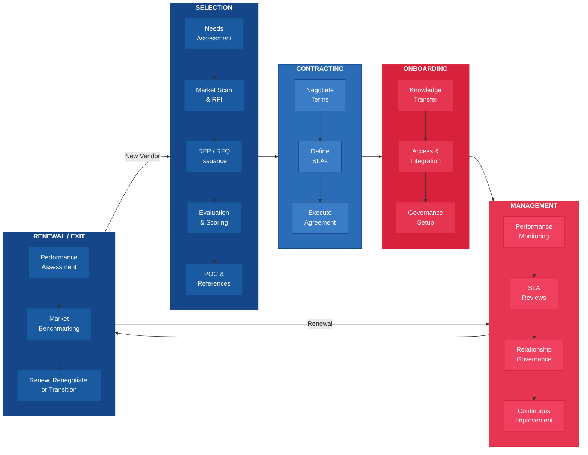
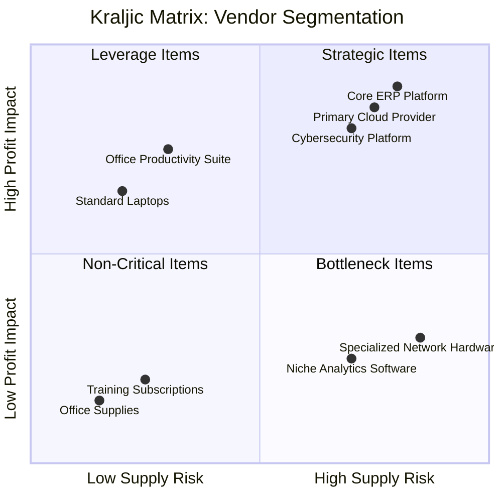

---
tags:
  - management
  - vendor
  - procurement
reading_time: 30
difficulty: Intermediate
---

# Vendor Management & Procurement

## Overview

Most organizations do not build all of their technology capabilities in-house. Instead, they rely on a portfolio of external vendors for software, hardware, cloud infrastructure, consulting services, system integration, and outsourced operations. In a typical large enterprise, IT spending on external vendors can account for 60-80% of the total IT budget. Managing these vendor relationships effectively — from initial selection through ongoing performance management to eventual renewal or exit — is therefore one of the most impactful competencies a business leader can develop.

Vendor management sits at the intersection of procurement, legal, finance, risk management, and technology strategy. It requires a blend of analytical rigor (evaluating proposals, negotiating terms, measuring performance) and relationship skills (building trust, managing conflicts, fostering collaboration). Poor vendor management leads to overspending, service disruptions, security vulnerabilities, and strategic misalignment. Effective vendor management transforms external providers into genuine partners who contribute to competitive advantage.

For MBA students, understanding vendor management is critical regardless of your career path. If you work in consulting, you will be the vendor — and understanding how clients evaluate and manage their vendors will make you more effective. If you work in industry, you will likely sit on vendor selection committees, negotiate contracts, manage SLA disputes, and make strategic decisions about outsourcing. If you move into general management or the C-suite, vendor strategy becomes a board-level concern as organizations increasingly depend on third parties for mission-critical capabilities.

!!! info "Why This Matters for MBA Students"
    Technology vendor relationships represent some of the largest and most consequential contracts your organization will sign. A single enterprise ERP implementation can cost $50-500 million and take 2-5 years. A major cloud migration may reshape the entire IT operating model. An outsourcing deal can affect thousands of employees. These decisions are not purely technical — they involve strategic positioning, financial structuring, organizational change, and risk management. As an MBA graduate in a leadership role, you will be expected to contribute meaningfully to these decisions. You will need to evaluate vendor proposals, understand contract terms, interpret SLA reports, and make informed judgments about when to build internally versus when to buy from the market. This page provides the foundational vocabulary and frameworks you need to engage confidently in these conversations.

## Key Concepts

### The Vendor Lifecycle

Managing a vendor relationship is not a one-time event — it is a continuous lifecycle that spans the entire duration of the engagement. Each phase has distinct activities, stakeholders, and risks. Skipping or underinvesting in any phase creates problems downstream.

**Selection** — Identifying business needs, scanning the market, issuing formal solicitations (RFI, RFP, RFQ), evaluating responses, conducting proof-of-concept exercises, and choosing the vendor that best fits your requirements. This phase typically involves cross-functional teams including business stakeholders, IT, procurement, legal, and finance.

**Contracting** — Negotiating and formalizing the legal agreement. This includes pricing structures, SLAs, intellectual property rights, data ownership, liability limitations, termination provisions, and change management procedures. Contract negotiation is where value is either captured or surrendered — and it is very difficult to renegotiate terms once work has begun.

**Onboarding** — Integrating the vendor into your organization's processes, systems, and governance structures. This includes knowledge transfer, access provisioning, establishing communication cadences, defining escalation procedures, and aligning on project plans or operational procedures. Many vendor relationships fail not because the wrong vendor was selected, but because onboarding was rushed or neglected.

**Ongoing Management** — The longest phase of the lifecycle, encompassing day-to-day performance monitoring, SLA reviews, issue resolution, change management, relationship management, and continuous improvement. Effective ongoing management requires dedicated vendor management resources and formal governance structures such as steering committees and periodic business reviews.

**Renewal or Exit** — As contracts approach expiration, organizations must decide whether to renew, renegotiate, or transition to a different vendor. Exit planning is particularly important for critical systems where switching costs are high. Without a credible exit plan, you lose negotiating leverage at renewal time and may find yourself locked into unfavorable terms.

### Vendor Selection

The vendor selection process is how organizations systematically identify, evaluate, and choose external providers. A structured selection process reduces bias, ensures that the right evaluation criteria are applied, and creates an auditable decision trail.

#### RFI / RFP / RFQ Process

Organizations use three primary solicitation instruments, each serving a different purpose:

| Instrument | Full Name | Purpose | When to Use |
|-----------|-----------|---------|-------------|
| **RFI** | Request for Information | Gather market intelligence and vendor capabilities without committing to a purchase | Early stage: you are exploring options and need to understand what the market offers |
| **RFP** | Request for Proposal | Solicit detailed proposals including approach, timeline, team, and pricing for a defined scope of work | Mid stage: you know what you need and want vendors to propose how they would deliver it |
| **RFQ** | Request for Quotation | Obtain specific pricing for a well-defined product or service with clear specifications | Late stage: the scope is fixed, specifications are clear, and you are primarily comparing price |

The typical flow progresses from RFI (broad market scan) to RFP (detailed evaluation) to RFQ (final pricing). However, not every procurement requires all three steps. Commodity purchases may skip directly to an RFQ, while complex strategic engagements may require extended RFI and RFP phases.

#### Evaluation Criteria

A well-designed evaluation framework considers multiple dimensions beyond price. Common criteria include:

- **Technical Capability** — Does the vendor's solution meet your functional and technical requirements? How mature is their technology? What is their product roadmap?
- **Financial Stability** — Is the vendor financially sound? Can they sustain operations for the duration of your contract? Startups may offer innovative solutions but carry higher viability risk.
- **Experience & References** — Has the vendor delivered similar solutions to organizations of your size and industry? What do their existing clients say about them?
- **Cultural Fit** — Does the vendor's working style, communication approach, and values align with your organization? Cultural misfit is one of the top reasons vendor relationships deteriorate.
- **Pricing & Commercial Terms** — Is the pricing model transparent and aligned with your consumption patterns? Are there hidden costs (implementation fees, training, data migration, termination charges)?
- **Security & Compliance** — Does the vendor meet your security requirements and regulatory obligations? Do they hold relevant certifications (SOC 2, ISO 27001, HIPAA compliance)?
- **Innovation & Roadmap** — Is the vendor investing in R&D? Will their solution continue to evolve and meet your future needs?
- **Support & Service** — What level of support is included? What are their response and resolution times? Where is their support team located?

#### Weighted Scoring

To make evaluation systematic and defensible, organizations use **weighted scoring models**. Each evaluation criterion is assigned a weight reflecting its relative importance, and each vendor is scored against every criterion. The weighted scores are then summed to produce an overall ranking.

| Criterion | Weight | Vendor A Score (1-5) | Vendor A Weighted | Vendor B Score (1-5) | Vendor B Weighted |
|-----------|--------|---------------------|-------------------|---------------------|-------------------|
| Technical Capability | 30% | 4 | 1.20 | 5 | 1.50 |
| Financial Stability | 10% | 5 | 0.50 | 3 | 0.30 |
| Experience & References | 20% | 4 | 0.80 | 4 | 0.80 |
| Pricing | 25% | 3 | 0.75 | 4 | 1.00 |
| Security & Compliance | 15% | 5 | 0.75 | 4 | 0.60 |
| **Total** | **100%** | | **4.00** | | **4.20** |

In this example, Vendor B scores higher overall despite Vendor A's superior financial stability, because the criteria weighted most heavily (technical capability and pricing) favor Vendor B. The key insight is that the weights themselves embody strategic priorities — and should be agreed upon by stakeholders **before** proposals are received to prevent post-hoc rationalization.

!!! question "Quick Check"
    - Your evaluation team scored Vendor A highest on technical capability and security, but Vendor B scored highest on pricing and cultural fit. A senior VP is pushing for Vendor B because "it saves us money." How would you use the weighted scoring model to either support or challenge that preference?
    - Why should evaluation criteria weights be agreed upon *before* vendor proposals arrive, and what organizational dynamics does this guard against?

#### Proof of Concept and Reference Checks

For high-stakes engagements, quantitative scoring alone is insufficient. Organizations should also conduct:

- **Proof of Concept (POC)** — A time-boxed pilot in which the vendor demonstrates their solution using your data, your processes, or your environment. A POC reveals integration challenges, usability issues, and performance characteristics that no written proposal can capture.
- **Reference Checks** — Direct conversations with the vendor's existing clients, ideally organizations similar to yours in size, industry, and use case. Ask about implementation challenges, ongoing support quality, the vendor's responsiveness to problems, and whether the vendor delivered on their promises.

### Contract Negotiation

Contract negotiation is where the vendor relationship is formally defined. A well-negotiated contract protects both parties, sets clear expectations, and provides mechanisms for resolving disputes. A poorly negotiated contract creates ambiguity, misaligned incentives, and costly disputes.

#### Key Contract Terms

| Term | What It Covers | Why It Matters |
|------|---------------|----------------|
| **Pricing Model** | Fixed price, time & materials, subscription, usage-based, outcome-based | Determines cost predictability and risk allocation. Fixed price shifts risk to the vendor; T&M shifts risk to the buyer. |
| **Service Level Agreements** | Performance targets, uptime guarantees, response times, penalties | Defines measurable quality standards and consequences for underperformance (see detailed SLA section below) |
| **Term & Renewal** | Contract duration, auto-renewal clauses, renewal pricing | Long terms provide stability but reduce flexibility. Auto-renewal clauses can lock you in if not carefully managed. |
| **Termination** | For-cause termination, termination for convenience, notice periods, wind-down obligations | Your ability to exit the relationship if it is not working. Termination for convenience (without needing to prove breach) is a critical but often hard-won provision. |
| **Intellectual Property** | Ownership of custom-developed work, licensing terms, source code escrow | Who owns what is built during the engagement? Without clear IP provisions, you may pay for custom development but not own the result. |
| **Data Ownership & Portability** | Who owns the data, how it can be extracted, format requirements, deletion obligations | If you cannot extract your data in a usable format, you are effectively locked in. Data portability is especially critical for cloud and SaaS vendors. |
| **Liability & Indemnification** | Caps on liability, indemnification for third-party claims, insurance requirements | Vendors almost always seek to cap their liability — often at the total contract value or a multiple of recent fees. Understand what risks remain with you. |
| **Change Management** | Process for modifying scope, pricing adjustments for changes, dispute resolution | Projects and requirements evolve. Without a clear change management process, every modification becomes a negotiation. |
| **Confidentiality & Security** | Data protection obligations, breach notification, audit rights | Especially critical when the vendor handles sensitive data. Ensure the contract obligates the vendor to meet your security standards. |

#### Common Negotiation Pitfalls

- Accepting the vendor's "standard" contract without negotiation — standard terms are designed to protect the vendor, not you
- Focusing exclusively on price while overlooking SLAs, termination rights, and data portability
- Failing to include audit rights that allow you to verify vendor performance and compliance
- Agreeing to auto-renewal clauses without calendar reminders for renewal decision deadlines
- Not involving legal counsel with technology contracting experience

### Service Level Agreements

An SLA is a formal commitment between a service provider and a customer that defines the expected level of service. SLAs translate abstract promises ("we provide reliable service") into measurable, enforceable performance standards ("we guarantee 99.9% uptime measured monthly").

#### Defining SLA Metrics

Effective SLAs are built on metrics that are specific, measurable, achievable, relevant, and time-bound. Common IT service metrics include:

| Metric | Definition | Typical Target |
|--------|-----------|----------------|
| **Availability (Uptime)** | Percentage of time the service is operational | 99.5% - 99.99% |
| **Response Time** | Time from when an issue is reported to when the vendor acknowledges it | 15 minutes - 4 hours (varies by severity) |
| **Resolution Time** | Time from when an issue is reported to when it is fully resolved | 1 hour - 48 hours (varies by severity) |
| **Throughput** | Volume of transactions or requests processed per unit of time | Application-specific |
| **Error Rate** | Percentage of transactions that result in errors | < 0.1% - 1% |
| **Customer Satisfaction** | Survey-based measure of end-user satisfaction | > 85% satisfaction |

#### Uptime Guarantees: What the Numbers Really Mean

Uptime percentages can be deceptive. The difference between 99% and 99.99% uptime seems small, but the operational impact is dramatic:

| Uptime Level | Permitted Downtime per Year | Permitted Downtime per Month |
|-------------|---------------------------|------------------------------|
| 99% ("two nines") | 3 days, 15 hours | 7 hours, 18 minutes |
| 99.5% | 1 day, 19 hours | 3 hours, 39 minutes |
| 99.9% ("three nines") | 8 hours, 46 minutes | 43 minutes, 50 seconds |
| 99.95% | 4 hours, 23 minutes | 21 minutes, 55 seconds |
| 99.99% ("four nines") | 52 minutes, 36 seconds | 4 minutes, 23 seconds |

For a mission-critical application like an e-commerce platform or trading system, the difference between 99% and 99.99% uptime represents the difference between hours of outage and minutes. Higher uptime guarantees cost significantly more because they require redundant infrastructure, rapid failover capabilities, and around-the-clock support teams.

#### Penalties and Credits

SLAs without consequences are merely aspirational statements. Effective SLAs include penalty mechanisms:

- **Service Credits** — The most common mechanism. If the vendor misses an SLA target, the customer receives a credit against future invoices, typically calculated as a percentage of the monthly fee. For example, each 0.1% of downtime below the 99.9% target might earn a 5% service credit, up to a maximum of 30% of the monthly fee.
- **Financial Penalties** — Direct monetary penalties beyond service credits, used in high-stakes outsourcing contracts where service failures have quantifiable business impact.
- **Earn-Back Provisions** — Allow the vendor to recover penalty amounts by exceeding SLA targets in subsequent periods. These create positive incentives alongside negative consequences.
- **Termination Triggers** — Repeated or severe SLA failures may trigger termination rights, allowing the customer to exit the contract without penalty.

#### Reporting and Escalation

SLAs are only effective if performance is measured and reported consistently:

- **Reporting Cadence** — Monthly or quarterly SLA performance reports from the vendor, reviewed in formal service review meetings
- **Measurement Methodology** — Clear agreement on how metrics are calculated, what counts as downtime (planned maintenance is usually excluded), and who provides the measurement data
- **Escalation Procedures** — A defined hierarchy for escalating issues that are not being resolved at the operational level, typically progressing from operational contacts to management to executive sponsors

!!! question "Quick Check"
    - A vendor offers you a very attractive fixed-price contract but resists including a termination-for-convenience clause. What does this tell you about the vendor's expectations, and how should it affect your negotiation strategy?
    - Compare a time-and-materials pricing model to an outcome-based model from the *buyer's* perspective. Under what business conditions would you prefer each?

### Vendor Risk Management

Every vendor relationship introduces risk to your organization. Vendor risk management is the practice of identifying, assessing, and mitigating risks that arise from dependence on third parties.

#### Third-Party Risk Assessment

Before engaging a vendor — and periodically throughout the relationship — organizations should assess risks across multiple dimensions:

- **Operational Risk** — Can the vendor deliver reliably? What happens if their systems fail or their key personnel leave?
- **Financial Risk** — Is the vendor financially viable? Could they go bankrupt mid-contract?
- **Security Risk** — Does the vendor handle your data securely? Could a breach at the vendor expose your organization?
- **Compliance Risk** — Does the vendor comply with regulations that apply to your industry (GDPR, HIPAA, SOX)? Are you liable if they do not?
- **Reputational Risk** — Could the vendor's actions or failures damage your brand? (Consider a data breach at a vendor that handles your customer data.)
- **Strategic Risk** — Could the vendor be acquired by a competitor? Could they discontinue the product you depend on?
- **Geopolitical Risk** — For vendors operating in multiple jurisdictions, consider political instability, sanctions, data sovereignty requirements, and cross-border data transfer restrictions.

#### Concentration Risk

Concentration risk occurs when an organization becomes excessively dependent on a single vendor for critical capabilities. If that vendor fails, raises prices dramatically, or degrades service quality, the organization has limited alternatives. Common forms of concentration risk include:

- **Single-vendor dependency** — Using one vendor for multiple critical services (e.g., relying on a single cloud provider for compute, storage, database, and AI services)
- **Technology lock-in** — Adopting proprietary technologies that make switching vendors technically difficult or prohibitively expensive
- **Knowledge concentration** — Allowing a vendor's consultants to become the only people who understand how a critical system works

Mitigation strategies include multi-vendor strategies, open standards adoption, maintaining internal expertise alongside vendor resources, and ensuring data portability through contractual provisions.

#### Business Continuity

Organizations must ensure that their vendor relationships do not become single points of failure in their business continuity plans:

- **Vendor BCP Review** — Require vendors to share their own business continuity and disaster recovery plans, and validate that these plans are adequate
- **Escrow Agreements** — For custom software, establish source code escrow so that you can access the code if the vendor goes bankrupt or ceases operations
- **Exit Planning** — Maintain a documented exit plan for every critical vendor, including data extraction procedures, transition timelines, and alternative vendor options
- **Redundancy** — For mission-critical services, consider maintaining secondary vendors or internal capabilities as backup

#### Vendor Audits

Depending on the criticality of the vendor relationship and applicable regulations, organizations may need to conduct periodic audits of their vendors:

- **Right-to-Audit Clauses** — Include contractual provisions that give you the right to audit the vendor's operations, security controls, and compliance practices
- **Third-Party Audit Reports** — Request SOC 1 or SOC 2 audit reports, ISO 27001 certifications, or other independent assessments
- **On-Site Audits** — For critical vendors, periodic on-site visits to verify that operational practices match contractual commitments
- **Continuous Monitoring** — Use automated tools and vendor risk management platforms to monitor vendor risk indicators (financial health, security posture, compliance status) on an ongoing basis

!!! question "Quick Check"
    - Your organization's primary cloud provider suffers a major outage, and your SLA entitles you to a 10% service credit on that month's invoice. However, the outage cost your company an estimated $2 million in lost revenue. What does this gap reveal about the limits of SLA-based protections, and how might you structure future contracts differently?
    - A startup vendor offers a cutting-edge AI analytics tool but has only been in business for 18 months. Which risk dimensions from the third-party risk assessment framework concern you most, and what mitigation steps would you require before signing?

### Strategic vs. Transactional Relationships

Not all vendor relationships deserve the same level of investment and attention. Organizations should segment their vendors based on strategic importance and manage each segment differently.

#### The Kraljic Matrix

The **Kraljic Matrix** (developed by Peter Kraljic in 1983) is a widely used procurement framework that segments purchases based on two dimensions: **profit impact** (how much the purchase affects the organization's bottom line or strategic objectives) and **supply risk** (how difficult it is to switch vendors or find alternatives).

| | **Low Supply Risk** | **High Supply Risk** |
|---|---|---|
| **High Profit Impact** | **Leverage Items** — Use buying power to negotiate aggressively. Competitive bidding, short-term contracts, multiple suppliers. *Example: commodity cloud compute, standard laptops, office productivity software.* | **Strategic Items** — Develop deep partnerships. Long-term contracts, joint innovation, executive-level governance. *Example: core ERP system, primary cloud platform, cybersecurity provider.* |
| **Low Profit Impact** | **Non-Critical Items** — Simplify and automate procurement. Use purchasing cards, catalogs, and automated approval workflows. Minimize administrative overhead. *Example: office supplies, standard cables, training subscriptions.* | **Bottleneck Items** — Secure supply through long-term contracts and contingency plans. Maintain safety stock or backup suppliers. *Example: specialized hardware components, niche software with few alternatives.* |

Each quadrant requires a different management approach:

- **Strategic vendors** receive the most investment: dedicated relationship managers, executive steering committees, regular business reviews, joint planning sessions, and collaborative innovation programs.
- **Leverage vendors** are managed through competitive pressure: regular benchmarking, periodic re-tendering, and aggregation of demand to maximize buying power.
- **Bottleneck vendors** are managed through risk mitigation: securing long-term supply agreements, developing alternative sources, and reducing dependency where possible.
- **Non-critical vendors** are managed through efficiency: automated procurement processes, blanket purchase orders, and minimal management overhead.

### Outsourcing Models

Outsourcing — the practice of contracting an external organization to perform work that could be done internally — takes many forms. Understanding the different models helps organizations choose the approach that best fits their needs.

#### Staff Augmentation

The organization hires individual contractors or consultants through a staffing vendor to work alongside internal teams. The client retains full management control and responsibility for outcomes.

- **Best for**: Temporary capacity gaps, specialized skills needed for a defined period, knowledge transfer to internal teams
- **Risks**: Contractors may lack organizational context; quality depends on individual rather than vendor; can become permanent and expensive if not managed

#### Managed Services

The vendor takes responsibility for delivering a defined set of services to agreed-upon SLAs. The client specifies outcomes, not how the work is done. Examples include managed network operations, managed security (SOC as a service), and managed cloud infrastructure.

- **Best for**: Ongoing operational functions where the client lacks scale or expertise, commoditized IT functions, 24/7 operations requiring global coverage
- **Risks**: Loss of internal knowledge over time; dependency on vendor; service quality may degrade after initial transition

#### Full Outsourcing

The vendor assumes comprehensive responsibility for an entire IT function or business process. This may include taking over existing staff, facilities, and assets. Full outsourcing deals are large, complex, and long-term (typically 5-10 years).

- **Best for**: Non-core functions where the organization has no strategic interest in building internal capability, large-scale cost reduction, organizations seeking to transform their IT operating model
- **Risks**: Significant loss of control and flexibility; complex transition; difficult to reverse; cultural conflicts; potential for adversarial dynamics

#### Delivery Location Models

Outsourcing can be delivered from different geographic locations, each with trade-offs:

| Model | Definition | Advantages | Challenges |
|-------|-----------|------------|------------|
| **Onshore** | Vendor team is in the same country as the client | Same time zone, cultural alignment, easy communication, regulatory simplicity | Higher cost |
| **Nearshore** | Vendor team is in a nearby country (e.g., US client with team in Mexico or Colombia) | Moderate cost savings, overlapping time zones, manageable cultural differences | Some communication overhead, potential regulatory complexity |
| **Offshore** | Vendor team is in a distant country (e.g., US client with team in India or the Philippines) | Significant cost savings (40-70%), access to large talent pools, potential for "follow the sun" coverage | Time zone challenges, cultural and communication barriers, intellectual property concerns, geopolitical risk |
| **Hybrid** | Combination of onshore and offshore teams | Balances cost savings with communication effectiveness; key roles onshore, delivery teams offshore | Complex coordination; requires strong project management |

## Frameworks & Models

### The Vendor Lifecycle

The following diagram illustrates the complete vendor lifecycle and the key activities at each phase:

### The Kraljic Matrix

The Kraljic Matrix helps organizations segment their vendor portfolio and apply the right management strategy to each segment:

### Outsourcing Models Comparison

| Dimension | Staff Augmentation | Managed Services | Full Outsourcing |
|-----------|-------------------|------------------|------------------|
| **Control** | High — client manages day-to-day work | Medium — client defines outcomes, vendor manages delivery | Low — vendor manages entire function |
| **Risk Allocation** | Client bears most risk | Shared between client and vendor | Vendor bears operational risk; client bears strategic risk |
| **Cost Structure** | Variable — hourly/daily rates | Fixed or semi-fixed — monthly fees tied to SLAs | Fixed — annual fees with limited variability |
| **Scalability** | Moderate — depends on talent availability | High — vendor scales resources as needed | High — but changes require contract amendments |
| **Knowledge Retention** | High — knowledge stays with internal team | Medium — dependent on documentation and transition | Low — knowledge transfers to vendor |
| **Contract Duration** | Short-term (months) | Medium-term (1-3 years) | Long-term (5-10 years) |
| **Transition Complexity** | Low | Medium | High |
| **Best For** | Temporary skill gaps, project surges | Routine operational functions, 24/7 coverage | Non-core functions, large-scale transformation |
| **Typical Pricing** | $75-$300/hour (varies by skill and location) | $10K-$500K/month (varies by scope) | $10M-$1B+ over contract term |

## Real-World Applications

### Example 1: A Healthcare System's ERP Vendor Selection

A large regional healthcare system with 12 hospitals and 30,000 employees needed to replace its aging collection of financial, HR, and supply chain systems with a modern ERP platform. The estimated investment was $200 million over five years, making this one of the most consequential technology decisions in the organization's history.

The selection process lasted nine months and followed a rigorous structure:

- **RFI Phase**: The team issued an RFI to seven ERP vendors to understand the market landscape and narrow the field to three finalists. The RFI focused on healthcare industry experience, cloud readiness, and interoperability with clinical systems.
- **RFP Phase**: The three finalists received a detailed RFP with 500+ functional requirements weighted by business priority. A cross-functional evaluation team of 40 people — including clinicians, finance leaders, supply chain managers, and IT architects — scored each response using a weighted model.
- **POC Phase**: The top two vendors conducted four-week proof-of-concept exercises using the healthcare system's actual data and workflows. This revealed that one vendor's supply chain module could not handle the organization's complex multi-site inventory requirements — a limitation that was not apparent from the written proposal.
- **Reference Checks**: The team visited two reference sites for each finalist, speaking with CIOs, CFOs, and end users. These visits revealed important insights about implementation timelines (both vendors had underestimated duration by 30-40% at their reference sites) and ongoing support quality.

The organization ultimately selected the vendor whose POC demonstrated stronger supply chain capabilities and whose reference clients reported higher post-implementation satisfaction, even though that vendor's price was 15% higher than the alternative.

### Example 2: A Financial Services Firm's Outsourcing Transition

A mid-size investment bank decided to outsource its infrastructure operations (data center management, network operations, desktop support) to reduce costs and allow its internal IT team to focus on revenue-generating technology initiatives. The outsourcing deal was valued at $150 million over seven years.

The transition illustrates both the potential and the pitfalls of full outsourcing:

- **Year 1 (Transition)**: The vendor absorbed 120 of the bank's IT operations staff and assumed responsibility for 4,000 servers, 8,000 desktops, and a global network. The transition was rocky — several critical batch processing jobs failed during the handover, and the vendor's offshore team initially lacked sufficient knowledge of the bank's complex legacy systems. SLA penalties totaled $2 million in the first year.
- **Years 2-3 (Stabilization)**: The vendor invested in training, documentation, and process automation. SLA performance improved dramatically, achieving 99.95% availability for critical systems. Operating costs decreased by 25% compared to the pre-outsourcing baseline. The bank's internal IT team, freed from operational responsibilities, delivered three major trading platform enhancements.
- **Years 4-5 (Optimization)**: The relationship matured into a genuine partnership. The vendor proactively proposed infrastructure modernization initiatives, including a hybrid cloud migration that further reduced costs by 15%. Joint innovation sessions between the bank's technology leaders and the vendor's engineering team became a regular practice.
- **Year 6 (Renewal Challenge)**: As the contract approached renewal, the bank discovered significant concentration risk — the vendor had become the only organization that understood many of the bank's legacy systems. An independent benchmarking study revealed that the vendor's pricing, while competitive at contract signing, was now 20% above market rates. Without a credible alternative, the bank's negotiating leverage was limited. The contract was renewed at a 10% discount — less than the bank had hoped but better than the existing terms.

**Key Lesson**: The bank should have invested in knowledge retention and exit planning throughout the contract, not just at renewal time. Maintaining internal expertise and data portability provisions would have provided stronger negotiating leverage.

### Example 3: A Retail Chain's Multi-Vendor Cloud Strategy

A national retail chain with 2,000 stores adopted a deliberate multi-vendor cloud strategy to avoid concentration risk and leverage the strengths of different cloud providers. Their approach illustrates strategic vendor segmentation in practice:

- **AWS** was selected as the primary IaaS provider for e-commerce workloads because of its proven scalability during peak shopping periods (Black Friday, holiday season). The contract included burst capacity provisions and aggressive SLA targets for the e-commerce platform (99.99% uptime).
- **Microsoft Azure** was selected for enterprise applications (ERP, HR, collaboration) because of deep integration with the organization's existing Microsoft ecosystem (Office 365, Active Directory, Dynamics).
- **Google Cloud** was selected for data analytics and ML workloads because of its strengths in BigQuery and TensorFlow. The analytics team valued Google's pricing model for large-scale data processing.

To manage this multi-cloud environment, the retail chain:

- Established a **Cloud Center of Excellence** with dedicated vendor relationship managers for each provider
- Invested in **cloud-agnostic tooling** (Terraform for infrastructure-as-code, Kubernetes for container orchestration) to reduce lock-in
- Negotiated **enterprise discount programs** with each provider, committing to minimum spend levels in exchange for significant volume discounts
- Implemented a unified **FinOps practice** to monitor and optimize cloud spending across all three providers, achieving a 30% reduction in cloud waste through right-sizing and reserved instance purchases

## Common Pitfalls

!!! warning "Vendor Lock-In Through Neglect"
    Organizations often drift into vendor lock-in not through a conscious decision but through gradual accumulation of dependencies. Each additional feature, integration, or customization built on a vendor's proprietary platform makes switching more difficult and expensive. By the time the organization realizes it is locked in, the cost of switching may exceed years of premium pricing. To prevent lock-in, insist on data portability provisions in every contract, favor open standards and APIs over proprietary interfaces, maintain internal expertise alongside vendor resources, and periodically assess switching costs as part of your vendor risk management process.

!!! warning "Underinvesting in Vendor Relationship Management"
    Many organizations invest heavily in vendor selection and contract negotiation but then assign no dedicated resources to ongoing relationship management. Without active governance — regular business reviews, SLA monitoring, escalation management, and strategic alignment sessions — even the best vendor relationships deteriorate. The vendor's attention shifts to more actively managed accounts, service quality degrades incrementally, and small issues compound into major problems. Assign a dedicated vendor relationship manager for every strategic vendor and establish a formal governance cadence.

!!! warning "The Lowest-Price Trap"
    Selecting a vendor primarily on price is one of the most common and costly procurement mistakes. The lowest-price bidder may have underestimated the scope (leading to change orders), cut corners on staffing (leading to quality issues), or planned to make up margins through add-on fees and contract amendments. TCO analysis — which accounts for implementation costs, ongoing operational costs, training, integration, potential switching costs, and risk — almost always reveals that the lowest initial price is not the lowest total cost. Evaluate on value, not just price.

!!! warning "Neglecting Exit Planning"
    Organizations routinely enter into critical vendor relationships without a documented exit plan. When the need to transition arises — whether due to vendor performance issues, strategic changes, or contract disputes — the absence of an exit plan turns an orderly transition into a crisis. Exit planning should begin during contracting (including data portability and transition assistance provisions) and be updated periodically throughout the relationship. For every critical vendor, you should be able to answer the questions: How would we extract our data? How long would the transition take? What would it cost? Who are the alternative vendors?

## Discussion Questions

1. **Build vs. Buy vs. Outsource**: Your organization's CIO proposes outsourcing the entire IT help desk function to a managed services provider to reduce costs by 35%. The VP of HR objects, arguing that the 50 help desk employees are loyal, long-tenured staff whose displacement would damage morale across the company. The CFO supports the outsourcing because the cost savings would improve margins at a critical time. Using the Kraljic Matrix and the outsourcing models discussed in this chapter, how would you frame this decision? What factors beyond cost should influence the analysis, and how would you structure the transition to balance financial objectives with organizational impact?

2. **Vendor Lock-In and Negotiating Leverage**: Your company has been using the same CRM vendor for eight years. The system is deeply integrated with your sales processes, marketing automation, customer support workflows, and executive dashboards. The vendor has announced a 40% price increase effective at your next renewal. Your IT team estimates that switching to an alternative CRM would take 18 months and cost $5 million in migration and retraining. How do you approach the renewal negotiation? What could you have done differently over the past eight years to be in a stronger position today?

3. **Multi-Vendor Risk Management**: You are the CIO of a global manufacturing company. Your predecessor signed outsourcing agreements with six different IT vendors across four countries. There is no central vendor management function — each business unit manages its own vendor relationships independently. The board has asked you to present a vendor risk management strategy. How would you assess the current state of vendor risk across the organization? What governance structures would you implement, and how would you prioritize your efforts?

## Key Takeaways

- **Vendor management is a strategic discipline, not an administrative function.** With 60-80% of IT spending flowing to external vendors, how you select, contract with, and manage vendors directly affects your organization's cost structure, risk profile, and competitive capabilities.
- **The vendor lifecycle has five phases** — selection, contracting, onboarding, management, and renewal/exit — each requiring distinct skills and investments. Underinvesting in any phase creates problems in subsequent phases.
- **Structured vendor selection reduces risk.** The RFI/RFP/RFQ process, weighted scoring models, proof-of-concept exercises, and reference checks provide a systematic, defensible approach to choosing the right vendor.
- **Contract negotiation defines the relationship.** Key terms including pricing models, SLAs, termination rights, IP ownership, and data portability provisions must be negotiated carefully — they are extremely difficult to change after execution.
- **SLAs must be specific, measurable, and enforceable.** An SLA without penalties is merely a marketing promise. Understand what uptime percentages actually mean in terms of permitted downtime, and ensure that the measurement methodology and reporting cadence are clearly defined.
- **Vendor risk management is non-negotiable.** Third-party risk assessment, concentration risk analysis, business continuity planning, and vendor audits protect your organization from operational, financial, security, and compliance failures at your vendors.
- **Segment your vendor portfolio using the Kraljic Matrix.** Strategic vendors require deep partnerships and executive governance. Leverage vendors require competitive pressure. Bottleneck vendors require risk mitigation. Non-critical vendors require procurement efficiency.
- **Choose the right outsourcing model for each function.** Staff augmentation, managed services, and full outsourcing each have distinct risk-reward profiles. Delivery location (onshore, nearshore, offshore) adds another dimension of trade-offs between cost, communication, and control.
- **Plan for exit from day one.** Data portability, transition assistance, knowledge retention, and alternative vendor identification should be part of every critical vendor engagement — not an afterthought when the contract expires.

## Further Reading

- **Kraljic, Peter.** "Purchasing Must Become Supply Management." *Harvard Business Review*, September 1983. The foundational article introducing the Kraljic Matrix for procurement portfolio management.
- **Cullen, Sara, Matthew Seddon, and Leslie P. Willcocks.** *Outsourcing and Offshoring Strategies: Critical Assessments.* Routledge, 2020. Comprehensive academic treatment of IT outsourcing models, governance, and risk management.
- **Lacity, Mary C., and Leslie P. Willcocks.** *Nine Keys to World-Class Business Process Outsourcing.* Bloomsbury, 2015. Evidence-based guidance on making outsourcing relationships work, drawn from extensive research.
- **ISACA.** *Vendor Management Using COBIT 5.* ISACA, 2014. Applies the COBIT framework specifically to vendor governance and management processes. Available from [isaca.org](https://www.isaca.org).
- **National Institute of Standards and Technology (NIST).** *Cybersecurity Supply Chain Risk Management Practices for Systems and Organizations.* NIST SP 800-161 Rev. 1, 2022. Authoritative guidance on managing cybersecurity risks in vendor and supply chain relationships.
- **ITEC-617 Course Textbook**: See the assigned readings on vendor management and IT sourcing strategy for additional context on how these concepts apply in enterprise settings.

---

*See also: [IT Governance Frameworks](../governance/frameworks.md) for how vendor management fits within enterprise governance structures, [IT Budgeting & Finance](../governance/it-budgeting.md) for understanding vendor cost models, [Cybersecurity](../risk-security/cybersecurity.md) for managing security risks in vendor relationships, [Make vs. Buy Decision Frameworks](../technology/make-vs-buy.md) for the strategic sourcing decisions that precede vendor selection, [Cloud Computing Strategy](../technology/cloud-computing.md) for managing cloud provider relationships, and [IT Project & Portfolio Management](project-management.md) for how vendor delivery intersects with project execution.*
