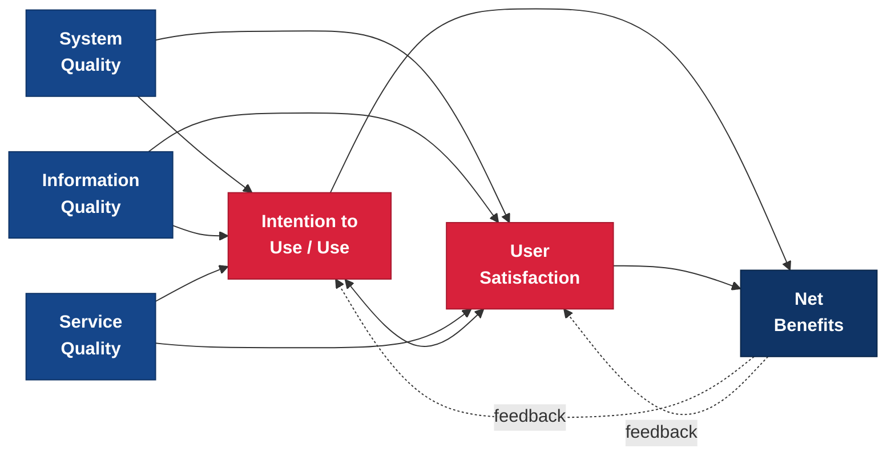

---
tags:
  - Reference
  - Research
  - Faculty
---

# AU Kogod Faculty Research & Frameworks

## Overview

AU Kogod School of Business has a distinguished faculty whose research shapes the field of information systems, analytics, and enterprise technology management. This page highlights key faculty contributions, with special attention to frameworks and models that are directly applicable to the enterprise IT concepts covered throughout this primer. Understanding these research contributions helps MBA students connect classroom concepts to the scholarly foundations that underpin modern IT management practice.

The faculty members profiled here have collectively produced thousands of cited publications spanning information systems success measurement, global software development, digital transformation, supply chain analytics, decision science, and enterprise architecture. Their work is not confined to academic journals -- it influences how organizations worldwide evaluate IT investments, structure global technology teams, govern AI initiatives, and optimize complex supply chains. Several of these frameworks have become standard tools used by practitioners in consulting firms, Fortune 500 IT departments, and government agencies.

For ITEC-617 students, this page serves two purposes. First, it introduces the scholarly research that underpins many of the frameworks and concepts you encounter throughout the primer -- giving you a deeper understanding of *why* these ideas work, not just *what* they recommend. Second, it demonstrates that the faculty teaching your courses are active contributors to the very fields they teach, bringing cutting-edge research insights directly into the classroom.

---

## Why This Matters for MBA Students

!!! info "Why This Matters for MBA Students"
    Kogod faculty research is not purely academic -- these frameworks and models are used daily by practitioners to evaluate IT investments, measure system success, justify technology spending, and structure global operations. The DeLone & McLean IS Success Model, for example, has been cited over 55,000 times and is used by organizations worldwide to assess whether their information systems are actually delivering value. Professor Carmel's research on global software development directly informs how companies structure their offshore and nearshore outsourcing relationships. When you understand the research foundations behind the concepts in this primer, you move beyond memorizing frameworks to truly understanding *why* they work -- which makes you a more effective and credible technology leader. As an MBA student at Kogod, you have direct access to the scholars who created these foundational contributions, an advantage that few business schools can match.

---

## The DeLone & McLean IS Success Model

The DeLone & McLean Information Systems Success Model is one of the most influential frameworks in the history of the IS field. Developed by Kogod faculty member William DeLone in collaboration with Ephraim McLean, this model addresses a deceptively simple but profoundly important question: **How do you measure whether an information system is successful?**

Before this model existed, researchers and practitioners measured IS success inconsistently -- some focused on system usage, others on user satisfaction, others on financial returns, and still others on technical performance. There was no unified framework for thinking about what "success" actually meant in the context of information systems. DeLone and McLean changed that by synthesizing the existing research into a comprehensive, multi-dimensional model that has become the standard reference point for IS evaluation worldwide.

### Origins and Significance

William DeLone and Ephraim McLean published their IS Success Model in 1992 in a landmark paper titled "Information Systems Success: The Quest for the Dependent Variable" in *Information Systems Research*. The title itself captures the fundamental problem they were solving -- researchers studying information systems needed a clear, agreed-upon way to define and measure the "dependent variable" of IS success. Without such agreement, it was impossible to compare findings across studies or build cumulative knowledge about what makes information systems succeed or fail.

The 1992 paper reviewed 180 prior studies and identified six distinct dimensions of IS success, organizing them into a causal model that showed how the dimensions related to one another. The paper became one of the most cited works in the entire IS discipline. Together with its 2003 update, the model has accumulated over 55,929 citations -- a remarkable figure that underscores its foundational importance to both academic research and practical IT management.

The model's enduring influence stems from its combination of theoretical rigor and practical applicability. It provides a structured way to evaluate any information system -- from a small departmental application to a global ERP implementation -- using dimensions that both technical and business audiences can understand and measure. For MBA students, it offers a ready-made evaluation framework that you can apply in any role where you need to assess whether a technology investment is delivering value.

### The Original 1992 Model (Six Dimensions)

The original model identified six interdependent dimensions of IS success, arranged in a causal sequence:

1. **System Quality** -- The technical performance characteristics of the information system itself. This includes reliability (does the system stay up and running?), response time (how fast does it perform?), ease of use (can users accomplish their tasks without excessive training or frustration?), and flexibility (can the system adapt to changing requirements?). System quality is about the *container* -- the technology platform and its technical attributes.

2. **Information Quality** -- The quality of the output that the system produces. This encompasses accuracy (is the data correct?), timeliness (is the information available when users need it?), completeness (does the output include all relevant data?), relevance (does the information address users' actual needs?), and consistency (are formats and definitions uniform across reports?). Information quality is about the *content* -- what the system delivers to its users.

3. **Use** -- The degree to which the system is actually used, including how frequently, how extensively, and in what ways. Use captures whether the system is adopted in practice or ignored. This dimension recognizes that a technically excellent system that nobody uses is not a successful system. Use can be measured through login frequency, feature utilization rates, transaction volumes, and the breadth of the user base.

4. **User Satisfaction** -- Users' subjective assessment of the system and its output. This is typically measured through surveys that ask users to rate their overall satisfaction, whether the system meets their needs, and whether they would recommend it to colleagues. User satisfaction captures the human judgment that quantitative usage metrics alone cannot provide -- a system might have high usage because it is mandatory, not because it is good.

5. **Individual Impact** -- The effect of the system on individual work performance. This includes improvements in decision quality (are users making better decisions with the system's information?), productivity (are users accomplishing more in less time?), and task innovation (does the system enable users to perform tasks they could not perform before?). Individual impact measures whether the system makes individual users more effective at their jobs.

6. **Organizational Impact** -- The effect of the system on overall organizational performance. This includes cost reductions, revenue growth, improved competitive positioning, and strategic advantage. Organizational impact is the ultimate measure of whether the IT investment delivered business value -- it connects system-level performance to enterprise-level outcomes.

The original model proposed that these dimensions are causally related: system quality and information quality influence both use and user satisfaction; use and user satisfaction influence each other; and both use and user satisfaction influence individual impact, which in turn influences organizational impact.

### The Updated 2003 Model

In 2003, DeLone and McLean published "The DeLone and McLean Model of Information Systems Success: A Ten-Year Update" in the *Journal of Management Information Systems*. This update reflected a decade of empirical testing, theoretical refinement, and changes in the technology landscape. Three significant modifications were introduced:

**Addition of Service Quality.** The updated model added **Service Quality** as a third antecedent alongside System Quality and Information Quality. This addition reflected the growing recognition that IT success depends not just on the technology and its output, but also on the quality of IT support and service delivery. Service quality encompasses the responsiveness, reliability, empathy, and competence of the IT support organization -- the helpdesk, system administrators, and IT service teams that keep systems running and assist users. This dimension connects directly to ITIL and IT service management concepts covered in the [Governance Frameworks](../governance/frameworks.md) section of this primer.

**Consolidation into Net Benefits.** The updated model collapsed Individual Impact and Organizational Impact into a single dimension called **Net Benefits**. This change recognized that the impacts of information systems extend beyond individuals and single organizations -- they can affect workgroups, industries, supply chains, economies, and societies. The term "net" acknowledges that IS effects can be both positive and negative, and that a comprehensive evaluation must consider the balance of costs and benefits across all relevant stakeholders.

**Addition of Feedback Loops.** The updated model added explicit feedback arrows from Net Benefits back to Intention to Use and User Satisfaction. This reflects the reality that the outcomes of using a system influence future usage behavior -- if a system delivers positive net benefits, users are more likely to continue using it and to report higher satisfaction. Conversely, if a system fails to deliver value, usage may decline and satisfaction may erode. These feedback loops transform the model from a simple linear progression into a dynamic, cyclical process.

### The 2003 Updated Model (Diagram)

The diagram above illustrates the three quality dimensions (System Quality, Information Quality, and Service Quality) on the left as inputs. These feed into the mediating dimensions of Use and User Satisfaction in the center, which share a bidirectional relationship -- usage influences satisfaction and satisfaction influences continued usage. Both Use and User Satisfaction drive Net Benefits on the right. The dotted feedback arrows from Net Benefits back to Use and User Satisfaction represent the cyclical nature of the model -- outcomes from IS use feed back to influence future behavior.

### Practical Applications

The DeLone & McLean model is not just a theoretical construct -- it is a practical tool that can be applied to evaluate any major IT initiative. Here are four concrete applications that MBA students are likely to encounter in their careers:

**Evaluating ERP Implementations.** ERP implementations are among the most expensive and complex IT projects an organization undertakes. The DeLone & McLean model provides a structured framework for assessing whether an ERP system is delivering value. You would measure system quality (uptime percentage, response time, number of defects), information quality (reporting accuracy, data consistency across modules, timeliness of financial reports), service quality (helpdesk response time, resolution rate, user training effectiveness), actual usage (adoption rates across departments, feature utilization, transaction volumes), user satisfaction (survey scores by department and role), and net benefits (efficiency gains, cost savings, cycle time reductions, improved decision-making). This comprehensive approach prevents the common mistake of evaluating an ERP solely on technical metrics while ignoring whether users are actually adopting the system and whether it is delivering business outcomes.

**Cloud Migration ROI.** Organizations migrating from on-premises infrastructure to the cloud often struggle to demonstrate return on investment because they focus narrowly on cost comparisons. The DeLone & McLean model broadens the evaluation to include system quality improvements (better uptime, faster scaling, reduced maintenance burden), information quality gains (real-time data access, improved disaster recovery, better integration between systems), service quality changes (cloud vendor support vs. in-house support), usage patterns (are employees accessing systems from more locations and devices?), user satisfaction (do users find the cloud-based systems easier to work with?), and net benefits (total cost impact including hidden costs, business agility improvements, competitive positioning). This multi-dimensional assessment gives a much more accurate picture of cloud migration value than simple cost calculations.

**Digital Transformation Assessment.** The model can serve as a structured evaluation framework for any major digital transformation initiative. By measuring all six dimensions at baseline (before the transformation) and at defined intervals during and after implementation, organizations can track whether the transformation is actually improving outcomes across all relevant dimensions -- not just the ones that are easiest to measure. This approach helps identify problems early: a transformation that improves system quality but decreases user satisfaction, for example, may have a change management problem that needs attention.

**Vendor Evaluation.** When comparing competing systems during a procurement process, the model's dimensions provide a structured set of evaluation criteria. Rather than relying solely on feature checklists and vendor demonstrations, evaluation teams can assess each vendor's offering against all six dimensions -- system quality (architecture, scalability, reliability), information quality (reporting capabilities, data integration), service quality (support model, SLAs, training), expected usage (ease of adoption, user interface design), projected user satisfaction (references from similar organizations), and anticipated net benefits (business case analysis, ROI projections).

### How to Apply the DeLone & McLean Model

The following table provides a practical guide for applying the model to any IT system evaluation:

| Dimension | What to Measure | Sample Metrics | Data Sources |
|-----------|----------------|----------------|--------------|
| **System Quality** | Technical performance of the system | Uptime percentage, response time (ms), number of defects per month, ease-of-use score, accessibility compliance | System monitoring tools, application performance management (APM), technical audits |
| **Information Quality** | Quality of system output | Data accuracy rate, report timeliness, completeness score, consistency across modules, relevance ratings | Data quality audits, user feedback, output sampling, cross-system reconciliation |
| **Service Quality** | Quality of IT support and service delivery | Helpdesk first-call resolution rate, average resolution time, SLA compliance, user training satisfaction | ITSM ticketing system, SLA reports, training evaluations, SERVQUAL surveys |
| **Use** | Extent and nature of system adoption | Daily/monthly active users, login frequency, feature utilization rates, transaction volumes, mobile vs. desktop usage | System logs, usage analytics, license utilization reports |
| **User Satisfaction** | Users' subjective assessment | Overall satisfaction score, net promoter score (NPS), task completion satisfaction, willingness to recommend | User surveys, focus groups, feedback portals, periodic satisfaction assessments |
| **Net Benefits** | Business outcomes and value delivered | Cost savings ($), revenue impact ($), productivity gains (%), cycle time reduction, error rate reduction, strategic goal achievement | Financial reports, operational dashboards, before/after comparisons, balanced scorecard |

!!! tip "Using the Model in Practice"
    When applying the DeLone & McLean model, start by defining what "success" means for your specific context -- different stakeholders may weight the six dimensions differently. A CFO may prioritize net benefits (cost savings and ROI), while end users care most about system quality and user satisfaction. The model's strength is that it forces a comprehensive evaluation that considers all stakeholder perspectives, preventing the common trap of optimizing for one dimension at the expense of others.

---

## Global IT Operations & Distributed Teams (Erran Carmel)

Professor Erran Carmel is a globally recognized authority on distributed software development, global IT sourcing, and the management of geographically dispersed technology teams. With over 10,738 citations, his research has fundamentally shaped how organizations think about and manage the challenges of working across time zones, cultures, and national boundaries. In an era when virtually every large enterprise operates technology teams across multiple countries, Professor Carmel's work provides the theoretical foundations and practical frameworks for making global IT operations effective.

### Key Research Contributions

Professor Carmel's most significant contributions include several frameworks and concepts that have become standard vocabulary in the field of global software development:

**The Global Software Development Framework.** Carmel's foundational work established the conceptual framework for understanding how software development operates when teams are distributed across geographic locations. His research identifies the unique challenges of global development -- including communication barriers, coordination costs, cultural differences, and the erosion of informal knowledge sharing that naturally occurs when teams are co-located -- and provides structured approaches for managing these challenges. This framework has been adopted by organizations worldwide to design their distributed development practices.

**The Nearshoring Concept.** Carmel was among the earliest researchers to articulate and analyze the concept of "nearshoring" -- outsourcing technology work to nearby countries rather than distant ones. While offshoring to countries like India offered significant cost savings, Carmel's research demonstrated that proximity (geographic, temporal, cultural, and linguistic) carries substantial benefits for coordination, communication, and quality. His work helped establish nearshoring as a recognized sourcing strategy, influencing decisions by U.S. companies to establish development centers in Latin America and Canadian companies to work with partners in the Caribbean and Central America.

**The Follow-the-Sun Development Model.** This model describes a practice where software development work is handed off between teams in different time zones so that development continues around the clock. Carmel's research examined the conditions under which follow-the-sun development actually works (it is far more difficult than it sounds) and identified the organizational, technical, and process requirements for success -- including the critical importance of thorough documentation, modular architecture, and standardized handoff protocols.

**Centrifugal Forces in Global Teams.** One of Carmel's most influential conceptual contributions is his identification of the "centrifugal forces" that push global teams apart -- geographic distance, time zone differences, cultural diversity, language barriers, and organizational boundaries. These forces work against cohesion and make coordination progressively more difficult as teams become more distributed. Understanding these forces helps managers design mitigation strategies (such as liaison roles, overlapping work hours, and cultural training) to counteract the natural tendency of global teams to fragment.

### Relevance to This Primer

Professor Carmel's research connects directly to several topics covered in this primer. His work on global sourcing models informs the [Vendor Management](../management/vendor-management.md) section, particularly the discussion of offshore and nearshore outsourcing decisions. His research on distributed team management provides scholarly grounding for the collaboration challenges discussed in [Project Management](../management/project-management.md). And his analysis of how global infrastructure decisions affect team effectiveness connects to the [Cloud Computing](../technology/cloud-computing.md) discussion of global cloud regions and data residency.

### Key Works

- Carmel, E. (2005). *Offshoring Information Technology: Sourcing and Outsourcing to a Global Workforce.* Cambridge University Press.
- Carmel, E., & Tjia, P. (2005). *Offshoring Information Technology.* Cambridge University Press.
- Carmel, E. (2010). *I'm Working While They're Sleeping: Time Zone Separation Challenges and Solutions.* Springer.
- [Google Scholar Profile -- Erran Carmel](https://scholar.google.com/citations?user=KpuI3vAAAAAJ)

---

## Digital Transformation & Software Agility (Gwanhoo Lee)

Professor Gwanhoo Lee serves as Department Chair and brings a research focus that sits at the intersection of digital transformation, AI governance, software agility, and open government. With over 6,421 citations, his work addresses some of the most pressing questions facing organizations today: How should enterprises govern artificial intelligence? How do you measure and improve an organization's software agility? And how can digital innovation transform public sector service delivery?

### Key Research Contributions

**Software Agility Measurement Framework.** Professor Lee's research on software agility provides organizations with structured approaches for measuring and improving their ability to develop and deploy software rapidly and responsively. In an era where the speed of software delivery is a competitive differentiator, his framework helps organizations assess where they stand on the agility spectrum and identify specific capabilities they need to develop. This work connects the abstract concept of "agility" to concrete, measurable organizational attributes.

**AI Governance Research.** As organizations rush to deploy artificial intelligence, Professor Lee's research on AI governance addresses the critical question of how enterprises should structure oversight, accountability, and decision-making for AI systems. His work examines the unique governance challenges that AI presents -- including algorithmic bias, explainability requirements, regulatory compliance, and the need for human oversight of automated decisions. This research is particularly timely as AI governance frameworks are rapidly evolving and organizations are struggling to establish appropriate controls without stifling innovation.

**Open Government and Digital Innovation in the Public Sector.** Professor Lee has made significant contributions to understanding how digital technologies can transform government operations and public service delivery. His open government maturity model provides a framework for assessing how well government agencies are leveraging technology to increase transparency, citizen participation, and inter-agency collaboration. This research demonstrates that the digital transformation concepts covered in this primer apply well beyond the private sector.

### Relevance to This Primer

Professor Lee's research connects to several primer topics. His work on digital transformation provides scholarly foundations for the concepts in the [Digital Transformation](../transformation/digital-transformation.md) section. His AI governance research directly informs the discussion of AI risks and governance in [AI & Emerging Tech](../transformation/ai-emerging-tech.md). And his software agility framework connects to the Agile methodologies discussed in [Project Management](../management/project-management.md) and the governance structures covered in [IT Governance Frameworks](../governance/frameworks.md).

- [Google Scholar Profile -- Gwanhoo Lee](https://scholar.google.com/citations?user=SH-XKYMAAAAJ)

---

## Analytics, Optimization & Decision Science

The Kogod faculty includes several distinguished researchers whose work in analytics, optimization, and decision science provides the quantitative and methodological foundations for data-driven enterprise management.

### Edward Wasil — Operations Research & Applied Analytics

Professor Edward Wasil is a leading figure in operations research and applied analytics, with over 100 published articles and recognition including the INFORMS Computing Society Prize (2005). His research focuses on applying operations research techniques -- mathematical optimization, network analysis, and decision modeling -- to practical business problems. Professor Wasil has been a pioneer in demonstrating how rigorous analytical methods can be made accessible and useful to practicing managers, bridging the gap between theoretical optimization and real-world business application.

His work in network optimization has applications across logistics, supply chain design, telecommunications, and transportation planning. For MBA students, Professor Wasil's research demonstrates that "analytics" is not just about dashboards and data visualization -- it encompasses a rich set of mathematical and computational tools that can dramatically improve decision quality when applied to complex business problems.

### Jay Simon — Decision Analysis & Preference Modeling

Professor Jay Simon's research focuses on decision analysis, multi-attribute preference modeling, and the challenge of making decisions where outcomes vary geographically or across contexts. His work addresses a fundamental question that every manager faces: when a decision involves multiple competing objectives (cost vs. quality vs. speed vs. risk), how do you systematically evaluate tradeoffs and arrive at a well-reasoned choice?

Professor Simon's research on geographically-varying decisions is particularly relevant in an enterprise IT context, where technology decisions often have different implications for different regions, business units, or user populations. A cloud migration that makes perfect sense for a North American headquarters may create latency, compliance, or support challenges for operations in other regions. His multi-attribute preference modeling frameworks provide structured approaches for navigating these complex tradeoffs.

### Itir Karaesmen Aydin — Supply Chain Resilience & Healthcare Operations

Professor Itir Karaesmen Aydin's research focuses on supply chain resilience, healthcare supply chain management, and inventory management under uncertainty. Her work addresses the critical challenge of designing supply chains that can withstand disruptions -- whether from natural disasters, pandemics, geopolitical events, or supplier failures -- while maintaining cost efficiency during normal operations.

Her research on healthcare supply chains has particular urgency in a post-pandemic world, where the fragility of medical supply chains was exposed on a global scale. Professor Karaesmen Aydin's work on inventory management under uncertainty provides quantitative frameworks for determining optimal inventory levels when demand and supply are unpredictable -- a challenge that applies equally to physical goods and IT resources like cloud capacity and software licenses.

### Relevance to This Primer

The analytics and decision science faculty's research connects to the [Data Governance & Analytics](../risk-security/data-governance.md) section (foundations of data-driven decision making), the [Enterprise Applications](../technology/enterprise-applications.md) section (particularly SCM systems and the analytics capabilities embedded in modern enterprise platforms), and the [Business Process Management](../transformation/bpm.md) section (process optimization and continuous improvement).

---

## Enterprise Architecture & Process Analysis (Francis Armour)

Professor Francis Armour brings a distinctive practitioner-scholar perspective to the Kogod faculty, combining deep practical experience in enterprise architecture with academic rigor. As an adjunct professor, he bridges the gap between industry practice and classroom instruction, ensuring that students understand enterprise architecture not just as an abstract framework but as a living discipline practiced daily in large organizations.

### Key Research Contributions

Professor Armour's key contributions focus on enterprise architecture process frameworks and business process analysis methods. His research addresses the practical challenges of implementing enterprise architecture programs -- how to structure the EA practice, how to engage stakeholders, how to manage the architecture repository, and how to ensure that architecture decisions translate into actual implementation outcomes. His work emphasizes that enterprise architecture is ultimately about enabling better business decisions through structured technology planning, not about producing documentation for its own sake.

His business process analysis methods provide structured approaches for understanding, documenting, and improving the processes that organizations use to deliver value. This work connects the technical discipline of enterprise architecture to the operational discipline of business process management, demonstrating that effective IT management requires attention to both the systems and the processes they support.

### Relevance to This Primer

Professor Armour's research directly connects to the [Enterprise Architecture](../technology/enterprise-architecture.md) section (particularly the practical aspects of implementing TOGAF and managing architecture governance), the [Business Process Management](../transformation/bpm.md) section (process analysis and improvement methodologies), and the [Governance Frameworks](../governance/frameworks.md) section (architecture governance as a component of overall IT governance).

---

## Supply Chain Management & Analytics (Ayman Omar)

Professor Ayman Omar serves as Associate Dean and brings research expertise in supply chain disruption analysis and the application of analytics to supply chain management challenges. His work examines how organizations can use data and analytical methods to anticipate, respond to, and recover from supply chain disruptions -- a topic of enormous practical importance in an era of increasing global uncertainty.

### Key Research Contributions

Professor Omar's research on supply chain disruption analysis provides frameworks for understanding how disruptions propagate through interconnected supply networks and how organizations can build resilience through better visibility, diversification, and analytical capabilities. His work demonstrates the critical role that information technology plays in modern supply chain management -- from the ERP and SCM systems that provide operational visibility to the advanced analytics platforms that enable predictive disruption modeling.

His position as Associate Dean also reflects the school's commitment to integrating technology management across the business curriculum, recognizing that supply chain management, finance, marketing, and strategy are all increasingly dependent on enterprise technology platforms and data analytics capabilities.

### Relevance to This Primer

Professor Omar's research connects to the [Enterprise Applications](../technology/enterprise-applications.md) section (particularly the discussion of SCM systems and their integration with ERP platforms), the [Digital Transformation](../transformation/digital-transformation.md) section (digital supply chain transformation as a key use case), and the broader theme of risk management that runs throughout the primer's [Risk & Security](../risk-security/index.md) section.

---

## Cross-Faculty Research Themes

While each faculty member brings unique expertise, several collaborative research themes cut across the Kogod IS and analytics faculty:

**Data-Driven Decision Making.** From Wasil's operations research to Simon's decision analysis to Omar's supply chain analytics, a common thread is the use of rigorous analytical methods to improve decision quality. This theme reflects the broader organizational shift from intuition-based to evidence-based management -- a transformation enabled by the enterprise data platforms and analytics tools discussed throughout this primer.

**Technology Governance.** DeLone's IS success measurement, Lee's AI governance research, and Armour's enterprise architecture governance all address the fundamental question of how organizations can ensure that technology investments deliver intended value while managing risk. This governance theme connects directly to the IT governance frameworks (COBIT, ITIL, ISO/IEC 38500) discussed in the [Governance Frameworks](../governance/frameworks.md) section.

**Supply Chain Resilience.** Karaesmen Aydin's supply chain resilience research and Omar's disruption analysis represent a shared focus on building supply chains that can withstand uncertainty. This theme has become increasingly important as global events -- from pandemics to geopolitical conflicts to climate disruptions -- have demonstrated the fragility of extended supply networks.

**Digital Transformation of Organizations.** Lee's digital transformation research, Carmel's work on global IT operations, and the analytics faculty's demonstration of how quantitative methods transform business processes all contribute to understanding how organizations navigate the transition from traditional to digitally-enabled operations. This is perhaps the most integrative theme, as digital transformation touches every aspect of enterprise IT management covered in this primer.

---

## Key Takeaways

- Kogod faculty have made foundational contributions to IS theory -- the DeLone & McLean IS Success Model is used worldwide as the standard framework for evaluating information system effectiveness and has been cited over 55,000 times
- Research spans from global IT operations (Carmel) to AI governance (Lee) to supply chain analytics (Karaesmen Aydin, Omar), covering the full breadth of enterprise IT management
- The DeLone & McLean IS Success Model provides a practical, six-dimension framework for evaluating any IT investment -- from ERP implementations to cloud migrations to digital transformation initiatives
- Faculty research directly informs the frameworks and concepts taught in this primer, giving Kogod MBA students a unique connection to the scholarly foundations of IT management
- Understanding these scholarly foundations strengthens your ability to make evidence-based IT decisions and to communicate technology value in terms that both technical and business audiences understand
- The cross-cutting themes of data-driven decision making, technology governance, supply chain resilience, and digital transformation reflect the integrated nature of modern enterprise IT management

---

## Related Topics

- [IT Governance Frameworks](../governance/frameworks.md) -- COBIT, ITIL, and ISO/IEC 38500 frameworks for governing enterprise IT
- [Enterprise Architecture](../technology/enterprise-architecture.md) -- TOGAF, Zachman, and the discipline of structured technology planning
- [Digital Transformation](../transformation/digital-transformation.md) -- Frameworks and strategies for organizational digital transformation
- [Vendor Management](../management/vendor-management.md) -- Managing outsourcing relationships, including offshore and nearshore models
- [Data Governance & Analytics](../risk-security/data-governance.md) -- Governing data assets and leveraging analytics for decision-making
- [AI & Emerging Tech](../transformation/ai-emerging-tech.md) -- Artificial intelligence governance and emerging technology management
- [Enterprise Applications](../technology/enterprise-applications.md) -- ERP, CRM, and SCM systems that faculty research evaluates

---

## Further Reading

### Foundational Papers

- DeLone, W. H., & McLean, E. R. (1992). "Information Systems Success: The Quest for the Dependent Variable." *Information Systems Research*, 3(1), 60-95.
- DeLone, W. H., & McLean, E. R. (2003). "The DeLone and McLean Model of Information Systems Success: A Ten-Year Update." *Journal of Management Information Systems*, 19(4), 9-30.

### Books

- Carmel, E. (2005). *Offshoring Information Technology: Sourcing and Outsourcing to a Global Workforce.* Cambridge University Press.
- Carmel, E., & Tjia, P. (2005). *Offshoring Information Technology.* Cambridge University Press.
- Carmel, E. (2010). *I'm Working While They're Sleeping: Time Zone Separation Challenges and Solutions.* Springer.

### Faculty Google Scholar Profiles

- [William DeLone](https://scholar.google.com/citations?user=i3lGHN0AAAAJ) -- Information systems success, IS evaluation
- [Erran Carmel](https://scholar.google.com/citations?user=KpuI3vAAAAAJ) -- Global software development, offshoring, distributed teams
- [Gwanhoo Lee](https://scholar.google.com/citations?user=SH-XKYMAAAAJ) -- Digital transformation, AI governance, software agility
- [Edward Wasil](https://scholar.google.com/citations?user=7FrLFHwAAAAJ) -- Operations research, applied analytics
- [Jay Simon](https://scholar.google.com/citations?user=yFDGpJMAAAAJ) -- Decision analysis, preference modeling
- [Itir Karaesmen Aydin](https://scholar.google.com/citations?user=5K8gvisAAAAJ) -- Supply chain resilience, healthcare operations
- [Ayman Omar](https://scholar.google.com/citations?user=qE_z4_IAAAAJ) -- Supply chain disruption, analytics

### Primer Cross-References

- [Frameworks Reference](frameworks-reference.md) -- Quick-reference guide to all major IT frameworks covered in this primer
- [IT Governance Frameworks](../governance/frameworks.md) -- Full discussion of COBIT, ITIL, and ISO/IEC 38500
- [Enterprise Architecture](../technology/enterprise-architecture.md) -- TOGAF and Zachman frameworks in detail
- [Digital Transformation](../transformation/digital-transformation.md) -- McKinsey 4Ds and other transformation frameworks
- [Vendor Management](../management/vendor-management.md) -- Offshore, nearshore, and global sourcing strategies
