---
tags:
  - reference
  - courses
  - analytics
  - career
---

# AU Kogod Graduate IT & Analytics Course Guide

!!! abstract "Disclaimer"
    This guide is based on the **2025–2026 AU Course Catalog** and is provided for informational and planning purposes only. Course offerings, descriptions, prerequisites, and availability **change from year to year**. Always verify current offerings on the [official AU Course Catalog](https://catalog.american.edu/) and consult your academic advisor before registering. This content was developed with AI assistance. See the [full disclaimer](../disclaimer.md) for details on methodology and validation.

## Overview

After completing ITEC-617 and the MBA core curriculum, many students want to deepen their knowledge in specific areas of IT and analytics — whether to support a career in consulting, pivot into a technology leadership role, pursue data-driven decision-making, or specialize in cybersecurity. AU Kogod's ITEC course catalog offers a rich set of graduate electives in the 600- and 700-level series that can serve these goals.

This guide organizes available ITEC graduate courses by **interest area** so you can quickly identify which courses align with your career direction. Each course is listed with its catalog description, prerequisites, and connections to topics covered in this primer. Use this as a starting point for planning your Year 2 electives.

!!! info "Why This Matters for MBA Students"
    Choosing the right electives is one of the highest-leverage decisions in your MBA program. A well-chosen set of IT and analytics courses can differentiate you in the job market, give you the vocabulary to lead technology teams, and equip you with hands-on skills that complement your general management training. This guide helps you move from "What sounds interesting?" to "What builds the skill set I need?"

---

## How to Use This Guide

**Step 1:** Identify your interest area(s) from the five tracks below.

**Step 2:** Review the courses in that track — note prerequisites and how they connect to primer topics you have already studied.

**Step 3:** Check the [prerequisite map](#prerequisite-chains-sequencing) to plan your course sequence.

**Step 4:** Verify current availability on the [AU Course Catalog](https://catalog.american.edu/) — offerings change each semester.

---

## Courses by Interest Area

### Track 1: Data Analytics & AI

*For students interested in data-driven decision-making, predictive modeling, machine learning, and AI applications in business.*

| Course | Title | Credits | Prerequisites |
|--------|-------|---------|---------------|
| ITEC-610 | Applied Managerial Statistics | 3 | None (college-level math recommended) |
| ITEC-620 | Business Insights through Analytics | 3 | ITEC-610 |
| ITEC-621 | Predictive Analytics with Machine Learning | 3 | ITEC-610 and ITEC-620 |
| ITEC-623 | Organizational and Social Network Analytics | 3 | ITEC-610 |
| ITEC-660 | Business Intelligence | 3 | ITEC-610 |
| ITEC-670 | Database and AI | 3 | None |
| ITEC-724 | Advanced Text Analytics with AI and Machine Learning | 3 | None listed |

??? note "ITEC-610 — Applied Managerial Statistics"
    Business decision problems can be characterized as situations in which managers must select the best alternative from several competing alternatives. Managers frequently rely on results from statistical analyses to help make the best decision. Students use real-world data sets and PC-based software to describe sets of measurements, construct probability distributions, estimate numerical descriptive measures, and build multiple regression models in a variety of business settings related to accounting, finance, information technology, marketing, and sustainability.

    **Primer connection:** Builds the quantitative foundation for concepts in [Analytics Fundamentals](../transformation/analytics-fundamentals.md) and [Data Visualization](../transformation/data-visualization.md).

??? note "ITEC-620 — Business Insights through Analytics"
    Students are introduced to descriptive, predictive, and prescriptive analytics and to models, tools, and methods commonly used in each area to develop multidisciplinary business insights from data. Through hands-on exercises and a term project, students develop skills to present solutions to problems and provide answers to business questions in various business disciplines such as accounting, finance, information technology, marketing, and sustainability.

    **Primer connection:** Deepens the analytics spectrum (descriptive through prescriptive) covered in [Analytics Fundamentals](../transformation/analytics-fundamentals.md).

??? note "ITEC-621 — Predictive Analytics with Machine Learning"
    Students are introduced to predictive modeling methods, approaches, and tools. Students gain skills in predictive analytics to develop and use advanced predictive analytics methods; develop expertise in the use of popular tools and software for predictive analytics; learn how to develop predictive analytic questions; identify and select the most appropriate predictive analytics methods and tools, apply these methods to answer the respective questions, and present data-driven solutions.

    **Primer connection:** Hands-on application of the machine learning concepts introduced in [AI & Emerging Tech](../transformation/ai-emerging-tech.md) and [Analytics Fundamentals](../transformation/analytics-fundamentals.md).

??? note "ITEC-623 — Organizational and Social Network Analytics"
    Students are exposed to key social network theories, methods, and tools. Students develop and use advanced social network analytics methods; develop expertise in the use of popular network analysis tools and software; learn how to develop analytical questions that can be answered with social network analysis concepts and methods.

    **Primer connection:** Applies network analysis to the organizational dynamics discussed in [IT-Business Alignment](../governance/it-business-alignment.md) and the network effects covered in [Platform Economics](../governance/platform-economics.md).

??? note "ITEC-660 — Business Intelligence"
    Business Intelligence (BI) connects data from multiple sources to produce meaningful information and identify patterns and trends to inform decisions. BI encompasses the methodologies, metrics, processes, and information systems used to monitor and manage an enterprise's business performance and support strategic decision-making. This course exposes students to the management practices, methodologies, and technologies that major corporations are applying, including data warehousing, data mining, business analytics, predictive statistics, online analytical processing, and visual data representations.

    **Primer connection:** Builds on the BI and data warehousing concepts in [Data Governance](../risk-security/data-governance.md) and the dashboard design principles in [Data Visualization](../transformation/data-visualization.md).

??? note "ITEC-670 — Database and AI"
    This course introduces important database concepts, including data modeling, database design, data extraction and data analysis skills needed to transform raw data into useful business information and knowledge for decision making and problem solving. Topics include relational design, data warehousing, artificial intelligence (AI) database tools, AI vector databases, NoSQL databases, data search, data querying, basic analytics and reporting.

    **Primer connection:** Deepens the database and data architecture concepts in [Enterprise Architecture](../technology/enterprise-architecture.md) and the AI infrastructure topics in [AI & Emerging Tech](../transformation/ai-emerging-tech.md).

??? note "ITEC-724 — Advanced Text Analytics with AI and Machine Learning"
    This course teaches students to design, plan, execute, and report on a relatively large-scale AI-driven text analytics project. It includes multiple hands-on labs in both R and Python, and a semester-long research project. Students explore the fundamentals of text analytics and data visualization beginning with statistical bag-of-words (BoW) approaches, moving to natural language processing (NLP) approaches including language models, word embeddings, and Named Entity Recognition (NER); then on to machine learning approaches, including unsupervised techniques such as topic modeling and clustering, and supervised techniques such as predictive modeling; ending with Deep Learning, transformers, and large language models (LLMs) like GPT, BERT, and LLaMA that underlie Generative AI tools.

    **Primer connection:** Advanced application of the GenAI and LLM concepts covered in [AI & Emerging Tech](../transformation/ai-emerging-tech.md).

---

### Track 2: Cybersecurity & Risk

*For students interested in information security management, cyber risk governance, and security analytics.*

| Course | Title | Credits | Prerequisites |
|--------|-------|---------|---------------|
| ITEC-666 | Cybersecurity Risk Management | 3 | ITEC-616 or ITEC-617 |
| ITEC-667 | Cybersecurity Governance | 3 | None |
| ITEC-668 | Cybersecurity Analytics | 3 | ITEC-610 |

??? note "ITEC-666 — Cybersecurity Risk Management"
    This course focuses on three key areas: the risks associated with information management in the digital economy; the most effective personal and business practices to manage these risks; and the associated information forensics to understand where and how information can be traced. Individual, corporate, and national/global aspects of information security risks are covered, as well as issues related to risk understanding, assessment, and management, corporate governance, and incident response.

    **Primer connection:** Deepens the risk frameworks, zero trust architecture, and CISO governance topics covered in [Cybersecurity](../risk-security/cybersecurity.md).

??? note "ITEC-667 — Cybersecurity Governance"
    Cybersecurity governance refers to the organizational structures, procedures, and policies that address the range of risks and opportunities including legal, technical, financial, and operational, relevant to cybersecurity. Case studies, including an in-depth analysis of the cybersecurity governance of a company, and examples from multiple business sectors are used to understand key aspects of cybersecurity governance in both public and private organizations.

    **Primer connection:** Extends the governance frameworks in [IT Governance Frameworks](../governance/frameworks.md) and the CISO organizational models in [C-Suite IT Roles](../governance/c-suite-roles.md) to the cybersecurity domain specifically.

??? note "ITEC-668 — Cybersecurity Analytics"
    This course covers a variety of analytics techniques for cybersecurity applications, from data collection and management to machine learning to data visualization, and discusses their roles in detecting cyber threats and strengthening the defense of critical cyber assets in today's ever-changing cybersecurity landscape.

    **Primer connection:** Combines the analytics methods from [Analytics Fundamentals](../transformation/analytics-fundamentals.md) with the SIEM, SOC, and threat detection topics in [Cybersecurity](../risk-security/cybersecurity.md).

---

### Track 3: IT Management & Strategy

*For students interested in technology leadership, IT governance, business process optimization, and project management.*

| Course | Title | Credits | Prerequisites |
|--------|-------|---------|---------------|
| ITEC-616 | Managing the Digital Organization in the Age of AI | 3 | None |
| ITEC-630 | Business Process Analysis | 3 | None |
| ITEC-643 | Project Management | 3 | None |
| ITEC-618 | Applied Production and Operations Management | 1.5 | ITEC-610 |

??? note "ITEC-616 — Managing the Digital Organization in the Age of AI"
    The course covers the conceptual, practical, and managerial foundations of managing organizations in today's digital and data-driven economy. It includes foundational aspects of information technology: digital transformation, digital competition, analytics management, cybersecurity, and emerging technologies including artificial intelligence.

    **Primer connection:** A comprehensive companion to this entire primer — covers [Digital Transformation](../transformation/digital-transformation.md), [AI & Emerging Tech](../transformation/ai-emerging-tech.md), and [IT-Business Alignment](../governance/it-business-alignment.md) in depth with a management lens.

??? note "ITEC-630 — Business Process Analysis"
    Students learn how to conduct business analysis to document business processes and describe the functional requirements for the corresponding business application and then analyze the information requirements to support the application. The course has a strong hands-on component which prepares students for IT consulting and business analysis practices. Students work in teams on a consulting project with an organization or consulting firm.

    **Primer connection:** Hands-on application of the process modeling, BPMN, and process mining concepts covered in [Business Process Management](../transformation/bpm.md).

??? note "ITEC-643 — Project Management"
    Due to the increasing complexity of business and technology environments, it is challenging for managers to complete mission-critical projects on time and within budget while satisfying project stakeholders. This course educates students to become competent project managers. Students learn about the industry-standard Project Management Body of Knowledge (PMBOK) including important project management concepts, frameworks, principles, methodologies, techniques, and tools.

    **Primer connection:** Deepens the project management methodologies (Agile, Waterfall, hybrid) covered in [Project Management](../management/project-management.md).

??? note "ITEC-618 — Applied Production and Operations Management"
    This course introduces production and operations management (POM), the process of managing people and resources in order to produce goods or provide services. Decisions related to forecasting, aggregate planning, facility location, project scheduling, inventory control, supply chain management, and sustainability are discussed. Considerable emphasis is placed on the development of models and analytical tools.

    **Primer connection:** Extends the supply chain and operational efficiency topics in [Enterprise Applications](../technology/enterprise-applications.md) and [Digital Transformation](../transformation/digital-transformation.md).

---

### Track 4: Programming & Technical Foundations

*For students who want hands-on technical skills in Python, databases, and productivity tools.*

| Course | Title | Credits | Prerequisites |
|--------|-------|---------|---------------|
| ITEC-600 | Programming Tools for Analytics: Python | 3 | ITEC-610 |
| ITEC-670 | Database and AI | 3 | None |
| ITEC-677 | Microsoft Certification | 1 | None |

??? note "ITEC-600 — Programming Tools for Analytics: Python"
    This course provides foundations in software programming for business analytics, focusing on Python. It introduces software development and object-oriented programming, provides an overview of Python syntax and popular Python packages for business analytics modeling, and reviews useful tools to enhance productivity in Python, including iPython and Jupyter Notebooks.

    **Primer connection:** Provides the programming skills referenced in [Technical Literacy for Managers](../technology/technical-literacy.md) — moves from conceptual understanding to hands-on coding.

??? note "ITEC-670 — Database and AI"
    Topics include relational design, data warehousing, artificial intelligence (AI) database tools, AI vector databases, NoSQL databases, data search, data querying, basic analytics and reporting.

    **Primer connection:** Builds the database skills behind the data architecture concepts in [Enterprise Architecture](../technology/enterprise-architecture.md) and the AI vector database topics in [AI & Emerging Tech](../transformation/ai-emerging-tech.md).

??? note "ITEC-677 — Microsoft Certification"
    This hands-on workshop helps students acquire the skills and knowledge needed to successfully complete the Microsoft Office Specialist (MOS) exam. Topics vary by section. All students take the certification exam on the second day of the workshop. (1 credit, Pass/Fail, repeatable with different topic.)

    **Primer connection:** Practical certification aligned with the enterprise software ecosystem discussed in [Enterprise Applications](../technology/enterprise-applications.md).

---

### Track 5: Emerging Technology & Innovation

*For students interested in blockchain, advanced AI, and emerging digital business models.*

| Course | Title | Credits | Prerequisites |
|--------|-------|---------|---------------|
| ITEC-678 | Blockchain Applications | 3 | None |
| ITEC-724 | Advanced Text Analytics with AI and Machine Learning | 3 | None listed |
| ITEC-616 | Managing the Digital Organization in the Age of AI | 3 | None |

??? note "ITEC-678 — Blockchain Applications"
    This course provides students with a clear understanding, through experiential learning, of blockchain, combined with other emerging technologies (e.g., artificial intelligence, machine learning, etc.), applications, and implementations in the global digital ecosystem. It explores the implications of this technology for different types of organizations such as governments, multinationals, international development organizations, and other institutions. Topics include blockchain fundamentals, the value proposition to different stakeholders, barriers to implementation, and the impact of blockchain on existing business processes.

    **Primer connection:** Extends the emerging technology landscape in [AI & Emerging Tech](../transformation/ai-emerging-tech.md) and [Innovation Management](../transformation/innovation-management.md).

---

### Additional Opportunities

| Course | Title | Credits | Notes |
|--------|-------|---------|-------|
| ITEC-690 | Independent Study Project | 1–6 | Faculty-supervised research on a topic of your choice. Requires instructor and department chair permission. |
| ITEC-691 | Internship in Information Technology | 1–3 | Earn credit for IT-related professional experience. Pass/Fail. Requires instructor and department chair permission. |
| ITEC-696 | Selected Topics: Non-Recurring | 1–6 | Special-topic courses that change each semester — watch for topics in AI, cloud, or other emerging areas. |
| ITEC-797 | Master's Thesis Research | 1–6 | For students in thesis-track programs. Requires 24 completed graduate credit hours. |

---

## Prerequisite Chains & Sequencing

Understanding prerequisite dependencies is critical for planning your course sequence. The following diagram shows how ITEC courses build on each other:

```mermaid
graph TD
    E610["<b>ITEC-610</b><br/>Applied Managerial<br/>Statistics"]
    E600["<b>ITEC-600</b><br/>Python for<br/>Analytics"]
    E620["<b>ITEC-620</b><br/>Business Insights<br/>through Analytics"]
    E621["<b>ITEC-621</b><br/>Predictive Analytics<br/>& ML"]
    E623["<b>ITEC-623</b><br/>Social Network<br/>Analytics"]
    E660["<b>ITEC-660</b><br/>Business<br/>Intelligence"]
    E668["<b>ITEC-668</b><br/>Cybersecurity<br/>Analytics"]
    E618["<b>ITEC-618</b><br/>Operations<br/>Management"]

    E617["<b>ITEC-617</b><br/>Information &<br/>Technology"]
    E616["<b>ITEC-616</b><br/>Managing the<br/>Digital Org"]
    E666["<b>ITEC-666</b><br/>Cybersecurity<br/>Risk Mgmt"]

    NONE1["<b>No Prerequisites</b>"]
    E670["<b>ITEC-670</b><br/>Database & AI"]
    E630["<b>ITEC-630</b><br/>Business Process<br/>Analysis"]
    E643["<b>ITEC-643</b><br/>Project<br/>Management"]
    E667["<b>ITEC-667</b><br/>Cybersecurity<br/>Governance"]
    E678["<b>ITEC-678</b><br/>Blockchain<br/>Applications"]
    E724["<b>ITEC-724</b><br/>Advanced Text<br/>Analytics & AI"]

    E610 --> E600
    E610 --> E620
    E620 --> E621
    E610 --> E621
    E610 --> E623
    E610 --> E660
    E610 --> E668
    E610 --> E618

    E617 --> E666
    E616 --> E666

    NONE1 -.-> E670
    NONE1 -.-> E630
    NONE1 -.-> E643
    NONE1 -.-> E667
    NONE1 -.-> E678
    NONE1 -.-> E724

    style E610 fill:#15468A,stroke:#15468A,color:#fff
    style E617 fill:#15468A,stroke:#15468A,color:#fff
    style E616 fill:#15468A,stroke:#15468A,color:#fff
    style E600 fill:#2a6cb5,stroke:#15468A,color:#fff
    style E620 fill:#2a6cb5,stroke:#15468A,color:#fff
    style E621 fill:#D8213B,stroke:#D8213B,color:#fff
    style E623 fill:#2a6cb5,stroke:#15468A,color:#fff
    style E660 fill:#2a6cb5,stroke:#15468A,color:#fff
    style E668 fill:#2a6cb5,stroke:#15468A,color:#fff
    style E618 fill:#2a6cb5,stroke:#15468A,color:#fff
    style E666 fill:#D8213B,stroke:#D8213B,color:#fff
    style E670 fill:#117a65,stroke:#0e6655,color:#fff
    style E630 fill:#117a65,stroke:#0e6655,color:#fff
    style E643 fill:#117a65,stroke:#0e6655,color:#fff
    style E667 fill:#117a65,stroke:#0e6655,color:#fff
    style E678 fill:#117a65,stroke:#0e6655,color:#fff
    style E724 fill:#117a65,stroke:#0e6655,color:#fff
    style NONE1 fill:#f5f5f5,stroke:#999,color:#333
```

**Reading the diagram:** Dark blue nodes are foundation courses. Medium blue nodes require ITEC-610 as a prerequisite. Red nodes require two prerequisites. Green nodes have no prerequisites and can be taken at any time.

### Recommended Sequencing by Track

=== "Analytics & AI Track"

    | Semester | Course | Why This Order |
    |----------|--------|----------------|
    | **Year 1** | ITEC-610 | Statistical foundation required for all analytics courses |
    | **Year 2 Fall** | ITEC-620 + ITEC-670 | Analytics methods + database skills (can be taken in parallel) |
    | **Year 2 Spring** | ITEC-621 + ITEC-724 | ML and advanced text analytics (ITEC-621 requires both 610 and 620) |

=== "Cybersecurity Track"

    | Semester | Course | Why This Order |
    |----------|--------|----------------|
    | **Year 1** | ITEC-617 or ITEC-616 | Management foundation; prerequisite for ITEC-666 |
    | **Year 2 Fall** | ITEC-666 + ITEC-667 | Risk management + governance (can be taken in parallel) |
    | **Year 2 Spring** | ITEC-668 | Analytics-based security (requires ITEC-610; take 610 in Year 1 or Year 2 Fall) |

=== "IT Leadership Track"

    | Semester | Course | Why This Order |
    |----------|--------|----------------|
    | **Year 1** | ITEC-616 | Comprehensive digital management overview |
    | **Year 2 Fall** | ITEC-630 + ITEC-643 | Process analysis + project management (no prerequisites, can be taken in parallel) |
    | **Year 2 Spring** | ITEC-660 or ITEC-666 | BI or cybersecurity specialization depending on career interest |

---

## Mapping Primer Topics to Courses

If a topic in this primer sparked your interest, use this table to find the course that goes deeper:

| Primer Topic | Related ITEC Course(s) |
|-------------|----------------------|
| [Analytics Fundamentals](../transformation/analytics-fundamentals.md) | ITEC-610, ITEC-620, ITEC-621 |
| [AI & Emerging Tech](../transformation/ai-emerging-tech.md) | ITEC-621, ITEC-670, ITEC-724, ITEC-678 |
| [Business Process Management](../transformation/bpm.md) | ITEC-630 |
| [Cybersecurity](../risk-security/cybersecurity.md) | ITEC-666, ITEC-667, ITEC-668 |
| [Data Governance](../risk-security/data-governance.md) | ITEC-660, ITEC-670 |
| [Data Visualization](../transformation/data-visualization.md) | ITEC-620, ITEC-660 |
| [Digital Transformation](../transformation/digital-transformation.md) | ITEC-616, ITEC-630 |
| [Enterprise Applications](../technology/enterprise-applications.md) | ITEC-630, ITEC-670 |
| [Enterprise Architecture](../technology/enterprise-architecture.md) | ITEC-670, ITEC-660 |
| [IT Budgeting & Finance](../governance/it-budgeting.md) | ITEC-616, ITEC-643 |
| [IT Governance Frameworks](../governance/frameworks.md) | ITEC-616, ITEC-667 |
| [Innovation Management](../transformation/innovation-management.md) | ITEC-678, ITEC-616 |
| [Platform Economics](../governance/platform-economics.md) | ITEC-623, ITEC-616 |
| [Project Management](../management/project-management.md) | ITEC-643 |
| [Technical Literacy](../technology/technical-literacy.md) | ITEC-600, ITEC-670 |

---

## Complete Course Listing

For quick reference, here is the full list of ITEC graduate courses in the 2025–2026 catalog:

| Course | Title | Credits | Track(s) |
|--------|-------|---------|----------|
| ITEC-600 | Programming Tools for Analytics: Python | 3 | Technical, Analytics |
| ITEC-610 | Applied Managerial Statistics | 3 | Analytics (foundation) |
| ITEC-616 | Managing the Digital Organization in the Age of AI | 3 | IT Management, Emerging Tech |
| ITEC-617 | Information and Technology | 1.5 | IT Management (MBA core) |
| ITEC-618 | Applied Production and Operations Management | 1.5 | IT Management |
| ITEC-620 | Business Insights through Analytics | 3 | Analytics |
| ITEC-621 | Predictive Analytics with Machine Learning | 3 | Analytics, AI |
| ITEC-623 | Organizational and Social Network Analytics | 3 | Analytics |
| ITEC-630 | Business Process Analysis | 3 | IT Management |
| ITEC-643 | Project Management | 3 | IT Management |
| ITEC-660 | Business Intelligence | 3 | Analytics |
| ITEC-666 | Cybersecurity Risk Management | 3 | Cybersecurity |
| ITEC-667 | Cybersecurity Governance | 3 | Cybersecurity |
| ITEC-668 | Cybersecurity Analytics | 3 | Cybersecurity, Analytics |
| ITEC-670 | Database and AI | 3 | Technical, Analytics, AI |
| ITEC-677 | Microsoft Certification | 1 | Technical |
| ITEC-678 | Blockchain Applications | 3 | Emerging Tech |
| ITEC-690 | Independent Study Project | 1–6 | Any (by arrangement) |
| ITEC-691 | Internship in Information Technology | 1–3 | Any (by arrangement) |
| ITEC-696 | Selected Topics: Non-Recurring | 1–6 | Varies by offering |
| ITEC-724 | Advanced Text Analytics with AI and Machine Learning | 3 | Analytics, AI |
| ITEC-797 | Master's Thesis Research | 1–6 | Research |

!!! tip "Stay Current"
    Course offerings, descriptions, and prerequisites change from year to year. Some courses may not be offered every semester. Before planning your schedule, always check:

    - **[AU Course Catalog](https://catalog.american.edu/)** — Official course descriptions and prerequisites
    - **[AU Class Schedule](https://www.american.edu/provost/registrar/)** — Which courses are offered in a given semester
    - **Your academic advisor** — For personalized guidance on course selection and degree requirements

---

!!! abstract "Disclaimer"
    This guide is based on the 2025–2026 AU Course Catalog and is provided for **educational and planning purposes only**. Course descriptions are summarized from catalog entries; always consult the [official catalog](https://catalog.american.edu/) for authoritative information. This content was developed with AI assistance. See the [full disclaimer](../disclaimer.md) for details.
