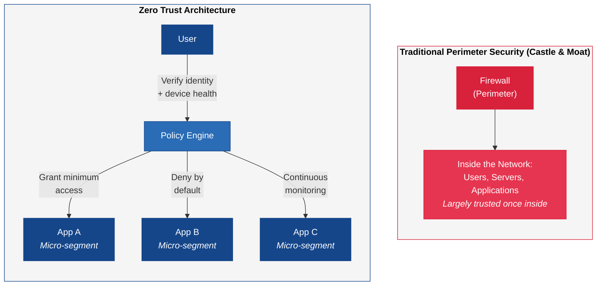
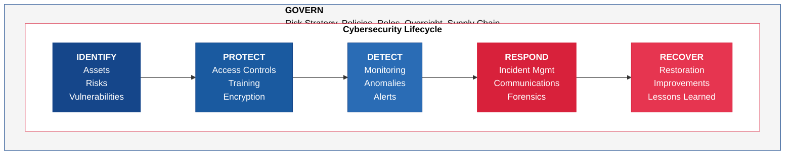

---
tags:
  - risk
  - security
  - compliance
  - governance
reading_time: 50
difficulty: Intermediate
---

# Cybersecurity for Managers

## Overview

Cybersecurity is no longer just an IT issue — it is a board-level business risk that directly affects shareholder value, regulatory standing, customer trust, and operational continuity. As organizations become more digital and data-driven, the attack surface expands and the consequences of a breach grow more severe. The average cost of a data breach exceeded $4.8 million in 2024, according to IBM's annual Cost of a Data Breach report, and the reputational damage can persist for years. For MBA graduates, cybersecurity is not a technical discipline to be delegated — it is a risk management challenge that requires strategic thinking, governance frameworks, and cross-functional collaboration.

Understanding cybersecurity at a managerial level means knowing how to ask the right questions, allocate resources wisely, interpret risk assessments, and fulfill your fiduciary obligations. Whether you lead a business unit, serve on a board, or manage a technology portfolio, you will be expected to engage meaningfully in cybersecurity discussions. The CISO can provide technical expertise, but the strategic decisions — how much risk to accept, how much to invest in security, how to respond when a breach occurs — are fundamentally business decisions that require business judgment.

This page provides the conceptual foundation you need to participate in those decisions. It covers the threat landscape, risk management frameworks, regulatory requirements, organizational structures, and governance responsibilities that define enterprise cybersecurity today. The goal is not to make you a security practitioner but to make you a more informed, effective, and accountable business leader.

???+ abstract "Executive Summary"
    **Reading time:** ~30 minutes | **Difficulty:** Intermediate

    - Cybersecurity is a **board-level business risk** — the average data breach now costs over $4.8 million, and SEC rules require public companies to disclose material incidents within four business days
    - The **NIST Cybersecurity Framework 2.0** (six functions: Govern, Identify, Protect, Detect, Respond, Recover) is the standard framework for organizing cybersecurity programs
    - **Regulatory compliance** (SOX, HIPAA, GDPR, PCI-DSS) sets a floor, not a ceiling — being compliant does not mean being secure
    - The **shared responsibility model** means cloud adoption shifts but does not eliminate security obligations
    - **Zero Trust architecture** ("never trust, always verify") has replaced traditional perimeter security as the dominant paradigm

!!! info "Why This Matters for MBA Students"

    Cybersecurity is one of the fastest-growing areas of enterprise risk, and business leaders are increasingly held personally accountable for cyber governance. Here is why this matters for your career:

    - **Board and executive accountability** — The SEC now requires public companies to disclose material cybersecurity incidents within four business days and to describe the board's oversight of cybersecurity risk in annual filings. Directors and officers who fail to exercise adequate oversight face personal liability.
    - **Business impact** — A major breach can wipe out billions in market capitalization overnight, trigger class-action lawsuits, and destroy years of customer trust. The Colonial Pipeline ransomware attack in 2021 shut down fuel distribution to the U.S. East Coast for six days.
    - **Strategic investment decisions** — Cybersecurity spending typically represents 5 to 15 percent of the total IT budget, but the question is not how much to spend — it is whether the spending is aligned with the organization's most critical risks. Business leaders must be able to evaluate whether security investments are delivering value.
    - **Regulatory complexity** — Depending on your industry, you may need to comply with SOX, HIPAA, GDPR, PCI-DSS, and numerous sector-specific regulations. Non-compliance carries significant financial penalties and reputational harm.
    - **Career readiness** — Whether you end up in consulting, general management, finance, or operations, every organization you work with will have cybersecurity on its risk register. Speaking fluently about cyber risk makes you a more credible and effective leader.

## Key Concepts

### The Threat Landscape

The cybersecurity threat landscape is the full range of potential and actual cyber threats facing an organization at any given time. Understanding this landscape is essential for making informed decisions about where to invest in security and how to prioritize risk mitigation. Threats come from a variety of sources — criminal organizations, nation-states, hacktivists, insiders, and even careless employees — and they evolve constantly as attackers develop new techniques and exploit new vulnerabilities.

The following table summarizes the most significant threat categories that business leaders should understand:

| Threat Category | Description | Business Impact | Example |
|----------------|-------------|-----------------|---------|
| **Phishing & Social Engineering** | Attackers manipulate people into revealing credentials, clicking malicious links, or transferring funds. Phishing is the most common initial attack vector. | Credential theft, fraudulent wire transfers, malware installation | CEO fraud emails directing finance staff to wire funds to attacker-controlled accounts |
| **Ransomware** | Malware that encrypts an organization's data and demands payment (typically in cryptocurrency) for the decryption key. Modern variants also exfiltrate data and threaten to publish it. | Operational shutdown, data loss, extortion payments, regulatory penalties | Colonial Pipeline paid $4.4 million in ransom after its pipeline operations were crippled |
| **Insider Threats** | Employees, contractors, or partners who intentionally or accidentally compromise security. Insiders have legitimate access, making their actions harder to detect. | Data theft, sabotage, intellectual property loss, compliance violations | An employee downloading customer databases before leaving to join a competitor |
| **Supply Chain Attacks** | Attackers compromise a trusted third-party vendor or software provider to gain access to the vendor's customers. These are particularly dangerous because they exploit trust relationships. | Widespread compromise of multiple organizations through a single attack vector | SolarWinds attack compromised 18,000 organizations through a tainted software update |
| **Advanced Persistent Threats (APTs)** | Sophisticated, long-term attacks typically conducted by nation-state actors who gain access and remain undetected for months or years, extracting valuable data. | Intellectual property theft, espionage, strategic intelligence loss | Chinese state-sponsored groups targeting defense contractors and technology firms |
| **Distributed Denial of Service (DDoS)** | Overwhelming an organization's systems with traffic to make them unavailable to legitimate users. | Revenue loss, customer frustration, operational disruption | Attackers taking down an e-commerce site during Black Friday |

#### The Human Factor

Despite billions spent on security technology, the human element remains the most exploited vulnerability. Verizon's annual Data Breach Investigations Report consistently finds that **the majority of breaches involve a human element** (Verizon, DBIR, 2024) — whether through phishing, stolen credentials, human error, or misuse. This is why cybersecurity is not purely a technology problem. Training, culture, policies, and organizational design are just as important as firewalls and encryption.

!!! question "Quick Check"
    - A board member argues the company should invest primarily in advanced threat detection technology. Given what you know about the human factor, how would you challenge or refine that recommendation?
    - Compare an insider threat to a supply chain attack. Which is harder for an organization to defend against, and what does that imply about where security investment should be directed?

### Cybersecurity Risk Management

Cybersecurity risk management applies the same principles used in enterprise risk management — identify risks, assess their likelihood and impact, decide how to respond, and monitor over time. The difference is that cyber risks are highly dynamic, technically complex, and can materialize at machine speed. An effective cyber risk management program translates technical vulnerabilities into business terms that executives and board members can understand and act upon.

#### Risk Assessment

A cybersecurity risk assessment identifies the organization's most valuable digital assets (known as the "crown jewels"), evaluates the threats and vulnerabilities that could compromise those assets, and estimates the potential business impact. The output is typically a risk register that prioritizes risks by severity and likelihood.

Key elements of a cybersecurity risk assessment include:

- **Asset inventory** — What data, systems, and processes are most critical to the business? Where are they located? Who has access?
- **Threat identification** — Which threat actors and attack methods are most relevant to the organization given its industry, geography, and technology profile?
- **Vulnerability assessment** — What weaknesses exist in the organization's people, processes, and technology that could be exploited?
- **Impact analysis** — What would be the financial, operational, reputational, and regulatory consequences if a specific risk materialized?
- **Likelihood estimation** — How probable is each risk given the current threat landscape and the organization's existing controls?

#### Risk Appetite and Risk Tolerance

**Risk appetite** is the broad level of risk an organization is willing to accept in pursuit of its strategic objectives. The board sets the risk appetite. **Risk tolerance** is the specific, measurable boundaries within which the organization operates. For example, a company might have a low risk appetite for data breaches affecting customer financial information but a moderate risk appetite for temporary service disruptions in non-critical systems.

Defining cyber risk appetite is a business decision, not a technical one. The CISO provides the risk analysis; the board and executive team decide how much risk to accept.

#### Risk Treatment Strategies

Once risks are identified and assessed, the organization must decide how to respond. There are four fundamental strategies:

| Strategy | Description | When to Use | Cybersecurity Example |
|----------|-------------|-------------|----------------------|
| **Mitigate** | Implement controls to reduce the likelihood or impact of the risk | When the risk can be reduced to an acceptable level at reasonable cost | Deploy multi-factor authentication to reduce credential theft risk |
| **Transfer** | Shift the financial impact of the risk to a third party | When residual risk remains significant even after mitigation | Purchase cyber insurance to cover breach-related costs |
| **Accept** | Acknowledge the risk and choose to take no additional action | When the cost of mitigation exceeds the potential impact, or the risk is within appetite | Accept the risk that a low-traffic internal wiki might experience brief downtime |
| **Avoid** | Eliminate the risk by removing the activity or asset that creates it | When the risk is unacceptable and cannot be adequately mitigated | Discontinue storing customer social security numbers if there is no legitimate business need |

In practice, organizations use a combination of all four strategies. The mix depends on the organization's risk appetite, regulatory requirements, and the cost-effectiveness of available controls.

!!! question "Quick Check"
    - Your CISO reports a newly discovered vulnerability in a legacy system that would cost $5 million to mitigate but carries an estimated annual loss exposure of $1.2 million. Using the four risk treatment strategies, which approach (or combination) would you recommend to the board, and how would you justify it?
    - How does the distinction between risk appetite (set by the board) and risk tolerance (operational boundaries) change who is accountable when a breach occurs?
    - A startup CEO says, "We accept all cyber risk — we are moving too fast to worry about security." Evaluate this position using the risk management concepts above.

### The NIST Cybersecurity Framework

The NIST Cybersecurity Framework (CSF), developed by the National Institute of Standards and Technology, is the most widely adopted cybersecurity framework in the United States and increasingly internationally. Originally published in 2014 and updated to version 2.0 in 2024, it provides a structured approach for organizations of any size or sector to understand, manage, and reduce cybersecurity risk.

The framework is organized around six core functions that represent the full lifecycle of cybersecurity risk management:

| Function | Purpose | Key Question | Example Activities |
|----------|---------|-------------|-------------------|
| **Govern** | Establish and monitor the organization's cybersecurity risk management strategy, expectations, and policy | *How is cybersecurity risk management governed?* | Define risk appetite, establish policies, assign roles and responsibilities, oversee supply chain risk |
| **Identify** | Understand the organization's assets, risks, and vulnerabilities to prioritize efforts | *What do we need to protect?* | Asset inventory, risk assessments, business environment analysis, supply chain mapping |
| **Protect** | Implement safeguards to ensure delivery of critical services | *How do we defend against threats?* | Access controls, encryption, security training, data protection, secure configuration |
| **Detect** | Develop and implement activities to identify cybersecurity events in a timely manner | *How do we know when something has gone wrong?* | Continuous monitoring, intrusion detection, log analysis, anomaly detection |
| **Respond** | Take action when a cybersecurity incident is detected | *What do we do when a breach occurs?* | Incident response planning, communications, forensic analysis, mitigation actions |
| **Recover** | Restore capabilities or services impaired by a cybersecurity incident | *How do we get back to normal?* | Recovery planning, system restoration, post-incident review, lessons learned |

!!! note "NIST CSF 2.0 — The Govern Function"
    The original NIST CSF (version 1.1) included only five functions: Identify, Protect, Detect, Respond, and Recover. Version 2.0, released in February 2024, added **Govern** as a sixth function that wraps around and informs the other five. This addition reflects the growing recognition that cybersecurity governance — including risk appetite, policies, roles, and oversight — is foundational to effective security. For MBA students, the Govern function is the most directly relevant because it addresses the strategic and organizational aspects of cybersecurity.

### Regulatory Compliance

Cybersecurity regulation has expanded dramatically over the past two decades, creating a complex web of requirements that vary by industry, geography, and the type of data an organization handles. For business leaders, understanding the regulatory landscape is essential because non-compliance carries significant financial penalties, legal liability, and reputational damage.

=== "SOX"

    **Sarbanes-Oxley Act (SOX)** — Enacted in 2002 after the Enron and WorldCom accounting scandals.

    **Applies to**: All publicly traded companies in the United States.

    **Cybersecurity relevance**: SOX requires that companies maintain effective internal controls over financial reporting. Because financial data is processed, stored, and transmitted by IT systems, IT controls are integral to SOX compliance. Section 404 requires management and external auditors to assess and report on the effectiveness of these controls annually.

    **Key requirements for IT**:

    - Access controls for financial systems (who can view and modify financial data)
    - Change management processes for systems that affect financial reporting
    - Audit trails and logging for financial transactions
    - Backup and recovery procedures for financial data
    - Segregation of duties in financial systems

    **Penalties**: Criminal penalties for executives who certify false financial statements. Civil penalties and SEC enforcement actions for control failures.

=== "HIPAA"

    **Health Insurance Portability and Accountability Act (HIPAA)** — Enacted in 1996, with the Security Rule finalized in 2003.

    **Applies to**: Healthcare providers, health plans, healthcare clearinghouses, and their business associates.

    **Cybersecurity relevance**: HIPAA's Security Rule establishes national standards for protecting electronic protected health information (ePHI). It requires administrative, physical, and technical safeguards to ensure the confidentiality, integrity, and availability of ePHI.

    **Key requirements**:

    - Risk analysis and risk management
    - Workforce security training
    - Access controls and audit controls
    - Transmission security (encryption)
    - Contingency planning (backup, disaster recovery, emergency mode)
    - Business associate agreements requiring third parties to protect ePHI

    **Penalties**: Tiered penalties ranging from $100 to $50,000 per violation, up to $1.5 million per year for each violation category. Criminal penalties for willful neglect.

=== "GDPR"

    **General Data Protection Regulation (GDPR)** — Enacted by the European Union in 2016, effective May 25, 2018.

    **Applies to**: Any organization that processes personal data of EU residents, regardless of where the organization is located. This means a U.S. company with European customers must comply.

    **Cybersecurity relevance**: GDPR requires organizations to implement "appropriate technical and organisational measures" to protect personal data. It establishes data subject rights (access, deletion, portability) and imposes strict breach notification requirements.

    **Key requirements**:

    - Data protection by design and by default
    - Mandatory Data Protection Impact Assessments for high-risk processing
    - Breach notification to supervisory authorities within 72 hours
    - Appointment of a Data Protection Officer (DPO) for certain organizations
    - Right to erasure ("right to be forgotten")
    - Cross-border data transfer restrictions

    **Penalties**: Up to 20 million euros or 4% of global annual turnover, whichever is higher. Meta was fined 1.2 billion euros in 2023 for GDPR violations related to data transfers (Irish Data Protection Commission, May 2023).

=== "PCI-DSS"

    **Payment Card Industry Data Security Standard (PCI-DSS)** — Created by the major payment card brands (Visa, Mastercard, American Express, Discover, JCB).

    **Applies to**: Any organization that stores, processes, or transmits cardholder data.

    **Cybersecurity relevance**: PCI-DSS is a detailed technical standard with 12 requirements organized into six control objectives. It prescribes specific security controls for protecting payment card data throughout its lifecycle.

    **Key requirements**:

    - Install and maintain network security controls
    - Apply secure configurations to all system components
    - Protect stored account data (encryption, masking, tokenization)
    - Encrypt transmission of cardholder data across open networks
    - Protect systems against malware and regularly update antivirus software
    - Restrict access to cardholder data on a need-to-know basis
    - Regularly test security systems and processes

    **Penalties**: Fines of $5,000 to $100,000 per month for non-compliance, assessed by payment card brands. Potential loss of the ability to process credit card transactions — a business-ending consequence for many retailers.

### The CISO's Role

The CISO is the senior executive responsible for establishing and maintaining the organization's cybersecurity strategy, architecture, and operations. The role has evolved significantly over the past decade — from a technical specialist buried deep in the IT organization to a strategic executive who reports to the CIO, the CEO, or in some cases directly to the board.

#### Organizational Positioning

Where the CISO sits in the organizational chart matters. It signals the organization's commitment to cybersecurity and affects the CISO's authority and independence:

| Reporting Structure | Advantages | Disadvantages |
|-------------------|------------|---------------|
| **CISO reports to CIO** | Close alignment with IT operations; efficient coordination on technology decisions | Potential conflict of interest — CIO may prioritize project delivery over security; CISO lacks independent voice |
| **CISO reports to CEO** | Direct access to the top; security is elevated as a business priority | May create tension with the CIO; requires CEO to engage deeply with security topics |
| **CISO reports to General Counsel / Chief Risk Officer** | Aligns security with legal and compliance functions; promotes independence from IT | May distance the CISO from technology operations and create coordination challenges |
| **CISO reports to the Board** | Maximum independence; strong governance signal | Unusual and may isolate the CISO from day-to-day operations |

Increasingly, best practice recommends that the CISO have a **dotted-line relationship to the board** regardless of the formal reporting structure, ensuring that the board receives unfiltered security assessments.

#### Security Operations Center (SOC)

The SOC is the centralized function responsible for continuously monitoring, detecting, analyzing, and responding to cybersecurity threats. Think of it as the air traffic control tower for cybersecurity. The SOC operates 24/7 in most large organizations and uses a combination of technology tools (security information and event management systems, intrusion detection systems, endpoint detection and response) and trained analysts to identify and respond to threats in real time.

For business leaders, the key questions about the SOC are:

- Is it staffed 24/7 or only during business hours? (Attackers do not observe business hours.)
- Is it operated in-house or outsourced to a managed security service provider?
- What is the average time to detect and respond to an incident?
- How does the SOC escalate critical incidents to business leadership?

#### Incident Response

An incident response plan is a documented, rehearsed playbook that defines how the organization will detect, contain, eradicate, and recover from a cybersecurity incident. The plan should address:

1. **Detection and analysis** — How incidents are identified, classified by severity, and escalated
2. **Containment** — Short-term actions to stop the spread of an attack (e.g., isolating affected systems)
3. **Eradication** — Removing the threat from the environment (e.g., eliminating malware, closing exploited vulnerabilities)
4. **Recovery** — Restoring affected systems and data from clean backups and returning to normal operations
5. **Post-incident review** — Analyzing what happened, what worked, what did not, and what changes are needed (commonly called a "lessons learned" or "after-action review")
6. **Communication** — Internal escalation, employee notification, customer notification, regulatory reporting, media response, and law enforcement coordination

!!! tip "Tabletop Exercises"
    One of the most valuable activities a business leader can participate in is a **tabletop exercise** — a facilitated, scenario-based walkthrough of a cybersecurity incident. The executive team gathers and works through a realistic scenario (e.g., "We just discovered that an attacker has been in our network for three months and has exfiltrated customer data"). The exercise tests decision-making, communication protocols, and organizational readiness without the pressure of an actual incident. Leading organizations conduct tabletop exercises at least annually.

### Board-Level Governance

Cybersecurity governance at the board level has shifted from optional to mandatory. Regulators, shareholders, and insurers expect boards to demonstrate active oversight of cybersecurity risk — not just delegate it to the CISO and hope for the best.

#### The Board's Responsibilities

Boards are not expected to become cybersecurity experts. They are expected to exercise the same duty of care for cyber risk that they apply to financial, operational, and strategic risks. Specific responsibilities include:

- **Understanding the risk** — Receiving regular briefings on the organization's cybersecurity risk profile, the threat landscape, and the effectiveness of security controls
- **Setting risk appetite** — Defining how much cyber risk the organization is willing to accept and ensuring that the CISO and management operate within those boundaries
- **Ensuring adequate resources** — Confirming that the cybersecurity program has sufficient budget, staffing, and authority to address identified risks
- **Overseeing incident preparedness** — Ensuring that an incident response plan exists, is tested regularly, and includes clear escalation protocols to the board
- **Monitoring compliance** — Verifying that the organization complies with applicable cybersecurity regulations and industry standards
- **Reviewing third-party risk** — Understanding how cybersecurity risk from vendors, suppliers, and partners is identified and managed

#### SEC Cybersecurity Disclosure Rules

In July 2023, the SEC adopted rules (effective December 2023) requiring public companies to:

1. **Disclose material cybersecurity incidents** on Form 8-K within four business days of determining that an incident is material
2. **Describe cybersecurity risk management, strategy, and governance** in annual Form 10-K filings, including whether and how the board oversees cybersecurity risk, and whether the company has a CISO or equivalent role

These rules fundamentally changed the governance landscape. Boards can no longer plausibly claim ignorance of their cybersecurity posture. The disclosure requirements create a public record of the organization's governance practices that analysts, investors, regulators, and plaintiffs' attorneys can scrutinize.

### Cyber Insurance

Cyber insurance (also called cyber liability insurance) is a risk transfer mechanism that helps organizations cover the financial costs associated with cybersecurity incidents. As cyber threats have grown in frequency and severity, cyber insurance has become an essential component of enterprise risk management.

#### What Cyber Insurance Covers

Typical cyber insurance policies cover two categories of losses:

**First-party coverage** (direct losses to the insured organization):

- Incident response and forensic investigation costs
- Business interruption losses
- Data recovery and system restoration costs
- Ransomware payment (where legal and within policy terms)
- Crisis communication and public relations expenses
- Notification costs (mailing breach notifications to affected individuals)
- Credit monitoring services for affected customers
- Regulatory fines and penalties (where insurable)

**Third-party coverage** (claims from others against the insured organization):

- Legal defense costs
- Settlements and judgments from lawsuits
- Regulatory defense costs
- Payment card industry fines and assessments
- Media liability (for breaches involving content or media)

#### The Evolving Insurance Market

The cyber insurance market has tightened significantly in recent years. Insurers are demanding higher security standards as a condition of coverage, and premiums have increased substantially. Many insurers now require organizations to demonstrate specific controls — such as multi-factor authentication, endpoint detection and response, and tested incident response plans — before they will issue or renew a policy. Organizations that cannot demonstrate basic security hygiene may find coverage unavailable at any price.

This dynamic creates a virtuous cycle: the process of applying for and maintaining cyber insurance forces organizations to improve their security posture, which in turn reduces risk for both the organization and the insurer.

### Privacy — A Distinct but Related Discipline

Privacy and security are related but fundamentally different disciplines. **Security** protects information from unauthorized access — it is about keeping data safe from breaches, theft, and compromise. **Privacy** governs the appropriate use and handling of personal information — it is about ensuring that data is collected, used, shared, and retained only in ways that individuals have consented to and that comply with applicable laws. An organization can have excellent security (no breaches) but poor privacy practices (collecting and sharing personal data without consent). Conversely, strong privacy policies are meaningless without the security controls to enforce them.

#### Privacy by Design

Privacy by Design (PbD) is a framework developed by Ann Cavoukian, the former Information and Privacy Commissioner of Ontario, that embeds privacy protections into the design of systems, processes, and business practices from the outset — rather than treating privacy as an afterthought or compliance checkbox. The framework is built on seven foundational principles:

1. **Proactive not reactive; preventive not remedial** — Anticipate and prevent privacy issues before they occur
2. **Privacy as the default setting** — Personal data is automatically protected; no action is required from the individual
3. **Privacy embedded into design** — Privacy is integral to the system architecture, not bolted on after the fact
4. **Full functionality — positive-sum, not zero-sum** — Accommodate both privacy and business objectives; reject false trade-offs
5. **End-to-end security — full lifecycle protection** — Data is protected from collection through deletion
6. **Visibility and transparency** — Operations are visible and subject to independent verification
7. **Respect for user privacy — keep it user-centric** — Empower individuals with strong privacy defaults, appropriate notice, and user-friendly options

Privacy by Design has been incorporated into GDPR (Article 25 requires "data protection by design and by default") and has become a best practice standard worldwide.

#### Data Subject Rights

Modern privacy regulations grant individuals specific rights over their personal data. These rights vary by regulation but share common themes:

| Right | GDPR | CCPA/CPRA | Description |
|-------|------|-----------|-------------|
| **Right to Access** | Yes | Yes | Individuals can request a copy of all personal data an organization holds about them |
| **Right to Deletion** | Yes ("right to be forgotten") | Yes | Individuals can request that their data be deleted, subject to certain exceptions |
| **Right to Portability** | Yes | Limited | Individuals can receive their data in a machine-readable format and transfer it to another organization |
| **Right to Opt-Out** | Consent-based (opt-in) | Yes (opt-out of sale) | GDPR requires affirmative consent for most processing; CCPA allows opt-out of data "sale" |
| **Right to Correction** | Yes | Yes | Individuals can request correction of inaccurate personal data |
| **Right to Restrict Processing** | Yes | No | Individuals can request limits on how their data is processed |
| **Right Against Automated Decisions** | Yes | Limited | Individuals have the right not to be subject to decisions based solely on automated processing, including profiling |

#### Privacy Impact Assessments

A Privacy Impact Assessment (PIA) — known as a Data Protection Impact Assessment (DPIA) under GDPR — is a structured process for evaluating the privacy risks of a new system, process, or technology initiative. PIAs are required under GDPR for processing that is "likely to result in a high risk" to individuals' rights, and they are considered best practice in all privacy-mature organizations. A PIA typically examines what data is collected, why, how it flows through systems, who has access, how long it is retained, and what safeguards are in place.

#### Privacy Leadership — CPO, CISO, and DPO

The organizational management of privacy has evolved significantly, creating distinct leadership roles:

- **Chief Privacy Officer (CPO)** — Responsible for the organization's overall privacy strategy, policies, and compliance. The CPO typically reports to the General Counsel or CEO and focuses on the legal, ethical, and business aspects of privacy.
- **CISO** — Responsible for protecting information from unauthorized access. The CISO focuses on security controls, threat management, and incident response. Privacy and security must collaborate closely, but their objectives are different.
- **Data Protection Officer (DPO)** — Required by GDPR for organizations that engage in large-scale systematic monitoring of individuals or process special categories of data. The DPO must be independent, have access to senior management, and cannot be penalized for performing their duties.

#### Cross-Border Data Transfers

In a globalized economy, personal data routinely crosses national borders — yet different jurisdictions have different privacy protections. Moving data from the EU to the US, for example, requires specific legal mechanisms because the EU considers US privacy protections inadequate:

- **Standard Contractual Clauses (SCCs)** — Pre-approved contract templates that impose GDPR-equivalent obligations on the data recipient
- **Adequacy Decisions** — The EU Commission can determine that a country provides adequate privacy protection, enabling free data transfers (Japan, UK, South Korea, and others have received adequacy decisions)
- **EU-US Data Privacy Framework** — A framework allowing certified US companies to receive EU personal data, replacing the invalidated Privacy Shield
- **Binding Corporate Rules (BCRs)** — Internal corporate policies approved by EU regulators for intra-group data transfers

For managers, cross-border data transfer is not just a legal technicality — it affects cloud architecture decisions (where to locate data), vendor selection (whether providers can guarantee data residency), and business strategy (which markets to enter).

### Cybersecurity Architecture for Managers

While cybersecurity architecture is implemented by technical teams, managers need to understand the foundational concepts to evaluate proposals, assess risk, and ask informed questions.

#### Defense in Depth

Defense in depth is a security strategy that deploys multiple layers of protection so that if one layer is breached, additional layers continue to protect the organization. Rather than relying on a single security control (like a firewall), defense in depth creates overlapping protections across the full technology stack:

| Layer | Controls | Purpose |
|-------|----------|---------|
| **Physical** | Building security, badge access, surveillance, secure data center facilities | Prevent physical access to hardware |
| **Network** | Firewalls, intrusion detection/prevention systems, network segmentation, DDoS protection | Control and monitor network traffic |
| **Endpoint** | Antivirus, endpoint detection and response (EDR), device encryption, patch management | Protect individual devices |
| **Application** | Secure coding practices, web application firewalls, input validation, authentication | Protect software from exploitation |
| **Data** | Encryption at rest and in transit, data loss prevention (DLP), access controls, tokenization | Protect the data itself regardless of where it resides |
| **Identity** | Multi-factor authentication, IAM, privileged access management, single sign-on | Ensure only authorized users access resources |
| **Human** | Security awareness training, phishing simulations, security culture programs | Reduce human-caused security incidents |

#### Zero Trust Architecture

Zero Trust has become the dominant security paradigm for modern enterprise architecture. Traditional security operated on a "castle and moat" model — a hardened perimeter protecting everything inside the network. Once inside the perimeter, users and devices were largely trusted. This model fails in a world of cloud computing, remote work, mobile devices, and supply chain interconnection — the perimeter has dissolved.

Zero Trust operates on the principle of **"never trust, always verify"**:

- **Verify explicitly** — Authenticate and authorize every access request based on all available data points (user identity, device health, location, behavior patterns)
- **Least-privilege access** — Grant only the minimum access necessary for the task at hand, for the minimum duration necessary
- **Assume breach** — Design systems assuming that attackers are already inside the network; limit blast radius through micro-segmentation

**Micro-segmentation** is a key Zero Trust technique that divides the network into small, isolated zones. Even if an attacker compromises one zone, they cannot move laterally to access other zones without passing through additional authentication and authorization checks. This dramatically limits the impact of a breach — instead of having access to the entire network, an attacker may be confined to a single application or service.

!!! question "Quick Check"
    - Your company currently relies on a traditional perimeter ("castle and moat") security model. An executive asks why the company should invest in migrating to Zero Trust when "we already have a firewall." How would you make the business case for the transition?
    - Consider the defense-in-depth layers listed above. If budget constraints forced you to prioritize investment in only two layers, which two would you choose for a company with a large remote workforce, and why?

#### Security Operations — SIEM, SOC, and Threat Intelligence

Modern cybersecurity operations rely on three interconnected capabilities:

- **SIEM (Security Information and Event Management)** — Technology platforms (e.g., Splunk, Microsoft Sentinel, IBM QRadar) that aggregate, correlate, and analyze security log data from across the enterprise. A SIEM ingests millions of events per day from firewalls, servers, applications, and endpoints, using rules and analytics to identify suspicious patterns.

- **SOC (Security Operations Center)** — The organizational function that staffs and operates cybersecurity monitoring and response, typically using SIEM as its primary tool. A mature SOC operates 24/7, employs tiered analysts (Tier 1 for initial triage, Tier 2 for investigation, Tier 3 for advanced threat hunting), and has documented procedures for escalation and incident response.

- **Threat Intelligence** — Information about current and emerging threats — attack techniques, malicious IP addresses, vulnerability disclosures, threat actor profiles — that helps the SOC focus its efforts on the most relevant risks. Threat intelligence can be sourced from government agencies (CISA, FBI), industry sharing groups (ISACs), commercial providers, and open-source intelligence.

#### Cybersecurity Analytics

Cybersecurity analytics — the application of data science and ML to security operations — is an emerging discipline that transforms how organizations detect and respond to threats. Traditional security monitoring relies on predefined rules ("alert if someone fails to log in five times in a row"). Cybersecurity analytics goes further:

- **Anomaly detection** — Identify unusual patterns of behavior that may indicate a compromise, even if no specific rule has been written for that attack pattern. For example, if an employee who normally accesses files during business hours in New York suddenly begins downloading large volumes of data at 3 AM from an IP address in Eastern Europe, an analytics system would flag this behavior.
- **User and Entity Behavior Analytics (UEBA)** — Build baseline behavioral profiles for users, devices, and applications, and alert when behavior deviates significantly from the baseline. UEBA is particularly effective at detecting insider threats and compromised credentials.
- **Automated threat correlation** — Combine weak signals from multiple sources (a failed login here, an unusual DNS query there, a suspicious file download elsewhere) into a coherent threat narrative that a human analyst can investigate efficiently.
- **Predictive threat modeling** — Use historical attack data to predict which systems are most likely to be targeted and prioritize defenses accordingly.

### Cyber Risk Quantification

Traditional cybersecurity risk assessments use qualitative scales (High / Medium / Low) that are difficult to translate into business terms. The **FAIR (Factor Analysis of Information Risk)** model provides a structured, quantitative approach to measuring cyber risk in financial terms — translating technical vulnerabilities into dollars of expected loss.

FAIR defines risk as the **probable frequency and probable magnitude of future loss**. It breaks risk analysis into component factors:

- **Loss Event Frequency** — How often a threat event is likely to occur (Threat Event Frequency × Vulnerability = Loss Event Frequency)
- **Loss Magnitude** — How much the organization would lose when a loss event occurs: Primary Loss (direct costs: response, recovery, fines) + Secondary Loss (indirect costs: reputation, customer churn, litigation)

For managers, FAIR's value is that it frames cybersecurity as a **financial risk** that can be compared directly with other business risks. Instead of telling the board "we have a HIGH risk of a data breach," a FAIR analysis might report: "We estimate a 15% probability of a material data breach in the next 12 months, with an expected loss range of $8-24 million, and a most likely loss of $14 million." This enables informed investment decisions: if a $2 million security investment reduces expected annual loss by $6 million, the business case is clear.

### The CISO's Cross-Functional Partnerships

Cybersecurity and risk management do not operate in isolation. The CISO's effectiveness depends on strong partnerships with other organizational functions — particularly legal, procurement, and the board.

#### CISO and General Counsel (Legal Department)

The partnership between the CISO and the General Counsel is one of the most critical relationships in enterprise risk management. These two executives share overlapping concerns — data protection, regulatory compliance, breach response, and third-party risk — but approach them from different perspectives. The CISO focuses on technical controls and operational security; the General Counsel focuses on legal obligations, liability exposure, and regulatory strategy.

**Key areas of collaboration:**

- **Breach response and disclosure** — When a breach occurs, the CISO leads the technical investigation while the General Counsel manages legal obligations: regulatory notification timelines (72 hours under GDPR, 4 business days for SEC materiality determination), customer notification requirements, attorney-client privilege considerations for forensic investigations, and law enforcement coordination. Establishing the General Counsel as the legal lead for breach response before an incident occurs is critical — decisions made under pressure during an active breach have lasting legal consequences.
- **Regulatory compliance strategy** — The General Counsel interprets regulatory requirements (GDPR, HIPAA, SOX, state privacy laws, SEC cybersecurity rules); the CISO translates those interpretations into technical controls and operational procedures. This requires ongoing dialogue, not just annual reviews, because the regulatory landscape evolves continuously.
- **Contract and vendor security** — The General Counsel drafts and negotiates security and data protection clauses in vendor contracts, business associate agreements, and data processing agreements. The CISO provides the technical requirements that these clauses must address: encryption standards, access controls, incident notification timelines, audit rights, and data return/destruction obligations.
- **Litigation support** — When cybersecurity incidents result in lawsuits or regulatory enforcement actions, the CISO provides technical evidence, expert testimony, and documentation of the organization's security posture. Evidence preservation and chain-of-custody procedures must be established in advance.
- **Attorney-client privilege** — Engaging external forensic investigators through the General Counsel's office (rather than through IT) can protect investigation findings under attorney-client privilege — a critical legal strategy that affects how breach investigations are structured.

!!! tip "Best Practice: Joint Tabletop Exercises"
    Leading organizations conduct breach response tabletop exercises that include both the CISO's team and the legal department. These exercises test the coordination between technical response and legal obligations, ensuring that the organization can meet notification deadlines, preserve evidence, maintain privilege, and communicate effectively with regulators — all while containing the technical threat.

#### CISO and Procurement / Contracts Department

The procurement and contracts function is a critical partner in managing third-party cybersecurity risk. Every vendor, supplier, cloud provider, and contractor that connects to your systems or handles your data represents a potential attack vector — as the SolarWinds and Target breaches demonstrated.

**Key areas of collaboration:**

- **Vendor security assessments** — The CISO's team evaluates the security posture of prospective vendors before contracts are signed. This typically involves security questionnaires, review of SOC 2 or ISO 27001 certifications, penetration test results, and assessment of the vendor's incident response capabilities. Procurement must build these assessments into the vendor selection process — not as an afterthought after a contract is awarded.
- **Security requirements in contracts** — Procurement works with the CISO to embed specific security requirements in vendor contracts: data encryption standards, access control requirements, breach notification obligations (typically 24-72 hours), right to audit, cyber insurance requirements, and data handling/destruction obligations at contract termination.
- **Ongoing vendor monitoring** — Security is not a one-time assessment. The CISO's team continuously monitors vendor security posture using threat intelligence feeds, security rating services (BitSight, SecurityScorecard), and periodic reassessment. Procurement manages the contractual remedies when vendors fall below acceptable security standards.
- **Supply chain risk tiering** — Not all vendors carry equal risk. The CISO and procurement collaborate to tier vendors by risk level: Tier 1 vendors (access to sensitive data or critical systems) receive the most rigorous security assessments and contractual controls; Tier 3 vendors (no data access, non-critical services) receive lighter requirements. This risk-based approach allocates security resources efficiently.

#### Board of Directors — Governance and Oversight

Board-level cybersecurity governance has evolved from optional briefings to mandatory oversight responsibilities. Regulators, shareholders, and insurers now expect boards to demonstrate active, informed engagement with cybersecurity risk.

**The evolution of board cyber governance:**

In the early 2000s, cybersecurity was rarely discussed at the board level. The CIO might mention security in passing during an annual IT update. Today, leading boards dedicate specific committee time (typically the Audit Committee or a dedicated Risk Committee) to cybersecurity, receive quarterly CISO briefings, and include cybersecurity expertise in their director composition.

This shift was driven by several forces:

- **Regulatory mandates** — The SEC's 2023 cybersecurity disclosure rules require public companies to describe how the board oversees cybersecurity risk. These disclosures are public, creating accountability and peer benchmarking.
- **Liability exposure** — Directors face derivative lawsuits and SEC enforcement when boards fail to exercise adequate cybersecurity oversight. The Caremark duty of oversight — a fiduciary obligation to monitor and manage key business risks — now explicitly extends to cybersecurity.
- **Insurance requirements** — Cyber insurers increasingly ask about board-level governance when underwriting policies and setting premiums. Boards that cannot demonstrate active oversight may face higher premiums or coverage limitations.
- **Shareholder expectations** — Institutional investors and proxy advisory firms evaluate cybersecurity governance as part of their risk assessment. ISS and Glass Lewis include cyber governance in their evaluation frameworks.

**What effective board governance looks like:**

| Governance Element | Description | Frequency |
|-------------------|-------------|-----------|
| **CISO briefings** | The CISO presents the organization's risk profile, threat landscape, key metrics (mean time to detect, patching compliance, phishing test results), and material incidents | Quarterly |
| **Risk appetite review** | The board reviews and affirms the organization's cyber risk appetite, ensuring it aligns with business strategy | Annually |
| **Incident response readiness** | The board reviews the incident response plan, including their own role in crisis communication and regulatory disclosure decisions | Annually |
| **Tabletop exercises** | Board members participate in a simulated breach scenario to test governance processes and decision-making | Annually |
| **Budget and investment review** | The board evaluates whether cybersecurity spending is adequate relative to the organization's risk profile and industry benchmarks | Annually |
| **Third-party risk oversight** | The board reviews the organization's vendor and supply chain risk management practices | Semi-annually |
| **Cyber insurance review** | The board reviews coverage adequacy, policy terms, and insurer requirements | Annually |

!!! note "Board Cyber Expertise"
    A growing trend is the inclusion of directors with cybersecurity or technology expertise. While not every board needs a former CISO, having at least one director who can critically evaluate security briefings, challenge assumptions, and ask informed follow-up questions significantly improves the quality of board oversight. Some institutional investors now include cyber expertise as a factor in their board composition evaluations.

## Frameworks & Models

### NIST Cybersecurity Framework — Visual Model

The following diagram illustrates the six core functions of NIST CSF 2.0 and how the Govern function provides the strategic foundation for the other five operational functions:

### Regulatory Comparison Matrix

The following table compares the major cybersecurity regulations across key dimensions that business leaders need to understand:

| Dimension | SOX | HIPAA | GDPR | PCI-DSS |
|-----------|-----|-------|------|---------|
| **Geographic Scope** | U.S. public companies | U.S. healthcare entities and business associates | Global (any org processing EU resident data) | Global (any org handling payment cards) |
| **Primary Focus** | Financial reporting controls | Protected health information | Personal data privacy | Payment card data security |
| **Breach Notification** | Disclosure via SEC filing if material | Within 60 days to HHS; individuals "without unreasonable delay" | Within 72 hours to supervisory authority | Within 72 hours to payment brands; "expeditiously" to affected individuals |
| **Maximum Financial Penalty** | Criminal penalties up to $5M and 20 years imprisonment | $1.5M per violation category per year | 4% of global annual turnover or 20M euros | $100K per month; potential loss of card processing ability |
| **Governance Requirements** | CEO/CFO must certify controls; audit committee oversight | Security Officer designation required | Data Protection Officer for certain organizations | Designated responsibility for cardholder data security |
| **Key IT Controls Required** | Access controls, change management, audit logging, segregation of duties | Risk analysis, encryption, access controls, audit controls, contingency planning | Data protection by design, impact assessments, cross-border transfer controls | Network security, encryption, vulnerability management, access controls, monitoring |
| **Audit/Assessment** | Annual external audit of internal controls (Section 404) | Risk analysis required; HHS audits | Data Protection Impact Assessments; supervisory authority audits | Annual assessments (self-assessment or QSA audit depending on volume) |
| **Industry** | Financial / public companies | Healthcare | All industries | Retail / any card-accepting business |

### Framework Comparison: Cybersecurity Approaches

=== "NIST CSF"

    **Developed by**: National Institute of Standards and Technology (U.S. Department of Commerce)

    **Current version**: CSF 2.0 (February 2024)

    **Approach**: Risk-based, outcome-oriented. Organized around six functions (Govern, Identify, Protect, Detect, Respond, Recover) with categories and subcategories that describe desired cybersecurity outcomes. Does not prescribe specific technologies or solutions.

    **Best for**: Organizations seeking a flexible, widely recognized framework that can be adapted to any size, industry, or risk profile. The de facto standard in the U.S.

    **Key strength**: The framework is voluntary, technology-neutral, and designed to complement (not replace) existing standards. Its tiered implementation model allows organizations to set target maturity levels appropriate to their risk.

=== "ISO 27001"

    **Developed by**: ISO and IEC

    **Current version**: ISO/IEC 27001:2022

    **Approach**: Standards-based, certifiable. Requires establishing an Information Security Management System (ISMS) with a defined scope, risk assessment methodology, and set of controls selected from Annex A (93 controls organized into four themes: organizational, people, physical, technological).

    **Best for**: Organizations that need a certifiable standard to demonstrate security posture to customers, partners, or regulators. Particularly valued in international business and supply chain contexts.

    **Key strength**: Third-party certification provides independent assurance. Widely recognized globally, making it a common requirement in vendor contracts and procurement processes.

=== "CIS Controls"

    **Developed by**: Center for Internet Security

    **Current version**: CIS Controls v8.1

    **Approach**: Prescriptive, prioritized. Provides 18 control categories with 153 specific safeguards organized into three implementation groups (IG1, IG2, IG3) based on organizational size and risk profile. IG1 defines the minimum set of controls every organization should implement.

    **Best for**: Organizations looking for concrete, actionable security controls with clear prioritization. Especially useful for organizations starting their cybersecurity journey or those with limited resources.

    **Key strength**: Highly prescriptive — tells you exactly what to do and in what order. The implementation groups make it accessible to organizations at any maturity level.

## Real-World Applications

### Example 1: SolarWinds Supply Chain Attack (2020)

In December 2020, cybersecurity firm FireEye discovered that SolarWinds, a major provider of IT management software, had been compromised by a sophisticated nation-state threat actor (later attributed to Russian intelligence). The attackers inserted malicious code into SolarWinds' Orion software build process, and the tainted update was distributed to approximately 18,000 organizations — including U.S. government agencies, Fortune 500 companies, and critical infrastructure operators.

**What happened**: The attackers gained access to SolarWinds' software development environment and inserted a backdoor (called SUNBURST) into the Orion software update. When customers installed the routine update, they unknowingly installed the backdoor, giving the attackers access to their networks. The attackers then used this access to move laterally within targeted organizations, accessing emails, documents, and sensitive systems. The attack went undetected for approximately nine months.

**Business and governance lessons**:

- **Supply chain risk is systemic** — Organizations trusted SolarWinds because it was a reputable vendor. This illustrates that cybersecurity risk extends far beyond your own perimeter. The NIST CSF Govern and Identify functions explicitly address supply chain risk management for this reason.
- **Detection capabilities matter** — The attack was discovered not by any of the 18,000 affected organizations' internal teams, but by a third party (FireEye). This underscores the importance of the Detect function and investing in advanced monitoring capabilities.
- **Board oversight is essential** — SolarWinds' board faced intense scrutiny about what they knew, when they knew it, and what oversight mechanisms were in place. The incident accelerated regulatory demands for board-level cybersecurity governance.
- **Incident response must be pre-planned** — Organizations that had tested incident response plans were able to assess their exposure, contain the threat, and communicate with stakeholders far more effectively than those without plans.

### Example 2: Colonial Pipeline Ransomware Attack (2021)

In May 2021, the DarkSide ransomware group compromised Colonial Pipeline, the operator of the largest refined-products pipeline in the United States, which transports approximately 45% of all fuel consumed on the East Coast. The attack forced Colonial Pipeline to shut down its pipeline operations for six days, triggering fuel shortages, panic buying, and gasoline price spikes across the southeastern United States.

**What happened**: The attackers gained initial access through a single compromised password on a legacy VPN account that did not have multi-factor authentication enabled. Once inside, they deployed ransomware that encrypted critical business systems. Although the ransomware did not directly affect the pipeline's operational technology (OT) systems, Colonial shut down the pipeline as a precaution because it could not bill customers or monitor pipeline operations. The company paid a $4.4 million ransom (of which the FBI later recovered approximately $2.3 million).

**Business and governance lessons**:

- **Basic controls prevent catastrophic outcomes** — The attack succeeded because a single account lacked multi-factor authentication. This is a fundamental, low-cost control. The CIS Controls list multi-factor authentication as an IG1 (basic) safeguard.
- **Business decisions drive operational impact** — The pipeline itself was not attacked. The decision to shut it down was a business decision driven by the inability to operate billing and monitoring systems. This highlights the interdependence of IT and operational systems.
- **Ransomware is a business continuity issue** — The attack did not just affect IT — it disrupted fuel supply for 50 million people. Boards must ensure that cyber risk assessments consider cascading operational and societal impacts.
- **Regulatory consequences follow** — Following the attack, the Transportation Security Administration (TSA) issued emergency security directives requiring pipeline operators to implement specific cybersecurity measures, including incident reporting, cybersecurity assessments, and implementation of cybersecurity plans. What had been voluntary became mandatory.
- **Cyber insurance and risk transfer** — Colonial Pipeline's experience highlighted both the value and limitations of cyber insurance. Insurance can help cover financial losses, but it cannot restore public trust or prevent regulatory action.

### Example 3: A Retailer's GDPR Compliance Journey

A U.S.-based global retailer with significant European operations faced a transformative challenge when GDPR went into effect in May 2018. The company had customer data spread across dozens of legacy systems, no unified data inventory, and marketing practices that relied heavily on customer data collected without the explicit, granular consent GDPR requires.

**The compliance journey**:

- **Phase 1 — Assessment and gap analysis** (6 months): The company conducted a comprehensive data mapping exercise to identify where personal data of EU residents was stored, processed, and transmitted. They discovered personal data in 47 different systems, many of which the IT department did not even know existed (a shadow IT problem). A gap analysis against GDPR requirements identified 83 discrete compliance gaps.
- **Phase 2 — Governance and organizational design** (3 months): The company appointed a Data Protection Officer, established a cross-functional privacy governance committee (including legal, IT, marketing, and operations), and defined the CISO's role in ensuring technical and organizational measures met GDPR's "appropriate security" standard. The board's audit committee added GDPR compliance to its quarterly review agenda.
- **Phase 3 — Remediation and implementation** (12 months): The company redesigned its consent management system, implemented data subject access request workflows, deployed encryption for personal data at rest and in transit, established data retention policies and automated deletion processes, and revised all vendor contracts to include required data processing agreements.
- **Phase 4 — Ongoing monitoring and improvement** (continuous): The company implemented a privacy impact assessment process for new projects, conducted regular privacy audits, and established metrics for the board — including the number of data subject requests received and processed, consent rates, and the results of privacy impact assessments.

**Business lessons**:

- **Privacy compliance is a business transformation** — GDPR compliance required changes across marketing, IT, legal, HR, and operations. It was not an IT project — it was an enterprise-wide initiative that touched every function.
- **Data visibility is foundational** — The company could not comply with GDPR until it understood where personal data existed. The data mapping exercise (aligned with NIST CSF's Identify function) was the essential first step.
- **Compliance creates competitive advantage** — After achieving compliance, the company used its privacy practices as a marketing differentiator, emphasizing customer trust and data stewardship. Customer surveys showed a measurable increase in brand trust among European consumers.
- **The cost of non-compliance dwarfs the cost of compliance** — The company invested approximately $14 million in its GDPR compliance program. The maximum GDPR fine for a company of its size would have exceeded $400 million. Beyond fines, a major privacy violation could have devastated the brand.

## Common Pitfalls

!!! warning "Treating Cybersecurity as Purely a Technology Problem"
    One of the most common and dangerous misconceptions is that cybersecurity can be solved by buying the right technology. Organizations spend millions on firewalls, intrusion detection systems, and security software while neglecting the people and process dimensions that account for the majority of breaches. A well-funded security operations center is ineffective if employees click on phishing emails, if access controls are poorly managed, or if incident response plans are untested. Cybersecurity requires a balanced investment in technology, people (training, awareness, staffing), and processes (policies, procedures, governance).

!!! warning "Compliance Equals Security"
    Passing an audit or achieving regulatory compliance does not mean the organization is secure. Compliance frameworks set a floor — a minimum standard — but they cannot anticipate every threat or address every vulnerability. Many organizations that suffered major breaches were fully compliant with applicable regulations at the time of the attack. Target was PCI-DSS compliant when its 2013 breach exposed 40 million payment card numbers. Compliance is necessary but not sufficient. Security requires continuous vigilance, threat intelligence, and adaptive defenses that go beyond checklist compliance.

!!! warning "Underinvesting in Incident Response"
    Many organizations invest heavily in prevention (Protect) and detection (Detect) but underinvest in response (Respond) and recovery (Recover). The assumption is that good defenses will prevent all breaches. In reality, no defense is impenetrable. Organizations that lack a tested, well-rehearsed incident response plan will make costly mistakes under the pressure of an actual incident — delayed notifications, poor communication, inconsistent decision-making, and prolonged recovery times. The time to discover your incident response plan has gaps is during a tabletop exercise, not during an actual breach.

!!! warning "Ignoring Third-Party and Supply Chain Risk"
    Organizations often focus their security efforts on their own systems while paying insufficient attention to the risks introduced by vendors, suppliers, cloud providers, and other third parties. The SolarWinds attack demonstrated that a single compromised vendor can affect thousands of organizations. Effective cybersecurity risk management must extend beyond the organizational perimeter to include vendor security assessments, contractual security requirements, continuous monitoring of third-party risk, and supply chain risk governance. If your most critical systems run on a vendor's platform, that vendor's security posture is your security posture.

## Discussion Questions

1. **Risk Appetite and Resource Allocation**: You are the CFO of a mid-size financial services firm. The CISO is requesting a 40% increase in the cybersecurity budget, citing a recent industry-wide increase in ransomware attacks targeting financial institutions. The CEO is skeptical, arguing that the company has never experienced a significant breach. Using the concepts of risk appetite, risk assessment, and the NIST CSF, how would you frame this decision for the board? What information would you need to make an informed recommendation?

2. **Regulatory Strategy and Competitive Advantage**: Your company, a U.S.-based healthcare technology startup, is expanding into the European market. You will need to comply with both HIPAA (for your U.S. healthcare customers) and GDPR (for your European operations). A board member suggests hiring separate compliance teams for each regulation to avoid confusion. Another suggests a unified approach. What are the trade-offs, and how would you structure the compliance program? Could strong privacy and security practices become a competitive differentiator rather than just a cost center?

3. **Board Governance and Incident Response**: Imagine you are a newly appointed independent director on the board of a publicly traded retail company. During your first audit committee meeting, you ask about the company's cybersecurity posture. The CIO assures you that "we have never had a breach" and that the company is "fully compliant with PCI-DSS." Drawing on the concepts in this chapter — particularly the distinction between compliance and security, the SEC disclosure rules, and the board's governance responsibilities — what follow-up questions would you ask, and what governance mechanisms would you want to see in place?

## Key Takeaways

- **Cybersecurity is a business risk, not a technology problem.** The most consequential cybersecurity decisions — risk appetite, investment priorities, incident response strategy, regulatory compliance — are business decisions that require business judgment.
- **The threat landscape is dynamic and adversarial.** Phishing, ransomware, insider threats, and supply chain attacks are the most significant categories. The human element remains the most exploited vulnerability.
- **Risk management follows a structured process**: identify assets and threats, assess likelihood and impact, choose a treatment strategy (mitigate, transfer, accept, avoid), and monitor continuously.
- **The NIST CSF provides the standard framework** with six functions — Govern, Identify, Protect, Detect, Respond, Recover — that cover the full lifecycle of cybersecurity risk management.
- **Regulatory compliance is necessary but not sufficient.** SOX, HIPAA, GDPR, and PCI-DSS set minimum standards, but passing an audit does not mean the organization is secure. Security requires continuous effort beyond compliance.
- **The CISO is a strategic executive**, not just a technical manager. Where the CISO sits in the organization, what authority they have, and whether they have a path to the board all signal the organization's commitment to security.
- **Boards are accountable for cybersecurity oversight.** SEC rules require disclosure of cybersecurity governance practices and material incidents. Directors must demonstrate active, informed oversight.
- **Cyber insurance is an important risk transfer tool**, but the insurance market increasingly requires organizations to demonstrate strong security controls as a precondition for coverage.
- **Incident response must be planned and rehearsed** before an incident occurs. Tabletop exercises are one of the most effective ways to test organizational readiness.
- **Third-party and supply chain risk** is one of the most underestimated dimensions of cybersecurity. Your security is only as strong as the weakest link in your supply chain.

## Related Topics

- [IT Governance Frameworks](../governance/frameworks.md) — COBIT governance objectives for security and compliance management
- [C-Suite IT Leadership Roles](../governance/c-suite-roles.md) — The CISO role, reporting structure, and its relationship to other IT executives
- [Data Governance & Analytics](data-governance.md) — Data classification, privacy, and the governance foundation for security
- [Shadow IT](shadow-it.md) — Unsanctioned technology as a source of cybersecurity risk

---

## Further Reading

- **National Institute of Standards and Technology.** *NIST Cybersecurity Framework 2.0.* NIST, 2024. The authoritative source for the CSF, available at [nist.gov/cyberframework](https://www.nist.gov/cyberframework). Essential reading for understanding the framework's structure and implementation guidance.
- **IBM Security.** *Cost of a Data Breach Report 2024.* IBM, 2024. Annual report providing quantitative data on breach costs by industry, geography, and breach characteristics. Useful for making the business case for security investment.
- **Verizon.** *Data Breach Investigations Report (DBIR).* Published annually. The most comprehensive empirical analysis of real-world breaches, including attack patterns, threat actors, and industry-specific trends. Available at [verizon.com/dbir](https://www.verizon.com/business/resources/reports/dbir/).
- **U.S. Securities and Exchange Commission.** *Cybersecurity Risk Management, Strategy, Governance, and Incident Disclosure.* Final Rule, July 2023. The SEC rule text that defines public company disclosure requirements for cybersecurity incidents and governance.
- **Center for Internet Security.** *CIS Critical Security Controls v8.1.* CIS, 2024. A prioritized, prescriptive set of cybersecurity controls, available at [cisecurity.org](https://www.cisecurity.org/controls). Particularly useful for understanding what "good security hygiene" looks like in practice.
- **Solove, Daniel J., and Paul M. Schwartz.** *Information Privacy Law.* 7th ed., Wolters Kluwer, 2021. A comprehensive legal text covering U.S. and international privacy and data security law, useful for understanding the regulatory landscape in greater depth.
- **Kaplan, James M., Tucker Bailey, and Chris Rezek.** *Beyond Cybersecurity: Protecting Your Digital Business.* Wiley, 2015. A McKinsey-authored book that frames cybersecurity as a business issue and provides a management-oriented perspective on building resilient organizations.
- **Cybersecurity & Privacy Reference Links**:
    - [NIST Cybersecurity Framework 2.0](https://www.nist.gov/cyberframework) — The authoritative CSF documentation
    - [OWASP Top 10](https://owasp.org/www-project-top-ten/) — Top web application security risks
    - [CISA Cybersecurity Resources](https://www.cisa.gov/cybersecurity) — U.S. government cybersecurity guidance
    - [IAPP Privacy Resources](https://iapp.org/resources/) — International Association of Privacy Professionals
    - [ENISA Cybersecurity Resources](https://www.enisa.europa.eu/) — EU Agency for Cybersecurity
    - [FAIR Institute](https://www.fairinstitute.org/) — Resources for quantitative cyber risk analysis
- **ITEC-617 Course Textbook**: See the assigned readings on IT risk management and cybersecurity for additional context on how these concepts apply in enterprise settings.
