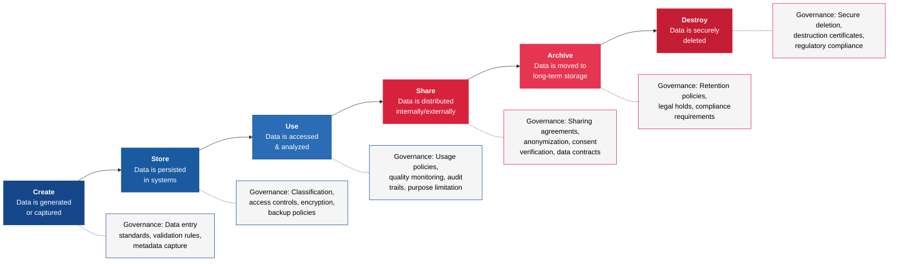

---
tags:
  - risk
  - data
  - governance
  - analytics
reading_time: 35
difficulty: Intermediate
---

# Data Governance & Analytics

## Overview

Data governance establishes the policies, procedures, roles, and standards that ensure an organization's data is accurate, consistent, secure, and available to the people who need it. In the same way that financial governance ensures the integrity of an organization's financial reporting, data governance ensures the integrity of its information assets. Without it, organizations find themselves making critical decisions based on inconsistent numbers, violating privacy regulations because no one owns the data, and spending millions to integrate systems that define "customer" or "product" in fundamentally different ways.

The business case for data governance has never been stronger. Organizations today collect and process more data than at any point in history — customer transactions, sensor data from IoT devices, social media interactions, supply chain telemetry, employee productivity metrics, and much more. This data fuels BI dashboards, ML models, predictive analytics, and increasingly, AI-driven automation. But the value of all these capabilities depends entirely on the quality, consistency, and trustworthiness of the underlying data. The principle is straightforward: **garbage in, garbage out**. The most sophisticated analytics platform in the world produces misleading results if it is fed inaccurate, incomplete, or inconsistent data.

For MBA students, data governance is essential knowledge because it sits at the intersection of IT strategy, risk management, regulatory compliance, and business performance. Every business function — finance, marketing, operations, HR, supply chain — depends on trusted data to make decisions. As a future business leader, you will be a **data consumer**, a **data producer**, and increasingly a **data decision-maker**. Understanding how data is governed, why data quality matters, and how organizations build analytics capabilities will make you a more effective leader in any role.

!!! info "Why This Matters for MBA Students"

    Data governance is not a technical backwater — it is a strategic capability that directly affects your ability to lead effectively. Here is why it matters for your career:

    - **Every major business decision relies on data.** Whether you are evaluating a market entry, sizing a customer segment, forecasting revenue, or measuring operational efficiency, the quality of your decision depends on the quality of your data. If you do not understand where your data comes from and how it is governed, you cannot assess whether your analysis is trustworthy.
    - **Regulatory compliance is a board-level concern.** GDPR, CCPA, HIPAA, and SOX all impose requirements on how organizations collect, store, process, and share data. Non-compliance carries severe financial penalties and reputational damage. Business leaders share accountability for data compliance — it is not something you can delegate entirely to IT.
    - **Data is a strategic asset — and a liability.** Well-governed data enables competitive advantages through better analytics, personalization, and operational efficiency. Poorly governed data creates risk: inaccurate reporting, failed integrations, privacy breaches, and biased AI systems.
    - **You will sit at the table when data decisions are made.** CDO roles are now common in the C-suite. Data governance councils include business leaders, not just technologists. You need the vocabulary and concepts to participate meaningfully in these conversations.

## Key Concepts

### Data Governance Frameworks

A data governance framework defines **who** is responsible for data, **what** policies and standards apply, and **how** the organization monitors compliance and resolves data-related issues. It is the organizational structure that turns data governance from a good intention into a functioning capability.

#### Key Roles

Effective data governance requires clearly defined roles with specific accountabilities. The most common roles are:

| Role | Who Fills It | Responsibilities |
|------|-------------|-----------------|
| **Data Owner** | Senior business leader (VP, Director) | Has ultimate accountability for a specific data domain (e.g., customer data, financial data, product data). Sets policies for how that data can be used, who can access it, and what quality standards apply. Does **not** manage the data day-to-day. |
| **Data Steward** | Business analyst or subject matter expert | Serves as the hands-on caretaker of data within a domain. Defines data definitions and business rules, monitors data quality, resolves data issues, and ensures compliance with the data owner's policies. The steward is the bridge between business needs and technical implementation. |
| **Data Custodian** | IT professional (DBA, data engineer) | Responsible for the technical management of data — storage, security, backup, access controls, and infrastructure. Implements the policies set by the data owner and enforced by the data steward. |
| **Data Consumer** | Any business user | Uses data to make decisions, generate reports, or perform analysis. Consumers have a responsibility to report data quality issues and to use data in accordance with governance policies. |
| **CDO** | C-suite executive | Provides executive leadership for the organization's overall data strategy, governance, and analytics capabilities. Champions data as a strategic asset at the board and executive committee level. |

A useful analogy: think of the data owner as the **landlord** who sets the rules for a property, the data steward as the **property manager** who enforces the rules and handles day-to-day issues, the data custodian as the **maintenance crew** who keeps the physical property in good condition, and the data consumer as the **tenant** who uses the property and is expected to follow the rules.

#### Governance Bodies

Most organizations establish formal governance bodies to coordinate data governance activities:

- **Data Governance Council** — A cross-functional body of senior leaders (data owners, the CDO, and representatives from legal, compliance, IT, and key business units) that sets data strategy, approves policies, resolves cross-domain disputes, and monitors governance effectiveness. This council typically meets monthly or quarterly.
- **Data Stewardship Working Groups** — Domain-specific teams of data stewards who work on operational data governance tasks: defining data standards, resolving quality issues, managing metadata, and coordinating across systems.
- **Executive Sponsor** — Typically the CDO, CIO, or CFO, this individual ensures that data governance has the organizational authority and budget to succeed. Without executive sponsorship, governance programs are routinely deprioritized in favor of short-term projects.

#### Policies and Standards

Data governance policies formalize the rules that the organization follows regarding its data. Common policy areas include:

- **Data classification** — Categorizing data by sensitivity level (public, internal, confidential, restricted) to determine appropriate handling, storage, and access controls
- **Data retention** — How long different types of data must be kept and when they must be deleted, driven by legal requirements and business needs
- **Data access** — Who is authorized to view, modify, or share specific data, enforced through role-based access controls
- **Data quality** — Minimum standards for accuracy, completeness, and timeliness, with defined processes for monitoring and remediation
- **Data privacy** — How personal data is collected, used, shared, and protected in compliance with GDPR, CCPA, HIPAA, and other regulations

!!! question "Quick Check"
    - Using the landlord/property manager/maintenance crew/tenant analogy, explain why a data governance failure is most likely when one of these roles is left unfilled. Which missing role would cause the most damage in a regulated industry like healthcare?
    - Your company has a Data Governance Council that meets quarterly but no dedicated data stewards. What types of data problems would you expect to see, and why?

### Data Quality

Data quality refers to the fitness of data for its intended use. High-quality data is reliable enough to support confident decision-making; low-quality data leads to flawed analysis, operational errors, and eroded trust in the organization's information systems.

#### The Six Dimensions of Data Quality

Data quality is measured across six dimensions, each addressing a different aspect of fitness for use:

| Dimension | Definition | Example of Poor Quality |
|-----------|-----------|------------------------|
| **Accuracy** | Data correctly represents the real-world entity or event it describes | A customer's address is listed as "123 Main St" when they actually live at "321 Main St" |
| **Completeness** | All required data values are present; no critical fields are missing | A sales record has the transaction amount but no customer ID, making it impossible to attribute the sale |
| **Timeliness** | Data is available when needed and reflects the current state of the real world | An inventory system shows 500 units in stock, but the data was last updated three days ago and 200 units have since shipped |
| **Consistency** | The same data does not conflict across different systems or records | The CRM system lists a customer as "Acme Corp" while the billing system lists them as "ACME Corporation" and the ERP lists "Acme Co." |
| **Validity** | Data conforms to defined formats, ranges, and business rules | A date-of-birth field contains "13/32/1990" — a date that cannot exist |
| **Uniqueness** | Each real-world entity is represented only once in the dataset | A customer appears three times in the database with slightly different spellings of their name, creating duplicate records |

#### The Cost of Poor Data Quality

The financial impact of poor data quality is substantial and well-documented. Gartner has estimated that poor data quality costs organizations an average of **$12.9 million per year**. IBM has reported that the annual cost of poor data quality to the US economy exceeds **$3 trillion**. These costs manifest in many ways:

- **Operational inefficiency** — Employees spend time manually correcting data, reconciling conflicting reports, and working around system limitations. Studies suggest that knowledge workers spend **up to 50% of their time** dealing with data quality issues — finding data, correcting errors, and seeking confirmation that their numbers are right.
- **Bad decisions** — Inaccurate data leads to flawed analysis, which leads to poor strategic and operational decisions. A marketing team that targets the wrong customer segments due to dirty data wastes its budget. A finance team that reports incorrect revenue figures faces regulatory consequences.
- **Failed projects** — System integration projects, CRM implementations, and analytics initiatives frequently fail or overrun budgets because of unexpected data quality problems. Data migration is often the most expensive and time-consuming part of any major IT project.
- **Compliance violations** — Inaccurate or incomplete records can result in regulatory penalties. Under GDPR, organizations can be fined up to 4% of global annual revenue for violations related to personal data handling.
- **Lost revenue** — Duplicate customer records lead to redundant marketing, missed cross-selling opportunities, and poor customer experiences.

!!! question "Quick Check"
    - A CFO argues that the company's data is "good enough" because financial reports have always been accepted by auditors. Using the six dimensions of data quality, identify two dimensions that might still be failing even when accuracy appears acceptable.
    - If your organization spends $12 million annually on the hidden costs of poor data quality, but a data quality remediation program costs $3 million per year, what additional factors beyond ROI should influence the decision to invest?

### Master Data Management (MDM)

MDM is a discipline that defines and manages an organization's critical data entities — such as customers, products, employees, suppliers, and locations — to ensure there is a **single, consistent, authoritative version of each entity** across all systems. This authoritative version is known as the **golden record**.

#### Why MDM Matters

Consider a large organization with separate systems for sales (CRM), finance (ERP), marketing (marketing automation), and customer service (help desk). Each system maintains its own record of "customer." Without MDM:

- The CRM might list "IBM" as a customer
- The ERP might have "International Business Machines Corp."
- The marketing system might show "I.B.M."
- The help desk might have separate entries for different divisions: "IBM Cloud," "IBM Consulting," "IBM Research"

These all refer to the same organization, but the systems cannot connect them. The result: the CFO cannot answer the simple question, "How much total revenue do we generate from IBM?" Each system gives a different number.

MDM solves this by creating a single master record — the golden record — that all systems reference as the authoritative source. When any system needs customer information, it draws from (or syncs with) the master data, ensuring consistency across the enterprise.

#### Key MDM Concepts

- **Golden Record** — The single, best-available version of a data entity, assembled by merging and reconciling data from multiple source systems. Creating the golden record requires data matching, deduplication, and survivorship rules (which source system's value "wins" when there are conflicts).
- **Data Deduplication** — The process of identifying and merging duplicate records. This requires sophisticated matching algorithms because duplicates are rarely exact — "John Smith" at "123 Main Street" and "J. Smith" at "123 Main St." may be the same person.
- **Data Matching** — Techniques used to determine whether records from different systems refer to the same real-world entity. Matching can use deterministic rules (exact matches on specific fields) or probabilistic methods (scoring similarity across multiple fields).
- **MDM Hub** — A central system or platform that stores and manages master data and distributes it to operational systems. Leading MDM platforms include Informatica MDM, IBM InfoSphere MDM, and SAP Master Data Governance.
- **Data Domains** — The categories of master data an organization manages. Common domains include customer, product, supplier, employee, and location data. Most organizations start their MDM program with one or two critical domains and expand over time.

#### MDM Implementation Styles

| Style | Description | Best For |
|-------|------------|----------|
| **Registry** | The MDM hub maintains a central index that links records across systems but does not store the actual data. Each system retains its own copy. | Organizations that cannot easily change existing systems; quick wins |
| **Consolidation** | Data from source systems is copied into the MDM hub for cleansing, matching, and analysis, but the hub does not feed data back to the source systems. | Analytics and reporting use cases; building a single view of the customer for BI |
| **Coexistence** | The MDM hub and source systems both maintain data, synchronizing changes bidirectionally. | Organizations that need a single source of truth but also need source systems to operate independently |
| **Centralized** | The MDM hub is the sole system of record. All data creation and changes occur in the hub and are distributed to downstream systems. | New data domains with no existing systems; maximum consistency |

### Business Intelligence

BI encompasses the technologies, practices, and strategies used to collect, integrate, analyze, and present business data. The goal of BI is to transform raw data into actionable information that supports better business decisions — from executive strategy sessions to daily operational management.

#### The BI Architecture

A typical BI architecture consists of several interconnected layers:

```mermaid
graph LR
    subgraph SOURCES["<b>Source Systems</b>"]
        direction TB
        S1["ERP"]
        S2["CRM"]
        S3["Web Analytics"]
        S4["External Data"]
    end

    subgraph INTEGRATION["<b>Integration Layer</b>"]
        direction TB
        ETL1["ETL / ELT<br/>Extract, Transform, Load"]
    end

    subgraph STORAGE["<b>Storage Layer</b>"]
        direction TB
        DW["Data Warehouse"]
        DL["Data Lake"]
        DM["Data Marts"]
    end

    subgraph ANALYTICS["<b>Analytics & Presentation</b>"]
        direction TB
        DASH["Dashboards &<br/>Reports"]
        SS["Self-Service<br/>Analytics"]
        ADV["Advanced Analytics<br/>& ML"]
    end

    SOURCES --> INTEGRATION --> STORAGE --> ANALYTICS

    style SOURCES fill:#f5f5f5,stroke:#15468A,color:#000000
    style INTEGRATION fill:#f5f5f5,stroke:#15468A,color:#000000
    style STORAGE fill:#f5f5f5,stroke:#15468A,color:#000000
    style ANALYTICS fill:#f5f5f5,stroke:#15468A,color:#000000
    style S1 fill:#15468A,stroke:#15468A,color:#ffffff
    style S2 fill:#15468A,stroke:#15468A,color:#ffffff
    style S3 fill:#15468A,stroke:#15468A,color:#ffffff
    style S4 fill:#15468A,stroke:#15468A,color:#ffffff
    style ETL1 fill:#2a6cb5,stroke:#15468A,color:#ffffff
    style DW fill:#D8213B,stroke:#D8213B,color:#ffffff
    style DL fill:#D8213B,stroke:#D8213B,color:#ffffff
    style DM fill:#D8213B,stroke:#D8213B,color:#ffffff
    style DASH fill:#e63550,stroke:#D8213B,color:#ffffff
    style SS fill:#e63550,stroke:#D8213B,color:#ffffff
    style ADV fill:#e63550,stroke:#D8213B,color:#ffffff
```

#### Key BI Components

**ETL / ELT Processes.** ETL stands for Extract, Transform, Load — the process of pulling data from source systems, transforming it into a consistent format, and loading it into a data warehouse. A newer variation, ELT (Extract, Load, Transform), loads raw data into a data lake or cloud warehouse first and transforms it later. ELT has gained popularity with cloud-based platforms like Snowflake, Databricks, and Google BigQuery because cloud storage is inexpensive and transformation can be done on demand.

**Data Warehouse.** A data warehouse is a centralized repository optimized for analytical querying and reporting. Unlike operational databases (which are optimized for fast transaction processing), data warehouses are structured to support complex queries across large volumes of historical data. Data is organized into a consistent schema — typically using dimensional modeling with fact tables (containing measures like revenue and quantity) and dimension tables (containing descriptive attributes like customer name, product category, and date).

**Data Lake.** A data lake stores raw data in its native format — structured, semi-structured, and unstructured — without requiring predefined schemas. Data lakes are particularly valuable for organizations that want to collect data now and determine its analytical use later, or that need to process unstructured data (text, images, log files) that does not fit neatly into a warehouse schema. Cloud services like AWS S3, Azure Data Lake, and Google Cloud Storage serve as common data lake platforms.

**Data Marts.** A data mart is a subset of a data warehouse focused on a specific business function or department — such as a finance data mart, marketing data mart, or HR data mart. Data marts provide department-specific views of the data, making it easier for business users to find and analyze the data most relevant to their needs.

**Dashboards and Reports.** The presentation layer of BI, where data is visualized through charts, graphs, KPI scorecards, and interactive dashboards. Modern BI tools allow users to drill down from high-level summaries to underlying detail, filter by dimensions (time, geography, product line), and share insights across the organization.

**Self-Service Analytics.** A capability that empowers business users to explore data, create their own reports, and build visualizations without relying on IT or data analysts. Self-service analytics has been one of the most transformative trends in BI, democratizing data access across organizations. However, self-service analytics requires governance guardrails — without standards for data definitions, access controls, and quality checks, self-service can create a proliferation of conflicting reports and dashboards. Organizations must balance empowerment (letting business users explore freely) with governance (ensuring they use trusted, governed data sources). The most successful implementations provide **curated data sets** — pre-cleaned, well-documented datasets that analysts can query freely — rather than giving unrestricted access to raw data.

**The Citizen Data Scientist.** Gartner coined the term **citizen data scientist** to describe a business user who creates analytical models that use advanced diagnostic analytics or predictive and prescriptive capabilities, but whose primary job function is outside statistics and analytics. Citizen data scientists bridge the gap between business analysts (who understand the business but lack technical depth) and professional data scientists (who have deep technical skills but may lack domain expertise). They typically use low-code analytics and ML platforms — such as Microsoft Azure ML Studio, DataRobot, or H2O.ai — that abstract away the coding complexity of building predictive models. For organizations struggling to hire scarce data science talent, citizen data scientists offer a way to scale analytics capabilities across the enterprise. The risks include model quality (citizen-built models may lack proper validation), data misuse (accessing sensitive data without proper training), and "spreadmart" proliferation (ungoverned local data stores).

**OLAP (Online Analytical Processing).** OLAP is a category of technology that enables fast, multidimensional analysis of business data. While traditional databases are optimized for recording individual transactions (OLTP — Online Transaction Processing), OLAP systems are optimized for complex queries that aggregate data across multiple dimensions — for example, analyzing total sales by product category, by region, by quarter. OLAP organizes data into **cubes** — multidimensional structures where each axis represents a dimension (time, geography, product, customer segment) and the cells contain measures (revenue, units sold, margin). Users interact with OLAP cubes through operations like **slice** (selecting a single dimension value), **dice** (selecting multiple dimension values), **drill-down** (moving to more detailed data), **drill-up** (aggregating to a higher level), and **pivot** (rotating the cube to view data from a different perspective). Modern cloud data warehouses like Snowflake, BigQuery, and Azure Synapse have largely replaced traditional OLAP cubes with columnar storage and massively parallel processing that deliver similar analytical capabilities without requiring pre-built cube structures. However, the OLAP concept of multidimensional analysis remains foundational to how business users think about and interact with data.

**The Data Lakehouse.** A **data lakehouse** is an emerging architecture that combines the flexibility and cost-efficiency of data lakes with the data management and query performance of data warehouses. Pioneered by platforms like Databricks (with Delta Lake) and supported by technologies like Apache Iceberg and Apache Hudi, the lakehouse pattern stores data in open formats on low-cost cloud storage while layering on warehouse-like features: ACID transactions, schema enforcement, indexing, and fine-grained access control. For organizations, the lakehouse promises to eliminate the need to maintain separate lake and warehouse systems — reducing data duplication, simplifying architecture, and enabling both BI/reporting and data science/ML workloads on a single platform.

#### Comparison of Leading BI Platforms

| Platform | Strengths | Best For | Pricing Model |
|----------|----------|----------|---------------|
| **Microsoft Power BI** | Deep integration with Microsoft 365 and Azure; strong self-service capabilities; competitive pricing | Organizations already invested in the Microsoft ecosystem | Per-user licensing; free desktop version |
| **Tableau** | Industry-leading data visualization; intuitive drag-and-drop interface; large community | Organizations that prioritize visual analytics and data storytelling | Per-user licensing (Creator, Explorer, Viewer tiers) |
| **Looker (Google)** | Semantic modeling layer (LookML); strong integration with Google Cloud; embedded analytics | Data-driven organizations with technical teams; Google Cloud customers | Platform licensing based on usage |
| **Qlik Sense** | Associative data engine; strong data integration; in-memory processing | Organizations with complex data relationships and exploration needs | Per-user and capacity-based licensing |
| **Amazon QuickSight** | Serverless architecture; pay-per-session pricing; native AWS integration | Cost-conscious organizations using AWS; embedded analytics use cases | Pay-per-session or per-user |

### Data-Driven Decision Making

Data-driven decision making (DDDM) is the practice of basing business decisions on data analysis and evidence rather than intuition, experience, or gut feeling alone. While intuition and experience remain valuable, DDDM ensures that they are informed and validated by facts.

#### Building a Data-Driven Culture

Technology alone does not make an organization data-driven. DDDM requires a cultural shift that is often more challenging than the technical implementation. The key elements of a data-driven culture include:

**Executive commitment.** Senior leaders must visibly use data in their own decision-making and demand evidence when subordinates present proposals or recommendations. When the CEO asks "What does the data say?" in every strategy meeting, it sends a powerful signal throughout the organization.

**Data literacy.** Data literacy is the ability to read, understand, create, and communicate with data. It does not mean everyone needs to be a data scientist — it means every employee should be able to interpret a chart, understand basic statistical concepts (correlation is not causation, sample size matters, averages can be misleading), and ask critical questions about data sources and methodology. Organizations like Airbnb, Capital One, and Walmart have invested heavily in data literacy programs for all employees.

**Accessible tools and infrastructure.** If data is locked in silos, hard to find, or requires specialized technical skills to access, business users will default to intuition. Self-service BI tools, well-documented data catalogs, and governed data sharing platforms remove the friction between business questions and data-informed answers.

**Experimentation mindset.** Data-driven organizations embrace experimentation — A/B testing, pilot programs, and controlled experiments — to validate hypotheses before committing resources. Technology companies pioneered this approach (Amazon reportedly runs thousands of experiments simultaneously), but it is increasingly adopted in traditional industries from banking to manufacturing.

**Accountability for outcomes.** DDDM means not just using data to make decisions, but also using data to measure whether those decisions achieved their intended outcomes. This creates a feedback loop that continuously improves decision quality over time.

#### The Data Literacy Spectrum

Not everyone in an organization needs the same level of data proficiency. A practical framework for data literacy includes three tiers:

| Level | Who | Capabilities |
|-------|-----|-------------|
| **Data Consumers** | All employees | Read and interpret dashboards and reports. Understand basic metrics and KPIs. Ask good questions about data sources and quality. |
| **Data Analysts** | Business analysts, marketing analysts, financial analysts | Query data independently. Build reports and visualizations. Perform statistical analysis. Identify trends and anomalies. |
| **Data Experts** | Data scientists, data engineers, analytics leads | Build ML models. Design data pipelines. Perform advanced statistical analysis. Create new data products. |

Organizations should invest in raising the baseline — ensuring that all employees achieve the Data Consumer level — while building deeper capabilities in strategic roles.

!!! question "Quick Check"
    - Your CEO wants to become "data-driven" and proposes buying a top-tier BI platform. Based on the five elements of a data-driven culture, why might this investment fail without accompanying organizational changes?
    - A business unit claims its self-service dashboards are more accurate than the reports produced by the central analytics team. How would you determine which source to trust, and what governance mechanism would prevent this conflict?
    - Compare the "citizen data scientist" model to relying exclusively on a centralized data science team. What governance guardrails are essential if you choose the citizen model?

### Data Ethics and Privacy

As organizations collect more data and deploy more sophisticated analytics, the ethical dimensions of data use have moved from academic discussion to boardroom priority. Data ethics addresses the principles and standards that guide responsible data collection, analysis, and use — ensuring that organizations do not cause harm, violate trust, or perpetuate bias even when their actions are technically legal.

#### Core Principles of Data Ethics

**Consent and transparency.** Individuals should know what data is being collected about them, how it will be used, and have meaningful control over that use. This principle is codified in regulations like GDPR (which requires explicit, informed consent for many types of data processing) but extends beyond legal compliance to a broader standard of trustworthiness.

**Purpose limitation.** Data collected for one purpose should not be repurposed for another without additional consent or justification. A retailer that collects customer purchase data to improve inventory management should not sell that data to insurance companies to adjust premiums — even if no law explicitly prohibits it.

**Data minimization.** Organizations should collect only the data they need for a defined purpose, not accumulate data speculatively "because we might use it someday." Unnecessary data collection increases risk (more data to protect, more data to breach) without a corresponding benefit.

**Bias and fairness.** Data reflects the world as it was, not the world as it should be. Historical data often encodes biases related to race, gender, age, geography, and socioeconomic status. When that data is used to train ML models for hiring, lending, pricing, or criminal justice, the models can perpetuate and amplify these biases. Organizations have an ethical responsibility to audit their data and algorithms for bias and to take corrective action.

**Accountability.** Organizations must take responsibility for the outcomes of their data use. When an algorithm makes a decision that affects people — denying a loan, flagging a transaction as fraudulent, recommending a medical treatment — there must be a clear chain of accountability and a mechanism for review and appeal.

#### The Regulatory Landscape

Data privacy regulation has expanded dramatically in recent years. Business leaders need to understand the key frameworks:

| Regulation | Jurisdiction | Key Requirements | Penalties |
|-----------|-------------|-----------------|-----------|
| **GDPR** (effective May 2018) | European Union | Explicit consent, right to erasure, data portability, mandatory breach notification, Data Protection Officer requirement | Up to 4% of global annual revenue or 20 million euros |
| **CCPA / CPRA** (effective 2020/2023) | California, USA | Right to know, right to delete, right to opt-out of sale, non-discrimination for exercising rights | $2,500-$7,500 per intentional violation |
| **HIPAA** | United States (healthcare) | Protected health information safeguards, patient access rights, breach notification, minimum necessary standard | Up to $1.5 million per violation category per year |
| **SOX** | United States (public companies) | Internal controls over financial reporting, data integrity, audit trails | Criminal penalties including fines and imprisonment for executives |

## Frameworks & Models

### Data Governance Organizational Structure

The following diagram illustrates how data governance roles and bodies are typically organized within an enterprise:

```mermaid
graph TB
    subgraph EXEC["<b>Executive Sponsorship</b>"]
        CDO_ROLE["CDO / CIO<br/>Executive Sponsor"]
    end

    subgraph COUNCIL["<b>Data Governance Council</b>"]
        direction LR
        DO1["Data Owner<br/>Finance"]
        DO2["Data Owner<br/>Marketing"]
        DO3["Data Owner<br/>Operations"]
        DO4["Data Owner<br/>HR"]
        LEGAL["Legal &<br/>Compliance"]
        ITREP["IT<br/>Representative"]
    end

    subgraph STEWARDS["<b>Data Stewardship Working Groups</b>"]
        direction LR
        DS1["Customer<br/>Data Stewards"]
        DS2["Financial<br/>Data Stewards"]
        DS3["Product<br/>Data Stewards"]
        DS4["Employee<br/>Data Stewards"]
    end

    subgraph CUSTODIANS["<b>IT Data Management</b>"]
        direction LR
        DC1["Database<br/>Administrators"]
        DC2["Data<br/>Engineers"]
        DC3["Security<br/>Team"]
        DC4["Infrastructure<br/>Team"]
    end

    subgraph CONSUMERS["<b>Data Consumers</b>"]
        direction LR
        BU1["Business<br/>Analysts"]
        BU2["Executives &<br/>Managers"]
        BU3["Data<br/>Scientists"]
        BU4["Operational<br/>Staff"]
    end

    EXEC --> COUNCIL
    COUNCIL --> STEWARDS
    STEWARDS --> CUSTODIANS
    CUSTODIANS --> CONSUMERS

    CDO_ROLE -- "Sets strategy &<br/>champions governance" --> COUNCIL
    COUNCIL -- "Defines policies<br/>& standards" --> STEWARDS
    STEWARDS -- "Implements rules<br/>& monitors quality" --> CUSTODIANS
    CUSTODIANS -- "Provides governed<br/>data access" --> CONSUMERS
    CONSUMERS -- "Reports issues<br/>& requests" --> STEWARDS

    style EXEC fill:#15468A,stroke:#15468A,color:#ffffff
    style COUNCIL fill:#f5f5f5,stroke:#15468A,color:#000000
    style STEWARDS fill:#f5f5f5,stroke:#D8213B,color:#000000
    style CUSTODIANS fill:#f5f5f5,stroke:#333333,color:#000000
    style CONSUMERS fill:#f5f5f5,stroke:#333333,color:#000000
    style CDO_ROLE fill:#15468A,stroke:#15468A,color:#ffffff
    style DO1 fill:#2a6cb5,stroke:#15468A,color:#ffffff
    style DO2 fill:#2a6cb5,stroke:#15468A,color:#ffffff
    style DO3 fill:#2a6cb5,stroke:#15468A,color:#ffffff
    style DO4 fill:#2a6cb5,stroke:#15468A,color:#ffffff
    style LEGAL fill:#2a6cb5,stroke:#15468A,color:#ffffff
    style ITREP fill:#2a6cb5,stroke:#15468A,color:#ffffff
    style DS1 fill:#D8213B,stroke:#D8213B,color:#ffffff
    style DS2 fill:#D8213B,stroke:#D8213B,color:#ffffff
    style DS3 fill:#D8213B,stroke:#D8213B,color:#ffffff
    style DS4 fill:#D8213B,stroke:#D8213B,color:#ffffff
    style DC1 fill:#666666,stroke:#333333,color:#ffffff
    style DC2 fill:#666666,stroke:#333333,color:#ffffff
    style DC3 fill:#666666,stroke:#333333,color:#ffffff
    style DC4 fill:#666666,stroke:#333333,color:#ffffff
    style BU1 fill:#999999,stroke:#666666,color:#ffffff
    style BU2 fill:#999999,stroke:#666666,color:#ffffff
    style BU3 fill:#999999,stroke:#666666,color:#ffffff
    style BU4 fill:#999999,stroke:#666666,color:#ffffff
```

### Data Lifecycle

Data governance applies across the entire data lifecycle — from creation through archival or destruction. Each phase presents distinct governance challenges:

### Comparison of BI Tools by Use Case

The right BI tool depends on the organization's needs, technical maturity, and existing technology stack. The following table maps common use cases to the most appropriate platform:

| Use Case | Recommended Platforms | Why |
|----------|----------------------|-----|
| **Enterprise-wide reporting** for a Microsoft shop | Power BI | Seamless integration with Excel, Teams, SharePoint, and Azure |
| **Executive dashboards** with rich visual storytelling | Tableau | Best-in-class visualization capabilities and design flexibility |
| **Embedded analytics** in customer-facing products | Looker, QuickSight | Strong embedding APIs and scalable licensing models |
| **Ad hoc exploration** by business users | Tableau, Power BI | Intuitive self-service interfaces with drag-and-drop exploration |
| **Data-intensive organizations** with complex data models | Qlik Sense | Associative engine enables free-form exploration across data relationships |
| **Cloud-native analytics** on Google Cloud | Looker | Native integration with BigQuery and the Google Cloud ecosystem |
| **Budget-constrained** small to mid-size organizations | Power BI, QuickSight | Lower per-user costs and pay-per-session options |

## Real-World Applications

### Example 1: A Healthcare System Unifies Patient Data Across 30 Hospitals

A large healthcare system operating 30 hospitals and 200 outpatient clinics across multiple states found that patient data was fragmented across dozens of electronic health record (EHR) systems, billing platforms, and scheduling applications. The same patient could have different medical record numbers at different facilities, leading to critical problems: duplicate records caused medication errors, incomplete histories led to redundant tests, and billing discrepancies resulted in millions in lost revenue.

The organization launched an MDM initiative focused on patient data:

- A **data governance council** was established with clinical, administrative, IT, and legal representation. Clinical leaders served as data owners for patient data, establishing policies for data quality, privacy, and access.
- **Data stewards** from each hospital were trained to identify and resolve duplicate records, working with an MDM platform that used probabilistic matching algorithms to identify duplicates across systems.
- Over 18 months, the team created **golden records** for 4.2 million patients, reducing duplicate records by 85%.
- The unified patient data enabled a new enterprise analytics platform that gave clinicians a complete view of each patient's medical history across all facilities, improving care quality and reducing unnecessary testing.

The financial impact was significant: the organization recovered an estimated **$23 million annually** in reduced duplicate testing, improved billing accuracy, and better compliance with HIPAA requirements for maintaining accurate patient records.

### Example 2: A Consumer Goods Company Builds a Data-Driven Marketing Organization

A global consumer goods company with over 200 brands was spending $4 billion annually on marketing but could not answer basic questions: Which channels deliver the best ROI? Which customer segments are most profitable? How do digital and traditional campaigns interact?

The root cause was a data governance problem. Each brand operated independently, using different definitions for key metrics (what counts as a "customer"?), different analytics tools, and different data sources. There were no enterprise-wide standards for data collection, no master customer database, and no consistent methodology for measuring marketing effectiveness.

The company's response:

- The CEO appointed a **CDO** and charged them with building a unified data governance framework across all brands. The CDO reported directly to the CEO, signaling that data governance was a strategic priority.
- A **data governance council** established enterprise-wide definitions for critical metrics: customer, household, transaction, campaign, and attribution. These definitions were published in a centralized **data catalog** accessible to all employees.
- An **enterprise data warehouse** was built to consolidate marketing, sales, and customer data from all brands, with ETL processes that enforced the standardized definitions.
- **Self-service BI tools** (Tableau) were deployed to enable brand managers to perform their own analyses within the governed framework — empowering them while ensuring consistency.
- The company invested in **data literacy training** for all marketing professionals, building a common vocabulary and statistical competency across the organization.

Within two years, the company was able to optimize its marketing mix, reallocating **$400 million** from underperforming channels to higher-ROI activities, increasing marketing effectiveness by 15% while reducing total spend by 8%.

### Example 3: A Financial Services Firm Responds to GDPR

A multinational bank with operations in 40 countries faced a critical challenge when GDPR took effect in 2018: the regulation required the bank to know exactly what personal data it held, where it was stored, who had access to it, and to honor customer requests to access, correct, or delete their data. The bank discovered that it had customer personal data scattered across more than 2,000 systems with no unified view of what data existed where.

The bank treated GDPR compliance as a data governance transformation:

- **Data mapping** — A comprehensive inventory was conducted to identify every system that stored, processed, or transmitted personal data. This inventory became the foundation for a permanent **data catalog** that documented the lineage, classification, and ownership of all critical data assets.
- **Data ownership** — Each data domain was assigned a senior business owner who was accountable for that data's compliance with GDPR. Data owners were responsible for ensuring legitimate basis for processing, honoring data subject rights, and reporting breaches within the 72-hour notification window.
- **Consent management** — The bank implemented a centralized consent management platform that tracked each customer's consent preferences across all channels and products, enabling the bank to honor opt-out and deletion requests consistently.
- **Data quality remediation** — The GDPR compliance effort revealed massive data quality problems: outdated records, duplicate entries, and inconsistent classifications. The bank invested $120 million in data quality remediation over three years.
- **Governance sustainability** — Rather than treating GDPR compliance as a one-time project, the bank embedded data governance into its operating model permanently, with ongoing monitoring, regular audits, and continuous improvement.

The bank achieved GDPR compliance on schedule and subsequently leveraged the governance infrastructure to improve its analytics capabilities, reduce operational risk, and accelerate digital transformation initiatives — turning a regulatory burden into a strategic asset.

## Common Pitfalls

!!! warning "Treating Data Governance as an IT Project"
    One of the most common and damaging mistakes is delegating data governance entirely to the IT department. Data governance is fundamentally a **business discipline** that requires business ownership, business definitions, and business accountability. IT provides the technical infrastructure, but the policies, standards, and priorities must come from business leaders who understand how data is used to create value. When data governance is perceived as "an IT thing," business units disengage, adoption stalls, and the program fails. The CDO or executive sponsor must ensure that data governance is positioned as a cross-functional business initiative with IT as an enabling partner.

!!! warning "Boiling the Ocean — Trying to Govern All Data at Once"
    Organizations that attempt to implement comprehensive data governance across all data domains, all systems, and all business units simultaneously almost always fail. The scope is overwhelming, progress is invisible, and stakeholders lose patience before seeing results. Successful governance programs start with **one or two high-value data domains** (typically customer or product data) where the business pain is most acute, deliver visible improvements within 6-12 months, and then expand to additional domains. This iterative approach builds credibility, develops organizational capability, and creates internal champions who advocate for expanding the program.

!!! warning "Neglecting Data Quality in Analytics Initiatives"
    Organizations frequently invest millions in BI platforms, data warehouses, and advanced analytics tools without first assessing the quality of the data that will flow through them. The result is a beautifully designed dashboard that displays inaccurate numbers — which is worse than having no dashboard at all, because it creates false confidence in bad data. The saying "a fool with a tool is still a fool" applies directly: advanced analytics tools amplify the impact of data quality problems rather than solving them. Always invest in data quality assessment and remediation **before** or **alongside** analytics platform deployment — never after.

!!! warning "Ignoring Data Ethics Until a Crisis Forces Action"
    Many organizations treat data ethics as an afterthought — something to address when a PR crisis or regulatory enforcement action makes it unavoidable. By then, the damage is done. Proactive data ethics governance — including bias audits for algorithms, clear policies on data collection and use, and regular review of data practices against ethical principles — is far less expensive and disruptive than reactive crisis management. Organizations that wait for a public incident involving biased AI, unauthorized data sharing, or privacy violations face not only regulatory penalties but lasting damage to customer trust and brand reputation.

## Discussion Questions

1. **The CDO Debate**: Your company's CEO is considering creating a CDO role at the executive level. The CIO argues that data governance should remain under IT leadership because it requires deep technical expertise. The CFO argues that a CDO is an unnecessary overhead cost and that data governance should be distributed across business units. The CMO supports the CDO role because marketing desperately needs better customer data. How would you advise the CEO, and how would you structure the CDO's authority relative to the CIO?

2. **Data Quality vs. Speed**: Your company is racing to deploy a new ML model that predicts customer churn, and the data science team says it needs to launch within 60 days to beat a competitor's offering. However, an initial data quality assessment reveals significant problems with the customer data that feeds the model — approximately 15% of records have incomplete or inconsistent information. The data science team argues that the model can still provide useful predictions with imperfect data. The data governance team argues that launching with known data quality problems is irresponsible and could lead to biased outcomes. How would you balance the urgency for speed with the need for data quality?

3. **Ethics in Practice**: A retail company has been collecting detailed customer purchase data through its loyalty program for five years. A new analytics team proposes using this data to build a health risk prediction model — by analyzing food purchases, pharmacy purchases, and demographic data, the model could predict which customers are at risk for diabetes or heart disease. The company could sell these predictions to health insurance companies or use them to target customers with health-related product promotions. The project is technically feasible and potentially legal. Should the company proceed? What data ethics principles apply, and how would you structure the governance review?

## Key Takeaways

- **Data governance is a business discipline, not an IT function.** It requires business ownership, executive sponsorship, and cross-functional collaboration. IT provides the technical enablement, but business leaders must define the policies, standards, and priorities.
- **Data quality has six dimensions** — accuracy, completeness, timeliness, consistency, validity, and uniqueness — and poor quality carries enormous financial costs, estimated at millions of dollars per year for large organizations.
- **MDM creates a single source of truth** for critical data entities like customers, products, and suppliers. Without MDM, organizations cannot answer basic questions that require cross-system data integration.
- **BI transforms raw data into actionable insights** through an architecture of source systems, ETL processes, data warehouses, and analytics tools. The trend toward self-service analytics is democratizing data access but requires governance guardrails.
- **Data-driven decision making requires culture change** — not just technology. Executive commitment, data literacy, accessible tools, and an experimentation mindset are all essential ingredients.
- **Data ethics is a proactive responsibility.** Organizations must address consent, transparency, purpose limitation, bias, and accountability before regulatory or public pressure forces their hand.
- **Start small and iterate.** Successful data governance programs begin with high-value data domains, demonstrate quick wins, build organizational capability, and expand over time. Trying to govern everything at once is a recipe for failure.
- **Governance applies across the entire data lifecycle** — from creation through destruction. Each phase has distinct governance requirements that must be addressed.

## Further Reading

- **DAMA International.** *DAMA-DMBOK: Data Management Body of Knowledge.* 2nd ed., Technics Publications, 2017. The definitive reference for data management professionals, covering all aspects of data governance, quality, architecture, and metadata management.
- **Ladley, John.** *Data Governance: How to Design, Deploy, and Sustain an Effective Data Governance Program.* 2nd ed., Academic Press, 2019. A practical guide to implementing data governance that bridges business and technical perspectives.
- **Redman, Thomas C.** *Getting in Front on Data: Who Does What.* Technics Publications, 2016. An accessible introduction to data quality management focused on the business case and organizational change required.
- **Davenport, Thomas H., and Jeanne G. Harris.** *Competing on Analytics: The New Science of Winning.* Updated ed., Harvard Business Review Press, 2017. The foundational text on building analytics-driven organizations, with extensive case studies and practical frameworks.
- **Floridi, Luciano, and Mariarosaria Taddeo.** "What is Data Ethics?" *Philosophical Transactions of the Royal Society A*, vol. 374, no. 2083, 2016. An influential academic framework for thinking about the ethical dimensions of data collection and use.
- **European Commission.** *General Data Protection Regulation (GDPR).* 2016. The full text of the regulation that has become the global benchmark for data privacy legislation. Available at [gdpr.eu](https://gdpr.eu).
- See also: [IT Governance Frameworks](../governance/frameworks.md) for related governance concepts, [Cybersecurity for Managers](cybersecurity.md) for the security dimensions of data protection, [C-Suite IT Leadership Roles](../governance/c-suite-roles.md) for the CDO role and its relationship to other IT executives, [Enterprise Applications](../technology/enterprise-applications.md) for the ERP, CRM, and SCM systems that generate and consume governed data, and [AI & Emerging Technology](../transformation/ai-emerging-tech.md) for how data quality and governance underpin AI readiness.
- **ITEC-617 Course Textbook**: See the assigned readings on data management and business intelligence for additional context on how these concepts apply in enterprise settings.
