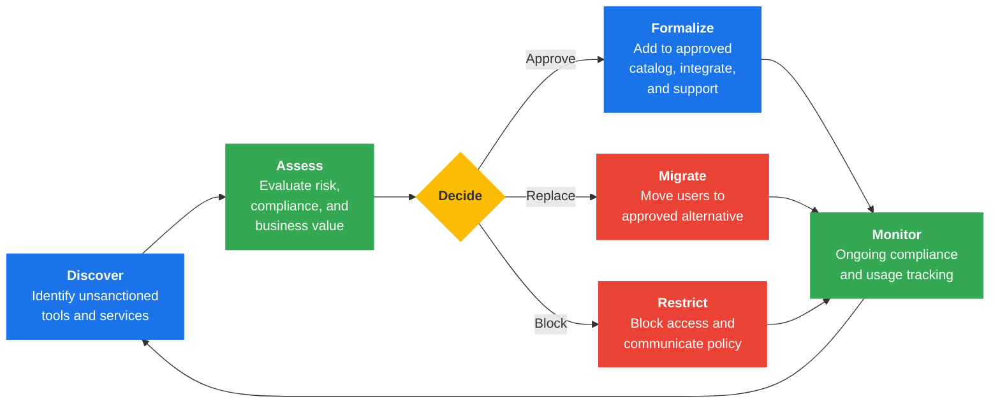
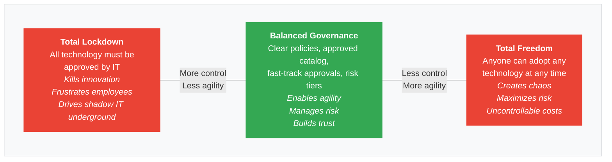

---
tags:
  - risk
  - security
  - governance
  - shadow-IT
reading_time: 18
difficulty: Foundational
---

# Shadow IT — Risks, Governance, and the Innovation Balance

## Overview

Shadow IT refers to technology systems, software, applications, and services that employees use within an organization **without the knowledge or approval of the IT department**. It encompasses everything from a marketing manager signing up for an unauthorized analytics platform, to a finance team building complex business models in personal Excel spreadsheets stored on Dropbox, to an entire department purchasing its own CRM tool because the official procurement process was too slow. Shadow IT is not a new phenomenon, but the explosive growth of cloud-based SaaS applications has made it dramatically easier for any employee with a credit card to provision enterprise-grade software in minutes.

The scope of shadow IT is staggering. Research from Gartner and other analysts consistently estimates that **30 to 50 percent of IT spending in large organizations occurs outside the formal IT budget**. In some enterprises, the number of unsanctioned SaaS applications in use exceeds the number of IT-approved applications by a factor of ten or more. This is not merely a technology management problem — it is a strategic risk, a governance challenge, and, paradoxically, a potential source of innovation that business leaders must learn to manage thoughtfully.

For MBA students, understanding shadow IT is essential because it sits at the intersection of technology governance, risk management, organizational behavior, and business agility. As a future business leader, you will encounter shadow IT in every organization you join. The question is not whether it exists — it does — but how you will balance the legitimate business needs that drive it against the very real risks it creates.

!!! info "Why This Matters for MBA Students"

    Shadow IT is one of the most common and consequential IT governance challenges you will face in any management role. Whether you lead a business unit, manage a P&L, or serve on an executive leadership team, you need to understand:

    - **Why employees bypass IT** — and what that signals about unmet business needs and organizational friction
    - **What risks you are creating** when your team adopts unsanctioned tools — from data breaches to compliance violations
    - **How to work with IT leadership** to find governance approaches that enable speed and innovation without creating unacceptable risk
    - **The financial impact** — redundant spending on overlapping tools, hidden costs of integration failures, and wasted licensing fees

    A CIO or CISO will expect you to be a partner in managing shadow IT, not a contributor to the problem. Understanding this topic makes you a more effective and credible business leader.

## Key Concepts

### What Counts as Shadow IT?

Shadow IT is any technology resource used for business purposes that has not been vetted, approved, or provisioned through the organization's formal IT processes. Common examples include:

| Category | Examples |
|----------|----------|
| **Cloud storage & file sharing** | Personal Dropbox, Google Drive, or Box accounts used to store and share work files |
| **SaaS applications** | Marketing adopts HubSpot, sales uses a pipeline tool, HR buys an engagement survey platform — all without IT involvement |
| **Communication tools** | Teams using WhatsApp, Slack (unofficial workspace), or Signal for business communication |
| **Departmental databases** | Microsoft Access databases, complex Excel spreadsheets, or Airtable bases that become critical business systems |
| **Hardware & devices** | Personal laptops, tablets, USB drives, or unauthorized IoT devices connected to the corporate network |
| **Development tools** | Engineers using unauthorized code repositories, cloud development environments, or AI coding assistants |
| **AI & analytics tools** | Employees using ChatGPT, Copilot, or other generative AI tools to process proprietary business data |

### Why Shadow IT Happens

Shadow IT is rarely malicious. Employees turn to unsanctioned tools because they are trying to get their jobs done more effectively. The root causes are organizational, not technological:

**Slow IT procurement.** When the formal process to request and approve a new tool takes weeks or months, employees who face urgent business deadlines will find workarounds. A marketing director who needs an analytics dashboard for next week's board presentation cannot wait 90 days for IT to evaluate and deploy a solution.

**Unmet business needs.** Sometimes the tools IT provides simply do not meet the needs of specific business functions. The enterprise-standard project management tool may work well for software development but poorly for creative teams. When employees feel their needs are not being heard, they self-provision.

**Consumerization of IT.** Today's employees are accustomed to adopting powerful, intuitive applications in their personal lives — streaming services, cloud storage, design tools, AI assistants. They expect the same ease of use at work and are frustrated when corporate IT feels clunky or restrictive by comparison.

**BYOD culture.** As organizations embrace Bring Your Own Device policies, the boundary between personal and corporate technology blurs. An employee working on a personal laptop may naturally gravitate toward personal tools and services.

**LOB budget authority.** In many organizations, LOB leaders have their own technology budgets and purchasing authority. A VP of Marketing with budget discretion can purchase SaaS subscriptions directly, often through a corporate credit card or departmental purchase order, without ever involving IT.

**The "good enough" trap.** Free or freemium SaaS offerings make it trivially easy to get started. A team can sign up for a free Trello board, a free tier of Notion, or a trial of a specialized tool — and by the time it becomes mission-critical, it is deeply embedded in the team's workflow.

!!! question "Quick Check"
    - A VP of Sales argues that adopting an unsanctioned CRM tool is justified because "IT is too slow." As a COO, would you side with the VP or with IT — and what structural change would you propose so this conflict does not recur?
    - Of the six root causes of shadow IT listed above, which one do you think is hardest for an organization to fix, and why?

### The Risk Landscape

While the motivations behind shadow IT are understandable, the risks are substantial and often invisible until something goes wrong.

!!! warning "Security Vulnerabilities"

    Unsanctioned cloud services may not meet the organization's security standards. Corporate data stored in a personal Dropbox account is not protected by the same encryption, access controls, and monitoring that corporate-approved systems provide. If an employee leaves the company or their personal account is compromised, sensitive data is at risk.

!!! warning "Compliance Violations"

    Regulated industries face particularly acute shadow IT risks. If a healthcare employee stores patient data in an unauthorized cloud tool, the organization may violate HIPAA. If a European customer's personal data is processed in an unsanctioned application without proper data processing agreements, the organization may violate GDPR. Financial services firms subject to SOX face similar exposure. Compliance penalties can run into millions of dollars.

!!! warning "Data Silos and Integration Failures"

    When different departments use different unsanctioned tools, organizational data becomes fragmented. Marketing's customer insights live in one system, sales pipeline data in another, and finance's projections in a third — with no integration between them. This makes it nearly impossible to build the kind of unified, data-driven decision-making capability that organizations increasingly require.

**Redundant spending.** Without visibility into what tools are already in use, multiple departments may purchase overlapping solutions. Three different teams might each buy their own project management tool, when a single enterprise license would cost less and provide better collaboration.

**No disaster recovery.** IT-managed systems typically include backup, disaster recovery, and business continuity provisions. Shadow IT systems almost never do. When a critical departmental Access database crashes, or a key employee's personal cloud account is locked, there may be no recovery path.

**Loss of architectural coherence.** Enterprise architecture exists to ensure that technology systems work together as a coherent whole. Every shadow IT system that bypasses architectural review is a potential integration problem, a data inconsistency, or a security gap.

### The Innovation Angle

Here is the paradox that makes shadow IT such a rich governance challenge: **shadow IT is often a signal of innovation and unmet need**. Before dismissing it as mere rule-breaking, consider:

- **Employee-driven innovation.** Employees closest to business problems often identify technology solutions that central IT has not considered. Many official enterprise tools started as shadow IT — adopted by a small team, proved their value, and were eventually sanctioned and scaled.

- **Speed and agility.** In fast-moving markets, the ability to experiment with new tools quickly can be a competitive advantage. A rigid, centralized IT model that takes months to approve new technology can inhibit the very agility the business needs.

- **Market intelligence.** Shadow IT adoption patterns tell IT leaders what capabilities the business actually needs. When three different departments all independently adopt Slack, that is powerful evidence that the current communication tools are inadequate.

- **User satisfaction and retention.** Employees who feel empowered to use the best tools for their work are often more productive and more satisfied. An overly restrictive IT environment can contribute to frustration and even talent loss.

The goal is not to eliminate shadow IT entirely — that would stifle innovation. The goal is to **bring shadow IT into the light**: discover it, assess its risk, and either formalize it as an approved solution or migrate to a better alternative.

!!! question "Quick Check"
    - A competitor gains market share partly because its teams adopt new tools faster than yours. How would you weigh the innovation upside of tolerating shadow IT against the compliance risks it creates?
    - If three departments independently adopt the same unsanctioned analytics tool, what does that signal about your organization's current BI capabilities — and who should own the decision about what to do next?

## Frameworks & Models

### The Shadow IT Governance Lifecycle

Effective shadow IT governance follows a continuous cycle of discovery, assessment, decision, and management. The following diagram illustrates this process:

### The Governance Spectrum

Organizations fall along a spectrum between two extremes. Neither end is optimal — the right position depends on your industry, risk profile, and culture.

### Governance Tool Categories

Modern organizations use a combination of tools and policies to manage shadow IT:

| Approach | Description | Example Tools |
|----------|-------------|---------------|
| **CASB** (Cloud Access Security Broker) | Monitors and controls cloud service usage across the organization | Netskope, Microsoft Defender for Cloud Apps, Zscaler |
| **SaaS Management Platforms** | Discovers and inventories all SaaS applications in use | Productiv, Zylo, Torii |
| **Approved App Catalogs** | Curated list of pre-vetted applications employees can adopt without a full procurement cycle | ServiceNow App Store, internal portals |
| **Network Monitoring** | Identifies traffic to unsanctioned cloud services | Firewalls, DLP tools, DNS analytics |
| **Policy Frameworks** | Acceptable use policies, data classification standards, and procurement guidelines | COBIT, NIST, internal governance policies |

### Risk-Tiered Approval Framework

A practical governance model classifies potential shadow IT tools by risk level and applies different approval processes accordingly:

| Risk Tier | Characteristics | Approval Process | Example |
|-----------|----------------|------------------|---------|
| **Tier 1 — Low Risk** | No sensitive data, no integration required, free/low cost | Self-service from approved catalog | Miro for brainstorming, Calendly for scheduling |
| **Tier 2 — Medium Risk** | Some business data, limited integration, moderate cost | Fast-track review (1-2 weeks) | Project management tools, departmental analytics |
| **Tier 3 — High Risk** | Sensitive/regulated data, deep integration, significant cost | Full security and architecture review | CRM systems, financial tools, HR platforms |
| **Tier 4 — Critical** | PII, PHI, financial data, core business processes | CISO and CIO sign-off, legal review | Cloud infrastructure, data warehouses, ERP extensions |

!!! question "Quick Check"
    - A marketing analyst wants to upload customer emails into a free AI-powered segmentation tool. Using the Risk-Tiered Approval Framework above, which tier would this fall into, and what approval process would you require?
    - Your organization currently takes 90 days to approve new software. How would implementing an approved app catalog and risk-tiered model change the incentive for employees to pursue shadow IT?
    - Compare the "Total Lockdown" and "Balanced Governance" positions on the governance spectrum. Under what business conditions might a company rationally move toward stricter control, even knowing it reduces agility?

## Real-World Applications

### Scenario 1: Marketing's Analytics Platform

A VP of Marketing at a mid-size consumer goods company grows frustrated with the company's standard BI tool, which requires IT involvement for every new report. She purchases a subscription to a self-service analytics platform using her departmental budget, uploads customer purchase data including email addresses, and shares dashboards with her team via a personal link.

**What went right:** The marketing team gained faster access to insights and improved campaign targeting by 25%.

**What went wrong:** Customer email addresses (personal data under GDPR) were uploaded to an unsanctioned cloud platform without a data processing agreement. The company's European customers were not notified. When the CISO discovered the tool during a routine audit, the company faced a potential GDPR compliance violation and had to engage outside counsel at significant expense.

**The lesson:** The business need was legitimate and the tool was effective, but the lack of IT involvement created compliance risk that far exceeded the value of faster dashboards. A risk-tiered approval process could have enabled a fast-track evaluation (two weeks) while ensuring proper data handling.

### Scenario 2: The Critical Spreadsheet

A financial analyst at a Fortune 500 company built an elaborate Excel spreadsheet with VBA macros that automated the quarterly revenue reconciliation process. Over three years, the spreadsheet evolved into a mission-critical system used by the entire finance department. The analyst was the only person who understood its logic. When the analyst resigned, the finance team discovered that:

- The spreadsheet contained hardcoded assumptions that no one could explain
- There was no documentation, version control, or backup
- The quarterly close process was entirely dependent on a tool IT never knew existed

**The lesson:** Not all shadow IT involves cloud subscriptions. End-user computing (complex spreadsheets, Access databases, and desktop tools) is among the oldest and most dangerous forms of shadow IT because it creates single points of failure with no organizational resilience.

### Scenario 3: Shadow IT Becomes the Standard

A product team at a software company started using Slack as an unauthorized communication tool because the official platform (Lotus Notes email) was slow and poorly suited for real-time collaboration. Within six months, Slack had spread organically to twelve departments. When IT leadership noticed, rather than blocking it, they:

1. Assessed the security and compliance posture of Slack Enterprise
2. Negotiated an enterprise licensing agreement at significantly lower per-user cost
3. Established data retention and compliance policies
4. Retired Lotus Notes and made Slack the official communication platform

**The lesson:** Shadow IT can be a discovery mechanism. The grassroots adoption of Slack was a powerful signal that employees needed better collaboration tools. By embracing rather than blocking the innovation, IT improved employee satisfaction, reduced costs, and gained governance control.

## Common Pitfalls

!!! warning "Pitfall 1: The Crackdown That Backfires"

    When IT discovers widespread shadow IT, the instinct is often to immediately block all unsanctioned tools and send out a stern policy memo. This approach almost always fails. Employees who were using those tools to do their jobs will feel punished for being resourceful, trust between IT and the business will erode, and employees will simply find new, even harder-to-detect workarounds. A collaborative, phased approach that acknowledges legitimate needs is far more effective.

!!! warning "Pitfall 2: Assuming IT Can See Everything"

    Many executives assume that because the company has a firewall and endpoint management, IT has full visibility into what tools are being used. In reality, SaaS applications accessed through a web browser on a personal device connected to home WiFi may be completely invisible to IT. The rise of remote and hybrid work has made shadow IT significantly harder to detect through traditional network monitoring alone.

!!! warning "Pitfall 3: Ignoring the Root Cause"

    Shadow IT is a symptom, not a disease. If the formal IT procurement process takes 90 days, blocking shadow IT without fixing the procurement bottleneck simply creates frustration without solving the underlying problem. Effective governance addresses both the symptoms (existing shadow IT) and the root causes (slow processes, unmet needs, poor communication between IT and business units).

!!! warning "Pitfall 4: The 'Free Tool' Illusion"

    Employees often justify shadow IT by pointing out that a tool is free. But "free" SaaS tools typically mean free of licensing cost, not free of risk. The total cost includes security review time, integration effort, data migration when the tool is eventually sunset, training, and — most critically — the cost of a potential data breach or compliance violation. A "free" tool that leads to a $5 million GDPR fine is extraordinarily expensive.

## Discussion Questions

1. **Balancing control and innovation.** You are the newly hired CIO of a mid-size healthcare company. An internal audit reveals that clinical departments are using 47 unsanctioned cloud applications, including three that store patient data. How do you design a governance response that addresses the immediate HIPAA compliance risks without alienating the clinicians who adopted these tools to improve patient care? What organizational and process changes would you propose to prevent future shadow IT proliferation?

2. **Shadow IT as strategy signal.** As a LOB leader, you discover that three of your regional sales teams have independently purchased subscriptions to the same AI-powered forecasting tool, bypassing the company's standard CRM system. What does this pattern tell you about the organization's technology strategy? How would you present this finding to the CIO, and what would you recommend — formalize the tool, invest in adding similar capabilities to the existing CRM, or take a different approach? What data would you need to make this decision?

3. **The governance spectrum in practice.** Consider two organizations: a fintech startup handling sensitive financial data and a global advertising agency built on creative agility. Where on the governance spectrum (lockdown to freedom) should each organization position itself with respect to shadow IT? What specific governance mechanisms would you recommend for each, and how would you handle the inevitable tension between security requirements and employee demands for tool flexibility?

## Key Takeaways

- **Shadow IT is pervasive.** Research estimates that 30-50% of IT spending occurs outside the IT budget, and the average enterprise has hundreds of unsanctioned SaaS applications in use. Every business leader should assume shadow IT exists in their organization.

- **The risks are real and consequential.** Shadow IT creates security vulnerabilities, compliance violations (GDPR, HIPAA, SOX), data silos, redundant spending, and single points of failure — risks that often remain invisible until a breach or audit exposes them.

- **Shadow IT is a symptom of unmet needs.** Employees adopt unsanctioned tools because formal IT processes are too slow, existing tools are inadequate, or their needs are not being heard. Addressing root causes is more effective than enforcement alone.

- **Innovation and risk must be balanced.** The goal is not to eliminate shadow IT but to bring it into the light through discovery, risk assessment, and governance processes that enable agility while managing risk.

- **Governance tools and frameworks help.** CASBs, SaaS management platforms, approved app catalogs, and risk-tiered approval processes give organizations practical mechanisms to manage shadow IT at scale.

- **Business leaders share responsibility.** Shadow IT governance is not solely IT's problem. LOB leaders who approve departmental technology purchases, executives who set procurement policies, and individual contributors who adopt tools all play a role in managing this challenge.

- **The best organizations turn shadow IT into strategy.** When shadow IT solutions prove their value, the smartest organizations formalize and scale them — turning grassroots innovation into enterprise capability.

## Related Topics

- [IT Governance Frameworks](../governance/frameworks.md) — COBIT and ITIL provide governance structures for managing shadow IT risk
- [Cybersecurity for Managers](cybersecurity.md) — Security vulnerabilities introduced by unsanctioned tools and services
- [Cloud Computing Strategy](../technology/cloud-computing.md) — How SaaS accessibility drives shadow IT adoption
- [Data Governance & Analytics](data-governance.md) — Data silos and compliance risks created by ungoverned tools

---

## Further Reading

- **Kappelman, L. et al.** (2021). "The SIM IT Issues and Trends Study." *MIS Quarterly Executive.* — Annual survey of top IT management concerns, consistently ranking shadow IT and security among the top issues facing CIOs.

- **Gartner Research.** "Market Guide for SaaS Management Platforms." — Industry analysis of the tools available to discover and govern shadow IT in cloud-heavy environments.

- **Walters, R.** (2013). "Bringing IT Out of the Shadows." *Network Security*, 2013(4), pp. 5-11. — Early academic treatment of shadow IT as a governance challenge, with frameworks for classification and response.

- **Silic, M. & Back, A.** (2014). "Shadow IT: A View from Behind the Curtain." *Computers & Security*, 45, pp. 274-283. — Research examining employee motivations for adopting shadow IT and the organizational dynamics that drive it.

- **Weill, P. & Ross, J.** (2004). *IT Governance: How Top Performers Manage IT Decision Rights for Superior Results*. Harvard Business School Press. — Foundational text on IT governance frameworks; Chapter 3 on decision rights is particularly relevant to understanding how decentralized technology decisions lead to shadow IT.

- **ISACA.** "COBIT 2019 Framework: Governance and Management Objectives." — The COBIT framework provides specific guidance on managing technology risk, including controls relevant to shadow IT governance.

- **McKinsey & Company.** "Unlocking the Value of Shadow IT." — Practitioner-oriented perspective on how leading organizations convert shadow IT from a risk into a source of strategic advantage.
