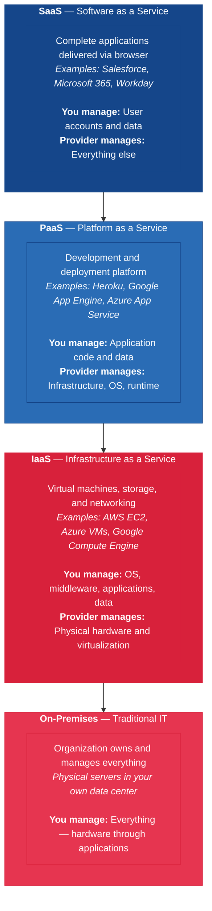

---
tags:
  - technology
  - cloud
  - infrastructure
reading_time: 40
difficulty: Intermediate
---

# Cloud Computing Strategy

## Overview

Cloud computing has fundamentally changed how organizations acquire, deploy, and manage technology resources. Rather than owning and operating physical servers and data centers, organizations can now rent computing power, storage, and software on demand from cloud providers like AWS, Microsoft Azure, and Google Cloud Platform. This shift is comparable to the transition from owning electrical generators to purchasing electricity from a utility — organizations no longer need to build and maintain the underlying infrastructure themselves, and instead pay only for what they consume.

For business leaders, cloud computing is not merely a technology decision — it is a strategic and financial transformation. Cloud changes how organizations budget for IT (shifting spending from capital expenditure to operating expenditure), how quickly they can launch new products and services (from months to minutes), and how they manage risk (trading the risk of over-provisioning physical hardware for the risk of vendor dependency and recurring costs). Understanding cloud computing is essential for any MBA graduate because virtually every technology initiative you will encounter — from digital transformation programs to AI deployments to enterprise application modernization — will involve cloud infrastructure in some form.

The cloud computing market has grown rapidly and shows no signs of slowing. Global spending on public cloud services exceeds $600 billion annually (Gartner, Forecast: Public Cloud Services, 2024), and the major cloud providers — AWS, Microsoft Azure, and Google Cloud — collectively operate millions of servers across dozens of geographic regions worldwide. For the modern enterprise, the question is no longer *whether* to use the cloud, but *how much* to put there, *which* provider to choose, and *how* to manage the transition safely and cost-effectively.

???+ abstract "Executive Summary"
    **Reading time:** ~25 minutes | **Difficulty:** Foundational

    - Cloud computing delivers IT resources **on demand** via three service models: IaaS (you manage most), PaaS (provider manages infrastructure), SaaS (provider manages everything)
    - Cloud shifts IT spending from **CapEx to OpEx**, changing budgeting, financial statements, and investment decisions
    - The **"6 Rs" migration framework** (Rehost, Replatform, Repurchase, Refactor, Retire, Retain) structures cloud migration decisions
    - **Security is a shared responsibility** — the provider secures the infrastructure; your organization secures data, access, and compliance
    - AWS (~31%), Azure (~25%), and GCP (~11%) dominate the market, each with distinct strengths

!!! info "Why This Matters for MBA Students"
    As a business leader, you will participate in cloud strategy decisions whether you work in technology or not. CFOs must understand how cloud changes the financial profile of IT spending — replacing large, predictable capital investments with variable operating costs that fluctuate with usage. Marketing leaders evaluate SaaS platforms like Salesforce and HubSpot. Operations managers rely on cloud-hosted ERP and SCM systems. Strategy consultants advise clients on cloud migration programs that can cost tens of millions of dollars and take years to complete. Even board members are increasingly asked to weigh in on cloud risk, vendor concentration, and data sovereignty. Understanding the service models, economics, migration strategies, and governance challenges of cloud computing will make you a more effective participant in these conversations — regardless of your functional role.

## Key Concepts

### Service Models: IaaS, PaaS, and SaaS

Cloud computing is delivered through three primary service models, each offering a different level of abstraction from the underlying hardware. The key difference between them is **how much the cloud provider manages versus how much your organization manages**.

#### Infrastructure as a Service (IaaS)

IaaS provides the most fundamental cloud resources — virtual machines, storage, and networking — on demand. The cloud provider owns and operates the physical hardware in its data centers, but your organization is responsible for everything that runs on top of that hardware: the operating system, middleware, applications, and data.

Think of IaaS as renting an empty office building. The landlord provides the structure, electricity, and plumbing, but you furnish it, configure it, and manage everything inside.

**Business example**: A company uses **Amazon EC2** (Elastic Compute Cloud) to run its internal applications on virtual servers in AWS's data centers instead of purchasing and maintaining its own physical servers. The company still installs and manages the operating systems, databases, and application software — but it no longer needs to worry about hardware procurement, data center cooling, or server maintenance.

**Best suited for**: Organizations that need maximum control over their computing environment, have skilled IT staff to manage systems, and want to avoid the capital cost of purchasing physical hardware.

#### Platform as a Service (PaaS)

PaaS provides a complete development and deployment environment in the cloud. The cloud provider manages the infrastructure, operating systems, middleware, and runtime environments. Your organization is responsible only for the application code and the data.

Think of PaaS as a co-working space with a fully equipped kitchen. You bring the ingredients and the recipe (your code and data), and the space provides everything else — the stove, utensils, tables, and cleaning services.

**Business example**: A software development team uses **Heroku** (a Salesforce-owned PaaS) to build and deploy a customer-facing web application. The developers focus entirely on writing code and do not need to manage servers, operating systems, or middleware. Heroku automatically handles scaling — if traffic increases, the platform adds more computing resources; if traffic drops, resources scale back.

**Best suited for**: Development teams that want to focus on building applications without managing infrastructure, and organizations that want to accelerate time-to-market for new digital products.

#### Software as a Service (SaaS)

SaaS delivers complete, ready-to-use applications over the internet. The cloud provider manages everything — infrastructure, platform, and the application itself. Users access the software through a web browser or API, typically paying a per-user subscription fee.

Think of SaaS as dining at a restaurant. You do not cook, manage the kitchen, or hire the staff — you simply order from the menu and consume the meal.

**Business example**: An organization uses **Salesforce CRM** to manage customer relationships, sales pipelines, and marketing campaigns. There is nothing to install, no servers to manage, and no software updates to schedule — Salesforce handles everything. The organization's users log in through a browser, and the subscription fee covers all infrastructure, maintenance, and upgrades.

**Best suited for**: Business functions that need standard software capabilities (email, CRM, HR, accounting) without the complexity of building or hosting the software themselves.

#### The Shared Responsibility Spectrum

A critical concept across all three models is that cloud computing does not eliminate management responsibility — it **redistributes** it between your organization and the cloud provider. As you move from IaaS to PaaS to SaaS, the provider assumes more responsibility, and your organization assumes less:

| Component | On-Premises | IaaS | PaaS | SaaS |
|-----------|:-----------:|:----:|:----:|:----:|
| **Applications** | You | You | You | Provider |
| **Data** | You | You | You | Shared |
| **Runtime & Middleware** | You | You | Provider | Provider |
| **Operating System** | You | You | Provider | Provider |
| **Virtualization** | You | Provider | Provider | Provider |
| **Servers & Storage** | You | Provider | Provider | Provider |
| **Networking** | You | Provider | Provider | Provider |
| **Physical Data Center** | You | Provider | Provider | Provider |

!!! question "Quick Check"
    - Your company runs a custom analytics application on IaaS. A security breach occurs because the operating system was not patched. Who is responsible -- your organization or the cloud provider? How would the answer differ if the same application ran on a PaaS platform?
    - A marketing director proposes adopting a new SaaS tool and says, "It is in the cloud, so IT does not need to be involved." Using the shared responsibility spectrum, explain why this reasoning is incomplete and what risks it overlooks.

### Deployment Models: Public, Private, Hybrid, and Multi-Cloud

Beyond *what* you consume (the service model), organizations must also decide *where* their cloud resources run (the deployment model). There are four primary options, each with different trade-offs between cost, control, security, and flexibility.

#### Public Cloud

In a public cloud, the infrastructure is owned and operated by a third-party cloud provider and shared among many customers (called "tenants"). Resources are delivered over the public internet, and customers pay only for what they use. AWS, Azure, and GCP are all public cloud providers.

**Advantages**: Lowest upfront cost, virtually unlimited scalability, no hardware to maintain, rapid provisioning, global geographic reach.

**Disadvantages**: Less control over the physical infrastructure, potential data sovereignty concerns (your data may reside in a different country), shared infrastructure raises concerns in highly regulated industries.

#### Private Cloud

A private cloud is dedicated to a single organization. It can be hosted on-premises in the organization's own data center or by a third-party provider, but the infrastructure is not shared with other tenants. Private clouds offer cloud-like features (self-service provisioning, elasticity, automation) within a dedicated environment.

**Advantages**: Greater control over security and compliance, can meet strict regulatory requirements (healthcare, government, financial services), customizable to the organization's specific needs.

**Disadvantages**: Higher cost (you bear the full infrastructure expense), limited scalability compared to public cloud, requires skilled staff to manage, longer provisioning times.

#### Hybrid Cloud

A hybrid cloud combines public and private cloud environments, allowing data and applications to move between them. Organizations typically keep sensitive workloads on the private cloud while using the public cloud for less sensitive applications or for handling demand spikes.

**Advantages**: Flexibility to place workloads in the optimal environment, can satisfy regulatory requirements while still leveraging public cloud economics, enables gradual migration.

**Disadvantages**: More complex to manage, requires robust integration and networking between environments, risk of inconsistent security policies across environments.

#### Multi-Cloud

A multi-cloud strategy uses services from two or more public cloud providers simultaneously. For example, an organization might run its primary applications on AWS while using Azure for its Microsoft-centric workloads and GCP for machine learning projects.

**Advantages**: Avoids dependence on a single vendor (reducing vendor lock-in risk), allows organizations to use best-of-breed services from each provider, improves resilience.

**Disadvantages**: Highest management complexity, requires skills across multiple cloud platforms, difficult to achieve consistent governance and security, data transfer between providers can be costly.

!!! question "Quick Check"
    - A healthcare startup is choosing between public cloud and private cloud for storing patient records subject to HIPAA. What factors beyond regulatory compliance should influence this choice, and under what conditions might the public cloud actually be the more secure option?
    - Your CFO proposes a multi-cloud strategy primarily to gain negotiating leverage with AWS. Evaluate this rationale: what are the hidden costs the CFO may not have considered, and when does the leverage benefit outweigh them?

### Cloud Economics: How Cloud Changes the Financial Model

One of the most significant impacts of cloud computing is how it changes the financial profile of IT spending. Understanding this shift is particularly important for MBA students because it affects financial statements, budgeting processes, and investment decisions.

#### The CapEx to OpEx Shift

Traditionally, IT infrastructure required large **capital expenditures** (CapEx) — purchasing servers, storage systems, networking equipment, and data center facilities. These are long-lived assets that appear on the balance sheet and are depreciated over 3-5 years. CapEx requires significant upfront investment, long procurement cycles, and accurate forecasting of future needs.

Cloud computing transforms these capital expenditures into **operating expenditures** (OpEx) — monthly or annual subscription and usage fees that appear on the income statement as a current-period expense. This shift has several important implications:

| Dimension | Traditional IT (CapEx) | Cloud (OpEx) |
|-----------|----------------------|--------------|
| **Payment timing** | Large upfront investment | Pay as you go, monthly or annually |
| **Financial treatment** | Capitalized on balance sheet, depreciated over useful life | Expensed in the period incurred |
| **Capacity planning** | Must forecast demand years in advance | Scale up or down in real time |
| **Risk of over-provisioning** | High — unused capacity is wasted investment | Low — scale down when demand drops |
| **Risk of under-provisioning** | High — cannot quickly add capacity | Low — scale up instantly |
| **Budget predictability** | Predictable after purchase (depreciation schedule) | Variable — fluctuates with usage |
| **Cash flow impact** | Large cash outflow at purchase | Smaller, regular cash outflows |
| **Tax treatment** | Depreciated over asset life | Fully deductible in current period |

#### Pay-As-You-Go Pricing

Cloud providers charge based on actual consumption — compute hours, storage gigabytes, data transfer, and API calls. This pay-as-you-go model means organizations can experiment with new initiatives at low cost and scale spending in proportion to business success. A startup can launch a global application on AWS for a few hundred dollars per month and scale to millions of dollars only if the product achieves market traction.

However, pay-as-you-go pricing also introduces a new risk: **cost unpredictability**. Without proper governance and monitoring, cloud spending can grow rapidly and exceed budgets. Many organizations discover that their actual cloud bills are 20-30% higher than anticipated because of poorly optimized resources, forgotten test environments, or applications that consume more resources than expected.

#### Economies of Scale

Cloud providers achieve enormous economies of scale by operating at a level that no individual organization could match. AWS operates millions of servers across dozens of data centers worldwide. This scale allows providers to negotiate lower prices for hardware, energy, and real estate — savings that are passed on to customers through lower per-unit costs. For all but the largest enterprises, it is almost always cheaper per unit of computing to use a public cloud provider than to build and operate equivalent infrastructure internally.

#### Total Cost of Ownership Considerations

When evaluating cloud versus on-premises infrastructure, organizations must consider the TCO — the full cost of ownership over the entire lifecycle, not just the sticker price. TCO for on-premises infrastructure includes hardware acquisition, data center facilities, power and cooling, networking, operating system licensing, IT staff salaries, disaster recovery, and eventual hardware decommissioning. Cloud TCO includes subscription fees, data transfer costs, integration costs, training, and the cost of managing cloud operations. A fair comparison must account for all of these factors.

### The "6 Rs" of Cloud Migration

When organizations decide to move workloads to the cloud, they need a migration strategy for each application. The industry-standard framework is the **"6 Rs"** — six migration strategies that range from simple to complex, each appropriate for different situations:

#### 1. Rehost ("Lift and Shift")

Move the application to the cloud as-is, without making any changes. The application runs on cloud infrastructure (IaaS) exactly as it ran on-premises.

- **When to use**: Large-scale migrations where speed matters more than optimization; legacy applications that are difficult to modify
- **Advantage**: Fastest migration path, lowest risk of breaking functionality
- **Disadvantage**: Does not take advantage of cloud-native features, may not realize full cost savings

#### 2. Replatform ("Lift, Tinker, and Shift")

Move the application to the cloud with minor optimizations — for example, migrating a database from a self-managed database server to a cloud-managed database service (like Amazon RDS) without rewriting the application.

- **When to use**: Applications where targeted optimizations can deliver significant benefits without a full rewrite
- **Advantage**: Better cost efficiency and performance than rehosting, with moderate effort
- **Disadvantage**: Requires some modification and testing

#### 3. Repurchase ("Drop and Shop")

Replace the existing application with a cloud-native SaaS alternative. For example, retiring an on-premises email server and moving to Microsoft 365, or replacing a homegrown CRM with Salesforce.

- **When to use**: Applications where a commercially available SaaS product meets the business need
- **Advantage**: Eliminates maintenance burden, provides modern features, vendor handles updates
- **Disadvantage**: Data migration complexity, potential loss of customizations, ongoing subscription costs

#### 4. Refactor / Re-architect

Redesign the application from the ground up to take full advantage of cloud-native features such as serverless computing, microservices, and auto-scaling. This is the most resource-intensive migration strategy but delivers the greatest long-term benefits.

- **When to use**: Strategic applications where cloud-native architecture will deliver significant competitive advantages in scalability, performance, or cost
- **Advantage**: Maximum cloud benefits, optimal performance and cost efficiency
- **Disadvantage**: Highest cost and longest timeline, requires skilled cloud architects

#### 5. Retire

Identify applications that are no longer needed and decommission them. Migration is an excellent opportunity to rationalize the application portfolio and eliminate redundant or obsolete systems.

- **When to use**: Applications with few or no active users, redundant systems, or applications replaced by other initiatives
- **Advantage**: Reduces complexity and cost immediately, no migration effort required
- **Disadvantage**: Requires careful analysis to ensure nothing critical is retired prematurely

#### 6. Retain (Revisit)

Keep the application on-premises for now, either because it is not a priority for migration, because regulatory requirements prevent cloud deployment, or because the application is too tightly coupled to on-premises infrastructure.

- **When to use**: Applications that are not ready for cloud migration, recently upgraded on-premises applications, or systems with regulatory constraints
- **Advantage**: No disruption, allows focus on higher-priority migrations
- **Disadvantage**: Misses potential cloud benefits, still requires on-premises infrastructure

!!! question "Quick Check"
    - You are advising a mid-size retailer with 200 applications. The CIO wants to refactor every application for cloud-native deployment. Using the 6 Rs framework, explain why this is likely a poor strategy and how you would recommend the CIO allocate applications across the six strategies.
    - Compare the "Rehost" and "Refactor" strategies. Under what specific business conditions would you recommend the higher cost and risk of refactoring over the faster lift-and-shift approach?

### Cloud Governance and Security

Moving to the cloud does not transfer security responsibility to the provider — it **divides** it between the provider and the customer under what is known as the **shared responsibility model**.

#### The Shared Responsibility Model

The shared responsibility model defines which security tasks are handled by the cloud provider and which remain the customer's responsibility. The exact division depends on the service model:

- **The cloud provider is responsible for security *of* the cloud** — physical security of data centers, hardware maintenance, network infrastructure, and the hypervisor layer that creates virtual machines.
- **The customer is responsible for security *in* the cloud** — data encryption, access management, application security, operating system patching (for IaaS), and compliance with industry regulations.

The critical implication for business leaders is this: if your organization suffers a data breach because of a misconfigured cloud storage bucket (a common occurrence), that is **your organization's responsibility**, not the cloud provider's. The provider secured the infrastructure; your team was responsible for configuring it correctly.

#### Key Governance Considerations

Cloud governance encompasses the policies, processes, and tools that organizations use to manage their cloud environments effectively:

- **Identity and Access Management (IAM)**: Controlling who has access to which cloud resources, using principles like least privilege (granting only the minimum access necessary) and multi-factor authentication
- **Data Sovereignty and Residency**: Ensuring that data is stored in geographic regions that comply with applicable regulations (GDPR requires EU citizen data to be handled according to specific rules regardless of where it is processed)
- **Cost Governance**: Implementing budgets, alerts, and tagging policies to track and control cloud spending by department, project, or application
- **Compliance**: Ensuring cloud configurations meet regulatory requirements (HIPAA for healthcare, SOX for financial reporting, PCI DSS for payment card data)
- **Cloud Security Posture Management**: Using automated tools to continuously monitor cloud configurations for security vulnerabilities and compliance violations

### Major Cloud Providers: AWS, Azure, and GCP

Three providers dominate the global public cloud market, collectively accounting for approximately two-thirds of total market share. Each has distinct strengths that appeal to different organizational needs.

#### Amazon Web Services (AWS)

AWS launched in 2006 and is the market leader with approximately 31% of the global cloud infrastructure market (Synergy Research Group, Q3 2024). AWS offers the broadest range of services (over 200) and the largest global infrastructure footprint. Its strength lies in the sheer breadth and depth of its service catalog, a massive ecosystem of partners and third-party tools, and a mature marketplace. AWS is the default choice for many organizations, particularly startups and technology companies.

#### Microsoft Azure

Azure holds approximately 25% of the global market (Synergy Research Group, Q3 2024) and is the fastest-growing major cloud provider. Azure's greatest strength is its deep integration with the Microsoft ecosystem — organizations that use Windows Server, Active Directory, Microsoft 365, and Dynamics 365 find Azure to be a natural extension of their existing environment. Azure is particularly strong in hybrid cloud scenarios and is the dominant choice for large enterprises with significant Microsoft investments.

#### Google Cloud Platform (GCP)

GCP holds approximately 11% of the global market (Synergy Research Group, Q3 2024). While smaller than AWS and Azure, GCP leads in data analytics, machine learning, and artificial intelligence services — reflecting Google's heritage as a data-driven company. GCP's BigQuery (data warehousing), Vertex AI (machine learning), and Kubernetes Engine (container orchestration, based on Google's open-source Kubernetes project) are considered best-in-class. GCP is often chosen by organizations with advanced analytics and AI requirements.

### On-Premise vs. Cloud: A Strategic Comparison

Organizations evaluating cloud adoption must weigh trade-offs across multiple dimensions. This is rarely an all-or-nothing decision — most enterprises operate a mix of on-premise and cloud infrastructure, with the balance shifting over time based on business needs, regulatory requirements, and organizational capability.

#### Business Tradeoffs

| Dimension | On-Premise | Cloud |
|-----------|-----------|-------|
| **Control** | Full control over hardware, software, configurations, and data location | Control limited to what the provider exposes; underlying infrastructure is managed by the provider |
| **Customization** | Unlimited — you own the full stack | Constrained by provider's service offerings and configuration options |
| **Agility** | Slow — hardware procurement takes weeks to months; capacity changes require physical installation | Fast — new resources provisioned in minutes; scale up or down on demand |
| **Vendor Independence** | High — you own your infrastructure and can choose any software stack | Lower — deep integration with provider-specific services increases switching costs |
| **Time to Market** | Longer — infrastructure provisioning, configuration, and testing are manual | Shorter — pre-built services, templates, and automation accelerate deployment |
| **Standardization** | Custom configurations per organization | Provider-standardized configurations with best practices built in |

#### Risk Tradeoffs

| Risk Category | On-Premise | Cloud |
|---------------|-----------|-------|
| **Data Sovereignty** | Full control — data stays exactly where you put it | Data may reside in multiple regions; requires careful configuration to ensure compliance |
| **Regulatory Compliance** | Easier to demonstrate control for strict regulators (some government, defense, healthcare) | Major providers now offer compliance certifications (FedRAMP, HIPAA, SOC 2), but shared responsibility adds complexity |
| **Vendor Lock-In** | Low — you own your hardware | Moderate to high — proprietary services, data formats, and APIs create switching costs |
| **Multi-Tenancy Risk** | None — dedicated infrastructure | Shared infrastructure raises theoretical risk of data leakage between tenants (extremely rare in practice) |
| **Shared Responsibility Gaps** | Single organization responsible for everything — clear accountability | Divided responsibility between provider and customer — misunderstandings cause security gaps |
| **Business Continuity** | Your responsibility to build redundancy and disaster recovery | Providers offer built-in redundancy across availability zones and regions, but outages do occur |

#### Productivity Tradeoffs

- **Developer Velocity**: Cloud enables self-service provisioning, reducing the time developers wait for infrastructure from weeks to minutes. This is one of the most impactful productivity gains — it fundamentally changes how fast teams can experiment and iterate.
- **DevOps Enablement**: Cloud-native tools (CI/CD pipelines, infrastructure as code, container orchestration) are deeply integrated with cloud platforms, enabling modern development practices.
- **IT Staff Reallocation**: Cloud reduces the need for hardware management, freeing IT staff to focus on higher-value activities like security, architecture, and business enablement. A typical mid-size company might reallocate 30-40% of infrastructure team capacity after cloud migration.
- **Self-Service Provisioning**: Business units can request and receive computing resources without filing IT tickets, reducing bottlenecks and improving responsiveness.

#### Cost Tradeoffs — A Worked Example

Understanding the financial comparison between on-premise and cloud requires looking beyond sticker prices:

**Scenario**: A company needs 100 virtual servers running 24/7 for a business application.

**On-Premise 5-Year TCO**:
- Server hardware: $500,000 (refresh at year 3: $500,000)
- Data center space, power, cooling: $150,000/year
- Network equipment: $100,000
- OS and virtualization licenses: $200,000
- IT staff (2 FTEs for infrastructure): $300,000/year
- **5-Year Total: ~$3.3M**

**Cloud (AWS) 5-Year TCO**:
- On-demand instances: $600,000/year
- With reserved instances (1-year commitment): $400,000/year
- With 3-year reserved + savings plans: $250,000/year
- Storage and data transfer: $50,000/year
- Cloud operations staff (0.5 FTE): $75,000/year
- **5-Year Total (optimized): ~$1.9M**

!!! note "Hidden Cloud Costs to Watch"
    - **Egress fees**: Cloud providers charge for data leaving their network — this can be substantial for data-intensive applications
    - **Reserved instance management**: Unused reservations are wasted money; over-committing locks you into unnecessary spending
    - **Training and certification**: Teams need cloud skills development ($5-15K per engineer)
    - **Integration and migration**: Moving applications to cloud is a one-time but significant cost
    - **Premium support plans**: Enterprise-grade cloud support adds 3-10% to your cloud bill

### How Cloud Computing Works — The Logical Perspective

Understanding the logical architecture of cloud computing helps managers evaluate cloud proposals, ask informed questions, and understand the capabilities and constraints of cloud platforms.

#### Virtualization and Hypervisors

At the foundation of cloud computing is **virtualization** — the technology that allows one physical server to host multiple virtual machines (VMs), each running its own operating system and applications as if it were a standalone computer. The **hypervisor** is the software layer that creates and manages these virtual machines, allocating physical CPU, memory, storage, and network resources among them.

Think of it like an apartment building: one physical structure (the server) is divided into multiple independent units (virtual machines), each with its own address, utilities, and tenant — but sharing the same foundation, walls, and plumbing.

This is the fundamental economics of cloud computing: by densely packing virtual machines onto physical servers and dynamically reallocating resources, cloud providers achieve utilization rates of 60-80%, compared to the 10-20% utilization typical of on-premise data centers (NIST SP 800-145; McKinsey, Cloud Economics, 2023).

#### Multi-Tenancy and Resource Isolation

Cloud platforms serve thousands of customers simultaneously on shared infrastructure — a model called **multi-tenancy**. Each tenant's workloads are logically isolated from every other tenant's, even though they may run on the same physical hardware. Cloud providers enforce this isolation through hypervisor-level security, network segmentation, and encryption.

For managers, the key question is: "Is the isolation sufficient for our data sensitivity and regulatory requirements?" For the vast majority of workloads, the answer is yes — major cloud providers invest billions in security and hold certifications (SOC 2, ISO 27001, FedRAMP) that validate their isolation controls. For the most sensitive workloads (classified government data, certain financial data), dedicated tenancy options are available at a premium.

#### APIs and Control Planes

Every cloud resource — servers, databases, storage buckets, networks, AI services — is created and managed through **APIs** (Application Programming Interfaces). This is fundamentally different from on-premise infrastructure, where provisioning typically involves manual steps, procurement processes, and physical installation.

The **control plane** is the set of APIs and management services that lets you create, configure, monitor, and delete cloud resources. The **data plane** is where your actual workloads run. This API-first approach enables **infrastructure as code** — defining your entire infrastructure in code files that can be version-controlled, reviewed, tested, and deployed automatically, just like application software.

#### Regions, Availability Zones, and Fault Domains

Cloud providers organize their infrastructure into a hierarchy designed for resilience:

- **Regions** are geographically separate areas (e.g., US-East, EU-West, Asia-Pacific). Each region is an independent cluster of data centers. Choosing a region affects latency (closer to users = faster), data sovereignty (data stays in that region), and available services.
- **Availability Zones (AZs)** are isolated locations within a region, each with independent power, cooling, and networking. A region typically has 3+ AZs. Deploying across multiple AZs protects against single facility failures.
- **Fault domains** are even finer-grained isolation within an AZ, protecting against hardware rack failures.

For managers, the key decision is: "In which region(s) should our workloads run?" This is driven by user proximity, regulatory requirements, and disaster recovery needs.

#### Auto-Scaling and Load Balancing

**Auto-scaling** automatically adjusts the number of computing resources (servers, containers, functions) based on demand. When traffic increases, additional resources are provisioned; when traffic decreases, resources are removed. This eliminates the need to provision for peak capacity and pay for idle resources during low-demand periods.

**Load balancers** distribute incoming traffic across multiple servers to ensure no single server is overwhelmed. Together, auto-scaling and load balancing enable applications to handle variable demand efficiently — from a handful of users during off-hours to millions during peak periods.

#### Serverless and Event-Driven Architecture

**Serverless computing** (e.g., AWS Lambda, Azure Functions, Google Cloud Functions) takes abstraction one step further: instead of provisioning servers, you deploy individual functions that execute in response to events (an API call, a file upload, a database change). You pay only for the actual execution time — measured in milliseconds — with no charge when the function is idle.

Serverless is ideal for variable, event-driven workloads where demand is unpredictable and you want to pay only for actual usage. It is not suitable for all workloads — long-running processes, applications requiring persistent connections, and workloads with consistent high utilization are often more cost-effective on traditional servers.

### How Cloud Computing Works — The Physical Perspective

While cloud computing is consumed as a service, it runs on very real physical infrastructure. Understanding this physical layer helps managers appreciate the scale, investment, and engineering that make cloud services possible — and why the major cloud providers have structural advantages that are extremely difficult to replicate.

For a detailed treatment of data center design, construction, and operations, see [Data Center Fundamentals](data-centers.md).

#### Hyperscale Data Centers

The major cloud providers operate **hyperscale data centers** — facilities containing hundreds of thousands of servers in warehouse-sized buildings. A single hyperscale data center may contain 50,000 to 100,000+ servers, consume 30-100+ megawatts of power, and cost $500 million to $1 billion to build.

AWS, Azure, and GCP collectively operate hundreds of data centers across 60+ regions worldwide. The scale of investment is staggering: in 2024 alone, the three major cloud providers spent a combined $150+ billion in capital expenditure on data center infrastructure (company 10-K filings, fiscal year 2024).

#### Global Network Backbone

Cloud providers operate their own private global fiber optic networks connecting their data centers. These networks are separate from the public internet and provide higher bandwidth, lower latency, and greater reliability. AWS, Azure, and GCP each operate over 100,000 miles of fiber optic cable, with undersea cables spanning oceans.

This private network infrastructure is a critical competitive advantage — it enables cloud providers to move data between regions faster and more reliably than organizations using the public internet, and it provides a level of redundancy that individual organizations cannot economically replicate.

#### Content Delivery Networks (CDNs)

CDNs (e.g., Amazon CloudFront, Azure CDN, Google Cloud CDN) cache content at edge locations around the world, reducing latency for end users by serving content from the nearest edge location rather than from the origin data center. Major CDNs operate hundreds of edge locations in cities worldwide.

#### Custom Hardware

At hyperscale, cloud providers design and manufacture their own hardware for efficiency and competitive advantage:
- **Custom servers** optimized for specific workloads (compute, storage, networking)
- **Custom networking equipment** designed for data center-scale traffic
- **Custom silicon**: AWS Graviton processors (ARM-based), Google TPUs (Tensor Processing Units for AI), Microsoft Azure Maia (AI accelerator)
- **GPUs at scale**: NVIDIA GPU clusters for AI training and inference, with cloud providers being the largest GPU customers in the world

#### Energy and Sustainability at Scale

Hyperscale data centers are among the largest consumers of electricity in the world. The combined power consumption of global data centers is estimated at 1-2% of worldwide electricity use, and this is growing rapidly due to AI workloads.

Cloud providers are investing heavily in renewable energy and sustainability:
- **Google** has matched 100% of its electricity consumption with renewable energy purchases since 2017
- **Microsoft** has committed to being carbon negative by 2030
- **AWS** is the largest corporate purchaser of renewable energy in the world

For managers, cloud adoption can actually improve sustainability — cloud providers' data centers achieve PUE (Power Usage Effectiveness) ratios of 1.1-1.2, compared to 1.5-2.0 for typical enterprise data centers, meaning cloud infrastructure is significantly more energy-efficient.

## Frameworks & Models

### Cloud Service Model Layers

The three cloud service models form a layered stack. As you move up the stack from IaaS to SaaS, the cloud provider manages more, your organization manages less, and the level of abstraction increases:

### Comparing Deployment Models

=== "Public Cloud"

    **Definition**: Infrastructure owned and operated by a third-party provider, shared among multiple customers over the public internet.

    **Best for**: Startups, variable workloads, development and testing environments, web applications, any workload without strict data residency requirements.

    **Key providers**: AWS, Microsoft Azure, Google Cloud Platform, Oracle Cloud, IBM Cloud.

    **Cost model**: Pay-as-you-go with no upfront investment. Pricing based on consumption (compute hours, storage GB, data transfer).

    **Security model**: Provider secures the infrastructure; customer secures data and access. Compliance certifications (SOC 2, ISO 27001, HIPAA) are maintained by the provider.

    **Scalability**: Virtually unlimited. Resources can be provisioned in minutes and scaled automatically based on demand.

    | Strength | Limitation |
    |----------|-----------|
    | Lowest upfront cost | Less control over physical infrastructure |
    | Fastest provisioning | Potential data sovereignty concerns |
    | Global geographic reach | Shared tenancy may concern regulated industries |
    | Provider handles maintenance | Costs can grow unpredictably |

=== "Private Cloud"

    **Definition**: Cloud infrastructure dedicated to a single organization, either on-premises or hosted by a third party.

    **Best for**: Highly regulated industries (healthcare, government, financial services), organizations with strict data sovereignty requirements, workloads requiring maximum control.

    **Key technologies**: VMware vSphere, OpenStack, Microsoft Azure Stack, Nutanix.

    **Cost model**: Higher upfront investment (similar to traditional CapEx) plus ongoing operational costs. Some managed private cloud offerings provide OpEx-style pricing.

    **Security model**: Organization has full control over all security layers. Easier to meet stringent compliance requirements because infrastructure is not shared.

    **Scalability**: Limited to the capacity of the dedicated infrastructure. Scaling requires procurement and installation of additional hardware.

    | Strength | Limitation |
    |----------|-----------|
    | Maximum control and customization | Higher cost than public cloud |
    | Meets strict regulatory requirements | Limited scalability |
    | No shared tenancy | Requires skilled staff to manage |
    | Predictable performance | Longer provisioning times |

=== "Hybrid Cloud"

    **Definition**: A combination of public and private cloud environments connected by technology that enables data and application portability.

    **Best for**: Organizations transitioning to cloud gradually, workloads with variable demand (burst to public cloud during peaks), businesses with both regulated and non-regulated applications.

    **Key technologies**: Azure Arc, AWS Outposts, Google Anthos, VMware Cloud Foundation.

    **Cost model**: Blended — CapEx for private cloud components, OpEx for public cloud components. Optimization involves placing each workload in the most cost-effective environment.

    **Security model**: Must maintain consistent security policies across both environments. Complexity increases because data flows between private and public infrastructure.

    **Scalability**: Can leverage public cloud for burst capacity while maintaining baseline capacity on private infrastructure.

    | Strength | Limitation |
    |----------|-----------|
    | Flexibility to optimize workload placement | More complex to manage and secure |
    | Gradual migration path | Requires integration between environments |
    | Satisfies both cost and compliance goals | Risk of inconsistent policies |
    | Cloud-bursting for peak demand | Networking between environments adds latency and cost |

=== "Multi-Cloud"

    **Definition**: Using services from two or more public cloud providers simultaneously.

    **Best for**: Organizations seeking to avoid vendor lock-in, those needing best-of-breed services from different providers, businesses requiring resilience across multiple providers.

    **Key enablers**: Kubernetes (container orchestration), Terraform (infrastructure as code), multi-cloud management platforms.

    **Cost model**: OpEx across multiple providers. Requires careful cost management because pricing models differ between providers. Data transfer between providers ("egress charges") can be significant.

    **Security model**: Must maintain consistent governance and security policies across all providers. Each provider has different security tools, IAM models, and compliance certifications.

    **Scalability**: Highest potential scalability — can leverage resources from multiple providers. However, applications must be designed for portability to take advantage of this.

    | Strength | Limitation |
    |----------|-----------|
    | Reduces vendor lock-in risk | Highest management complexity |
    | Best-of-breed service selection | Requires skills across multiple platforms |
    | Improved resilience | Difficult to maintain consistent governance |
    | Negotiation leverage with providers | Data transfer costs between providers |

### Deployment Model Comparison Summary

| Dimension | Public Cloud | Private Cloud | Hybrid Cloud | Multi-Cloud |
|-----------|-------------|---------------|--------------|-------------|
| **Upfront Cost** | None | High | Medium | None |
| **Ongoing Cost** | Variable (pay-as-you-go) | Predictable | Blended | Variable across providers |
| **Control** | Limited | Full | Mixed | Limited per provider |
| **Scalability** | Virtually unlimited | Limited | Moderate (can burst) | Highest potential |
| **Security Control** | Shared with provider | Full organizational control | Split across environments | Split across providers |
| **Management Complexity** | Low to moderate | Moderate to high | High | Highest |
| **Vendor Lock-in Risk** | High (single provider) | Low | Moderate | Lowest |
| **Best For** | Startups, variable workloads | Regulated industries | Gradual migration, mixed requirements | Large enterprises, risk mitigation |

## Real-World Applications

### Example 1: Netflix — All-In on AWS

Netflix is one of the most cited examples of successful cloud adoption. In 2008, Netflix experienced a major database corruption that shut down DVD shipping operations for three days. This incident catalyzed a strategic decision to migrate entirely from on-premises data centers to AWS — a migration that took approximately seven years to complete.

Netflix adopted a **refactor** strategy, redesigning its monolithic application into hundreds of microservices that run on AWS. This cloud-native architecture allows Netflix to stream content to over 260 million subscribers in 190 countries, automatically scaling compute resources to handle peak viewing times (such as when a popular new series premieres) and scaling back during low-demand periods. At peak, Netflix accounts for approximately 15% of global internet traffic (Sandvine, Global Internet Phenomena Report, 2024).

**Key business outcomes**: Netflix's cloud-first architecture enables rapid experimentation — the company runs thousands of A/B tests simultaneously to optimize the user experience. The ability to scale globally without building data centers in every region was essential to Netflix's international expansion strategy. The CapEx to OpEx shift allowed Netflix to redirect capital from infrastructure to content creation, fundamentally reshaping its competitive strategy.

### Example 2: Capital One — Cloud Migration in a Regulated Industry

Capital One, one of the largest banks in the United States, announced in 2020 that it had closed its last on-premises data center, becoming the first major US bank to go all-in on the public cloud (AWS). This was a bold move in an industry known for conservative technology decisions and heavy regulatory oversight.

Capital One's migration strategy combined multiple "Rs" — **replatforming** databases to cloud-managed services, **refactoring** critical applications as cloud-native microservices, and **repurchasing** commodity functions with SaaS alternatives. The bank invested heavily in building cloud engineering capabilities and created an internal "Cloud Custodian" tool (which it later open-sourced) to automate cloud governance and compliance.

**Key business outcomes**: Capital One reduced its data center footprint from eight facilities to zero, significantly lowering infrastructure costs. More importantly, the migration accelerated the bank's ability to deploy new features — the time to provision new computing environments dropped from weeks to minutes. The bank was able to apply machine learning models to real-time transaction data for fraud detection, a capability that would have been difficult to scale in traditional data centers. However, Capital One's 2019 data breach — caused by a misconfigured web application firewall in the cloud — also illustrates that cloud migration does not eliminate security risk; it shifts where and how that risk must be managed.

### Example 3: A Mid-Size Professional Services Firm Adopts SaaS

A mid-size management consulting firm with 2,000 employees across 15 offices was running aging on-premises versions of Microsoft Exchange (email), a homegrown project management tool, and a locally installed financial system. The IT team of 12 people spent most of its time maintaining these systems rather than supporting the business.

The firm executed a **repurchase** strategy for all three systems: migrating email to Microsoft 365 (SaaS), replacing the homegrown project management tool with Asana (SaaS), and moving financial management to Sage Intacct (cloud-based accounting). The entire transition took eight months and was managed with the existing IT team plus a systems integrator.

**Key business outcomes**: The firm eliminated three on-premises server environments, reducing its data center footprint by 60%. Monthly SaaS subscription costs were approximately 30% lower than the fully loaded cost of maintaining the on-premises systems (including hardware refresh, licensing, and staff time). The IT team was able to redirect 40% of its time from system maintenance to business-enabling projects like analytics dashboards and client-facing tools. Employee satisfaction with IT services improved significantly because the SaaS applications offered modern user interfaces, mobile access, and automatic updates — features that the aging on-premises systems could not provide.

## Common Pitfalls

!!! warning "Cloud Cost Overruns"
    One of the most common and painful surprises in cloud adoption is discovering that cloud spending significantly exceeds budget. This typically happens because organizations deploy resources without proper tagging and monitoring, developers spin up test environments and forget to shut them down, or applications consume more compute and storage than anticipated. Unlike on-premises infrastructure where costs are fixed once hardware is purchased, cloud costs are dynamic and can grow rapidly. Organizations must implement **FinOps** (cloud financial management) practices — including cost dashboards, budget alerts, resource tagging, and regular optimization reviews — from day one of their cloud journey, not as an afterthought.

!!! warning "Vendor Lock-In"
    Each major cloud provider uses proprietary services, APIs, and data formats that make it progressively more difficult and expensive to move workloads to a different provider. The more deeply an organization integrates with provider-specific services (such as AWS Lambda for serverless computing or Azure Active Directory for identity management), the higher the switching costs. While multi-cloud strategies can mitigate this risk, they introduce their own complexity. Business leaders should make vendor lock-in a deliberate, informed decision — understanding the trade-offs between leveraging provider-specific capabilities (which often deliver the greatest performance and cost benefits) and maintaining portability (which preserves strategic flexibility).

!!! warning "Lift-and-Shift Without Optimization"
    Rehosting applications to the cloud without any optimization — the "lift and shift" approach — is the fastest migration path, but it often delivers disappointing results. Applications designed for on-premises infrastructure may not take advantage of cloud elasticity, auto-scaling, or managed services. In some cases, a lifted-and-shifted application actually costs more to run in the cloud than it did on-premises, because cloud pricing for always-on virtual machines can exceed the amortized cost of owned hardware. Organizations should treat lift-and-shift as a **first step**, not the end state — planning a subsequent optimization phase to right-size resources, adopt managed services, and redesign architectures where the business case supports it.

!!! warning "Assuming the Cloud Provider Handles All Security"
    A dangerous misconception — particularly common among non-technical leaders — is that moving to the cloud means the cloud provider is now responsible for security. The shared responsibility model makes clear that while the provider secures the infrastructure, the customer remains responsible for data protection, access management, encryption, and compliance. Some of the most high-profile cloud security breaches (including the 2019 Capital One breach) were caused not by provider failures but by customer misconfigurations. Every organization moving to the cloud must invest in cloud security skills, implement automated compliance monitoring, and ensure that its security team understands the specific controls required in a cloud environment.

## Discussion Questions

1. **CapEx vs. OpEx Trade-offs**: Your company's CFO argues that the shift from CapEx to OpEx in cloud computing is purely beneficial — lower upfront costs, tax advantages, and greater flexibility. Your CIO counters that variable cloud costs make budgeting more difficult and that over a five-year period, the cumulative OpEx of running workloads in the cloud can exceed the one-time CapEx of buying equivalent on-premises hardware. How would you structure an analysis to determine which model is better for a specific workload? What factors beyond raw cost should be included in the decision?

2. **Cloud Migration Strategy**: You are advising a hospital system that operates 12 hospitals and uses a 15-year-old on-premises electronic health records (EHR) system. The CIO wants to migrate to the cloud for scalability and cost savings, but the compliance team is concerned about HIPAA requirements for patient data. The CFO questions whether the migration investment will deliver positive ROI within three years. Using the "6 Rs" framework, what migration strategy would you recommend for the EHR system, and how would you address the compliance and financial concerns?

3. **Multi-Cloud vs. Single-Provider Strategy**: A Fortune 500 manufacturing company currently uses AWS for all its cloud workloads. The CEO has read articles about the risks of vendor lock-in and wants to implement a multi-cloud strategy using both AWS and Azure. The CTO argues that multi-cloud will increase complexity, require hiring additional specialists, and reduce the benefits of deep AWS integration. How would you evaluate this decision? Under what circumstances does the risk reduction of multi-cloud outweigh the added complexity and cost?

## Key Takeaways

- **Cloud computing delivers IT resources on demand** — computing power, storage, and software — over the internet, eliminating the need for organizations to own and operate physical infrastructure.
- **Three service models** define what you consume: IaaS (virtual infrastructure you manage), PaaS (development platforms the provider manages), and SaaS (complete applications the provider manages). As you move from IaaS to SaaS, you trade control for convenience.
- **Four deployment models** define where your cloud runs: public (shared, lowest cost), private (dedicated, most control), hybrid (combined), and multi-cloud (multiple providers). Each involves trade-offs between cost, control, security, and complexity.
- **Cloud fundamentally changes IT economics** — shifting spending from large CapEx investments to variable OpEx, enabling pay-as-you-go pricing, and leveraging provider economies of scale. However, variable costs require new financial management disciplines.
- **The "6 Rs" framework** provides a structured approach to cloud migration: Rehost, Replatform, Repurchase, Refactor, Retire, and Retain. Most large migrations use a combination of strategies across the application portfolio.
- **Security in the cloud is a shared responsibility** — the provider secures the infrastructure, but your organization must secure its data, applications, and access. Cloud does not eliminate security risk; it changes where and how risk must be managed.
- **The three major cloud providers** — AWS (broadest services, market leader), Azure (Microsoft integration, enterprise strength), and GCP (analytics and AI leadership) — each have distinct strengths. Provider selection should align with organizational needs and existing technology investments.
- **Cloud governance is essential** — without proper cost management (FinOps), security monitoring, and compliance controls, cloud benefits can be undermined by cost overruns, security breaches, and regulatory violations.
- **Vendor lock-in is a strategic risk** that must be managed deliberately — the deeper the integration with a single provider's proprietary services, the higher the switching costs.

## Further Reading

- **Mell, Peter, and Timothy Grance.** *The NIST Definition of Cloud Computing.* National Institute of Standards and Technology, Special Publication 800-145, 2011. The foundational reference for cloud computing definitions and service/deployment models.
- **Amazon Web Services.** *AWS Well-Architected Framework.* Available at [aws.amazon.com/architecture/well-architected](https://aws.amazon.com/architecture/well-architected/). A set of best practices for designing and operating reliable, secure, efficient, and cost-effective cloud architectures.
- **Kavis, Michael J.** *Architecting the Cloud: Design Decisions for Cloud Computing Service Models.* Wiley, 2014. An accessible introduction to cloud service models and the architectural trade-offs involved in cloud adoption.
- **Hugos, Michael H., and Derek Hulitzky.** *Business in the Cloud: What Every Business Needs to Know About Cloud Computing.* Wiley, 2010. A business-oriented introduction to cloud computing for non-technical leaders.
- **FinOps Foundation.** *FinOps: Collaborative, Real-Time Cloud Financial Management.* Available at [finops.org](https://www.finops.org/). The industry standard for cloud financial management practices.
- Related primer pages: [Data Center Fundamentals](data-centers.md) for the physical infrastructure cloud replaces, [IT Budgeting & Finance](../governance/it-budgeting.md) for deeper coverage of CapEx vs. OpEx and TCO analysis, [Enterprise Architecture](enterprise-architecture.md) for how cloud fits within the broader technology landscape, [Cybersecurity for Managers](../risk-security/cybersecurity.md) for cloud security in the context of broader cybersecurity risk, and [Vendor Management](../management/vendor-management.md) for managing cloud provider relationships.
- **ITEC-617 Course Textbook**: See the assigned readings on cloud computing strategy and digital infrastructure for additional context on how cloud adoption decisions relate to enterprise IT governance.
