---
tags:
  - technology
  - infrastructure
  - data-centers
reading_time: 35
difficulty: Intermediate
---

# Data Center Fundamentals

## Overview

Data centers are the physical foundation of enterprise IT — the specialized facilities that house the servers, storage systems, and networking equipment organizations depend on to run their operations, serve their customers, and store their data. Every email you send, every transaction you process, every dashboard you review originates from hardware running inside a data center somewhere. Even in the age of cloud computing, the cloud itself runs in data centers — the difference is simply who owns and operates them. Understanding data center fundamentals is therefore essential for any business leader making decisions about IT infrastructure, disaster recovery, cost management, or digital strategy.

The data center landscape has undergone a dramatic transformation over the past two decades. What once meant a single server room in a corporate basement has evolved into a sophisticated, global ecosystem of hyperscale facilities, colocation providers, edge deployments, and hybrid architectures. Organizations today face a strategic choice not about whether to use data centers, but about which combination of data center models best serves their business needs — and at what cost, risk, and environmental impact. A mid-size company might run some workloads in its own on-premises server room, host others in a colocation facility, and rely on AWS or Azure for the rest. Understanding the trade-offs across these options is a core competency for modern IT leadership.

For MBA students, data centers sit at the intersection of technology, operations, finance, and sustainability — four domains that converge whenever an organization makes infrastructure decisions. A new data center can cost hundreds of millions of dollars to build and millions per year to operate. Getting the capacity, location, and operating model wrong can strand capital, create compliance risk, or leave the organization unable to scale when demand surges. Getting it right creates a resilient, cost-efficient foundation that enables everything else the business does with technology.

???+ abstract "Executive Summary"
    **Reading time:** ~25 minutes | **Difficulty:** Foundational

    - Data centers house the physical infrastructure (servers, storage, networking, power, cooling) that underpins **all** enterprise IT — including cloud services
    - The **Uptime Institute Tier system** (I–IV) standardizes reliability: Tier I allows ~29 hours/year downtime; Tier IV allows ~26 minutes/year
    - **Virtualization** transformed economics by increasing server utilization from 10-15% to 60-80%; containers are the next evolution
    - Organizations choose from a **spectrum of models**: on-premises, colocation, managed hosting, and cloud — most use a hybrid mix
    - **Edge computing** extends processing to the network periphery for latency-sensitive IoT and real-time applications

!!! info "Why This Matters for MBA Students"
    You will likely never design a cooling system or configure a server rack. But you **will** make or influence decisions that depend on data center economics and capabilities. When your company evaluates a cloud migration, you need to understand what you are migrating *from* — and whether the total cost of ownership actually favors the move. When the board asks about business continuity, you need to understand what "Tier III" means and whether your current infrastructure can survive a power failure. When a sustainability report lands on your desk, you need to know what PUE measures and whether your organization's data center energy consumption is reasonable. And when a vendor pitches edge computing for your retail stores or manufacturing plants, you need to evaluate whether the latency and bandwidth benefits justify the added complexity. Data center literacy turns abstract infrastructure conversations into concrete business decisions.

---

## Key Concepts

### Data Center Architecture

A data center is far more than a room full of computers. It is an engineered facility with multiple interdependent systems — computing, power, cooling, networking, and physical security — all designed to keep IT equipment running continuously, reliably, and securely. Understanding the major components helps business leaders evaluate infrastructure proposals and interpret the metrics that IT teams report.

#### Physical Layout

Data centers are organized around **server racks** — standardized metal frames (typically 42U, where "U" stands for rack unit, a 1.75-inch increment) that hold servers, storage devices, network switches, and other equipment. Racks are arranged in rows, and rows are organized into **hot aisles** and **cold aisles** to manage airflow efficiently. Cold air enters from the front of the racks (cold aisle), passes through the equipment where it absorbs heat, and exits from the rear (hot aisle). This seemingly simple arrangement is one of the most important design decisions in a data center, because inefficient airflow directly increases cooling costs.

Larger data centers organize racks into **pods** or **zones** — modular sections that can be powered, cooled, and managed independently. This modularity allows the facility to scale incrementally rather than building out full capacity on day one.

#### Power Systems

Power is the lifeblood of a data center, and power failure is the single most common cause of data center outages. A well-designed power infrastructure includes multiple layers of protection:

- **Utility power** — The primary source of electricity, typically provided by the local utility company through multiple independent power feeds
- **Uninterruptible Power Supply (UPS)** — Battery systems that provide instant backup power when utility power fails, bridging the gap until generators start (typically 10-30 seconds). UPS systems also condition power to protect sensitive equipment from surges and fluctuations
- **Backup generators** — Diesel or natural gas generators that can sustain the facility for hours or days during extended utility outages. Large data centers maintain on-site fuel reserves and contracts for emergency fuel delivery
- **Power Distribution Units (PDUs)** — Equipment that distributes power from the main electrical feeds to individual racks and servers, with monitoring capabilities that track consumption at a granular level
- **Automatic Transfer Switches (ATS)** — Devices that detect power failures and automatically switch the load from utility power to generator power without interruption

#### Cooling Systems

IT equipment generates substantial heat, and excessive heat causes hardware failures. Cooling typically accounts for **30-40% of a data center's total energy consumption** (U.S. Department of Energy, 2023), making it both a major operational cost and a primary target for efficiency improvements.

Common cooling approaches include:

- **Computer Room Air Conditioning (CRAC)** — Traditional systems that use compressors and refrigerants, similar to building HVAC but designed for the concentrated heat loads of IT equipment
- **Hot/cold aisle containment** — Physical barriers (curtains, doors, or ceiling panels) that separate hot exhaust air from cold supply air, preventing mixing that wastes cooling capacity
- **Free cooling** — Using outside air or water to cool the facility when ambient temperatures are low enough, dramatically reducing energy consumption. This is why major cloud providers build data centers in cool climates like Oregon, Ireland, and the Nordics
- **Liquid cooling** — Circulating liquid coolant directly to server components, which is far more efficient than air cooling and increasingly necessary for high-density workloads like AI training clusters

#### Redundancy Models

Redundancy is the principle of building duplicate systems so that the failure of any single component does not cause a service interruption. Data center engineers use standard notation to describe redundancy levels:

| Model | Description | Example |
|-------|-------------|---------|
| **N** | No redundancy — exactly the capacity needed, with no backup | One UPS sized to handle the full load |
| **N+1** | One additional component beyond what is needed | Three UPS units where two handle the load and one is a spare |
| **2N** | Full duplication — a completely independent parallel system | Two separate power paths, each capable of handling the full load independently |
| **2N+1** | Full duplication plus an additional spare | Two independent power paths plus one additional backup component |

Higher redundancy levels provide greater resilience but significantly increase CapEx and OpEx. A business leader's job is not to specify the engineering details but to understand the trade-off: **more redundancy means higher cost and higher availability.** The right level depends on how critical the workload is and what downtime costs the business.

---

### Tier Classification

The **Uptime Institute** — the global authority on data center reliability (Uptime Institute, Tier Standard: Topology, 2018) — developed a four-tier classification system that provides a standardized way to evaluate data center infrastructure. Tier certification is widely used in vendor evaluations, SLAs, and compliance documentation.

#### Tier I: Basic Capacity

- **Uptime guarantee**: 99.671% (up to 28.8 hours of downtime per year)
- **Redundancy**: N (no redundancy) — single path for power and cooling
- **Maintenance**: Requires full shutdown for maintenance and repairs
- **Typical use**: Small businesses, non-critical workloads, development and testing environments
- **Key limitation**: Any component failure or maintenance event causes downtime

#### Tier II: Redundant Capacity Components

- **Uptime guarantee**: 99.741% (up to 22.7 hours of downtime per year)
- **Redundancy**: N+1 — redundant components for power and cooling, but still a single distribution path
- **Maintenance**: Partial maintenance possible without shutdown, but major work still requires downtime
- **Typical use**: Small to mid-size businesses with moderate availability requirements

#### Tier III: Concurrently Maintainable

- **Uptime guarantee**: 99.982% (up to 1.6 hours of downtime per year)
- **Redundancy**: N+1 with multiple independent distribution paths (only one active at a time)
- **Maintenance**: Any component can be removed for maintenance without affecting IT operations — the defining feature of Tier III
- **Typical use**: Enterprise production workloads, e-commerce platforms, financial systems
- **Key advantage**: Planned maintenance never requires downtime

#### Tier IV: Fault Tolerant

- **Uptime guarantee**: 99.995% (up to 26.3 minutes of downtime per year)
- **Redundancy**: 2N — fully redundant, independent systems for all infrastructure
- **Maintenance**: Fully fault tolerant — the facility continues to operate even during unplanned equipment failures
- **Typical use**: Mission-critical applications — banking, healthcare, government, emergency services
- **Key advantage**: Survives any single point of failure without service interruption

!!! note "Understanding the Business Impact of Downtime"
    The difference between tiers may seem small in percentage terms, but the business impact is significant. For a major e-commerce retailer generating $1 billion in annual online revenue, the difference between Tier I (28.8 hours of potential downtime) and Tier IV (26 minutes) could represent tens of millions of dollars in lost sales — not counting reputational damage, customer churn, and regulatory penalties. Tier selection is fundamentally a business decision, not a technical one: **how much is an hour of downtime worth to your organization?**

!!! question "Quick Check"
    - A regional hospital chain runs its electronic health records on a Tier II data center. Given what you know about the tier system, what specific business risks does this create, and how would you build a financial case for upgrading to Tier III?
    - Two companies each generate $500 million in annual revenue. Company A is a SaaS provider whose product is accessed 24/7 globally. Company B is a regional accounting firm that operates business hours only. Would you recommend the same tier classification for both? Why or why not?

---

### Virtualization

Virtualization is the technology that transformed data centers from collections of dedicated physical servers — each running a single application — into flexible, efficient resource pools where computing capacity can be allocated dynamically based on demand. It is arguably the single most important innovation in data center technology of the past two decades.

#### The Problem Virtualization Solves

Before virtualization, organizations deployed one application per physical server. A company with 100 applications needed 100 servers — even if most of those servers used only 10-15% of their computing capacity. This approach was wasteful, expensive, and inflexible:

- **Low utilization** — The average server used only 10-15% of its capacity (NIST SP 800-145), meaning 85-90% of the hardware investment was idle
- **Server sprawl** — Data centers filled with underutilized servers, consuming power, cooling, and physical space
- **Slow provisioning** — Deploying a new application required purchasing, shipping, installing, and configuring a physical server — a process that could take weeks or months
- **Poor disaster recovery** — Each server was a single point of failure for its application

#### How Virtualization Works

Virtualization introduces a software layer called a **hypervisor** that sits between the physical hardware and the operating systems. The hypervisor creates multiple **virtual machines (VMs)** on a single physical server, each running its own operating system and applications as if it were a separate physical machine. Key concepts include:

- **Hypervisor** — The software that creates and manages VMs. VMware vSphere, Microsoft Hyper-V, and the open-source KVM are the dominant hypervisors in enterprise data centers
- **Virtual Machine** — A software-based emulation of a physical computer, complete with its own CPU allocation, memory, storage, and network interface
- **Live migration** — The ability to move a running VM from one physical server to another without interrupting the application, enabling maintenance and load balancing
- **Overcommitment** — Allocating more virtual resources than physically exist, based on the principle that not all VMs will use their maximum allocation simultaneously

#### Containers: The Next Evolution

While VMs virtualize entire operating systems, **containers** virtualize at the application level — packaging an application and its dependencies into a lightweight, portable unit that shares the host operating system kernel.

=== "Virtual Machines"

    - Each VM runs a **full operating system** (Windows, Linux) on top of the hypervisor
    - VMs are **isolated at the hardware level** — if one VM crashes, others are unaffected
    - Typical size: **gigabytes** — each VM includes a complete OS image
    - Startup time: **minutes** — the full OS must boot
    - Best for: Running applications that require **different operating systems** or **strong isolation** between workloads
    - Industry leaders: **VMware**, **Microsoft Hyper-V**, **KVM**

=== "Containers"

    - Containers share the **host operating system kernel** and only package the application and its dependencies
    - Containers are **isolated at the process level** — lighter isolation than VMs but sufficient for most use cases
    - Typical size: **megabytes** — no separate OS image needed
    - Startup time: **seconds** — the application starts almost instantly
    - Best for: **Microservices architectures**, rapid scaling, CI/CD pipelines, and cloud-native applications
    - Industry leaders: **Docker** (container format), **Kubernetes** (container orchestration)

=== "Comparison"

    | Dimension | Virtual Machines | Containers |
    |-----------|-----------------|------------|
    | **Abstraction level** | Hardware | Operating system |
    | **Isolation** | Strong (separate OS) | Moderate (shared kernel) |
    | **Size** | Gigabytes | Megabytes |
    | **Startup time** | Minutes | Seconds |
    | **Density** | Tens of VMs per server | Hundreds of containers per server |
    | **Portability** | Moderate (hypervisor-dependent) | High (runs anywhere with container runtime) |
    | **Use case** | Legacy applications, mixed OS environments | Cloud-native apps, microservices |
    | **Management complexity** | Moderate | Higher (requires orchestration like Kubernetes) |

#### The Business Impact of Virtualization

Virtualization delivered transformative benefits that reshaped IT economics:

- **Server consolidation** — Organizations reduced physical server counts by 80-90%, cutting hardware, power, and cooling costs dramatically
- **Rapid provisioning** — New environments that once took weeks to deploy could be created in minutes
- **Improved disaster recovery** — VMs can be replicated to remote sites and restarted quickly, reducing recovery time from days to hours or minutes
- **Foundation for cloud computing** — Cloud providers like AWS and Azure are fundamentally massive virtualization platforms. Without virtualization, cloud computing as we know it would not exist

!!! question "Quick Check"
    - Your CTO proposes migrating all workloads from virtual machines to containers to "modernize the infrastructure." Using the VM vs. container comparison, identify two scenarios where VMs would remain the better choice and explain why a wholesale migration could introduce new risks.
    - A company increased server utilization from 12% to 70% through virtualization. Explain in business terms what this efficiency gain means for the CFO's capital expenditure decisions and the CIO's capacity planning process.

---

### Colocation and Managed Hosting

Not every organization can — or should — build and operate its own data center. The CapEx required to construct a modern data center ranges from $10 million for a small facility to over $1 billion for a hyperscale campus. Even mid-size enterprises face the challenge of justifying this investment when alternatives exist. **Colocation** and **managed hosting** provide those alternatives.

#### Colocation ("Colo")

In a colocation model, a third-party provider owns and operates the data center facility — the building, power, cooling, physical security, and network connectivity — while the customer owns and manages the IT equipment (servers, storage, networking gear) housed in the facility.

**What the colo provider supplies:**

- Physical space (measured in racks, cages, or private suites)
- Reliable power with UPS and generator backup
- Cooling infrastructure
- Physical security (biometric access, surveillance, security guards)
- Network connectivity (multiple carrier options)
- Tier-certified infrastructure and uptime SLAs

**What the customer retains:**

- Ownership of all IT hardware
- Responsibility for server configuration, software, and maintenance
- Control over data and applications
- Responsibility for remote hands support or on-site staff

**When colocation makes sense:**

- The organization needs data center-grade infrastructure but cannot justify building its own facility
- Regulatory or compliance requirements mandate that the organization own its hardware
- The company needs to be near a major network interconnection hub for low-latency connectivity
- The business is growing and needs flexible space that can scale without a multi-year construction project

#### Managed Hosting

Managed hosting goes further than colocation: the provider owns and operates both the facility **and** the IT equipment, managing the servers, storage, networking, and often the operating systems and applications on the customer's behalf.

**When managed hosting makes sense:**

- The organization lacks the internal IT staff to manage its own infrastructure
- Predictable monthly costs (OpEx) are preferred over large capital investments (CapEx)
- The company needs guaranteed SLAs with a single accountable provider
- Workloads are relatively stable and predictable, making it easy to define hosting requirements

#### The Spectrum of Infrastructure Options

Organizations today choose from a spectrum of infrastructure models, often using multiple models simultaneously:

| Model | Who Owns the Facility | Who Owns the Hardware | Who Manages the Hardware | CapEx | Control |
|-------|----------------------|----------------------|-------------------------|-------|---------|
| **On-Premises** | Customer | Customer | Customer | Very High | Maximum |
| **Colocation** | Provider | Customer | Customer | Moderate | High |
| **Managed Hosting** | Provider | Provider | Provider | Low | Moderate |
| **Public Cloud (IaaS)** | Provider | Provider | Shared | None | Moderate |
| **Public Cloud (SaaS)** | Provider | Provider | Provider | None | Low |

The trend over the past decade has been a steady migration from left to right on this spectrum — from owning everything to consuming infrastructure as a service. However, many organizations maintain a **hybrid approach**, keeping sensitive or high-performance workloads on-premises or in colocation while moving commodity workloads to the public cloud.

---

### Edge Computing

Traditional data center architecture follows a **centralized model** — data is generated at the periphery of the network (retail stores, factory floors, mobile devices, IoT sensors) and transmitted to a central data center or cloud for processing. This model works well for many applications but breaks down when latency, bandwidth, or data volume become constraints.

**Edge computing** addresses these constraints by moving processing power closer to where data is generated — to the "edge" of the network. Rather than sending all data to a central data center hundreds or thousands of miles away, edge computing processes data locally or regionally, sending only the results or selected data back to the central infrastructure.

#### Why Edge Computing Matters

Three forces are driving the growth of edge computing:

1. **Latency requirements** — Some applications cannot tolerate the round-trip delay to a central data center. Autonomous vehicles, industrial robotics, and real-time fraud detection all require response times measured in milliseconds, not the hundreds of milliseconds that a round trip to a distant cloud data center introduces.

2. **Bandwidth constraints** — IoT devices and high-resolution sensors generate enormous volumes of data. A single autonomous vehicle generates approximately 4 terabytes of data per day. Transmitting all of that data to a central cloud would overwhelm network capacity and incur prohibitive bandwidth costs. Edge processing filters and compresses data at the source.

3. **Data sovereignty and privacy** — Some regulations require data to be processed within specific geographic boundaries. Edge computing enables local processing that keeps sensitive data within the required jurisdiction.

#### Edge Computing Architecture

Edge computing does not replace central data centers — it supplements them. A typical edge architecture operates in three tiers:

- **Device edge** — Processing built into the endpoint itself (a smart camera with on-board AI, a sensor with embedded analytics). Data is processed at the point of generation.
- **Near edge** — Local servers or micro data centers deployed at a site (a retail store, a factory, a hospital). These aggregate and process data from multiple devices before sending summarized results to the central infrastructure.
- **Regional edge** — Smaller data centers positioned between the local sites and the central cloud, providing intermediate processing and caching. Cloud providers operate these as "edge zones" or "local zones."

#### IoT and Edge Computing

The IoT is the primary driver of edge computing adoption. As billions of connected devices generate continuous streams of data — from temperature sensors in supply chains to vibration monitors on manufacturing equipment — the need to process that data locally becomes critical. Edge computing enables IoT deployments to operate effectively even when connectivity to the central cloud is intermittent or unavailable.

!!! question "Quick Check"
    - A national retail chain is considering edge computing for in-store customer analytics. Using the three-tier edge architecture (device edge, near edge, regional edge), describe where you would place the processing for real-time product recommendations versus monthly store performance dashboards, and justify your reasoning.
    - Under what conditions would it be a mistake to invest in edge computing? Identify a business scenario where the latency and bandwidth arguments for edge do not apply and centralized cloud processing is clearly the better choice.

---

### Sustainability

Data centers are among the most energy-intensive facilities in the world. Globally, data centers consume approximately **1-2% of total electricity production** (International Energy Agency, Data Centres and Data Transmission Networks, 2024) — a figure that is rising as AI workloads, cloud computing, and IoT drive demand for more computing capacity. For organizations and investors, data center sustainability has become both an environmental imperative and a material business concern.

#### Energy Consumption

A single large data center can consume as much electricity as a small city — 50 megawatts or more. This energy powers two primary functions:

- **IT equipment** — Servers, storage, and networking hardware that perform the actual computing work
- **Facility overhead** — Cooling systems, lighting, power distribution and conversion losses, and security systems

#### PUE: The Key Efficiency Metric

**Power Usage Effectiveness (PUE)** is the industry-standard metric for data center energy efficiency, defined as:

$$
PUE = \frac{\text{Total Facility Energy}}{\text{IT Equipment Energy}}
$$

- A PUE of **2.0** means the facility uses twice as much total energy as the IT equipment alone — half the energy goes to overhead (cooling, power distribution, lighting)
- A PUE of **1.5** means 50% overhead — a reasonably efficient traditional data center
- A PUE of **1.1-1.2** represents best-in-class efficiency — achieved by hyperscale operators like Google (1.10) and Meta (1.10) (company sustainability reports, 2024)
- A PUE of **1.0** would mean zero overhead — a theoretical ideal that is physically impossible

The global average PUE has improved from approximately 2.5 in 2007 to about 1.58 today (Uptime Institute, Global Data Center Survey, 2024), driven by investments in efficient cooling, better power distribution, and higher server utilization through virtualization.

#### Green Data Center Initiatives

Leading organizations are pursuing multiple strategies to reduce the environmental impact of their data centers:

- **Renewable energy procurement** — Purchasing wind, solar, and hydroelectric power directly or through power purchase agreements (PPAs). Google, Microsoft, and Apple have all committed to 100% renewable energy for their data center operations
- **Free cooling and climate-conscious siting** — Building data centers in locations with cool climates (Scandinavia, Pacific Northwest, Iceland) where outside air or water can cool the facility without energy-intensive mechanical refrigeration
- **Waste heat reuse** — Capturing the heat generated by data centers and redirecting it to heat nearby buildings, greenhouses, or district heating systems. Several facilities in the Nordics and the Netherlands are pioneering this approach
- **Water conservation** — Reducing reliance on water-intensive evaporative cooling, particularly in water-stressed regions. Microsoft has committed to being water-positive by 2030
- **Circular economy practices** — Extending hardware lifecycle, refurbishing equipment, and recycling components responsibly at end of life

#### Carbon Footprint and ESG Reporting

Data center energy consumption is increasingly scrutinized under ESG (Environmental, Social, and Governance) frameworks. Publicly traded companies may need to report their Scope 1 (direct), Scope 2 (energy), and Scope 3 (supply chain) greenhouse gas emissions — and data centers are often one of the largest contributors to Scope 2 emissions. The rise of AI workloads, which require significantly more computing power than traditional applications, is accelerating this concern. A single AI model training run can consume as much energy as dozens of homes use in a year.

---

## Frameworks & Models

### Data Center Architecture Layers

The following diagram illustrates how the major layers of data center infrastructure relate to each other, from the physical facility through to the applications that business users interact with:

```mermaid
graph TB
    subgraph APP["<b>Application Layer</b>"]
        direction LR
        A1["Business Applications<br/>(ERP, CRM, Email)"]
        A2["Customer-Facing Apps<br/>(Web, Mobile, APIs)"]
        A3["Analytics & AI<br/>(BI, ML Models)"]
    end

    subgraph VIRT["<b>Virtualization & Orchestration Layer</b>"]
        direction LR
        V1["Hypervisors<br/>(VMware, Hyper-V)"]
        V2["Container Orchestration<br/>(Kubernetes, Docker)"]
        V3["Cloud Management<br/>(Terraform, Ansible)"]
    end

    subgraph COMPUTE["<b>Compute, Storage & Network Layer</b>"]
        direction LR
        C1["Servers<br/>(Rack-mount, Blade)"]
        C2["Storage<br/>(SAN, NAS, Object)"]
        C3["Networking<br/>(Switches, Routers, Firewalls)"]
    end

    subgraph FACILITY["<b>Physical Facility Layer</b>"]
        direction LR
        F1["Power Systems<br/>(UPS, Generators, PDUs)"]
        F2["Cooling Systems<br/>(CRAC, Free Cooling, Liquid)"]
        F3["Physical Security<br/>(Biometrics, Cameras, Guards)"]
    end

    APP --> VIRT --> COMPUTE --> FACILITY

    style APP fill:#15468A,stroke:#15468A,color:#ffffff
    style VIRT fill:#2a6cb5,stroke:#15468A,color:#ffffff
    style COMPUTE fill:#D8213B,stroke:#D8213B,color:#ffffff
    style FACILITY fill:#e63550,stroke:#D8213B,color:#ffffff
    style A1 fill:#1a5aa0,stroke:#15468A,color:#ffffff
    style A2 fill:#1a5aa0,stroke:#15468A,color:#ffffff
    style A3 fill:#1a5aa0,stroke:#15468A,color:#ffffff
    style V1 fill:#3a7cc5,stroke:#15468A,color:#ffffff
    style V2 fill:#3a7cc5,stroke:#15468A,color:#ffffff
    style V3 fill:#3a7cc5,stroke:#15468A,color:#ffffff
    style C1 fill:#e63550,stroke:#D8213B,color:#ffffff
    style C2 fill:#e63550,stroke:#D8213B,color:#ffffff
    style C3 fill:#e63550,stroke:#D8213B,color:#ffffff
    style F1 fill:#f04560,stroke:#D8213B,color:#ffffff
    style F2 fill:#f04560,stroke:#D8213B,color:#ffffff
    style F3 fill:#f04560,stroke:#D8213B,color:#ffffff
```

Each layer depends on the layers beneath it. An application outage could originate at any level — a software bug in the application layer, a hypervisor failure in the virtualization layer, a disk failure in the compute layer, or a power outage in the facility layer. Effective data center management requires monitoring and redundancy at every layer.

### Tier Classification Comparison

The following table provides a side-by-side comparison of the four Uptime Institute tiers:

| Characteristic | Tier I | Tier II | Tier III | Tier IV |
|---------------|--------|---------|----------|---------|
| **Uptime guarantee** | 99.671% | 99.741% | 99.982% | 99.995% |
| **Annual downtime** | 28.8 hours | 22.7 hours | 1.6 hours | 26.3 minutes |
| **Power redundancy** | N (single path) | N+1 (redundant components) | N+1 (multiple paths, one active) | 2N (fully redundant paths) |
| **Cooling redundancy** | N | N+1 | N+1 | 2N |
| **Concurrently maintainable** | No | Partial | Yes | Yes |
| **Fault tolerant** | No | No | No | Yes |
| **Typical construction cost** | $ | $$ | $$$ | $$$$ |
| **Typical monthly cost/kW** | $80-120 | $100-150 | $130-200 | $200-350 |
| **Best suited for** | Dev/test, non-critical | SMBs, moderate needs | Enterprise production | Mission-critical, zero tolerance |

### Virtualization Approaches

=== "Type 1 Hypervisor (Bare Metal)"

    Type 1 hypervisors run **directly on the physical hardware** without a host operating system. They provide the highest performance and are the standard in enterprise data centers.

    **How it works:** The hypervisor is installed directly on the server hardware. VMs run on top of the hypervisor, each with its own guest operating system.

    **Examples:** VMware ESXi, Microsoft Hyper-V, Citrix XenServer, KVM

    **Advantages:**

    - Superior performance (no host OS overhead)
    - Better security isolation between VMs
    - Enterprise-grade management tools
    - Support for live migration and high availability

    **Typical use:** Production data center workloads, enterprise applications, cloud provider infrastructure

=== "Type 2 Hypervisor (Hosted)"

    Type 2 hypervisors run **on top of a host operating system**, like any other application. They are simpler to set up but less performant than Type 1.

    **How it works:** The hypervisor is installed as software on an existing operating system (Windows, macOS, Linux). VMs run within the hypervisor application.

    **Examples:** VMware Workstation, Oracle VirtualBox, Parallels Desktop

    **Advantages:**

    - Easy to install and use
    - No dedicated hardware required
    - Good for development and testing

    **Typical use:** Developer workstations, testing environments, running alternative operating systems on personal computers

=== "Containers & Orchestration"

    Containers represent a fundamentally different approach to virtualization — packaging applications at the **operating system level** rather than the hardware level.

    **How it works:** A container runtime (like Docker) runs on the host OS. Each container shares the host kernel but has its own isolated filesystem, network, and process space. An orchestration platform (like Kubernetes) manages hundreds or thousands of containers across multiple hosts.

    **Examples:** Docker (runtime), Kubernetes (orchestration), AWS ECS, Azure Container Instances

    **Advantages:**

    - Extremely fast startup (seconds vs. minutes for VMs)
    - Very lightweight (megabytes vs. gigabytes)
    - Highly portable across environments
    - Ideal for microservices and modern application architectures

    **Typical use:** Cloud-native applications, microservices, DevOps and CI/CD pipelines, scalable web applications

---

## Real-World Applications

### Example 1: Google's Data Center Efficiency Leadership

Google operates some of the most efficient data centers in the world, achieving a fleet-wide PUE of 1.10 — meaning only 10% of total energy is consumed by non-IT overhead. Google accomplished this through a combination of strategies that illustrate best practices in data center design:

- **Custom server design** — Google designs its own servers optimized for efficiency, eliminating unnecessary components that consume power
- **AI-powered cooling optimization** — In 2016, Google deployed DeepMind AI to manage cooling systems in its data centers. The AI system analyzes hundreds of variables (temperature, weather, equipment load) and adjusts cooling in real time. This reduced cooling energy consumption by 40% — a savings that translates to hundreds of millions of dollars over time
- **Climate-conscious site selection** — Google places facilities in locations with access to renewable energy and cool climates. Its facility in Hamina, Finland, uses seawater from the Gulf of Finland for cooling
- **Carbon-free energy commitment** — Google has committed to operating on 24/7 carbon-free energy at all data centers by 2030, going beyond simply matching annual energy consumption with renewable energy purchases

**Business lesson:** Data center efficiency is not just an environmental initiative — it is a competitive advantage. Google's infrastructure efficiency directly supports its ability to offer cloud services at competitive prices while maintaining industry-leading margins.

### Example 2: A Financial Services Firm's Colocation Decision

A regional bank with $15 billion in assets operated its IT infrastructure from an aging data center in the basement of its corporate headquarters. The facility was Tier I at best — a single power feed, no generator redundancy, and a cooling system that struggled during summer months. After a 14-hour outage caused by a utility power failure knocked out online banking, ATM networks, and branch systems, the board demanded a solution.

The CIO evaluated three options:

| Option | Estimated Cost | Timeline | Pros | Cons |
|--------|---------------|----------|------|------|
| **Build new on-premises data center** | $35M CapEx + $4M/year OpEx | 18-24 months | Full control, custom design | Highest cost, longest timeline, requires specialized staff |
| **Colocation at Tier III facility** | $8M migration + $2.5M/year OpEx | 6-9 months | Tier III infrastructure immediately, no facility management burden | Less physical control, ongoing lease commitment |
| **Full cloud migration (IaaS)** | $5M migration + $3.5M/year OpEx | 12-18 months | Maximum flexibility, no hardware ownership | Higher ongoing costs, regulatory complexity, dependency on cloud provider |

The bank chose **colocation** for its core banking systems and ATM network (where latency, regulatory control, and uptime were critical) while migrating development environments and non-critical workloads to the public cloud. This hybrid approach delivered Tier III reliability for mission-critical systems at less than a quarter of the cost of building a new facility.

**Business lesson:** Infrastructure decisions are rarely all-or-nothing. A hybrid approach that matches each workload to the most appropriate infrastructure model often delivers the best combination of cost, performance, and risk management.

### Example 3: Edge Computing in Manufacturing

A global automotive parts manufacturer deployed IoT sensors on critical production equipment across 23 factories worldwide. The sensors monitored vibration, temperature, and acoustic signatures to predict equipment failures before they occurred — a practice known as **predictive maintenance**. The initial architecture sent all sensor data to a central cloud data center for analysis.

The approach quickly hit three problems:

1. **Latency** — By the time sensor data reached the cloud, was processed, and an alert was sent back to the factory floor, critical seconds or minutes had passed. For a press machine that could destroy a $50,000 die in a fraction of a second, this delay was unacceptable.
2. **Bandwidth costs** — With 10,000 sensors generating data points every 100 milliseconds, the bandwidth cost of transmitting all data to the cloud exceeded $2 million per year.
3. **Connectivity dependency** — Several factories in rural locations had unreliable internet connections. When connectivity dropped, the entire predictive maintenance system went offline.

The solution was an **edge computing architecture**: micro data centers deployed at each factory running AI models locally. These edge nodes processed sensor data in real time, generating alerts within milliseconds. Only summarized data and detected anomalies were transmitted to the central cloud for fleet-wide analysis and model retraining.

The results: equipment failures were predicted with 94% accuracy, unplanned downtime dropped by 35%, bandwidth costs fell by 80%, and the system continued to function during internet outages.

**Business lesson:** Edge computing is not a replacement for central cloud infrastructure — it is an extension that enables real-time processing where latency, bandwidth, and connectivity constraints make centralized processing impractical. The business case for edge is strongest where physical processes depend on immediate data-driven decisions.

---

## Common Pitfalls

!!! warning "Underestimating Total Cost of Ownership"
    Organizations frequently focus on the purchase price of servers and networking equipment while underestimating the facility costs that dwarf hardware expenses over time. Power, cooling, physical space, maintenance staff, insurance, and compliance audits can exceed hardware costs by a factor of 3-5x over a five-year lifecycle. When evaluating infrastructure options, always model the full TCO — including power at local utility rates, cooling overhead (use PUE to estimate), staff costs for 24/7 operations, and the opportunity cost of capital tied up in depreciating assets. Failing to account for TCO is one of the most common errors in build-vs-buy-vs-cloud analyses.

!!! warning "Over-Provisioning or Under-Provisioning Capacity"
    Building a data center sized for peak demand that may never materialize wastes capital. Building one too small forces expensive emergency expansions or premature cloud migrations. The challenge is forecasting growth accurately — and most organizations are poor at it. Best practice is to design for **modular growth**: build out infrastructure in increments (pods, phases) that can be activated as demand materializes, rather than committing to full capacity on day one. Colocation and cloud models are attractive precisely because they transfer this forecasting risk to the provider.

!!! warning "Neglecting Physical Security and Environmental Risks"
    Cybersecurity dominates the IT risk conversation, but physical threats remain a leading cause of data center outages. Water leaks, fires, extreme weather events, and unauthorized physical access can all cause catastrophic failures. A data center located in a flood zone, an earthquake-prone area, or a region with an unstable power grid carries risks that no amount of software-based redundancy can mitigate. When evaluating colocation providers or building your own facility, assess environmental risks with the same rigor you apply to cybersecurity risks — and ensure the facility's design accounts for the specific threats of its geographic location.

!!! warning "Ignoring Sustainability in Long-Term Planning"
    Data center energy consumption is increasingly subject to regulatory scrutiny, carbon pricing mechanisms, and investor expectations under ESG frameworks. Organizations that build or lease energy-inefficient infrastructure today face the risk of rising operating costs as carbon taxes expand, stranded assets that cannot meet future environmental standards, and reputational damage in sustainability-conscious markets. When making infrastructure decisions with 10-20 year horizons, factor in the trajectory of energy regulation and carbon pricing — not just today's utility rates.

---

## Discussion Questions

1. **Build vs. Colo vs. Cloud Trade-offs:** Your company is a fast-growing e-commerce retailer currently running all IT infrastructure in a single Tier II data center that is approaching capacity. The CIO presents three options: expand the existing facility, move to a Tier III colocation provider, or migrate entirely to a public cloud. What factors would you consider in making this decision? How would you evaluate the financial trade-offs (CapEx vs. OpEx), the risk implications (availability, vendor lock-in, compliance), and the strategic implications (flexibility to scale, competitive differentiation)?

2. **Edge Computing Investment:** The COO of a national grocery chain proposes a $20 million investment in edge computing infrastructure to deploy AI-powered inventory management and real-time pricing optimization across 500 stores. The CFO argues that the same analytics could be run in the company's existing cloud infrastructure at a fraction of the cost. How would you structure the business case to evaluate whether the latency, bandwidth, and reliability benefits of edge computing justify the premium over centralized cloud processing? What metrics would you use to measure ROI?

3. **Sustainability and Data Center Strategy:** Your company has committed to net-zero carbon emissions by 2035 as part of its ESG strategy. The CIO reports that the company's on-premises data centers account for 40% of the organization's total electricity consumption and 25% of its Scope 2 emissions. What strategic options would you consider to reduce the data center carbon footprint while maintaining or improving IT service levels? How would you evaluate the trade-offs between migrating to a hyperscale cloud provider with renewable energy commitments versus investing in making your own facilities more efficient?

---

## Key Takeaways

- **Data centers are the physical foundation of all enterprise IT** — whether an organization owns its infrastructure, leases space in a colocation facility, or consumes cloud services, the workloads ultimately run in data centers.
- **Data center architecture** encompasses five interdependent systems: computing, storage, networking, power, and cooling. Failure in any layer can cause a service outage, making redundancy and monitoring critical at every level.
- **The Uptime Institute Tier system (I-IV)** provides a standardized way to evaluate data center reliability. Tier selection is a business decision driven by the cost of downtime, not a technical preference.
- **Virtualization transformed data center economics** by enabling multiple workloads to share physical hardware, increasing utilization from 10-15% to 60-80% and enabling rapid provisioning, live migration, and improved disaster recovery.
- **Containers represent the next evolution of virtualization**, offering faster startup, smaller footprint, and higher density than VMs — but with different trade-offs in isolation and management complexity.
- **Colocation and managed hosting** provide alternatives to building and operating your own data center, trading CapEx for OpEx and facility management burden for provider dependency.
- **Edge computing extends data center capabilities** to the network periphery, enabling real-time processing for latency-sensitive, bandwidth-constrained, and connectivity-challenged use cases — particularly IoT deployments.
- **Sustainability is a material business concern**: data centers consume 1-2% of global electricity, PUE is the standard efficiency metric, and organizations face growing pressure from regulators, investors, and customers to reduce their data center carbon footprint.
- **Infrastructure decisions are rarely all-or-nothing** — most organizations benefit from a hybrid approach that matches each workload to the most appropriate combination of on-premises, colocation, cloud, and edge infrastructure.

---

## Further Reading

- **Uptime Institute.** *Tier Standard: Topology.* Uptime Institute, 2018. The authoritative source for the four-tier data center classification system, available from [uptimeinstitute.com](https://uptimeinstitute.com).
- **Barroso, Luiz Andre, Urs Holzle, and Parthasarathy Ranganathan.** *The Datacenter as a Computer: Designing Warehouse-Scale Machines.* 3rd ed., Morgan & Claypool, 2018. A detailed look at how hyperscale data centers are designed and operated, written by Google engineers.
- **International Energy Agency.** *Data Centres and Data Transmission Networks.* IEA, 2024. Comprehensive analysis of data center energy consumption trends and efficiency improvements globally.
- **ASHRAE.** *Thermal Guidelines for Data Processing Environments.* 5th ed., ASHRAE, 2021. The industry standard for temperature and humidity ranges in data centers, relevant to cooling design and efficiency.
- **Malone, Thomas W., and Robert Laubacher.** "The Dawn of the E-Lance Economy." *Harvard Business Review*, 1998. While focused on organizational design, this foundational piece anticipated how distributed computing infrastructure (including edge) would reshape business operations.
- **Cisco.** *Global Cloud Index: Forecast and Methodology, 2022-2027.* Cisco, 2023. Provides projections on data center traffic, cloud adoption, and the growth of edge computing workloads.
- **The Green Grid.** *PUE: A Comprehensive Examination of the Metric.* The Green Grid, 2012. The definitive whitepaper on how PUE is calculated, its limitations, and best practices for using it to drive efficiency improvements.
- See also: [Cloud Computing](cloud-computing.md) for how cloud service models relate to data center infrastructure, [Enterprise Architecture](enterprise-architecture.md) for how infrastructure decisions fit within broader technology strategy, and [Cybersecurity for Managers](../risk-security/cybersecurity.md) for physical and logical security considerations in data center operations.
- **ITEC-617 Course Textbook**: See the assigned readings on IT infrastructure for additional context on how data center decisions impact enterprise technology strategy.
