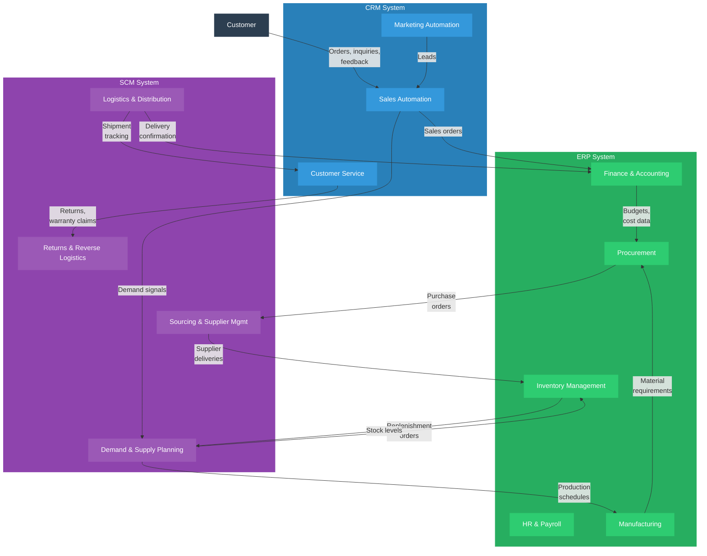

---
tags:
  - technology
  - applications
  - ERP
reading_time: 35
difficulty: Intermediate
---

# Enterprise Applications

## Overview

Enterprise applications are the large-scale software systems that organizations use to manage their core business processes. Unlike desktop productivity tools or departmental databases, these systems operate at the organizational level, integrating data and workflows across multiple functions, geographies, and business units. The three foundational categories -- Enterprise Resource Planning (ERP), Customer Relationship Management (CRM), and Supply Chain Management (SCM) -- together form the operational backbone of most large enterprises. A Fortune 500 company might spend hundreds of millions of dollars on these systems, and the decision of which platforms to adopt, how to implement them, and how to integrate them is among the most consequential technology investments a business leader will encounter.

Understanding enterprise applications is not about learning to configure software. It is about understanding how these systems shape organizational capability. An ERP system does not just record financial transactions -- it enforces business rules, standardizes processes, and creates the single source of truth that enables executive decision-making. A CRM platform does not just store contact information -- it codifies the sales process, captures customer interactions, and generates the pipeline visibility that drives revenue forecasting. An SCM system does not just track shipments -- it orchestrates the complex network of suppliers, manufacturers, warehouses, and logistics providers that deliver products to customers.

The enterprise applications landscape has evolved dramatically over the past three decades. Early systems were monolithic, on-premises installations that required years to implement and massive customization to fit each organization's processes. Today, cloud-based platforms from vendors like Salesforce, SAP S/4HANA Cloud, and Oracle Cloud offer faster deployment, subscription pricing, and continuous updates -- but they also introduce new challenges around data sovereignty, integration complexity, and the tension between standardization and customization. For MBA students, the strategic questions surrounding enterprise applications -- which systems to invest in, how to implement them successfully, and how to manage the organizational change they require -- are among the most practically relevant topics in IT management.

!!! info "Why This Matters for MBA Students"

    Regardless of your functional specialization -- finance, marketing, operations, strategy, or general management -- you will work with enterprise applications throughout your career. If you lead a business unit, you will depend on ERP data for financial reporting, CRM data for customer insights, and SCM data for operational planning. If you participate in a system implementation, you will need to understand why these projects are expensive, why they frequently run over budget, and why the organizational change management component is often more challenging than the technology itself. If you sit in the C-suite or on a board, you will evaluate multi-million-dollar investment decisions in enterprise platforms, weigh the risks of vendor lock-in, and hold leadership accountable for realizing the business value these systems are supposed to deliver. The Hershey Company, Nike, and Lidl each lost hundreds of millions of dollars on failed ERP implementations -- not because the technology was defective, but because the business and organizational dimensions were mismanaged. Understanding enterprise applications at a strategic level will help you avoid these costly mistakes.

---

## Key Concepts

### ERP Systems -- Enterprise Resource Planning

ERP systems are integrated software platforms that manage an organization's core business processes within a single, unified database. The fundamental premise of ERP is simple but powerful: instead of each department maintaining its own siloed system (accounting in one system, HR in another, manufacturing in a third), an ERP consolidates all of these functions into one platform where data flows seamlessly between modules.

#### What ERP Systems Do

Before ERP, organizations typically ran dozens or even hundreds of disconnected systems. The finance department had its general ledger, accounts payable, and accounts receivable systems. HR had its payroll and benefits systems. Manufacturing had its production planning and inventory systems. These systems rarely talked to each other, creating data inconsistencies, manual reconciliation work, and delays in reporting. A simple question like "What is our total cost to serve Customer X?" might require pulling data from five different systems and reconciling it in a spreadsheet.

ERP eliminates this fragmentation by providing a single, integrated platform with a common database. When a sales order is entered, the system automatically updates inventory, triggers procurement if materials are needed, schedules production, creates a shipping order, generates an invoice, and posts the revenue to the general ledger -- all within the same system, in real time.

#### Major ERP Modules

| Module | Functions | Business Value |
|--------|-----------|----------------|
| **Finance & Accounting** | General ledger, accounts payable/receivable, asset management, financial reporting, budgeting | Single source of truth for financial data; faster close cycles; regulatory compliance |
| **Human Resources** | Payroll, benefits administration, talent management, workforce planning, time tracking | Standardized HR processes; accurate labor cost tracking; compliance with labor regulations |
| **Manufacturing** | Production planning, shop floor management, quality control, bill of materials, capacity planning | Optimized production schedules; reduced waste; real-time visibility into manufacturing operations |
| **Procurement** | Purchase orders, vendor management, contract management, spend analysis, sourcing | Lower procurement costs through consolidated purchasing; better vendor performance tracking |
| **Inventory & Warehouse** | Stock management, warehouse operations, demand forecasting, lot tracking | Reduced carrying costs; fewer stockouts; accurate inventory counts |
| **Sales & Distribution** | Order management, pricing, shipping, billing, returns processing | Faster order-to-cash cycles; consistent pricing; improved customer service |
| **Project Management** | Project planning, resource allocation, time tracking, billing for project-based work | Accurate project costing; improved resource utilization; on-time delivery tracking |

#### Major ERP Vendors

**SAP** is the dominant ERP vendor globally, particularly among large enterprises. SAP's flagship product, S/4HANA, is an in-memory ERP suite that runs on SAP's HANA database. SAP holds approximately 22% of the global ERP market and is especially strong in manufacturing, energy, and consumer products. SAP implementations are notoriously complex and expensive, often requiring specialized consulting firms (Accenture, Deloitte, IBM) and multi-year timelines. However, SAP's depth of functionality across industries is unmatched.

**Oracle** is SAP's primary competitor in the large-enterprise ERP space. Oracle's cloud ERP offering, Oracle Fusion Cloud, competes directly with SAP S/4HANA Cloud. Oracle is particularly strong in financial services, telecommunications, and the public sector. Oracle's strategy has been aggressive cloud migration, and the company has invested heavily in AI-powered automation within its ERP modules.

**Microsoft Dynamics 365** targets the mid-market -- organizations too large for small-business accounting software but not large enough to justify the cost and complexity of SAP or Oracle. Dynamics 365 benefits from deep integration with the Microsoft ecosystem (Office 365, Azure, Power BI, Teams), which makes it attractive to organizations already invested in Microsoft's technology stack. It offers modular deployment, meaning organizations can adopt individual modules (finance, supply chain, HR) without committing to the full suite.

**Other notable vendors** include Infor (strong in manufacturing and healthcare), Workday (dominant in cloud HR and financial management for service industries), and NetSuite (an Oracle-owned cloud ERP popular with fast-growing mid-market companies).

#### Implementation Challenges

ERP implementations are among the most difficult technology projects an organization can undertake. Industry research consistently shows that the majority of ERP projects exceed their original budgets and timelines, and a significant minority fail outright. The reasons are examined in depth in the [Implementation Challenges](#implementation-challenges) section below.

---

### CRM Systems -- Customer Relationship Management

CRM systems manage an organization's interactions with current and prospective customers. At their core, CRM platforms maintain a comprehensive record of every customer relationship -- every contact, every conversation, every purchase, every support ticket -- and provide tools for sales, marketing, and customer service teams to manage those relationships effectively.

#### Why CRM Matters

In an era where customer acquisition costs are rising and customer loyalty is declining, the ability to understand, engage, and retain customers is a critical competitive capability. CRM systems provide this capability by creating a 360-degree view of each customer that is accessible to everyone in the organization who interacts with that customer. When a sales representative calls a prospect, they can see every marketing email the prospect has opened, every page they have visited on the company website, and every previous conversation they have had with another representative. When a support agent receives a complaint, they can see the customer's purchase history, contract terms, and lifetime value -- enabling them to make informed decisions about how much effort to invest in resolving the issue.

#### CRM Functional Areas

**Sales Automation** is the foundational CRM capability. It includes lead management (tracking prospective customers through the sales funnel), opportunity management (tracking active deals and their probability of closing), contact and account management (maintaining customer records), pipeline reporting (forecasting future revenue), and activity tracking (logging calls, emails, and meetings). Sales automation transforms the sales process from a collection of individual relationships managed in spreadsheets and email inboxes into a systematic, measurable, and coachable discipline.

**Marketing Automation** extends CRM into the demand generation process. It includes email campaign management, lead scoring (ranking prospects by their likelihood to buy based on behavior and demographics), marketing analytics (measuring campaign ROI), social media management, and customer segmentation. Modern marketing automation platforms can orchestrate complex multi-channel campaigns that automatically adjust messaging based on how each prospect engages.

**Customer Service and Support** manages post-sale interactions. It includes case management (tracking support tickets from creation to resolution), knowledge bases (self-service content for customers), service level management (ensuring issues are resolved within agreed timeframes), and customer satisfaction measurement. Increasingly, customer service modules incorporate AI-powered chatbots and automated routing to improve efficiency.

#### Major CRM Vendors

**Salesforce** is the dominant CRM platform globally, holding approximately 23% of the CRM market. Salesforce pioneered the cloud-based SaaS model for enterprise applications, and its platform has expanded far beyond basic CRM into a comprehensive business application platform. Salesforce's ecosystem includes Sales Cloud, Service Cloud, Marketing Cloud, Commerce Cloud, and an extensive marketplace of third-party applications (AppExchange). The platform's strength lies in its flexibility, its massive ecosystem of integration partners, and its continuous innovation. Its weakness is cost -- a fully deployed Salesforce implementation with enterprise features, integrations, and consulting support can be extremely expensive.

**HubSpot** targets small and mid-sized businesses with a user-friendly, integrated CRM platform that includes marketing, sales, service, and content management tools. HubSpot's freemium model (a robust free CRM with paid add-ons) has made it enormously popular with growing companies. HubSpot's strength is ease of use and rapid deployment; its limitation is that it lacks the depth of customization and enterprise-scale capabilities that large organizations require.

**Microsoft Dynamics 365** offers CRM modules (Sales, Customer Service, Marketing, Field Service) that integrate natively with the Microsoft ecosystem. For organizations already using Microsoft's productivity and cloud tools, Dynamics 365 provides a CRM option that reduces integration complexity. It competes primarily in the mid-market and upper-mid-market.

**Other notable CRM vendors** include Zoho CRM (cost-effective for small businesses), SAP Customer Experience (SAP's CRM offering for organizations already on SAP ERP), and Oracle CX Cloud (strong in industries with complex customer data requirements).

!!! question "Quick Check"
    - A B2B manufacturing company currently tracks customer relationships using spreadsheets and email. The VP of Sales wants Salesforce; the CFO says HubSpot's free tier is "good enough." Using the CRM vendor comparison, what questions would you ask to determine which platform is the right fit -- and what business factors beyond price should drive the decision?
    - How does a CRM system's value change when it is integrated with the company's ERP system versus operating as a standalone tool? Identify two specific business decisions that become possible only with integrated CRM-ERP data.

---

### SCM Systems -- Supply Chain Management

SCM systems manage the end-to-end flow of goods, information, and finances from raw material sourcing through manufacturing, warehousing, transportation, and final delivery to the customer. In a globalized economy where supply chains span dozens of countries and involve hundreds of suppliers, the ability to plan, execute, and monitor supply chain operations is a critical source of competitive advantage.

#### The Scope of SCM

Modern supply chain management encompasses five interconnected processes:

1. **Planning** -- Demand forecasting, supply planning, production scheduling, and inventory optimization. Planning is the strategic brain of the supply chain, using historical data, market intelligence, and increasingly AI to predict what customers will want and how to fulfill that demand efficiently.

2. **Sourcing** -- Supplier selection, procurement, contract negotiation, and supplier performance management. Sourcing determines where materials come from, at what cost, and under what terms.

3. **Manufacturing** -- Production execution, quality management, and shop floor operations. Manufacturing converts raw materials and components into finished products according to the production plan.

4. **Delivery** -- Warehousing, transportation management, order fulfillment, and last-mile logistics. Delivery moves finished products from manufacturing facilities to distribution centers and ultimately to customers.

5. **Returns** -- Reverse logistics, warranty management, and product disposition. Returns management handles the flow of goods back from customers, including repairs, recycling, and disposal.

#### Major SCM Vendors

**SAP SCM** (including SAP Integrated Business Planning and SAP Digital Supply Chain) provides deep supply chain functionality that integrates natively with SAP's ERP platform. SAP is particularly strong in supply chain planning, manufacturing execution, and procurement. Organizations running SAP ERP often adopt SAP's SCM modules to maintain a unified data model.

**Oracle SCM Cloud** is a comprehensive cloud-based SCM platform that covers planning, procurement, manufacturing, inventory, and logistics. Oracle has invested heavily in AI and ML capabilities within its SCM suite, including demand sensing, supply planning optimization, and automated exception management.

**Other notable SCM vendors** include Kinaxis (specializing in concurrent planning), Blue Yonder (formerly JDA, strong in demand planning and retail supply chains), Coupa (focused on procurement and spend management), and Manhattan Associates (warehouse management and transportation).

---

### Integration Challenges

In practice, most organizations do not run a single vendor's complete suite. A company might run SAP for ERP, Salesforce for CRM, and a specialized tool for supply chain planning. Even within a single vendor's ecosystem, different modules often need to share data with legacy systems, partner platforms, and third-party applications. This creates one of the most persistent challenges in enterprise IT: integration.

#### Why Integration Is Difficult

Enterprise application integration is challenging because different systems were designed independently, use different data models, and define key business concepts differently. For example, the "customer" record in a CRM system may include prospects who have never purchased anything, while the "customer" record in an ERP system only includes entities with a financial transaction history. Reconciling these definitions -- and ensuring that changes in one system are reflected in the other -- requires deliberate architectural effort.

#### Integration Approaches

| Approach | How It Works | Strengths | Limitations |
|----------|--------------|-----------|-------------|
| **Point-to-Point** | Direct connections between pairs of systems | Simple to build for a few connections | Becomes unmanageable as the number of systems grows ("spaghetti" architecture) |
| **Middleware / Integration Platform** | A central hub (e.g., MuleSoft, Dell Boomi, Informatica) routes messages between systems | Centralized management; reusable connectors; better monitoring | Adds infrastructure cost and complexity; requires specialized skills |
| **API-Based Integration** | Systems expose APIs that other systems can call to read or write data | Modern, flexible, developer-friendly; supports real-time integration | Requires APIs to be well-designed and documented; API versioning can create compatibility issues |
| **ETL / Data Warehouse** | Data is extracted from source systems, transformed, and loaded into a central warehouse for reporting | Good for analytics and reporting across systems | Not suitable for real-time operational integration; data is a copy, not live |
| **iPaaS (Integration Platform as a Service)** | Cloud-based integration platforms (e.g., Workato, Celigo) that provide pre-built connectors and low-code integration flows | Fast to deploy; reduces need for custom coding; SaaS-friendly | May lack depth for complex enterprise integration scenarios |

#### Data Consistency -- The Master Data Challenge

When the same business entity (a customer, product, supplier, or employee) exists in multiple systems, maintaining consistent data across those systems is a fundamental challenge known as the **master data management** (MDM) problem. Without a deliberate MDM strategy, organizations end up with conflicting data: a customer's address is updated in the CRM but not in the ERP, a product code in the SCM system does not match the product code in the financial system, or a supplier's risk rating in the procurement system is not visible to the supply chain planning team. These inconsistencies create operational errors, undermine reporting accuracy, and erode trust in organizational data.

---

### Best-of-Breed vs. Suite

One of the most significant strategic decisions in enterprise application strategy is whether to adopt a single vendor's integrated suite or to select the best specialized application for each functional area and integrate them together. This is the "best-of-breed vs. suite" decision, and it has meaningful implications for cost, flexibility, integration complexity, and vendor dependency.

#### The Suite Approach

The suite approach means selecting one vendor -- typically SAP, Oracle, or Microsoft -- and implementing their applications across multiple functional areas. The primary advantage is integration: modules from the same vendor are designed to work together, share a common data model, and are supported by a single vendor. This reduces integration cost, simplifies reporting, and provides a consistent user experience across functions.

**Advantages:**

- Pre-built integration between modules eliminates the need for custom middleware
- Single vendor relationship simplifies procurement, contracting, and support
- Consistent data model across functions reduces the master data challenge
- Vendor provides a unified roadmap and coordinated upgrades

**Disadvantages:**

- No vendor is best-in-class in every functional area; you accept compromises
- Deep vendor lock-in makes switching costly and time-consuming
- The vendor's release schedule dictates your upgrade timeline
- Licensing costs for a full suite can be substantial, even for modules you underutilize

#### The Best-of-Breed Approach

The best-of-breed approach means selecting the leading specialized application for each functional area -- for example, Salesforce for CRM, Workday for HR, SAP for manufacturing, and Kinaxis for supply chain planning. Each system excels in its specific domain, providing deeper functionality and more innovative features than a generalist suite module.

**Advantages:**

- Each functional area gets the most capable and innovative tool available
- Reduced dependency on any single vendor
- Ability to swap out individual systems without disrupting the entire landscape
- Specialized vendors are often more responsive to the needs of their specific user community

**Disadvantages:**

- Integration between different vendors' systems must be built and maintained, adding cost and complexity
- Data consistency across systems requires deliberate MDM investment
- Multiple vendor relationships to manage (contracts, SLAs, upgrades, support)
- Users must learn multiple interfaces, and the user experience may be inconsistent

#### The Modern Reality: Hybrid

In practice, most organizations adopt a hybrid approach. They may use SAP for core ERP (finance, manufacturing, procurement) while choosing Salesforce for CRM and a specialized tool for supply chain planning. The key is to make this decision consciously, with a clear integration architecture, rather than allowing the application landscape to grow organically into an unmanageable collection of disconnected systems.

!!! question "Quick Check"
    - Your organization runs a best-of-breed landscape with five different vendors. The CIO estimates that integration maintenance costs $1.2 million annually. At what point would consolidating to a single vendor's suite be worth it, and what non-financial factors might tip the decision even if the suite's TCO is higher?
    - A department head argues, "We should just let each business unit pick its own tools -- they know their needs best." Using the best-of-breed vs. suite framework, explain the long-term organizational risks of this approach and how you would balance local autonomy with enterprise coherence.

---

### Modern Enterprise Application Trends

The enterprise application landscape is evolving rapidly. Several trends are reshaping how organizations acquire, deploy, and manage these critical systems.

#### The Business Case for Enterprise Software

Organizations invest $50-500 million or more in enterprise application implementations because these systems create the **operational backbone** — the integrated technology foundation that enables reliable, consistent, scalable business process execution. Without this backbone, organizations cannot close financial books accurately, fulfill customer orders reliably, or make data-driven decisions with confidence.

The business case for enterprise software investments rests on four pillars: **process standardization** (replacing fragmented processes with consistent enterprise-wide processes), **data integration** (creating a single source of truth), **operational efficiency** (automating routine tasks and reducing cycle times), and **strategic enablement** (providing the data foundation for analytics, AI, and digital transformation).

#### Cloud ERP: The Industry Transition

The enterprise application market is undergoing a generational transition from on-premise to cloud:

- **SAP S/4HANA Cloud** — SAP has set a 2027 deadline for ending support of its legacy ECC systems, forcing thousands of organizations into cloud migration. This is one of the largest forced technology migrations in enterprise IT history, creating a multi-billion dollar consulting market.
- **Oracle Fusion Cloud** — Oracle's cloud-native ERP suite, competitive with SAP in financial services and the public sector. Oracle has been aggressively migrating its installed base to cloud.
- **Two-Tier ERP** — Large organizations increasingly maintain a Tier 1 ERP (SAP or Oracle) at headquarters for consolidated reporting, while deploying lighter Tier 2 cloud ERPs (Microsoft Dynamics 365, Oracle NetSuite) at subsidiaries or regional offices. This balances corporate control with local flexibility.
- **Composable ERP** — An emerging architectural approach that replaces the monolithic ERP with a collection of best-of-breed cloud services connected through APIs and integration platforms. This offers maximum flexibility but requires strong integration architecture and governance.

#### CRM Beyond Sales: The Customer 360

CRM has evolved far beyond sales force automation:

- **Customer 360** — The aspiration to create a unified view of each customer across all touchpoints — sales, marketing, service, commerce, social media. Achieving this requires integrating data from CRM, ERP, marketing automation, support systems, website analytics, and social platforms.
- **Customer Data Platforms (CDPs)** — A new category of technology that aggregates customer data from all sources into a unified profile, enabling personalization at scale. CDPs sit at the intersection of CRM, marketing automation, and data management.
- **CRM + AI** — Every major CRM vendor has embedded AI capabilities: Salesforce Einstein provides predictive lead scoring and opportunity insights; Microsoft Copilot for Dynamics 365 generates meeting summaries and suggests next actions. These AI features are transforming CRM from a system of record into a system of intelligence.
- **CRM as Platform** — Salesforce has evolved from a CRM application into a full application development platform. Organizations build custom applications on Salesforce's platform that extend far beyond traditional CRM.

#### Integration Deep Dive

As the enterprise application landscape becomes more complex, integration has evolved into a strategic capability:

- **API Management** — Organizations expose enterprise application data through managed APIs, enabling developers to build new integrations. API management platforms (Apigee, AWS API Gateway, MuleSoft) provide security, rate limiting, monitoring, and developer portals.
- **iPaaS (Integration Platform as a Service)** — Cloud-based platforms like MuleSoft, Workato, and Celigo provide pre-built connectors for hundreds of cloud applications with low-code integration design. iPaaS has dramatically reduced integration time and cost compared to traditional middleware.
- **Event-Driven Architecture** — Rather than batch processing or polling, event-driven architectures use real-time events (a new order, a price change) to trigger actions across systems. Technologies like Apache Kafka, AWS EventBridge, and Azure Event Grid enable this at enterprise scale.
- **The Composable Enterprise** — Gartner's concept envisions organizations assembling business capabilities from modular, API-connected components rather than monolithic suites. This requires strong integration architecture but enables rapid adaptation.

#### Low-Code / No-Code Platforms

Low-code and no-code platforms are democratizing application development, enabling business users ("citizen developers") to build applications without writing traditional code:

- **Microsoft Power Platform** (Power Apps, Power Automate, Power BI) — Integrated with Microsoft 365 and Dynamics 365, enabling business users to build apps, automate workflows, and create reports using visual designers
- **ServiceNow App Engine** — Low-code development on the ServiceNow platform, particularly for IT service management and HR workflows
- **Mendix and OutSystems** — Enterprise-grade low-code platforms for building complex applications with professional developer features
- **Salesforce Lightning Platform** — Low-code app development within the Salesforce ecosystem

!!! warning "Low-Code Governance"
    Low-code/no-code platforms enable business units to address automation needs without waiting in the IT backlog. However, without governance, this can create a new form of shadow IT — applications built by business users that lack proper security, data governance, and maintenance. Organizations need clear citizen development policies that balance empowerment with oversight.

#### Paths to Go Deeper

For those wanting hands-on familiarity with enterprise applications, several vendors offer free learning:

- **SAP Learning Hub** — Free tier with introductory S/4HANA courses
- **Salesforce Trailhead** ([trailhead.salesforce.com](https://trailhead.salesforce.com)) — Gamified, free learning platform
- **Oracle University** — Free courses on Oracle Cloud ERP
- **Microsoft Learn** ([learn.microsoft.com](https://learn.microsoft.com)) — Free Dynamics 365 and Power Platform training

---

### Implementation Challenges

Enterprise application implementations -- particularly ERP projects -- have a well-documented history of difficulty. Research from Panorama Consulting and other firms consistently reports that 50-75% of ERP implementations fail to meet their original objectives, and roughly 25% are considered outright failures. Understanding why these projects fail is essential for any business leader who will participate in, oversee, or be affected by an enterprise application implementation.

#### Why Implementations Fail

**Underestimating organizational change.** The single most common cause of implementation failure is treating the project as a technology installation rather than an organizational transformation. A new ERP system changes how people do their jobs every day -- the screens they use, the processes they follow, the data they enter, the reports they run. If employees are not prepared for and supported through these changes, they will resist the new system, find workarounds, or revert to old processes. Change management -- communication, training, executive sponsorship, and process redesign -- is not a nice-to-have supplement to the technical implementation; it is the primary determinant of success.

**Excessive customization.** Enterprise application vendors design their systems around industry best practices. When an organization insists on customizing the software to match its existing processes rather than adapting its processes to match the software, costs escalate dramatically, timelines extend, and the organization takes on ongoing technical debt. Every customization must be retested and potentially reworked with each vendor upgrade. The most successful implementations follow a "fit-to-standard" approach, accepting the vendor's standard processes wherever possible and only customizing where there is a genuine, defensible business need.

**Poor data migration.** Moving data from legacy systems into a new enterprise application is one of the most technically complex and underestimated aspects of implementation. Legacy data is often incomplete, inconsistent, formatted differently across systems, and riddled with duplicates. Organizations that do not invest adequate time and resources in data cleansing and migration planning discover problems only after go-live, when bad data causes operational disruptions.

**Inadequate executive sponsorship.** Enterprise application implementations affect every function in the organization and require trade-offs between competing departmental interests. Without strong, visible, and sustained executive sponsorship, these trade-offs do not get resolved, scope creeps, budgets balloon, and the project loses organizational momentum. The most successful implementations have a senior executive (often the CEO or COO) who is personally accountable for the project's success and willing to make difficult decisions.

**Unrealistic scope and timelines.** Organizations frequently attempt to implement too many modules simultaneously ("big bang" approach) or set timelines based on vendor marketing materials rather than organizational readiness. Phased implementations that prioritize the highest-value modules and build organizational capability over time have significantly higher success rates.

!!! question "Quick Check"
    - The Hershey and Lidl cases both involved failures driven by business decisions, not technology defects. If you were the COO sponsoring a new ERP implementation, which two of the five failure factors above would you prioritize addressing first, and what specific actions would you take in the first 90 days of the project?
    - A vendor claims their ERP can be implemented in 6 months. Using the implementation challenges discussed above, what assumptions behind that timeline would you probe, and what evidence would you request before accepting the estimate?

---

## Frameworks & Models

### How ERP, CRM, and SCM Interconnect

The following diagram illustrates how the three major enterprise application categories relate to each other and to the core business processes they support. Data flows between these systems are critical -- a customer order captured in CRM triggers production planning in ERP, which drives material procurement through SCM.

### Major Vendor Comparison

The following table compares the leading enterprise application vendors across key dimensions relevant to MBA-level decision-making.

| Dimension | SAP | Oracle | Microsoft Dynamics 365 | Salesforce |
|-----------|-----|--------|------------------------|------------|
| **Primary strength** | ERP for large enterprises; deepest manufacturing and supply chain functionality | ERP and database; strong in financial services and cloud infrastructure | Mid-market ERP and CRM; Microsoft ecosystem integration | CRM market leader; platform extensibility and ecosystem |
| **Target market** | Large enterprises (> $1B revenue) | Large enterprises | Mid-market ($50M-$5B revenue) | All sizes, primarily mid-market to large enterprise |
| **Deployment model** | On-premises (legacy) and cloud (S/4HANA Cloud) | Cloud-first (Fusion Cloud); on-premises legacy | Cloud-native | Cloud-native (SaaS pioneer) |
| **ERP capabilities** | Industry-leading depth and breadth | Strong; competitive with SAP in finance and procurement | Solid mid-market offering; modular adoption | Not a traditional ERP vendor |
| **CRM capabilities** | Adequate (SAP Customer Experience) | Adequate (Oracle CX Cloud) | Strong mid-market CRM | Industry-leading; dominant market share |
| **SCM capabilities** | Industry-leading | Strong cloud SCM suite | Limited | Not applicable |
| **Ecosystem** | Large consulting and integration partner ecosystem | Strong database and infrastructure ecosystem | Massive (Microsoft partners, Azure, Office 365) | Largest SaaS app marketplace (AppExchange) |
| **Typical implementation timeline** | 12-36+ months | 12-24+ months | 6-18 months | 3-12 months (CRM) |
| **Relative cost** | Highest | High | Moderate | Moderate to high (scales with features) |
| **Key risk** | Implementation complexity; long timelines; high consulting costs | Aggressive sales tactics; complex licensing | May lack depth for large, complex enterprises | Cost escalation as adoption grows; customization complexity |

---

## Real-World Applications

### Example 1: Hershey's ERP Implementation Disaster (1999)

In 1999, The Hershey Company attempted a simultaneous implementation of SAP ERP, Siebel CRM, and Manugistics SCM -- a "big bang" approach that replaced multiple legacy systems at once. The company chose to go live in July, just before its peak Halloween shipping season. The results were catastrophic. The new systems could not process orders correctly, shipments were delayed or lost, and Hershey was unable to deliver $100 million worth of candy to retailers during its most critical selling period. The company's stock dropped 8% in a single day, and the revenue impact lingered for quarters.

**What went wrong:** Hershey violated nearly every best practice in enterprise application implementation. The company attempted to implement three major systems simultaneously rather than phasing the rollout. It chose a go-live date during peak business season rather than during a quiet period. It compressed the implementation timeline to 30 months (from a recommended 48 months) to meet an arbitrary deadline. And it underinvested in testing and change management, leaving users unprepared for the new systems.

**Lesson for MBA students:** The Hershey case demonstrates that enterprise application failure is rarely a technology problem -- it is a project management and organizational change problem. The software worked; the implementation approach did not. Business leaders who sponsor or oversee these projects must insist on realistic timelines, phased rollouts, and adequate investment in testing and training.

### Example 2: Salesforce and the Transformation of CRM

Salesforce, founded in 1999 by Marc Benioff, fundamentally changed the enterprise application market by delivering CRM as a cloud service. At the time, CRM systems like Siebel required on-premises servers, lengthy implementations, and large upfront license fees. Salesforce offered the same functionality through a web browser with monthly subscription pricing and no infrastructure to manage. This SaaS model eliminated the capital expenditure barrier, reduced implementation timelines from months to weeks, and shifted the risk from the buyer to the vendor (if the product did not deliver value, customers could cancel their subscriptions).

By 2025, Salesforce had grown to over $35 billion in annual revenue and held the largest share of the global CRM market. The company's success demonstrated several principles that now define the enterprise application market: cloud delivery is the default model, subscription pricing aligns vendor incentives with customer success, platform ecosystems (Salesforce's AppExchange) create network effects that increase switching costs, and continuous delivery of new features (Salesforce releases three major updates per year) keeps the platform evolving without disruptive upgrade cycles.

**Lesson for MBA students:** Salesforce's success illustrates how the delivery model for enterprise applications can be as strategically important as the functionality itself. The shift from on-premises to cloud did not just change how CRM was deployed -- it changed the economics, the competitive dynamics, and the power balance between vendors and customers.

### Example 3: Lidl's Abandoned SAP Implementation (2018)

Lidl, the German discount grocery chain, spent seven years and an estimated 500 million euros attempting to implement SAP to replace its custom-built inventory management system. In 2018, the company abandoned the project entirely and returned to its legacy system. The core problem was a fundamental misalignment between SAP's data model and Lidl's business processes. SAP's retail module uses retail pricing (the price at which goods are sold to customers) as its primary reference point for inventory valuation. Lidl's existing processes were built around purchase pricing (the cost at which goods are acquired from suppliers). Rather than adapting its processes to SAP's model, Lidl attempted to customize SAP extensively to match its existing approach -- a decision that created escalating complexity, repeated delays, and ultimately an unsustainable project.

**Lesson for MBA students:** The Lidl case illustrates the danger of excessive customization. When an organization insists on making the software match its existing processes rather than adapting processes to the software's design, the result is often a project that consumes enormous resources and delivers nothing. The strategic question is not "Can the software be customized?" (it usually can) but "Should it be customized, and at what cost?" Successful implementations require business leaders to make difficult decisions about which existing processes are truly differentiating and must be preserved, and which are simply familiar habits that should be changed.

---

## Common Pitfalls

!!! warning "Pitfall 1: Treating Implementation as a Technology Project"

    The most common and most costly mistake is framing an enterprise application implementation as an IT project. In reality, it is an organizational transformation project with a significant technology component. When implementation is delegated entirely to IT, business process redesign is neglected, change management is an afterthought, and the organization ends up with expensive new software running the same broken processes. Successful implementations require joint business-IT leadership, dedicated business resources (not just "part-time" business representatives), and a change management program that starts well before go-live and continues well after.

!!! warning "Pitfall 2: Ignoring Total Cost of Ownership"

    Organizations frequently underestimate the true cost of enterprise applications by focusing on license or subscription fees while ignoring implementation consulting, data migration, integration development, training, ongoing maintenance, and the productivity loss during transition. Industry benchmarks suggest that for every dollar spent on ERP software licenses, organizations spend $3-$7 on implementation services. A $10 million software purchase can easily become a $50-$70 million total program when all costs are included. Business leaders must insist on TCO analysis that accounts for the full lifecycle of costs, not just the vendor's sticker price.

!!! warning "Pitfall 3: Underestimating Integration Complexity"

    When organizations adopt a best-of-breed strategy, they sometimes assume that modern cloud applications will seamlessly connect. In practice, integration between different vendors' systems requires deliberate architecture, ongoing maintenance, and investment in middleware or iPaaS platforms. Data format differences, API versioning, error handling, and performance under load all create complexity that is easy to underestimate and expensive to resolve. Every integration point is also a potential failure point -- when the connection between CRM and ERP breaks, orders stop flowing.

!!! warning "Pitfall 4: Going Live Without Adequate Testing and Training"

    Under pressure to meet deadlines and control costs, organizations frequently compress testing and training phases. This is false economy. Users who are not adequately trained will make data entry errors, develop workarounds that undermine data quality, and flood the help desk with support requests. Systems that are not adequately tested will fail in unexpected ways when they encounter real-world data volumes and edge cases. The Hershey case is a cautionary tale: a compressed timeline and insufficient testing turned a manageable project into a $100 million disaster.

---

## Discussion Questions

1. **Best-of-breed vs. suite strategy:** Your organization currently runs SAP for ERP, Salesforce for CRM, and a custom-built supply chain planning tool. The CIO is proposing to consolidate onto SAP's full suite (replacing Salesforce with SAP Customer Experience and the custom SCM tool with SAP Integrated Business Planning) to reduce integration complexity and vendor management overhead. The VP of Sales is strongly opposed, arguing that Salesforce is the best CRM platform and switching would damage sales productivity. How would you structure the analysis to evaluate this decision? What factors beyond technology should influence the choice?

2. **Implementation governance:** You are the COO of a manufacturing company about to begin a $40 million SAP S/4HANA implementation that will touch every business function. The IT department wants to lead the project, but you have seen research showing that IT-led implementations have higher failure rates than business-led ones. How would you structure the governance of this project? Who should the project leader be, and what decision-making authority should they have? How would you balance the need for business ownership with the reality that the IT team holds the technical expertise?

3. **Post-implementation value realization:** Your company completed a major ERP implementation 18 months ago. The system is live and stable, but business leaders are complaining that they have not seen the productivity improvements, cost reductions, or reporting capabilities that were promised in the original business case. The CIO says the technology is working as designed. What would you investigate? What are the most likely reasons that business value has not materialized, and what actions would you take?

---

## Key Takeaways

- **Enterprise applications (ERP, CRM, SCM) form the operational backbone** of modern organizations. They standardize processes, integrate data across functions, and provide the information foundation for executive decision-making.
- **ERP systems** consolidate core business functions (finance, HR, manufacturing, procurement) into a single platform with a common database. SAP, Oracle, and Microsoft Dynamics are the dominant vendors, each serving different market segments.
- **CRM systems** manage customer relationships across sales, marketing, and service. Salesforce dominates the market and pioneered the cloud SaaS delivery model that is now the industry standard.
- **SCM systems** orchestrate the end-to-end supply chain from planning through sourcing, manufacturing, delivery, and returns. They are increasingly powered by AI for demand forecasting and supply optimization.
- **Integration is the persistent challenge** in enterprise application landscapes. Whether you choose a suite or best-of-breed approach, connecting systems and maintaining data consistency requires deliberate architectural investment.
- **The best-of-breed vs. suite decision** is a strategic trade-off between functional depth (best-of-breed) and integration simplicity (suite). Most organizations end up with a pragmatic hybrid.
- **Implementation failure is common** and is overwhelmingly driven by organizational factors -- not technology. Underestimating change management, excessive customization, poor data migration, inadequate executive sponsorship, and unrealistic timelines are the primary culprits.
- **TCO for enterprise applications far exceeds the software cost.** Implementation services, integration, training, and ongoing maintenance typically represent 3-7x the license or subscription cost.
- **Business leaders, not just IT leaders, must own enterprise application decisions** -- from vendor selection through implementation governance to post-implementation value realization.

---

## Further Reading

- Davenport, T. H. (2000). *Mission Critical: Realizing the Promise of Enterprise Systems*. Harvard Business School Press. -- The foundational text on ERP strategy, covering why organizations adopt enterprise systems and why implementations succeed or fail.
- Panorama Consulting Group. (2024). *ERP Report: Trends and Insights*. -- Annual survey of ERP implementation outcomes, timelines, budgets, and satisfaction. Excellent source for current industry benchmarks.
- Monk, E. F., & Wagner, B. J. (2012). *Concepts in Enterprise Resource Planning* (4th Edition). Cengage Learning. -- Textbook covering ERP concepts, SAP functionality, and business process integration. Good for students who want a deeper technical understanding.
- Laudon, K. C., & Laudon, J. P. (2023). *Management Information Systems: Managing the Digital Firm* (17th Edition). Pearson. -- Chapters 9-10 cover enterprise applications, SCM, CRM, and knowledge management from a management perspective.
- Harvard Business School Case: "Hershey Foods: ERP Implementation Failure." -- Detailed case study of the Hershey disaster, widely used in MBA programs.
- Salesforce. (2024). "State of Sales" and "State of Service" Annual Reports. -- Industry research on CRM usage patterns, adoption trends, and ROI benchmarks from the market leader.
- Gartner. (2024). *Magic Quadrant for Cloud ERP for Product-Centric Enterprises*. -- Independent analyst evaluation of ERP vendors, useful for understanding vendor positioning and capabilities.

**Cross-references in this primer:**

- [Make vs. Buy Decision Frameworks](make-vs-buy.md) -- Explores the broader strategic question of building, buying, or subscribing to technology, including enterprise applications.
- [Enterprise Architecture](enterprise-architecture.md) -- Covers how enterprise applications fit within the organization's overall technology landscape and architectural principles.
- [Vendor Management & Procurement](../management/vendor-management.md) -- Discusses how to select, contract with, and manage the vendors who provide enterprise applications and implementation services.
- [IT Budgeting & Financial Management](../governance/it-budgeting.md) -- Examines TCO analysis, CapEx vs. OpEx decisions, and building the business case for enterprise application investments.
- [Digital Transformation](../transformation/digital-transformation.md) -- Discusses how enterprise applications serve as the foundation for broader digital transformation initiatives.
- [Business Process Management](../transformation/bpm.md) -- BPM and process redesign are critical to successful enterprise application implementations.
