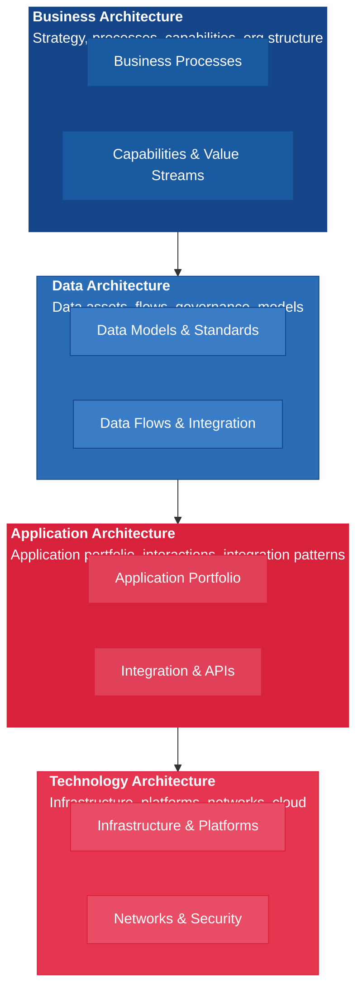
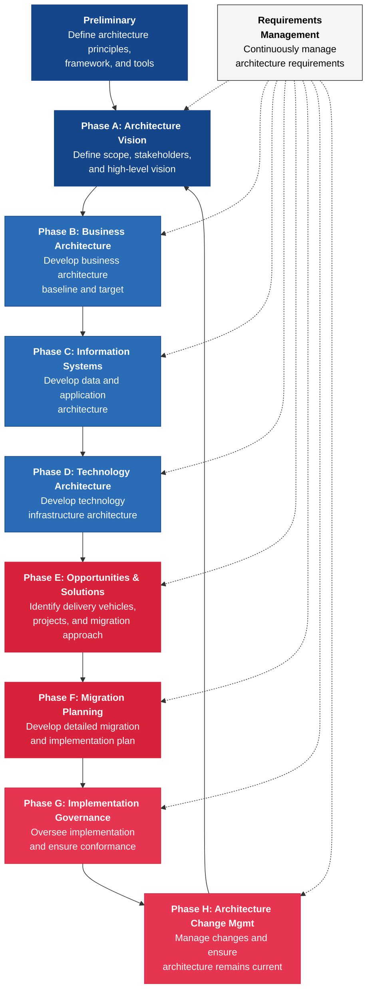
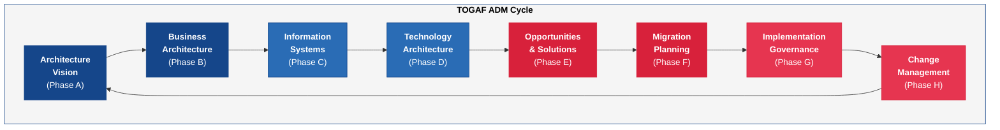

---
tags:
  - technology
  - architecture
  - strategy
reading_time: 30
difficulty: Intermediate
---

# Enterprise Architecture

## Overview

Enterprise architecture (EA) is the discipline of designing and managing an organization's overall technology landscape to ensure that systems, applications, data, and infrastructure work together to support business goals. It provides a comprehensive blueprint — much like an urban master plan for a city — that helps organizations make coherent technology decisions rather than accumulating disconnected systems over time. Without enterprise architecture, large organizations tend to develop a tangled web of redundant applications, incompatible data stores, and fragile integrations that become increasingly expensive to maintain and nearly impossible to change.

The core promise of enterprise architecture is **alignment**: ensuring that every technology investment connects back to a business objective, and that the technology portfolio evolves in a coordinated direction rather than through isolated, department-by-department decisions. EA practitioners create models, diagrams, and standards that document the current state of the enterprise, define a desired future state, and chart a roadmap for getting from one to the other. This work spans the entire organization — from business processes and data flows to application portfolios and physical infrastructure.

For MBA students, enterprise architecture is important because it sits at the intersection of technology and strategy. The CIO and the enterprise architecture team are responsible for translating business strategy into a technology roadmap, but the decisions they make — which systems to retire, which platforms to standardize on, how to modernize legacy applications — have direct implications for budgets, timelines, risk, and competitive positioning. Understanding the fundamentals of EA will help you engage productively with these discussions, whether you are on the receiving end of an architecture review board decision, evaluating a vendor proposal that claims to "fit the architecture," or sitting on an executive committee that must approve a multi-year technology transformation.

???+ abstract "Executive Summary"
    **Reading time:** ~25 minutes | **Difficulty:** Intermediate

    - Enterprise architecture (EA) is the discipline of **designing and governing an organization's technology landscape** to ensure it aligns with business strategy
    - **TOGAF** and **Zachman** are the dominant EA frameworks — TOGAF provides a process (ADM), Zachman provides a classification taxonomy
    - EA operates across **four domains**: business, data, application, and technology architecture
    - The **Architecture Review Board** enforces standards and evaluates proposed changes to prevent architectural drift
    - EA enables informed **make-vs-buy, cloud migration, and integration decisions** by providing a holistic view of the technology landscape

!!! info "Why This Matters for MBA Students"
    As a business leader, you will encounter enterprise architecture in several critical contexts. First, when your organization undertakes a major transformation — migrating to the cloud, implementing a new ERP system, or integrating an acquisition — the enterprise architecture function determines the technical strategy, sequencing, and standards. You need to understand the architecture perspective to evaluate whether the proposed plan is sound. Second, EA governance bodies (such as architecture review boards) approve or reject technology projects based on architectural fit; your project proposals will be evaluated against these standards. Third, enterprise architecture directly affects IT budgets: a well-governed architecture reduces duplication and technical debt, while a poorly managed one drives costs up year over year. Finally, in consulting and strategy roles, you will frequently see enterprise architecture assessments as inputs to technology due diligence, digital transformation roadmaps, and post-merger integration plans.

---

## Key Concepts

### What is Enterprise Architecture?

Enterprise architecture is both a **discipline** and an **artifact**. As a discipline, it is the ongoing practice of analyzing, designing, planning, and governing an organization's technology landscape. As an artifact, it is the set of blueprints, models, standards, and roadmaps that document the current and future states of the enterprise.

The purpose of EA is threefold:

1. **Strategic Alignment** — Ensure that technology investments directly support business strategy and objectives. Every system, application, and infrastructure component should trace back to a business need.
2. **Complexity Management** — Provide a structured way to understand and manage the enormous complexity of modern enterprise IT environments, which may include hundreds of applications, dozens of databases, multiple cloud platforms, and thousands of integrations.
3. **Change Enablement** — Create a roadmap that allows the organization to evolve its technology portfolio in a coordinated, cost-effective manner rather than through ad hoc, project-by-project decisions.

The business value of enterprise architecture is significant. Organizations with mature EA practices report faster time-to-market for new capabilities, lower IT operating costs (through reduced redundancy and standardization), better risk management, and smoother integrations during mergers and acquisitions. Conversely, organizations without EA discipline often find themselves locked into aging systems, unable to integrate new technologies, and spending a disproportionate share of their IT budget on maintaining the status quo rather than investing in innovation.

### The Four Architecture Domains

Enterprise architecture is typically organized into four interconnected domains. Each domain addresses a different layer of the enterprise, and together they provide a complete picture of how the organization operates and how technology supports it.

#### Business Architecture

Business architecture defines the business strategy, governance structure, organizational model, and key business processes. It answers the question: *What does the business do, and how does it create value?*

- **Business Capabilities** — The fundamental abilities the organization needs to execute its strategy (e.g., "order fulfillment," "customer onboarding," "financial reporting"). Capabilities are stable over time even as the processes and technologies that support them change.
- **Value Streams** — End-to-end sequences of activities that deliver value to a stakeholder (e.g., "quote to cash," "hire to retire," "idea to product").
- **Organizational Structure** — How business units, functions, and roles are organized and how they interact.
- **Business Process Models** — Detailed descriptions of how work flows through the organization.

Business architecture is the starting point for all other architecture domains because technology exists to serve the business — not the other way around.

#### Data Architecture

Data architecture defines the structure, flow, and governance of an organization's data assets. It answers the question: *What data does the organization have, where does it reside, how does it flow, and who is responsible for it?*

- **Data Models** — Logical and physical models that define entities, relationships, and attributes (e.g., "Customer," "Order," "Product").
- **Data Standards** — Rules about data formats, naming conventions, and quality requirements.
- **Data Flows** — How data moves between systems, including ETL processes, API integrations, and real-time data streams.
- **Master Data Management** — Strategies for maintaining a single, authoritative source for critical business data like customer records, product catalogs, and financial hierarchies.

Poor data architecture is one of the most common root causes of failed IT projects. When data is inconsistent, duplicated, or trapped in silos, even the best application and technology architecture cannot compensate.

#### Application Architecture

Application architecture defines the portfolio of applications the organization uses, how they interact with each other, and how they support business capabilities. It answers the question: *What software does the organization run, and how do the pieces fit together?*

- **Application Portfolio** — An inventory of all applications, their business owners, lifecycle status (invest, maintain, retire), and technology stack.
- **Integration Patterns** — How applications exchange data and trigger processes across the portfolio (point-to-point, enterprise service bus, API gateway, event-driven).
- **Application Rationalization** — The process of identifying redundant, overlapping, or underperforming applications and consolidating them.
- **Build vs. Buy Decisions** — Determining which applications should be custom-built, purchased as COTS products, or subscribed to as SaaS (see [Make vs. Buy](make-vs-buy.md) for a detailed discussion of these frameworks).

A typical large enterprise runs between 500 and 2,000 applications. Without application architecture discipline, this portfolio grows uncontrollably as different departments purchase overlapping tools.

#### Technology Architecture

Technology architecture defines the hardware, software platforms, networks, and infrastructure that underpin the application and data layers. It answers the question: *What infrastructure does the organization operate, and how is it deployed?*

- **Infrastructure Components** — Servers, storage, networking equipment, and cloud platforms (IaaS, PaaS).
- **Platform Standards** — Approved operating systems, database engines, middleware, and container orchestration platforms.
- **Network Architecture** — How locations, data centers, and cloud environments are connected, including VPN tunnels, load balancers, and firewalls.
- **Cloud Strategy** — The organization's approach to public, private, and hybrid cloud deployment (see [Cloud Computing](cloud-computing.md) for more detail).

Technology architecture decisions have long lifespans and high switching costs. Choosing a cloud provider, a database platform, or a network architecture creates dependencies that can last a decade or more.

!!! question "Quick Check"
    - Your company's sales division purchased a new CRM tool without consulting the enterprise architecture team. Using the four architecture domains, trace the downstream effects this uncoordinated decision could have on data architecture, application architecture, and technology architecture.
    - A newly hired CIO says, "We should start our EA effort with technology architecture -- that is where the money is spent." Using the domain hierarchy, explain why this bottom-up approach is likely to produce a misaligned architecture and where you would start instead.

### TOGAF — The Open Group Architecture Framework

TOGAF is the most widely adopted enterprise architecture framework in the world. Developed and maintained by The Open Group, an industry consortium, TOGAF provides a structured approach for designing, planning, implementing, and governing enterprise architecture. It is used by organizations across industries and is supported by a professional certification program with hundreds of thousands of certified practitioners globally.

TOGAF is not a rigid methodology that must be followed step by step. Rather, it is a **framework** — a set of concepts, tools, templates, and recommended practices that organizations adapt to their specific context. Its centerpiece is the **Architecture Development Method (ADM)**, an iterative cycle that guides architects through the process of creating and maintaining an enterprise architecture.

#### The ADM Cycle

The ADM is the core engine of TOGAF. It consists of a preliminary phase plus eight phases arranged in a cycle, with a requirements management activity at the center that feeds into every phase.

| Phase | Purpose | Key Outputs |
|-------|---------|-------------|
| **Preliminary** | Establish the architecture capability, define principles, select tools and frameworks | Architecture principles, governance framework |
| **A: Architecture Vision** | Define the scope of the architecture effort, identify stakeholders, create a high-level vision | Architecture vision document, stakeholder map, statement of architecture work |
| **B: Business Architecture** | Document the current and target business architecture | Business capability map, value stream models, gap analysis |
| **C: Information Systems** | Develop the data architecture and application architecture | Data models, application portfolio analysis, gap analysis |
| **D: Technology Architecture** | Define the technology infrastructure needed to support applications and data | Technology standards, infrastructure diagrams, gap analysis |
| **E: Opportunities & Solutions** | Identify projects and work packages that will close the gaps between current and target states | Project list, transition architectures, implementation roadmap |
| **F: Migration Planning** | Prioritize projects, develop detailed implementation and migration plans | Migration plan, cost-benefit analysis, risk assessment |
| **G: Implementation Governance** | Provide architectural oversight during implementation to ensure projects conform to the architecture | Architecture compliance reviews, deviation approvals |
| **H: Architecture Change Management** | Manage changes to the architecture as new requirements emerge and the business environment evolves | Change requests, updated architecture artifacts |
| **Requirements Management** | Continuously manage and validate architecture requirements throughout all phases | Requirements repository, traceability matrix |

The ADM is explicitly designed to be **iterative**. Organizations do not complete one full cycle and stop — they continuously cycle through the phases as the business evolves, new technologies emerge, and the gap between the current state and the target state shifts.

#### Key TOGAF Concepts for Business Leaders

- **Architecture Repository** — A centralized store of all architecture artifacts, standards, guidelines, and reference models. Think of it as the organization's "single source of truth" for architecture decisions.
- **Architecture Building Blocks (ABBs)** — Reusable components that define what functionality is needed without specifying a particular product or technology (e.g., "identity management capability").
- **Solution Building Blocks (SBBs)** — Specific products or technologies that implement the ABBs (e.g., "Microsoft Entra ID for identity management").
- **Architecture Principles** — High-level guidelines that inform architecture decisions (e.g., "data is a shared asset," "buy before build," "cloud-first for new workloads").
- **Transition Architectures** — Intermediate states between the current architecture and the target architecture. Because large transformations cannot happen overnight, transition architectures define logical stopping points along the way.

### Zachman Framework

The Zachman Framework is a classification schema for organizing and categorizing architectural artifacts. Developed by John Zachman in the 1980s while working at IBM, it is one of the oldest and most enduring frameworks in the enterprise architecture discipline. Unlike TOGAF, which provides a process methodology (the ADM), the Zachman Framework provides an **ontology** — a structured way to describe what exists in the enterprise from multiple perspectives.

#### The 6x6 Matrix

The Zachman Framework is organized as a two-dimensional matrix with six rows (perspectives) and six columns (interrogatives). Each cell in the matrix represents a specific type of architectural artifact.

**Columns (The Six Interrogatives):**

| Column | Interrogative | Focus |
|--------|--------------|-------|
| 1 | **What** (Data) | What things are important to the business? |
| 2 | **How** (Function) | How does the business work? |
| 3 | **Where** (Network) | Where does the business operate? |
| 4 | **Who** (People) | Who is involved and responsible? |
| 5 | **When** (Time) | When do things happen? |
| 6 | **Why** (Motivation) | Why does the business do what it does? |

**Rows (The Six Perspectives):**

| Row | Perspective | Stakeholder | Focus Level |
|-----|-----------|-------------|-------------|
| 1 | **Executive / Scope** | Planner (CEO, board) | Business context and scope — what the enterprise is about |
| 2 | **Business Management / Concepts** | Owner (business executives) | Business concepts and models |
| 3 | **Architect / Logic** | Designer (enterprise architect) | Logical design and system models |
| 4 | **Engineer / Physics** | Builder (system designer) | Physical design, technology constraints |
| 5 | **Technician / Component** | Implementer (programmer, network engineer) | Detailed specifications and code |
| 6 | **Enterprise / Operations** | Participant (user, operator) | The functioning enterprise as built |

Each of the 36 cells contains a specific type of artifact. For example:

- Row 1 (Executive), Column 1 (What) = A list of things important to the business (e.g., products, customers, locations)
- Row 3 (Architect), Column 2 (How) = A logical process model showing how business functions are structured
- Row 4 (Engineer), Column 3 (Where) = A technology architecture showing where systems are deployed

#### How to Use the Zachman Framework

The Zachman Framework is not a methodology — it does not tell you what to do first, second, or third. Instead, it serves as a **classification system** that helps organizations:

- **Identify gaps** — If certain cells in the matrix are empty, the organization lacks documentation of that perspective for that dimension. This makes risk visible.
- **Organize artifacts** — When you create a business process model, a data diagram, or a network topology, the Zachman Framework tells you exactly where it fits in the overall architecture.
- **Communicate across audiences** — The row structure ensures that artifacts are created at the right level of detail for the right audience. The CEO does not need to see database schemas (Row 5), and the DBA does not need to see business motivation models (Row 1).
- **Ensure completeness** — By explicitly defining 36 categories of architectural description, the framework highlights dimensions that organizations commonly neglect (such as "When" and "Why").

### Legacy Modernization

One of the most important practical applications of enterprise architecture is managing the modernization of legacy systems — older technology platforms that still run critical business processes but are increasingly expensive to maintain, difficult to integrate, and risky to operate. Legacy modernization is a perennial challenge for large organizations, with some estimates suggesting that 60-80% of enterprise IT budgets are spent maintaining existing systems rather than building new capabilities.

#### Why Legacy Systems Persist

Legacy systems endure for several reasons that business leaders should understand:

- **Embedded business logic** — Decades of business rules, exceptions, and customizations are coded into legacy systems. No one fully understands all of these rules, making replacement risky.
- **Integration dependencies** — Legacy systems are deeply woven into the enterprise through hundreds or thousands of integration points with other systems.
- **Organizational inertia** — The people who know the legacy systems are comfortable with them, and replacement projects are expensive, time-consuming, and risky.
- **"If it ain't broke, don't fix it"** — Legacy systems are often highly reliable precisely because they have been running for years. The risk of introducing new problems during modernization can feel greater than the risk of continuing with the status quo.

#### Three Modernization Strategies

Enterprise architects typically consider three primary strategies for legacy modernization, each with different risk profiles, timelines, and costs:

**Strangler Fig Pattern**

Named after the strangler fig tree that gradually envelops its host, this strategy involves building new functionality around the legacy system and incrementally routing traffic and processes to the new system. Over time, the legacy system is "strangled" as more and more of its functions are replaced, until it can be decommissioned entirely.

- **Advantages**: Low risk because changes are incremental; allows continuous delivery of business value; the legacy system remains available as a fallback.
- **Disadvantages**: Can take years to complete; requires maintaining two systems in parallel during the transition; the integration layer between old and new systems can become complex.
- **Best for**: Large, complex systems where a full replacement would be too risky or disruptive.

**Parallel Run**

In a parallel run approach, the new system is built and deployed alongside the legacy system, and both systems process the same transactions simultaneously for a period of time. The outputs are compared to validate that the new system produces correct results before the legacy system is retired.

- **Advantages**: Provides high confidence that the new system works correctly; allows the organization to fall back to the legacy system if problems are discovered.
- **Disadvantages**: Expensive because both systems must be operated and staffed simultaneously; operationally burdensome to reconcile differences between the two systems; extends the timeline.
- **Best for**: Mission-critical financial systems, regulated industries, or any situation where data accuracy is paramount and errors would have severe consequences.

**Big Bang Migration**

A big bang migration replaces the legacy system with the new system in a single cutover event — often over a weekend or holiday period. On Friday the organization runs on the old system; on Monday it runs on the new one.

- **Advantages**: Fastest approach once the new system is ready; eliminates the cost and complexity of running two systems in parallel; provides a clean break from legacy technology.
- **Disadvantages**: Highest risk — if the new system fails, there may be no fallback; requires exhaustive testing before cutover; any defects missed in testing will be discovered in production.
- **Best for**: Smaller systems, situations where parallel operation is impractical, or when the legacy system is failing and urgency outweighs risk concerns.

!!! question "Quick Check"
    - A logistics company needs to replace a 25-year-old mainframe system that handles $2 billion in annual freight billing. The CEO wants it done in 12 months. Which modernization strategy would you recommend and why? What risks would you highlight if the CEO insists on a big bang approach?
    - Compare the strangler fig pattern to the parallel run approach. For a company with limited IT staff but a high tolerance for extended timelines, which strategy is more practical and what trade-offs does it introduce?
    - When might a legacy system NOT need modernization at all, despite being old? What business conditions would justify keeping it in place?

### Architecture Governance

Architecture governance is the set of processes, organizational structures, and standards that ensure technology decisions are made consistently and in alignment with the enterprise architecture. Without governance, architecture remains a theoretical exercise — teams make ad hoc technology choices, redundant systems proliferate, and the carefully crafted architecture roadmap is ignored.

#### Key Governance Mechanisms

**Architecture Review Board (ARB)**

The ARB is a cross-functional committee, typically composed of senior architects, business representatives, and IT leadership, that reviews and approves (or rejects) proposed technology changes against the enterprise architecture standards. Any project that introduces a new technology, builds a new integration, or deviates from approved standards must present its case to the ARB.

- **What it reviews**: New project proposals, technology selection decisions, exception requests (when a project wants to deviate from standards), and major architectural changes.
- **How it works**: Project teams submit an architecture assessment to the ARB, which evaluates the proposal against the organization's architecture principles, standards, and roadmap. The ARB may approve, approve with conditions, or reject the proposal.

**Architecture Principles and Standards**

Architecture principles are high-level guidelines that inform decision-making. Architecture standards are more specific — they define approved technologies, platforms, and patterns that projects must use. Together, they provide the criteria against which the ARB evaluates proposals.

Examples of architecture principles:

- "Cloud-first for all new workloads"
- "Data is a shared enterprise asset, not owned by individual departments"
- "Buy before build, unless the capability is a competitive differentiator"
- "All system-to-system communication must go through the API gateway"

**Compliance and Waiver Processes**

Not every project can or should conform to every standard. Architecture governance includes a formal waiver process for exceptions. The key is that exceptions are documented, time-limited, and tracked — an organization knows exactly where it has deviated from standards and has a plan to remediate.

**Technical Debt Management**

Architecture governance includes the identification and management of technical debt — the accumulation of shortcuts, workarounds, and deferred maintenance that increases the cost and risk of future changes. Mature governance functions maintain a technical debt registry and allocate a portion of each release cycle to debt reduction.

!!! question "Quick Check"
    - A project team requests a waiver from the architecture standard to use a non-approved database technology for a "small pilot project." As an ARB member, what questions would you ask before granting the waiver, and what conditions would you attach to limit long-term risk?
    - How would you explain the value of an Architecture Review Board to a business unit leader who views it as bureaucratic overhead that slows down their projects? What concrete business outcomes can governance deliver that justify the added time?

---

## Frameworks & Models

### The TOGAF ADM Cycle

The following diagram illustrates the iterative nature of the TOGAF Architecture Development Method. Note how each phase builds upon the previous one and how requirements management is a continuous activity that influences every phase.

### Comparing TOGAF and Zachman

=== "TOGAF"

    **Developed by**: The Open Group

    **Type**: Architecture development methodology and framework

    **Purpose**: Provides a step-by-step process (the ADM) for developing, maintaining, and governing enterprise architecture. TOGAF tells you **how to do** enterprise architecture.

    **Key features**:

    - The ADM cycle guides architecture development through eight phases
    - Architecture Repository stores all artifacts, standards, and reference models
    - Architecture Building Blocks (ABBs) and Solution Building Blocks (SBBs) define reusable components
    - Architecture principles and governance frameworks ensure consistency
    - Transition architectures define intermediate states on the path to the target state
    - Enterprise Continuum classifies architecture assets from generic to organization-specific

    **Strengths**:

    - Provides a clear, repeatable process that teams can follow
    - Widely adopted with a large community and certification ecosystem
    - Flexible and adaptable to different organizational contexts
    - Strong governance and compliance mechanisms built in

    **Limitations**:

    - Can be perceived as heavyweight for small organizations
    - The ADM cycle can feel bureaucratic if applied too rigidly
    - Requires significant organizational commitment and skilled architects

=== "Zachman"

    **Developed by**: John Zachman (originally at IBM, 1987)

    **Type**: Architecture classification taxonomy (ontology)

    **Purpose**: Provides a structured way to organize and categorize architectural artifacts. Zachman tells you **what to describe** in enterprise architecture.

    **Key features**:

    - 6x6 matrix with six perspectives (rows) and six interrogatives (columns)
    - Each of the 36 cells defines a unique type of architectural artifact
    - Perspectives range from executive (Row 1) to operational (Row 6)
    - Interrogatives cover What, How, Where, Who, When, and Why
    - Framework is technology-independent and industry-neutral

    **Strengths**:

    - Provides a comprehensive checklist for architecture documentation
    - Ensures completeness — empty cells reveal gaps in documentation
    - Audience-appropriate — each row targets a different stakeholder group
    - Simple and intuitive once the matrix structure is understood
    - Stable — the framework has not changed fundamentally since its inception

    **Limitations**:

    - Does not provide a process methodology — you need a separate method (like TOGAF's ADM) to develop the artifacts
    - The 36-cell matrix can seem theoretical or academic to practitioners
    - Does not address governance, compliance, or organizational change

### TOGAF vs. Zachman Comparison

| Dimension | TOGAF | Zachman Framework |
|-----------|-------|-------------------|
| **What It Is** | A process framework and methodology | A classification taxonomy (ontology) |
| **Core Question** | *How* do we develop enterprise architecture? | *What* artifacts do we need to describe the enterprise? |
| **Central Component** | Architecture Development Method (ADM) | 6x6 classification matrix |
| **Process Guidance** | Extensive — eight-phase iterative cycle | None — it is not a process methodology |
| **Governance** | Built-in governance mechanisms (ARB, compliance reviews) | No governance mechanisms included |
| **Certification** | TOGAF Foundation and Certified (individual certifications via The Open Group) | No formal certification program |
| **Adoption** | Most widely used EA framework globally | Widely referenced as a foundational EA taxonomy |
| **Flexibility** | Highly adaptable — organizations customize the ADM to their needs | Fixed structure — the 36 cells are invariant |
| **Best Used For** | Planning and executing EA programs end-to-end | Ensuring completeness and organizing architecture artifacts |
| **Relationship** | Can use Zachman as an organizing framework within TOGAF | Can use TOGAF's ADM as the process to populate Zachman cells |

!!! tip "In Practice: TOGAF + Zachman Together"
    Many organizations use TOGAF and Zachman as complementary tools. TOGAF's ADM provides the process for developing architecture artifacts, while the Zachman matrix ensures that the artifacts cover all necessary perspectives and dimensions. Think of TOGAF as the "how" and Zachman as the "what." Using them together gives you both a repeatable process and a comprehensive classification system.

---

## Real-World Applications

### Example 1: A Global Bank Consolidates After a Merger

When two large regional banks merged, the combined entity inherited two of everything — two core banking platforms, two CRM systems, two data warehouses, two mobile banking applications, and more than 1,200 total applications across the two portfolios. Without a disciplined approach, the integration would have resulted in years of chaos and billions in redundant operating costs.

The newly appointed CIO established an enterprise architecture function and adopted TOGAF as the architecture development methodology. The EA team used the ADM cycle to:

- **Phase A (Architecture Vision)**: Define the target state — a single, unified technology platform for the combined bank, with a three-year migration timeline.
- **Phases B-D**: Document the business, data, application, and technology architectures for both legacy organizations, then define the target architecture for the merged entity.
- **Phase E (Opportunities & Solutions)**: Identify 47 discrete migration projects, grouped into three transition architectures that would deliver value incrementally.
- **Phases F-G**: Develop a migration plan and establish an ARB to govern every integration decision.

The result: the bank completed application rationalization from 1,200 to 650 applications within 30 months, achieving over $180 million in annual IT cost savings while maintaining uninterrupted customer service throughout the transition.

### Example 2: A Retailer Modernizes Its Legacy POS System

A national retailer had been running a 20-year-old POS system across 800 stores. The legacy system was written in COBOL, maintained by a shrinking team of specialists nearing retirement, and unable to support modern capabilities like mobile payments, loyalty integration, and real-time inventory visibility. The architecture team evaluated the three modernization strategies:

- **Big bang** was rejected because the risk of a nationwide POS outage during the holiday season was unacceptable.
- **Parallel run** was rejected because operating two POS platforms simultaneously across 800 stores was operationally impractical and prohibitively expensive.
- **Strangler fig** was selected as the modernization strategy.

The EA team designed an API layer between the legacy POS and the new cloud-native platform. New capabilities (mobile payments, loyalty) were built on the new platform and routed through the API layer, while the legacy system continued to handle core transaction processing. Over 18 months, functionality was migrated store by store, region by region. The legacy system was decommissioned after the final region cutover, with zero unplanned downtime.

### Example 3: A Healthcare System Implements Architecture Governance

A large hospital system with 12 facilities had no formal architecture governance. Each hospital selected its own clinical and administrative systems independently. The result was 8 different EHR platforms, 5 different patient scheduling systems, and no ability to share patient data across facilities. A patient who visited two hospitals within the same system appeared as two different patients with no linked records.

The new CIO implemented an architecture governance program:

- An **ARB** was established, requiring all new technology purchases above $100,000 to undergo architecture review.
- **Architecture principles** were defined, including "one patient, one record" and "no new integration without API standards compliance."
- A **technical debt registry** cataloged all duplicate systems and non-standard integrations, with a prioritized remediation roadmap.
- Using the Zachman Framework's perspectives, the team ensured that architecture documentation addressed all stakeholder levels — from the board (business context and motivation) to the clinical IT teams (detailed specifications and deployment models).

Within three years, the system consolidated to two EHR platforms (with a roadmap to one), achieved system-wide patient record linking, and reduced IT spending on redundant systems by 25%.

---

## Common Pitfalls

!!! warning "Ivory Tower Architecture"
    The most common failure mode in enterprise architecture is creating elaborate models, frameworks, and standards that exist only in PowerPoint presentations and are ignored by the project teams actually building systems. This happens when the EA function operates in isolation from delivery teams, producing artifacts that are too abstract, too detailed, or too disconnected from real project timelines and constraints. Effective EA requires continuous engagement with project teams, pragmatic standards that balance purity with practicality, and a willingness to adapt the architecture based on ground-level feedback.

!!! warning "Boiling the Ocean"
    Some organizations attempt to document the entire enterprise — every business process, every data element, every application, every server — before making any architecture decisions. This "boil the ocean" approach takes years, costs millions, and produces documentation that is outdated before it is finished. Mature EA programs focus on the areas of highest business impact first, creating "just enough" architecture to guide decision-making while acknowledging that some areas can be documented later or at a lower level of detail.

!!! warning "Ignoring Legacy Realities"
    A target architecture that assumes legacy systems can be replaced quickly and cheaply is a fantasy. Legacy modernization is expensive, risky, and time-consuming. Enterprise architects who design target states without realistic transition plans — including the strangler fig patterns, parallel runs, and multi-year migration timelines that legacy systems require — will produce roadmaps that no one follows. The gap analysis between current and target state must include a sober assessment of legacy constraints, organizational capacity for change, and the business appetite for migration risk.

!!! warning "Architecture Without Governance"
    An enterprise architecture without governance is just documentation. If there is no ARB reviewing project proposals, no compliance process enforcing standards, and no consequence for ignoring the architecture, then teams will continue making independent technology decisions. The architecture becomes an expensive shelf decoration while the actual technology landscape diverges further from the plan. Governance is not optional — it is the mechanism that transforms architecture from aspiration into reality.

---

## Discussion Questions

1. **Architecture and M&A Strategy**: Your company is acquiring a competitor that runs an entirely different technology stack — different ERP, different CRM, different cloud provider. The CEO wants the integration completed within 18 months. The enterprise architecture team warns that a rushed integration could destabilize both organizations. Using TOGAF's ADM cycle and the concept of transition architectures, how would you advise the executive team on sequencing the technology integration? What would your first, second, and third transition architectures look like?

2. **Legacy Modernization Trade-offs**: You are the CIO of an insurance company whose core policy administration system is a 30-year-old mainframe application that processes $4 billion in premiums annually. The system works reliably but cannot support digital customer experiences or real-time analytics. The CFO wants to know why replacement should cost $200 million and take five years. Using the three modernization strategies, how would you frame the options, risks, and trade-offs for the board? Which strategy would you recommend and why?

3. **Governance vs. Agility**: A fast-growing technology company has adopted enterprise architecture governance, including an ARB that reviews all new technology decisions. Product teams complain that the ARB adds two weeks to their development cycle and prevents them from adopting cutting-edge tools. The VP of Engineering argues that governance is killing innovation. The CIO argues that without governance, the company will accumulate unsustainable technical debt. How would you balance these concerns? Is it possible to have effective architecture governance that does not slow down agile teams?

---

## Key Takeaways

- **Enterprise architecture** is the discipline of designing and governing an organization's technology landscape to ensure alignment with business strategy. It provides the blueprint that connects business needs to technology decisions.
- The **four architecture domains** — Business, Data, Application, and Technology — provide a complete, layered view of the enterprise. Business architecture is always the starting point because technology exists to serve the business.
- **TOGAF** is the most widely adopted EA framework, providing a structured process (the ADM cycle) for developing, maintaining, and governing enterprise architecture through eight iterative phases.
- **The Zachman Framework** is a classification taxonomy (6x6 matrix) that organizes architectural artifacts by perspective (who is looking) and interrogative (what they are looking at). It ensures completeness but does not prescribe a process.
- **TOGAF and Zachman are complementary**: TOGAF provides the "how" (process), Zachman provides the "what" (classification). Mature organizations often use both.
- **Legacy modernization** is one of the most important practical applications of EA. The three primary strategies — strangler fig, parallel run, and big bang — offer different trade-offs between risk, cost, and speed.
- **Architecture governance** — including ARBs, architecture principles, standards, and compliance processes — is the mechanism that turns architecture from aspiration into reality. Without governance, architecture is just documentation.
- **Technical debt** accumulates when organizations take shortcuts or defer maintenance. Architecture governance includes tracking and managing technical debt as a first-class concern.
- **Effective EA is pragmatic, not perfect** — focus on the highest-impact areas first, produce "just enough" documentation to guide decisions, and engage continuously with delivery teams rather than operating as an ivory tower.

---

## Further Reading

- **The Open Group.** *TOGAF Standard, Version 9.2.* The Open Group, 2018. The authoritative reference for TOGAF, available from [opengroup.org](https://www.opengroup.org/togaf). Provides the complete ADM cycle, architecture content framework, and governance guidance.
- **Zachman, John A.** "A Framework for Information Systems Architecture." *IBM Systems Journal* 26, no. 3 (1987): 276-292. The original paper that introduced the Zachman Framework, still relevant and frequently cited.
- **Ross, Jeanne W., Peter Weill, and David C. Robertson.** *Enterprise Architecture as Strategy: Creating a Foundation for Business Execution.* Harvard Business School Press, 2006. Connects enterprise architecture to business strategy and operating models — highly relevant for MBA students.
- **Hohpe, Gregor.** *The Software Architect Elevator: Redefining the Architect's Role in the Digital Enterprise.* O'Reilly Media, 2020. A modern, accessible perspective on how enterprise architects create value in cloud-era organizations.
- **Bloomberg, Jason.** *The Agile Architecture Revolution: How Cloud Computing, REST-Based SOA, and Mobile Computing Are Changing Enterprise IT.* Wiley, 2013. Explores how traditional EA practices must adapt to agile, cloud-native environments.
- **ITEC-617 Course Textbook**: See the assigned readings on enterprise architecture for additional context on how these frameworks apply in practice.

**Cross-references within this primer:**

- [IT Governance Frameworks](../governance/frameworks.md) — COBIT, ITIL, and ISO/IEC 38500 provide the governance structures that enterprise architecture operates within.
- [Make vs. Buy Decision Frameworks](make-vs-buy.md) — Application architecture decisions frequently involve make-vs-buy trade-offs.
- [Cloud Computing Strategy](cloud-computing.md) — Cloud strategy is a critical component of technology architecture.
- [IT-Business Alignment](../governance/it-business-alignment.md) — Enterprise architecture is a primary mechanism for achieving IT-business alignment.
- [Digital Transformation](../transformation/digital-transformation.md) — Enterprise architecture provides the structural foundation for digital transformation initiatives.
