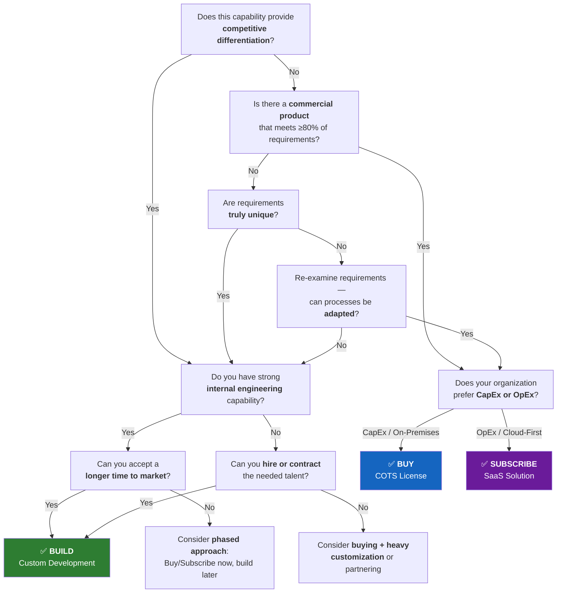
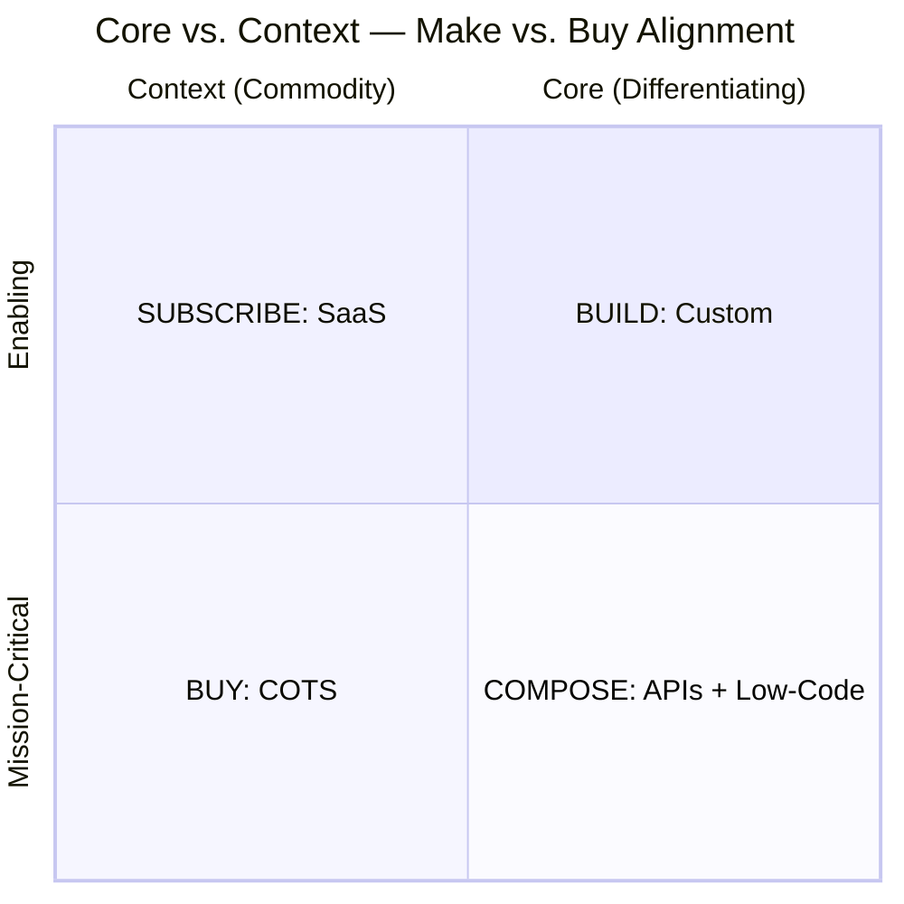
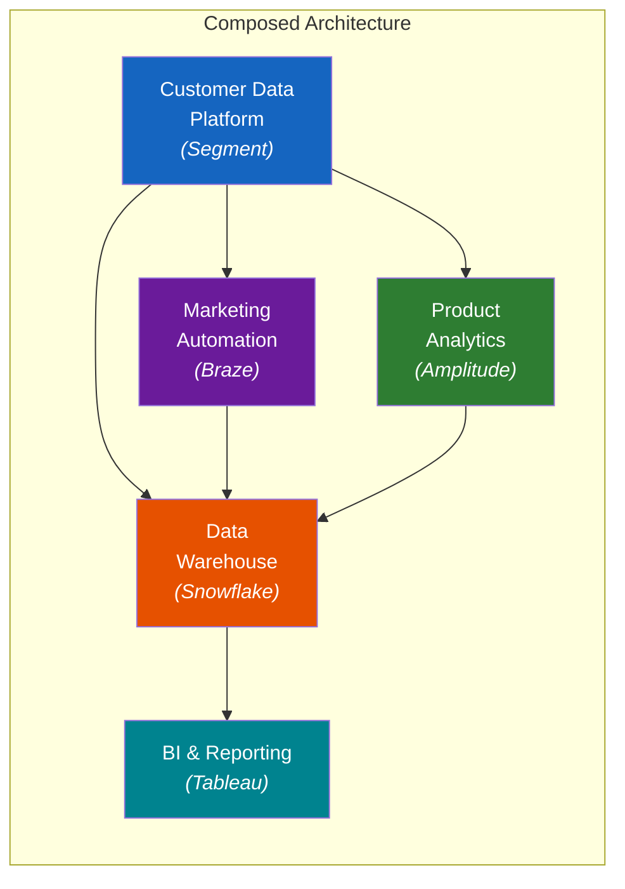

---
tags:
  - technology
  - strategy
  - decision-frameworks
reading_time: 22
difficulty: Intermediate
---

# Make vs. Buy Decision Frameworks

## Overview

Every organization eventually faces a fundamental technology question: should we build our own software, purchase a commercial product, or subscribe to a cloud-based service? This decision — often called "make vs. buy" — is one of the most consequential choices a business leader can make. It determines how much an organization spends on technology, how quickly it can move, how dependent it becomes on vendors, and whether technology becomes a source of competitive advantage or merely a cost of doing business.

The make-vs-buy decision is far more nuanced than it appears on the surface. It is not simply a cost comparison between writing code and buying a license. It involves strategic trade-offs across time-to-market, risk, organizational capability, and long-term flexibility. Getting it wrong can lock an organization into expensive custom systems that are difficult to maintain, or force a company to accept off-the-shelf limitations that prevent it from differentiating in the market.

In the modern technology landscape, the traditional binary of "make or buy" has expanded. Cloud computing and SaaS have introduced a "subscribe" option that shifts costs from capital expenditure to operating expenditure. Low-code/no-code platforms blur the line between building and buying. API-first architectures allow organizations to compose solutions from multiple services. Understanding this expanded menu of options — and having a structured framework for choosing among them — is essential for any MBA graduate who will participate in technology investment decisions.

!!! info "Why This Matters for MBA Students"

    As a business leader, you will regularly participate in decisions about how your organization acquires technology. Should your marketing team build a custom analytics dashboard, or subscribe to Tableau? Should your supply chain group invest in a bespoke logistics platform, or implement SAP's standard module? These are not purely technical decisions — they are **strategic investment decisions** that affect budgets, competitive positioning, vendor relationships, and organizational agility. The frameworks in this section will help you ask the right questions and evaluate trade-offs rigorously, even if you never write a line of code.

---

## Key Concepts

### The Fundamental Question

At its core, the make-vs-buy decision asks: **Where should this organization invest its limited resources to create the most business value?**

Building custom software gives you exactly what you need, but it requires time, talent, and ongoing investment. Buying commercial software gives you proven functionality quickly, but you accept the vendor's design choices and become dependent on their roadmap. Subscribing to SaaS eliminates infrastructure concerns, but you share the platform with every other customer and have limited control over changes.

There is no universally correct answer. The right choice depends on the specific context — how central the capability is to your strategy, what your organization is capable of, how quickly you need a solution, and what risks you are willing to accept.

### The Three Options

#### Build (Custom Development)

Custom development means your organization (or contractors working on your behalf) writes software from scratch, tailored to your specific requirements. You own the code, control the roadmap, and can differentiate your capabilities from competitors.

**Best suited for:**

- Capabilities that directly create competitive advantage
- Processes so unique that no commercial product can support them
- Situations where you need complete control over the user experience and functionality
- Organizations with strong internal engineering teams

**Examples:** A hedge fund's proprietary trading algorithm, Amazon's recommendation engine, a hospital system's patient flow optimization tool.

#### Buy (Commercial Off-the-Shelf / COTS)

Buying means purchasing a commercial software product — typically licensed on a per-user or per-server basis — and deploying it within your own infrastructure. COTS products can often be configured or customized to fit your needs, but you rely on the vendor for core functionality and updates.

**Best suited for:**

- Well-understood business processes with industry-standard requirements
- Functions where you need proven, mature capabilities quickly
- Areas where compliance or regulatory standards favor established products
- Organizations that want to own their data and infrastructure

**Examples:** Implementing Oracle Financials for accounting, deploying Microsoft Dynamics for ERP, installing ServiceNow for IT service management.

#### Subscribe (SaaS / Cloud Services)

Subscribing means accessing software over the internet on a pay-per-use or subscription basis. The vendor hosts the application, manages the infrastructure, and pushes updates automatically. You typically configure the product through its admin interface rather than modifying the underlying code.

**Best suited for:**

- Standard business functions where speed of deployment matters most
- Organizations that want to minimize IT infrastructure and administration burden
- Rapidly evolving domains where you want the vendor to keep you current
- Companies that prefer predictable operating expenses over large upfront investments

**Examples:** Salesforce for CRM, Workday for HR and payroll, Slack for team communication, Snowflake for data warehousing.

### Comparison: Build vs. Buy vs. Subscribe

The following table summarizes how the three options compare across the criteria that matter most:

| Criterion | Build (Custom) | Buy (COTS) | Subscribe (SaaS) |
|---|---|---|---|
| **Upfront cost** | High (development) | Medium-High (license + implementation) | Low (subscription fees) |
| **Ongoing cost** | High (maintenance, staff) | Medium (support, upgrades) | Medium (subscription, per-user fees) |
| **Time to deploy** | Long (months to years) | Medium (weeks to months) | Short (days to weeks) |
| **Customization** | Unlimited | Moderate (configuration + custom code) | Limited (configuration only) |
| **Competitive differentiation** | High | Low | Low |
| **Vendor dependency** | None (but talent dependency) | Medium (vendor roadmap, support) | High (vendor controls platform) |
| **Data control** | Full | Full (on your infrastructure) | Limited (vendor-hosted) |
| **Scalability** | Depends on architecture | Depends on infrastructure | Typically elastic |
| **Maintenance burden** | High (your responsibility) | Medium (shared with vendor) | Low (vendor-managed) |
| **Upgrade control** | Full | Moderate (you choose when) | Limited (vendor pushes updates) |
| **Integration complexity** | You design the interfaces | Vendor provides APIs/connectors | Vendor provides APIs; may be limited |
| **Risk profile** | Project execution risk | Implementation risk, vendor risk | Vendor risk, data security risk |

!!! question "Quick Check"
    - A mid-size law firm is evaluating whether to build a custom document management system or subscribe to a SaaS platform. The firm's partners insist their workflow is "completely unique." How would you test that assumption, and what evidence would change your recommendation?
    - Consider the comparison table above. Under what business circumstances might the option with the highest upfront cost actually deliver the lowest total cost of ownership over five years?

---

### Decision Criteria

A rigorous make-vs-buy evaluation considers multiple dimensions. Here are the eight criteria that matter most:

**1. Strategic Differentiation**
:   Does this capability create competitive advantage? If yes, lean toward building. If the capability is a commodity that every competitor needs in roughly the same way, lean toward buying or subscribing.

**2. Total Cost of Ownership (TCO)**
:   What is the full cost over the expected life of the solution — including development, licensing, implementation, integration, training, maintenance, upgrades, and eventual retirement? TCO analysis often reveals that "cheap" options are expensive over time.

**3. Time to Market**
:   How urgently does the business need this capability? Custom development takes the longest. SaaS is typically the fastest to deploy.

**4. Customization Needs**
:   How closely must the solution match your specific processes? If your workflows are unique and non-negotiable, you may need to build. If you can adapt your processes to match the software, buying or subscribing is viable.

**5. Vendor Risk**
:   What happens if the vendor raises prices, is acquired, changes strategic direction, or goes out of business? How difficult would it be to switch to an alternative?

**6. Integration Complexity**
:   How does this solution need to connect with your existing systems? Custom-built solutions can be designed to integrate precisely. COTS and SaaS products may require middleware or custom connectors.

**7. Internal Capability**
:   Does your organization have the engineering talent and project management maturity to build and maintain custom software? If not, the risks of building increase dramatically.

**8. Maintenance Burden**
:   Who will fix bugs, apply security patches, and add features over the next 5-10 years? Custom software requires a dedicated team indefinitely. SaaS shifts this burden to the vendor.

!!! question "Quick Check"
    - Imagine you are weighing these eight decision criteria for a new customer-facing mobile app. Which two criteria would you weight most heavily, and how would the weights change if the app were an internal HR portal instead?
    - A startup CTO argues that vendor risk is irrelevant because "we can always switch later." Using the criteria above, explain why this reasoning is flawed and what you would ask the CTO to quantify before accepting that argument.

---

## Frameworks & Models

### The Make-vs-Buy Decision Tree

The following decision tree provides a structured approach to evaluating the build, buy, or subscribe decision. Start at the top and follow the branches based on your answers.

### The Weighted Scoring Matrix

A weighted scoring matrix brings objectivity to the make-vs-buy decision. Each criterion is assigned a weight based on its importance to the organization, and each option is scored on a scale (typically 1-5). The weighted scores are summed to produce an overall ranking.

**Example: Mid-Size Retailer Evaluating a New Inventory Management System**

| Criterion | Weight | Build Score | Build Weighted | Buy Score | Buy Weighted | Subscribe Score | Subscribe Weighted |
|---|:---:|:---:|:---:|:---:|:---:|:---:|:---:|
| Strategic differentiation | 25% | 5 | 1.25 | 2 | 0.50 | 2 | 0.50 |
| TCO (5-year) | 20% | 2 | 0.40 | 3 | 0.60 | 4 | 0.80 |
| Time to market | 15% | 1 | 0.15 | 3 | 0.45 | 5 | 0.75 |
| Customization fit | 15% | 5 | 0.75 | 3 | 0.45 | 2 | 0.30 |
| Integration ease | 10% | 4 | 0.40 | 3 | 0.30 | 3 | 0.30 |
| Vendor risk | 5% | 5 | 0.25 | 2 | 0.10 | 2 | 0.10 |
| Internal capability | 5% | 2 | 0.10 | 4 | 0.20 | 5 | 0.25 |
| Maintenance burden | 5% | 1 | 0.05 | 3 | 0.15 | 5 | 0.25 |
| **Total** | **100%** | | **3.35** | | **2.75** | | **3.25** |

In this example, "Build" edges out "Subscribe" primarily because the retailer sees inventory management as a key differentiator and needs deep customization. A different retailer that views inventory as a commodity function might weight strategic differentiation lower and time-to-market higher, producing a different result.

!!! tip "Using the Weighted Scoring Matrix"

    The value of this exercise is not just the final number — it is the **conversation it forces**. Agreeing on weights requires stakeholders to articulate what matters most. Scoring options requires honest assessment of each alternative's strengths and weaknesses. The process often matters as much as the result.

### Core vs. Context Framework (Geoffrey Moore)

Geoffrey Moore's "core vs. context" framework provides a powerful strategic lens for the make-vs-buy decision:

- **Core activities** directly contribute to competitive differentiation — they are what makes your organization unique in the market. Invest in building custom capabilities for core activities.
- **Context activities** are necessary to operate the business but do not differentiate you from competitors. For context, buy or subscribe to the best available solution and move on.

**The key insight:** Most organizations build too much. They invest engineering resources in capabilities that do not differentiate them, when they could subscribe to a SaaS product and redirect those resources toward truly differentiating work.

!!! question "Quick Check"
    - Apply the core-vs-context framework to a regional airline. Which IT capabilities would you classify as "core" (build custom) and which as "context" (buy or subscribe)? How would your classification differ for a global logistics company like FedEx?
    - A VP of Engineering insists that the company's custom-built email system is a core capability because "we have invested years in it." Using Moore's framework, how would you challenge that assertion?
    - When might a capability that starts as "context" shift to become "core" for an organization? What signals would tell you the classification needs to change?

### Transaction Cost Economics Perspective

From a transaction cost economics (TCE) perspective, the make-vs-buy decision is about comparing the costs of internal production against the costs of market transactions:

- **Build (make internally)** when transaction costs are high — meaning it is difficult to write complete contracts with external vendors, the capability requires highly specific assets, or the risk of vendor opportunism is significant.
- **Buy or subscribe (use the market)** when transaction costs are low — meaning standard products exist, switching between vendors is feasible, and contracts can adequately protect your interests.

This framework helps explain why companies build proprietary systems in domains with high uncertainty and specificity, while they buy standardized tools for well-understood functions.

---

## TCO Analysis

### Understanding True Costs

TCO is the single most important financial tool for evaluating the make-vs-buy decision. It captures all costs over the expected life of a solution — not just the obvious ones.

=== "Build Costs"

    | Cost Category | Description | Often Overlooked? |
    |---|---|:---:|
    | Requirements & design | Business analysis, architecture, UX design | |
    | Development | Salaries or contractor fees for engineering | |
    | Testing & QA | Quality assurance, user acceptance testing | |
    | Infrastructure | Servers, cloud resources, development tools | |
    | Integration | Connecting to existing systems | |
    | Training | Teaching users and support staff | |
    | Ongoing maintenance | Bug fixes, security patches, updates | Yes |
    | Technical debt | Costs of shortcuts taken during development | Yes |
    | Opportunity cost | What else the dev team could have built | Yes |
    | Staff turnover risk | Knowledge loss when key developers leave | Yes |
    | Retirement / migration | Eventually replacing the custom system | Yes |

=== "Buy Costs"

    | Cost Category | Description | Often Overlooked? |
    |---|---|:---:|
    | Software licenses | Upfront or annual license fees | |
    | Implementation services | Consultants for configuration and deployment | |
    | Customization | Modifying the product to fit your needs | |
    | Integration | Middleware, custom connectors, data migration | |
    | Training | User training, admin training | |
    | Annual maintenance fees | Typically 18-22% of license cost per year | |
    | Upgrade projects | Major version upgrades every 3-5 years | Yes |
    | Shelfware risk | Paying for features you never use | Yes |
    | Consultant dependency | Ongoing need for specialized consultants | Yes |
    | Lock-in costs | Cost of switching if you need to change vendors | Yes |

=== "Subscribe Costs"

    | Cost Category | Description | Often Overlooked? |
    |---|---|:---:|
    | Subscription fees | Monthly or annual per-user charges | |
    | Implementation | Initial configuration, data migration | |
    | Integration | Connecting to other systems via APIs | |
    | Training | Onboarding users to the new platform | |
    | Premium tier features | Extra charges for advanced capabilities | Yes |
    | Data extraction costs | Fees or complexity to get your data out | Yes |
    | Price escalation | Subscription increases at renewal (often 5-8%/yr) | Yes |
    | Usage overages | Charges for exceeding data/API/user limits | Yes |
    | Shadow integration tools | Workarounds users build because of limitations | Yes |
    | Switching costs | Migrating to another platform if needed | Yes |

!!! warning "The Hidden Cost Trap"

    Organizations consistently underestimate TCO for all three options. Custom development projects routinely exceed initial budgets by 50-100%. COTS implementations often cost 2-3x the license fee in services. SaaS subscriptions creep upward through premium tiers, additional users, and annual price increases. A rigorous TCO analysis accounts for **all** costs over a **realistic time horizon** — typically 5-7 years.

---

## The Modern Landscape

### How Cloud Has Changed the Equation

The rise of cloud computing and SaaS has fundamentally shifted the make-vs-buy landscape:

- **Lower barriers to subscribing.** SaaS eliminates the need for infrastructure procurement, reducing time-to-value from months to days.
- **OpEx instead of CapEx.** Subscription models convert large upfront investments into predictable operating expenses, which many CFOs prefer.
- **Continuous updates.** SaaS vendors push improvements automatically, eliminating the costly upgrade cycles associated with on-premises COTS products.
- **Higher switching costs over time.** As organizations accumulate data and integrations in a SaaS platform, the cost of leaving increases — a factor that must be weighed upfront.

### Low-Code / No-Code Platforms

Low-code and no-code platforms (such as Microsoft Power Platform, Salesforce Lightning, Mendix, and OutSystems) have created a middle ground between building and buying. Business users and "citizen developers" can create applications through visual interfaces rather than traditional programming.

**Impact on make-vs-buy:**

- Reduces the cost and time of "building," making custom solutions viable for smaller needs
- Enables rapid prototyping before committing to a full build-or-buy decision
- Introduces new risks around governance, security, and technical debt if not managed carefully

### Compose: The Fourth Option

Modern API-first architectures enable a new approach: **composing** solutions from multiple specialized services. Rather than choosing a single monolithic platform, organizations can assemble best-of-breed components connected through APIs.

**Example:** Instead of buying one vendor's entire marketing suite, a company might compose its stack from:

- Segment (customer data platform)
- Braze (marketing automation)
- Amplitude (product analytics)
- Snowflake (data warehouse)

Each component is best-in-class for its function, and APIs connect them into an integrated whole. This approach offers flexibility but requires strong technical architecture skills and adds integration complexity.

---

## Real-World Applications

### Case 1: CRM — Salesforce Adoption vs. Custom CRM

**Scenario:** A mid-size financial services firm is deciding how to manage its client relationships and sales pipeline.

**Option A — Build a custom CRM:** The firm's client onboarding process is highly regulated and involves complex compliance workflows that differ by product type. A custom CRM could be designed to match these exact workflows and integrate deeply with the firm's proprietary risk scoring system.

**Option B — Subscribe to Salesforce:** Salesforce is the market-leading CRM with thousands of pre-built integrations, a vast ecosystem of third-party add-ons, and deep expertise available in the consulting market. Most standard CRM functions (contact management, pipeline tracking, reporting) would be available immediately.

**Decision and rationale:** The firm chose **Salesforce with customization**. While their compliance workflows are unique, 80% of their CRM needs are standard. They configured Salesforce for the standard functions and built custom Salesforce apps (using the platform's low-code tools) for the specialized compliance workflows. This gave them speed-to-market for standard capabilities while preserving customization where it mattered most.

**Lesson:** The answer is rarely pure build or pure buy — it is often a **hybrid** approach that maximizes the value of each option.

### Case 2: Enterprise HR — Workday vs. PeopleSoft vs. Custom

**Scenario:** A 15,000-employee manufacturing company running an aging PeopleSoft HR system must decide on its next-generation HR platform.

| Factor | Custom Build | PeopleSoft Upgrade | Workday (SaaS) |
|---|---|---|---|
| Strategic differentiation | HR is not a differentiator | HR is not a differentiator | HR is not a differentiator |
| TCO (5-year) | $18M+ | $12M | $9M |
| Time to deploy | 24-36 months | 12-18 months | 6-9 months |
| Maintenance burden | High (in-house team) | Medium (upgrade cycles) | Low (vendor-managed) |
| Risk | Project failure risk | Aging technology risk | Vendor lock-in risk |

**Decision:** The company selected **Workday**. Since HR is not a competitive differentiator (it is "context," not "core"), the lowest TCO and fastest deployment option made strategic sense. They redirected the IT resources that would have gone to maintaining PeopleSoft toward building a custom manufacturing execution system — an area of genuine competitive advantage.

### Case 3: Business Intelligence — Custom Analytics vs. Power BI / Tableau

**Scenario:** A retail chain needs advanced analytics across point-of-sale data, inventory, e-commerce, and marketing.

**The company initially built a custom analytics platform** using open-source tools (Python, Apache Spark, custom dashboards). After two years, they had powerful but fragile analytics that only the data engineering team could maintain. Business users could not self-serve, and every new report required engineering time.

**They migrated to a hybrid approach:** Power BI for standard business reporting and dashboards (accessible to all business users), with a custom data pipeline feeding proprietary algorithms for demand forecasting (a genuine differentiator). This reduced the engineering maintenance burden by 60% while preserving the analytics capabilities that created competitive advantage.

**Lesson:** Even when you initially choose "build," revisit the decision as circumstances change. The **maintenance burden** of custom software often becomes the decisive factor over time.

---

## Common Pitfalls

!!! warning "Pitfall 1: The 'Not Invented Here' Syndrome"

    Some organizations default to building custom solutions because they believe their processes are too unique for commercial products. In reality, **most business processes are 80-90% standard across industries**. Challenge stakeholders who insist that "we're different" by asking them to identify specifically which 10-20% of requirements truly cannot be met by existing products.

!!! warning "Pitfall 2: Underestimating the Maintenance Tail"

    Custom software is never "done." Bug fixes, security patches, compatibility updates, and feature requests continue for the entire life of the system. Organizations often budget for the build but not for the **10-15 years of maintenance** that follow. A common rule of thumb: annual maintenance costs 15-20% of the original development cost, every year.

!!! warning "Pitfall 3: Ignoring Opportunity Cost"

    Every developer working on a non-differentiating custom system is a developer who is **not** working on something that creates competitive advantage. When evaluating "build," always ask: what else could these resources produce if we bought or subscribed instead?

!!! warning "Pitfall 4: Vendor Lock-In Complacency"

    Organizations often select a SaaS vendor based on today's pricing and features, without planning for how they would exit if conditions change. Always negotiate **data portability** terms upfront, understand what formats your data can be exported in, and maintain awareness of the switching costs you are accumulating.

!!! warning "Pitfall 5: The Customization Trap"

    Heavily customizing a COTS product can produce the worst of both worlds — you pay for the license *and* carry the burden of custom code. Extensive customization also makes upgrades painful, as custom modifications must be re-applied or re-tested with each new version. If a COTS product requires more than 20-30% customization, seriously consider whether building from scratch would be more sustainable.

---

## Discussion Questions

1. **Your company's CEO wants to replace the current ERP system.** The CIO recommends subscribing to a cloud-based ERP (like SAP S/4HANA Cloud or Oracle Cloud ERP), while the VP of Operations argues for building a custom system because "our manufacturing processes are unique." Using the core-vs-context framework and the weighted scoring matrix, how would you structure the evaluation? What questions would you ask each executive to test their assumptions?

2. **A fast-growing fintech startup has been building everything in-house** — custom CRM, custom accounting tools, custom HR workflows — because the founding engineers believed it would give them more flexibility. The company now has 500 employees and is spending 40% of its engineering budget maintaining internal tools. As a newly hired VP of Operations, what would you recommend? Which systems would you migrate to commercial products first, and why?

3. **Consider the "compose" approach** — assembling a technology stack from multiple best-of-breed SaaS products connected via APIs. What are the advantages of this approach compared to selecting a single vendor's integrated suite? What organizational capabilities does it require? Under what circumstances might a single-vendor suite be the better choice despite having weaker individual components?

---

## Key Takeaways

- The make-vs-buy decision is a **strategic investment decision**, not merely a technical or procurement choice. It affects competitive positioning, organizational agility, and long-term cost structure.
- There are now **four options** to consider: Build, Buy, Subscribe (SaaS), and Compose (API-connected best-of-breed services). Each has distinct cost profiles, risk profiles, and strategic implications.
- **Build for competitive advantage, buy or subscribe for everything else.** Geoffrey Moore's core-vs-context framework is the single most useful lens for this decision.
- **TCO analysis must be comprehensive.** Include implementation, integration, training, maintenance, opportunity cost, and switching costs — not just license fees or subscription prices. Plan for a 5-7 year horizon.
- **Use a weighted scoring matrix** to bring objectivity and structure to the evaluation. The process of agreeing on weights is as valuable as the final score.
- **Most organizations build too much.** Challenge the assumption that your processes are unique. Redirect engineering talent from commodity functions to differentiating capabilities.
- **The maintenance tail is the hidden killer.** Custom software requires ongoing investment for its entire life. Factor this into every build decision.
- **Plan for exit from day one.** Whether you buy or subscribe, understand your switching costs and negotiate data portability upfront.
- **Revisit decisions periodically.** The right answer changes as technology evolves, your organization grows, and the vendor landscape shifts. What was the right choice three years ago may not be the right choice today.

---

## Further Reading

**Textbooks and Foundational Works:**

- Pearlson, K.E., Saunders, C.S., & Galletta, D.F. *Managing and Using Information Systems: A Strategic Approach* (7th Edition). Wiley. — Chapter 8 covers sourcing decisions, including build vs. buy and outsourcing frameworks.
- Austin, R.D., Nolan, R.L., & O'Donnell, S. *The Adventures of an IT Leader* (Updated Edition). Harvard Business Review Press. — Chapters on infrastructure and vendor management provide narrative context for make-vs-buy decisions.
- Moore, Geoffrey A. *Dealing with Darwin: How Great Companies Innovate at Every Phase of Their Evolution*. Portfolio. — The source for the core vs. context framework.

**Articles and Reports:**

- Williamson, Oliver E. "Transaction-Cost Economics: The Governance of Contractual Relations." *Journal of Law and Economics*, 1979. — The foundational paper on transaction cost economics as applied to make-vs-buy decisions.
- Gartner. "Decision Framework for Application Build vs. Buy vs. SaaS." — Practitioner-oriented framework with scoring methodology (available through institutional access).
- McKinsey & Company. "Build, Buy, or Partner? A Framework for Technology Sourcing Decisions." — Strategic perspective on aligning technology sourcing with business strategy.

**Course Connections:**

- This topic connects directly to the **Technology Investment Business Case** assignment in ITEC-617. The TCO analysis and weighted scoring matrix are tools you can apply to your business case analysis.
- See also: [Cloud Computing Strategy](cloud-computing.md) for how cloud models affect the buy-vs-subscribe choice, [Enterprise Architecture](enterprise-architecture.md) for how architectural standards shape technology sourcing, [Vendor Management](../management/vendor-management.md) for managing relationships after the buy or subscribe decision is made, [Enterprise Applications](enterprise-applications.md) for ERP, CRM, and SCM platform decisions where make-vs-buy is critical, and [IT Budgeting & Financial Management](../governance/it-budgeting.md) for TCO analysis and building the business case for technology investments.
