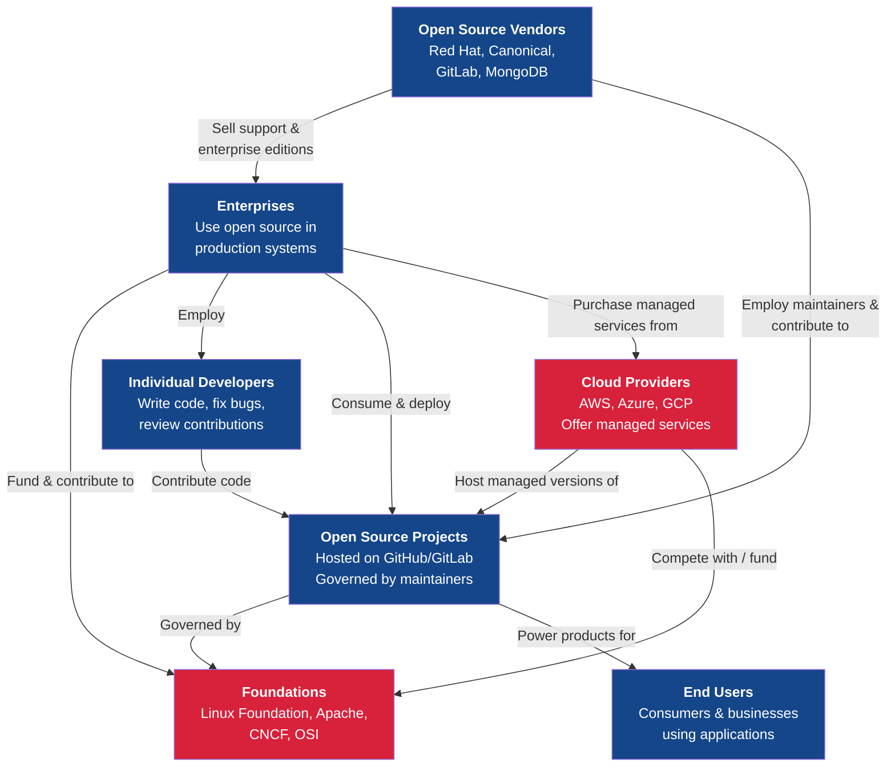
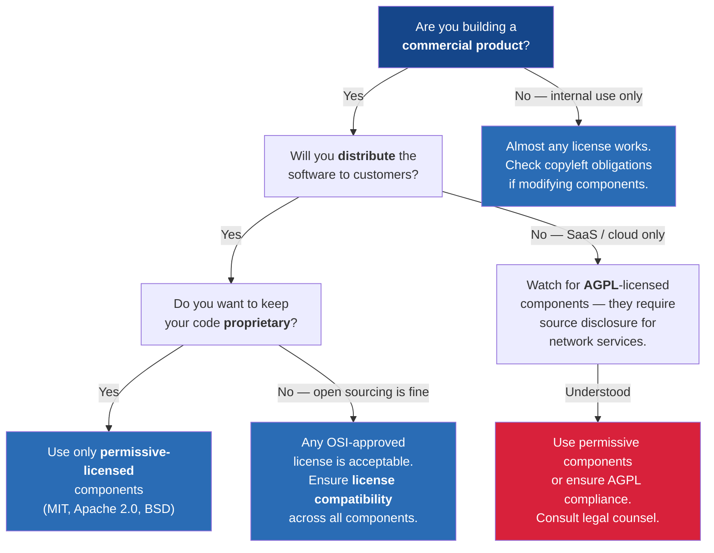

---
tags:
  - technology
  - open-source
  - strategy
reading_time: 35
difficulty: Intermediate
---

# Open Source vs. Proprietary Software

## Overview

Every piece of software in the world falls somewhere on a spectrum between two fundamental approaches to how code is created, shared, and controlled. **Open source software** makes its source code publicly available under licenses that grant users the rights to use, study, modify, and distribute the code freely. **Proprietary software** (also called closed-source or commercial software) keeps its source code secret and restricts usage through license agreements that typically prohibit modification, redistribution, and reverse engineering.

This distinction may sound like a technical curiosity, but it has profound strategic, financial, and operational implications for every organization. The global digital economy runs on a massive foundation of open source software — most of it invisible to the business leaders whose organizations depend on it daily. Linux powers more than 90% of public cloud workloads and 96% of the top one million web servers. Apache and Nginx serve the vast majority of global web traffic. PostgreSQL and MySQL handle enormous database workloads across industries. Kubernetes has become the de facto standard for container orchestration. Python and R drive the analytics and AI revolution. Git underpins virtually all modern software development. The internet itself runs on open source protocols and implementations.

At the same time, proprietary software remains dominant in many enterprise categories. Microsoft Office and Windows are ubiquitous in corporate environments. SAP and Oracle dominate the ERP market. Salesforce leads CRM. Adobe owns creative workflows. These vendors invest billions in research and development, maintain large support organizations, and offer integrated ecosystems that many enterprises find compelling.

For business leaders, understanding the open source vs. proprietary landscape is not about choosing one philosophy over the other — it is about making informed decisions about when each approach best serves the organization's strategic interests. The wrong choice can lock an organization into expensive vendor dependencies, expose it to legal risks, leave it without critical support, or cause it to miss opportunities for cost savings and innovation.

!!! info "Why This Matters for MBA Students"

    As a business leader, you will encounter open source vs. proprietary decisions in technology vendor evaluations, cloud infrastructure strategy, build-vs-buy analyses, enterprise architecture planning, and digital transformation initiatives. You will sit on steering committees where the CTO recommends migrating from Oracle Database to PostgreSQL, where the VP of Engineering proposes adopting an open source AI framework, or where the CFO questions why the company is paying millions for software that has free alternatives. Understanding licensing implications, TCO differences, community health indicators, and business model dynamics will enable you to contribute meaningfully to these decisions — asking the right questions, challenging assumptions, and ensuring that technology choices align with business strategy.

---

## Key Concepts

### What Is Open Source Software?

Open source software is software whose source code — the human-readable instructions that programmers write — is made freely available for anyone to view, use, modify, and distribute. This stands in contrast to proprietary software, where the source code is a closely guarded trade secret and users receive only the compiled binary (the machine-readable version that computers execute but humans cannot easily read or modify).

The open source model is built on a simple but powerful premise: when many people can see and improve the code, the software gets better faster, bugs are found and fixed more quickly, and innovation accelerates because developers can build on each other's work rather than starting from scratch.

#### A Brief History

The open source movement has roots stretching back to the earliest days of computing, when sharing code was the norm in academic and research communities. The modern movement crystallized through several watershed moments:

- **1983 — The GNU Project**: Richard Stallman, a programmer at MIT, launched the GNU Project to create a completely free operating system. Stallman's motivation was philosophical — he believed that software should be free for users to study, modify, and share. He founded the Free Software Foundation (FSF) in 1985 and created the GNU General Public License (GPL), the most influential open source license in history.

- **1991 — Linux**: Linus Torvalds, a Finnish university student, released the Linux kernel — the core component of an operating system. Combined with GNU tools, Linux became the first fully functional free operating system. Today, Linux is the dominant operating system for servers, cloud infrastructure, supercomputers, and embedded devices.

- **1995 — Apache HTTP Server**: The Apache HTTP Server was created by a group of webmasters who collaborated to improve the original NCSA web server. Apache quickly became the most popular web server in the world — a position it held for over two decades — and demonstrated that community-driven development could produce enterprise-grade software.

- **1998 — The Open Source Initiative**: Netscape's decision to release the source code of its browser prompted a group of advocates — including Eric Raymond, Bruce Perens, and Tim O'Reilly — to coin the term "open source" and create the Open Source Initiative (OSI). They developed the Open Source Definition, a set of ten criteria that a software license must meet to be considered truly open source.

- **2000s-present — Enterprise adoption**: IBM's $1 billion investment in Linux (2000), the rise of LAMP stack development (Linux, Apache, MySQL, PHP/Python/Perl), the emergence of cloud computing built on open source infrastructure, and the creation of major foundations (Linux Foundation, Apache Software Foundation, Cloud Native Computing Foundation) transformed open source from a grassroots movement into the backbone of enterprise IT.

#### The Open Source Definition (OSI)

The OSI's Open Source Definition establishes ten criteria that a software license must satisfy to qualify as open source. The most important of these for business leaders are:

1. **Free redistribution** — The license must not restrict anyone from selling or giving away the software
2. **Source code availability** — The source code must be included or readily obtainable
3. **Derived works** — The license must allow modifications and derived works
4. **No discrimination against persons, groups, or fields of endeavor** — Anyone can use the software for any purpose, including commercial use
5. **License must not be specific to a product** — Rights apply to all who receive the software
6. **License must not restrict other software** — The license cannot impose restrictions on other software distributed alongside it

#### Free Software vs. Open Source

Two related but philosophically distinct movements coexist under the umbrella of "software whose source code is available":

- **The Free Software movement** (led by the FSF and Richard Stallman) emphasizes **user freedom** as a moral imperative. "Free" refers to freedom, not price — as Stallman famously explained, "free as in freedom, not free as in beer." The FSF advocates for copyleft licenses (like the GPL) that ensure freedom is preserved in all derivative works.

- **The Open Source movement** (led by the OSI) emphasizes the **practical benefits** of open development — better code quality, faster innovation, lower costs. The OSI is more pragmatic and accepts a broader range of licenses, including permissive ones that allow code to be incorporated into proprietary products.

In practice, the two movements overlap significantly. Most software that qualifies as "free software" also qualifies as "open source," and vice versa. The distinction matters primarily in licensing philosophy: copyleft vs. permissive licenses, which we examine next.

---

### Licensing Models

For business leaders, understanding open source licensing is not optional — it is essential. The license attached to an open source project determines what your organization can and cannot do with the code, including whether you can use it in commercial products, whether you must share your modifications, and what legal obligations you assume.

Open source licenses fall into two broad categories: **copyleft** and **permissive**.

#### Copyleft Licenses (GPL, LGPL, AGPL)

Copyleft licenses require that any software that incorporates or is derived from copyleft-licensed code must also be released under the same (or a compatible) open source license. This "viral" characteristic ensures that open source code remains open source, even when it is modified or incorporated into new projects.

- **GPL (GNU General Public License)**: The strongest and most widely known copyleft license. Any software that links to or incorporates GPL code must also be released under the GPL, including making the full source code available. This has major implications for commercial software development — companies that use GPL code in their products must open-source those products. Linux is licensed under GPL v2.

- **LGPL (GNU Lesser General Public License)**: A weaker form of copyleft designed for software libraries. Applications that merely *use* an LGPL library (by linking to it) are not required to be open-sourced, but modifications to the library itself must be shared. This makes LGPL suitable for libraries that commercial software needs to use without triggering full copyleft obligations.

- **AGPL (GNU Affero General Public License)**: Extends the GPL's copyleft requirement to software accessed over a network. Under the standard GPL, if you modify GPL software and run it as a web service (without distributing it), you are not required to share your modifications. The AGPL closes this "SaaS loophole" — if you modify AGPL software and make it available as a network service, you must release your source code. This has significant implications for cloud providers and SaaS companies.

#### Permissive Licenses (MIT, Apache 2.0, BSD)

Permissive licenses impose minimal restrictions on how the software can be used, modified, and redistributed. Most critically, permissive licenses allow code to be incorporated into proprietary, closed-source products without requiring the proprietary code to be open-sourced.

- **MIT License**: The simplest and most popular open source license. It essentially says: "Do whatever you want with this code — just include the original copyright notice and license text." There are no requirements to share modifications, no patent provisions, and minimal legal complexity. React, Node.js, jQuery, and Ruby on Rails use the MIT License.

- **Apache License 2.0**: Similar to MIT but adds an explicit **patent grant** — contributors to Apache-licensed projects grant users a royalty-free patent license for any patents that cover their contributions. This provides important legal protection for organizations using the software. Apache 2.0 also includes a patent retaliation clause: if you sue someone for patent infringement related to the software, your patent license is terminated. Kubernetes, TensorFlow, and Apache Hadoop use the Apache 2.0 License.

- **BSD Licenses**: A family of permissive licenses originating from the University of California, Berkeley. The most common variants (2-clause and 3-clause BSD) are similar to the MIT License, with the 3-clause version adding a restriction against using the project's name for endorsement. FreeBSD, PostgreSQL (uses a variant), and Nginx originally used BSD licenses.

#### License Comparison

The following table provides a practical comparison for business leaders evaluating open source software:

| License | Type | Key Terms | Commercial Use | Modification Requirements | Patent Grant | Notable Projects |
|---|---|---|---|---|---|---|
| **GPL v3** | Strong copyleft | Derivative works must be GPL | Yes, but source must be shared | Must release source under GPL | Yes | Linux (v2), GCC, WordPress |
| **LGPL v3** | Weak copyleft | Library modifications must be shared | Yes, applications can remain proprietary | Must share library changes only | Yes | GNU C Library, Qt (dual) |
| **AGPL v3** | Network copyleft | Extends GPL to network services | Yes, but SaaS source must be shared | Must release source, including for network use | Yes | MongoDB (pre-2018), Grafana |
| **Apache 2.0** | Permissive | Include notice, state changes | Yes, no source sharing required | No requirement to share | Yes (explicit) | Kubernetes, TensorFlow, Spark |
| **MIT** | Permissive | Include copyright notice | Yes, no source sharing required | No requirement to share | No (implicit) | React, Node.js, VS Code |
| **BSD 2-Clause** | Permissive | Include copyright notice | Yes, no source sharing required | No requirement to share | No (implicit) | FreeBSD, Nginx (original) |

!!! question "Quick Check"
    - Your development team wants to embed a GPL-licensed library into a proprietary product your company sells commercially. Using the license comparison table, explain the legal consequences and propose two alternative approaches that would avoid the copyleft obligation.
    - A SaaS startup is building a cloud-hosted analytics platform using AGPL-licensed components. The CTO says, "We are not distributing the software, so copyleft does not apply." Is the CTO correct? What specific risk does the AGPL address that the standard GPL does not?

!!! warning "License Compliance Is a Legal Obligation"

    Open source licenses are legally enforceable. Organizations that violate license terms — for example, incorporating GPL code into a proprietary product without releasing the source code — face real legal consequences including injunctions, damages, and reputational harm. The Software Freedom Conservancy and the FSF have successfully enforced GPL violations in court. Every enterprise using open source software should maintain a **Software Bill of Materials (SBOM)** that tracks all open source components and their licenses, and should establish a formal open source policy reviewed by legal counsel.

---

### Business Models for Open Source

A common question from business leaders is: "If the software is free, how does anyone make money?" In fact, some of the most successful technology companies in the world have built multi-billion-dollar businesses around open source software. They simply monetize value that sits adjacent to the code itself.

#### Support and Services Model

**How it works**: The core software is freely available. The company sells enterprise support subscriptions, professional services, consulting, training, and certifications.

**Exemplar: Red Hat (IBM)**: Red Hat is the most successful pure-play open source company in history. It distributes Red Hat Enterprise Linux (RHEL) — a hardened, tested, certified version of Linux — along with enterprise support, security patches, compliance certifications, and professional services. The underlying code is open source, but Red Hat's value proposition is reliability, security, and support for mission-critical workloads. Red Hat generated over $3.4 billion in annual revenue before IBM acquired it for $34 billion in 2019.

#### Open Core Model

**How it works**: The core product is open source and freely available. The company develops proprietary features — typically focused on enterprise needs like security, administration, scalability, and compliance — that are available only in a paid commercial edition.

**Exemplar: GitLab**: GitLab's core DevOps platform is open source (Community Edition). The company sells a Premium tier (with advanced CI/CD, security scanning, and compliance features) and an Ultimate tier (with portfolio management, advanced security, and value stream analytics). The open source core attracts a massive user base; some percentage of those users convert to paying customers as their needs grow.

#### Cloud Hosting / Managed Services Model

**How it works**: A company offers a fully managed, cloud-hosted version of open source software, handling deployment, scaling, patching, backups, monitoring, and support. Customers pay for the convenience of not having to operate the software themselves.

**Exemplar: MongoDB Atlas**: MongoDB is an open source document database. MongoDB Inc. offers Atlas, a fully managed cloud database service that handles all operational complexity. Similarly, AWS offers managed versions of many open source projects (Amazon RDS for PostgreSQL/MySQL, Amazon OpenSearch for Elasticsearch, Amazon MSK for Apache Kafka).

#### Dual Licensing Model

**How it works**: The software is available under two licenses — a copyleft open source license (typically GPL or AGPL) and a commercial license. Users who are comfortable with the copyleft requirements can use the software for free. Users who need to incorporate the software into proprietary products without copyleft obligations can purchase a commercial license.

**Exemplar: MySQL (Oracle)**: MySQL is available under the GPL. Organizations that embed MySQL in proprietary products and do not want to comply with GPL requirements can purchase a commercial license from Oracle. Qt (the cross-platform application framework) uses a similar model.

#### Foundation-Backed Model

**How it works**: A nonprofit foundation governs the project's development, funded by corporate sponsorships and memberships. The foundation ensures vendor-neutral governance, manages trademarks, organizes events, and provides legal protection. No single company controls the project.

**Exemplar: Linux Foundation / CNCF**: The Linux Foundation hosts hundreds of projects including Linux, Kubernetes (through the CNCF), Node.js, and Hyperledger. Member companies (Google, Microsoft, AWS, Intel, Red Hat, and hundreds of others) contribute code, funding, and resources. The foundation model has proven highly effective for projects that are too important to be controlled by any single vendor.

#### Business Model Comparison

| Model | Revenue Source | Strengths | Challenges | Examples |
|---|---|---|---|---|
| **Support/Services** | Subscriptions, consulting, training | Recurring revenue, deep customer relationships | Must continuously demonstrate value beyond free version | Red Hat, Canonical, SUSE |
| **Open Core** | Premium feature licenses | Clear upgrade path, large free user base as funnel | Deciding what to open-source vs. keep proprietary | GitLab, Elastic, Confluent |
| **Cloud/Managed** | Hosting and operations fees | High margins, sticky customers | Cloud providers may offer competing managed services | MongoDB Atlas, Databricks |
| **Dual Licensing** | Commercial license sales | Monetizes copyleft requirements | Requires copyright ownership of all code | MySQL/Oracle, Qt |
| **Foundation-Backed** | Memberships, sponsorships, events | Vendor-neutral trust, broad adoption | Slower decision-making, governance complexity | Linux Foundation, Apache, CNCF |

!!! question "Quick Check"
    - Red Hat built a $34 billion business selling support for software that is free to download. Why would an enterprise pay for something available at no cost? Identify the specific value propositions that justify the premium and evaluate whether those same arguments apply to a 50-person startup.
    - A cloud provider launches a managed service based on an open source database, capturing significant revenue without contributing code back to the project. Is this ethical? From a business strategy perspective, how should the original open source company respond, and what are the trade-offs of each option?

---

### Open Source vs. Proprietary — Comprehensive Comparison

The following table provides a detailed comparison across the dimensions that matter most to business leaders evaluating open source and proprietary alternatives:

| Dimension | Open Source | Proprietary |
|---|---|---|
| **License Cost** | No license fees; costs arise from support, expertise, and operations | License or subscription fees; often significant for enterprise editions |
| **Total Cost of Ownership** | Lower license cost but requires investment in internal expertise, support contracts, and integration | Higher license cost but often includes support, documentation, and integration tooling |
| **Customization & Flexibility** | Full access to source code; unlimited ability to modify and extend | Limited to vendor-provided configuration options and APIs; customization may void support |
| **Security Model** | "Many eyes" — code is publicly auditable; vulnerabilities are found and patched by the community; security depends on community vigilance | "Security through obscurity" supplemented by dedicated security teams; coordinated vulnerability disclosure; security depends on vendor investment |
| **Vendor Lock-In** | Low — code is available, standards-based, portable; you can fork or switch providers | High — proprietary formats, APIs, and data models create switching costs; vendor controls the roadmap |
| **Support** | Community forums, documentation, and optional commercial support contracts (Red Hat, Canonical, etc.) | Vendor provides dedicated support with SLAs; escalation paths to engineering teams |
| **Innovation Speed** | Rapid — global community of contributors; features can emerge from any organization | Vendor-controlled — roadmap determined by vendor's priorities and market strategy |
| **Compliance & Audit** | License compliance requires tracking (SBOM); copyleft licenses add complexity | Simpler license compliance (pay and use); audit clauses in enterprise agreements |
| **Talent Availability** | Large pool — open source skills are widely taught and practiced; developers prefer open source tools | Specialized — vendor certifications create a narrower talent pool; may require premium salaries |
| **Maturity & Stability** | Varies widely — some projects (Linux, PostgreSQL) are extremely mature; others may be abandoned | Generally predictable — vendor has financial incentive to maintain and improve the product |
| **Integration** | Typically standards-based; strong API and interoperability culture | May favor integration within the vendor's own ecosystem; interoperability varies |
| **Documentation** | Varies — community documentation can be excellent (Kubernetes) or sparse; commercial vendors add enterprise docs | Typically comprehensive and professionally maintained by the vendor |
| **Governance & Roadmap** | Community-driven or foundation-governed; you can influence direction through contributions | Vendor-controlled; customers influence through feature requests and contract leverage |
| **Risk of Abandonment** | Community may lose interest; forks provide continuity | Vendor may be acquired, pivot strategy, or sunset the product |

---

### Enterprise Open Source Adoption

Open source is no longer an alternative or niche approach — it is the default foundation for modern enterprise technology. The scale of enterprise adoption is staggering:

#### Infrastructure and Operating Systems

- **Linux** powers more than 90% of public cloud workloads, 96% of the top one million web servers, all of the world's top 500 supercomputers, and the vast majority of IoT and embedded devices. Every major cloud provider (AWS, Azure, GCP) runs Linux as its primary host operating system.

#### Container Orchestration

- **Kubernetes** (originally developed by Google, now governed by the CNCF) has become the de facto standard for container orchestration. Over 96% of organizations surveyed in the CNCF annual report use or evaluate Kubernetes. Major enterprises including Airbnb, Spotify, The New York Times, and Adidas run production workloads on Kubernetes.

#### Databases

- **PostgreSQL** and **MySQL** (along with its fork **MariaDB**) collectively power a massive share of the world's databases. PostgreSQL has seen explosive growth as enterprises migrate away from Oracle Database and Microsoft SQL Server, driven by cost savings, flexibility, and a vibrant extension ecosystem. Supabase, Neon, and major cloud providers all offer managed PostgreSQL services.

#### Analytics and AI/ML

- **Python** is the dominant language for data science, machine learning, and AI. The open source ecosystem around Python — including **Pandas**, **NumPy**, **scikit-learn**, **Jupyter**, **TensorFlow**, **PyTorch**, and **Hugging Face Transformers** — has made advanced analytics and AI accessible to a far broader audience than was possible with proprietary tools alone. **R** remains widely used in statistical analysis and academic research.

#### Web Infrastructure

- **Apache HTTP Server** and **Nginx** together serve the vast majority of the world's websites. **Node.js** (built on the open source V8 JavaScript engine) powers server-side web applications for companies including Netflix, LinkedIn, and PayPal.

#### DevOps and Development Tools

- **Git** (created by Linus Torvalds) is the universal version control system. **Jenkins**, **Ansible**, **Terraform**, and **Prometheus** are foundational open source tools in the DevOps ecosystem. **VS Code** (Microsoft's open source code editor) is the most popular development environment in the world.

#### State of Enterprise Open Source

Red Hat's annual *State of Enterprise Open Source* report consistently finds that:

- Over 90% of IT leaders use enterprise open source
- Open source is considered as high or higher quality than proprietary software by a majority of enterprise leaders
- The top reasons for adoption are higher quality software, access to the latest innovations, and improved security
- The primary barriers to adoption are concerns about support, compatibility, and licensing compliance

---

### Decision Framework for Managers

Choosing between open source and proprietary software requires a structured evaluation. The following checklist provides a framework for business leaders:

#### Strategic Assessment

- [ ] **Mission criticality**: How critical is this software to core business operations? Higher criticality demands more rigorous evaluation of support options and community health.
- [ ] **Competitive differentiation**: Does this software area represent a source of competitive advantage? If yes, open source provides more flexibility to customize and differentiate.
- [ ] **Regulatory requirements**: Are there compliance or certification requirements that favor specific vendors? Some regulated industries mandate certified software versions.

#### Technical Assessment

- [ ] **Internal expertise**: Does your organization have (or can it hire) the skills to deploy, configure, and maintain the open source alternative? If not, the TCO gap narrows or reverses.
- [ ] **Customization needs**: Do you need to modify the software significantly? Open source allows this; proprietary software typically does not.
- [ ] **Integration requirements**: How well does each option integrate with your existing technology stack? Standards-based open source may integrate more easily; vendor ecosystems may offer tighter integration within their own products.

#### Community and Ecosystem Assessment

- [ ] **Community health**: Is the open source project actively maintained? Key indicators include: number of contributors, commit frequency, time to resolve issues, release cadence, and corporate backing.
- [ ] **Foundation governance**: Is the project governed by a reputable foundation (CNCF, Apache, Linux Foundation)? Foundation governance provides stability and vendor neutrality.
- [ ] **Commercial support availability**: Are there companies offering enterprise support contracts for this project? (Red Hat for Linux, Percona for MySQL/PostgreSQL, Confluent for Kafka, etc.)

#### Financial Assessment

- [ ] **TCO over 5-7 years**: Compare all costs — licensing/subscription fees, implementation, training, support contracts, internal staffing, integration, migration, and eventual exit costs.
- [ ] **License compatibility**: If you are building software that incorporates open source components, are the licenses compatible with each other and with your business model? Copyleft licenses have specific implications for commercial products.
- [ ] **Vendor relationship preferences**: Does your organization prefer the accountability of a single vendor relationship, or the flexibility of community-supported software with optional commercial support?

!!! question "Quick Check"
    - Apply the decision framework above to the following scenario: a mid-size insurance company is considering replacing Microsoft SQL Server with PostgreSQL for its claims processing system. Which assessment categories raise the most significant concerns, and what would you need to validate before recommending the switch?
    - Two open source projects offer similar functionality. Project A has 500 contributors, a CNCF governance home, and monthly releases. Project B has 3 contributors, no foundation affiliation, and its last release was 8 months ago. Beyond these indicators, what additional due diligence would you perform before choosing between them for a production deployment?

---

## Frameworks & Models

### The Open Source Ecosystem

The following diagram illustrates the key actors in the open source ecosystem and how value flows between them:

### License Selection Decision Framework

When your organization is building software that will incorporate open source components, the choice of license for your own project has significant strategic implications. The following decision framework helps guide that choice:

!!! tip "A Practical Rule of Thumb"

    If your organization is consuming open source (using it internally or deploying it for your own operations), licensing is generally straightforward — nearly all open source licenses permit unrestricted internal use. The complexity arises when your organization is **producing** software that incorporates open source components, especially if that software will be distributed commercially or offered as a SaaS product. In those cases, engage your legal team early.

---

## Real-World Applications

### Case 1: Red Hat and IBM — Building a $34 Billion Business on Open Source

Red Hat's story is the definitive case study in building enterprise value around open source software. Founded in 1993, Red Hat became the first open source company to exceed $1 billion in annual revenue. Its business model was straightforward: take the Linux kernel and related open source components, package them into a rigorously tested and certified enterprise distribution (Red Hat Enterprise Linux, or RHEL), and sell subscriptions that include enterprise support, security patches, compliance certifications, and lifecycle management.

Red Hat's value proposition was never the code itself — the same code was freely available in community distributions like Fedora and CentOS. Red Hat's value was **trust, reliability, and risk reduction**. When a Fortune 500 company runs its mission-critical applications on Linux, it needs someone to call at 3 AM when something goes wrong, someone to certify that the software has been tested with its hardware, and someone to guarantee that security patches will be available for the next ten years. Red Hat provided all of this.

In 2019, IBM acquired Red Hat for $34 billion — the largest software acquisition in history at the time. IBM's rationale was strategic: Red Hat's credibility in the open source community, its enterprise relationships, and its hybrid cloud platform (OpenShift, built on Kubernetes) gave IBM a differentiated position in the cloud market at a time when AWS, Azure, and GCP dominated public cloud. IBM committed to preserving Red Hat's independence and open source principles — recognizing that Red Hat's value depended on community trust.

**Key lessons for business leaders:**

- Open source does not mean zero revenue. Red Hat proved that enterprises will pay substantial premiums for reliability, support, and risk reduction around freely available software.
- The acquisition premium reflected strategic value — Red Hat's community credibility and hybrid cloud platform were worth more than the sum of their subscription revenues.
- Maintaining open source community trust is essential. Any perception that a corporate acquirer will "close" or exploit an open source project can destroy the community that creates its value.

### Case 2: The Cloud Provider Controversy — Who Profits from Open Source?

One of the most contentious debates in the technology industry centers on how major cloud providers — particularly AWS — offer managed services built on open source software.

**The pattern**: An open source company creates a successful database, search engine, or infrastructure tool. It builds a community, invests millions in development, and monetizes through support subscriptions or an open core model. Then AWS (or Azure or GCP) takes the open source code, builds a managed cloud service around it, and offers it to customers under the provider's brand — often with superior integration into the cloud platform and competitive pricing. The cloud provider captures the majority of the economic value, while the original company sees its market shrink.

**Notable examples:**

- **Elasticsearch/OpenSearch**: Elastic NV created Elasticsearch, the most popular open source search and analytics engine. AWS offered Amazon Elasticsearch Service as a managed cloud product, generating significant revenue. In 2021, Elastic changed Elasticsearch's license from Apache 2.0 to the Server Side Public License (SSPL) — a license specifically designed to prevent cloud providers from offering the software as a managed service without contributing back. AWS responded by forking the last Apache-licensed version and creating **OpenSearch**, which it continues to develop and offer as a managed service. The community split between the two projects.

- **MongoDB**: MongoDB faced a similar challenge with AWS, Azure, and GCP all offering managed MongoDB-compatible services. In 2018, MongoDB changed its license from the GNU AGPL to the SSPL, requiring any company offering MongoDB as a service to open-source their entire service stack. This effectively prevented cloud providers from offering managed MongoDB without significant legal exposure. MongoDB then invested heavily in its own managed service, **MongoDB Atlas**, which has become its primary revenue driver.

- **HashiCorp/Terraform**: In 2023, HashiCorp changed Terraform's license from the Mozilla Public License (MPL) to the Business Source License (BSL), restricting competitors from offering Terraform as a commercial service. In response, the community forked Terraform into **OpenTofu**, which continues under the original open license and is now a Linux Foundation project. IBM subsequently acquired HashiCorp for $6.4 billion.

**Key lessons for business leaders:**

- The "value capture" question is central to open source strategy. Creating great open source software and capturing economic value from it are two different challenges.
- License changes are a double-edged sword. They can protect revenue, but they risk fracturing the community that creates the software's value.
- Cloud providers have enormous structural advantages — distribution, integration, customer relationships — that make it difficult for open source companies to compete on managed services alone.
- As a consumer of open source, pay attention to licensing changes. A project that switches from a permissive to a restrictive license may affect your ability to use it as you do today.

### Case 3: A Mid-Size Enterprise Migrates to Open Source

**Scenario**: A regional healthcare services company with 3,000 employees and $800 million in revenue was spending $4.2 million annually on database licenses (Oracle), server operating system licenses (Windows Server), and office productivity licenses (Microsoft Office). The CIO proposed a phased migration to open source alternatives to reduce licensing costs and increase flexibility.

**Phase 1 — Database migration (Year 1)**: The company migrated its data warehouse and reporting databases from Oracle Database to **PostgreSQL**. Non-critical application databases followed. The company engaged **Percona**, an open source database support provider, for an enterprise support contract. Oracle licensing costs dropped by 60%.

**Phase 2 — Server infrastructure (Year 2)**: New server deployments were standardized on **RHEL** (Red Hat Enterprise Linux) instead of Windows Server. The company negotiated a site-wide Red Hat subscription. Existing Windows servers were migrated over an 18-month period as they reached refresh cycles. Windows Server licensing costs were eliminated for new deployments.

**Phase 3 — Selective application migration (Year 3)**: The company adopted **LibreOffice** for departments that did not require advanced Microsoft Office features (accounting, facilities, operations), while retaining Microsoft 365 for departments that depended heavily on Excel macros, SharePoint, and Teams integration (finance, executive team, project management).

**Results after three years:**

| Metric | Before | After | Change |
|---|---|---|---|
| Annual software licensing | $4.2M | $1.7M | -60% |
| Training investment | $0 (baseline) | $350K (one-time) | New skills |
| Support contracts (Red Hat, Percona) | $0 | $280K/year | New cost |
| Internal expertise (2 new hires) | $0 | $300K/year | New cost |
| **Net annual savings** | | | **$1.6M/year** |

**Key lessons for business leaders:**

- "Free" software is not free to operate. The company invested significantly in training, support contracts, and new hires. But the net savings were still substantial.
- Migration is a multi-year journey. The phased approach managed risk and allowed the organization to build expertise incrementally.
- Not everything should migrate. The company made a pragmatic choice to retain Microsoft 365 where the switching costs exceeded the benefits — a key principle of effective open source strategy.

---

## Common Pitfalls

!!! warning "Pitfall 1: Assuming 'Free' Means Zero Cost"

    The most common mistake business leaders make with open source is equating "free to download" with "free to use." While there are no license fees, organizations must invest in **expertise** (hiring or training staff who can deploy, configure, and maintain the software), **support** (either commercial support contracts or internal capability to handle issues), **integration** (connecting open source components with existing systems), and **ongoing operations** (monitoring, patching, upgrading, and troubleshooting). For organizations without existing open source expertise, the total cost of ownership for an open source solution can approach or even exceed that of a proprietary alternative — especially in the first two years as the organization builds capability.

!!! warning "Pitfall 2: Ignoring License Compliance"

    GPL violations are not theoretical risks — they result in real legal action. The Software Freedom Conservancy, the FSF, and individual copyright holders have successfully enforced GPL compliance against companies that incorporated GPL code into proprietary products without complying with the license terms. Companies have been compelled to release proprietary source code, pay damages, and issue public statements of compliance. The risk is amplified because open source components are often embedded deep within software supply chains — your engineers may not even realize that a dependency of a dependency contains GPL code. Every enterprise should maintain a **Software Bill of Materials (SBOM)** and use automated license scanning tools (such as FOSSA, Snyk, or Black Duck) to identify and track open source components and their license obligations.

!!! warning "Pitfall 3: Choosing Projects with Declining Community Health"

    Not all open source projects are equal. A project with thousands of active contributors, regular releases, responsive maintainers, and corporate backing (Linux, Kubernetes, PostgreSQL) is a fundamentally different proposition from a project maintained by a single developer with infrequent updates and a dwindling user base. Before committing to an open source project for a production use case, evaluate its health: How many active contributors are there? How frequently are issues addressed? Is there a stable release cadence? Are there corporate sponsors or a governing foundation? What happens if the lead maintainer steps away? Building your infrastructure on an unhealthy project creates a technical debt timebomb.

!!! warning "Pitfall 4: Adopting Open Source Without Formal Governance"

    Many organizations adopt open source organically — individual developers and teams incorporate open source components into projects without centralized visibility or policy. This creates risks: incompatible licenses may be combined in ways that create legal exposure, security vulnerabilities in open source dependencies may go unpatched because no one is tracking them, and the organization may have no inventory of what open source it depends on. Effective open source governance includes a formal policy, an SBOM for every application, automated dependency scanning for known vulnerabilities (using tools like Dependabot, Renovate, or Snyk), and a review process for introducing new open source components into production systems.

---

## Discussion Questions

1. **Licensing strategy for a software startup**: You are advising a software startup that is building a new developer tool. The founding team is debating whether to open-source the product under a permissive license (MIT), a copyleft license (AGPL), or to keep it proprietary. The CEO believes open-sourcing will accelerate adoption and community contributions. The VP of Sales worries that giving away the code will make it impossible to charge customers. The CTO notes that their biggest potential competitor is AWS, which could offer a managed version if they use a permissive license. Using the licensing frameworks and business models discussed in this chapter, what would you recommend and why? How would your recommendation change if the product were a database engine versus a marketing automation tool?

2. **Cloud-managed services vs. self-hosted open source**: Your company currently runs PostgreSQL on its own servers, managed by a team of two database administrators. The VP of Engineering proposes migrating to Amazon RDS for PostgreSQL (a fully managed service from AWS) to reduce operational burden and improve reliability. The CTO objects, arguing that this increases vendor lock-in and that the DBAs provide valuable institutional knowledge. The CFO wants to know the cost comparison. How would you evaluate this decision? What factors beyond cost should be considered? How does this decision relate to the broader cloud provider controversy around open source?

3. **Board-level database migration decision**: As a board member of a mid-size financial services company, you are reviewing a proposal from the CIO to migrate the company's core transaction processing system from Oracle Database (current annual licensing cost: $2.8 million) to PostgreSQL. The CIO projects $1.5 million in annual savings after a $3 million migration investment. The Chief Risk Officer expresses concern about moving mission-critical financial systems to "free software." The CFO wants to see the full TCO analysis including hidden costs. What questions would you ask? What risks would you want mitigated? What governance processes would you expect to see in the migration plan?

---

## Key Takeaways

- **Open source software makes its source code publicly available** under licenses that grant rights to use, study, modify, and distribute. Proprietary software keeps source code secret and restricts usage. The global digital economy is built overwhelmingly on open source foundations.

- **Licensing is the most important concept** for business leaders to understand. Copyleft licenses (GPL, AGPL) require derivative works to also be open source — critical for any organization building commercial software. Permissive licenses (MIT, Apache 2.0, BSD) allow incorporation into proprietary products with minimal restrictions.

- **Multiple proven business models** exist for monetizing open source: support and services (Red Hat), open core (GitLab), managed cloud services (MongoDB Atlas), dual licensing (MySQL), and foundation governance (Linux Foundation). "Free software" does not mean no one profits.

- **Open source is the default infrastructure of modern enterprise IT.** Linux, Kubernetes, PostgreSQL, Python, Git, TensorFlow, and hundreds of other open source projects form the backbone of cloud computing, analytics, AI, and DevOps. Understanding this ecosystem is essential for technology strategy.

- **"Free" does not mean zero cost.** Open source eliminates license fees but requires investment in expertise, support, integration, and operations. A rigorous TCO analysis that includes all costs over a 5-7 year horizon is essential for an honest comparison with proprietary alternatives.

- **License compliance is a legal obligation, not a suggestion.** GPL violations have real consequences. Every enterprise should maintain a Software Bill of Materials and use automated tools to track open source components and their license obligations.

- **Community health is a critical evaluation criterion.** Before adopting an open source project, assess its contributor base, release cadence, maintainer responsiveness, corporate backing, and foundation governance. A declining community is a red flag.

- **The cloud provider controversy highlights the tension** between creating open source value and capturing economic returns. License changes, forks, and the rise of managed services have reshaped the competitive dynamics of open source business models.

- **Formal open source governance** — including an organizational policy, SBOM tracking, vulnerability scanning, and a review process for new components — is essential for managing the legal, security, and operational risks of open source adoption.

- **The right choice depends on context.** There is no universal answer to "open source or proprietary." The best strategy considers mission criticality, internal expertise, customization needs, regulatory requirements, TCO, community health, and vendor relationship preferences — and often involves a pragmatic mix of both approaches.

---

## Related Topics

This topic connects to several other areas of enterprise IT:

- **[Make vs. Buy Decision Frameworks](make-vs-buy.md)**: Open source adds a critical dimension to the build-vs-buy decision — the option to adopt and customize freely available software rather than building from scratch or purchasing from a vendor.
- **[Cloud Computing Strategy](cloud-computing.md)**: Cloud infrastructure is overwhelmingly built on open source (Linux, Kubernetes, container runtimes). Understanding open source is essential to understanding cloud strategy.
- **[Enterprise Architecture](enterprise-architecture.md)**: Open source components are foundational elements in enterprise architecture. Architecture decisions determine which open source projects an organization adopts and how they integrate.
- **[Enterprise Applications](enterprise-applications.md)**: Open source alternatives exist for many enterprise application categories (PostgreSQL vs. Oracle, Odoo vs. SAP, SuiteCRM vs. Salesforce). Understanding the trade-offs informs application strategy.
- **[Vendor Management & Procurement](../management/vendor-management.md)**: Managing open source vendors (Red Hat, Canonical, Percona) and commercial support contracts requires the same vendor management discipline as proprietary software relationships.
- **[AI & Emerging Technology](../transformation/ai-emerging-tech.md)**: The AI/ML ecosystem is overwhelmingly open source (TensorFlow, PyTorch, Hugging Face). Any AI strategy must account for open source licensing, community dynamics, and support models.

---

## Further Reading

**Foundational Works:**

- Raymond, Eric S. *The Cathedral and the Bazaar: Musings on Linux and Open Source by an Accidental Revolutionary.* O'Reilly Media, 1999. The foundational essay that articulated the advantages of open source development and influenced Netscape's decision to open-source its browser — catalyzing the modern open source movement.
- Eghbal, Nadia. *Working in Public: The Making and Maintenance of Open Source Software.* Stripe Press, 2020. An insightful analysis of how open source projects are actually maintained, the economics of contributor labor, and the governance challenges facing modern open source communities. Highly recommended for understanding the human dynamics behind the code.

**Industry Reports and References:**

- Open Source Initiative. "The Open Source Definition." Available at [opensource.org/osd](https://opensource.org/osd). The authoritative reference for what qualifies as open source software.
- Linux Foundation. *Annual Report.* Available at [linuxfoundation.org](https://www.linuxfoundation.org/). Comprehensive overview of open source project activity, community health, and enterprise adoption trends across the Linux Foundation's portfolio of projects.
- Red Hat. *State of Enterprise Open Source Report.* Published annually. The most widely cited survey of enterprise open source adoption trends, motivations, and barriers. Available at [redhat.com](https://www.redhat.com/en/topics/open-source).
- Cloud Native Computing Foundation. *Annual Survey.* Available at [cncf.io](https://www.cncf.io/). Tracks adoption of cloud-native open source technologies including Kubernetes, Prometheus, Envoy, and other CNCF projects.

**Course Connections:**

- This topic connects directly to the technology strategy discussions in ITEC-617. The licensing frameworks, business model analysis, and TCO comparison tools can be applied to your technology investment business case assignment.
- See also: [Make vs. Buy Decision Frameworks](make-vs-buy.md) for the broader sourcing decision context, [Cloud Computing Strategy](cloud-computing.md) for how open source underpins cloud infrastructure, [Vendor Management](../management/vendor-management.md) for managing commercial open source relationships, and [Enterprise Architecture](enterprise-architecture.md) for how open source components fit within architectural standards and governance.
