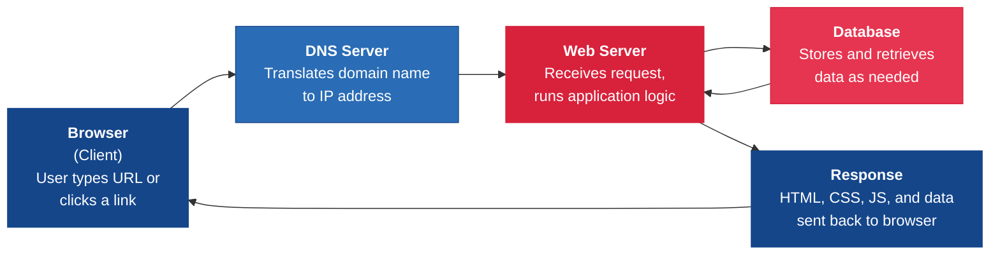
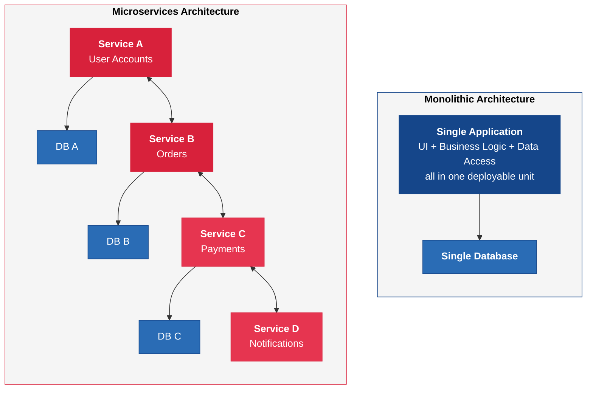
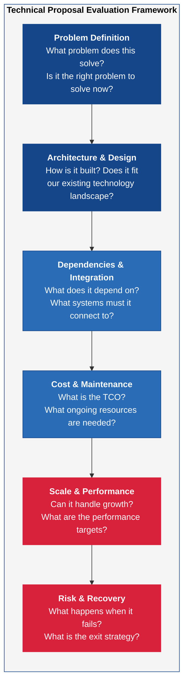

---
tags:
  - technology
  - technical-literacy
  - fundamentals
reading_time: 40
difficulty: Foundational
---

# Technical Literacy for Managers

## Overview

Business leaders do not need to write code. They do not need to configure servers, design database schemas, or debug software. But they do need enough technical understanding to evaluate proposals, ask informed questions, communicate effectively with engineering teams, and make sound technology decisions. This understanding — **technical literacy** — is the ability to grasp the fundamental building blocks of modern technology systems, not at an engineering level, but at a level that enables effective leadership.

Technical literacy for managers is analogous to financial literacy for engineers. An engineer does not need to prepare a balance sheet, but they should understand enough about budgets, ROI, and cost structures to make responsible decisions about the resources they consume. Similarly, a business leader does not need to write a Python script, but they should understand enough about how software is built, how systems communicate, and how data is stored to participate meaningfully in technology conversations that increasingly shape business strategy.

The gap between technical and non-technical leaders has become one of the most consequential divides in modern organizations. When business leaders lack technical literacy, they cannot accurately assess project timelines, they accept vendor claims uncritically, they approve architectures they do not understand, and they make strategic decisions based on incomplete information. When business leaders possess even a foundational level of technical understanding, they ask better questions, catch unrealistic promises earlier, communicate requirements more clearly, and earn the respect of engineering teams — which in turn leads to better collaboration and better outcomes.

This page does not aim to make you an engineer. It aims to give you the vocabulary, mental models, and conceptual frameworks you need to be a credible and effective participant in technology decisions.

!!! info "Why This Matters for MBA Students"
    Technical literacy now appears as a core competency in four of the six top-ranked MBA programs. Employers increasingly expect business leaders to understand the technology that powers their products, serves their customers, and runs their operations. The most effective leaders in modern organizations are those who can bridge the gap between business strategy and technology execution — translating business goals into technology requirements, and translating technology constraints into business trade-offs. Whether you go into consulting, finance, marketing, operations, or general management, you will work with engineers, evaluate technology investments, and make decisions that depend on understanding how technology works at a conceptual level. This page gives you that foundation.

---

## Key Concepts

### Programming Concepts for Non-Programmers

Software is built from **code** — written instructions that tell a computer what to do, step by step. A programmer writes these instructions in a programming language (a structured language with precise rules), and the computer executes them. Understanding a few core programming concepts helps you make sense of why software development takes the time and resources it does.

#### The Building Blocks of Code

**Variables** are named containers that hold data. A variable might hold a customer's name, an account balance, a date, or a true/false flag indicating whether a transaction has been approved. Variables are the fundamental units of data that programs manipulate.

**Logic** (also called conditional statements) allows programs to make decisions. "If the customer's credit score is above 700, approve the loan; otherwise, send it to manual review." Every business rule in every software system is implemented as logic — and the more complex the business rules, the more complex the code.

**Loops** allow programs to repeat actions. "For every transaction in today's batch, check for fraud indicators." Loops are why computers can process millions of records in seconds — the same instruction is applied repeatedly without human intervention.

**Functions** are reusable blocks of code that perform a specific task. A function might calculate shipping costs, validate an email address, or generate a monthly report. Functions allow programmers to write logic once and reuse it throughout an application, which reduces errors and simplifies maintenance.

#### Why This Matters for Understanding Timelines

When a development team estimates that a feature will take two days versus six months, the difference usually comes down to four factors:

1. **Complexity of business logic** — A simple data display might involve a few variables and straightforward logic. A multi-currency pricing engine with dynamic discounts, tax calculations across jurisdictions, and regulatory compliance checks involves thousands of interacting rules.
2. **Integration requirements** — Does the feature need to communicate with other systems? Each integration introduces complexity, testing requirements, and potential failure points.
3. **Data considerations** — Does the feature require changes to the database schema? Does it need to migrate existing data? Data changes are among the riskiest modifications in software development.
4. **Testing and quality assurance** — The more complex the feature, the more scenarios must be tested. A feature that touches financial calculations may require thousands of test cases to verify accuracy.

#### Common Programming Languages and When Each Is Used

You do not need to know the syntax of any programming language, but understanding what each major language is used for helps you follow technology conversations:

| Language | Primary Use | Why It Matters to You |
|----------|------------|----------------------|
| **Python** | Data analysis, AI/ML, automation, backend services | The dominant language in data science and AI. If your organization is investing in analytics or machine learning, Python is almost certainly involved. |
| **JavaScript** | Web applications (both frontend and backend) | Powers virtually every website and web application. If your company has a customer-facing web product, JavaScript is at its core. |
| **SQL** | Database queries and data manipulation | The universal language for working with data in relational databases. Business analysts, data teams, and reporting tools all rely on SQL. |
| **Java** | Large-scale enterprise applications, Android apps | The backbone of many ERP systems, banking platforms, and enterprise applications. Robust, well-established, and widely used in large organizations. |
| **C# / .NET** | Enterprise applications in Microsoft environments | Common in organizations with heavy Microsoft investments. Many internal business applications are built on this platform. |

The key takeaway is not to memorize these languages but to understand that **different tools are suited to different jobs**. When a development team recommends a particular technology stack, knowing why they chose it helps you evaluate whether the recommendation is sound.

!!! tip "A Practical Mental Model for Non-Programmers"
    You do not need to code, but you need to understand why some things take two days and others take six months. The next time an engineering team provides a timeline estimate, ask them to explain the major sources of complexity. Are there complex business rules that require extensive conditional logic? Are there integrations with external systems? Does the feature require changes to the database structure? Does it need to work across mobile, web, and internal systems simultaneously? These questions demonstrate engagement, earn credibility, and help you assess whether the estimate is reasonable — all without writing a single line of code.

### How the Internet Works

Every time you open a website, send an email, or use a cloud application, a series of invisible technical steps occurs in milliseconds. Understanding this process — even at a high level — helps you evaluate web-based technology proposals, understand performance issues, and make sense of concepts like cloud computing, CDNs, and cybersecurity.

#### The Client-Server Model

The internet operates on a **client-server model**. Your device (laptop, phone, tablet) is the **client** — it requests information. The **server** is a remote computer that stores data, runs applications, and sends responses back to the client. Every interaction you have with a website or web application is a conversation between your client device and one or more servers.

#### The Request-Response Cycle

When you type a URL into your browser (such as `www.example.com`), the following sequence occurs:

1. **DNS Lookup** — Your browser contacts a DNS server (the internet's phone book) to translate the human-readable domain name (`www.example.com`) into a numerical IP address (such as `93.184.216.34`) that identifies the specific server hosting that website.
2. **HTTP Request** — Your browser sends an HTTP (or HTTPS, the secure version) request to the server at that IP address, asking for the web page.
3. **Server Processing** — The web server receives the request, processes it (which may involve querying a database, running application logic, or fetching data from other services), and assembles the response.
4. **Response** — The server sends the assembled web page (HTML, CSS, JavaScript, images) back to your browser.
5. **Rendering** — Your browser interprets the response and displays the web page on your screen.

This entire process typically takes between 100 milliseconds and a few seconds, depending on the complexity of the page, the server's processing time, and the physical distance between the client and the server.

#### Key Protocols and Terms

- **HTTP/HTTPS** — The protocol (set of rules) that governs how clients and servers communicate on the web. HTTPS adds encryption, ensuring that data transmitted between client and server cannot be intercepted or tampered with. Modern browsers flag HTTP (non-encrypted) sites as "Not Secure."
- **DNS** — The Domain Name System, which translates human-readable domain names into IP addresses. Think of it as the internet's phone directory.
- **IP Address** — A unique numerical identifier assigned to every device connected to the internet (like a postal address for a computer).
- **URL** — A Uniform Resource Locator, the full address of a resource on the web (e.g., `https://www.example.com/products/widget`).

#### What "The Cloud" Actually Means

"The cloud" is not an abstraction floating in the air. It is a collection of physical servers housed in large data centers operated by companies like Amazon (AWS), Microsoft (Azure), and Google (GCP). When someone says an application "runs in the cloud," they mean it runs on servers owned and managed by a cloud provider, accessed over the internet. The cloud eliminates the need for organizations to own and operate their own physical servers — but the servers are very real, very physical, and very much located in specific buildings in specific cities. For a comprehensive treatment, see [Cloud Computing Strategy](cloud-computing.md).

#### Content Delivery Networks (CDNs)

A CDN is a network of servers distributed across many geographic locations that cache (store copies of) content closer to end users. When a user in Tokyo accesses a website hosted on a server in Virginia, a CDN can serve the content from a server in Tokyo instead, dramatically reducing load times. CDNs are why global websites feel fast regardless of where you access them.

#### Frontend vs. Backend: Two Sides of Every Application

When engineers discuss web applications, they often distinguish between the **frontend** and the **backend**. Understanding this distinction helps you follow technical conversations and understand where different types of work happen.

The **frontend** (also called the client side) is everything the user sees and interacts with — the buttons, forms, menus, images, and layouts that appear in the browser. Frontend development is concerned with user experience, visual design, responsiveness across different devices, and the speed at which the interface reacts to user actions. Technologies like HTML, CSS, and JavaScript power the frontend.

The **backend** (also called the server side) is everything that happens behind the scenes — processing business logic, querying databases, authenticating users, communicating with other systems, and assembling the data that the frontend displays. When you submit an order on an e-commerce site, the frontend captures your input, but the backend processes the payment, checks inventory, updates the database, and triggers a shipping notification. Technologies like Python, Java, and SQL power the backend.

The reason this matters for managers is that frontend work and backend work require different skills, different timelines, and different testing approaches. A feature that "looks simple" in the frontend (a single button) might require extensive backend work (connecting to three different systems, implementing complex business rules, and handling edge cases). Understanding this distinction helps you avoid the common mistake of estimating project complexity based on how the feature looks rather than what it does.

### APIs Explained for Business Leaders

An API — Application Programming Interface — is one of the most important concepts in modern technology, yet it is frequently misunderstood by non-technical leaders. Understanding APIs is essential because they are the foundation of system integration, platform business models, and the digital ecosystems that drive competitive advantage.

#### What APIs Are

An API is a defined interface that allows two software systems to communicate with each other. It specifies what requests one system can make of another, what data must be included in those requests, and what responses will be returned.

**The restaurant analogy**: Think of an API as the menu at a restaurant. The menu tells you what you can order (the available operations), what options you can customize (the parameters), and what you will receive (the response). You do not need to know how the kitchen works, what equipment the chef uses, or where the ingredients were sourced. The menu is the **interface** between you (the consumer) and the kitchen (the service). APIs work the same way — they define what you can request from a system without exposing how the system works internally.

#### Why APIs Matter for Business

APIs enable **integration** — connecting systems that were not originally designed to work together. When your CRM system automatically updates customer records based on data from your e-commerce platform, that connection happens through APIs. When your mobile banking app displays your account balance, it retrieves that data from the bank's core systems through an API.

APIs also enable **platform business models**. Salesforce, Stripe, Twilio, and many other technology companies derive significant value from their APIs. Stripe's API allows any business to embed payment processing into their application with a few lines of code, without building payment infrastructure from scratch. This API-first approach created an entirely new business model — Stripe processes hundreds of billions of dollars in payments annually because its API made integration effortless.

#### REST APIs

REST (Representational State Transfer) is the most common architectural style for web APIs. REST APIs use standard HTTP methods — GET (retrieve data), POST (create data), PUT (update data), DELETE (remove data) — to perform operations on resources. When a developer says they are "calling an API," they are typically sending an HTTP request to a REST API endpoint and receiving a structured response (usually in JSON format).

You do not need to understand the technical details of REST, but you should know that REST APIs are the standard way modern systems communicate, and that the quality, reliability, and documentation of a vendor's API is a critical factor in evaluating technology platforms.

#### The API Economy and API-First Strategy

The **API economy** refers to the ecosystem of businesses that create, expose, and consume APIs as commercial products. Companies with strong APIs create network effects — the more developers build on their platform, the more valuable the platform becomes. An **API-first strategy** means designing the API before the user interface, ensuring that all functionality is accessible programmatically. This enables partners, customers, and internal teams to build on top of the platform in ways the original designers may not have anticipated.

#### Evaluating a Vendor's API

When assessing a technology vendor, the quality of their API is a strong indicator of their engineering maturity and their commitment to interoperability. Key questions to ask:

- **Is the API well-documented?** — Good documentation includes clear descriptions of every available operation, the data required for each request, example responses, and error codes. Poor documentation suggests the API is an afterthought.
- **Is the API stable?** — Does the vendor version their API and maintain backward compatibility? Frequent breaking changes to an API force your engineering team to constantly update integrations.
- **What are the rate limits?** — APIs typically limit how many requests you can make per minute or per day. If your business requires high-volume data exchange, low rate limits can be a serious constraint.
- **Is there a sandbox environment?** — A sandbox (test environment) allows your developers to experiment with the API without affecting production data. Vendors that provide sandboxes are more serious about developer experience.
- **What is the SLA for API uptime?** — If your business depends on a vendor's API, their API downtime becomes your business downtime. Understanding the vendor's commitment to API availability is critical.

!!! question "Quick Check"
    - You are evaluating two competing payment processors for your e-commerce platform. Processor A has comprehensive API documentation, a sandbox environment, and a 99.99% uptime SLA. Processor B is 15% cheaper but has minimal documentation and no sandbox. Which would you choose and how would you justify the cost difference to your CFO?
    - A vendor tells your team, "Our system integrates with everything." Using the API evaluation criteria above, what specific follow-up questions would you ask to test whether that claim is substantive or marketing?

### Software Architecture: Monolith vs. Microservices

When engineers discuss "architecture," they are describing how a software application is structured — how its components are organized, how they communicate, and how they are deployed. Two dominant architectural patterns define most modern software systems.

#### Monolithic Architecture

A **monolith** is a single, unified application where all components — user interface, business logic, data access — are built and deployed as one unit. Think of it as a single-family house: everything is under one roof, connected, and interdependent.

**Advantages**: Simpler to develop, test, and deploy when the application is small. Easier to debug because all code is in one place. Lower operational overhead because there is only one thing to deploy and monitor.

**Disadvantages**: As the application grows, the codebase becomes large and difficult to understand. A change in one component can break another. Scaling requires scaling the entire application, even if only one component is experiencing high demand. Deployment becomes risky because every release ships the entire application.

#### Microservices Architecture

**Microservices** decompose an application into many small, independent services, each responsible for a specific business capability. Each service can be developed, deployed, and scaled independently. Think of it as a neighborhood of specialized shops rather than one department store — the bakery, the butcher, and the florist all operate independently but work together to serve the community.

**Advantages**: Individual services can be developed by independent teams, enabling organizational scalability. Services can be scaled independently — if the search service needs more capacity, you scale just that service, not the entire application. Technology choices can differ by service (one team might use Python, another Java). Failures are isolated — if one service goes down, others continue operating.

**Disadvantages**: Significantly more complex to operate. Communication between services requires network calls, which are slower and less reliable than in-process function calls within a monolith. Debugging issues that span multiple services is harder. Requires sophisticated DevOps capabilities, monitoring, and infrastructure.

#### The Netflix Example

Netflix is the most frequently cited example of the monolith-to-microservices migration. In 2008, Netflix experienced a major database failure that shut down DVD shipping for three days. This incident triggered a seven-year migration from a monolithic Java application to over 700 microservices running on AWS. The microservices architecture enabled Netflix to scale to 260+ million subscribers across 190 countries, deploy code thousands of times per day, and run thousands of A/B tests simultaneously. However, Netflix also invested hundreds of millions of dollars in the engineering infrastructure (monitoring, deployment, service discovery, fault tolerance) required to operate at that scale. Microservices solved Netflix's scaling challenge, but the trade-off was enormous operational complexity.

#### Comparing the Two Approaches

| Dimension | Monolithic | Microservices |
|-----------|-----------|---------------|
| **Structure** | Single codebase, single deployment unit | Many small services, independently deployed |
| **Team Model** | One large team or tightly coordinated teams | Small, autonomous teams owning individual services |
| **Scaling** | Scale the entire application together | Scale individual services independently |
| **Deployment Risk** | Every deployment ships everything; higher risk per release | Each service deploys independently; smaller blast radius |
| **Debugging** | Easier — all code is in one place | Harder — issues may span multiple services and network calls |
| **Technology Flexibility** | One technology stack for the whole application | Each service can use the best technology for its specific task |
| **Operational Complexity** | Lower — one thing to monitor and maintain | Higher — requires service discovery, monitoring, and orchestration |
| **Best Suited For** | Small-to-medium applications, early-stage companies | Large-scale applications, organizations with mature DevOps |

**The key insight for managers**: The right architecture depends on your organization's size, complexity, and engineering maturity. Most organizations do not need the complexity of microservices. Starting with a well-designed monolith and evolving toward microservices if and when the business demands it is often the most pragmatic strategy.

!!! question "Quick Check"
    - A 200-person company with a 10-person engineering team is building its first customer-facing application. The lead engineer proposes a microservices architecture "so we can scale from day one." Using the comparison table, what concerns would you raise, and what alternative approach would you suggest?
    - Netflix's migration to microservices took seven years and required hundreds of millions of dollars in supporting infrastructure. What does this tell you about the hidden costs of architectural decisions, and how should it inform how you evaluate an engineering team's architecture proposal?

### Databases: Where Business Data Lives

Every enterprise application — from CRM and ERP to e-commerce platforms and analytics tools — depends on a **database** to store, organize, and retrieve data. Understanding the basics of databases helps you ask informed questions about data quality, performance, and integration.

#### What Databases Do

A database is an organized collection of data stored electronically. Databases allow applications to create, read, update, and delete data efficiently, even when millions of records are involved. The database management system (DBMS) is the software that manages the database, enforces rules about data structure and integrity, and handles concurrent access by many users simultaneously.

#### SQL (Relational) Databases

Relational databases organize data into **tables** with **rows** (individual records) and **columns** (attributes of those records). Tables are linked through **relationships** — for example, a Customer table and an Order table are connected by a customer ID that appears in both tables, allowing you to query all orders for a specific customer.

SQL (Structured Query Language) is the standard language for querying and manipulating data in relational databases. Leading relational databases include PostgreSQL, MySQL, Microsoft SQL Server, and Oracle Database.

**Best for**: Structured data with clear relationships — financial transactions, customer records, inventory management, ERP data. When data integrity, consistency, and the ability to run complex queries across related data are critical.

#### NoSQL Databases

NoSQL databases are designed for use cases where relational databases struggle — extremely large data volumes, rapidly changing data structures, or data that does not fit neatly into rows and columns. NoSQL databases come in several varieties:

- **Document databases** (e.g., MongoDB) store data as flexible JSON-like documents, making them suitable for content management, user profiles, and applications where data structures change frequently.
- **Key-value stores** (e.g., Redis, DynamoDB) store data as simple key-value pairs, optimized for extremely fast lookups — ideal for caching, session management, and real-time applications.
- **Graph databases** (e.g., Neo4j) store data as nodes and relationships, making them powerful for social networks, fraud detection, and recommendation engines.

**Best for**: Unstructured or semi-structured data, applications requiring extreme scalability, real-time analytics, and use cases where flexibility in data structure is more important than rigid consistency.

#### Why Database Design Matters for Business

Poor database design has direct business consequences. Inconsistent data leads to inaccurate reporting. Poorly indexed databases cause slow application performance. Lack of data integrity rules allows duplicates and errors to accumulate. When an executive asks "Why do our customer counts differ between the CRM report and the finance report?" the root cause is often a data architecture problem — the same data stored in multiple databases without proper synchronization. Understanding that databases are not interchangeable commodities, and that database design decisions have lasting consequences for data quality, performance, and integration, makes you a more effective participant in technology discussions.

#### SQL vs. NoSQL: When to Use Each

| Consideration | SQL (Relational) | NoSQL |
|---------------|------------------|-------|
| **Data Structure** | Fixed schema — tables, rows, columns defined in advance | Flexible schema — data structure can change over time |
| **Relationships** | Excels at complex relationships between data entities | Handles relationships less naturally (depends on type) |
| **Consistency** | Strong consistency — data is always accurate and up to date | Eventual consistency — data may be temporarily inconsistent across nodes |
| **Scale** | Scales vertically (bigger server) | Scales horizontally (more servers) |
| **Query Complexity** | Supports complex joins and aggregations across tables | Optimized for simple, fast queries on large datasets |
| **Typical Use Cases** | Financial systems, ERP, CRM, regulatory reporting | Social media feeds, IoT sensor data, content management, real-time analytics |
| **Leading Products** | PostgreSQL, MySQL, Oracle, SQL Server | MongoDB, DynamoDB, Redis, Cassandra, Neo4j |

### Version Control and CI/CD

Modern software development relies on two practices that fundamentally changed how software is built and delivered: **version control** and **CI/CD** (Continuous Integration / Continuous Deployment).

#### Version Control (Git)

**Git** is a version control system — a tool that tracks every change made to a codebase over time. Think of it as "Track Changes" for software code, but vastly more powerful. Every developer on a team works with a copy of the codebase, makes changes in an isolated **branch** (a parallel version), and then **merges** those changes back into the main codebase after review and testing.

Version control provides three critical capabilities:

1. **History** — Every change is recorded, including who made it and why. If a change introduces a bug, the team can identify exactly what changed and revert it.
2. **Collaboration** — Multiple developers can work on different features simultaneously without overwriting each other's work.
3. **Code Review** — Before changes are merged, other team members review the code for quality, correctness, and adherence to standards.

**GitHub** is the most widely used platform for hosting Git repositories and managing collaborative software development. When a technology team mentions "pull requests" or "code reviews," they are describing the Git-based workflow for proposing, reviewing, and merging code changes.

#### CI/CD Pipelines

**Continuous Integration (CI)** means that every time a developer merges code changes, an automated pipeline runs a suite of tests to verify that the changes do not break existing functionality. This catches problems immediately, rather than discovering them weeks later during a manual testing phase.

**Continuous Deployment (CD)** extends this automation to production deployment — once code passes all automated tests, it is automatically deployed to the live environment. This is why modern software companies like Netflix, Amazon, and Google deploy code changes thousands of times per day, while traditional enterprises using manual deployment processes might release updates quarterly or annually.

The business implication is significant: CI/CD enables organizations to deliver new features, fix bugs, and respond to market changes faster and with lower risk than traditional release cycles. When evaluating a software vendor or an internal development team, asking about their CI/CD practices reveals a great deal about their engineering maturity and their ability to deliver value continuously.

#### The Traditional vs. Modern Release Model

| Dimension | Traditional Release Cycle | Modern CI/CD |
|-----------|--------------------------|-------------|
| **Release Frequency** | Quarterly, semi-annually, or annually | Daily, or even multiple times per day |
| **Release Size** | Large — hundreds of changes bundled together | Small — individual changes deployed independently |
| **Risk per Release** | High — many changes increase the chance of introducing defects | Low — small changes are easier to test and faster to roll back |
| **Time to Fix Bugs** | Weeks or months (wait for next release window) | Hours or days (deploy a fix immediately) |
| **Testing** | Manual testing phases lasting weeks | Automated tests running continuously |
| **Rollback** | Difficult and disruptive | Fast and routine — revert to the previous version |

This shift explains why modern software companies can iterate so rapidly. It also explains why organizations still on traditional release cycles struggle to keep pace — they are not just slower at coding; they are slower at testing, deploying, and recovering from problems. Understanding this distinction helps you assess both internal development teams and external software vendors.

!!! question "Quick Check"
    - Your company releases software updates quarterly. A competitor releases updates daily using CI/CD. Beyond speed, what specific business advantages does the competitor gain from this capability, and what organizational changes would your company need to make to adopt a similar approach?
    - A development team says, "We do not need CI/CD -- our manual testing process catches all the bugs." Using the traditional vs. modern release model comparison, explain why this argument underestimates the risk of the traditional approach and what metrics you would track to quantify the difference.

### How to Evaluate a Technical Proposal

One of the most valuable applications of technical literacy is the ability to evaluate technology proposals critically — whether they come from internal engineering teams, external vendors, or consultants. The following questions provide a framework for assessing any technical proposal:

| Question | What It Reveals |
|----------|----------------|
| **What problem does this solve?** | Whether the proposal is solution-driven or problem-driven. Technology for technology's sake is a common pitfall. |
| **What is the architecture?** | Whether the design is sound, scalable, and aligned with the organization's existing systems. Ask for a diagram. |
| **What are the dependencies?** | What other systems, teams, or vendors this project depends on. Dependencies are the #1 source of project delays. |
| **What is the maintenance cost?** | The total cost of ownership beyond the initial build — hosting, monitoring, patching, staffing. Maintenance typically costs 3-5x the initial development over a system's lifetime. |
| **How does it scale?** | Whether the system can handle 10x or 100x the initial load without a redesign. If the company grows, can the technology grow with it? |
| **What happens if it fails?** | The failure modes, recovery procedures, and business impact of downtime. No system is perfectly reliable — what matters is how failures are detected and recovered from. |
| **What is the migration/exit strategy?** | How the organization would move away from this technology if needed. If there is no exit strategy, you are accepting full vendor lock-in. |
| **What are the security implications?** | How data is protected, who has access, and how the system meets regulatory requirements. |

These questions do not require deep technical expertise to ask. But asking them consistently forces technical teams to think through the full lifecycle of their proposals and signals to them that you are a serious, engaged stakeholder.

#### Red Flags in Technical Proposals

Beyond asking the right questions, technically literate managers learn to recognize warning signs that a proposal has not been fully thought through:

- **No diagram** — If the team cannot draw how the system works, they may not fully understand it themselves. Architecture diagrams are the first artifact a well-prepared team should produce.
- **"It will be easy"** — In software development, this phrase almost always precedes a project that turns out to be difficult. Experienced engineers are specific about what is easy and what is hard; vague assurances are a red flag.
- **No discussion of failure modes** — Every system will eventually fail. A proposal that does not address what happens during failures — network outages, server crashes, data corruption — is incomplete.
- **Unclear ownership** — If no one can clearly articulate who will maintain and operate the system after it is built, the system will likely be neglected after launch, accumulating technical debt and security vulnerabilities.
- **No migration plan from the existing system** — A proposal for a new system that does not explain how the organization will transition from the current system is a plan for building software, not a plan for delivering business value.

---

## Frameworks & Models

### The Client-Server Request Cycle

The following diagram illustrates the fundamental request-response cycle that powers every interaction on the web. Understanding this cycle helps you conceptualize how web applications work, why network latency matters, and where performance bottlenecks can occur.

**Reading the diagram**: When you access a web page, your browser (the client) first contacts a DNS server to look up the IP address of the destination. The request is then routed to the web server, which may query a database to assemble the requested information. The assembled response travels back to your browser, which renders the page on your screen. This entire round trip typically completes in under one second.

### Monolithic vs. Microservices Architecture

The following diagram contrasts the two dominant software architecture patterns, illustrating how they differ in structure, communication, and deployment:

**Reading the diagram**: In a monolithic architecture (left), all functionality lives in a single application connected to a single database. In a microservices architecture (right), each business capability is an independent service with its own database, communicating with other services through APIs. The monolith is simpler to build and operate; the microservices architecture is more scalable and flexible but significantly more complex.

### Technical Proposal Evaluation Framework

When assessing any technology investment, use this structured framework to ensure you are asking the right questions across all dimensions:

---

## Real-World Applications

### Example 1: A CMO Challenges an Unrealistic Project Timeline

The chief marketing officer of a retail company was presented with a proposal from a digital agency to build a personalized recommendation engine for the e-commerce platform. The agency estimated eight weeks and $200,000. The CMO, who had recently developed a working understanding of APIs, databases, and integration complexity, asked three critical questions: "What data sources does the recommendation engine need to access?" (Answer: the product catalog, customer purchase history, browsing behavior, and inventory levels — four separate systems with no existing API connections.) "What happens when inventory changes in real time — does the engine update its recommendations?" (Answer: the initial proposal assumed a nightly batch update, which would result in recommending out-of-stock items.) "How does this integrate with the existing personalization we already do through our email platform?" (Answer: it did not — the proposal would create a second, parallel personalization system.)

These questions — which required no programming knowledge, only conceptual understanding of APIs, databases, and integration — revealed that the project was significantly underscoped. The revised estimate was 20 weeks and $650,000, but the end product would actually work. The CMO's technical literacy prevented the organization from spending $200,000 on a system that would have failed to deliver its intended value.

**Lesson**: The most common reason technology projects fail is not bad engineering — it is incomplete requirements and underestimated scope. A technically literate business leader is often the last line of defense against this failure mode.

### Example 2: A CFO Avoids Vendor Lock-In During an ERP Selection

During an ERP selection process, a CFO was evaluating two finalists. Vendor A offered a proprietary, fully integrated platform with lower upfront licensing costs. Vendor B offered a more modular system built on open standards with published REST APIs. The CFO asked both vendors about their data export capabilities and API documentation. Vendor A acknowledged that extracting data required purchasing an additional module and that integrations with non-partner systems were "not officially supported." Vendor B provided complete API documentation and demonstrated that data could be exported in standard formats at any time.

The CFO chose Vendor B despite the higher licensing cost, recognizing that the long-term risk of vendor lock-in with Vendor A could cost far more than the licensing differential. When the CTO later proposed integrating the ERP with a new analytics platform, the open APIs made the integration straightforward — a project that would have been prohibitively expensive with Vendor A's proprietary architecture. The CFO's understanding of APIs and vendor lock-in dynamics — concepts that require no programming knowledge — directly informed a decision that saved the organization millions over the following five years.

**Lesson**: The cheapest technology option at purchase time is frequently the most expensive option over a five-year horizon. Understanding API openness, data portability, and exit strategies allows business leaders to evaluate the true total cost of ownership, not just the sticker price.

### Example 3: A COO Detects Architectural Risk in a Digital Transformation Program

A chief operating officer at a logistics company was overseeing a digital transformation program that included building a new customer portal, a driver dispatch system, and a real-time shipment tracking application. The technology team proposed building all three as a single monolithic application to "save time and reduce complexity." The COO, who understood the trade-offs between monolithic and microservices architectures, raised a concern: "If the customer portal needs to handle a spike in traffic during peak shipping season, does scaling the portal also require scaling the dispatch system and tracking application?" The answer was yes — in a monolith, everything scales together. The COO then asked: "And if we need to update the dispatch logic, do we have to redeploy the entire application, including the customer portal?" Again, yes.

Based on this understanding, the COO requested that the architecture be reconsidered. The revised design separated the three systems as independent services connected through APIs, allowing each to be scaled and updated independently. This architectural decision — driven by a non-technical executive who understood the monolith vs. microservices trade-off — prevented significant operational problems that would have emerged during the first peak season.

**Lesson**: You do not need to be an architect to spot architectural risk. Understanding the basic trade-offs between monolithic and distributed architectures — particularly how they affect scaling, deployment, and independent evolution — is sufficient to ask the questions that surface potential problems before they become expensive failures.

---

## Common Pitfalls

!!! warning "Confusing Technical Vocabulary with Technical Understanding"
    Some managers learn to use technical terms — "API," "microservices," "cloud-native," "CI/CD" — without truly understanding what they mean. This creates a dangerous false confidence. Using buzzwords in meetings without grasping the underlying concepts can lead to approving proposals you do not actually understand, missing critical risks, and losing credibility with engineering teams who quickly recognize surface-level familiarity. True technical literacy means understanding the concepts well enough to ask probing follow-up questions, not just to recognize the terminology.

!!! warning "Assuming More Technology Is Always Better"
    Technical literacy should make you a more critical evaluator of technology, not a more enthusiastic adopter. A common pitfall is learning about a technology concept — microservices, AI, blockchain — and then looking for opportunities to apply it, even where it is not appropriate. Microservices add enormous operational complexity that most organizations do not need. AI requires high-quality data that many organizations do not have. The technically literate manager asks "Is this the right tool for this specific problem?" rather than "How can we use this exciting new technology?"

!!! warning "Underestimating Integration Complexity"
    Non-technical leaders consistently underestimate how difficult, time-consuming, and expensive it is to make systems talk to each other. Integration is the hidden cost in nearly every technology initiative. A project that looks straightforward in a vendor demo becomes a multi-month effort when you account for data mapping, error handling, security requirements, testing across environments, and ongoing maintenance of the integration. When evaluating any technology proposal, assume that integration will take longer and cost more than the initial estimate.

!!! warning "Delegating All Technical Decisions to the Technology Team"
    Some business leaders treat technical literacy as unnecessary because "that is what we have a CTO for." While you should absolutely rely on technical experts for implementation decisions, abdicating strategic technology decisions entirely to the technology team is risky. Technology choices have business consequences — they affect vendor relationships, capital allocation, competitive positioning, and organizational agility. The CTO should recommend and the business leadership should decide, and that decision-making requires enough technical understanding to evaluate the recommendation critically. Technical literacy does not replace technical expertise — it enables you to be a meaningful partner to the people who have it.

---

## Discussion Questions

1. **The Technical Literacy Spectrum**: Consider the range of technical literacy across a typical C-suite — the CEO, CFO, CMO, CHRO, and COO. What minimum level of technical understanding should each role possess? Should a CFO understand APIs? Should a CMO understand database architecture? Where does technical literacy become unnecessary for a given role, and where is the lack of it most dangerous? Use specific examples of decisions each role makes that would benefit from technical literacy.

2. **Evaluating a Technology Proposal**: Your company's engineering team proposes rebuilding the customer-facing application from a monolithic architecture to microservices. They estimate it will take 18 months and cost $4 million, but promise "significantly improved scalability and faster feature delivery." Using the Technical Proposal Evaluation Framework, what questions would you ask to assess this proposal? What red flags would you look for? Under what conditions would you approve or reject the proposal?

3. **The Build vs. Buy Decision Through a Technical Lens**: Your organization needs a new inventory management capability. The internal development team proposes building a custom solution using Python and PostgreSQL that will be "perfectly tailored to our needs." A vendor offers a SaaS solution with REST APIs that covers 80% of the requirements out of the box. Using the concepts from this page — APIs, databases, maintenance costs, integration complexity, and exit strategies — how would you evaluate these two options? What technical questions would you ask each side?

---

## Key Takeaways

- **Technical literacy does not mean learning to code** — it means understanding technology concepts well enough to evaluate proposals, ask informed questions, communicate with engineering teams, and make sound technology decisions.
- **Programming concepts** (variables, logic, loops, functions) explain why some software features take days while others take months. Complexity of business logic, integration requirements, data changes, and testing scope drive development timelines.
- **The internet operates on the client-server model** — your browser (client) sends requests to remote servers, which process them and return responses. DNS translates domain names to IP addresses, and HTTPS encrypts the communication.
- **APIs are the interfaces that connect systems** — they define what one system can request from another without exposing internal implementation details. APIs enable integration, platform business models, and the API economy.
- **Software architecture choices have lasting consequences** — monolithic architectures are simpler but harder to scale; microservices architectures are more scalable but significantly more complex to operate. The right choice depends on organizational context, not industry trends.
- **Databases are not interchangeable** — SQL (relational) databases excel at structured data with relationships; NoSQL databases handle unstructured data and extreme scale. Database design decisions directly affect data quality, performance, and integration capabilities.
- **Version control (Git) and CI/CD pipelines** are the foundation of modern software development, enabling teams to collaborate safely, catch errors automatically, and deploy changes continuously rather than in risky quarterly releases.
- **Integration is consistently underestimated** — it is the hidden cost and timeline risk in nearly every technology initiative. Always ask about integration requirements, dependencies, and the ongoing maintenance burden of connections between systems.
- **Evaluating technical proposals requires a structured approach** — ask about the problem being solved, the architecture, dependencies, total cost of ownership, scalability, failure modes, and exit strategy. These questions require conceptual understanding, not engineering expertise.
- **The most effective business leaders bridge the gap between business strategy and technology execution** — technical literacy is not a nice-to-have credential but a core leadership competency in technology-driven organizations.

---

## Related Topics

- [Cloud Computing Strategy](cloud-computing.md) — Understanding how cloud infrastructure works is a core component of technical literacy for managers.
- [Enterprise Architecture](enterprise-architecture.md) — Enterprise architecture provides the frameworks and governance structures for managing an organization's technology landscape.
- [Enterprise Applications](enterprise-applications.md) — ERP, CRM, and other enterprise applications are the systems that technical literacy helps you evaluate and govern.
- [Open Source vs. Proprietary Software](open-source-software.md) — Understanding the open source landscape helps managers make informed build-vs-buy and vendor selection decisions.

---

## Further Reading

- **Reeves, Martin, and Adam Job.** "Tech Fluency Is a Must for Leaders." *Harvard Business Review*, 2024. Argues that technical fluency is now a non-negotiable leadership competency and provides a framework for developing it.
- **McAfee, Andrew, and Erik Brynjolfsson.** *Machine, Platform, Crowd: Harnessing Our Digital Future.* W.W. Norton, 2017. Explores the three major technology-driven shifts reshaping business — accessible to non-technical readers.
- **Hohpe, Gregor.** *The Software Architect Elevator: Redefining the Architect's Role in the Digital Enterprise.* O'Reilly Media, 2020. An excellent bridge between technical and business perspectives on software architecture.
- **Fowler, Martin.** "Microservices: A Definition of This New Architectural Term." martinfowler.com, 2014. The definitive accessible explanation of microservices architecture, written for a broad audience.
- **Fielding, Roy Thomas.** *Architectural Styles and the Design of Network-Based Software Architectures.* Doctoral dissertation, University of California, Irvine, 2000. The original academic work that defined REST, for those who want to understand the foundations of modern API design.
- **Kim, Gene, Jez Humble, Patrick Debois, and John Willis.** *The Phoenix Project: A Novel about IT, DevOps, and Helping Your Business Win.* IT Revolution Press, 2013. A business novel that makes DevOps, CI/CD, and modern software delivery practices accessible and engaging for non-technical readers.
- Related primer pages: [Cloud Computing Strategy](cloud-computing.md) for how cloud infrastructure works, [Enterprise Architecture](enterprise-architecture.md) for the frameworks governing technology decisions, [Enterprise Applications](enterprise-applications.md) for the systems that technical literacy helps you evaluate, [Open Source vs. Proprietary Software](open-source-software.md) for understanding software licensing and ecosystem dynamics, and [Vendor Management](../management/vendor-management.md) for evaluating and managing technology vendor relationships.
- **ITEC-617 Course Textbook**: See the assigned readings on technology fundamentals and IT management for additional context on how technical literacy supports effective business leadership.
