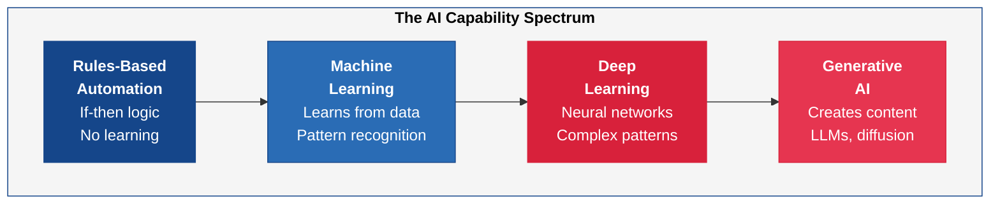
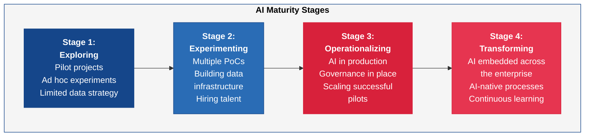
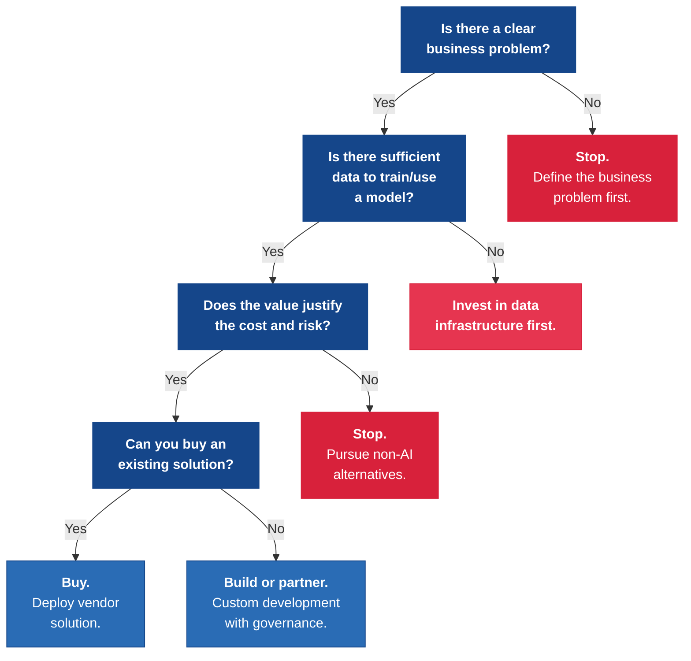

---
tags:
  - transformation
  - AI
  - emerging-technology
  - strategy
reading_time: 40
difficulty: Intermediate
---

# AI & Emerging Technology

## Overview

Artificial intelligence has moved from research labs and science fiction into the boardroom. In 2025-2026, every major enterprise technology vendor embeds AI capabilities into its products, generative AI tools are reshaping knowledge work, and boards of directors are asking their leadership teams pointed questions about AI strategy, risk, and competitive positioning. For MBA students, the challenge is not learning to build AI systems — that is the job of data scientists and engineers — but rather developing the judgment to evaluate AI opportunities, govern their deployment responsibly, and lead organizations through a technology shift that is as profound as the internet itself.

At the same time, AI is not the only emerging technology demanding executive attention. IoT is generating unprecedented volumes of operational data. Blockchain has moved past the hype cycle and found legitimate (if narrow) enterprise applications. Quantum computing remains on the horizon but is already influencing long-term security planning. Edge computing is pushing intelligence closer to where data is created. The common thread across all of these technologies is that their business impact depends far more on strategic clarity and organizational readiness than on technical sophistication.

This chapter equips you with the conceptual frameworks, vocabulary, and strategic thinking tools you need to engage credibly with AI and emerging technology as a business leader. You do not need to understand backpropagation or transformer architectures — but you do need to know what questions to ask, what risks to manage, and how to distinguish genuine opportunity from vendor hype.

???+ abstract "Executive Summary"
    **Reading time:** ~25 minutes | **Difficulty:** Intermediate

    - AI spans a **capability spectrum** from rules-based automation through ML, deep learning, and generative AI — managers need to know what each can and cannot do
    - **AI strategy starts with the business problem**, not the technology — the most common failure is pursuing AI for its own sake
    - **Data readiness** (availability, quality, labeling, governance) is the primary bottleneck, not model capability
    - The **EU AI Act** (phased enforcement from February 2025) creates a risk-based regulatory framework that applies globally to companies serving EU users
    - As AI models **commoditize**, competitive advantage shifts to proprietary data, process integration, and organizational capability

!!! info "Why This Matters for MBA Students"
    AI and emerging technologies are no longer optional topics for business leaders — they are central to competitive strategy, risk management, and value creation. As an MBA graduate, you will encounter AI in virtually every functional area: marketing teams using generative AI for content creation, finance teams deploying ML models for fraud detection, operations teams using IoT and predictive analytics to optimize supply chains, and HR teams navigating the workforce implications of automation. You will sit on steering committees evaluating AI investments, present AI-related business cases to boards, negotiate with vendors selling AI-powered solutions, and manage teams where humans and AI systems work side by side. The leaders who succeed will not be those who understand AI the most deeply from a technical perspective, but those who ask the best questions, anticipate the risks, and connect AI capabilities to real business outcomes. This chapter gives you that foundation.

## Key Concepts

### AI Fundamentals for Managers

#### What is Artificial Intelligence?

AI is a broad term that refers to computer systems designed to perform tasks that traditionally require human intelligence — recognizing patterns, making decisions, understanding language, and generating content. For managers, it is more useful to think of AI not as a single technology but as a **spectrum of capabilities** with increasing sophistication:

- **Rules-based automation** follows explicit instructions written by humans ("if the customer's credit score is below 600, decline the application"). It does not learn or adapt. This is the simplest form of "intelligence" and has been in use for decades.

- **ML** goes a step further: instead of following pre-written rules, the system learns patterns from historical data and applies those patterns to new situations. A fraud detection model, for example, analyzes millions of past transactions to learn what fraudulent activity looks like, then flags new transactions that match those patterns — even patterns a human analyst might miss.

- **Deep learning** is a subset of ML that uses artificial neural networks with many layers (hence "deep") to handle very complex patterns. Deep learning powers image recognition (identifying objects in photos), speech recognition (voice assistants), and many other applications where traditional ML falls short.

- **Generative AI** represents the most recent breakthrough. Rather than classifying or predicting, generative AI creates new content — text, images, code, audio, video — based on patterns learned from vast training datasets. Large language models (LLMs) such as GPT-4, Claude, and Gemini are the most prominent examples. These models have demonstrated remarkable fluency in generating human-like text, answering questions, summarizing documents, and writing software code.

- **NLP** cuts across the spectrum and refers to the ability of AI systems to understand, interpret, and generate human language. NLP powers chatbots, sentiment analysis, document summarization, and translation. With the rise of LLMs, NLP capabilities have improved dramatically — modern systems can understand nuance, context, and even sarcasm far better than systems from just a few years ago.

#### The AI Landscape in 2025-2026

The AI landscape is evolving rapidly. Several developments define the current moment:

| Trend | What is Happening | Business Implication |
|-------|-------------------|---------------------|
| **Generative AI mainstreaming** | LLMs are embedded in productivity tools (Microsoft Copilot, Google Gemini, Salesforce Einstein) | Every knowledge worker now has access to AI assistance; the question shifts from "should we use AI?" to "how do we use it responsibly?" |
| **AI commoditization** | Foundation models are available from multiple vendors (OpenAI, Anthropic, Google, Meta, open-source) | The AI model itself is rarely a differentiator; competitive advantage comes from proprietary data, integration, and organizational capability |
| **Agentic AI** | AI systems that can plan, reason across multiple steps, use tools, and take actions autonomously | Potential to automate complex workflows, but raises new governance and oversight challenges |
| **Regulation acceleration** | The EU AI Act is in force; US, UK, and other jurisdictions are developing AI governance frameworks | Companies need AI governance structures now, not later |
| **Talent scarcity** | Demand for AI/ML engineers, data scientists, and AI product managers far exceeds supply | Organizations must decide whether to build, buy, or partner for AI capabilities |
| **Data as the bottleneck** | Models are increasingly capable, but most organizations lack the clean, labeled, accessible data needed to deploy AI effectively | Data governance and data infrastructure are prerequisites for AI success |

### AI Strategy

Deploying AI successfully requires more than selecting a technology — it requires a coherent strategy that connects AI investments to business outcomes. The strategic questions fall into four categories.

#### When and How to Invest in AI

Not every business problem needs an AI solution, and not every AI project delivers value. The most common mistake organizations make is pursuing AI for its own sake — launching "AI initiatives" to demonstrate innovation without a clear business case. Effective AI strategy starts with the business problem, not the technology.

Questions to ask before investing in AI:

1. **Is the problem well-defined?** AI works best when the objective is clear and measurable. "Improve customer satisfaction" is too vague; "reduce customer service response time from 24 hours to 2 hours while maintaining resolution quality" is actionable.

2. **Is there sufficient data?** ML models require training data — historical examples of the patterns you want the system to learn. If you do not have enough data, or if the data is poor quality, AI will not deliver results.

3. **What is the baseline?** Before deploying AI, measure how the process performs today. Without a baseline, you cannot demonstrate ROI.

4. **What is the cost of being wrong?** AI models make mistakes. In low-stakes applications (product recommendations), errors are tolerable. In high-stakes applications (medical diagnosis, loan approvals), errors have serious consequences and require human oversight.

5. **Is there organizational readiness?** Even a technically excellent AI solution will fail if the people who need to use it do not trust it, understand it, or have the skills to work with it.

#### Build vs. Buy AI Capabilities

Organizations face a fundamental choice in how they acquire AI capabilities:

| Approach | Description | Best When | Risks |
|----------|-------------|-----------|-------|
| **Build** | Develop custom AI models and infrastructure in-house | AI is a core differentiator; you have proprietary data and talent; your problem is unique | High cost; talent scarcity; long time to value; ongoing maintenance burden |
| **Buy (SaaS)** | Purchase AI-powered applications from vendors | The use case is common (e.g., CRM intelligence, fraud detection); speed matters | Vendor lock-in; limited customization; data leaves your environment |
| **Platform** | Use cloud AI platforms (AWS SageMaker, Azure AI, Google Vertex AI) to build on pre-built components | You need customization but do not want to build from scratch; you have some data science capability | Requires technical talent; cloud cost management; platform dependency |
| **Partner** | Engage consulting firms or AI startups for specific projects | You lack internal capability; the need is urgent; the problem is well-scoped | Knowledge does not stay in-house; ongoing dependency; cost |

Most organizations use a combination of approaches — buying SaaS solutions for common use cases, building custom models where AI is a competitive differentiator, and partnering for specialized projects.

#### Data Readiness

AI is only as good as the data that feeds it. The most common reason AI projects fail is not the model — it is the data. Data readiness encompasses several dimensions:

- **Availability** — Do you have the data you need, and can you access it? Data may exist but be trapped in silos, legacy systems, or formats that are difficult to extract.
- **Quality** — Is the data accurate, complete, and consistent? Garbage in, garbage out applies even more to AI than to traditional analytics.
- **Volume** — Do you have enough data to train a model? Deep learning models in particular require large datasets.
- **Labeling** — For supervised learning, data must be labeled (e.g., "this transaction was fraudulent" or "this email is spam"). Labeling is often the most expensive and time-consuming step.
- **Governance** — Do you have the legal right to use the data for AI purposes? Privacy regulations (GDPR, state privacy laws) may restrict how customer data can be used for training models.

#### Talent Strategy

AI talent is scarce and expensive. Organizations need to think carefully about their talent approach:

- **Hire data scientists and ML engineers** for core, differentiating AI work
- **Upskill existing employees** to work with AI tools — citizen data science, prompt engineering, AI-assisted workflows
- **Establish an AI center of excellence** to provide shared resources, best practices, and governance
- **Partner with universities and research institutions** for access to emerging talent and cutting-edge research
- **Leverage AI-powered tools to augment non-technical staff** — generative AI is making it possible for business analysts, marketers, and managers to accomplish tasks that previously required technical specialists

!!! question "Quick Check"
    - Your organization has clean, abundant customer data and a unique problem no vendor product solves. Your competitor relies entirely on off-the-shelf AI from a SaaS vendor. Using the build-vs-buy framework, which company is more likely to achieve a durable competitive advantage from AI, and why?
    - A VP proposes an AI initiative by saying, "Our competitors are using AI, so we need to as well." Using the five questions for evaluating AI investment, what is wrong with this reasoning, and what would you ask before approving the project?

### AI Governance

As AI becomes more pervasive, governing its use responsibly becomes a critical organizational capability. AI governance addresses the ethical, legal, and operational risks that arise when machines make or influence decisions.

#### Core Governance Concerns

- **Bias and fairness** — AI models learn from historical data, which often reflects historical biases. A hiring model trained on past hiring decisions may perpetuate gender or racial bias. A lending model may disadvantage certain demographic groups. Organizations must test for bias, monitor outcomes, and ensure that AI does not create or amplify unfair treatment.

- **Transparency and explainability** — Many AI models, particularly deep learning models, operate as "black boxes" — they produce outputs but cannot explain their reasoning. In regulated industries (finance, healthcare, insurance), regulators increasingly require that organizations be able to explain why an AI system made a particular decision. The trade-off between model accuracy and explainability is a real strategic consideration.

- **Accountability** — When an AI system makes a mistake — denying a qualified loan applicant, misdiagnosing a medical condition, generating harmful content — who is responsible? Organizations need clear accountability frameworks that assign human oversight to AI-driven decisions.

- **Privacy** — AI systems often require large volumes of data, including personal data. Organizations must ensure that AI usage complies with privacy regulations and that individuals' data is protected throughout the AI lifecycle.

- **Security** — AI models themselves can be attacked. Adversarial attacks can cause models to misclassify inputs. Training data can be poisoned. Models can be stolen through extraction attacks. AI security is an emerging discipline that requires attention.

#### Responsible AI Frameworks

Leading organizations are establishing formal responsible AI frameworks that typically include:

1. **AI principles** — A public statement of the organization's values regarding AI (e.g., "We will not deploy AI that discriminates based on protected characteristics")
2. **AI ethics board or review committee** — A cross-functional body that reviews high-risk AI applications before deployment
3. **Impact assessments** — Structured evaluations of potential harms before deploying AI in sensitive contexts
4. **Monitoring and auditing** — Ongoing measurement of AI system performance, fairness metrics, and drift (where model accuracy degrades over time as conditions change)
5. **Incident response** — Processes for identifying, escalating, and remediating AI failures or harms

#### The EU AI Act

The EU AI Act (phased enforcement beginning February 2025; high-risk provisions effective August 2026) is the world's first comprehensive AI regulation. It establishes a **risk-based classification system** for AI applications:

| Risk Category | Definition | Requirements | Examples |
|---------------|------------|--------------|----------|
| **Unacceptable** | AI that poses a clear threat to safety or fundamental rights | **Prohibited** | Social scoring by governments; real-time biometric surveillance in public spaces (with narrow exceptions) |
| **High Risk** | AI used in contexts with significant potential for harm | Conformity assessments; risk management; data governance; human oversight; transparency; logging | AI in hiring decisions; credit scoring; medical devices; law enforcement; critical infrastructure |
| **Limited Risk** | AI that interacts with people or generates content | Transparency obligations — users must be informed they are interacting with AI or viewing AI-generated content | Chatbots; deepfake generators |
| **Minimal Risk** | AI with negligible risk to rights or safety | No specific requirements | Spam filters; AI in video games; inventory optimization |

For global companies, the EU AI Act has extraterritorial reach — it applies to any organization that deploys AI systems affecting people in the EU, regardless of where the organization is headquartered. This makes it relevant for any multinational, including US-based companies.

!!! question "Quick Check"
    - A US-based fintech company uses an AI model to approve consumer loans. Under the EU AI Act's risk classification, what category would this likely fall into, and what obligations would follow -- even though the company is headquartered in the US?
    - Your company's AI hiring tool screens resumes and was trained on five years of past hiring decisions. What specific governance concern should you investigate before deploying it, and what could go wrong if you skip that step?

### Generative AI in the Enterprise

Generative AI — particularly LLMs — represents the most significant AI development for business leaders to understand in 2025-2026. These systems can generate human-quality text, code, images, and analysis, and they are being integrated into enterprise workflows at unprecedented speed.

#### Key Enterprise Use Cases

| Use Case | Description | Business Function | Maturity |
|----------|-------------|-------------------|----------|
| **Content generation** | Drafting marketing copy, reports, emails, presentations | Marketing, Communications | High — widely deployed |
| **Code generation and assistance** | Writing, reviewing, and debugging software code | IT, Product Development | High — GitHub Copilot, Cursor widely adopted |
| **Customer service** | AI-powered chatbots and agent assistants that handle customer inquiries | Customer Support, Sales | Medium-High — augmenting human agents |
| **Document analysis** | Summarizing contracts, extracting data from documents, compliance review | Legal, Finance, Compliance | Medium — rapidly advancing |
| **Data analysis and insights** | Querying databases in natural language, generating visualizations, identifying trends | Analytics, Strategy, Finance | Medium — emerging capability |
| **Knowledge management** | Searching internal knowledge bases, onboarding new employees, capturing institutional knowledge | HR, Operations | Medium — enterprise search + AI |
| **Product development** | Generating design concepts, testing hypotheses, accelerating R&D | Engineering, R&D | Early — growing adoption |

#### Risks and Challenges

Generative AI introduces risks that are qualitatively different from traditional software:

- **Hallucination** — LLMs can generate confident, plausible-sounding outputs that are factually incorrect. A model might cite a case law precedent that does not exist, fabricate financial figures, or present speculation as fact. This is not a bug that will be "fixed" — it is an inherent characteristic of how probabilistic language models work. Mitigation requires human review, retrieval-augmented generation (RAG) architectures that ground outputs in verified data, and clear user education.

- **Data leakage** — When employees use public generative AI tools, they may inadvertently share proprietary information (source code, financial data, customer information, strategic plans) with the AI provider. This data may be used to train future models, effectively making your proprietary information available to competitors. Mitigation requires enterprise-grade AI deployments with data retention controls, clear usage policies, and approved tool lists.

- **Intellectual property concerns** — Generative AI raises unresolved legal questions: Who owns content generated by AI? Can AI-generated output infringe on copyrights of the training data? Can you patent an AI-generated invention? The legal landscape is evolving rapidly, and organizations need legal counsel that understands these issues.

- **Over-reliance and deskilling** — If employees become dependent on AI for tasks they previously performed themselves, the organization may lose critical skills and institutional knowledge. The goal should be AI-augmented human performance, not AI-replaced human judgment.

- **Quality and brand risk** — AI-generated content that is published without adequate review can damage brand reputation, spread misinformation, or create legal liability. Organizations need editorial governance for AI-generated outputs.

### Other Emerging Technologies

While AI dominates the current conversation, several other emerging technologies deserve strategic attention.

#### IoT (Internet of Things)

IoT refers to networks of physical devices — sensors, machines, vehicles, appliances — that collect and transmit data. IoT is most impactful in industries with large physical operations:

- **Manufacturing** — Predictive maintenance (sensors detect when equipment is likely to fail before it does), quality monitoring, production optimization
- **Supply chain** — Real-time tracking of goods, temperature monitoring for perishables, inventory automation
- **Energy and utilities** — Smart grid management, consumption monitoring, environmental sensing
- **Healthcare** — Remote patient monitoring, medical device data, facility management

The business value of IoT depends on the ability to analyze the data it generates — which brings IoT full circle back to AI and analytics. An IoT sensor that generates data nobody uses is just an expense.

#### Blockchain — Where It Actually Adds Value

Blockchain had an extended hype cycle that promised to "disrupt everything." In practice, enterprise blockchain has found value in a narrow set of use cases where **multiple parties need to share a trusted record without a central authority**:

- **Supply chain provenance** — Tracking the origin and movement of goods (e.g., verifying that diamonds are conflict-free, that pharmaceuticals are not counterfeit)
- **Trade finance** — Digitizing letters of credit and trade documentation across multiple banks and borders
- **Digital identity** — Decentralized identity verification systems
- **Smart contracts** — Automated execution of contractual terms when predefined conditions are met

For most enterprise applications, a traditional database with appropriate access controls is simpler, cheaper, and more performant than a blockchain. The right question is not "should we use blockchain?" but "do we have a problem that specifically requires decentralized trust?" If not, blockchain is likely the wrong tool.

#### Quantum Computing — Future State

Quantum computing uses the principles of quantum mechanics to process information in fundamentally different ways than classical computers. While practical, general-purpose quantum computers remain years away, the technology is worth tracking for two reasons:

1. **Cryptographic risk** — Quantum computers will eventually be able to break many current encryption algorithms. Organizations handling sensitive data with long shelf lives (government, defense, financial services) are already beginning to plan for "post-quantum cryptography" — encryption methods that will resist quantum attacks.

2. **Optimization potential** — Quantum computing shows promise for complex optimization problems (logistics routing, portfolio optimization, drug discovery) that are intractable for classical computers. While this is still largely theoretical at enterprise scale, early partnerships between quantum computing firms and large enterprises are exploring these possibilities.

For most MBA students, the key takeaway is: quantum computing is not something you need to act on today, but it is something your organization's technology strategy should acknowledge as a future factor — particularly regarding data security.

#### Edge AI

Edge AI refers to running AI models on devices at the "edge" of the network — on-site at factories, in vehicles, on mobile devices — rather than sending all data to the cloud for processing. Edge AI is important when:

- **Latency matters** — Autonomous vehicles and industrial robots cannot wait for a round trip to the cloud; they need real-time decisions
- **Bandwidth is limited** — IoT devices may generate too much data to transmit everything to the cloud
- **Privacy is a concern** — Processing data locally means sensitive information does not leave the device
- **Connectivity is unreliable** — Remote operations (mining, agriculture, offshore energy) may have intermittent internet access

Edge AI represents the convergence of IoT, AI, and cloud computing and is increasingly relevant for organizations with significant physical operations.

### Proprietary vs. Open Source vs. Open Weights AI Models

The AI model landscape has fragmented into distinct categories based on how much of the model's components are publicly available. Understanding these categories is essential for managers making AI deployment decisions, as each has different implications for cost, customization, data privacy, and vendor lock-in.

#### Proprietary / Closed Models

Proprietary models — such as OpenAI's GPT-4, Anthropic's Claude, and Google's Gemini — keep their model weights, training data, and training code confidential. Users access these models through APIs or integrated products, paying per-use fees (typically measured in tokens — units of text processed).

**Strengths**: Highest performance on many benchmarks; continuous improvement by the vendor; no infrastructure management required; easy to get started via API.

**Limitations**: Data privacy concerns (your prompts and data are processed on the vendor's servers); limited customization beyond prompt engineering; vendor lock-in to a specific provider's API; recurring costs that scale with usage; no ability to inspect or audit the model's behavior at a deep level.

#### Open Weights Models

Open weights models — such as Meta's Llama, Mistral AI's models, and Falcon — release the trained model weights (the mathematical parameters that define the model's behavior) but may not release the full training code or training data. This allows organizations to download and run the model on their own infrastructure, fine-tune it on proprietary data, and modify it for specific use cases.

**Strengths**: Can run on your own infrastructure (cloud or on-premise), keeping data private; fine-tuning enables customization for specific business domains; no per-query API fees (though compute costs apply); reduced vendor lock-in.

**Limitations**: Requires technical expertise to deploy and manage; compute infrastructure costs (GPU servers are expensive); training data and methodology may not be transparent; "open weights" does not mean "open source" in the full sense — the training process may not be reproducible.

#### Fully Open Source Models

Fully open source AI models — such as AI2's OLMo and BigScience's BLOOM — release everything: model weights, training code, training data, and evaluation tools. This enables full transparency, reproducibility, and community contribution.

**Strengths**: Maximum transparency and auditability; full reproducibility; community-driven improvement; no licensing restrictions for most uses; aligned with open science principles.

**Limitations**: Often smaller and less capable than proprietary or open-weights models (due to resource constraints); require significant technical expertise; may lack enterprise support.

#### Model Comparison

| Dimension | Proprietary (GPT-4, Claude, Gemini) | Open Weights (Llama, Mistral) | Fully Open Source (OLMo, BLOOM) |
|-----------|--------------------------------------|-------------------------------|----------------------------------|
| **Model weights** | Closed | Available | Available |
| **Training code** | Closed | Usually closed | Available |
| **Training data** | Closed | Usually closed | Available |
| **Performance** | Highest (most investment) | Competitive and improving | Moderate (improving) |
| **Cost model** | Pay per token / API call | Compute infrastructure costs | Compute infrastructure costs |
| **Data privacy** | Data sent to vendor servers | Can run locally | Can run locally |
| **Customization** | Prompt engineering; limited fine-tuning | Full fine-tuning; custom deployment | Full fine-tuning; modify anything |
| **Vendor lock-in** | High (API-specific) | Low (portable weights) | Lowest (fully reproducible) |
| **Enterprise support** | Vendor-provided | Community + some vendor support | Community-driven |
| **Transparency** | Low (black box) | Medium (weights visible, training opaque) | High (everything visible) |

#### The "Open vs. Closed" Debate

The AI industry is engaged in an active debate about the merits of open vs. closed models. **Innovation speed** favors open models — thousands of researchers can experiment simultaneously. **Safety and alignment** arguments cut both ways — closed model proponents argue restricting access prevents misuse, while open model proponents counter that transparency enables broader scrutiny. **Commoditization** is the key strategic trend: as open models approach proprietary performance, competitive advantage shifts from the model itself to proprietary data, fine-tuning expertise, and application-layer innovation.

For managers, the practical question is: **which approach best serves your specific use case, data privacy requirements, and organizational capability?** Most enterprises will use a mix — proprietary APIs for general-purpose tasks, and open-weights models for sensitive or specialized applications where data privacy and customization are paramount.

### AI Hosting and Deployment Options

Where and how AI models run has significant implications for cost, performance, privacy, and organizational control.

#### Cloud AI Services (Managed APIs)

Cloud AI services — such as AWS Bedrock, Azure OpenAI Service, and Google Vertex AI — provide access to pre-trained AI models through managed APIs. The cloud provider handles all infrastructure, scaling, and model management.

**Best for**: Organizations getting started with AI; variable usage patterns; use cases that do not require fine-tuning; rapid prototyping.

#### Self-Hosted Cloud (GPU Instances)

Organizations can run open-weights models on cloud GPU instances (AWS SageMaker, Azure ML, Google Cloud AI Platform) with full control over the model and data.

**Best for**: Organizations with data privacy requirements that preclude third-party APIs; use cases requiring fine-tuning on proprietary data; high-volume usage where per-query API costs become expensive.

#### On-Premise Deployment

Running AI models on dedicated hardware within the organization's own data centers — essential for industries with strict data sovereignty requirements or air-gapped environments.

**Best for**: Government, defense, healthcare, and financial services with strict data residency requirements; air-gapped environments; applications where data cannot leave the organization's physical control.

#### AI Hosting Comparison

| Dimension | Cloud API (Managed) | Self-Hosted Cloud | On-Premise | Edge |
|-----------|--------------------|--------------------|------------|------|
| **Upfront cost** | None | Low-moderate | High (hardware) | Moderate (devices) |
| **Ongoing cost** | Pay per use (tokens) | GPU instance hours | Power, cooling, staff | Device maintenance |
| **Data privacy** | Data sent to provider | Data stays in your cloud | Data never leaves your facility | Data stays on device |
| **Latency** | Network-dependent | Network-dependent | Low (local network) | Lowest (on-device) |
| **Scalability** | Virtually unlimited | Limited by GPU availability | Limited by owned hardware | Limited by device count |
| **Expertise required** | Low (API integration) | Medium-High (ML engineering) | High (ML + infrastructure) | High (ML + embedded) |

#### AI Cost Economics

AI costs are a rapidly evolving landscape that managers must understand:

- **Token pricing for proprietary models**: GPT-4 class models cost $5-30 per million input tokens and $15-60 per million output tokens. Costs have been declining rapidly (10x reduction in 2 years).
- **GPU compute costs**: A single NVIDIA H100 GPU costs ~$30,000 to purchase or ~$3-4 per hour to rent. Training a large model requires hundreds to thousands of GPUs for weeks.
- **Fine-tuning economics**: Fine-tuning an open-weights model on proprietary data costs thousands to tens of thousands of dollars in compute — far less than training from scratch, and often delivers better results for specific use cases than prompting alone.
- **Build vs. buy**: For most enterprises, buying AI capabilities via APIs or vendor software is more cost-effective than building. Building makes sense only when AI is a core differentiator and you have unique data and talent.

*Sources: OpenAI and Anthropic published pricing, 2024-2025; NVIDIA H100 pricing, 2024*

!!! tip "Data Privacy and AI — Key Considerations"
    - **Training data concerns**: Did the model's training data include your proprietary information? Could it reproduce copyrighted material?
    - **Prompt handling**: When you send data to an AI API, what happens to it? Does the provider use it for training? Enterprise agreements typically prohibit this, but free-tier terms may not.
    - **Data residency**: Where is the AI model physically located? For regulated industries, data processed by AI may need to stay within specific geographic boundaries.
    - **Enterprise AI policies**: Organizations should establish clear policies covering approved AI tools, permitted data sharing, output review requirements, and accountability for AI-assisted decisions.

### Competitive Implications

AI is not just a technology decision — it is a competitive strategy decision. Several dynamics are reshaping how organizations compete:

#### AI as a Commodity vs. Differentiator

As foundation models become widely available and AI capabilities are embedded in standard enterprise software, the AI model itself is increasingly a commodity. The sources of competitive differentiation are shifting:

- **Proprietary data** — Organizations with unique, high-quality datasets can build AI capabilities that competitors cannot easily replicate
- **Process integration** — The value is not in having AI but in embedding it deeply into business processes in ways that create measurable improvement
- **Organizational capability** — Speed of adoption, cross-functional collaboration, and change management separate leaders from laggards
- **Customer trust** — Organizations that deploy AI responsibly and transparently build trust that becomes a competitive asset

#### First-Mover vs. Fast-Follower

The first-mover advantage in AI is less clear-cut than in many technology shifts:

- **First movers** gain experience, accumulate proprietary data, and establish market positions — but they also bear the cost of experimentation, face immature tools, and risk deploying AI prematurely with reputational consequences
- **Fast followers** learn from others' mistakes, deploy more mature solutions, and can leapfrog first movers when the technology stabilizes — but they risk falling too far behind if AI becomes deeply embedded in industry competitive dynamics

The right approach depends on the industry. In sectors where AI creates strong network effects or data advantages (e.g., digital advertising, autonomous vehicles), first-mover advantages are significant. In sectors where AI primarily improves operational efficiency (e.g., manufacturing, logistics), fast-follower strategies may be more prudent.

#### How AI Changes Industry Dynamics

AI can alter the fundamental structure of industries:

- **Lowering barriers to entry** — AI tools enable small companies to deliver capabilities that previously required large teams and infrastructure
- **Reshaping value chains** — AI-powered automation may eliminate intermediaries or create new ones
- **Enabling hyper-personalization** — Companies can tailor products and services at individual scale, changing the basis of competition from mass market to segment-of-one
- **Accelerating innovation cycles** — AI-assisted R&D shortens the time from concept to product, intensifying competitive pressure
- **Concentrating market power** — Organizations with superior data and AI capabilities may develop self-reinforcing advantages that are difficult for competitors to overcome

!!! question "Quick Check"
    - If AI models are increasingly becoming commodities, why would a company still invest millions in its own AI capabilities rather than simply subscribing to a vendor API? What assets beyond the model itself create lasting competitive advantage?
    - Consider a small regional bank competing against national banks with massive AI budgets. Should it pursue a first-mover or fast-follower AI strategy? What factors specific to banking would influence your recommendation?

## Frameworks & Models

### AI Maturity Model

Organizations typically progress through distinct stages of AI maturity. Understanding where your organization sits on this spectrum is essential for setting realistic goals and sequencing investments:

| Stage | Characteristics | Key Challenge | Leadership Focus |
|-------|----------------|---------------|------------------|
| **Exploring** | A few enthusiastic individuals are experimenting with AI; no formal strategy; data infrastructure is fragmented | Lack of executive sponsorship and unclear business cases | Educate leadership; identify high-value pilot opportunities; avoid "innovation theater" |
| **Experimenting** | Multiple proof-of-concept projects; initial data platform investments; first AI hires or partnerships | "Pilot purgatory" — projects that demonstrate potential but never reach production | Establish criteria for moving from pilot to production; begin building governance |
| **Operationalizing** | AI models running in production with real business impact; MLOps practices in place; governance framework established | Scaling from a few models to many while maintaining quality, fairness, and reliability | Invest in AI operations infrastructure; formalize responsible AI practices; measure and communicate ROI |
| **Transforming** | AI is embedded in core business processes; organizational culture embraces AI-augmented work; continuous experimentation is the norm | Maintaining innovation pace while managing increasing complexity and regulatory requirements | Sustain competitive advantage; develop AI-native business models; lead industry on responsible AI |

Most large enterprises in 2025-2026 are at Stage 2 or early Stage 3 (McKinsey, The State of AI, 2024). Very few organizations have reached Stage 4.

### Decision Framework for AI Investment

When evaluating whether to pursue an AI initiative, use this structured assessment:

### Comparison of AI Approaches

| Dimension | Traditional ML | Deep Learning | Generative AI (LLMs) | Rules-Based Automation |
|-----------|---------------|---------------|----------------------|----------------------|
| **How it works** | Statistical algorithms learn patterns from structured data | Neural networks learn from large datasets (structured and unstructured) | Transformer models trained on massive text/image corpora generate new content | Human-coded if-then rules execute predefined logic |
| **Data requirements** | Moderate — hundreds to thousands of examples | High — thousands to millions of examples | Very high for training (done by provider); low for fine-tuning or prompting | None — rules are manually defined |
| **Explainability** | High — model decisions can often be traced and explained | Low — "black box" behavior is common | Low-Medium — outputs are probabilistic; reasoning is difficult to verify | Very high — logic is fully transparent |
| **Typical use cases** | Fraud detection, churn prediction, demand forecasting, credit scoring | Image recognition, speech recognition, autonomous systems, medical imaging | Content creation, code generation, customer service, document analysis, research | Workflow automation, compliance checks, data validation |
| **Cost to deploy** | Moderate | High (compute-intensive) | Varies — API-based usage can be low; fine-tuning and hosting is expensive | Low |
| **Risk of errors** | Quantifiable — error rates can be measured and bounded | Quantifiable but harder to interpret | Hallucination risk — errors can be plausible and hard to detect | Low — deterministic behavior, but rules may not cover edge cases |
| **Best for managers who...** | Need predictive analytics with measurable accuracy | Have complex pattern recognition problems with large datasets | Want to augment knowledge work and automate content-heavy processes | Have simple, well-defined processes that need automation |

## Real-World Applications

### Example 1: A Global Bank Deploys AI for Anti-Money Laundering

A top-20 global bank was drowning in false positives from its rules-based anti-money laundering (AML) system. The legacy system flagged approximately 95% of transactions as "suspicious" when they were in fact legitimate — creating enormous workloads for compliance analysts and causing delays that frustrated both customers and regulators.

The bank deployed an ML-based AML system that learned from historical investigation outcomes to distinguish genuine suspicious activity from false alarms. The results were significant:

- False positive rates dropped by 70%, freeing compliance analysts to focus on genuinely suspicious transactions
- Genuine suspicious activity detection improved by 40%, as the ML model identified patterns that rules-based logic missed
- Regulatory examiners were initially skeptical but were satisfied after the bank demonstrated robust model governance — including bias testing, explainability reports, and human-in-the-loop review for all flagged transactions
- The bank established a model risk management framework aligned with regulatory guidance (SR 11-7 in the US) that included model validation, ongoing monitoring, and periodic retraining

**Key lesson**: AI did not replace human judgment — it augmented it. Analysts still reviewed flagged transactions. The AI simply ensured they were reviewing the right ones.

### Example 2: A Retailer Uses Generative AI for Personalized Marketing

A mid-size e-commerce retailer with 5 million customers wanted to move from generic email marketing campaigns to personalized content at scale. Previously, the marketing team could create 4-5 email variants per campaign. With generative AI, they transformed their approach:

- The team used an LLM integrated with their CRM and product catalog to generate personalized email content for dozens of customer segments — adjusting tone, product recommendations, and messaging based on customer purchase history, browsing behavior, and preferences
- A/B testing showed that AI-personalized emails achieved a 35% higher open rate and a 22% higher conversion rate compared to generic campaigns
- The marketing team's role shifted from writing copy to curating and approving AI-generated content, reviewing outputs for brand consistency, and designing the personalization strategy
- The company implemented strict data governance policies — customer data was processed through an enterprise API with data retention controls, not pasted into public AI tools

**Key lesson**: The competitive advantage was not the AI model (which was a commercially available LLM) but the integration with proprietary customer data and the organizational capability to deploy and govern the system effectively.

### Example 3: A Manufacturer Implements Predictive Maintenance with IoT and Edge AI

A large industrial manufacturer with 12 factories worldwide was spending over $200 million annually on unplanned equipment downtime. Machines would fail without warning, halting production lines and requiring emergency repairs that cost 3-5 times more than planned maintenance.

The company deployed an IoT sensor network across critical equipment — monitoring vibration, temperature, pressure, and acoustic signatures. Edge AI models running on local compute infrastructure (not in the cloud) analyzed sensor data in real time to predict equipment failures 48-72 hours before they occurred:

- Unplanned downtime decreased by 45% in the first year, saving an estimated $90 million
- Maintenance shifted from reactive ("fix it when it breaks") to predictive ("fix it before it breaks"), reducing maintenance costs by 25%
- Edge AI was essential because the factory floor had limited internet connectivity and millisecond-level latency was required for some safety-critical alerts
- The company established a cross-functional team spanning operations, IT, and data science to manage the system — recognizing that the technology was only effective when domain experts (maintenance engineers) validated and refined the AI models

**Key lesson**: The value came from the combination of IoT (data collection), edge AI (real-time analysis), and organizational change (shifting maintenance culture from reactive to predictive). The technology alone would not have delivered results without changes to processes and people.

## Common Pitfalls

!!! warning "Starting with Technology Instead of the Business Problem"
    The most common AI failure pattern is "solution in search of a problem." Organizations hear about a new AI capability, launch a project to "explore" it, and then struggle to find business value. Successful AI deployments start with a specific, measurable business problem and then evaluate whether AI is the best solution — not the other way around. If you find yourself saying "we need an AI strategy" rather than "we need to solve this business problem, and AI might help," you are already on the wrong track.

!!! warning "Underestimating Data Requirements"
    Organizations routinely underestimate the data work required for AI. Building the model is often 20% of the effort; acquiring, cleaning, labeling, and governing the data is 80%. Many AI projects stall not because the model does not work, but because the data is not ready. Before approving an AI initiative, always ask: "Where is the data, how good is it, do we have the right to use it, and what will it cost to prepare it?"

!!! warning "Deploying AI Without Governance"
    In the rush to capture AI value, some organizations deploy AI systems without adequate governance — no bias testing, no explainability requirements, no human oversight for critical decisions, no monitoring for model drift. This approach creates legal, regulatory, and reputational risk. The EU AI Act, evolving US state regulations, and growing public awareness of AI harms mean that ungoverned AI deployment is an increasingly untenable position. Establishing governance frameworks before scaling AI is not bureaucratic overhead — it is risk management.

!!! warning "Ignoring Change Management"
    AI projects often fail not because the technology does not work but because the people who need to use it resist, distrust, or do not understand it. A radiologist who does not trust an AI diagnostic tool will ignore its recommendations. A loan officer who does not understand a credit model will revert to gut instinct. AI deployment is fundamentally a change management challenge — it requires training, communication, trust-building, and often redesigning workflows around human-AI collaboration rather than simply inserting AI into existing processes.

## Discussion Questions

1. **AI Investment Prioritization**: You are on the executive committee of a mid-size insurance company. The CIO presents three AI proposals: (a) a generative AI chatbot for customer service, (b) an ML model for claims fraud detection, and (c) an AI-powered underwriting assistant. The company has budget for only one this year. Using the AI investment decision framework, how would you evaluate and prioritize these proposals? What data, governance, and organizational readiness questions would you ask before approving any of them?

2. **Generative AI Governance**: Your company's employees have begun using public generative AI tools (ChatGPT, Claude, Gemini) for work tasks — drafting emails, summarizing reports, generating code, analyzing data. The CEO asks you to develop a company-wide generative AI policy. What would you include? How do you balance enabling productivity gains against the risks of data leakage, hallucination, IP concerns, and over-reliance? Should you ban, restrict, or embrace these tools — and what governance structures are needed regardless of your answer?

3. **Competitive Strategy and AI**: You lead strategy for a regional logistics company competing against national carriers that are investing heavily in AI-powered route optimization, demand forecasting, and autonomous vehicle technology. As a smaller company, you cannot match their AI R&D budgets. What competitive strategy options are available to you? Should you be a fast follower, focus on niche applications, partner with AI vendors, or pursue a fundamentally different competitive position? How does the increasing commoditization of AI models affect your analysis?

## Key Takeaways

- **AI is a spectrum** of capabilities — from simple rules-based automation to ML, deep learning, and generative AI. Managers do not need to build these systems but must understand what each can and cannot do.
- **AI strategy starts with the business problem**, not the technology. The most common failure pattern is pursuing AI for its own sake without a clear, measurable business objective.
- **Data is the bottleneck**, not the model. Most organizations underestimate the effort required to acquire, clean, label, and govern the data that AI systems require.
- **Build vs. buy is a strategic choice** that depends on whether AI is a core differentiator, the availability of vendor solutions, the organization's technical capability, and the urgency of the need.
- **AI governance is not optional.** Bias, explainability, accountability, privacy, and security must be addressed proactively. The EU AI Act and evolving regulations make governance a legal requirement, not just a best practice.
- **Generative AI is transformative but risky.** LLMs can dramatically improve productivity across knowledge work, but hallucination, data leakage, and IP concerns require careful governance and human oversight.
- **The AI model is increasingly a commodity.** Competitive advantage comes from proprietary data, deep process integration, organizational capability, and responsible deployment — not from the model itself.
- **Emerging technologies (IoT, blockchain, quantum computing, edge AI) have real but context-dependent value.** Each should be evaluated against specific business needs, not adopted based on hype.
- **AI deployment is a change management challenge** as much as a technology challenge. Success requires training, trust-building, and redesigning workflows around human-AI collaboration.
- **AI maturity takes time.** Most organizations are still in the early stages. Progressing through the maturity model requires sustained investment in data infrastructure, talent, governance, and organizational learning.

## Further Reading

- **Iansiti, Marco, and Karim R. Lakhani.** *Competing in the Age of AI: Strategy and Leadership When Algorithms and Networks Run the World.* Harvard Business Review Press, 2020. An accessible examination of how AI changes competitive dynamics and organizational strategy — written for business leaders, not technologists.
- **Agrawal, Ajay, Joshua Gans, and Avi Goldfarb.** *Prediction Machines: The Simple Economics of Artificial Intelligence.* Updated and expanded edition, Harvard Business Review Press, 2022. A framework for understanding AI as a tool that reduces the cost of prediction, with implications for decision-making and strategy.
- **Davenport, Thomas H., and Nitin Mittal.** *All-in on AI: How Smart Companies Win Big with Artificial Intelligence.* Harvard Business Review Press, 2023. Case studies of organizations that have successfully scaled AI, with practical lessons for leadership.
- **European Commission.** *The EU Artificial Intelligence Act.* 2024. The full text and guidance documents for the world's first comprehensive AI regulation. Available at [digital-strategy.ec.europa.eu](https://digital-strategy.ec.europa.eu/en/policies/regulatory-framework-ai).
- **NIST.** *AI Risk Management Framework (AI RMF 1.0).* National Institute of Standards and Technology, 2023. A voluntary framework for managing AI risks, widely adopted as a governance reference in the United States.
- **Harvard Business Review.** "How to Build an AI Strategy" (various articles, 2023-2025). HBR's ongoing coverage of AI strategy provides accessible, case-driven insights for business leaders.
- **McKinsey Global Institute.** *The State of AI* (annual report). Tracks global trends in AI adoption, investment, and organizational impact, with useful benchmarking data.
- See also: [Digital Transformation](digital-transformation.md) for broader context on technology-driven business change, [Data Governance](../risk-security/data-governance.md) for the foundational data management practices that underpin AI readiness, [Cybersecurity for Managers](../risk-security/cybersecurity.md) for security and ethical risks associated with AI deployment, [Business Process Management](bpm.md) for how AI and intelligent automation transform business processes, and [Analytics Project Methodologies](analytics-project-methodologies.md) for CRISP-DM, MLOps, and the structured methodologies used to manage analytics and ML projects from business question through production deployment.
- **AI Model and Hosting Resources**:
    - [Hugging Face](https://huggingface.co/) — The largest open model repository and community
    - [Papers with Code](https://paperswithcode.com/) — ML research papers with code implementations and benchmarks
    - [OpenAI Documentation](https://platform.openai.com/docs) — Technical documentation for GPT models and API usage
    - [Anthropic Documentation](https://docs.anthropic.com/) — Documentation for Claude models and enterprise deployment
    - [arXiv AI Papers](https://arxiv.org/list/cs.AI/recent) — Latest AI research publications (free access)
- **ITEC-617 Course Textbook**: See the assigned readings on emerging technology strategy for additional context on evaluating and adopting new technologies in enterprise settings.
