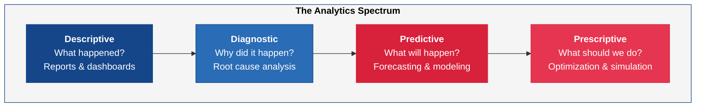
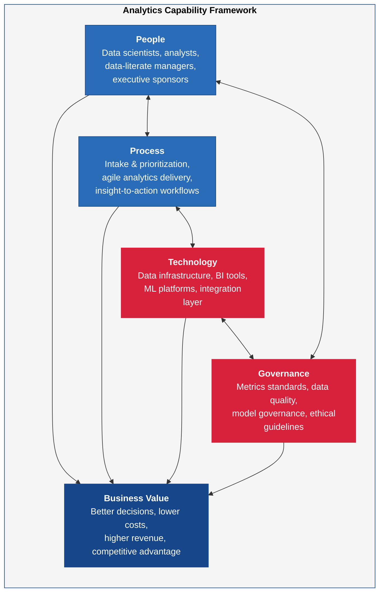
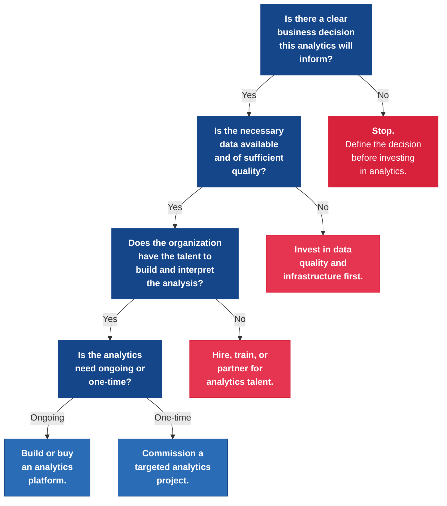
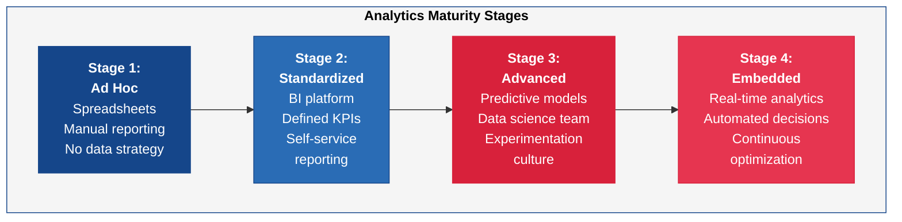

---
tags:
  - transformation
  - analytics
  - data-science
reading_time: 45
difficulty: Advanced
---

# Analytics & Data Science Fundamentals

## Overview

Analytics is the systematic use of data and quantitative methods to derive insights and inform decisions. Every organization collects data -- through transactions, customer interactions, sensor networks, web traffic, employee activity, and countless other sources. But data alone has no value. Value comes from turning data into insight, and insight into action. Analytics is the discipline that bridges that gap.

The analytics field spans a well-defined spectrum of increasing sophistication. **Descriptive analytics** answers the question "What happened?" by summarizing historical data into reports, dashboards, and visualizations. **Diagnostic analytics** goes deeper, asking "Why did it happen?" by identifying patterns, correlations, and root causes in the data. **Predictive analytics** looks forward, asking "What will happen?" by using statistical models and ML algorithms to forecast future outcomes based on historical patterns. **Prescriptive analytics** represents the most advanced stage, answering "What should we do?" by recommending optimal actions given constraints, objectives, and predicted outcomes. This progression -- from descriptive through prescriptive -- represents not just increasing technical sophistication, but increasing business value and organizational capability required to execute.

For MBA students, analytics is not an optional specialization -- it is a foundational competency. Analytics appears as required or core content in five of the six top-ranked MBA programs in the United States. Whether you pursue a career in finance, marketing, operations, consulting, or general management, you will be expected to interpret analytical outputs, ask critical questions about methodology, evaluate analytical investments, and lead organizations that are building analytics capabilities. You do not need to become a data scientist. But you do need to be a data-literate leader who can distinguish rigorous analysis from misleading numbers, who understands what analytics can and cannot do, and who can build organizations where data-driven decision making is the norm rather than the exception.

This chapter provides the conceptual foundations, frameworks, and vocabulary you need to engage credibly with analytics as a business leader. It covers the analytics spectrum, statistical thinking for non-statisticians, the tools landscape, building organizational analytics capability, and the persistent challenge of turning analytical insights into actual business decisions.

!!! info "Why This Matters for MBA Students"
    Analytics is no longer a specialty skill -- it is a core management competency. Five of the six top-ranked US MBA programs now include analytics as required or core coursework, reflecting the reality that every functional role in business depends on data-informed decision making. As a marketing manager, you will use customer segmentation models and attribution analytics. As a finance leader, you will evaluate risk models and forecasting accuracy. As an operations executive, you will monitor predictive maintenance systems and supply chain optimization algorithms. As a strategy consultant, you will build business cases grounded in data analysis. In every role, you will be asked to evaluate vendor claims about analytics capabilities, approve investments in analytics platforms, and lead teams that include data scientists and analysts. The leaders who succeed will not be those who can build models themselves, but those who ask the right questions: Is the data trustworthy? Is the methodology sound? Are we measuring what matters? Does this analysis actually change our decision? This chapter gives you the foundation to ask -- and answer -- those questions.

## Key Concepts

### The Analytics Spectrum

The analytics spectrum describes a progression of analytical capability from basic reporting to advanced optimization. Each level builds on the previous one, requires greater organizational maturity, and delivers greater business value. Understanding where your organization sits on this spectrum -- and where it needs to be -- is one of the most important strategic assessments a manager can make.

| Level | Question Answered | Techniques | Common Tools | Business Example | Organizational Maturity Required |
|-------|-------------------|------------|-------------|-----------------|----------------------------------|
| **Descriptive** | What happened? | Aggregation, summarization, reporting, visualization | Excel, Power BI, Tableau, Google Analytics | Monthly sales dashboard showing revenue by region and product line | Low -- most organizations have basic reporting capability |
| **Diagnostic** | Why did it happen? | Drill-down analysis, correlation analysis, data discovery, root cause analysis | BI platforms with drill-down, SQL queries, pivot tables | Investigating why Q3 sales dropped 15% in the Northeast region by analyzing product mix, pricing, and competitive activity | Moderate -- requires analysts who can explore data and business users who ask "why" |
| **Predictive** | What will happen? | Regression, classification, time series forecasting, ML algorithms | Python, R, SAS, Azure ML, AWS SageMaker | Forecasting next quarter's demand by product category to optimize inventory levels and reduce stockouts | High -- requires data scientists, clean historical data, and model governance |
| **Prescriptive** | What should we do? | Optimization algorithms, simulation, decision models, reinforcement learning | Specialized optimization platforms, custom models, operations research tools | Recommending the optimal pricing strategy across 10,000 SKUs given demand elasticity, competitor pricing, and margin targets | Very high -- requires sophisticated models, real-time data, and organizational trust in algorithmic recommendations |

The key insight for managers is that most organizations overestimate their position on this spectrum. Many companies claim to do "predictive analytics" when they are actually performing diagnostic analysis with some basic forecasting. True predictive and prescriptive analytics require not just tools and talent, but clean data, robust governance, and an organizational culture willing to act on model outputs rather than gut instinct.

#### The Value Curve

The business value of analytics accelerates as organizations move up the spectrum. Descriptive analytics -- while necessary -- is essentially backward-looking and informational. It tells you what already happened, which is useful for monitoring but does not change future outcomes. Diagnostic analytics adds value by explaining the drivers behind outcomes, enabling managers to address root causes rather than symptoms. But the transformative value arrives with predictive and prescriptive analytics, which enable organizations to act before events occur -- preventing problems rather than reacting to them, optimizing decisions rather than accepting defaults, and shaping outcomes rather than merely observing them.

The resource requirements also accelerate. Descriptive analytics can be implemented with a BI platform and a small team of analysts. Prescriptive analytics requires data scientists, ML engineers, optimization specialists, clean and comprehensive data, model governance infrastructure, and an organizational willingness to trust algorithmic recommendations. The gap between aspiration and capability at the upper end of the spectrum is where most analytics investments stall.

### Statistical Thinking for Managers

You do not need to be a statistician to be an effective analytics leader. But you do need to develop **statistical thinking** -- the ability to recognize when an analytical claim is trustworthy and when it is not. Statistical thinking is not about doing statistics; it is about knowing when analysis should be trusted, questioned, or rejected. Several concepts are essential.

#### Correlation Does Not Imply Causation

This is the single most important statistical concept for managers. **Correlation** means two things tend to move together -- when one goes up, the other tends to go up (or down). **Causation** means one thing actually causes the other. The distinction matters enormously for decision making.

Example: A company observes that customers who use its mobile app spend 40% more than customers who do not. A naive conclusion might be: "Our app causes customers to spend more. Let us invest $10 million to get more customers onto the app." But the correlation may not reflect causation at all -- perhaps the most engaged, highest-spending customers are simply more likely to download the app in the first place. Investing millions to push reluctant customers onto the app may produce no incremental spending.

Establishing causation requires controlled experiments (A/B tests), natural experiments, or sophisticated causal inference techniques. When someone presents a correlation and implies causation, the right question is: "What else might explain this relationship?"

#### Sampling Bias

The insights from any analysis are only as representative as the data sample they are based on. **Sampling bias** occurs when the data systematically over-represents or under-represents certain groups, leading to conclusions that do not generalize to the full population.

Example: A company surveys its most active customers about product satisfaction and reports a 92% satisfaction rate. But the most active customers are inherently the most satisfied -- dissatisfied customers have already left. The true satisfaction rate across all customers (including those who churned) may be much lower. When evaluating any analysis, ask: "Who is in this data, and who is missing?"

#### Statistical Significance and Confidence Intervals

**Statistical significance** tells you whether an observed result is likely to be real or could have occurred by chance. A result is "statistically significant" when the probability of observing it by chance (the p-value) falls below a predetermined threshold (typically 5%). A **confidence interval** provides a range within which the true value is likely to fall -- for example, "we are 95% confident that the true conversion rate is between 3.2% and 4.8%."

For managers, the practical implication is: do not act on small differences in metrics without understanding whether those differences are statistically meaningful. An A/B test showing a 0.3% improvement in click-through rates might be noise, not signal. Always ask: "Is this difference statistically significant, and how large is the confidence interval?"

#### Overfitting

**Overfitting** occurs when a model is too complex and learns the noise in the training data rather than the underlying pattern. An overfitted model performs well on historical data but poorly on new data -- it has memorized the past rather than learning generalizable patterns.

For managers, overfitting is a red flag when a model shows near-perfect accuracy on historical data. Perfection in backtest should inspire skepticism, not confidence. The right question is: "How does this model perform on data it has never seen before?"

#### Simpson's Paradox

**Simpson's Paradox** occurs when a trend that appears in several different groups of data reverses or disappears when the groups are combined. This is not a theoretical curiosity -- it has real business consequences.

Example: A company analyzes two marketing channels and finds that Channel A has a higher conversion rate than Channel B in every customer segment. The marketing team recommends shifting budget from B to A. But when you combine all segments, Channel B has a higher overall conversion rate. How is this possible? Because Channel B handles a disproportionate share of the high-conversion segments, while Channel A handles mostly low-conversion segments. The correct decision depends on understanding the segment composition, not just the aggregate numbers.

The managerial takeaway: always ask whether aggregate statistics mask important differences across subgroups. Segmented analysis often tells a fundamentally different story than aggregate analysis.

#### Base Rate Neglect

**Base rate neglect** is the tendency to focus on specific, vivid information while ignoring the underlying probability (the base rate). In analytics, this manifests when organizations overreact to dramatic findings without considering how common the underlying phenomenon is.

Example: A fraud detection model flags a transaction as "suspicious" with 95% accuracy. This sounds impressive -- until you learn that only 0.1% of transactions are actually fraudulent. In a dataset of 100,000 transactions, the model will correctly flag 95 of the 100 fraudulent transactions -- but it will also flag 4,995 legitimate transactions (5% of the 99,900 non-fraudulent ones). The vast majority of flagged transactions are false positives. Understanding base rates is essential for evaluating model performance and designing operational workflows around model outputs.

!!! question "Quick Check"
    - Your marketing team reports that customers who attended a webinar have 50% higher purchase rates than those who did not. The CMO wants to triple the webinar budget. What alternative explanation might account for this correlation, and what would you need to do to establish that the webinar actually *caused* higher purchases?
    - A predictive model shows 98% accuracy on historical data. Should this inspire confidence or skepticism? Which statistical concept explains why near-perfect backtest performance can actually be a warning sign?

### Analytics Maturity Models

Just as organizations progress through stages of AI maturity, they also progress through stages of analytics maturity. Understanding where your organization sits on this spectrum helps set realistic expectations and sequence investments appropriately.

| Maturity Stage | Characteristics | Typical Challenges | Investment Focus |
|---------------|----------------|-------------------|-----------------|
| **Stage 1: Spreadsheet-driven / Ad Hoc** | Analytics consists of Excel-based reports and manual data pulls. No centralized data infrastructure. Analysts spend most of their time finding and cleaning data, not analyzing it. | Data is in silos; no single source of truth; reports are inconsistent; analyses are reactive and one-off | Basic data infrastructure; initial BI platform; data quality assessment |
| **Stage 2: Standardized Reporting** | A BI platform is in place with standardized dashboards and KPIs. A data warehouse consolidates key data sources. Self-service reporting is emerging. | Dashboard proliferation without action; "report factory" where analysts produce reports nobody reads; limited diagnostic capability | Self-service analytics enablement; data literacy training; governance of metrics definitions |
| **Stage 3: Advanced Analytics** | Predictive models are in production. Data science team is established. The organization uses analytics to anticipate outcomes, not just report on them. | Pilot purgatory -- models that demonstrate potential but never reach production; disconnect between data science team and business decision makers | MLOps and model governance; embedding analytics into business workflows; change management |
| **Stage 4: Embedded and Real-Time** | Analytics is embedded directly in operational systems and decision workflows. Real-time data drives automated and semi-automated decisions. The organization continuously experiments and optimizes. | Maintaining model quality at scale; managing algorithmic risk; sustaining innovation pace while governing complexity | Continuous model monitoring; algorithmic governance; organizational learning |

Most large organizations in 2025-2026 are at Stage 2, with pockets of Stage 3 capability in specific business functions (typically marketing, finance, or supply chain). Very few organizations have achieved Stage 4 maturity enterprise-wide.

#### Advancing Through the Maturity Stages

Moving from one maturity stage to the next is not simply a matter of buying more technology. Each transition requires specific organizational changes:

- **Stage 1 to Stage 2** requires investment in a centralized data warehouse, adoption of a BI platform, and -- critically -- agreement on standardized metrics definitions across business units. The biggest barrier is often political, not technical: getting the CFO and the CMO to agree on a single definition of "revenue" or "customer" can be harder than building the data warehouse.

- **Stage 2 to Stage 3** requires hiring data science talent (or developing it internally), establishing model governance practices, and building organizational willingness to act on predictive outputs rather than just descriptive reports. The common failure mode at this transition is "pilot purgatory" -- data science teams that produce impressive proofs of concept that never make it into production because the organization lacks the engineering infrastructure or change management capability to operationalize them.

- **Stage 3 to Stage 4** requires embedding analytics directly into operational systems (not just dashboards viewed by humans), building real-time data pipelines, and developing sophisticated governance for automated decisions. This is the most difficult transition because it requires the organization to trust algorithms to make or influence decisions without human review for each individual case.

### The Analytics Tools Landscape

The analytics tools landscape ranges from universally accessible spreadsheet software to specialized ML platforms. Managers do not need to master these tools, but they need to understand what each category does, when it is appropriate, and what organizational capability it requires.

| Tool Category | Examples | What It Does | Who Uses It | When to Use It | Organizational Capability Required |
|--------------|---------|-------------|------------|---------------|-----------------------------------|
| **Spreadsheets** | Microsoft Excel, Google Sheets | Data manipulation, basic analysis, simple visualizations, ad hoc calculations | Everyone -- the universal analytics tool | Quick analysis, small datasets, one-off calculations, personal productivity | Minimal -- basic data literacy |
| **BI Platforms** | Power BI, Tableau, Looker, Qlik Sense | Interactive dashboards, self-service reporting, data visualization, drill-down analysis | Business analysts, managers, executives | Standardized reporting, monitoring KPIs, exploring trends, sharing insights across the organization | Moderate -- requires data warehouse, defined metrics, some analyst expertise |
| **Statistical / Programming Languages** | Python, R, SQL | Data wrangling, statistical modeling, custom analysis, ML model development | Data analysts, data scientists | Advanced analysis that exceeds BI platform capabilities, custom models, large or complex datasets | High -- requires trained analysts or data scientists, coding infrastructure |
| **ML Platforms** | AWS SageMaker, Azure ML, Google Vertex AI, Databricks | Model training, deployment, monitoring, and management at scale | Data scientists, ML engineers | Production-grade predictive and prescriptive models, automated decision systems | Very high -- requires ML engineering capability, MLOps practices, model governance |
| **Specialized Analytics** | SAS, SPSS, Alteryx, DataRobot | Domain-specific analytics, automated ML, statistical analysis with GUI interfaces | Analysts, citizen data scientists | Organizations without deep coding expertise that need analytics beyond BI, regulated industries requiring auditability | Moderate to high -- varies by tool and use case |

The key strategic question is not "which tool is best?" but "what combination of tools matches our organizational maturity, talent, and analytical ambitions?" Most organizations use a layered approach: Excel for personal analysis, a BI platform for organizational reporting, and Python/R or ML platforms for advanced analytics.

#### The Rise of Citizen Data Science

A significant trend in the analytics tools landscape is the emergence of **citizen data science** -- enabling business users with domain expertise but limited coding skills to perform analyses that previously required trained data scientists. Tools like Alteryx, DataRobot, and Microsoft's Power Platform are designed to make advanced analytics accessible through visual, low-code interfaces.

Citizen data science offers genuine benefits: it democratizes analytics capability, reduces the bottleneck on scarce data science talent, and puts analytical power closer to the business problems it needs to solve. However, it also introduces risks. Models built by users without statistical training may suffer from overfitting, sampling bias, or inappropriate methodology -- and these errors may not be caught because the users lack the training to recognize them. Effective citizen data science requires governance guardrails: standardized datasets, model validation checkpoints, and oversight by trained data science professionals who can review citizen-built models for methodological soundness.

### Building Analytics Capability: The Four Pillars

Building a sustainable analytics capability requires investment across four interdependent pillars. Organizations that invest in technology without addressing people, process, and governance consistently fail to realize the value of their analytics investments.

#### People

Analytics capability starts with people. This includes not only hiring data scientists and analysts, but developing **data literacy** across the entire organization. The most sophisticated analytics team in the world delivers no value if business leaders cannot interpret their outputs, ask the right questions, or act on their recommendations.

Organizations need talent at three levels:

- **Data scientists and engineers** who build models, manage data pipelines, and develop analytical products
- **Business analysts** who translate between business questions and analytical methods, perform diagnostic analysis, and create reports and dashboards
- **Data-literate managers and executives** who consume analytical outputs, evaluate analytical claims critically, and make decisions informed by data

The scarcity of data science talent makes it particularly important to invest in data literacy at the managerial level. When managers can articulate clear business questions, evaluate analytical rigor, and translate insights into action, the entire analytics function becomes more productive.

#### Process

Analytics must be embedded in business processes to deliver value. This means defining clear workflows for how analytical insights flow from the data science team to decision makers, how business questions are prioritized and translated into analytical projects, and how model outputs are validated and acted upon.

Common process elements include:

- **Intake and prioritization** -- A structured process for business units to submit analytics requests, with criteria for prioritizing projects based on business impact, feasibility, and data availability
- **Agile analytics delivery** -- Iterative development of analytical products with regular business stakeholder feedback, rather than waterfall-style projects that deliver a finished model months after the business question was posed
- **Insight-to-action workflows** -- Defined processes for translating analytical findings into business decisions, including escalation paths, review cadences, and accountability for follow-through

#### Technology

The technology stack must support the organization's analytical ambitions. This includes data infrastructure (data warehouses, data lakes, ETL pipelines), analytics tools (BI platforms, programming environments, ML platforms), and the integration layer that connects analytical outputs to operational systems and decision workflows.

Technology investment should follow capability -- not lead it. Organizations that purchase advanced ML platforms before they have clean data, trained analysts, or defined business questions waste their investment. The right sequence is: ensure data quality and accessibility first, build BI and reporting capability second, and invest in advanced analytics platforms third.

A common technology mistake is confusing the **data layer** with the **analytics layer**. Many organizations purchase a BI tool (Tableau, Power BI) before investing in the underlying data infrastructure (a data warehouse with clean, integrated data). The BI tool then connects directly to operational databases, producing visualizations that are slow, inconsistent, and unreliable. The tool gets blamed, but the real problem is the absent data layer. The correct architecture -- source systems feeding ETL processes that populate a governed data warehouse, which in turn feeds the BI platform -- is well established and covered in detail in the [Data Governance & Analytics](../risk-security/data-governance.md) section of this primer.

#### Governance

Analytics governance ensures that analytical outputs are trustworthy, ethical, and aligned with organizational standards. Key governance elements include:

- **Metrics definitions** -- Standardized definitions for KPIs and business metrics so that different teams produce consistent numbers
- **Data quality standards** -- Minimum quality thresholds for data used in analytics, with processes for monitoring and remediation
- **Model governance** -- Review and approval processes for predictive models, including bias testing, validation on holdout data, and ongoing monitoring for model drift
- **Ethical guidelines** -- Policies addressing the responsible use of analytics, including privacy, fairness, and transparency requirements
- **Access controls** -- Policies determining who can access which data and analytical outputs, ensuring that sensitive information (employee compensation data, customer financial details, competitive intelligence) is available only to authorized users with a legitimate business need

Without governance, analytics degrades into a collection of competing spreadsheets, conflicting dashboards, and unvalidated models. The most common symptom of governance failure is the experience of attending a meeting where three different people present three different numbers for the same metric, each derived from a different data source using a different methodology -- and the meeting devolves into debating which number is "right" instead of making a decision. Governance eliminates this problem by establishing a single source of truth.

!!! question "Quick Check"
    - Your company just purchased an expensive ML platform, but your data warehouse has inconsistent customer definitions across business units. Using the four pillars framework, explain which pillar is failing and why the ML platform investment is unlikely to deliver value until this is resolved.
    - A CEO says, "We need to hire 10 data scientists to become data-driven." Which pillar is the CEO focusing on, and which pillars is she neglecting? What would you recommend instead?

### The "Last Mile" Problem

The most persistent and costly failure in analytics is not technical -- it is organizational. Organizations invest millions in analytics platforms, hire talented data scientists, and build sophisticated models, but fail to change actual decisions. This is the **"last mile" problem**: the gap between generating an insight and acting on it.

The last mile problem manifests in several ways:

- **Dashboard graveyards** -- Beautifully designed dashboards that nobody looks at because they were built for the data team, not for the decision makers who need them
- **Insight without action** -- Analysis that identifies a clear opportunity or problem, but nobody is accountable for acting on the finding
- **Model distrust** -- Predictive models that business users do not trust because they do not understand how the model works, or because the model contradicts their experience and intuition
- **Decision inertia** -- Organizations where decisions are made based on hierarchy, politics, or tradition, and data is used only to confirm what leaders have already decided

Solving the last mile problem requires deliberate organizational design: embedding analysts within business units (not just in a central team), designing dashboards around specific decisions (not generic data), building trust through transparency about how models work and where they are uncertain, and holding leaders accountable for using data in their decision processes.

#### Strategies for Closing the Last Mile

Organizations that successfully close the last mile gap employ several practices:

- **Decision-centric design** -- Rather than building dashboards around available data ("here is everything we know about customers"), design analytics products around specific decisions ("should we increase marketing spend in the Northeast region this quarter?"). Every dashboard, report, and model should have an identified decision maker and an identified decision it supports.

- **Embedded analytics professionals** -- Place analysts and data scientists within business teams, not in a separate analytics department. When analysts sit next to the managers who make decisions, they develop deep understanding of the business context, build trust through daily interaction, and can tailor their outputs to the specific needs of their stakeholders.

- **Executive role modeling** -- When the CEO opens every strategy meeting by reviewing the analytics dashboard and asking data-driven questions, it signals to the entire organization that analytics matters. When the CEO ignores the dashboard and makes decisions based on intuition, it signals the opposite -- regardless of what the official strategy says about being "data-driven."

- **Feedback loops** -- Track not just whether analytics outputs are produced, but whether they changed decisions. If a predictive model flags a customer as high churn risk, did the account team take action? If a demand forecast indicated a supply shortfall, did the procurement team adjust orders? Measuring action rates -- not just insight generation rates -- is the key metric for analytics effectiveness.

- **Start with the skeptics** -- Rather than focusing adoption efforts on early enthusiasts, identify the most influential skeptics and work intensively to demonstrate value in their specific context. When a respected, previously skeptical business leader becomes an analytics advocate, it has a multiplier effect across the organization.

!!! question "Quick Check"
    - Your company built a churn prediction model six months ago. It flags at-risk customers accurately, but the retention team ignores the alerts and continues working from their own spreadsheets. Using the "last mile" strategies above, identify two specific interventions you would implement and explain why each addresses the root cause of non-adoption.
    - Why does the advice to "start with the skeptics" seem counterintuitive, and under what conditions would converting a prominent skeptic be more effective than expanding adoption among enthusiasts?

### Analytics by Business Function

Analytics capabilities are applied differently across business functions, each with distinct use cases, data sources, and value drivers.

| Business Function | Key Analytics Use Cases | Common Data Sources | Typical Value Drivers |
|------------------|----------------------|--------------------|--------------------|
| **Marketing** | Customer segmentation, attribution modeling, campaign optimization, churn prediction, lifetime value estimation, pricing analytics | CRM, web analytics, social media, POS, email platforms | Customer acquisition cost reduction, conversion rate improvement, marketing ROI optimization |
| **Finance** | Financial forecasting, risk modeling, fraud detection, accounts receivable optimization, scenario planning, regulatory reporting | ERP, general ledger, market data, transaction records | Forecast accuracy improvement, fraud loss reduction, working capital optimization |
| **Operations** | Demand forecasting, predictive maintenance, quality analytics, production optimization, workforce scheduling | IoT sensors, ERP, MES, supply chain data, workforce management | Downtime reduction, yield improvement, labor cost optimization |
| **Human Resources** | Workforce analytics, attrition prediction, compensation benchmarking, diversity analytics, recruitment optimization | HRIS, applicant tracking, engagement surveys, performance reviews | Turnover reduction, time-to-hire improvement, compensation equity |
| **Supply Chain** | Demand planning, inventory optimization, supplier performance analytics, logistics optimization, risk monitoring | ERP, SCM systems, supplier data, logistics platforms, external risk feeds | Inventory carrying cost reduction, service level improvement, supply risk mitigation |

The organizations that extract the most value from analytics are those that develop deep functional expertise -- marketing analytics professionals who understand both the analytical methods and the marketing domain, not generalist data scientists parachuted into unfamiliar business contexts.

### The Analytics Organization: Centralized, Decentralized, or Hub-and-Spoke

How an organization structures its analytics function has a significant impact on effectiveness. There are three primary models, each with distinct trade-offs:

| Model | Structure | Strengths | Weaknesses |
|-------|-----------|-----------|------------|
| **Centralized** | All analytics professionals report to a single analytics or data organization (often under the CDO or CIO) | Consistent standards, efficient use of specialized talent, shared infrastructure, strong governance | Risk of disconnect from business context; prioritization bottlenecks; business units feel underserved |
| **Decentralized** | Each business unit hires and manages its own analytics team independently | Deep business domain expertise, fast response to business needs, strong stakeholder relationships | Inconsistent methodologies, duplicated infrastructure, conflicting metrics definitions, no economies of scale |
| **Hub-and-Spoke** | A central analytics team sets standards, manages infrastructure, and develops shared capabilities, while embedded analysts in each business unit apply central capabilities to function-specific problems | Combines consistency with business intimacy; balances governance with responsiveness; enables career development across the analytics function | More complex to manage; requires clear governance of the central-embedded relationship; can create tension about who "owns" the analytics professionals |

The hub-and-spoke model has emerged as the preferred approach for most large organizations because it addresses the primary weaknesses of both the centralized and decentralized alternatives. The central hub maintains standards, infrastructure, and governance while the embedded spokes ensure business relevance and rapid response to stakeholder needs.

### Connection to AI and Machine Learning

Analytics and AI exist on a continuum, not as separate disciplines. ML is the primary technology that powers predictive and prescriptive analytics. When a demand forecasting model uses historical sales data to predict next month's orders, that is analytics. When the same model uses a gradient boosting algorithm trained on millions of data points, that is ML. From a business perspective, the distinction matters less than the outcome: better predictions, better decisions, better results.

The practical connection points include:

- **Predictive analytics relies on ML** -- Classification, regression, and time series forecasting models are all ML techniques applied to business prediction problems
- **Prescriptive analytics often uses optimization and reinforcement learning** -- techniques from the AI/ML toolkit applied to decision optimization
- **Generative AI is expanding analytics accessibility** -- Natural language interfaces (e.g., asking a BI tool a question in plain English and receiving a visualization) are making analytics more accessible to non-technical users
- **AI/ML models require the same data foundations as analytics** -- clean, governed, accessible data is the prerequisite for both traditional analytics and AI
- **The analytics-to-AI pipeline is a natural progression** -- Organizations that build strong analytics foundations (clean data, statistical rigor, data-literate culture) are far better positioned to adopt AI than organizations that attempt to leapfrog directly to AI without these foundations. Analytics maturity is a prerequisite for AI maturity.

For a deeper treatment of AI capabilities and strategy, see [AI & Emerging Technology](ai-emerging-tech.md).

### Measuring Analytics Success: The DeLone & McLean Model

The DeLone & McLean Information Systems Success Model, developed by Kogod faculty member William DeLone, provides a rigorous framework for evaluating whether an analytics system is actually delivering value. The model identifies six dimensions of success that apply directly to analytics platforms and BI systems:

- **System Quality** -- Does the analytics platform perform reliably? Is it fast enough for interactive exploration? Is it easy to use?
- **Information Quality** -- Are the analytical outputs accurate, timely, complete, and relevant to the decisions they are supposed to inform?
- **Service Quality** -- Is the support available when users encounter problems? Are training and documentation adequate?
- **Use / Intention to Use** -- Are decision makers actually using the analytics platform, or have they reverted to spreadsheets and gut instinct?
- **User Satisfaction** -- Do users find the analytics system valuable and trustworthy?
- **Net Benefits** -- Is the analytics investment producing measurable business outcomes -- better decisions, lower costs, higher revenue, reduced risk?

The model's feedback loops are particularly relevant for analytics: when an analytics system delivers clear net benefits, usage and satisfaction increase, which drives further adoption and value. Conversely, when an analytics system fails to deliver perceived value -- perhaps because of poor data quality, slow performance, or irrelevant outputs -- usage declines, satisfaction erodes, and the investment is wasted.

For a detailed examination of the DeLone & McLean model, see [Kogod Faculty Research](../reference/kogod-faculty-research.md).

### Data Visualization: Communicating Insights Effectively

Analytics delivers value only when insights are communicated clearly to decision makers. Data visualization -- the practice of representing data graphically to reveal patterns, trends, and relationships -- is the primary medium through which analytics reaches business audiences. Poor visualization can obscure important findings or, worse, mislead decision makers. Effective visualization makes complex data intuitive and actionable.

Key principles for managers evaluating data visualizations:

- **Choose the right chart type for the message.** Bar charts compare categories. Line charts show trends over time. Scatter plots reveal relationships between variables. Pie charts show proportions (but are almost always inferior to bar charts for comparison). Heat maps reveal patterns across two dimensions. The chart type should match the analytical message, not the designer's aesthetic preferences.

- **Minimize chart junk.** Edward Tufte, the leading authority on data visualization, coined the term "chartjunk" for decorative elements that add visual complexity without conveying information -- 3D effects, excessive gridlines, gradient fills, and unnecessary icons. Every visual element should communicate data. If it does not, remove it.

- **Label clearly and completely.** Every axis must be labeled. Units must be specified. Time periods must be defined. Data sources must be cited. A beautiful chart that leaves the audience wondering "What do the numbers represent?" has failed its purpose.

- **Beware of misleading scales.** Truncating the Y-axis (starting at a value other than zero for bar charts) can make small differences look dramatic. Using dual Y-axes can create the illusion of correlation between unrelated variables. Inconsistent time intervals can distort trends. Managers should inspect chart scales as carefully as they inspect the data itself.

- **Design for the audience and the decision.** An executive dashboard requires different visualization choices than an analyst's exploration workspace. Executive audiences need high-level summaries with the ability to drill down. Analysts need detail and flexibility. The most effective analytics organizations design visualizations around the specific decision each audience needs to make, not around the data that is available.

## Frameworks & Models

### The Analytics Spectrum

The following diagram illustrates the progression from descriptive to prescriptive analytics, showing how each level builds on the previous one with increasing sophistication and business value:

Each level on the spectrum requires the capabilities of the levels below it. You cannot perform useful diagnostic analytics without reliable descriptive reporting. You cannot build trustworthy predictive models without understanding the diagnostic drivers of the outcomes you are trying to predict. And you cannot deploy prescriptive optimization without validated predictive models to feed into the optimization engine.

### Analytics Capability Framework: The Four Pillars

The following diagram illustrates the four interdependent pillars required to build sustainable analytics capability:

The framework emphasizes that all four pillars must develop together. An organization that invests heavily in technology but neglects people and process will have powerful tools that sit unused. An organization with talented people but no governance will produce analytics that business users do not trust. The arrows between the pillars represent their interdependence -- changes in any one pillar affect the others.

### Analytics Investment Decision Framework

The following decision tree helps managers evaluate whether an analytics initiative is ready to proceed and what type of investment is appropriate:

### Analytics Maturity Progression

### DeLone & McLean Model Applied to Analytics Systems

The DeLone & McLean IS Success Model provides a structured evaluation framework for analytics investments. The following table maps each dimension to specific analytics evaluation criteria:

| DeLone & McLean Dimension | Analytics-Specific Evaluation Criteria | Example Metrics |
|--------------------------|---------------------------------------|-----------------|
| **System Quality** | Platform reliability, query performance, ease of use, mobile accessibility, integration with data sources | Uptime percentage, average query response time, user onboarding time, number of connected data sources |
| **Information Quality** | Accuracy of reports, timeliness of data refreshes, completeness of data coverage, relevance of default dashboards | Data freshness (hours since last refresh), percentage of metrics with validated definitions, data quality scores |
| **Service Quality** | Quality of analytics support team, training availability, documentation, responsiveness to issues | Support ticket resolution time, training completion rates, user satisfaction with support |
| **Use / Intention to Use** | Adoption rates across the organization, frequency and depth of platform usage, breadth of user base | Monthly active users, sessions per user, percentage of managers who access dashboards weekly |
| **User Satisfaction** | User perception of value, willingness to recommend, satisfaction with specific features | Net Promoter Score, survey satisfaction ratings, qualitative feedback themes |
| **Net Benefits** | Measurable business outcomes attributable to analytics | Decisions changed by data, cost savings identified through analysis, revenue impact of optimized processes, time saved versus manual reporting |

## Real-World Applications

### Example 1: A National Retailer Uses Predictive Analytics for Demand Forecasting

A national retailer with 800 stores was losing an estimated $180 million annually due to a combination of stockouts (products unavailable when customers wanted them) and overstock (excess inventory requiring markdowns). The company's demand forecasting relied on spreadsheet-based models that used simple moving averages of historical sales -- a purely descriptive approach that could not account for weather patterns, local events, competitive promotions, or shifting consumer preferences.

The company invested in a predictive analytics platform that transformed its demand forecasting capability:

- **Data integration** -- The analytics team consolidated data from 14 source systems, including POS transactions, warehouse inventory, supplier lead times, weather forecasts, local event calendars, and competitive pricing data collected through web scraping. Building the data pipeline took six months -- longer than building the models themselves.
- **ML models** -- Gradient boosting and time series models were trained on three years of historical data to predict weekly demand for each of the company's 45,000 SKUs at each of its 800 stores. The models incorporated over 200 features, including seasonality, price elasticity, weather sensitivity, and promotional lift.
- **A/B testing for validation** -- Before full rollout, the company ran a controlled test: 200 stores used the new ML-based forecasts while 200 comparable stores continued using the legacy spreadsheet method. After 12 weeks, the ML-forecasted stores showed a 23% reduction in stockouts and a 17% reduction in excess inventory compared to the control group.
- **Organizational change** -- Store managers initially resisted the new system, preferring their own judgment about local demand. The company addressed this by making the forecasts transparent (showing the factors driving each prediction), allowing managers to override forecasts with documented justification, and tracking the accuracy of model forecasts versus manager overrides. Within two quarters, the data showed that the model outperformed manager judgment in 78% of cases, and adoption climbed from 40% to 92%.

The annual impact: $95 million in reduced stockout losses and $42 million in reduced markdown costs, for a total benefit of $137 million against a $12 million investment in the analytics platform and team -- an 11x ROI in the first full year.

**Key lesson**: The technology was necessary but not sufficient. Data integration consumed the majority of the project timeline, A/B testing was essential for building organizational confidence, and change management was what turned a working model into actual business impact.

### Example 2: A Hospital System Uses Analytics to Improve Patient Outcomes

A regional hospital system with 15 facilities was struggling with high rates of hospital-acquired infections (HAIs) and unplanned patient readmissions within 30 days of discharge. Both problems were clinically harmful and financially costly -- Medicare penalizes hospitals with above-average readmission rates through reduced reimbursements, and HAIs add an estimated $28,000 to $33,000 per affected patient.

The hospital system built a multi-layered analytics program:

- **Descriptive analytics foundation** -- The analytics team first built standardized dashboards that tracked HAI rates, readmission rates, length of stay, and mortality rates across all 15 facilities. For the first time, administrators and clinicians could see facility-by-facility comparisons using consistent definitions and methodologies. This alone revealed significant variation -- the highest-performing facility had a HAI rate 60% lower than the lowest-performing facility.
- **Diagnostic analytics** -- Root cause analysis using the dashboards identified that HAI rates correlated strongly with three factors: hand hygiene compliance rates (measured by automated dispensers), nurse staffing ratios during night shifts, and the timeliness of catheter removal after procedures. These were actionable findings that led to immediate operational changes.
- **Predictive analytics** -- The data science team developed a readmission risk model that scored each patient at the time of discharge based on diagnosis, comorbidities, age, social determinants (living alone, transportation access, insurance status), medication complexity, and prior admission history. High-risk patients were flagged for intensive post-discharge follow-up, including nurse phone calls, medication reconciliation, and home health visits.
- **Outcome measurement** -- The hospital system tracked the impact rigorously. Over 18 months, HAI rates decreased by 34% system-wide, saving an estimated $11 million in treatment costs and avoiding approximately 400 infections. Thirty-day readmission rates decreased by 19%, reducing Medicare penalties and generating an estimated $8 million in preserved reimbursement revenue.

**Key lesson**: The hospital system did not jump to predictive analytics. It built a descriptive foundation first, used diagnostic analysis to identify actionable drivers, and then layered on predictive capability once the organization understood its data and trusted its metrics. The progression through the analytics spectrum was deliberate and sequential.

### Example 3: A Financial Services Firm Builds an Analytics Center of Excellence

A mid-size financial services firm with $40 billion in assets under management recognized that analytics capability was scattered across the organization -- the marketing team had its own analysts, the risk team had its own modelers, the operations team had its own reporting group, and corporate strategy hired consultants for ad hoc analysis. There was no shared data infrastructure, no common metrics definitions, and no enterprise-wide analytics strategy. The same business question would produce different answers depending on which team was asked.

The firm's CEO chartered an **Analytics Center of Excellence (CoE)** with the following design:

- **Governance structure** -- The CoE reported to the CFO (chosen for credibility with business units, not because analytics is a finance function) and was governed by a steering committee of business unit leaders who prioritized analytics projects based on business impact.
- **Hub-and-spoke model** -- A central CoE team of 15 data scientists and engineers maintained shared data infrastructure, defined enterprise metrics standards, and developed reusable analytical components. Embedded analytics professionals in each business unit translated central capabilities into function-specific applications. This structure balanced the efficiency of centralization with the business intimacy of decentralization.
- **Technology standardization** -- The firm consolidated from seven analytics tools to a standard stack: Snowflake for the data warehouse, dbt for data transformation, Tableau for BI and visualization, and Python with MLflow for advanced analytics and model management.
- **Data literacy program** -- The CoE developed a tiered training program: a mandatory 8-hour "Data Fluency" course for all managers, an optional 40-hour "Analytics Practitioner" course for business analysts, and a specialized "Model Consumer" course for executives who needed to evaluate model outputs for investment and risk decisions.
- **Metrics governance** -- The CoE established a "metrics dictionary" with standardized definitions for all enterprise KPIs. Before the CoE, the firm had three different definitions of "client" and four different calculations of "revenue." The metrics dictionary eliminated these inconsistencies and was enforced through the data transformation layer -- if a metric was in the dictionary, the centrally managed data pipeline calculated it. No more conflicting spreadsheets.

Within two years, the firm measured the following outcomes: analyst time spent on data preparation dropped from 65% to 25% (freeing capacity for actual analysis), the time to deliver a new analytics project decreased from an average of 14 weeks to 5 weeks, and the CEO reported in an earnings call that analytics-informed decisions had contributed to a measurable improvement in client retention and portfolio performance.

**Key lesson**: The CoE model worked because it addressed all four pillars -- people (centralized talent plus embedded analysts), process (governance structure and prioritization), technology (standardized stack), and governance (metrics dictionary and model standards). Organizations that create a CoE focused only on technology or only on talent consistently underdeliver.

### Connecting the Examples to the Analytics Spectrum

These three examples illustrate different positions on the analytics spectrum and different organizational approaches to building capability:

| Example | Analytics Spectrum Position | Primary Challenge | Key Success Factor |
|---------|---------------------------|-------------------|--------------------|
| **Retailer (Demand Forecasting)** | Predictive -- using ML models to forecast future demand | Change management -- getting store managers to trust and use model-driven forecasts | A/B testing that demonstrated model superiority, combined with transparency about how predictions were generated |
| **Hospital (Patient Outcomes)** | Descriptive through predictive -- deliberately progressing through the spectrum | Organizational readiness -- the hospital needed to build descriptive and diagnostic foundations before predictive models could be trusted | Sequential progression through the analytics spectrum, building organizational confidence at each stage |
| **Financial Services (CoE)** | Organizational -- establishing the infrastructure and governance for analytics at scale | Fragmentation -- analytics was scattered across silos with no common standards | Hub-and-spoke model that balanced centralized governance with embedded business domain expertise |

## Common Pitfalls

!!! warning "Analysis Paralysis: Demanding Perfect Data Before Making Any Decision"
    Some organizations respond to the analytics imperative by refusing to make decisions until they have "perfect data" and "complete analysis." This is a trap. In business, you will never have perfect data, and the cost of delayed decisions often exceeds the cost of imperfect analysis. The goal is not certainty -- it is to be **directionally correct with a known margin of error**. Effective analytics leaders establish decision-making frameworks that specify the level of analytical rigor appropriate for each type of decision. A $50 million strategic investment warrants deep analysis. A $50,000 marketing experiment warrants a quick review of available data and a willingness to learn by doing. Matching analytical effort to decision magnitude is a critical management skill.

!!! warning "Mistaking Correlation for Causation and Acting on Spurious Relationships"
    This pitfall costs organizations billions of dollars annually. A company observes that its highest-revenue customers disproportionately use a particular product feature, and invests heavily in promoting that feature -- without considering that the feature may be a consequence of high engagement, not a cause of it. A hospital observes that patients who receive a particular treatment have worse outcomes, and restricts the treatment -- without considering that the treatment is given preferentially to the sickest patients. The antidote is a culture that demands causal reasoning, not just correlational reporting. When someone presents a data-driven recommendation, the right question is always: "What is the causal mechanism, and have we tested it?"

!!! warning "Building Analytics Capability Without Changing the Decision-Making Culture"
    Organizations invest in analytics platforms, hire data scientists, and build beautiful dashboards -- and then continue making decisions the same way they always have, based on hierarchy, politics, and intuition. The analytics infrastructure becomes an expensive monument to good intentions. Changing decision-making culture requires executive modeling (leaders must visibly use data in their own decisions), accountability mechanisms (requiring data-supported justification for major decisions), and feedback loops (measuring whether data-informed decisions actually produced better outcomes). Technology without culture change produces reports. Culture change with technology produces results.

!!! warning "Ignoring Data Quality and Expecting Analytics to Compensate"
    The principle of "garbage in, garbage out" applies with particular force to analytics. A predictive model trained on inaccurate data will produce inaccurate predictions -- no matter how sophisticated the algorithm. A BI dashboard built on inconsistent data will produce misleading visualizations that erode trust in the entire analytics function. Yet organizations routinely invest in analytics platforms without first assessing the quality of the data that will flow through them. The result is predictable: initial enthusiasm gives way to frustration as users discover that the numbers do not match, reports contradict each other, and the analytics team spends most of its time explaining data discrepancies rather than generating insights. Always assess and remediate data quality before or alongside analytics investment -- never after.

## Discussion Questions

1. **Analytics Investment Prioritization**: You are the CFO of a mid-size manufacturing company. The CEO has tasked you with developing the company's first enterprise analytics strategy. The company currently operates at Stage 1 maturity (spreadsheet-driven, ad hoc). The VP of Marketing wants a customer analytics platform for segmentation and campaign optimization. The VP of Operations wants predictive maintenance analytics for the factory floor. The VP of Supply Chain wants demand forecasting models to reduce inventory costs. You have budget for one major initiative this year. Using the analytics maturity model and the four pillars framework, how would you evaluate and prioritize these requests? What foundational investments (if any) need to come before any of these functional initiatives?

2. **The Last Mile Challenge**: Your company invested $8 million in a state-of-the-art BI platform two years ago. The data warehouse is built, the dashboards are live, and the data is refreshed daily. But adoption metrics tell a troubling story: only 22% of managers log in to the platform weekly, and several business unit leaders have told you privately that they still rely on their own spreadsheets because they "do not trust the numbers." Diagnose the likely root causes of this adoption failure using the DeLone & McLean model dimensions (system quality, information quality, service quality, use, user satisfaction, net benefits). What specific interventions would you recommend for each dimension?

3. **Ethical Analytics**: A large health insurance company has developed a predictive model that uses claims data, demographic information, and publicly available consumer data to predict which policyholders are most likely to develop expensive chronic conditions within the next five years. The model is highly accurate. The actuarial team wants to use it for risk-based pricing. The marketing team wants to use it to target wellness programs to high-risk members. The legal team has flagged that the model's predictions correlate with race and socioeconomic status, raising fair lending and discrimination concerns. How should the company govern the use of this model? What analytics governance principles should apply, and who should make the final decision?

## Key Takeaways

- **The analytics spectrum progresses from descriptive to prescriptive**, with each level building on the previous one and requiring greater organizational maturity. Most organizations overestimate their position on this spectrum.
- **Statistical thinking is a core management competency.** Managers do not need to perform statistical analysis, but they must understand correlation versus causation, sampling bias, statistical significance, and overfitting to evaluate analytical claims critically.
- **Analytics maturity develops through stages**, from ad hoc spreadsheets through standardized reporting to advanced and embedded analytics. Attempting to leap directly to advanced analytics without building foundational capabilities is a common and expensive mistake.
- **The tools landscape ranges from Excel to ML platforms**, and the right choice depends on organizational maturity, talent, and analytical ambitions -- not on which tool is "best" in the abstract.
- **Building analytics capability requires four pillars: people, process, technology, and governance.** Organizations that invest in technology alone consistently fail to realize value from their analytics investments.
- **The "last mile" problem -- turning insights into action -- is the most persistent analytics failure.** It is an organizational and cultural challenge, not a technical one, and it requires deliberate design of decision workflows, trust-building, and accountability mechanisms.
- **Analytics capabilities vary by business function**, but the foundational requirements -- clean data, trained people, defined processes, and effective governance -- are universal across marketing, finance, operations, HR, and supply chain analytics.
- **Analytics and AI/ML exist on a continuum.** ML powers predictive and prescriptive analytics, and the data foundations required for both are identical. Organizations should view analytics and AI as complementary investments, not separate programs.
- **The DeLone & McLean IS Success Model** provides a rigorous framework for evaluating whether analytics systems are delivering value across all relevant dimensions -- from system performance to business outcomes.
- **Data quality is the non-negotiable prerequisite for analytics.** No amount of analytical sophistication compensates for inaccurate, incomplete, or inconsistent data. Invest in data quality before or alongside analytics platforms -- never after.

## Related Topics

- [Data Governance & Analytics](../risk-security/data-governance.md) -- Foundational data management practices including data quality, MDM, BI architecture, and data-driven decision making. Data governance is the prerequisite for analytics -- without governed, high-quality data, analytics outputs cannot be trusted.
- [AI & Emerging Technology](ai-emerging-tech.md) -- How ML and AI extend analytics capabilities into predictive and prescriptive territory. Analytics maturity is a prerequisite for AI maturity, and the two disciplines share the same data foundations, talent requirements, and governance challenges.
- [Analytics Project Methodologies](analytics-project-methodologies.md) -- How analytics projects are structured and executed using CRISP-DM and related methodologies. This page explains *what* analytics is; the methodologies page explains *how* analytics projects are managed from business question through deployment.
- [Business Process Management](bpm.md) -- How analytics connects to process optimization through process mining, performance measurement, and continuous improvement. Process mining is essentially analytics applied to operational event logs.
- [Digital Transformation](digital-transformation.md) -- How analytics capabilities support broader digital transformation programs. Data-driven decision making is a core enabler of successful transformation.
- [Kogod Faculty Research](../reference/kogod-faculty-research.md) -- Detailed examination of the DeLone & McLean IS Success Model and its application to evaluating analytics and IT investments. This research, developed by Kogod faculty, provides the evaluation framework used throughout this chapter.

## Further Reading

- **Davenport, Thomas H., and Jeanne G. Harris.** *Competing on Analytics: The New Science of Winning.* Updated ed., Harvard Business Review Press, 2017. The foundational text on building analytics-driven organizations, with extensive case studies and practical frameworks for using analytics as a competitive differentiator.
- **Davenport, Thomas H.** *Big Data at Work: Dispelling the Myths, Uncovering the Opportunities.* Harvard Business Review Press, 2014. A practical guide to understanding what big data actually means for business and how organizations can extract value from large-scale data without drowning in hype.
- **Provost, Foster, and Tom Fawcett.** *Data Science for Business: What You Need to Know about Data Mining and Data-Analytic Thinking.* O'Reilly Media, 2013. An accessible introduction to data science concepts for business professionals, covering the analytical thinking and foundational techniques that underpin modern analytics.
- **Siegel, Eric.** *Predictive Analytics: The Power to Predict Who Will Click, Buy, Lie, or Die.* Revised and updated ed., Wiley, 2016. An engaging, non-technical introduction to predictive analytics with real-world examples across industries.
- **Few, Stephen.** *Information Dashboard Design: Displaying Data for At-a-Glance Monitoring.* 2nd ed., Analytics Press, 2013. A practical guide to designing effective dashboards and data visualizations that communicate clearly and drive action.
- **DeLone, William H., and Ephraim R. McLean.** "The DeLone and McLean Model of Information Systems Success: A Ten-Year Update." *Journal of Management Information Systems*, vol. 19, no. 4, 2003, pp. 9-30. The updated IS Success Model that provides the evaluation framework discussed in this chapter, authored by Kogod faculty member William DeLone.
- **Harvard Business Review.** "Building a Data-Driven Organization" (various articles, 2023-2025). HBR's ongoing coverage of analytics strategy, data culture, and organizational design for data-driven decision making.
- **McKinsey & Company.** "The Age of Analytics: Competing in a Data-Driven World." McKinsey Global Institute, 2016. A comprehensive analysis of the economic potential of analytics across industries, with practical guidance for executives.
- See also: [Data Governance & Analytics](../risk-security/data-governance.md) for foundational data quality and governance concepts, [AI & Emerging Technology](ai-emerging-tech.md) for how AI/ML extends analytics into predictive and prescriptive territory, [Business Process Management](bpm.md) for how analytics connects to process optimization and continuous improvement, and [Digital Transformation](digital-transformation.md) for how analytics capabilities support broader transformation programs.
- **ITEC-617 Course Textbook**: See the assigned readings on business analytics and data-driven decision making for additional context on how these concepts apply in enterprise settings.
