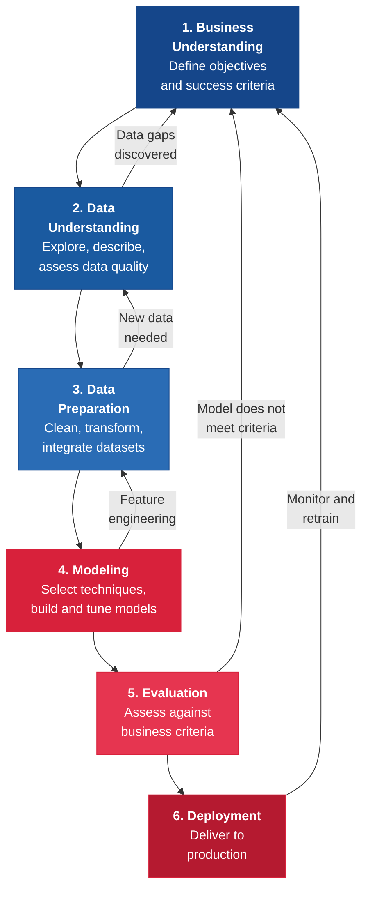
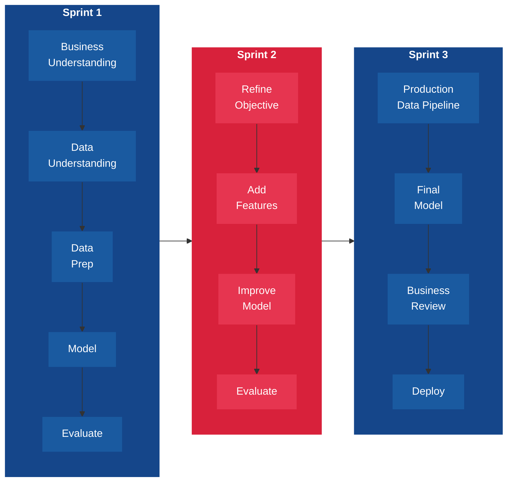
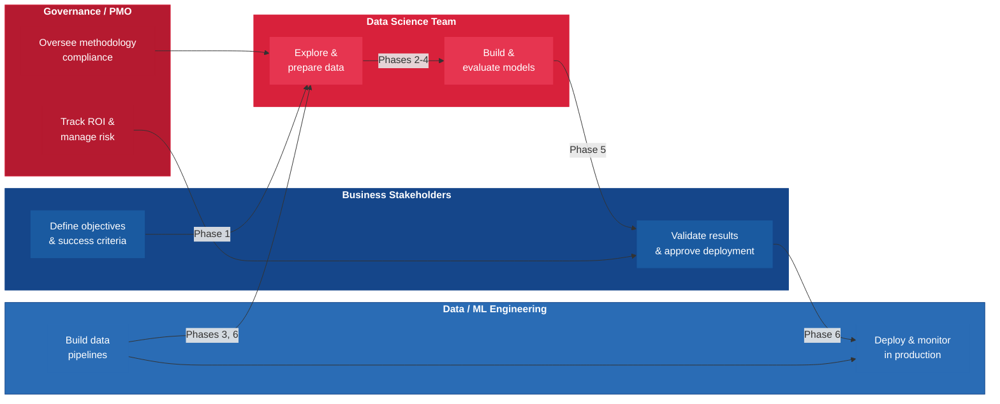

---
tags:
  - transformation
  - analytics
  - data-science
  - project
reading_time: 25
difficulty: Intermediate
---

# Analytics Project Methodologies

## Overview

Every organization wants to be "data-driven," but wanting insights and actually delivering them are very different challenges. Analytics and data science projects fail at rates comparable to traditional IT projects — and often for the same fundamental reason: a lack of structured methodology. Without a clear process for moving from a business question to a deployed, value-generating solution, analytics teams produce impressive prototypes that never leave a data scientist's laptop, models that answer the wrong question, and dashboards that nobody trusts.

Analytics projects are fundamentally different from traditional software projects. They involve significant uncertainty at every stage — you may not know whether the data you need exists, whether the signal in the data is strong enough to build a reliable model, or whether the organization is prepared to act on the model's recommendations. This uncertainty means that analytics projects cannot be managed the same way as an ERP implementation or a website redesign. They require methodologies specifically designed for the iterative, exploratory nature of data work.

The most widely adopted methodology for analytics and data science projects is CRISP-DM (Cross-Industry Standard Process for Data Mining), which has been used by roughly half of all analytics practitioners since its introduction in 1996. This chapter provides a deep examination of CRISP-DM and its six phases, compares it with alternative methodologies, explores how modern teams integrate CRISP-DM with Agile practices, and addresses the growing importance of MLOps — the discipline of operationalizing and maintaining models after deployment.

!!! info "Why This Matters for MBA Students"
    As an MBA graduate, you are far more likely to **sponsor, evaluate, or govern** analytics projects than to execute them yourself. This means you need to understand the lifecycle of an analytics project at a strategic level. You will approve budgets for analytics initiatives — and you need to know why a data scientist says they need "three months for data preparation" before any modeling begins. You will sit on steering committees that decide whether an analytics project is delivering value or burning resources. You will evaluate vendor proposals that promise "AI-powered insights" — and you need the vocabulary to ask whether the vendor followed a rigorous methodology or simply trained a model on dirty data. Understanding how analytics projects are structured helps you set realistic expectations, ask the right questions at each phase, and avoid the most common — and costly — mistakes.

## Key Concepts

### CRISP-DM: The Standard Analytics Project Methodology

CRISP-DM (Cross-Industry Standard Process for Data Mining) was developed in 1996 by a consortium of companies including IBM, Daimler, SPSS, and NCR. Despite being nearly three decades old, it remains the most widely used framework for structuring analytics and data science projects. Surveys consistently show that approximately 40-50% of data science practitioners use CRISP-DM or a variant of it as their primary methodology (KDnuggets/Data Science Community Survey, 2014–2022).

The methodology defines six phases that proceed in a logical sequence — but with critical feedback loops that allow teams to revisit earlier phases as they learn from the data. This iterative nature is what distinguishes CRISP-DM from a rigid Waterfall process.

#### Phase 1: Business Understanding

Business Understanding is the most critical phase of any analytics project — and the one most frequently shortchanged. In this phase, the team works with business stakeholders to translate a vague business need ("we need to reduce customer churn") into a precise, measurable analytics objective ("build a model that identifies customers with a greater than 70% probability of canceling within 90 days, so that the retention team can intervene proactively").

**Key activities:**

- **Define the business objective** — What business problem are we trying to solve? What decision will the analytics output inform?
- **Assess the current situation** — What resources (data, people, technology) are available? What constraints exist (regulatory, ethical, timeline)?
- **Translate to an analytics objective** — Reframe the business problem as a data problem. "Reduce churn" becomes "predict churn probability per customer per month."
- **Define success criteria** — How will we know if the project succeeded? Success criteria should be business-oriented ("reduce churn rate by 5 percentage points") and technical ("achieve model precision above 0.80 on the holdout dataset").
- **Produce a project plan** — Identify phases, milestones, resources, and risks.

**Why this phase matters most:** Research consistently shows that analytics projects fail most often not because the model was poorly built, but because the team solved the wrong problem. A technically excellent model that does not address the actual business question — or that produces recommendations the organization cannot act on — has zero business value. The Business Understanding phase is where you ensure alignment between the analytics work and the business strategy.

#### Phase 2: Data Understanding

Once the business objective is clear, the team turns to the data. Data Understanding involves collecting initial data, exploring its structure and content, identifying data quality issues, and forming preliminary hypotheses about which variables might be useful for modeling.

**Key activities:**

- **Collect initial data** — Identify and access relevant data sources (databases, data warehouses, APIs, third-party datasets, spreadsheets)
- **Describe data** — Document the structure, volume, formats, and meaning of each dataset. How many records? What time period? What do the fields represent?
- **Explore data** — Use summary statistics, distributions, and visualizations to understand patterns. Are there obvious trends? Seasonal effects? Outliers?
- **Verify data quality** — Assess completeness (missing values), accuracy (known errors), consistency (conflicting records), and timeliness (how current is the data?)

**What often goes wrong:** Teams frequently discover in this phase that the data they assumed existed does not — or that it exists but is too incomplete, too dirty, or too narrowly scoped to support the analytics objective. When this happens, the team must loop back to Business Understanding to reassess whether the objective is achievable with available data, or whether additional data collection is required.

#### Phase 3: Data Preparation

Data Preparation is the phase that analytics practitioners universally describe as the most time-consuming. Industry estimates suggest that data preparation consumes 60–80% of total project effort. This phase transforms raw data into a form suitable for modeling — and the quality of this work directly determines the quality of the model.

**Key activities:**

- **Select data** — Choose which datasets, tables, and variables to include based on relevance to the modeling objective
- **Clean data** — Handle missing values (imputation, removal, flagging), correct errors, resolve inconsistencies, standardize formats
- **Construct features** — Create new variables (features) from existing data that may improve model performance. For example, computing "average transaction value over the last 90 days" from individual transaction records
- **Integrate data** — Merge datasets from multiple sources, resolving key conflicts and handling duplicates
- **Format data** — Transform data into the specific format required by the modeling technique (e.g., encoding categorical variables, normalizing numeric ranges, creating training/testing splits)

**Why this takes so long:** Real-world enterprise data is messy. Customer records have inconsistent addresses, product databases have duplicate entries, transactional data has gaps from system outages, and different source systems use different identifiers for the same entity. Addressing these issues requires deep domain knowledge, technical skill, and patience. There are no shortcuts — garbage in, garbage out.

#### Phase 4: Modeling

In the Modeling phase, the team selects appropriate analytical techniques and builds models using the prepared data. This is the phase that receives the most attention in popular media — "training the AI" — but it typically represents a relatively small fraction of total project effort.

**Key activities:**

- **Select modeling technique** — Choose algorithms appropriate to the problem type (classification, regression, clustering, time series) and data characteristics
- **Design test plan** — Define how the model will be validated (holdout set, cross-validation, time-based split)
- **Build model** — Train one or more models on the prepared data, tuning parameters to optimize performance
- **Assess model** — Evaluate model performance using technical metrics (accuracy, precision, recall, F1 score, RMSE) and compare alternative approaches

**What business leaders should understand:** Model selection involves tradeoffs that have business implications. A complex deep learning model might achieve marginally better accuracy than a simpler logistic regression — but the simpler model may be easier to explain to regulators, faster to deploy, and cheaper to maintain. The "best" model is not always the most accurate one; it is the one that best balances accuracy, interpretability, cost, and operational feasibility.

#### Phase 5: Evaluation

Evaluation is where the team steps back from technical metrics and asks: does this model actually solve the business problem defined in Phase 1? A model that achieves 95% accuracy on a test dataset but produces recommendations that the sales team cannot act on — or that would require policy changes the organization is not willing to make — has failed the evaluation phase.

**Key activities:**

- **Evaluate results against business criteria** — Does the model meet the success criteria defined in Business Understanding? Not just technical accuracy, but business impact.
- **Review the process** — Were any steps missed or shortcuts taken that could undermine the results?
- **Determine next steps** — Three outcomes are possible: (1) proceed to deployment, (2) iterate back to an earlier phase to improve results, or (3) terminate the project if the business case is no longer viable.

**The iterate-or-deploy decision:** Many analytics projects cycle through phases 2–5 multiple times before reaching deployment. A model that falls short of business requirements may need additional features (back to Data Preparation), different algorithms (back to Modeling), better data (back to Data Understanding), or a revised business objective (back to Business Understanding). This iterative cycling is not a sign of failure — it is how CRISP-DM is designed to work.

#### Phase 6: Deployment

Deployment is where business value is actually realized — and where many analytics projects die. A model sitting in a Jupyter notebook on a data scientist's laptop is not deployed. Deployment means integrating the model into business processes, systems, and decision workflows so that it generates value continuously.

**Key activities:**

- **Plan deployment** — Define the integration architecture, monitoring strategy, and rollback plan
- **Produce final deliverables** — This could be a model integrated into a production system, a recurring report, a decision support dashboard, or an API that other applications can call
- **Monitor and maintain** — Establish ongoing monitoring to detect model degradation, data drift, and changing business conditions
- **Produce documentation** — Document the model's assumptions, training data, performance characteristics, limitations, and maintenance procedures
- **Review project** — Conduct a retrospective to capture lessons learned for future analytics projects

**The deployment gap:** Research from Gartner suggests that fewer than half of analytics and AI projects that reach the prototype stage make it into production. The gap between a working prototype and a production system is often far larger than organizations expect — requiring engineering effort for reliability, scalability, security, and integration that goes well beyond the data science work.

!!! question "Quick Check"
    - A data science team presents a customer churn model with 92% accuracy and asks for approval to deploy. As the executive sponsor, what questions would you ask to determine whether this model is ready for Phase 6 (Deployment)? Consider both Phase 5 (Evaluation) criteria and practical deployment readiness.
    - CRISP-DM is described as iterative, yet some organizations run it as a sequential (waterfall-like) process. Why is the iterative nature essential, and what risks arise when feedback loops between phases are eliminated?

### Alternative Methodologies

While CRISP-DM dominates practice, several alternative methodologies exist — each with different origins, strengths, and trade-offs. Understanding the landscape helps organizations select the right approach for their context.

| Methodology | Origin | Phases/Steps | Key Differentiator | Best For |
|-------------|--------|-------------|-------------------|----------|
| **CRISP-DM** | Industry consortium (1996) | 6 phases (iterative) | Industry-standard, vendor-neutral, strong business focus | General-purpose analytics and data science projects |
| **SEMMA** | SAS Institute | Sample, Explore, Modify, Model, Assess | Tightly integrated with SAS tooling; modeling-centric | Teams using SAS software ecosystem |
| **KDD** | Academic (Fayyad et al., 1996) | 9 steps (selection through evaluation) | Academically rigorous, foundational to the field | Research-oriented and academic projects |
| **TDSP** | Microsoft | Business Understanding through Customer Acceptance | Azure-integrated, DevOps-aligned, standardized artifacts | Teams working in the Microsoft/Azure ecosystem |
| **ASUM-DM** | IBM | Extension of CRISP-DM with project management overlay | Adds formal project management, governance, and deployment rigor | Large enterprise analytics programs |
| **bizML** | Siegel (HBR, 2024) | 6 operations linking business decisions to ML deployment | Business operations-first; starts with defining the business action | Organizations struggling to connect ML to business outcomes |

*Source: Respective methodology documentation and Saltz, "CRISP-DM Is Still the Most Popular Framework for Executing Data Science Projects," Data Science Process Alliance, 2022*

**Key insight for MBA students:** The choice of methodology matters less than the discipline of using one. Organizations that follow any structured methodology consistently outperform those that approach analytics projects ad hoc. The most common failure pattern is not choosing the wrong methodology — it is having no methodology at all.

!!! question "Quick Check"
    - Your organization uses SAS for most of its analytics work, and the data team follows SEMMA. A new hire from a tech company argues that the team should switch to CRISP-DM. What are the key differences between the two approaches, and under what circumstances would switching be worth the disruption?
    - The bizML methodology (Siegel, HBR, 2024) starts with defining the business action rather than the business problem. Why might this distinction matter in practice, and how does it address the common failure mode of building models that never reach deployment?

### Integrating CRISP-DM with Agile

Traditional CRISP-DM, like Waterfall, can become a sequential slog when applied rigidly — spending months on Business Understanding, months on Data Preparation, and months on Modeling before anyone sees a result. Modern analytics teams increasingly combine CRISP-DM's conceptual framework with Agile execution practices to deliver value faster and with more stakeholder feedback.

#### The Integration Model

Rather than executing CRISP-DM phases sequentially across the entire project scope, teams execute "vertical slices" — taking a narrow subset of the problem through all six CRISP-DM phases within a single sprint or small number of sprints. Each slice delivers a working, if limited, analytics output that stakeholders can evaluate and provide feedback on.

**Example:** Instead of spending three months understanding all data sources before modeling, a team might:

- **Sprint 1** — Define the core business question, explore the most promising data source, build a simple baseline model, and present initial findings to stakeholders
- **Sprint 2** — Based on stakeholder feedback, refine the objective, add additional data sources, engineer new features, and improve model performance
- **Sprint 3** — Build the production data pipeline, finalize the model, conduct a formal business review, and deploy

This approach preserves CRISP-DM's structured thinking while gaining Agile's benefits of early feedback, stakeholder engagement, and reduced risk. For more on Agile sprints, Scrum ceremonies, and iterative delivery, see [IT Project & Portfolio Management](../management/project-management.md).

### MLOps and the Post-Deployment Gap

CRISP-DM's Deployment phase — Phase 6 — marks the end of the methodology. But in practice, deployment is only the beginning of a model's productive life. Models degrade over time as the world changes around them. Customer behavior shifts, market conditions evolve, new products are introduced, and the statistical relationships the model learned during training gradually become stale. This phenomenon is called **model drift**, and it can silently erode a model's value long before anyone notices.

**MLOps** (Machine Learning Operations) is the emerging discipline that addresses the full lifecycle of a deployed model — extending CRISP-DM's scope into continuous monitoring, automated retraining, and governance at scale.

#### Key MLOps Practices

| Practice | What It Does | Why It Matters |
|----------|-------------|---------------|
| **Model monitoring** | Tracks prediction quality, data distribution shifts, and system performance in production | Detects degradation before it causes business impact |
| **Automated retraining** | Periodically retrains models on fresh data using automated pipelines | Keeps models current as patterns change |
| **Model versioning** | Tracks which version of a model is deployed, with full lineage to training data and code | Enables rollback, auditing, and regulatory compliance |
| **A/B testing** | Runs new model versions alongside existing ones, comparing business outcomes | Validates that model improvements translate to real-world gains |
| **Model governance** | Maintains documentation, approval workflows, and compliance records for all deployed models | Ensures accountability, especially in regulated industries |

**The connection to CRISP-DM:** Think of MLOps as a continuous loop from Phase 6 (Deployment) back to Phase 1 (Business Understanding). When monitoring detects drift, the team revisits whether the business objective is still valid, whether new data sources are needed, and whether the model needs to be rebuilt — effectively restarting the CRISP-DM cycle. Organizations that treat deployment as the end of the analytics project, rather than the beginning of the model's operational life, are setting themselves up for a slow, invisible erosion of value.

!!! question "Quick Check"
    - A retail company deployed a demand forecasting model in January 2024. By September, forecast accuracy has declined by 15 percentage points, but no one noticed until a quarterly review. What MLOps practice was missing, and how would you design a monitoring system to catch this kind of degradation earlier?
    - Your organization has 40 ML models in production but no centralized model registry or versioning system. A regulator asks which version of the credit risk model was used to make decisions in Q3 2025. What governance gap does this expose, and what MLOps investment would address it?

## Frameworks & Models

### Choosing the Right Analytics Project Methodology

The right methodology depends on organizational context, team maturity, and project characteristics. Use this decision framework to guide the selection:

| Factor | CRISP-DM | CRISP-DM + Agile | TDSP | SEMMA | bizML |
|--------|----------|-------------------|------|-------|-------|
| **Team size** | Any | Medium to large | Medium to large | Any (SAS users) | Any |
| **Tool ecosystem** | Tool-agnostic | Tool-agnostic | Microsoft/Azure | SAS | Tool-agnostic |
| **Stakeholder access** | Periodic reviews | Continuous engagement | Periodic reviews | Limited | Continuous engagement |
| **Project duration** | Weeks to months | Weeks to months | Months | Weeks to months | Weeks to months |
| **Organizational maturity** | Basic to advanced | Intermediate to advanced | Intermediate to advanced | Basic to intermediate | Basic to intermediate |
| **Business alignment priority** | High (Phase 1 emphasis) | Very high (sprint demos) | High | Lower (modeling-centric) | Very high (action-first) |
| **MLOps integration** | Manual (add-on) | Natural fit | Built-in (Azure ML) | Manual (add-on) | Manual (add-on) |

### Analytics Project Lifecycle: Roles and Responsibilities

Understanding who does what across CRISP-DM phases helps business leaders staff and govern analytics projects effectively.

**Key insight:** Business stakeholders own Phases 1 and 5 — they define the problem and validate the solution. Data scientists own Phases 2–4 — they explore data, prepare it, and build models. Data and ML engineers own the infrastructure that makes Phases 3 and 6 possible. Governance oversees the entire process. Analytics projects fail when any of these roles is absent or disengaged.

## Real-World Applications

### Example 1: Retail Demand Forecasting (Full CRISP-DM Walkthrough)

A national grocery chain wanted to reduce food waste while minimizing out-of-stock events across 500 stores. The analytics team followed CRISP-DM:

**Phase 1 — Business Understanding:** The business objective was to reduce perishable food waste by 20% without increasing stockout rates. The analytics objective was to predict daily demand for 5,000 perishable SKUs at the store level, 7 days ahead.

**Phase 2 — Data Understanding:** The team collected 3 years of POS transaction data, store inventory records, weather data, local event calendars, and promotional schedules. They discovered that 15% of stores had incomplete POS data due to a system migration two years earlier.

**Phase 3 — Data Preparation:** This phase consumed 60% of total project time. The team cleaned POS records, imputed missing inventory data, engineered features (rolling averages, day-of-week effects, holiday indicators, weather-demand interaction terms), and built automated data pipelines for daily refresh.

**Phase 4 — Modeling:** The team tested gradient boosted trees, ARIMA time series models, and a neural network ensemble. The gradient boosted model achieved the best balance of accuracy and interpretability.

**Phase 5 — Evaluation:** The model reduced forecast error by 35% compared to the existing rule-based system. A 12-week pilot in 50 stores demonstrated 18% waste reduction with no increase in stockouts — close to the 20% target.

**Phase 6 — Deployment:** The model was integrated into the supply chain planning system, generating daily order recommendations for store managers. Automated monitoring tracked forecast accuracy by store and SKU category.

**Outcome:** After full rollout, the chain achieved 22% waste reduction, saving an estimated $15 million annually. The model required retraining quarterly as seasonal patterns and product assortments changed.

### Example 2: Financial Fraud Detection (Emphasizing Iteration)

A mid-size bank applied CRISP-DM to build a real-time fraud detection system for credit card transactions.

**The iterative journey:** The project cycled through Phases 2–5 four times before reaching deployment:

- **Iteration 1** — An initial logistic regression model achieved 85% accuracy but flagged too many legitimate transactions as fraudulent (high false positive rate), frustrating customers and overwhelming the investigation team.
- **Iteration 2** — The team returned to Data Preparation, engineering new features from transaction velocity, merchant category patterns, and geolocation data. A random forest model improved precision but still missed certain fraud patterns.
- **Iteration 3** — Back to Data Understanding — the team discovered that the training data underrepresented a specific fraud pattern (card-not-present transactions). They augmented the training set with synthetic examples using oversampling techniques.
- **Iteration 4** — A gradient boosted ensemble model achieved a false positive rate below 2% while catching 94% of confirmed fraud — meeting business criteria.

**Deployment:** The model was deployed as a real-time scoring API processing 50,000 transactions per hour. MLOps practices included automated monitoring for distribution drift and weekly model performance dashboards reviewed by the fraud operations team.

**MBA lesson:** This case illustrates why CRISP-DM's iterative feedback loops are essential. A team that treated the process as sequential — moving linearly from data preparation to modeling to deployment — would have deployed an underperforming model on the first attempt. Each iteration improved the model by revisiting earlier phases with new knowledge.

### Example 3: Healthcare Predictive Analytics (Emphasizing Business Understanding and Deployment)

A large hospital network sought to reduce 30-day patient readmission rates — a key quality metric that also carries financial penalties under Medicare's Hospital Readmissions Reduction Program.

**Business Understanding challenge:** The initial request from hospital administration was vague: "use AI to predict readmissions." The analytics team spent six weeks in Phase 1 working with clinicians, case managers, and hospital administrators to define what a useful prediction actually looked like. They discovered that a prediction delivered at discharge was too late — case managers needed risk scores 48 hours before discharge to arrange follow-up care. This insight fundamentally changed the modeling approach.

**Deployment challenge:** The technically successful model (AUC of 0.78, outperforming existing clinical heuristics) initially sat unused for four months. Clinicians did not trust the model's recommendations, the hospital's EHR system required custom integration work, and no workflow existed for case managers to act on the risk scores. The team had to invest as much effort in change management, EHR integration, and clinical workflow redesign as they had in building the model itself.

**MBA lesson:** This case highlights two of CRISP-DM's most important — and most often neglected — phases. Phase 1 (Business Understanding) required weeks of stakeholder engagement to define the right problem. Phase 6 (Deployment) required organizational change, system integration, and trust-building that went far beyond the technical work. The model was the easy part; delivering business value was the hard part.

## Common Pitfalls

!!! warning "Skipping Business Understanding"
    The most common and most costly mistake in analytics projects is jumping straight to data and modeling without first establishing a clear business objective and success criteria. Data scientists are naturally drawn to data and algorithms — and business leaders often reinforce this by saying "just show us what's in the data." The result is technically impressive analysis that answers the wrong question, solves a problem nobody has, or produces insights that the organization cannot act on. Always insist on a clear answer to: "What business decision will this analytics output inform, and who will make that decision?"

!!! warning "Underestimating Data Preparation"
    Business leaders routinely underestimate the time and effort required for data preparation. When a vendor promises "AI insights in weeks," they are usually not accounting for the months of data cleaning, integration, and feature engineering that precede any modeling. Budget at least 50–60% of total analytics project effort for data preparation — and treat any estimate that allocates less as unrealistically optimistic.

!!! warning "Model in a Notebook"
    Many analytics projects produce a working model that lives in a data scientist's Jupyter notebook — technically functional but never integrated into a production system, never monitored, and never delivering value at scale. This "last mile" failure is endemic in organizations that staff analytics teams with data scientists but not data engineers or ML engineers. If your analytics investment plan does not include deployment infrastructure and operational support, your models will remain expensive prototypes.

!!! warning "Treating CRISP-DM as Waterfall"
    CRISP-DM's six phases look sequential on paper, and some organizations implement them that way — completing each phase fully before moving to the next. This eliminates the iterative feedback loops that are CRISP-DM's greatest strength. In practice, analytics projects should cycle through phases multiple times, with each iteration producing better data, better models, and deeper business understanding. If your analytics team never revisits an earlier phase, they are probably not learning from the data.

!!! warning "Ignoring Model Drift After Deployment"
    Deploying a model is not the end of the project — it is the beginning of the model's operational life. Models degrade over time as the underlying data distributions change. An organization that deploys a model and never monitors its ongoing performance will eventually be making decisions based on stale predictions — often without realizing it. Budget for ongoing monitoring, maintenance, and periodic retraining as part of every analytics project.

## Discussion Questions

1. **Business Understanding vs. Speed to Insight**: A VP of Marketing wants the analytics team to "just explore the data and see what you find" rather than spending time defining a business objective upfront. She argues that data exploration is how you discover unexpected insights. The analytics lead counters that undirected exploration rarely produces actionable results. How would you mediate this tension, and is there a structured way to accommodate exploratory analysis within CRISP-DM?

2. **Build vs. Buy Analytics Capabilities**: Your organization is evaluating whether to build an in-house analytics team that follows CRISP-DM or to outsource analytics to a vendor that promises a proprietary "AI platform" requiring no methodology knowledge. What questions would you ask the vendor, what risks does outsourcing create for analytics capability-building, and how does the choice affect your organization's ability to iterate on models over time?

3. **Governing the Analytics Portfolio**: Your company has 15 analytics projects in various stages of CRISP-DM. Three have been in "Data Preparation" for over six months with no modeling results to show. Two deployed models have not been monitored since launch. The CDO asks you to design a governance framework for the analytics portfolio. What stage-gate reviews would you establish, what metrics would you track, and how would you decide when to terminate an underperforming project?

## Key Takeaways

- **Analytics projects require structured methodology** just like traditional IT projects. Organizations that approach analytics ad hoc consistently underperform those that follow a disciplined process.
- **CRISP-DM is the most widely used analytics project methodology**, used by approximately 40–50% of data science practitioners. Its six phases (Business Understanding, Data Understanding, Data Preparation, Modeling, Evaluation, Deployment) provide a comprehensive framework for structuring analytics work.
- **Business Understanding is the most important phase.** Analytics projects fail most often because the team solved the wrong problem, not because the model was poorly built. Insist on clear business objectives and measurable success criteria before any data work begins.
- **Data Preparation consumes 60–80% of project effort.** Budget accordingly, and treat any estimate that allocates less as unrealistically optimistic. Data quality directly determines model quality.
- **CRISP-DM is iterative, not sequential.** The feedback loops between phases are its greatest strength. Teams should expect to cycle through phases multiple times as they learn from the data and stakeholder feedback.
- **Alternative methodologies exist** (SEMMA, KDD, TDSP, ASUM-DM, bizML), each with different strengths. The choice of methodology matters less than the discipline of consistently following one.
- **Modern teams integrate CRISP-DM with Agile** by executing vertical slices through all six phases within sprints, gaining faster feedback and reducing risk compared to sequential execution.
- **MLOps extends CRISP-DM beyond deployment** into continuous monitoring, automated retraining, model versioning, and governance — addressing the post-deployment gap that causes many models to silently degrade.
- **The "model in a notebook" problem is endemic.** Fewer than half of analytics projects that reach the prototype stage make it to production. Budget for deployment infrastructure, ML engineering, and organizational change management.
- **Business leaders own Phases 1 and 5** — defining the problem and validating the solution. If you disengage from the analytics project after kickoff and only re-engage at the final presentation, you are setting the project up for misalignment.
- **Model drift is inevitable.** Every deployed model degrades over time as the world changes. Ongoing monitoring and periodic retraining must be budgeted as part of the analytics operating model, not treated as an afterthought.
- **The best analytics methodology is the one your team actually follows.** Process discipline, stakeholder engagement, and iterative learning matter more than which specific framework you adopt.

## Related Topics

- [Analytics Fundamentals](analytics-fundamentals.md) — Covers the analytics spectrum (descriptive through prescriptive), statistical thinking, analytics maturity models, and the tools landscape. Analytics Fundamentals explains *what* analytics is; this page explains *how* analytics projects are executed.
- [Data Visualization](data-visualization.md) — Principles of communicating analytical results effectively. Visualization is a critical output of many CRISP-DM projects, particularly in Phases 2 (Data Understanding) and 6 (Deployment).
- [IT Project & Portfolio Management](../management/project-management.md) — Covers Waterfall, Agile/Scrum, and hybrid project management methodologies. The CRISP-DM + Agile integration section builds directly on these concepts.
- [AI & Emerging Technology](ai-emerging-tech.md) — Covers AI strategy, ML governance, and the competitive implications of AI adoption. MLOps and model lifecycle management connect directly to analytics project methodologies.
- [Data Governance & Analytics](../risk-security/data-governance.md) — Covers data quality, master data management, and analytics governance. Data governance is a prerequisite for effective analytics project execution — Phases 2 and 3 of CRISP-DM depend on governed, high-quality data.
- [Business Process Management](bpm.md) — Covers process mining and optimization. Process mining is an application of analytics methodologies to operational event data, and BPM projects often follow CRISP-DM-like structures.

## Further Reading

- **Chapman, Pete, et al.** *CRISP-DM 1.0: Step-by-Step Data Mining Guide.* SPSS Inc., 2000. The original CRISP-DM methodology guide, written by the consortium that created the framework. Freely available online — still the definitive reference for the six-phase process.
- **Provost, Foster, and Tom Fawcett.** *Data Science for Business: What You Need to Know about Data Mining and Data-Analytic Thinking.* O'Reilly Media, 2013. An accessible introduction to analytics concepts for business professionals, covering the analytical thinking that underpins CRISP-DM. Widely used in MBA programs.
- **Siegel, Eric.** "How to Launch an ML Project the Right Way." *Harvard Business Review*, 2024. Introduces the bizML methodology, which starts from the business action (what will the organization do differently?) rather than the business problem — addressing the common failure mode of building models that never reach deployment.
- **Saltz, Jeffrey S.** "CRISP-DM Is Still the Most Popular Framework for Executing Data Science Projects." *Data Science Process Alliance*, 2022. Survey-based analysis of methodology adoption among data science practitioners, confirming CRISP-DM's continued dominance and documenting how practitioners adapt it.
- **Huyen, Chip.** *Designing Machine Learning Systems.* O'Reilly Media, 2022. A practical guide to the full ML lifecycle from problem definition through deployment and monitoring. Excellent coverage of MLOps practices and the engineering challenges of production ML systems.
- **Gartner.** "Establish an Effective AI and Data Science Methodology." Gartner Research, 2023. An analyst perspective on methodology selection and governance for enterprise analytics programs.
- **Microsoft.** *Team Data Science Process (TDSP) Documentation.* Available at [docs.microsoft.com](https://docs.microsoft.com/en-us/azure/architecture/data-science-process/overview). The official TDSP documentation, useful for teams working in the Azure ecosystem.
- See also: [Analytics Fundamentals](analytics-fundamentals.md) for the conceptual foundations of analytics, [IT Project & Portfolio Management](../management/project-management.md) for Agile/Scrum concepts referenced in the CRISP-DM + Agile section, and [AI & Emerging Technology](ai-emerging-tech.md) for broader context on AI strategy and governance.
- **ITEC-617 Course Textbook**: See the assigned readings on analytics and data-driven decision making for additional context on how these methodologies apply in enterprise settings.
