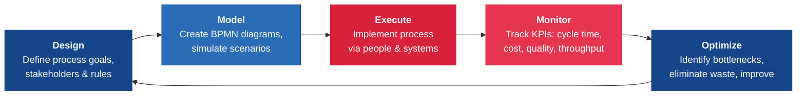
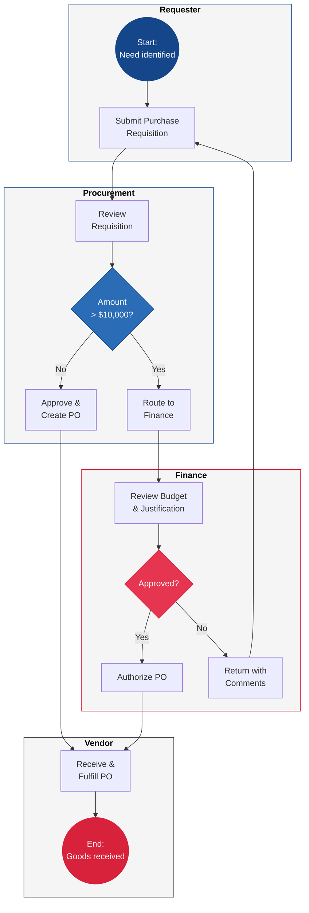

---
tags:
  - transformation
  - process
  - automation
reading_time: 30
difficulty: Intermediate
---

# Business Process Management

## Overview

Business Process Management (BPM) is the discipline of systematically analyzing, designing, executing, monitoring, and optimizing the workflows that drive an organization's operations. Every business function — from order fulfillment and customer onboarding to financial close and employee hiring — is fundamentally a process: a sequence of activities performed by people and systems to produce a defined outcome. BPM provides the methods, tools, and mindset for making those processes visible, measurable, and continuously improvable. When done well, BPM reduces costs, shortens cycle times, improves quality, and creates the operational agility that allows organizations to respond quickly to market changes.

For decades, process improvement was largely a manual discipline rooted in industrial engineering and quality management traditions such as Lean and Six Sigma. Today, technology has dramatically expanded the BPM toolkit. Robotic Process Automation (RPA) can execute repetitive, rule-based tasks without human intervention. Process mining uses event log data from enterprise systems to reveal how processes actually flow — often very differently from how they were designed. Intelligent automation combines RPA with AI and ML to handle increasingly complex work. These technologies are not replacing the need for process thinking; they are amplifying it. Organizations that invest in automation without first understanding their processes risk automating waste — making bad processes run faster.

For MBA students, BPM sits at the intersection of operations, technology, and strategy. Whether you are leading a digital transformation initiative, evaluating an ERP implementation, managing a shared services center, or simply trying to understand why a critical business process takes too long, BPM provides the analytical framework and vocabulary you need. The concepts in this section will connect directly to topics you encounter in operations management, supply chain strategy, and organizational design courses — but viewed through the lens of technology enablement.

!!! info "Why This Matters for MBA Students"
    As a business leader, you will encounter BPM in virtually every major IT initiative you sponsor, approve, or oversee. ERP implementations require extensive process redesign before a single line of code is configured. Digital transformation programs live or die based on whether the organization can reimagine its end-to-end processes, not just its technology stack. Cost reduction initiatives inevitably focus on process efficiency. RPA projects require business leaders to identify the right processes to automate and to manage the workforce implications. Understanding BPM equips you to ask the right questions: *Is this the right process to automate, or should we redesign it first? Are we measuring what matters? Where are the bottlenecks, and what is causing them?* These are management questions, not technical questions — and they are your responsibility to answer.

## Key Concepts

### What Is BPM?

BPM is both a management discipline and a technology-enabled practice. At its core, BPM provides a structured approach to understanding how work gets done across an organization and systematically improving it. Unlike one-time reengineering projects that attempt radical change, BPM emphasizes a **continuous lifecycle** of improvement that keeps processes aligned with evolving business needs.

The BPM lifecycle consists of five interconnected phases:

1. **Design** — Identify and document business processes. Determine the desired outcomes, the stakeholders involved, the handoffs between teams, and the business rules that govern decisions. This phase answers the question: *What should the process look like?*

2. **Model** — Create formal representations of the process using standard notation (typically BPMN). Modeling allows you to simulate different scenarios, identify potential issues before implementation, and communicate the process design to all stakeholders in a common visual language.

3. **Execute** — Implement the process, whether through manual procedures, workflow automation software, or a combination of both. This phase includes configuring systems, training people, and deploying the process into production.

4. **Monitor** — Collect data on process performance using KPIs such as cycle time, throughput, error rates, cost per transaction, and customer satisfaction. Dashboards and analytics provide real-time visibility into how the process is actually performing.

5. **Optimize** — Analyze performance data to identify bottlenecks, waste, and improvement opportunities. Implement changes, then cycle back through the lifecycle. Optimization may involve incremental adjustments (Kaizen) or more significant redesign depending on the gap between current and desired performance.

The lifecycle is not strictly linear — organizations frequently iterate between phases as they learn from execution data and as business requirements change.

### Process Modeling

Process modeling is the practice of creating visual representations of business processes so they can be analyzed, communicated, and improved. A process that exists only in people's heads — or scattered across tribal knowledge and undocumented workarounds — cannot be systematically managed. Modeling makes the invisible visible.

#### BPMN (Business Process Model and Notation)

BPMN is the international standard for process modeling, maintained by the Object Management Group (OMG). It provides a graphical notation that is intuitive enough for business analysts and managers to read, yet precise enough for technical teams to use as a basis for automation. BPMN has become the de facto language for documenting business processes in enterprise environments.

The core elements of BPMN are:

| Element | Symbol | Description | Example |
|---------|--------|-------------|---------|
| **Events** | Circles | Represent something that happens — a trigger, an intermediate occurrence, or an end state | Order received, timer expires, process complete |
| **Activities** | Rounded rectangles | Represent work that is performed — a task or a sub-process | Verify customer identity, approve purchase order |
| **Gateways** | Diamonds | Represent decision points where the process flow branches or merges | Exclusive (XOR): only one path; Parallel (AND): all paths simultaneously |
| **Sequence Flows** | Solid arrows | Show the order in which activities are performed | From "Review application" to "Make decision" |
| **Message Flows** | Dashed arrows | Show communication between different participants | Customer sends order to supplier |
| **Data Objects** | Document icons | Represent data required or produced by activities | Invoice, purchase order, customer record |

#### Swimlane Diagrams

Swimlane diagrams extend BPMN by organizing activities into horizontal or vertical lanes, where each lane represents a different role, department, or system responsible for those activities. Swimlanes make handoffs between teams immediately visible — and handoffs are where most process delays and errors occur. When a manager looks at a swimlane diagram and sees a process crossing five departments with eight handoffs, the opportunities for simplification often become obvious.

For example, a purchase requisition process might have lanes for the Requesting Department, Procurement, Finance, and the Vendor — clearly showing who does what and where the process crosses organizational boundaries.

### Process Optimization

Process optimization is the analytical work of identifying and eliminating inefficiencies in how work is performed. Two foundational methodologies dominate this space: Lean and Six Sigma. While they originated in manufacturing, both are now widely applied to service processes, IT operations, and administrative workflows.

#### Identifying Bottlenecks

A **bottleneck** is any point in a process where the flow of work is constrained, causing upstream activities to wait and downstream activities to starve. Bottlenecks determine the overall throughput of the entire process — a process can only move as fast as its slowest step. Effective process optimization begins by identifying bottlenecks through data analysis (cycle time at each step, queue lengths, resource utilization) and then addressing the root cause. Common bottleneck causes include insufficient staffing, manual approvals, system limitations, and information gaps.

#### Lean Principles: Eliminating Waste

Lean thinking, originally developed in the Toyota Production System, focuses on identifying and eliminating **waste** — any activity that consumes resources without adding value from the customer's perspective. Lean defines eight types of waste, easily remembered by the acronym **DOWNTIME**:

| Waste Type | Description | Process Example |
|------------|-------------|-----------------|
| **D**efects | Errors requiring rework or correction | Invoices with incorrect data that must be reprocessed |
| **O**verproduction | Producing more than is needed or before it is needed | Generating reports that nobody reads |
| **W**aiting | Idle time when work is not being processed | Applications sitting in an approval queue for days |
| **N**on-utilized talent | Underusing people's skills and knowledge | Senior analysts performing data entry tasks |
| **T**ransportation | Unnecessary movement of materials or information | Routing documents through departments that add no value |
| **I**nventory | Excess work-in-progress or stored materials | Backlog of unprocessed service requests |
| **M**otion | Unnecessary movement of people | Employees walking between systems or switching between applications |
| **E**xtra processing | Performing more work than the customer requires | Collecting data fields that are never used |

#### Six Sigma for Process Improvement

Six Sigma is a data-driven methodology that focuses on reducing variation and defects in processes. While Lean asks "How do we eliminate waste?", Six Sigma asks "How do we reduce variation to produce consistent, high-quality outcomes?" The core Six Sigma improvement methodology is **DMAIC**:

- **Define** — Clearly state the problem, the process boundaries, and the customer requirements
- **Measure** — Collect baseline data on current process performance
- **Analyze** — Use statistical tools to identify root causes of defects and variation
- **Improve** — Develop and implement solutions that address root causes
- **Control** — Put monitoring and control mechanisms in place to sustain improvements

Many organizations combine Lean and Six Sigma into **Lean Six Sigma**, using Lean to eliminate waste and Six Sigma to reduce variation — a powerful combination for comprehensive process improvement.

!!! question "Quick Check"
    - Your accounts payable team processes 500 invoices per day, and 20% require rework due to data entry errors. Would you apply Lean analysis, Six Sigma, or both? What specific waste type or variation issue would you target first?
    - A colleague argues that identifying bottlenecks is unnecessary because "we just need to make every step faster." Using the Theory of Constraints concept, explain why speeding up non-bottleneck steps may waste resources without improving overall throughput.

### Robotic Process Automation (RPA)

RPA is a technology that uses software "robots" (bots) to automate repetitive, rule-based tasks that were previously performed by humans interacting with computer systems. Unlike traditional software integration, which requires modifying underlying systems through APIs, RPA bots interact with applications through the UI — the same way a human would, clicking buttons, entering data, copying information between screens, and following decision rules.

#### How RPA Works

An RPA bot is essentially a script that mimics human actions on a computer screen. A developer (or increasingly, a business user with low-code tools) records or programs the steps the bot should follow: open an application, navigate to a specific screen, read a data field, make a decision based on a rule, enter data in another system, and so on. Once deployed, the bot executes these steps faster and more consistently than a human, operating 24/7 without breaks, errors, or fatigue.

#### Common Use Cases

RPA excels in processes that are:

- **High-volume** — Thousands of transactions per day or week
- **Rule-based** — Clear, consistent decision logic with minimal exceptions
- **Structured data** — Working with defined data fields in standard formats
- **Multi-system** — Requiring data transfer between systems that lack direct integration
- **Stable** — The underlying applications and process steps do not change frequently

Typical RPA deployments include invoice processing, employee onboarding data entry, claims processing, reconciliation tasks, report generation, and customer data updates across multiple systems.

#### Major RPA Vendors

| Vendor | Key Characteristics |
|--------|-------------------|
| **UiPath** | Market leader with the largest community; strong low-code development tools; extensive marketplace for pre-built automations |
| **Automation Anywhere** | Cloud-native platform; strong AI integration capabilities; enterprise-grade security and governance features |
| **Blue Prism** | Enterprise-focused with strong governance and compliance features; popular in financial services and healthcare; acquired by SS&C Technologies in 2022 |
| **Microsoft Power Automate** | Integrated with the Microsoft 365 ecosystem; accessible to business users; growing rapidly due to existing Microsoft enterprise relationships |

#### Limitations of RPA

RPA is a powerful tool, but it has significant limitations that managers must understand:

- **Brittleness** — RPA bots follow exact steps on exact screens. If the UI of an underlying application changes (a button moves, a field is renamed, a screen is reorganized), the bot breaks. This creates a maintenance burden that many organizations underestimate.
- **Surface-level automation** — RPA automates the symptoms of poor integration, not the root cause. If two systems need to share data, a direct API integration is usually more robust and maintainable than an RPA bot that copies data between them through the UI.
- **Limited intelligence** — Standard RPA bots cannot handle exceptions, ambiguity, or judgment calls. They follow rules. If a process involves significant human judgment, unstructured data, or frequent exceptions, basic RPA is not the right solution.
- **Governance overhead** — Organizations with hundreds of bots need governance structures to manage them: who owns each bot, what happens when it fails, how changes are tested and deployed, and how bot access to systems is secured.

!!! question "Quick Check"
    - A finance director wants to use RPA to automate a month-end close process that involves frequent judgment calls and exception handling. Based on the RPA limitations discussed above, would you recommend proceeding? What alternative approach might be more appropriate?
    - Two systems need to exchange data regularly. An RPA bot could copy data between them through the UI, or the IT team could build an API integration. Under what circumstances would you choose each approach, and what are the long-term cost implications of choosing RPA as a shortcut?

### Process Mining

Process mining is an analytical technique that uses event log data from IT systems to discover, visualize, and analyze how business processes actually execute in practice. Unlike traditional process modeling, which documents how a process is *supposed* to work (the "as-designed" process), process mining reveals how it *actually* works (the "as-is" process) — including all the variations, workarounds, loops, and deviations that real-world execution introduces.

#### How Process Mining Works

Every time an activity occurs in an enterprise system (an ERP transaction, a CRM update, a service ticket status change), the system records an event in its log. Each event typically captures three pieces of information: a **case identifier** (which instance of the process — e.g., order number), an **activity name** (what happened — e.g., "approve purchase order"), and a **timestamp** (when it happened). Process mining algorithms reconstruct the full end-to-end process flow from these event logs, producing a visual process map that shows every path the process takes, how frequently each path is used, and how long each step takes.

#### Key Capabilities

- **Process Discovery** — Automatically generating a process model from event log data, revealing the actual process flow without relying on interviews or documentation
- **Conformance Checking** — Comparing the discovered "as-is" process against the intended "as-designed" process to identify deviations, compliance violations, and unauthorized workarounds
- **Performance Analysis** — Identifying bottlenecks, measuring cycle times, and pinpointing where delays occur by analyzing timestamps across process steps
- **Root Cause Analysis** — Investigating why certain cases take longer, cost more, or result in errors by correlating process variations with case attributes

#### Event Logs: The Raw Material of Process Mining

The quality and completeness of event logs determine what process mining can reveal. A well-structured event log contains:

| Field | Description | Example |
|-------|------------|---------|
| **Case ID** | Unique identifier for each process instance | Order #12345 |
| **Activity** | The step or task that was performed | "Approve Purchase Order" |
| **Timestamp** | When the activity occurred (start and/or end) | 2025-03-15 14:32:07 |
| **Resource** | Who or what performed the activity | "J. Smith" or "Bot-Finance-01" |
| **Attributes** | Additional context about the case | Order value, customer segment, priority |

Most enterprise systems (ERP, CRM, ITSM, BPM platforms) generate event logs automatically as part of their normal operation — every SAP transaction, every Salesforce status change, every ServiceNow ticket update creates a log entry. The challenge is often not generating logs but **extracting, connecting, and cleaning** them across multiple systems to reconstruct end-to-end process flows.

#### Conformance Checking in Depth

Conformance checking is one of process mining's most powerful capabilities for governance and compliance. It systematically compares the **discovered process** (what actually happens) against the **reference model** (what should happen) and quantifies the deviations:

- **Fitness** — What percentage of cases in the event log can be replayed by the reference model? Low fitness means the actual process frequently deviates from the designed process.
- **Precision** — Does the reference model allow behavior that never actually occurs? A reference model that is too loose (allows anything) has low precision.
- **Generalization** — Will the discovered model hold for future cases, or is it over-fitted to the specific event log analyzed?
- **Deviation categorization** — Each deviation is classified as a **skip** (a required step was omitted), a **rework loop** (a step was repeated), an **insertion** (an unplanned step was added), or a **wrong sequence** (steps occurred in an unexpected order).

Conformance checking is particularly valuable in regulated industries — financial services (KYC/AML compliance), healthcare (clinical pathways), and pharmaceuticals (FDA-regulated processes) — where demonstrating that processes follow prescribed procedures is a legal requirement.

#### Celonis and the Process Mining Market

**Celonis**, founded in Munich in 2011, has emerged as the dominant process mining platform with a valuation exceeding $13 billion. Celonis connects to enterprise systems (SAP, Oracle, Salesforce, ServiceNow, and 100+ others) through pre-built connectors, extracts event log data, and provides:

- **Process Explorer** — Automated discovery of actual process flows with variant analysis
- **Conformance checking** — Side-by-side comparison of actual vs. target processes
- **Action Engine** — Automated recommendations and workflow triggers that fix process issues in real time (e.g., automatically escalating overdue purchase orders)
- **Process Sphere** — Object-centric process mining that tracks multiple interconnected objects (orders, invoices, deliveries) rather than a single case, reflecting the complexity of real enterprise processes

Other significant players include **SAP Signavio** (integrated with SAP's ecosystem), **Microsoft Power Automate Process Mining** (accessible to Microsoft 365 users), **UiPath Process Mining** (combined with their RPA platform for discover-then-automate workflows), and **Disco by Fluxicon** (popular in academic and research settings).

#### Why Process Mining Matters

Process mining addresses a fundamental challenge in BPM: the gap between how managers *believe* a process works and how it *actually* works. In a large organization, an order-to-cash process might have a documented 12-step flow, but process mining might reveal 147 distinct process variants, with only 30% of cases following the intended path. This insight is transformational — you cannot optimize a process you do not truly understand, and process mining provides that understanding through objective data rather than subjective opinions.

!!! question "Quick Check"
    - Process mining reveals that only 30% of cases in your procurement process follow the documented path. Your operations manager insists the deviations are "necessary workarounds." How would you use conformance checking to determine which deviations are genuinely valuable adaptations and which represent compliance risks?
    - Why would you run process mining *before* deploying RPA rather than after? What specific risks does skipping this step create for your automation investment?

### Intelligent Automation

Intelligent automation (IA) extends RPA by combining software robots with AI capabilities — including ML, NLP, computer vision, and generative AI — to handle more complex, judgment-intensive tasks. While basic RPA can only follow explicit rules on structured data, intelligent automation can read unstructured documents, interpret natural language, make probabilistic decisions, learn from examples, and handle exceptions that would stop a basic bot.

#### From RPA to Intelligent Automation

The evolution from basic RPA to intelligent automation can be understood as a progression along two dimensions: the complexity of the task and the degree of human judgment required.

| Automation Level | Capabilities | Example |
|-----------------|-------------|---------|
| **Basic RPA** | Rule-based, structured data, deterministic decisions | Copying data between two systems based on exact field mappings |
| **Enhanced RPA** | RPA + OCR, basic document processing | Reading invoice data from scanned PDFs and entering it into the ERP |
| **Intelligent Automation** | RPA + ML + NLP, probabilistic decisions, unstructured data | Analyzing customer emails, determining intent, and routing to the correct department with a recommended response |
| **Autonomous Automation** | Self-learning systems that adapt without reprogramming | AI agents that handle end-to-end customer service interactions, escalating only truly novel situations to humans |

#### Hyperautomation

Gartner coined the term **hyperautomation** to describe the disciplined approach of combining multiple automation technologies — RPA, AI, ML, process mining, low-code platforms, and integration tools — to automate as many business processes as possible. Hyperautomation is not a single technology but a strategy: systematically identifying automation opportunities across the enterprise, selecting the right combination of tools for each, and building an automation pipeline that continuously discovers and implements new automations. Gartner has identified hyperautomation as a top strategic technology trend, reflecting the reality that organizations are moving beyond isolated bot deployments toward enterprise-wide automation programs.

### Continuous Improvement

Continuous improvement is the organizational practice of making ongoing, incremental enhancements to processes, products, and services. While the BPM lifecycle inherently includes an optimization phase, continuous improvement elevates this concept from a project activity to a cultural value — the belief that every process can be made better and that improvement is everyone's responsibility, not just the job of a dedicated process team.

#### Kaizen

**Kaizen** is a Japanese philosophy meaning "change for the better" that has become one of the most influential concepts in operations management. In practice, Kaizen manifests as a structured approach where frontline employees are empowered and encouraged to identify small, daily improvements in their work. Rather than waiting for a major reengineering initiative, Kaizen promotes a steady stream of modest changes that compound over time into significant performance gains. Kaizen events (sometimes called "blitzes") are focused, short-duration workshops (typically 3-5 days) where a cross-functional team maps a specific process, identifies waste, and implements improvements before the week is over.

#### The PDCA Cycle

The **Plan-Do-Check-Act (PDCA)** cycle, also known as the Deming Cycle, provides a simple but powerful framework for structured continuous improvement:

- **Plan** — Identify an improvement opportunity, analyze the current state, and develop a plan to test a change
- **Do** — Implement the change on a small scale as a pilot or experiment
- **Check** — Measure the results of the change and compare them to the expected outcomes
- **Act** — If the change was successful, standardize it and deploy it broadly. If not, learn from the results and begin a new cycle

The PDCA cycle is intentionally iterative — each cycle builds on the learning from the previous one, creating a spiral of progressive improvement.

#### Building a Culture of Process Improvement

The most effective BPM organizations recognize that tools and methodologies are necessary but insufficient. Lasting improvement requires a **culture** that values process thinking:

- **Leadership commitment** — Senior leaders must visibly prioritize and participate in process improvement, not just delegate it
- **Employee empowerment** — Frontline workers who execute processes daily are the best source of improvement ideas; they need channels and encouragement to contribute
- **Metrics and transparency** — Process performance data should be visible and accessible so teams can see the impact of their improvements
- **Recognition and incentives** — Organizations that celebrate process improvements — even small ones — reinforce the behavior they want to see
- **Tolerance for experimentation** — Improvement requires trying new approaches, which means accepting that not every experiment will succeed

## Frameworks & Models

### The BPM Lifecycle

The following diagram illustrates the continuous nature of the BPM lifecycle, emphasizing that optimization feeds back into design as the cycle repeats:

### Example BPMN Process: Purchase Order Approval

The following simplified BPMN-style diagram illustrates a purchase order approval process with decision gateways and swimlane-like separation between roles:

### Comparison of Automation Approaches

The following table compares the major automation approaches that organizations use within their BPM programs, helping managers select the right tool for the right situation:

| Dimension | Traditional Integration (API/ETL) | RPA | Intelligent Automation | Process Mining |
|-----------|----------------------------------|-----|----------------------|----------------|
| **Primary Purpose** | Connect systems at the data layer | Automate repetitive human tasks via UI | Handle complex tasks requiring judgment | Discover and analyze actual process flows |
| **Data Type** | Structured | Structured | Structured + Unstructured | Event logs |
| **Complexity Handled** | System-to-system data exchange | Simple, rule-based tasks | Complex, judgment-intensive tasks | Process analysis and visualization |
| **Human Judgment Required** | None | None | Minimal to moderate | Analyst interpretation of results |
| **Implementation Speed** | Weeks to months | Days to weeks | Weeks to months | Days to weeks |
| **Maintenance Burden** | Low (if APIs are stable) | High (UI changes break bots) | Moderate (models need retraining) | Low (reads existing logs) |
| **Typical ROI Timeline** | 6-12 months | 3-6 months | 6-18 months | Immediate insights |
| **Best For** | Permanent, high-volume system integration | Quick wins on manual, repetitive tasks | Processes with exceptions, unstructured data | Understanding current-state processes before optimization |
| **Key Vendors** | MuleSoft, Dell Boomi, Informatica | UiPath, Automation Anywhere, Blue Prism | UiPath + AI, Microsoft AI Builder | Celonis, SAP Signavio, UiPath |

## Real-World Applications

### Example 1: A Global Insurer Reduces Claims Processing Time by 60%

A large property and casualty insurance company was struggling with claims processing cycle times that averaged 14 days from first notice of loss to settlement. The process involved manual data entry from claim forms (many submitted as scanned documents), handoffs between five departments, multiple approval layers, and rekeying of data between the claims management system and the financial settlement system.

The insurer's BPM program proceeded in phases:

- **Process mining** was applied to the claims management system's event logs, revealing that 40% of all claims followed non-standard paths — including a common workaround where adjusters bypassed the fraud screening step for low-value claims to save time. Conformance checking flagged this as a compliance risk.
- **Lean analysis** identified that claims spent an average of 4.2 days simply waiting in queues between departments — pure waste that added no value. The three longest queues were at document verification, adjuster assignment, and financial approval.
- **RPA bots** were deployed to automate data extraction from claim forms (using OCR-enhanced RPA for scanned documents) and to transfer settlement data between systems, eliminating two full days of manual processing.
- **Intelligent automation** using NLP was added to automatically triage incoming claims by type and severity, routing them to the appropriate adjuster pool and flagging potential fraud indicators for the fraud team's review.

The result: average cycle time dropped from 14 days to 5.5 days, customer satisfaction scores improved by 22 points, and the compliance gap in fraud screening was closed. The automation freed up 35 FTEs worth of capacity, which was redeployed to complex claims that required human expertise.

### Example 2: A Hospital System Streamlines Patient Discharge

A regional hospital system found that patients were waiting an average of 6 hours from the physician's discharge order to actually leaving the hospital. This "discharge delay" reduced bed availability, contributed to emergency department overcrowding, and frustrated patients and families.

A cross-functional Kaizen event brought together nurses, physicians, pharmacists, case managers, transport staff, and IT analysts for a five-day focused improvement workshop:

- **Current-state process mapping** using BPMN revealed 23 discrete steps in the discharge process, involving seven different roles and four different IT systems (the EHR, pharmacy system, transport scheduling, and patient portal).
- **Bottleneck analysis** identified three primary delays: waiting for discharge medications from the pharmacy (average 90 minutes), waiting for transport (average 45 minutes), and waiting for discharge instructions to be printed and explained (average 30 minutes).
- **Process redesign** included initiating pharmacy preparation as soon as the physician entered a "likely discharge" status (rather than waiting for the formal order), pre-scheduling transport based on anticipated discharge times, and enabling electronic delivery of discharge instructions to the patient portal.
- **PDCA cycles** were used to pilot each change on a single nursing unit before rolling out hospital-wide.

Average discharge time decreased from 6 hours to 2.5 hours, freeing up an estimated 12 additional beds per day across the system and reducing emergency department boarding by 30%.

### Example 3: A Bank Deploys Process Mining to Fix Its Account Opening Process

A mid-size commercial bank was losing prospective business customers during the account opening process. The documented process had 8 steps and was designed to take 3 business days. In practice, average completion time was 11 business days, and 28% of applicants abandoned the process before completion.

The bank deployed Celonis to mine event logs from its core banking system, CRM, and document management platform:

- **Process discovery** revealed 89 distinct process variants (compared to the single documented path), with the most common variant including 14 steps rather than 8. The additional steps were undocumented quality checks, manual escalations, and redundant document requests.
- **Root cause analysis** showed that 60% of delays were caused by incomplete documentation — the bank was requesting documents piecemeal rather than providing a comprehensive checklist upfront, triggering repeated back-and-forth communication with customers.
- **Conformance checking** identified that 15% of accounts were opened without completing the required KYC (Know Your Customer) verification — a significant regulatory compliance risk that had gone undetected.
- Based on these insights, the bank redesigned the process: a single comprehensive document request replaced the piecemeal approach, automated reminders were implemented for outstanding items, and a mandatory KYC checkpoint was enforced in the workflow system.

Account opening time dropped to 4 business days, abandonment rates fell from 28% to 9%, and the KYC compliance gap was eliminated — all identified and driven by process mining data rather than guesswork.

## Common Pitfalls

!!! warning "Automating Before Optimizing"
    One of the most expensive mistakes organizations make is automating a process without first analyzing and improving it. If a process contains unnecessary steps, redundant approvals, or avoidable handoffs, automating it simply makes a bad process run faster — and harder to change later because the automation has now codified the waste. The best practice is: **simplify first, then automate**. Use Lean analysis to eliminate waste and Six Sigma to reduce variation before investing in RPA or intelligent automation. As the management saying goes, "Do not pave the cow path."

!!! warning "Treating RPA as a Silver Bullet"
    RPA delivers impressive quick wins for the right use cases, but organizations often over-extend it. Bots deployed to handle processes with frequent exceptions, unstable UIs, or significant judgment requirements create a fragile automation portfolio that requires constant maintenance. Some organizations have experienced "RPA disillusionment" — initial excitement followed by frustration as bot failure rates climb and maintenance costs mount. The solution is disciplined process selection: RPA works best for high-volume, rule-based, stable processes. For everything else, consider intelligent automation, traditional integration, or process redesign.

!!! warning "Ignoring the Human Side of Process Change"
    Process improvement and automation directly affect how people do their jobs. Resistance is natural — employees may fear job loss, resent changes to established routines, or distrust data that reveals their workarounds. Organizations that treat BPM as a purely technical exercise, without investing in change management, communication, and workforce transition planning, consistently underdeliver on expected benefits. The most successful BPM programs involve frontline employees in process design, communicate transparently about automation's impact on roles, and invest in reskilling and redeployment rather than simple headcount reduction.

!!! warning "Confusing Process Documentation with Process Management"
    Creating BPMN diagrams and process documentation is a valuable first step, but it is not BPM. Many organizations invest heavily in documenting their processes — sometimes hiring consultants to produce beautifully detailed process maps — only to put them in a shared drive where they are never referenced again. True BPM requires the full lifecycle: the documentation must be connected to execution, monitored with real data, and actively maintained as processes evolve. If your process maps are more than six months old and have not been updated, they are likely fiction. Process mining offers a powerful antidote by continuously revealing the actual process from system data, keeping your understanding current.

## Discussion Questions

1. **Automation Strategy**: Your company is evaluating an RPA initiative projected to save $5 million annually by automating 200 manual processes across finance, HR, and operations. The CIO is enthusiastic, but the CHRO raises concerns about workforce displacement, and the CFO questions whether maintaining 200 bots will eat into the projected savings. Using the concepts from this section, how would you structure the evaluation? What criteria would you use to prioritize which processes to automate, and how would you address the workforce and maintenance concerns?

2. **Process Mining Insights**: You are the COO of a company that just completed a process mining analysis of its order-to-cash cycle. The data reveals that 45% of orders deviate from the standard process, average cycle time is 3x the target, and there is a significant compliance gap in credit approval steps. The operations team insists that the current process works fine and that the deviations are necessary workarounds for customer needs. How do you reconcile the data with the team's perspective, and what actions do you take?

3. **Continuous Improvement Culture**: Your organization has invested millions in Lean Six Sigma training, process mining tools, and an RPA platform — but after two years, process improvement remains a "special project" activity rather than an embedded part of how people work. Improvement ideas still come only from the dedicated process team, not from frontline employees. What organizational, leadership, and incentive changes would you recommend to shift from project-based improvement to a genuine culture of continuous improvement?

## Key Takeaways

- **BPM is a continuous lifecycle** — design, model, execute, monitor, optimize — not a one-time project. The organizations that sustain the greatest operational improvements are those that embed this cycle into their operating rhythm.
- **Process modeling using BPMN** makes processes visible, analyzable, and communicable. You cannot improve what you cannot see, and BPMN provides the standard visual language for making processes visible across the enterprise.
- **Lean and Six Sigma** remain foundational methodologies for process optimization. Lean eliminates waste (activities that do not add value); Six Sigma reduces variation (inconsistency in process outcomes). Combined as Lean Six Sigma, they provide a comprehensive toolkit for process improvement.
- **RPA automates repetitive, rule-based tasks** by mimicking human interactions with software. It delivers fast ROI for the right use cases but is brittle, maintenance-intensive, and limited to structured, stable processes.
- **Process mining uses system event log data** to reveal how processes actually execute — often very differently from how they are documented. It is an essential tool for understanding current-state processes before attempting optimization or automation.
- **Intelligent automation combines RPA with AI** (ML, NLP, computer vision) to handle more complex, judgment-intensive tasks. Hyperautomation extends this into an enterprise-wide strategy for systematically identifying and implementing automation opportunities.
- **Always optimize before automating.** Automating a wasteful or broken process simply encodes the waste in software. Simplify first, then automate.
- **Continuous improvement is a culture, not a project.** Kaizen, PDCA, and other improvement frameworks provide the structure, but lasting results require leadership commitment, employee empowerment, and organizational incentives that reward process thinking.
- **The human side matters as much as the technical side.** Process changes affect people's jobs, routines, and identities. Change management, transparent communication, and workforce transition planning are essential for realizing the benefits of any BPM initiative.

## Further Reading

- **Dumas, Marlon, Marcello La Rosa, Jan Mendling, and Hajo A. Reijers.** *Fundamentals of Business Process Management.* 2nd ed., Springer, 2018. The leading academic textbook on BPM, covering process modeling, analysis, redesign, and automation in an accessible, comprehensive manner.
- **van der Aalst, Wil M. P.** *Process Mining: Data Science in Action.* 2nd ed., Springer, 2016. The definitive reference on process mining by the researcher who founded the field. Covers discovery, conformance checking, and performance analysis.
- **Womack, James P., and Daniel T. Jones.** *Lean Thinking: Banish Waste and Create Wealth in Your Corporation.* 2nd ed., Free Press, 2003. The foundational text on Lean principles applied to business processes, written for a general management audience.
- **George, Michael L., John Maxey, David T. Rowlands, and Mark Price.** *The Lean Six Sigma Pocket Toolbook.* McGraw-Hill, 2004. A practical, concise reference for Lean Six Sigma tools and techniques.
- **Lacity, Mary C., and Leslie P. Willcocks.** *Robotic Process Automation and Risk Mitigation: The Definitive Guide.* SB Publishing, 2017. An evidence-based examination of RPA adoption, benefits, and risks based on extensive case study research.
- **Gartner.** "Top Strategic Technology Trends: Hyperautomation." Gartner Research, 2024. Gartner's analysis of the hyperautomation trend and its implications for enterprise automation strategy.
- See also: [Digital Transformation](digital-transformation.md) for how BPM connects to broader transformation programs, [Enterprise Applications](../technology/enterprise-applications.md) for the systems that BPM processes often run on, [IT Governance Frameworks](../governance/frameworks.md) for how process governance fits within enterprise IT governance structures, and [AI & Emerging Technology](ai-emerging-tech.md) for how AI and intelligent automation are extending BPM capabilities.
