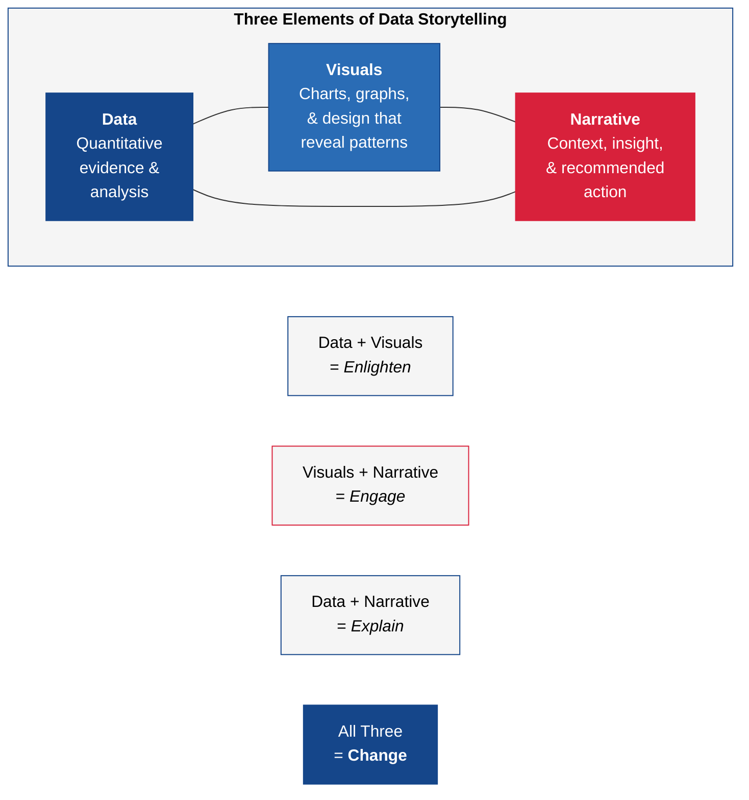

---
tags:
  - transformation
  - analytics
  - visualization
reading_time: 18
difficulty: Foundational
---

# Data Visualization & Storytelling with Data

## Overview

Data visualization is the graphical representation of information and data. By using visual elements like charts, graphs, maps, and dashboards, data visualization tools provide an accessible way to see and understand trends, outliers, and patterns in data. In the enterprise context, visualization is how analysis becomes action — a well-designed chart can communicate in seconds what a spreadsheet of numbers cannot convey in hours.

But visualization is only half the equation. **Storytelling with data** is the practice of combining data, visuals, and narrative to communicate insights persuasively and drive decision-making. The best analysts in the world are ineffective if they cannot communicate their findings to executives, board members, and stakeholders who have limited time and varying levels of data literacy. The ability to translate complex analysis into clear, compelling visual narratives is one of the most valuable skills a business professional can develop.

For MBA students, data visualization is not about learning a specific tool — it is about developing the judgment to select the right visualization for the right audience, to design dashboards that drive decisions rather than just display data, and to tell stories with data that move organizations to action. Whether you are presenting a quarterly business review, making a case for a technology investment, or analyzing market trends, your ability to visualize and narrate data effectively will directly affect your influence and impact.

!!! info "Why This Matters for MBA Students"
    Data visualization and storytelling with data appear as core or elective content in 4 of 6 top MBA programs surveyed (AU Kogod ITEC-660, HBS DSAIL, UNC, UVA Darden). In your career, you will spend more time consuming, creating, and presenting data visualizations than almost any other analytical activity. CFOs present financial dashboards to boards. Marketing leaders visualize campaign performance. Operations managers monitor real-time KPI dashboards. Consultants build data-driven client presentations. The difference between a mediocre presentation and a compelling one often comes down to how effectively data is visualized and narrated.

## Key Concepts

### Principles of Effective Visualization

The field of data visualization has been shaped by several influential thinkers whose principles remain foundational.

#### Edward Tufte's Principles

Edward Tufte, often called the "Leonardo da Vinci of data," established principles that have guided visualization design for decades:

- **Data-ink ratio** — Maximize the proportion of ink on a chart that represents actual data. Every visual element that does not convey information (decorative gridlines, 3D effects, unnecessary borders) is "chart junk" that should be removed.
- **Small multiples** — When comparing patterns across categories or time periods, use a series of small, consistently formatted charts rather than one overloaded chart. This leverages the eye's ability to detect patterns across repeated visual forms.
- **Graphical integrity** — The representation of numbers should be directly proportional to the numerical quantities represented. Truncated axes, inconsistent scales, and misleading area comparisons violate graphical integrity and can deceive viewers.
- **Layering and separation** — Use visual hierarchy (color, size, position, contrast) to guide the viewer's attention from the most important information to supporting details.

#### Stephen Few's Dashboard Design Principles

Stephen Few focused specifically on business dashboard design:

- **Reduce to the essential** — A dashboard should fit on a single screen and display only the KPIs and metrics that require attention. If users need to scroll, the dashboard has too much information.
- **Group related information** — Place metrics that are logically connected close together. Revenue and cost metrics should be near each other; customer metrics should be grouped separately.
- **Use appropriate chart types** — Bars for comparison, lines for trends over time, scatter plots for relationships, tables for exact values. Never use pie charts for more than 3-4 categories, and never use 3D charts (they distort perception).
- **Provide context** — Numbers without context are meaningless. Show targets, historical comparisons, benchmarks, and trend indicators so viewers can instantly assess whether a metric is good, bad, or neutral.

### Chart Selection Guide

Choosing the right chart type is one of the most important visualization decisions. The wrong chart can obscure the very insight you are trying to communicate.

| Purpose | Best Chart Types | Avoid | Example |
|---------|-----------------|-------|---------|
| **Compare values across categories** | Bar chart (horizontal for many categories, vertical for few) | Pie charts for more than 3-4 slices | Revenue by product line, headcount by department |
| **Show trends over time** | Line chart, area chart | Bar charts for continuous time data | Monthly revenue trend, quarterly customer growth |
| **Show composition / parts of a whole** | Stacked bar, treemap, pie (≤4 slices only) | Multiple pie charts for comparison | Market share breakdown, budget allocation |
| **Show relationships between variables** | Scatter plot, bubble chart | Bar charts, line charts | Marketing spend vs. revenue, employee satisfaction vs. turnover |
| **Show distribution** | Histogram, box plot | Pie charts, bar charts | Employee salary distribution, customer order size distribution |
| **Show geographic patterns** | Choropleth map, bubble map | Tables with location columns | Sales by state/country, store performance by region |
| **Display exact values for lookup** | Table with conditional formatting | Charts (they sacrifice precision) | Financial statements, detailed KPI scorecards |
| **Show progress toward a goal** | Bullet chart, gauge (sparingly) | Complex multi-axis charts | Budget utilization, sales quota attainment |

!!! question "Quick Check"
    - A colleague presents quarterly revenue data across 12 product lines using a pie chart. Why is this a poor chart choice, and what visualization would communicate the comparison more effectively?
    - You need to show your board both the trend in customer acquisition over time and the relationship between marketing spend and acquisition cost. Would you use one chart or two? What chart types would you select for each message, and why?

### Dashboard Design for Executives

Executive dashboards serve a specific purpose: to give senior leaders a real-time or near-real-time view of organizational performance so they can identify issues, ask informed questions, and make decisions. Effective executive dashboards are fundamentally different from analyst workbenches or operational monitoring tools.

#### Design Principles for Executive Dashboards

1. **One screen, no scrolling** — Executives have limited time and attention. The dashboard must communicate the most critical information at a glance. If it requires scrolling, drill-down, or explanation, it is too complex.

2. **Exception-based design** — Executives do not need to see every metric performing normally. Design the dashboard to highlight exceptions — metrics that are above target (good), below target (concerning), or trending in an unexpected direction. Use color coding (green/yellow/red) sparingly but consistently.

3. **Context over raw numbers** — A number like "$4.2M" means nothing without context. Always show: the target ($4.5M), the variance (-$300K / -7%), the trend (declining for 3 consecutive months), and the comparison (down from $4.8M same period last year).

4. **Drill-down capability** — While the top-level dashboard should fit on one screen, it should enable drill-down into underlying detail for executives who want to investigate. Click on a regional revenue figure to see the breakdown by product line; click on a customer satisfaction metric to see the underlying survey data.

5. **Consistent layout** — Use a consistent grid layout. Place the most critical metrics in the top-left (where the eye naturally starts). Group financial metrics, operational metrics, customer metrics, and people metrics into clear zones.

### Storytelling with Data: Narrative Structure

Data storytelling combines three elements: **data** (the quantitative evidence), **visuals** (the charts and graphics that make patterns visible), and **narrative** (the verbal or written context that gives meaning to the data and drives action).

#### The Narrative Arc for Data Stories

Effective data stories follow a structure similar to any good narrative:

1. **Setting / Context** — What is the business situation? What question are we trying to answer? Why does it matter now? ("Our customer churn rate has been climbing for four consecutive quarters.")
2. **Tension / Conflict** — What does the data reveal that creates urgency or challenges assumptions? ("Analysis reveals that churn is concentrated among mid-tier customers — our most profitable segment — and is driven primarily by service quality issues, not pricing.")
3. **Resolution / Recommendation** — What should we do about it? ("Investing $2M in a dedicated mid-tier customer success program is projected to reduce churn by 30% and recover $8M in annual revenue.")

#### Cole Nussbaumer Knaflic's Principles

Cole Nussbaumer Knaflic, author of *Storytelling with Data*, provides actionable principles for data communication:

- **Understand the context** — Before creating a single chart, clarify: Who is your audience? What do they care about? What action do you want them to take? What data supports that action?
- **Choose an appropriate visual display** — Match the chart type to the message, not the data.
- **Eliminate clutter** — Remove every visual element that does not directly support the message. Every gridline, label, legend entry, and color choice should earn its place.
- **Focus attention** — Use pre-attentive attributes (color, size, position, contrast) to draw the viewer's eye to the most important data point. If everything is highlighted, nothing is highlighted.
- **Think like a designer** — Apply principles of visual design: alignment, proximity, repetition, contrast. A well-designed chart is not just informative — it is pleasant to read.
- **Tell a story** — Do not just show data. Walk the audience through it. Provide context, highlight the key insight, and end with a clear recommendation.

!!! question "Quick Check"
    - You have a 40-slide data presentation for a board meeting. The CFO tells you to cut it to 5 slides. Using the narrative arc structure (Setting, Tension, Resolution), how would you restructure the presentation so the data still drives a clear decision?
    - Knaflic advises "eliminate clutter" and "focus attention." If you highlight every data point in a chart with bold color, what happens to the viewer's ability to identify the key insight? How does this principle apply to dashboard design as well?

### The Tool Landscape

The BI and visualization market offers a range of tools suited to different needs, skill levels, and organizational contexts.

| Tool | Strengths | Best For | Learning Curve | Price Range |
|------|----------|----------|---------------|-------------|
| **Microsoft Power BI** | Microsoft ecosystem integration, strong self-service, competitive pricing | Organizations on Microsoft stack | Low-Medium | Free (desktop) to ~$10/user/month |
| **Tableau** | Industry-leading visualization, intuitive interface, large community | Visual analytics, data exploration | Medium | $35-75/user/month |
| **Looker (Google)** | Semantic modeling, embedded analytics, Google Cloud integration | Data-driven organizations on GCP | Medium-High | Enterprise pricing |
| **Excel / Google Sheets** | Ubiquitous, flexible, no additional cost | Quick analysis, personal productivity | Low | Included in productivity suites |
| **Python (Matplotlib, Seaborn, Plotly)** | Maximum flexibility, custom visualizations, reproducible analysis | Data scientists, custom analysis | High | Free (open source) |
| **R (ggplot2)** | Statistical visualization, publication-quality graphics | Academic research, statistical analysis | High | Free (open source) |

### Visualization Ethics: How Charts Mislead

Data visualizations can deceive — intentionally or unintentionally. Understanding common misleading techniques helps you both avoid creating misleading charts and critically evaluate charts presented to you.

| Technique | How It Misleads | How to Detect | Example |
|-----------|----------------|---------------|---------|
| **Truncated Y-axis** | Starting the Y-axis at a value other than zero exaggerates differences | Check whether the axis starts at zero; look for axis break indicators | A bar chart showing revenue of $98M vs $100M with Y-axis starting at $97M makes a 2% difference look enormous |
| **Cherry-picked time frames** | Selecting a start/end date that supports a desired narrative | Ask for the full historical context | Showing stock price from the yearly low to create an impressive growth story |
| **Misleading area/volume** | Using 2D or 3D shapes where area grows faster than the underlying data | Check whether the visual encoding is proportional | Doubling the radius of a circle quadruples its area, making a 2x increase look like 4x |
| **Dual Y-axes** | Two different scales can be manipulated to create false correlations | Check whether both axes start at zero and have proportional scales | Plotting ice cream sales and drowning deaths on different Y-axes to imply causation |
| **Unlabeled or missing data** | Omitting data points, categories, or labels hides inconvenient information | Count categories; look for gaps in time series | A survey result chart that omits the "dissatisfied" category |

!!! question "Quick Check"
    - A vendor presents a chart showing their product's market share doubled this year. The Y-axis starts at 48% and ends at 52%. What misleading technique is being used, and how would you redraw the chart to give a more honest picture?
    - You discover that a competitor's annual report shows revenue growth using a time frame that starts at their lowest quarter. Is this unethical, merely misleading, or acceptable? How would you evaluate the same data more objectively?

## Frameworks & Models

### The Data Storytelling Framework

The power of data storytelling comes from combining all three elements. Data alone is just numbers. Visuals alone are just pictures. Narrative alone is just opinion. When combined:

- **Data + Visuals** = Enlighten (people see the pattern but may not understand why it matters)
- **Visuals + Narrative** = Engage (compelling but potentially anecdotal without data rigor)
- **Data + Narrative** = Explain (credible but hard to absorb without visual support)
- **All Three** = **Change** (the audience understands, believes, and is motivated to act)

### Dashboard Design Framework

| Dashboard Type | Audience | Purpose | Refresh Frequency | Key Design Principle |
|---------------|----------|---------|-------------------|---------------------|
| **Strategic** | CEO, board, C-suite | Monitor organizational health against strategic objectives | Weekly to monthly | Exception-based; high-level KPIs only |
| **Analytical** | Analysts, managers | Explore data to understand root causes and identify opportunities | Daily to weekly | Drill-down capability; filter-rich |
| **Operational** | Front-line managers, operators | Monitor real-time operations and trigger immediate actions | Real-time to hourly | Alerts and thresholds; minimal analysis required |

## Real-World Applications

### Example 1: How Airbnb Uses Data Visualization to Drive Strategy

Airbnb built an internal data visualization platform that democratized analytics across the organization. Rather than relying on a centralized analytics team to produce reports, Airbnb invested in self-service dashboards that enabled product managers, marketers, and operations teams to explore data independently. The company developed a standardized visualization library ensuring consistency across teams and invested heavily in data literacy training so that all employees could interpret visualizations correctly. The result was faster decision-making, reduced dependency on data analysts for routine questions, and a stronger culture of evidence-based management.

**Key lesson**: Visualization tools are only effective when paired with data literacy. Airbnb's investment in training was as important as its investment in technology.

### Example 2: A Hospital System's Patient Outcomes Dashboard

A large hospital system implemented a real-time clinical dashboard that visualized patient outcomes, readmission rates, and treatment effectiveness across its 20 facilities. The dashboard used exception-based design — facilities performing within normal parameters appeared in neutral colors, while facilities with above-average readmission rates or below-average patient satisfaction were highlighted in red. Department heads could drill down from facility-level metrics to individual department and physician-level data.

Within 18 months, the system reduced 30-day readmission rates by 15% — primarily because the visualization made performance differences visible and created accountability. Facilities that had been unaware they were underperforming relative to peers could now see the comparison clearly, prompting investigation and improvement.

**Key lesson**: Visualization creates transparency, and transparency drives accountability. The data existed before the dashboard — what was missing was the visibility.

### Example 3: A Financial Services Firm's "Data Story" to the Board

A mid-size investment firm wanted to justify a $5M technology investment to its board. The analytics team prepared a 30-slide deck with detailed financial projections, statistical analyses, and technical specifications. The CFO rejected it — "The board won't read past slide 5."

The team restructured the presentation as a data story: three slides with a clear narrative arc. Slide 1 (Setting): "Our client acquisition cost has increased 40% over three years while retention has declined." Slide 2 (Tension): A single scatter plot showing the firm's cost-to-serve versus client lifetime value, with a highlighted cluster of high-cost, low-value accounts. Slide 3 (Resolution): "Investing $5M in a client analytics platform will enable us to identify at-risk high-value clients 6 months earlier, projected to recover $12M in retained revenue over 3 years."

The board approved the investment in 20 minutes.

**Key lesson**: Data storytelling is not about simplification — it is about clarity. The same data told a much more compelling story when structured as a narrative with focused visuals.

## Common Pitfalls

!!! warning "Overloading Dashboards"
    The most common dashboard design failure is trying to show too much. When a dashboard contains 30 metrics, 15 charts, and requires scrolling, it communicates nothing effectively. Executives will ignore it entirely. Start with the 5-7 most critical metrics, ensure they fit on one screen, and add drill-down capability for those who want more detail.

!!! warning "Choosing Chart Types Based on Aesthetics Rather Than Data"
    Pie charts, 3D bar charts, and gauges look impressive but often obscure rather than reveal. Pie charts are notoriously difficult to read accurately when there are more than 3-4 slices. 3D effects distort proportions. Choose chart types based on what best communicates the data, not what looks most visually impressive.

!!! warning "Presenting Data Without Narrative Context"
    Showing a chart and saying "here are the numbers" is not data storytelling. Without context (why this data matters), insight (what it reveals), and recommendation (what we should do), data presentations become passive information dumps that generate no action. Always lead with the "so what."

!!! warning "Ignoring Accessibility"
    Approximately 8% of men and 0.5% of women have some form of color vision deficiency. Dashboards that rely solely on red/green color coding are inaccessible to these users. Use additional visual cues (shapes, patterns, labels, position) alongside color to ensure visualizations are readable by all audiences.

## Discussion Questions

1. **Dashboard Design**: Your CEO asks you to design an executive dashboard for a weekly leadership meeting. The company has over 200 KPIs tracked across its BI platform. How would you select which metrics to include? What design principles would you apply? How would you ensure the dashboard drives discussion and action rather than just displaying data?

2. **Visualization Ethics**: You are preparing a board presentation showing the company's revenue growth. Revenue grew 3% last year. Your manager asks you to "make the chart look more impressive" by adjusting the Y-axis to start at 95% of the minimum value. What are the ethical considerations? How would you respond?

3. **Data Storytelling**: You have identified through analysis that the company's highest-performing sales representatives share three specific behaviors that differentiate them from average performers. How would you structure a data story to communicate this finding to the VP of Sales and convince them to invest in a training program?

## Key Takeaways

- **Data visualization transforms raw data into insight** by leveraging the human visual system's ability to detect patterns, trends, and outliers far faster than scanning tables of numbers.
- **Chart type selection must match the analytical purpose**: bars for comparison, lines for trends, scatter plots for relationships, tables for exact values. The wrong chart type can obscure the very insight you are trying to communicate.
- **Effective dashboards fit on one screen**, highlight exceptions rather than displaying every metric, and provide context (targets, trends, comparisons) alongside raw numbers.
- **Data storytelling combines three elements**: data (quantitative evidence), visuals (charts and design), and narrative (context and recommendation). All three are needed to drive organizational action.
- **Executive dashboards serve a fundamentally different purpose** than analyst tools. They must be exception-based, context-rich, and designed for 30-second comprehension.
- **Visualization can mislead** through truncated axes, cherry-picked timeframes, misleading area encoding, and unlabeled data. Critical evaluation of visualizations is a core data literacy skill.
- **The tool matters less than the thinking.** Power BI, Tableau, and Excel can all produce effective visualizations. The differentiator is the analyst's ability to choose the right chart, tell a clear story, and design for the audience.
- **Accessibility is not optional.** Visualizations must be designed to be readable by users with color vision deficiency and other accessibility needs.

## Related Topics

- [Data Governance & Analytics](../risk-security/data-governance.md) — The BI architecture and data quality foundations that underpin effective visualization
- [Analytics Fundamentals](analytics-fundamentals.md) — The analytical methods that generate the insights visualization communicates
- [AI & Emerging Technology](ai-emerging-tech.md) — How AI is being embedded in BI tools for automated insights and natural language querying
- [Digital Transformation](digital-transformation.md) — Data-driven decision making as a core digital transformation capability
- [AU Kogod Faculty Research](../reference/kogod-faculty-research.md) — The DeLone & McLean IS Success Model for evaluating analytics system effectiveness

---

## Further Reading

- **Knaflic, Cole Nussbaumer.** *Storytelling with Data: A Data Visualization Guide for Business Professionals.* Wiley, 2015. The essential guide to data communication for business audiences. Highly recommended for MBA students.
- **Tufte, Edward R.** *The Visual Display of Quantitative Information.* 2nd ed., Graphics Press, 2001. The foundational text on data visualization theory and design principles.
- **Few, Stephen.** *Information Dashboard Design: Displaying Data for At-a-Glance Monitoring.* 2nd ed., Analytics Press, 2013. Practical guide to designing effective business dashboards.
- **Cairo, Alberto.** *How Charts Lie: Getting Smarter About Visual Information.* W.W. Norton, 2019. An accessible guide to understanding and detecting misleading visualizations.
- **Tableau Public Gallery** ([public.tableau.com](https://public.tableau.com/en-us/gallery/)) — Free gallery of visualization examples for inspiration and learning.
- **Microsoft Power BI Gallery** ([community.powerbi.com](https://community.powerbi.com/t5/Data-Stories-Gallery/bd-p/DataStoriesGallery)) — Community-created Power BI dashboards and reports.
- See also: [Data Governance & Analytics](../risk-security/data-governance.md) for BI platform comparison and data architecture, and [Analytics Fundamentals](analytics-fundamentals.md) for the analytical methods underlying data visualization.
- **ITEC-617 Course Textbook**: See the assigned readings on business intelligence and data-driven decision making for additional context.
