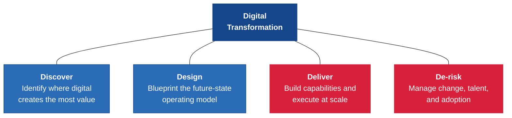
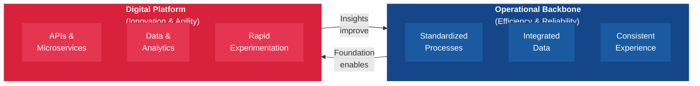
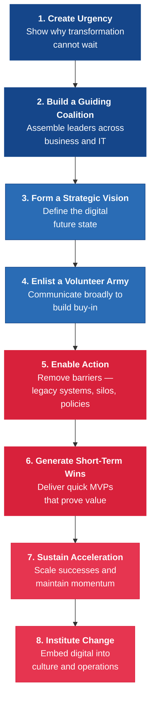
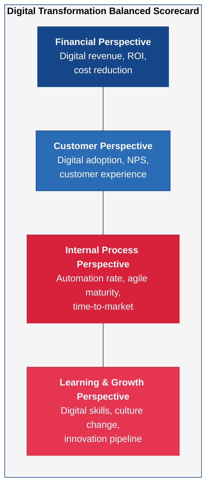

---
tags:
  - transformation
  - strategy
  - change-management
reading_time: 30
difficulty: Foundational
---

# Digital Transformation

## Overview

Digital transformation is the strategic, organization-wide process of leveraging digital technologies to fundamentally reinvent how a company operates, competes, and delivers value to customers. It is far more than an IT project. At its core, digital transformation requires rethinking business models, reimagining customer experiences, redesigning operating processes, and reshaping organizational culture — all enabled by technology but driven by business strategy. When Domino's Pizza declared itself "a technology company that happens to sell pizza," it captured the essence of what transformation means: technology becomes so central to the business that it redefines the organization's identity.

Understanding digital transformation is critical because the stakes are enormous and the failure rate is sobering. Research from McKinsey consistently shows that roughly 70% of large-scale transformation efforts fail to meet their stated objectives. The causes are overwhelmingly organizational, not technical — lack of clear vision, insufficient leadership commitment, cultural resistance to change, and talent gaps outweigh technology challenges in nearly every postmortem analysis. For MBA students preparing to lead organizations, this means that digital transformation is fundamentally a management challenge, not an engineering one.

This page provides a structured framework for understanding digital transformation: what it is and is not, how leading organizations approach it, how to assess organizational readiness, how to manage the human side of change, why transformations fail, and how to measure success. These concepts apply whether you are leading a transformation at a Fortune 500 company, advising on one as a consultant, or evaluating one as an investor.

!!! info "Why This Matters for MBA Students"
    As an MBA student — and future business leader — you will almost certainly encounter digital transformation in your career, regardless of your functional specialization. If you enter consulting, you will advise clients on transformation strategy and execution. If you join a large enterprise, you will participate in or lead transformation initiatives. If you pursue entrepreneurship, your venture may disrupt incumbents who are struggling to transform. If you work in finance or investing, you will evaluate companies based partly on their digital maturity and transformation trajectory. The concepts on this page equip you with the vocabulary, frameworks, and critical thinking skills to engage with digital transformation as a strategic leader — not just as a technology consumer. You do not need to write code or architect systems, but you absolutely need to understand why some organizations transform successfully while most do not, and what separates the two.

## Key Concepts

### What Is Digital Transformation?

To understand digital transformation, it is essential to distinguish it from two related but narrower concepts: **digitization** and **digitalization**.

**Digitization** is the conversion of analog information into digital format. Scanning a paper document into a PDF, converting a VHS tape into a digital video file, or entering handwritten records into a spreadsheet are all examples of digitization. This is a technical activity that changes the format of information but does not fundamentally change processes or business models.

**Digitalization** goes a step further — it uses digital technologies to change existing business processes. For example, replacing a manual purchase order approval process with an automated workflow in an ERP system is digitalization. The process still exists, but it is now faster, more consistent, and more traceable because it has been enabled by technology. Digitalization improves efficiency within the existing business model.

**Digital transformation** goes further still. It uses digital technologies to create **new** business models, revenue streams, customer experiences, and ways of operating that were not possible before. It is not about doing the same things better — it is about doing fundamentally different things.

| Concept | What Changes | Example | Scope of Impact |
|---------|-------------|---------|----------------|
| **Digitization** | Information format | Scanning paper records into PDFs | Data and documents |
| **Digitalization** | Business processes | Automating purchase approvals in ERP | Individual processes |
| **Digital Transformation** | Business model, culture, customer experience | Domino's reinventing itself as a technology-driven ordering platform | Entire organization |

The key insight is that digital transformation is **not** simply a bigger version of digitalization. It involves a qualitative shift in how the organization thinks about itself, its customers, and its competitive position. Technology is the enabler, but strategy, culture, and leadership are the drivers.

!!! question "Quick Check"
    - A retail chain is migrating all its paper inventory records into a cloud-based spreadsheet. Is this digitization, digitalization, or digital transformation? What would need to change for this initiative to qualify as transformation?
    - If technology is "the enabler, not the driver," what should actually drive a transformation initiative -- and how would you convince a technology-enthusiastic CEO of that distinction?

### Transformation Frameworks

Several established frameworks help organizations plan and execute digital transformation. Two of the most widely referenced in academic and consulting settings are McKinsey's "4Ds" and the MIT CISR framework.

#### McKinsey's "4Ds" of Digital Transformation

McKinsey & Company's framework organizes digital transformation into four interconnected domains — the "4Ds" — that must be addressed holistically for a transformation to succeed:

| Domain | Key Activities | Key Questions |
|--------|---------------|---------------|
| **Discover** | Map the value chain; identify digital opportunities; benchmark against competitors and digital natives; prioritize use cases by business impact | *Where does digital create the most value in our industry? Where are we falling behind?* |
| **Design** | Define the target operating model; architect the technology platform; redesign customer journeys; plan the organizational structure | *What should our organization look like in 3-5 years? What capabilities do we need?* |
| **Deliver** | Build cross-functional agile teams; develop MVPs; scale successful pilots; modernize legacy systems; implement cloud-first infrastructure | *Can we execute at speed? Are we building or buying the right capabilities?* |
| **De-risk** | Manage change and adoption; address talent gaps; handle cultural resistance; establish governance; track value realization | *Are our people ready? How do we maintain momentum when resistance emerges?* |

McKinsey's research emphasizes that organizations that address all four domains are **three times** more likely to achieve a successful transformation than those that focus narrowly on technology delivery (the "Deliver" domain) without adequate attention to discovery, design, and de-risking.

#### MIT CISR Digital Transformation Framework

MIT's Center for Information Systems Research (CISR) offers a complementary framework that focuses on two fundamental dimensions of transformation:

1. **Operational Backbone** — The integrated systems and processes that provide operational efficiency, reliable data, and consistent customer experiences. This typically involves ERP, CRM, SCM, and other enterprise applications that standardize core operations.

2. **Digital Platform** — The technology platform that enables rapid innovation, experimentation, and the development of new digital offerings. This includes APIs, data analytics capabilities, cloud infrastructure, and IoT connectivity.

MIT CISR identifies four pathways that organizations typically follow in their transformation journey:

| Pathway | Description | Example |
|---------|-------------|---------|
| **Silos & Spaghetti** | Fragmented systems, inconsistent data, localized optimization | A company with dozens of disconnected spreadsheets and legacy applications |
| **Standardized Technology** | Shared infrastructure but still siloed business processes | An organization that has migrated to a common ERP but departments still work independently |
| **Optimized Core** | Integrated, standardized processes built on a strong operational backbone | A company with end-to-end process visibility and consistent data across functions |
| **Digital Ready** | Both a strong operational backbone and a digital platform for innovation | An organization that can simultaneously run efficient core operations and launch new digital products rapidly |

The critical insight from MIT CISR is that organizations cannot leapfrog stages. Companies that attempt to build a digital platform on top of fragmented, unreliable core systems will fail — the "spaghetti" undermines the platform. Transformation requires building the operational backbone first, then layering the digital platform on top.

!!! question "Quick Check"
    - A company wants to launch an AI-powered customer recommendation engine, but its product data is scattered across six disconnected spreadsheets. Using the MIT CISR framework, why is this likely to fail, and what should the company prioritize instead?
    - McKinsey's research says organizations addressing all 4Ds are three times more likely to succeed. If you had to cut budget from one of the four domains, which would be most dangerous to underfund, and why?
    - How would you use the McKinsey 4Ds and MIT CISR frameworks together rather than choosing one? What does each framework illuminate that the other does not?

### Digital Maturity Models

Before embarking on a transformation, organizations need to honestly assess where they stand today. Digital maturity models provide structured frameworks for this self-assessment. Three widely used models come from Deloitte, MIT, and Gartner.

=== "Deloitte Digital Maturity Model"

    Deloitte's model evaluates digital maturity across five dimensions:

    | Dimension | What It Assesses |
    |-----------|-----------------|
    | **Customer** | How effectively the organization uses digital channels, personalization, and data to understand and serve customers |
    | **Strategy** | How clearly digital is embedded in the organization's strategic vision, governance, and investment priorities |
    | **Technology** | How modern, integrated, and scalable the technology infrastructure is |
    | **Operations** | How digitized, automated, and data-driven internal processes are |
    | **Organization & Culture** | How well the workforce, leadership, and culture support digital ways of working |

    Each dimension is scored from 1 (early stage) to 5 (leading edge), producing a radar chart that highlights strengths and gaps. Deloitte's research consistently finds that the **Organization & Culture** dimension is the most common lagging area — organizations tend to invest heavily in technology while underinvesting in people and culture.

=== "MIT Digital Maturity Model"

    Developed by MIT Sloan and Deloitte, this model plots organizations along two axes:

    - **Digital Intensity** — The level of investment in technology-enabled initiatives (automation, digital customer engagement, IoT, analytics)
    - **Transformation Management Intensity** — The strength of leadership, governance, and organizational capabilities to drive transformation

    This produces four quadrants:

    | Quadrant | Digital Intensity | Management Intensity | Outcome |
    |----------|------------------|---------------------|---------|
    | **Beginners** | Low | Low | Doing very little with digital; no clear strategy |
    | **Fashionistas** | High | Low | Adopting many digital technologies but without strategic coherence; lots of experimentation but little coordination |
    | **Conservatives** | Low | High | Strong governance and vision but cautious about technology investment; risk-averse |
    | **Digirati** | High | High | Strong digital capabilities matched by strong strategic vision and governance; these are the top performers |

    MIT's research shows that **Digirati** outperform other organizations by 26% in profitability. The key finding is that technology investment alone (the "Fashionista" pattern) does not drive superior performance — it must be paired with strong management and governance capabilities.

=== "Gartner Digital Business Maturity Model"

    Gartner's model defines five levels of digital business maturity:

    | Level | Stage | Characteristics |
    |-------|-------|----------------|
    | 1 | **Initial** | Digital is driven by individual departments; no enterprise-wide strategy; experiments are isolated |
    | 2 | **Developing** | Digital initiatives are coordinated across some functions; a digital strategy exists but is not fully funded or governed |
    | 3 | **Defined** | A formal digital strategy is in place with dedicated leadership (e.g., CDO); digital is integrated into business planning |
    | 4 | **Managed** | Digital is embedded in operations; data-driven decision-making is the norm; measurable business outcomes are tracked |
    | 5 | **Optimized** | Digital is the business; continuous innovation, predictive analytics, and autonomous systems drive competitive advantage |

    Gartner emphasizes that most organizations are at Level 2 or 3, and that reaching Level 4 or 5 requires not just technology investment but fundamental changes in governance, culture, and talent.

### Change Management

Technology is the **what** of digital transformation. Change management is the **how**. Even the most brilliant digital strategy will fail if the organization's people — from frontline employees to senior executives — resist, ignore, or misunderstand the changes required.

#### Kotter's 8 Steps Applied to Digital Transformation

John Kotter's classic change management framework, originally developed at Harvard Business School, provides a structured approach that maps directly to the challenges of digital transformation:

| Kotter Step | Digital Transformation Application | Common Mistake |
|-------------|-----------------------------------|----------------|
| **1. Create Urgency** | Present competitive data: "Our competitor launched a mobile app that captured 15% of our market in 6 months" | Relying on abstract technology arguments ("We need AI") instead of concrete business threats |
| **2. Build a Guiding Coalition** | Form a cross-functional team with senior leaders from business units, IT, HR, and finance — not just a technology task force | Delegating transformation leadership entirely to IT or hiring a CDO without giving them authority |
| **3. Form a Strategic Vision** | Articulate what the organization will look like after transformation — not what technology will be implemented | Writing a "digital strategy" that reads like a technology shopping list |
| **4. Enlist a Volunteer Army** | Communicate the vision broadly and authentically; identify and empower digital champions in every department | Top-down mandates without two-way dialogue; ignoring middle management |
| **5. Enable Action** | Remove structural barriers: retire legacy systems, break down organizational silos, update policies that prevent agile working | Launching transformation without addressing the legacy technology and processes that constrain it |
| **6. Generate Short-Term Wins** | Launch MVP projects that deliver visible results in 90 days — e.g., a customer self-service portal, an automated reporting dashboard | Pursuing only long-term "big bang" projects that take years to show results |
| **7. Sustain Acceleration** | Scale successful pilots across the organization; use momentum from wins to tackle harder problems | Declaring victory too early; losing executive attention after initial wins |
| **8. Institute Change** | Embed digital capabilities into performance management, hiring criteria, training programs, and organizational culture | Treating transformation as a one-time project rather than an ongoing capability |

#### Resistance to Change

Resistance is not irrational — it is a natural human response to uncertainty. In digital transformation, resistance typically manifests in several predictable patterns:

- **Fear of job loss** — Employees worry that automation and AI will eliminate their roles
- **Skill anxiety** — Workers feel they lack the digital skills to succeed in the new environment
- **Loss of status** — Middle managers whose authority rests on controlling information feel threatened by data transparency
- **Process attachment** — "We've always done it this way" reflects genuine expertise in current systems and skepticism about unproven alternatives
- **Change fatigue** — Organizations that have undergone multiple failed initiatives develop cynicism about the next one

Effective leaders address resistance by acknowledging these concerns openly, investing in reskilling programs, involving affected employees in the design process, and demonstrating early wins that make the benefits tangible.

#### Leadership's Role

Digital transformation requires leadership at multiple levels:

- **Board and CEO** — Set the strategic direction, allocate resources, signal the priority of transformation, and hold the organization accountable for results
- **CIO/CTO/CDO** — Translate business strategy into technology strategy, build digital platforms, modernize legacy systems, and develop IT talent
- **Business Unit Leaders** — Own the transformation outcomes within their domains, ensure adoption, and measure business impact
- **Middle Managers** — Often the most critical and most overlooked group — they translate executive vision into frontline reality and can either accelerate or block adoption

Research from MIT Sloan consistently shows that the single most important success factor in digital transformation is **senior leadership commitment** — not technology selection, not vendor choice, not budget size.

!!! question "Quick Check"
    - An organization is experiencing "change fatigue" from three failed IT initiatives in the past five years. Using Kotter's framework, which early steps would you emphasize differently this time to overcome the accumulated cynicism?
    - Middle managers are often called the most critical and most overlooked group in transformation. Why might a middle manager actively resist a transformation that the CEO fully supports, and what would you do about it?

### Why Transformations Fail

McKinsey's research, spanning thousands of transformation initiatives across industries, reveals a stark reality: approximately **70% of digital transformations fail** to achieve their stated objectives. BCG's research puts the failure rate even higher at **80%** for transformations that fall short of their targets. Understanding why transformations fail is at least as important as understanding how to plan them.

The most common causes of failure are organizational, not technical:

| Cause of Failure | Frequency | Description |
|-----------------|-----------|-------------|
| **Lack of clear vision** | Very common | The transformation lacks a compelling "from-to" narrative; leadership cannot articulate what success looks like |
| **Culture resistance** | Very common | The organization's culture resists the behaviors digital transformation requires — experimentation, data-driven decisions, cross-functional collaboration |
| **Insufficient leadership commitment** | Common | Senior leaders sponsor the initiative but do not visibly champion it, allocate sustained resources, or hold people accountable |
| **Talent gaps** | Common | The organization lacks the digital skills it needs (data science, product management, UX design, agile development) and cannot attract or develop them fast enough |
| **Technology-first approach** | Common | The transformation starts with technology selection ("We need AI/blockchain/cloud") rather than business problem identification |
| **Lack of cross-functional collaboration** | Common | Transformation is siloed within IT or a single business unit rather than spanning the organization |
| **Underestimating complexity** | Moderate | Leaders underestimate how deeply legacy systems, processes, and organizational structures are entangled |
| **No short-term wins** | Moderate | The transformation plan is a multi-year roadmap with no visible results for 12-18 months, causing stakeholders to lose confidence |

!!! example "The Technology-First Trap"
    A common pattern in failed transformations is what practitioners call the "technology-first trap." An executive reads about AI, blockchain, or some other emerging technology and declares, "We need to implement this." Teams scramble to find use cases for the technology rather than starting with business problems that technology might solve. The result is expensive proofs of concept that demonstrate technical feasibility but deliver no business value — and the initiative quietly dies when the executive sponsor moves on.

    Successful transformations invert this pattern: they start with a business problem or opportunity ("Our customer churn rate is 25% and competitors are offering personalized digital experiences"), then identify the technologies that could address it, then build the capabilities to deliver.

### Measuring Success

Digital transformation cannot be managed if it is not measured. Yet many organizations struggle to define meaningful KPIs for their transformation efforts. A balanced approach combines financial, operational, customer, and capability metrics.

#### Digital Transformation KPIs

=== "Financial Metrics"

    | KPI | What It Measures | Example Target |
    |-----|-----------------|----------------|
    | Revenue from digital channels | Growth of digital-native revenue streams | 30% of total revenue within 3 years |
    | Digital ROI | Return on digital investments vs. traditional investments | ROI exceeding cost of capital |
    | Cost-to-serve reduction | Efficiency gains from process automation | 20% reduction in operational costs |
    | Time-to-market | Speed of launching new digital products or features | 50% reduction from legacy development timelines |

=== "Customer Metrics"

    | KPI | What It Measures | Example Target |
    |-----|-----------------|----------------|
    | Digital adoption rate | Percentage of customers using digital channels | 60% of transactions via digital channels |
    | Net Promoter Score (digital) | Customer satisfaction with digital experiences | NPS of 50+ for digital channels |
    | Customer acquisition cost | Cost efficiency of digital vs. traditional acquisition | 30% lower acquisition cost via digital |
    | Customer lifetime value | Impact of digital engagement on long-term customer value | 15% increase in CLV for digitally engaged customers |

=== "Operational Metrics"

    | KPI | What It Measures | Example Target |
    |-----|-----------------|----------------|
    | Process automation rate | Percentage of core processes that are digitized and automated | 70% of eligible processes automated |
    | Data-driven decision rate | Percentage of key decisions supported by analytics | 80% of strategic decisions data-informed |
    | System uptime / reliability | Availability of digital platforms | 99.9% uptime for customer-facing systems |
    | Deployment frequency | Speed and frequency of technology releases | Weekly releases vs. quarterly releases |

=== "Capability Metrics"

    | KPI | What It Measures | Example Target |
    |-----|-----------------|----------------|
    | Digital talent ratio | Percentage of workforce with digital skills | 25% of workforce digitally proficient |
    | Employee digital engagement | Adoption of digital tools and platforms by employees | 90% active usage of collaboration platforms |
    | Agile team coverage | Percentage of strategic initiatives run using agile methods | 60% of initiatives using agile delivery |
    | Innovation pipeline | Number of digital experiments and pilots in progress | 10+ active experiments per quarter |

#### Balanced Scorecard Approach

A balanced scorecard adapted for digital transformation ensures that leadership monitors transformation health across multiple dimensions rather than fixating on a single metric. The four perspectives map naturally:

The power of the balanced scorecard is that it prevents a common failure mode: celebrating financial results from cost-cutting while ignoring deteriorating customer experience, or celebrating technology deployments while ignoring low adoption rates. All four perspectives must show progress for a transformation to be genuinely succeeding.

## Frameworks & Models

### Comparing Transformation Approaches

=== "McKinsey 4Ds"

    **Best For**: Large enterprises needing a comprehensive, structured approach to transformation planning and execution.

    **Strengths**: Holistic coverage of strategy, execution, and risk; well-supported by McKinsey research and case data; emphasis on de-risking addresses common failure modes.

    **Limitations**: Primarily a consulting framework; less prescriptive about technology architecture; may feel abstract without McKinsey's proprietary tools and benchmarks.

    **When to Use**: When the organization needs to develop a transformation strategy from scratch, particularly when multiple business units and geographies are involved.

=== "MIT CISR"

    **Best For**: Organizations that need to understand the sequencing of transformation — what to build first and how capabilities layer on each other.

    **Strengths**: Strong academic research base; clear articulation of the operational backbone vs. digital platform distinction; empirical evidence linking maturity levels to financial performance.

    **Limitations**: More descriptive than prescriptive; does not provide detailed implementation guidance; may understate the importance of organizational change management.

    **When to Use**: When the organization needs to diagnose its current state and understand the logical progression of transformation stages — particularly useful for CIOs building a business case.

=== "Kotter's 8 Steps"

    **Best For**: Addressing the human and organizational dimensions of transformation — change management, communication, and adoption.

    **Strengths**: Proven framework for managing organizational change; applicable beyond digital transformation; strong focus on leadership and communication.

    **Limitations**: Not specific to digital transformation; does not address technology architecture or digital capability building; may oversimplify the iterative nature of transformation.

    **When to Use**: When the primary risk to transformation is organizational resistance, change fatigue, or leadership alignment — often used in combination with a technology-focused framework.

### Maturity Assessment Summary

The following table provides a quick reference for comparing the three major digital maturity models:

| Dimension | Deloitte | MIT Sloan | Gartner |
|-----------|---------|-----------|---------|
| **Assessment Focus** | Five dimensions (Customer, Strategy, Technology, Operations, Culture) | Two axes (Digital Intensity, Management Intensity) | Five maturity levels |
| **Output** | Radar chart across dimensions | 2x2 quadrant classification | Single maturity level (1-5) |
| **Key Insight** | Culture is usually the weakest dimension | Technology without management discipline destroys value | Most organizations stall at Level 2-3 |
| **Best For** | Detailed gap analysis by dimension | Strategic positioning and benchmarking | Simple executive communication of maturity stage |
| **Research Base** | Consulting engagements and surveys | Academic research at MIT Sloan | Analyst research and client advisory |
| **Publicly Available** | Partially (surveys and reports) | Research papers and books | Analyst reports (subscription) |

## Real-World Applications

### Example 1: Domino's Pizza — A Transformation Success Story

Domino's is one of the most cited examples of successful digital transformation, and for good reason. In 2008, the company was struggling: its stock price had fallen below $3, customer satisfaction was among the lowest in the industry, and the brand was widely mocked. By 2025, Domino's stock price had risen above $400, and the company had become one of the most successful restaurant chains in the world.

**What Domino's did:**

- **Created urgency** by publicly acknowledging its problems — CEO Patrick Doyle admitted on camera that the pizza was not good and committed to fixing it. This candor created organizational alignment around the need for change.
- **Invested heavily in technology** — Domino's built an in-house technology team of over 400 engineers and transformed ordering from phone-based to digital-first. By 2020, over 75% of orders came through digital channels.
- **Reimagined the customer experience** — The company launched ordering via mobile app, smart TV, voice assistants, smartwatches, and even Twitter. The "Domino's Tracker" gave customers real-time visibility into their order status.
- **Used data to drive decisions** — Every digital interaction generated data that informed menu decisions, store operations, delivery optimization, and marketing.
- **Changed the organizational identity** — Domino's began describing itself as "a technology company that happens to sell pizza," signaling that digital was not a side project but the core of the business.

**Why it worked:** Domino's succeeded because the transformation was led by the CEO, was rooted in solving a real business problem (declining sales and brand perception), invested in building internal digital capabilities rather than outsourcing them, and delivered visible results quickly (the "Pizza Turnaround" campaign showed customers the company was changing). It addressed all four of McKinsey's 4Ds.

### Example 2: GE Digital — A Cautionary Tale

General Electric's digital transformation, launched with great ambition under CEO Jeff Immelt in the mid-2010s, is one of the most instructive failure cases in business history. GE invested over $4 billion in building GE Digital, a new business unit that aimed to become the leading industrial IoT platform provider through its Predix platform.

**What went wrong:**

- **Overambition without focus** — GE tried to simultaneously transform its own operations, build a software platform, and sell that platform to external customers. Each of these is a massive undertaking; doing all three at once was overwhelming.
- **Technology-first thinking** — The Predix platform was an engineering-led initiative that prioritized technical sophistication over customer needs. GE built capabilities that customers had not asked for and did not adopt.
- **Cultural mismatch** — GE's industrial culture, built on Six Sigma and long product development cycles, clashed with the agile, iterative approach required for software development. Engineers accustomed to shipping turbines could not easily adapt to shipping code.
- **Leadership instability** — Frequent leadership changes at GE Digital undermined continuity. The unit had multiple leaders in just a few years, each with different priorities.
- **Financial pressure** — As GE's core industrial businesses weakened, the company could not sustain the massive investment digital transformation required. GE Digital was eventually downsized and restructured.

**The lesson:** GE's failure illustrates several common pitfalls simultaneously — technology-first thinking, underestimating cultural barriers, overscoping the initiative, and losing leadership focus. For MBA students, the critical takeaway is that even a $250 billion company with enormous resources can fail at transformation if the strategic, organizational, and cultural dimensions are neglected.

### Example 3: DBS Bank — Transforming a Traditional Bank in Asia

DBS Bank, headquartered in Singapore, provides a compelling example of digital transformation success in a heavily regulated, traditional industry. Under CEO Piyush Gupta, DBS transformed from a conventional bank into one that was named "World's Best Digital Bank" by Euromoney multiple times.

**What DBS did:**

- **Adopted a startup mentality** — DBS adopted the mantra "Live more, Bank less," signaling that the bank's purpose was to simplify customers' lives through seamless digital experiences, not to sell banking products.
- **Built a technology platform** — DBS invested in cloud infrastructure, APIs, and microservices architecture, enabling it to deploy new features rapidly. The bank moved from quarterly releases to deploying code thousands of times per year.
- **Redesigned the customer journey** — Rather than digitizing existing processes, DBS mapped the entire customer journey and redesigned it from the customer's perspective. For example, applying for a mortgage was reduced from weeks to minutes.
- **Invested in data and AI** — DBS built a centralized data platform and deployed AI and ML across operations — from credit scoring to fraud detection to personalized product recommendations.
- **Changed the culture** — DBS ran extensive internal programs including hackathons, digital academies, and a "GANDALF" initiative (a playful acronym for the tech giants it aspired to emulate: Google, Amazon, Netflix, DBS, Apple, LinkedIn, Facebook) to shift the organizational mindset.

**Why it worked:** DBS succeeded because the transformation was CEO-led, customer-journey-focused (not technology-focused), sequenced properly (operational backbone first, then digital platform), invested in culture change alongside technology, and measured results rigorously. Using MIT CISR's framework, DBS methodically built its operational backbone before layering on digital innovation capabilities.

## Common Pitfalls

!!! warning "Starting with Technology Instead of Strategy"
    The most pervasive pitfall in digital transformation is allowing technology selection to drive strategy rather than the reverse. When an executive declares "We need an AI strategy" or "We need to move to the cloud," the implicit assumption is that technology adoption is the goal. It is not. The goal is solving a business problem or seizing a market opportunity. Technology is a means to that end. Successful transformations start with questions like "How can we reduce customer churn by 30%?" or "How can we enter new markets faster?" — and then identify the technologies that enable those outcomes.

!!! warning "Underinvesting in Change Management"
    Organizations routinely allocate 90% or more of their transformation budget to technology and 10% or less to change management — training, communication, process redesign, and organizational restructuring. This ratio should be much closer to 60/40 or even 50/50 for transformations that require significant behavioral change. The most elegant technology solution is worthless if employees do not adopt it, customers do not use it, or managers do not trust its outputs. Budget for change management as aggressively as you budget for technology.

!!! warning "Pursuing Transformation Without Fixing the Foundation"
    MIT CISR's research is unambiguous on this point: organizations that attempt to build digital innovation capabilities on top of fragmented, unreliable core systems will fail. If your ERP data is inconsistent, your processes are not standardized, and your departments operate as silos, adding a digital platform on top will simply create a faster way to make bad decisions. Fix the operational backbone first. This is unglamorous work — data cleansing, process standardization, system integration — but it is the foundation that everything else rests on.

!!! warning "Declaring Victory Too Early"
    A successful pilot is not a successful transformation. Organizations frequently celebrate the launch of a new app, the completion of a cloud migration, or the deployment of an analytics dashboard as evidence that the transformation is complete. It is not. Transformation is complete when digital capabilities are embedded in the organization's culture, operations, and competitive position — when digital is "how we work" rather than a project that IT is running. This typically takes 3-5 years of sustained effort, not a 12-month technology implementation.

## Discussion Questions

1. **Strategic Prioritization**: You are the newly appointed CDO of a mid-size insurance company. The CEO has given you a mandate to "make us digital" but has not defined what that means. Using the maturity models discussed in this chapter, how would you assess the company's current state? How would you prioritize your first 90 days? What would you *not* do, and why?

2. **Learning from Failure**: Compare the Domino's and GE Digital cases. Both companies invested billions in digital transformation, yet one succeeded spectacularly and the other failed. Using Kotter's 8 steps and McKinsey's 4Ds framework, identify the specific steps where GE went wrong and Domino's got it right. What role did leadership, culture, and strategy play in each outcome?

3. **Transformation vs. Optimization**: A board member argues that your company does not need "digital transformation" — it just needs to improve its existing processes with better technology. Using the distinction between digitization, digitalization, and digital transformation, how would you respond? Under what circumstances might the board member be right, and under what circumstances would incremental improvement be insufficient?

## Key Takeaways

- **Digital transformation is fundamentally different from digitization and digitalization.** Digitization changes information format; digitalization improves existing processes; transformation reinvents business models, customer experiences, and organizational culture.
- **Approximately 70% of digital transformations fail**, and the primary causes are organizational (lack of vision, cultural resistance, leadership gaps, talent shortages), not technical.
- **Frameworks provide structure, not guarantees.** McKinsey's 4Ds, MIT CISR's backbone-platform model, and Kotter's 8 steps each illuminate different dimensions of transformation — strategy, technology sequencing, and change management, respectively. Effective leaders draw on all three.
- **Digital maturity assessment is an essential starting point.** Whether using Deloitte's five-dimension model, MIT's 2x2 quadrant, or Gartner's five-level scale, honestly diagnosing the organization's current state prevents overambition and misallocation of resources.
- **Change management is not optional — it is half the work.** Resistance to change is natural, predictable, and manageable, but only if it is explicitly planned for and resourced. Budget for change management as aggressively as you budget for technology.
- **Sequence matters.** Build the operational backbone (standardized processes, integrated data) before the digital platform (APIs, analytics, experimentation). Attempting to innovate on a fragmented foundation is a recipe for failure.
- **Measure what matters across multiple dimensions.** Use a balanced scorecard approach that tracks financial, customer, operational, and capability metrics — not just technology deployment milestones.
- **Leadership commitment is the single most important success factor.** Transformation must be visibly led by the CEO and senior team, not delegated to IT or a CDO operating without authority.
- **Transformation is a journey, not a project.** Successful organizations treat digital transformation as an ongoing capability — continuously evolving, adapting, and improving — rather than a one-time initiative with a defined end date.

## Further Reading

- **Westerman, George, Didier Bonnet, and Andrew McAfee.** *Leading Digital: Turning Technology into Business Transformation.* Harvard Business Review Press, 2014. The foundational text on the MIT digital maturity framework and the concept of "Digirati."
- **Rogers, David L.** *The Digital Transformation Playbook: Rethink Your Business for the Digital Age.* Columbia Business School Publishing, 2016. A strategy-focused guide that addresses digital transformation through five domains of strategy.
- **McKinsey & Company.** "Unlocking Success in Digital Transformations." McKinsey Global Survey, 2018. The primary source for McKinsey's transformation success/failure data and the factors that differentiate successful transformations.
- **Ross, Jeanne W., Cynthia M. Beath, and Martin Mocker.** *Designed for Digital: How to Architect Your Business for Sustained Success.* MIT Press, 2019. The MIT CISR framework for building operational backbones and digital platforms.
- **Kotter, John P.** *Leading Change.* Harvard Business Review Press, 2012 (revised edition). The original and most widely cited change management framework, applicable well beyond digital transformation.
- **Kane, Gerald C., et al.** *The Technology Fallacy: How People Are the Real Key to Digital Transformation.* MIT Press, 2019. Research-based evidence that digital transformation success depends more on people and culture than on technology selection.
- **Iansiti, Marco, and Karim R. Lakhani.** *Competing in the Age of AI: Strategy and Leadership When Algorithms and Networks Run the World.* Harvard Business Review Press, 2020. How AI-driven operating models represent the next frontier of digital transformation.
- See also: [AI & Emerging Technology](ai-emerging-tech.md) for the technology enablers of transformation, [Business Process Management](bpm.md) for process-level transformation, [IT-Business Alignment](../governance/it-business-alignment.md) for governance structures that support transformation, and [Enterprise Architecture](../technology/enterprise-architecture.md) for the architectural foundation that enables large-scale digital transformation.
