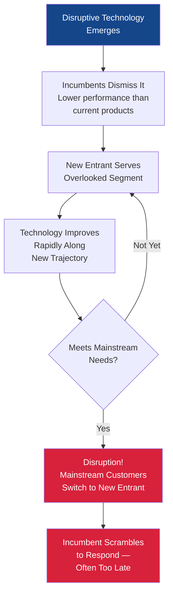
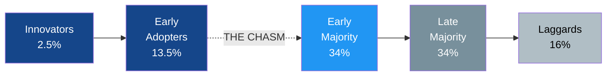

# Innovation Management & Technology Strategy

## Overview

Innovation is the engine of competitive advantage — yet most large organizations struggle to innovate consistently. This chapter examines how firms identify, evaluate, adopt, and scale new technologies, why established companies often fail to respond to disruptive change, and what management structures help organizations innovate systematically rather than by accident.

!!! info "Why This Matters for MBA Students"
    As a manager, you will regularly face decisions about whether to invest in emerging technologies, how to structure teams for innovation, and when to disrupt your own business model before a competitor does. Understanding innovation frameworks helps you move beyond gut instinct to disciplined analysis of technology opportunities and threats.

---

## Key Concepts

### Types of Innovation

Not all innovation is created equal. Understanding the different types helps managers allocate resources and set expectations appropriately.

| Type | Definition | Example | Risk Profile |
|------|-----------|---------|-------------|
| **Incremental** | Small improvements to existing products or processes | Annual smartphone camera upgrades | Low risk, predictable returns |
| **Sustaining** | Significant improvements along existing performance dimensions | Faster processors, higher-resolution displays | Moderate risk, serves existing customers |
| **Disruptive** | New technology that initially underperforms but serves overlooked markets | Digital cameras replacing film, streaming replacing DVDs | High risk, creates new markets |
| **Radical** | Breakthrough technology that redefines an industry | The internet, CRISPR gene editing, generative AI | Very high risk, transformative potential |
| **Architectural** | Reconfiguring existing components in new ways | Moving from mainframe to client-server computing | Moderate risk, challenges organizational structures |

!!! example "The Disruption Pattern"
    Clayton Christensen's research showed that disruptive technologies often start as **inferior** products that established customers reject. Digital cameras initially produced terrible images compared to film. But they improved rapidly, eventually surpassing film quality while offering convenience and zero marginal cost per photo. Kodak, the dominant film company, actually invented the digital camera in 1975 — but chose not to pursue it because it threatened their profitable film business.

### The Innovator's Dilemma

Christensen's "Innovator's Dilemma" (1997) describes why well-managed companies that listen to their best customers and invest in the highest-return opportunities can still lose their market position:

1. **Disruptive technologies initially underperform** on the metrics that mainstream customers value
2. **Established firms rationally focus** on their most profitable customers and highest-margin products
3. **New entrants target overlooked segments** — customers who are over-served or non-consumers
4. **The disruptive technology improves** until it meets mainstream needs — often at lower cost
5. **By the time incumbents respond**, the new entrant has scale, experience, and customer loyalty

!!! tip "Management Lesson"
    The innovator's dilemma is not caused by bad management — it is caused by **good** management practices (listen to customers, invest in high returns, focus on core competencies) applied in environments undergoing disruptive change. Overcoming it requires separate organizational structures, different metrics, and tolerance for initially low returns.

!!! question "Quick Check"
    - Kodak invented the digital camera but chose not to pursue it. If you were advising Kodak's board in 1985, what organizational structure would you propose to develop digital photography without threatening the profitable film business?
    - The innovator's dilemma argues that listening to your best customers can lead you astray. Under what specific conditions is this true, and when is listening to existing customers still the right strategy?

### Technology Adoption Lifecycle

Everett Rogers' **Diffusion of Innovations** (1962) describes how new technologies spread through populations in a predictable S-curve pattern, with five adopter categories:

| Category | % of Market | Characteristics | What Motivates Adoption |
|----------|------------|-----------------|------------------------|
| **Innovators** | 2.5% | Risk-seeking, technically adventurous, willing to tolerate rough edges | Novelty and experimentation |
| **Early Adopters** | 13.5% | Visionaries who see strategic advantage; opinion leaders | Competitive advantage |
| **Early Majority** | 34% | Pragmatic; adopt when proven but before mainstream | Proven ROI with references |
| **Late Majority** | 34% | Conservative; adopt due to peer pressure or necessity | Standards compliance, fear of being left behind |
| **Laggards** | 16% | Skeptical; adopt only when forced or when no alternatives remain | No choice remaining |

#### Crossing the Chasm

Geoffrey Moore's **Crossing the Chasm** (1991) identified a critical gap — the "chasm" — between early adopters and the early majority. Many promising technologies fail at this stage because:

- **Early adopters** buy a *vision* — they tolerate incomplete products
- **Early majority** buy a *solution* — they demand complete, reliable products with references
- The transition requires a fundamentally different marketing, sales, and product approach

!!! example "Crossing the Chasm in Practice"
    Cloud computing crossed the chasm around 2010-2013. Early adopters (startups like Netflix, Airbnb) had been using AWS since 2006. But enterprise adoption accelerated only when AWS, Azure, and GCP offered compliance certifications, SLAs, hybrid deployment options, and enterprise support — addressing the early majority's need for reliability and risk management.

!!! question "Quick Check"
    - A startup has 50 enthusiastic early-adopter customers but struggles to win enterprise deals. Using Moore's "chasm" concept, what fundamental shift in product strategy, messaging, or sales approach is needed to reach the early majority?
    - Where would you place enterprise generative AI (e.g., Copilot, enterprise ChatGPT) on the adoption lifecycle today? What evidence would you look for to determine whether it has crossed the chasm?

---

## Frameworks

### Design Thinking

Design thinking is a human-centered approach to innovation that starts with understanding user needs rather than starting with technology capabilities.

**The Five Stages (Stanford d.school model):**

| Stage | Purpose | Key Activities | Output |
|-------|---------|----------------|--------|
| **1. Empathize** | Understand the user's world | Interviews, observation, journey mapping | Deep user insights |
| **2. Define** | Frame the right problem | Synthesize findings, create "How Might We" statements | Clear problem statement |
| **3. Ideate** | Generate many possible solutions | Brainstorming, sketching, analogies | Broad set of ideas |
| **4. Prototype** | Build quick, low-fidelity versions | Paper prototypes, wireframes, mockups | Testable artifacts |
| **5. Test** | Learn from user feedback | User testing, A/B experiments, iteration | Validated (or invalidated) concepts |

!!! tip "Design Thinking for IT Projects"
    Design thinking is especially valuable for IT projects because technology teams often default to building what is technically elegant rather than what users actually need. Starting with empathy — observing how people actually work, not how the process documentation says they work — prevents the common failure of building sophisticated systems that nobody uses.

!!! question "Quick Check"
    - An IT team builds a new expense reporting system based on the process documentation, but employees refuse to use it. Which stage of design thinking did the team likely skip, and how would applying that stage have changed the outcome?
    - Compare design thinking's "Empathize" stage with the BPM concept of process mining. Both aim to understand how work actually gets done. When would you use each approach, and what does each reveal that the other might miss?

### The Three Horizons Model

McKinsey's Three Horizons framework helps organizations balance investment across different time frames:

| Horizon | Time Frame | Focus | % of Innovation Budget | Example |
|---------|-----------|-------|----------------------|---------|
| **H1: Maintain & Extend** | 0-2 years | Improve core business | 70% | Upgrading ERP, automating existing processes |
| **H2: Build Emerging** | 2-5 years | Develop new capabilities | 20% | Building AI/ML capabilities, entering adjacent markets |
| **H3: Create New** | 5-10 years | Explore transformative opportunities | 10% | Quantum computing research, novel business models |

!!! warning "Common Pitfall"
    Many organizations invest nearly 100% in Horizon 1 — maintaining current operations — leaving no budget for future growth. This leads to "innovation theater" where companies talk about innovation but fund only incremental improvement. The 70/20/10 split is a guideline, not a rule, but the principle of deliberate allocation across time horizons is critical.

### Innovation Ambition Matrix

A complementary framework that maps innovation efforts across two dimensions:

- **Where to play**: Core markets → Adjacent markets → New markets
- **How to win**: Existing products → Incremental improvements → New offerings

This produces a 3x3 matrix that helps portfolio-balance innovation investments.

### Technology Readiness Levels (TRLs)

Originally developed by NASA and now widely used, TRLs provide a standardized way to assess technology maturity:

| Level | Description | Business Implication |
|-------|------------|---------------------|
| TRL 1-3 | Basic research → Proof of concept | Too early for business investment; watch and learn |
| TRL 4-6 | Lab validation → Prototype demonstration | Pilot projects appropriate; limited deployment |
| TRL 7-8 | System demonstration → Qualification | Ready for controlled production use |
| TRL 9 | Proven in operational environment | Ready for full enterprise deployment |

---

## Corporate Innovation Structures

How an organization structures its innovation activities significantly affects outcomes. Common models include:

### Internal R&D Labs

**Examples:** Google X (now X Development), Microsoft Research, IBM Research

| Strengths | Weaknesses |
|-----------|-----------|
| Deep expertise and sustained research | Can become disconnected from market needs |
| Attracts top talent | Difficult to commercialize discoveries |
| Produces foundational intellectual property | Expensive to maintain |

### Innovation Labs and Incubators

**Examples:** Capital One Labs, Walmart Labs, Barclays Rise

| Strengths | Weaknesses |
|-----------|-----------|
| Fast experimentation in protected environment | "Innovation theater" risk — demos that never deploy |
| Attracts entrepreneurial talent | Integration with core business is hard |
| Visible commitment to innovation | Can drain resources without measurable returns |

### Corporate Venture Capital (CVC)

**Examples:** Google Ventures, Intel Capital, Salesforce Ventures

| Strengths | Weaknesses |
|-----------|-----------|
| Window into startup ecosystem and emerging technologies | Financial returns often secondary to strategic goals |
| Potential acquisition pipeline | Startups may distrust corporate investors |
| Relatively low cost to explore many bets | Limited influence on portfolio companies |

### Open Innovation and Ecosystem Partnerships

**Examples:** Procter & Gamble Connect+Develop, Linux Foundation, industry consortia

| Strengths | Weaknesses |
|-----------|-----------|
| Access to external ideas and capabilities | IP management complexity |
| Shared risk and investment | Coordination costs |
| Faster time to market | Less control over direction |

### Skunkworks and Autonomous Teams

**Examples:** Lockheed Martin's original Skunk Works, Amazon's two-pizza teams

| Strengths | Weaknesses |
|-----------|-----------|
| High autonomy enables speed | Can create organizational tension |
| Freed from bureaucratic constraints | Risk of duplication and disconnection |
| Attracts self-motivated innovators | Scaling successful projects back into the organization is challenging |

!!! tip "Choosing the Right Structure"
    Most successful innovating organizations use a **portfolio approach** — combining several structures for different types of innovation. R&D labs for Horizon 3, innovation labs for Horizon 2 experimentation, and cross-functional teams for Horizon 1 continuous improvement. The key is ensuring each structure has clear mandate, funding, metrics, and a pathway to scale successful innovations.

---

## Real-World Applications

### Case Study: Netflix — From DVD Disruption to Streaming Dominance

Netflix illustrates both sides of the innovator's dilemma:

1. **As disruptor (2000s):** Netflix's DVD-by-mail service disrupted Blockbuster by eliminating late fees and offering unlimited selection — serving an overlooked segment of movie renters frustrated by the store experience
2. **As potential victim (2007-2012):** Netflix recognized that streaming would disrupt its own DVD business and made the painful decision to invest heavily in streaming while DVD was still highly profitable
3. **As platform (2013-present):** Netflix invested in original content production, transforming from a distribution company to a content creator — a second major strategic pivot
4. **Key lesson:** Netflix cannibalized its own profitable business (DVDs) before competitors could. This required vision, courage, and organizational structures that allowed streaming to grow independently of the DVD division

### Case Study: Kodak vs. Fujifilm

Two companies with the same core business (film photography) faced the same disruption (digital photography) with dramatically different outcomes:

| Dimension | Kodak | Fujifilm |
|-----------|-------|----------|
| **Core business** | 70% of global film market | Strong #2 in film market |
| **R&D investment** | Invented digital camera (1975) | Invested in digital early |
| **Diversification** | Minimal — focused on film profits | Aggressively diversified: cosmetics, pharmaceuticals, optical films |
| **Response to disruption** | Delayed digital pivot; filed bankruptcy (2012) | Transformed into diversified technology company; thriving today |
| **Key lesson** | Knowing about disruption ≠ responding to it | Diversification and willingness to cannibalize core business |

### How Managers Evaluate Emerging Technologies

A practical framework for assessing whether to invest in a new technology:

| Question | What to Assess | Tools |
|----------|---------------|-------|
| **Is it real?** | Technical feasibility, current maturity (TRL) | Gartner Hype Cycle, analyst reports, proof of concept |
| **Can we win?** | Competitive advantage, organizational capabilities | Core competency analysis, build-buy-partner decision |
| **Is it worth it?** | Business case, risk-adjusted returns | NPV analysis, real options valuation, scenario planning |
| **When to act?** | Timing — too early is as dangerous as too late | Technology adoption lifecycle positioning, competitor moves |
| **How to start?** | Pilot scope, success metrics, kill criteria | Lean startup methodology, minimum viable product (MVP) |

---

## Common Pitfalls

!!! danger "Innovation Anti-Patterns"

    **1. Innovation Theater** — Running hackathons, building innovation labs, and hiring Chief Innovation Officers without committing real resources or changing incentive structures. Innovation requires sustained investment, not performative gestures.

    **2. The Sunk Cost Trap** — Continuing to invest in a failing technology or project because of money already spent. Establish "kill criteria" upfront and enforce them ruthlessly.

    **3. Premature Scaling** — Scaling a technology before product-market fit is validated. The graveyard of enterprise IT is full of massive rollouts that should have been extended pilots.

    **4. Not Invented Here Syndrome** — Refusing to adopt external innovations because internal teams believe they can build something better. Open innovation and partnerships are often faster and cheaper.

    **5. Confusing Invention with Innovation** — Invention creates something new; innovation creates *value* from something new. Kodak invented the digital camera but failed to innovate with it.

    **6. Ignoring Organizational Change** — Technology adoption is 20% technology and 80% change management. The best technology fails if people don't adopt it (see the [DeLone & McLean IS Success Model](../reference/kogod-faculty-research.md#the-delone-mclean-is-success-model)).

---

## Discussion Questions

1. **The Innovator's Response:** Your company is the market leader in traditional data center hardware. Cloud computing is growing rapidly but currently serves mostly small companies. How would you respond? What organizational structures would you create?

2. **Crossing the Chasm:** You are the CIO evaluating generative AI for your enterprise. Using Moore's framework, where is enterprise generative AI on the adoption lifecycle as of 2025? What evidence supports your assessment?

3. **Three Horizons Applied:** Map your organization's (or a company you admire) technology investments across the Three Horizons. Is the allocation balanced? What Horizon 2 and 3 investments are missing?

4. **Design Thinking in IT:** A major ERP implementation is experiencing low user adoption despite being technically sound. How would you apply design thinking principles to diagnose and address the problem?

5. **Build, Buy, or Partner:** Your company needs AI-powered customer service capabilities. Using the technology evaluation framework, analyze the build (develop in-house), buy (purchase vendor solution), and partner (strategic alliance) options. What factors drive your recommendation?

---

## Key Takeaways

- **Innovation is not random** — it follows patterns that managers can learn to recognize and exploit, including Christensen's disruption model and Rogers' adoption lifecycle
- **The innovator's dilemma is real** — well-managed companies fail not because of bad management but because good management practices optimize for current customers at the expense of future markets
- **"Crossing the chasm"** between early adopters and mainstream adoption is the most dangerous phase — requiring a shift from selling vision to selling proven solutions
- **Design thinking** puts user needs before technical capabilities, preventing the common failure of building sophisticated systems that nobody uses
- **Innovation requires portfolio thinking** — balance investments across the Three Horizons (maintain, build, create) rather than over-investing in short-term improvements
- **Structure follows strategy** — choose innovation structures (labs, CVC, skunkworks, open innovation) that match your innovation goals and organizational culture
- **Timing matters as much as technology** — being too early is often as costly as being too late; use frameworks like TRLs and the adoption lifecycle to calibrate timing

---

## Related Topics

- [Digital Transformation](digital-transformation.md) — How organizations execute technology-driven business transformation
- [AI & Emerging Technologies](ai-emerging-tech.md) — Current frontier technologies reshaping industries
- [Platform Economics & Network Effects](../governance/platform-economics.md) — Economic dynamics of technology platforms
- [C-Suite Technology Roles](../governance/c-suite-roles.md) — How technology leadership is structured in organizations
- [Business Process Management](bpm.md) — Process improvement as a foundation for innovation
- [Kogod Faculty Research](../reference/kogod-faculty-research.md) — The DeLone & McLean model for evaluating technology success

---

## Further Reading

- **Books:**
    - Christensen, C. M. (1997). *The Innovator's Dilemma: When New Technologies Cause Great Firms to Fail*. Harvard Business Review Press.
    - Moore, G. A. (1991). *Crossing the Chasm: Marketing and Selling High-Tech Products to Mainstream Customers*. Harper Business.
    - Rogers, E. M. (1962). *Diffusion of Innovations*. Free Press.
    - Ries, E. (2011). *The Lean Startup*. Crown Business.
    - Brown, T. (2009). *Change by Design: How Design Thinking Transforms Organizations*. Harper Business.
    - O'Reilly, C. A., & Tushman, M. L. (2016). *Lead and Disrupt: How to Solve the Innovator's Dilemma*. Stanford Business Books.

- **Online Resources:**
    - [Harvard Business Review — Innovation Topic](https://hbr.org/topic/innovation) — Curated articles on innovation management
    - [Stanford d.school Resources](https://dschool.stanford.edu/resources) — Design thinking methods and tools
    - [Gartner Hype Cycle](https://www.gartner.com/en/research/methodologies/gartner-hype-cycle) — Annual technology maturity assessment
    - [MIT Sloan Management Review — Technology](https://sloanreview.mit.edu/topic/technology/) — Research-backed technology strategy articles
    - [CB Insights — Corporate Innovation](https://www.cbinsights.com/research/) — Data-driven insights on startup and corporate innovation trends

---

*This page is part of the [Enterprise IT Fundamentals Primer](../index.md), an educational resource for MBA students at the Kogod School of Business, American University.*
